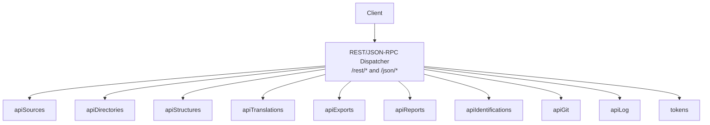
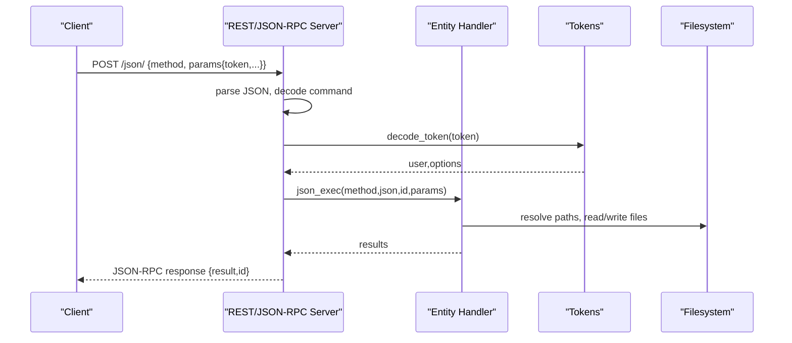
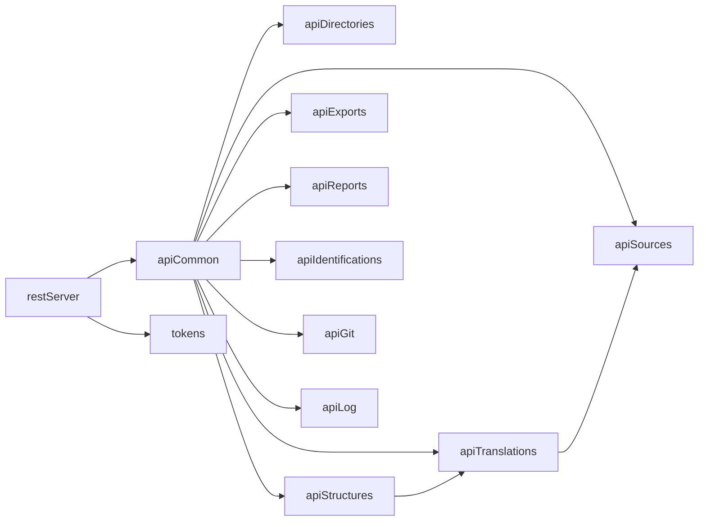

# API Reference

<cite>
**Referenced Files in This Document**
- [restServer.pl](file://src/restServer.pl)
- [apiCommon.pl](file://src/apiCommon.pl)
- [apiSources.pl](file://src/apiSources.pl)
- [apiDirectories.pl](file://src/apiDirectories.pl)
- [apiStructures.pl](file://src/apiStructures.pl)
- [apiTranslations.pl](file://src/apiTranslations.pl)
- [apiExports.pl](file://src/apiExports.pl)
- [apiReports.pl](file://src/apiReports.pl)
- [apiIdentifications.pl](file://src/apiIdentifications.pl)
- [apiGit.pl](file://src/apiGit.pl)
- [apiLog.pl](file://src/apiLog.pl)
- [tokens.pl](file://src/tokens.pl)
- [serverStart.pl](file://src/serverStart.pl)
- [README.md](file://README.md)
</cite>

## Table of Contents
1. Introduction
2. Project Structure
3. Core Components
4. Architecture Overview
5. Detailed Component Analysis
6. Dependency Analysis
7. Performance Considerations
8. Troubleshooting Guide
9. Conclusion
10. Appendices

## Introduction
This document provides comprehensive API documentation for the Kleio translation services, covering both REST endpoints and JSON-RPC methods. It details HTTP methods, URL patterns, request/response schemas, authentication, error handling, security considerations, rate limiting, versioning, common use cases, client implementation guidelines, performance optimization tips, debugging tools, monitoring approaches, migration notes, and backwards compatibility guidance.

The server exposes a unified REST/JSON-RPC interface to manage sources, structures, translations, exports, reports, identifications, directories, tokens, git operations, and logging utilities.

## Project Structure
The API is implemented as a set of Prolog modules that register HTTP handlers and dispatch requests to entity-specific handlers. The core server registers routes for /rest/* and /json/*. Each entity (sources, directories, structures, translations, exports, reports, identifications, versions, tokens, users, client_log) has its own module implementing method handlers and result formatters.

**Diagram sources**
- [restServer.pl:304-308](file://src/restServer.pl#L304-L308)
- [apiCommon.pl:90-99](file://src/apiCommon.pl#L90-L99)

**Section sources**
- [restServer.pl:304-308](file://src/restServer.pl#L304-L308)
- [apiCommon.pl:1-101](file://src/apiCommon.pl#L1-L101)

## Core Components
- REST Server and JSON-RPC dispatcher: Registers routes, decodes requests, enforces CORS, handles token authorization, and formats responses.
- Entity modules: Implement per-entity operations (get/post/put/delete), parameter parsing, permission checks, and result formatting.
- Token management: Generates, validates, and invalidates tokens; supports admin token and bootstrap flow.
- Utilities: Logging, persistence, file resolution, MIME mapping, shared counters, and worker pool integration.

Key responsibilities:
- Authentication via Bearer token or query parameter token for forms.
- Authorization via token-scoped API permissions.
- Path resolution relative to user’s source/structure directories.
- Consistent response envelope for REST and JSON-RPC.

**Section sources**
- [restServer.pl:491-515](file://src/restServer.pl#L491-L515)
- [restServer.pl:553-579](file://src/restServer.pl#L553-L579)
- [restServer.pl:656-674](file://src/restServer.pl#L656-L674)
- [tokens.pl:141-152](file://src/tokens.pl#L141-L152)
- [tokens.pl:249-257](file://src/tokens.pl#L249-L257)

## Architecture Overview
The server uses SWI-Prolog HTTP server with thread workers. Requests are dispatched by path prefix and HTTP method to entity handlers. JSON-RPC requests are handled at /json/ and support single and batch calls.

**Diagram sources**
- [restServer.pl:656-674](file://src/restServer.pl#L656-L674)
- [restServer.pl:757-766](file://src/restServer.pl#L757-L766)
- [restServer.pl:777-779](file://src/restServer.pl#L777-L779)
- [tokens.pl:141-152](file://src/tokens.pl#L141-L152)

**Section sources**
- [restServer.pl:304-308](file://src/restServer.pl#L304-L308)
- [restServer.pl:656-674](file://src/restServer.pl#L656-L674)
- [restServer.pl:757-766](file://src/restServer.pl#L757-L766)

## Detailed Component Analysis

### Authentication and Security
- Authentication:
  - Bearer token in Authorization header.
  - Query parameter token for form-based flows.
- Authorization:
  - Token carries an api list of allowed endpoints.
  - Admin token can be provided via environment variable or file.
- Bootstrap flow:
  - On startup, if no tokens exist and no admin token is configured, a temporary bootstrap token is generated and persisted for initial token creation.

Security considerations:
- Validate token presence and validity on every request.
- Enforce endpoint-level permissions before executing operations.
- Use HTTPS in production; restrict CORS origins.
- Avoid exposing sensitive logs or stack traces to clients.

Rate limiting:
- No built-in rate limiter is present. Implement at reverse proxy or gateway layer if needed.

Versioning:
- No explicit API versioning in URLs. Version info is available via server home page and configuration output.

Backwards compatibility:
- Legacy JSON-RPC signatures are supported but deprecated; prefer new signatures.

**Section sources**
- [restServer.pl:619-624](file://src/restServer.pl#L619-L624)
- [restServer.pl:270-292](file://src/restServer.pl#L270-L292)
- [tokens.pl:153-176](file://src/tokens.pl#L153-L176)
- [tokens.pl:249-257](file://src/tokens.pl#L249-L257)

### Common Request/Response Patterns
- REST:
  - Base path: /rest/<entity>/<path>
  - Parameters via query string or multipart for uploads.
  - Response format depends on Accept header or json parameter.
- JSON-RPC:
  - Endpoint: /json/
  - Payload: {id, method, params{token,path,...}}
  - Batch requests supported.

Error handling:
- REST errors return HTTP status codes and include Request-id header.
- JSON-RPC errors follow JSON-RPC 2.0 error structure.

**Section sources**
- [restServer.pl:491-515](file://src/restServer.pl#L491-L515)
- [restServer.pl:553-579](file://src/restServer.pl#L553-L579)
- [restServer.pl:676-683](file://src/restServer.pl#L676-L683)

### Sources API
Operations:
- GET /rest/sources/<path>
  - If <path> is a file: returns file content (binary/text) or download link in JSON.
  - If <path> is a directory: lists .cli/.kleio files; optional recurse=yes; url=yes to return links.
- POST /rest/sources/<path> (multipart)
  - Upload new file; destination must not exist.
- PUT /rest/sources/<path> (multipart)
  - Update existing file; destination must exist.
- POST /rest/sources/<path>?origin=<source_path>
  - Copy file from origin to destination.
- PUT /rest/sources/<path>?origin=<source_path>
  - Move file from origin to destination.
- DELETE /rest/sources/<path>
  - Delete file or directory (optionally recurse).

JSON-RPC methods:
- sources_get(params{path})
- sources_delete(params{path})
- sources_copy(params{path,origin})
- sources_move(params{path,origin})

Permissions:
- files for GET; upload for POST/PUT; delete for DELETE.

Notes:
- File downloads in REST return appropriate MIME types.
- In JSON mode, GET returns a download URL under /sources/.

**Section sources**
- [apiSources.pl:28-87](file://src/apiSources.pl#L28-L87)
- [apiSources.pl:89-104](file://src/apiSources.pl#L89-L104)
- [apiSources.pl:109-123](file://src/apiSources.pl#L109-L123)
- [apiSources.pl:125-177](file://src/apiSources.pl#L125-L177)
- [apiSources.pl:179-210](file://src/apiSources.pl#L179-L210)
- [apiSources.pl:212-245](file://src/apiSources.pl#L212-L245)
- [apiSources.pl:257-285](file://src/apiSources.pl#L257-L285)

### Directories API
Operations:
- GET /rest/directories/<path>?recurse=yes|no
  - Lists subdirectories under path.
- POST /rest/directories/<path>
  - Create directory.
- POST /rest/directories/<path>?origin=<source_dir>
  - Copy directory from origin to path.
- DELETE /rest/directories/<path>?force=yes|no
  - Remove directory; force=yes deletes contents recursively.

JSON-RPC methods:
- directories_get(params{path,recurse})
- directories_create(params{path})
- directories_copy(params{path,origin})
- directories_delete(params{path,force})

Permissions:
- files for GET; mkdir for create/copy; delete for remove.

Errors:
- Not found if path does not exist.
- Conflict if target already exists.
- Failure if directory not empty and force=no.

**Section sources**
- [apiDirectories.pl:18-35](file://src/apiDirectories.pl#L18-L35)
- [apiDirectories.pl:37-45](file://src/apiDirectories.pl#L37-L45)
- [apiDirectories.pl:47-70](file://src/apiDirectories.pl#L47-L70)
- [apiDirectories.pl:73-88](file://src/apiDirectories.pl#L73-L88)
- [apiDirectories.pl:93-147](file://src/apiDirectories.pl#L93-L147)

### Structures API
Operations:
- GET /rest/structures/<path>?kleio=<kleio_file>&recurse=yes|no
  - If kleio param provided: resolves associated structure for the given Kleio file.
  - Otherwise: returns metadata for a structure file or lists structure files (.str,.yaml,.srpt) in a directory.

JSON-RPC methods:
- structures_get(params{path,kleio,recurse})

Behavior:
- Resolves structure using same logic as translation association.
- Directory listing includes recursive search when requested.

**Section sources**
- [apiStructures.pl:22-66](file://src/apiStructures.pl#L22-L66)
- [apiStructures.pl:71-92](file://src/apiStructures.pl#L71-L92)
- [apiStructures.pl:94-144](file://src/apiStructures.pl#L94-L144)
- [apiStructures.pl:146-188](file://src/apiStructures.pl#L146-L188)

### Translations API
Operations:
- POST /rest/translations/<path>
  - Start translation for file(s) under path.
  - Options: structure, echo, recurse, spawn, status filter.
- GET /rest/translations/<path>
  - Get translation status/results for file(s) under path.
  - Supports filtering by status and caching for large sets.
- DELETE /rest/translations/<path>
  - Clean translation artifacts for file(s) under path.

JSON-RPC methods:
- translations_translate(params{path,structure,echo,recurse,spawn,status})
- translations_get(params{path,status,recurse})
- translations_delete(params{path})

Translation status fields:
- name, path, source_url, status, modified timestamps, size, directory, processing/queue times, errors, warnings, version, rpt_url, xml_url.

Parallelism:
- spawn=yes distributes work across workers; spawn=no processes sequentially with shared structure loading.

Caching:
- Status cache avoids recomputation for repeated queries within configurable age thresholds.

**Section sources**
- [apiTranslations.pl:35-83](file://src/apiTranslations.pl#L35-L83)
- [apiTranslations.pl:87-123](file://src/apiTranslations.pl#L87-L123)
- [apiTranslations.pl:125-139](file://src/apiTranslations.pl#L125-L139)
- [apiTranslations.pl:142-164](file://src/apiTranslations.pl#L142-L164)
- [apiTranslations.pl:169-233](file://src/apiTranslations.pl#L169-L233)
- [apiTranslations.pl:236-240](file://src/apiTranslations.pl#L236-L240)
- [apiTranslations.pl:242-260](file://src/apiTranslations.pl#L242-L260)
- [apiTranslations.pl:264-418](file://src/apiTranslations.pl#L264-L418)
- [apiTranslations.pl:494-577](file://src/apiTranslations.pl#L494-L577)
- [apiTranslations.pl:581-596](file://src/apiTranslations.pl#L581-L596)
- [apiTranslations.pl:598-611](file://src/apiTranslations.pl#L598-L611)
- [apiTranslations.pl:614-643](file://src/apiTranslations.pl#L614-L643)
- [apiTranslations.pl:646-723](file://src/apiTranslations.pl#L646-L723)
- [apiTranslations.pl:724-767](file://src/apiTranslations.pl#L724-L767)

### Exports API
Operations:
- GET /rest/exports/<path>
  - Retrieve XML export file or list exports under directory.

JSON-RPC methods:
- exports_get(params{path})

Implementation note:
- Delegates to sources get behavior.

**Section sources**
- [apiExports.pl:1-21](file://src/apiExports.pl#L1-L21)

### Reports API
Operations:
- GET /rest/reports/<path>
  - Retrieve translation report file or list reports under directory.

JSON-RPC methods:
- reports_get(params{path})

Implementation note:
- Delegates to sources get behavior.

**Section sources**
- [apiReports.pl:1-21](file://src/apiReports.pl#L1-L21)

### Identifications API
Operations:
- GET /rest/identifications/<path>
  - Retrieve identification files (mhk_identification*.json) or list them under directory.

JSON-RPC methods:
- identifications_get(params{path,recurse,url})

Behavior:
- Similar to sources listing but filters by identification pattern.

**Section sources**
- [apiIdentifications.pl:20-38](file://src/apiIdentifications.pl#L20-L38)
- [apiIdentifications.pl:40-42](file://src/apiIdentifications.pl#L40-L42)
- [apiIdentifications.pl:45-78](file://src/apiIdentifications.pl#L45-L78)
- [apiIdentifications.pl:80-105](file://src/apiIdentifications.pl#L80-L105)

### Git Operations API (versions)
Pseudo-paths map to git operations:
- GET /rest/versions/status/global/<path>
  - Global repository status.
- GET /rest/versions/remotes/branches/<path>
  - List remote branches.
- GET /rest/versions/user-info/<path>
  - Get configured user name/email.
- GET /rest/versions/pull/<path>
  - Pull from remote (note: internally mapped to PUT semantics).
- PUT /rest/versions/push/<path>
  - Push to remote.
- PUT /rest/versions/commit/<path>
  - Commit changes with add_files, commit_files, commit_message.
- PUT /rest/versions/set-user-info/<path>
  - Set user name/email.
- DELETE /rest/versions/reset/<path>
  - Reset repository to commit_ref with reset_mode.

JSON-RPC methods:
- versions_get_global_status(params{path})
- versions_get_remotes_branches(params{path})
- versions_get_user_info(params{path})
- versions_pull(params{path})
- versions_push(params{path})
- versions_commit(params{path,add_files,commit_files,commit_message})
- versions_set_user_info(params{path,user_name,user_email})
- versions_reset(params{path,reset_mode,commit_ref})

Permissions:
- files required for all operations.

**Section sources**
- [apiGit.pl:23-154](file://src/apiGit.pl#L23-L154)
- [apiGit.pl:156-189](file://src/apiGit.pl#L156-L189)
- [apiGit.pl:192-198](file://src/apiGit.pl#L192-L198)

### Tokens and Users API
Operations:
- POST /rest/tokens/<user>
  - Generate token for user with options (api list, data_dir, stru_dir, life_span, etc.).
- DELETE /rest/tokens/<token>
  - Invalidate a specific token.
- DELETE /rest/users/<token>
  - Invalidate all tokens for a user.

JSON-RPC methods:
- tokens_generate(params{user,info{...},token})
- tokens_invalidate(params{token,user_token})
- users_invalidate(params{user,token})

Permissions:
- generate_token to create tokens.
- invalidate_token/invalidate_user to revoke.

Admin token:
- Can be provided via KLEIO_ADMIN_TOKEN env var or file; grants full privileges.

**Section sources**
- [apiTokens.pl:18-29](file://src/apiTokens.pl#L18-L29)
- [apiTokens.pl:30-39](file://src/apiTokens.pl#L30-L39)
- [apiTokens.pl:41-88](file://src/apiTokens.pl#L41-L88)
- [apiTokens.pl:90-122](file://src/apiTokens.pl#L90-L122)
- [tokens.pl:104-139](file://src/tokens.pl#L104-L139)
- [tokens.pl:153-176](file://src/tokens.pl#L153-L176)

### Client Log API
Operations:
- POST /rest/client_log
  - Send debug message to server logs.

JSON-RPC methods:
- client_log_send(params{message,level})

Permissions:
- files privilege required.

**Section sources**
- [apiLog.pl:15-27](file://src/apiLog.pl#L15-L27)
- [apiLog.pl:30-33](file://src/apiLog.pl#L30-L33)

### Error Handling Strategies
- REST:
  - Throws http_reply exceptions with status codes (not_found, forbidden, bad_request, method_not_allowed).
  - Includes Request-id header for correlation.
- JSON-RPC:
  - Wraps errors into JSON-RPC error objects with code/message.
  - Parse errors map to standard JSON-RPC codes.

Examples of error conditions:
- Missing token or invalid token.
- Forbidden due to insufficient permissions.
- Destination file exists (POST upload) or missing (PUT update).
- Directory not empty when deleting without force.

**Section sources**
- [restServer.pl:553-579](file://src/restServer.pl#L553-L579)
- [restServer.pl:676-683](file://src/restServer.pl#L676-L683)
- [apiSources.pl:125-177](file://src/apiSources.pl#L125-L177)
- [apiDirectories.pl:93-147](file://src/apiDirectories.pl#L93-L147)

### Monitoring and Debugging
- Home page shows server stats, configuration, and processing status.
- Shared counters track REST and JSON-RPC request counts.
- Logging levels configurable; debug mode prints detailed request logs.
- Idle detection allows auto-stopping servers after inactivity.

**Section sources**
- [restServer.pl:424-447](file://src/restServer.pl#L424-L447)
- [restServer.pl:375-386](file://src/restServer.pl#L375-L386)
- [restServer.pl:358-367](file://src/restServer.pl#L358-L367)
- [serverStart.pl:74-91](file://src/serverStart.pl#L74-L91)

## Dependency Analysis
High-level dependencies among API modules and core components:

**Diagram sources**
- [apiCommon.pl:90-99](file://src/apiCommon.pl#L90-L99)
- [apiTranslations.pl:22-33](file://src/apiTranslations.pl#L22-L33)
- [apiStructures.pl:16-20](file://src/apiStructures.pl#L16-L20)
- [restServer.pl:151-162](file://src/restServer.pl#L151-L162)

**Section sources**
- [apiCommon.pl:90-99](file://src/apiCommon.pl#L90-L99)
- [apiTranslations.pl:22-33](file://src/apiTranslations.pl#L22-L33)
- [apiStructures.pl:16-20](file://src/apiStructures.pl#L16-L20)
- [restServer.pl:151-162](file://src/restServer.pl#L151-L162)

## Performance Considerations
- Worker threads: Configurable via KLEIO_SERVER_WORKERS; affects concurrency for translations and general requests.
- Translation parallelism: spawn=yes distributes jobs across workers; spawn=no serializes with shared structure loading.
- Status caching: translations_get caches results for large sets with adjustable max_age thresholds.
- Timeouts: Server timeout configurable via KLEIO_IDLE_TIMEOUT; request time limits enforced per handler.
- I/O: File operations are direct; ensure adequate disk throughput and avoid excessive recursion on large trees.

[No sources needed since this section provides general guidance]

## Troubleshooting Guide
Common issues and resolutions:
- Missing token: Ensure Authorization header contains Bearer token or pass token parameter for forms.
- Forbidden: Verify token has required api permissions for the endpoint.
- Bad request: Check multipart uploads include file field; validate destination existence for PUT.
- Not found: Confirm path resolution and that referenced files/directories exist.
- Directory not empty: Use force=yes when deleting directories.

Debugging steps:
- Enable debug logging and inspect server logs.
- Use client_log_send to inject messages into server logs.
- Check home page for server status and counters.
- Use Postman collection and tests for validation.

**Section sources**
- [restServer.pl:619-624](file://src/restServer.pl#L619-L624)
- [apiSources.pl:125-177](file://src/apiSources.pl#L125-L177)
- [apiDirectories.pl:93-147](file://src/apiDirectories.pl#L93-L147)
- [apiLog.pl:15-27](file://src/apiLog.pl#L15-L27)
- [restServer.pl:424-447](file://src/restServer.pl#L424-L447)

## Conclusion
The Kleio translation services provide a robust REST/JSON-RPC API for managing sources, structures, translations, exports, reports, identifications, directories, tokens, git operations, and logging. The design emphasizes secure token-based access control, consistent error handling, and flexible request/response formats. For production deployments, configure CORS, enforce HTTPS, and consider external rate limiting. Use the provided debugging and monitoring features to maintain operational visibility.

[No sources needed since this section summarizes without analyzing specific files]

## Appendices

### Environment Variables and Configuration
- KLEIO_HOME_DIR: Base directory.
- KLEIO_SOURCE_DIR: Default sources directory.
- KLEIO_CONF_DIR: Configuration directory.
- KLEIO_STRU_DIR: Structures directory.
- KLEIO_TOKEN_DB: Token database file.
- KLEIO_DEFAULT_STRU: Default structure file.
- KLEIO_DEBUGGER_PORT: Debug server port.
- KLEIO_SERVER_PORT: REST server port.
- KLEIO_SERVER_WORKERS: Number of worker threads.
- KLEIO_IDLE_TIMEOUT: Idle timeout seconds.
- KLEIO_ADMIN_TOKEN: Admin token value.
- KLEIO_CORS_SITES: Allowed CORS sites.

**Section sources**
- [restServer.pl:107-118](file://src/restServer.pl#L107-L118)
- [restServer.pl:175-184](file://src/restServer.pl#L175-L184)
- [serverStart.pl:101-139](file://src/serverStart.pl#L101-L139)

### Migration Notes and Backwards Compatibility
- Deprecated JSON-RPC signatures: Old style method(RequestId,Params,Results) is still supported but deprecated; prefer new style method(json,Id,Params).
- Versions pull pseudo-path: Internally maps to PUT semantics; clients should treat it as a write operation.
- Result envelopes: Both REST and JSON-RPC use default_results for consistent formatting; ensure clients parse accordingly.

**Section sources**
- [restServer.pl:650-654](file://src/restServer.pl#L650-L654)
- [apiGit.pl:70-82](file://src/apiGit.pl#L70-L82)

### Client Implementation Guidelines
- Always include token in requests; prefer Authorization header.
- Handle HTTP status codes and JSON-RPC error objects.
- For uploads, use multipart/form-data with file field.
- For directory listings, use recurse=yes when needed; consider url=yes to receive download links.
- For translations, use spawn=yes for parallel processing in multi-user environments; otherwise use spawn=no for efficiency.

[No sources needed since this section provides general guidance]