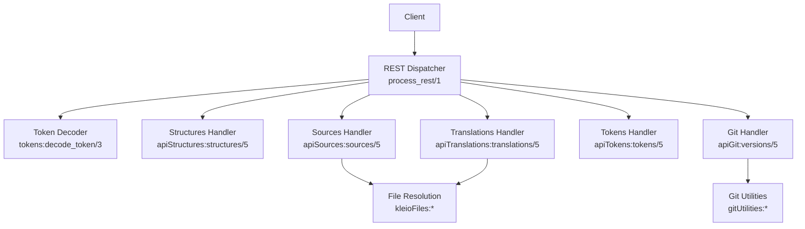
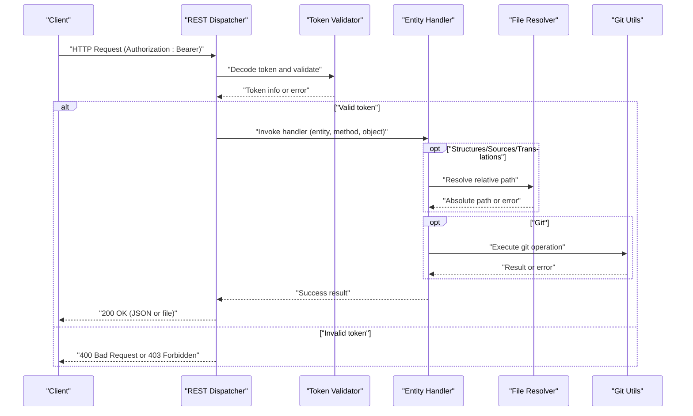
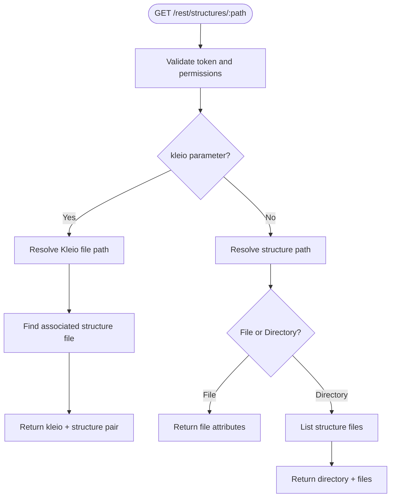
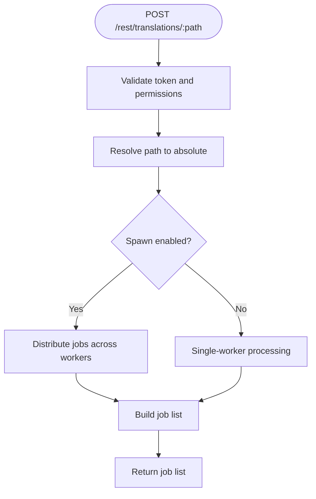
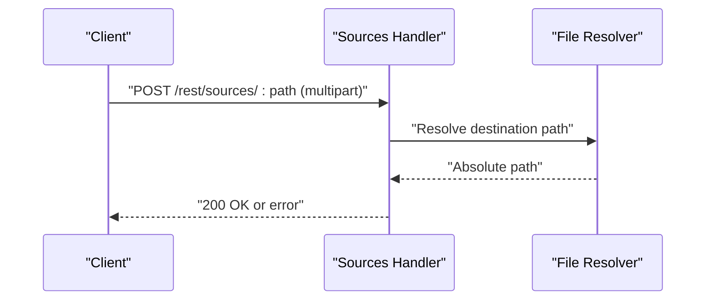
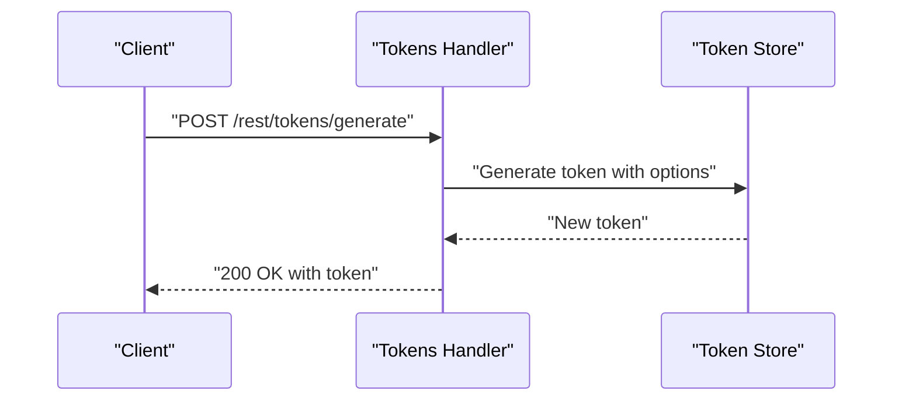
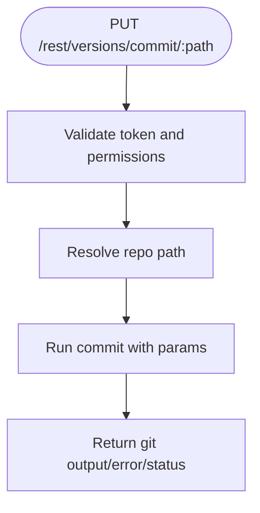
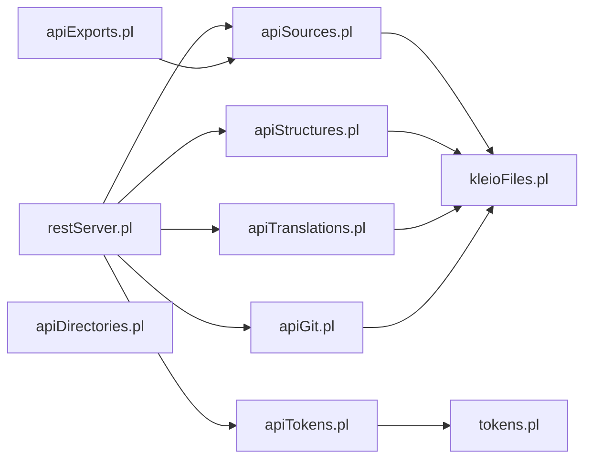

# API Reference

<cite>
**Referenced Files in This Document**
- [restServer.pl](file://src/restServer.pl)
- [apiStructures.pl](file://src/apiStructures.pl)
- [apiTranslations.pl](file://src/apiTranslations.pl)
- [apiSources.pl](file://src/apiSources.pl)
- [apiTokens.pl](file://src/apiTokens.pl)
- [apiGit.pl](file://src/apiGit.pl)
- [kleioFiles.pl](file://src/kleioFiles.pl)
- [tokens.pl](file://src/tokens.pl)
- [apiCommon.pl](file://src/apiCommon.pl)
- [apiExports.pl](file://src/apiExports.pl)
- [apiDirectories.pl](file://src/apiDirectories.pl)
- [docServer.pl](file://src/docServer.pl)
- [api/postman/api.json](file://api/postman/api.json)
- [api/postman/environment.json](file://api/postman/environment.json)
- [README.md](file://README.md)
- [docs/doc/client_setup.md](file://docs/doc/client_setup.md)
- [docs/doc/stru_file_location.md](file://docs/doc/stru_file_location.md)
</cite>

## Update Summary
**Changes Made**
- Added comprehensive documentation for the new Structures API endpoint
- Enhanced documentation generation system coverage
- Updated file resolution capabilities documentation
- Added authentication validation and testing infrastructure details

## Table of Contents
1. [Introduction](#introduction)
2. [Project Structure](#project-structure)
3. [Core Components](#core-components)
4. [Architecture Overview](#architecture-overview)
5. [Detailed Component Analysis](#detailed-component-analysis)
6. [Dependency Analysis](#dependency-analysis)
7. [Performance Considerations](#performance-considerations)
8. [Troubleshooting Guide](#troubleshooting-guide)
9. [Conclusion](#conclusion)
10. [Appendices](#appendices)

## Introduction
This document provides comprehensive API documentation for the REST and JSON-RPC endpoints exposed by the kleio-server. It covers authentication via bearer tokens, endpoint semantics, request/response schemas, parameter validation, error handling, and operational guidance. It focuses on the following endpoint groups:
- Structures service: GET /structures, POST /structures/get
- Translations service: POST /translations, GET /translations/:id
- Sources management: GET /sources, POST /sources/upload
- File operations: GET /files/*, POST /files/copy
- Token management: POST /tokens/generate, POST /tokens/invalidate
- Git integration: POST /git/pull, POST /git/push

The server supports both REST and JSON-RPC protocols. Authentication is mandatory and enforced via bearer tokens issued by the server.

## Project Structure
The API surface is implemented across modular Prolog modules. The REST dispatcher routes requests to entity-specific handlers, which validate tokens, resolve paths, and execute operations. Supporting modules provide token management, file resolution, and Git utilities.

**Diagram sources**
- [restServer.pl:491-515](file://src/restServer.pl#L491-L515)
- [apiStructures.pl:1-21](file://src/apiStructures.pl#L1-L21)
- [apiSources.pl:28-174](file://src/apiSources.pl#L28-L174)
- [apiTranslations.pl:34-82](file://src/apiTranslations.pl#L34-L82)
- [apiTokens.pl:18-28](file://src/apiTokens.pl#L18-L28)
- [apiGit.pl:23-108](file://src/apiGit.pl#L23-L108)
- [kleioFiles.pl:753-800](file://src/kleioFiles.pl#L753-L800)
- [tokens.pl:141-151](file://src/tokens.pl#L141-L151)

**Section sources**
- [restServer.pl:491-515](file://src/restServer.pl#L491-L515)
- [apiCommon.pl:28-76](file://src/apiCommon.pl#L28-L76)

## Core Components
- REST Dispatcher: Parses requests, extracts Authorization, resolves entity/object/method, validates uploads, and invokes handlers.
- Token System: Validates bearer tokens and enforces API permissions per token.
- Entity Handlers: Implement specific operations for structures, sources, translations, tokens, directories, exports, and git.
- File Utilities: Resolve relative paths to absolute locations under the configured home directory and enforce security by returning relative paths in responses.
- Git Utilities: Provide repository status, remotes, pull, push, commit, set user info, and reset operations.

Key behaviors:
- Authentication: All endpoints require a valid bearer token; missing or invalid tokens cause HTTP 400 or 403 responses.
- CORS: Enabled globally with configurable allowed origins via environment variable.
- Uploads: Multipart POST/PUT for file uploads; upload permission is validated per token.
- JSON vs REST: JSON-RPC uses method names and params; REST uses resource paths and query parameters.

**Section sources**
- [restServer.pl:553-579](file://src/restServer.pl#L553-L579)
- [restServer.pl:590-600](file://src/restServer.pl#L590-L600)
- [tokens.pl:141-151](file://src/tokens.pl#L141-L151)
- [kleioFiles.pl:753-800](file://src/kleioFiles.pl#L753-L800)

## Architecture Overview
The server exposes a unified REST interface with JSON-RPC support. Requests are authenticated centrally, routed to entity handlers, and executed with appropriate permission checks. Responses are formatted consistently, and file downloads are served directly when requested.

**Diagram sources**
- [restServer.pl:491-515](file://src/restServer.pl#L491-L515)
- [restServer.pl:553-579](file://src/restServer.pl#L553-L579)
- [tokens.pl:141-151](file://src/tokens.pl#L141-L151)
- [apiStructures.pl:38-66](file://src/apiStructures.pl#L38-L66)
- [apiSources.pl:28-104](file://src/apiSources.pl#L28-L104)
- [apiTranslations.pl:34-82](file://src/apiTranslations.pl#L34-L82)
- [apiGit.pl:23-108](file://src/apiGit.pl#L23-L108)

## Detailed Component Analysis

### Structures Service
- Endpoint: GET /rest/structures/:path
  - Purpose: Retrieve structure file information or list structure files in a directory.
  - Authentication: Requires token with files permission.
  - Parameters:
    - kleio: Optional path to a Kleio source file to find its associated structure.
    - recurse: yes/no for recursive directory listing.
  - Response: Single file info or directory listing with structure files (.str, .yaml, .srpt).

- Endpoint: POST /rest/structures/get
  - Purpose: JSON-RPC method to retrieve structure information.
  - Authentication: Requires token with files permission.
  - Parameters:
    - path: Structure file or directory path.
    - kleio: Optional Kleio source file path for structure resolution.
    - recurse: yes/no for recursive directory listing.
  - Response: Dictionary containing structure information.

**Updated** Added comprehensive structures endpoint with file resolution capabilities and authentication validation.

**Diagram sources**
- [apiStructures.pl:38-66](file://src/apiStructures.pl#L38-L66)
- [apiStructures.pl:77-92](file://src/apiStructures.pl#L77-L92)
- [apiStructures.pl:94-134](file://src/apiStructures.pl#L94-L134)

**Section sources**
- [apiStructures.pl:22-66](file://src/apiStructures.pl#L22-L66)
- [apiStructures.pl:71-92](file://src/apiStructures.pl#L71-L92)
- [apiStructures.pl:94-144](file://src/apiStructures.pl#L94-L144)
- [kleioFiles.pl:26-28](file://src/kleioFiles.pl#L26-L28)

Practical examples:
- Get structure for a specific Kleio file (JSON-RPC):
  - {"jsonrpc":"2.0","method":"structures_get","params":{"kleio":"sources/api/paroquiais/baptismos/bapt1714.cli"},"id":1,"token":"YOUR_TOKEN"}
- List structure files in a directory (REST):
  - curl -X GET "http://localhost:8088/rest/structures/structures" -H "Authorization: Bearer YOUR_TOKEN" -H "Content-Type: application/json" -d '{"recurse":"yes"}'
- Get single structure file info (REST):
  - curl -X GET "http://localhost:8088/rest/structures/system/conf/kleio/stru/gacto2.str" -H "Authorization: Bearer YOUR_TOKEN"

### Translations Service
- Endpoint: POST /rest/translations/:path
  - Purpose: Start translation for a file or directory.
  - Authentication: Requires token with translations permission.
  - Parameters:
    - structure: Optional structure file to use.
    - echo: Include source lines in report if yes.
    - recurse: Descend into subdirectories if yes.
    - spawn: Distribute jobs across workers if yes; otherwise single-worker mode.
    - status: Filter by translation status (when used with GET).
  - Response: List of jobs with associated files.
  - Notes: Supports both REST and JSON-RPC (translations_translate).

- Endpoint: GET /rest/translations/:path
  - Purpose: Retrieve translation status/results (kleio_set).
  - Authentication: Requires files permission.
  - Parameters:
    - recurse: yes/no.
    - status: Filter by status.
    - url: yes to return URLs for retrieval.
  - Response: List of files with status, timestamps, sizes, and derived URLs.

- Endpoint: DELETE /rest/translations/:path
  - Purpose: Clear translation results (derived files).
  - Authentication: Requires translations permission.
  - Behavior: Deletes rpt, err, xml, ids, files.json, old; preserves original.

**Diagram sources**
- [apiTranslations.pl:52-82](file://src/apiTranslations.pl#L52-L82)
- [apiTranslations.pl:241-253](file://src/apiTranslations.pl#L241-L253)

**Section sources**
- [apiTranslations.pl:34-139](file://src/apiTranslations.pl#L34-L139)
- [apiTranslations.pl:141-163](file://src/apiTranslations.pl#L141-L163)
- [apiTranslations.pl:86-123](file://src/apiTranslations.pl#L86-L123)
- [apiTranslations.pl:124-139](file://src/apiTranslations.pl#L124-L139)
- [kleioFiles.pl:53-92](file://src/kleioFiles.pl#L53-L92)

Practical examples:
- Start translation for a directory (REST):
  - curl -X POST "http://localhost:8088/rest/translations/sources/api/paroquiais" -H "Authorization: Bearer YOUR_TOKEN" -H "Content-Type: application/json" -d '{"recurse":"yes","spawn":"yes"}'
- Start translation for a file (JSON-RPC):
  - {"jsonrpc":"2.0","method":"translations_translate","params":{"path":"sources/api/paroquiais/baptismos/bapt1714.cli","echo":"no","structure":"system/conf/kleio/stru/gacto2.str"},"id":1,"token":"YOUR_TOKEN"}

### Sources Management
- Endpoint: GET /rest/sources/:path
  - Purpose: Download a file or list files in a directory.
  - Authentication: Requires files permission.
  - Parameters:
    - url: yes to return URLs instead of raw content.
    - recurse: yes to recurse into subdirectories.
  - Response: File content (binary) or list of files/URLs.

- Endpoint: POST /rest/sources/:path (multipart/form-data)
  - Purpose: Upload a new file to :path.
  - Authentication: Requires upload permission.
  - Constraints: Destination must not exist; directory must exist.
  - Response: Success result.

- Endpoint: PUT /rest/sources/:path (multipart/form-data)
  - Purpose: Replace an existing file at :path.
  - Authentication: Requires upload permission.
  - Constraints: Destination must exist; directory must exist.
  - Response: Success result.

- Endpoint: POST /rest/sources/:path?origin=:dest (copy)
  - Purpose: Copy an existing file to a new location.
  - Authentication: Requires upload permission.
  - Constraints: Destination must not exist; directory must exist.
  - Response: Success result.

- Endpoint: PUT /rest/sources/:path?origin=:dest (move)
  - Purpose: Move an existing file to a new location.
  - Authentication: Requires upload permission.
  - Constraints: Destination must not exist; directory must exist.
  - Response: Success result.

- Endpoint: DELETE /rest/sources/:path
  - Purpose: Delete a file or directory (recursively).
  - Authentication: Requires delete permission.
  - Constraints: Cannot delete files currently queued or processing; deletes derived artifacts.
  - Response: List of deleted items.

**Diagram sources**
- [apiSources.pl:125-142](file://src/apiSources.pl#L125-L142)
- [apiSources.pl:324-352](file://src/apiSources.pl#L324-L352)

**Section sources**
- [apiSources.pl:28-104](file://src/apiSources.pl#L28-L104)
- [apiSources.pl:109-124](file://src/apiSources.pl#L109-L124)
- [apiSources.pl:145-173](file://src/apiSources.pl#L145-L173)
- [apiSources.pl:324-411](file://src/apiSources.pl#L324-L411)
- [kleioFiles.pl:111-144](file://src/kleioFiles.pl#L111-L144)

Practical examples:
- Upload a file (REST):
  - curl -X POST "http://localhost:8088/rest/sources/myfolder/newfile.cli" -H "Authorization: Bearer YOUR_TOKEN" -F "file=@/path/to/local/file.cli"
- Copy a file (REST):
  - curl -X POST "http://localhost:8088/rest/sources/target.cli?origin=sources/original.cli" -H "Authorization: Bearer YOUR_TOKEN"
- Delete a directory (REST):
  - curl -X DELETE "http://localhost:8088/rest/sources/myfolder" -H "Authorization: Bearer YOUR_TOKEN"

### File Operations
- Endpoint: GET /rest/files/*
  - Purpose: Download a file by constructing a sources URL.
  - Authentication: Requires files permission.
  - Behavior: Returns file content directly or a redirect to a signed URL.

- Endpoint: POST /rest/files/copy
  - Purpose: Copy a file from origin to destination.
  - Authentication: Requires upload permission.
  - Parameters: origin, destination.
  - Response: Success result.

- Endpoint: POST /rest/files/move
  - Purpose: Move a file from origin to destination.
  - Authentication: Requires upload permission.
  - Parameters: origin, destination.
  - Response: Success result.

Notes:
- The server constructs URLs for file retrieval using the sources base path and returns relative paths to avoid exposing absolute filesystem locations.

**Section sources**
- [apiExports.pl:14-19](file://src/apiExports.pl#L14-L19)
- [apiSources.pl:354-411](file://src/apiSources.pl#L354-L411)
- [kleioFiles.pl:753-800](file://src/kleioFiles.pl#L753-L800)

### Token Management
- Endpoint: POST /rest/tokens/generate
  - Purpose: Generate a new token for a user.
  - Authentication: Requires token with generate_token permission.
  - Parameters:
    - user: Username.
    - info: JSON object with comment, api permissions, structures, sources.
  - Response: New token string.

- Endpoint: POST /rest/tokens/invalidate
  - Purpose: Invalidate a specific token.
  - Authentication: Requires token with invalidate_token permission.
  - Parameters:
    - user_token: Token to invalidate.
  - Response: The invalidated token.

- Endpoint: DELETE /rest/users/:token
  - Purpose: Invalidate all tokens for a user.
  - Authentication: Requires token with invalidate_user permission.
  - Response: The user whose tokens were invalidated.

**Diagram sources**
- [apiTokens.pl:22-28](file://src/apiTokens.pl#L22-L28)
- [apiTokens.pl:71-88](file://src/apiTokens.pl#L71-L88)
- [tokens.pl:104-139](file://src/tokens.pl#L104-L139)

**Section sources**
- [apiTokens.pl:18-28](file://src/apiTokens.pl#L18-L28)
- [apiTokens.pl:38-39](file://src/apiTokens.pl#L38-L39)
- [apiTokens.pl:71-122](file://src/apiTokens.pl#L71-L122)
- [tokens.pl:104-139](file://src/tokens.pl#L104-L139)

Practical examples:
- Generate a token (JSON-RPC via Postman collection):
  - Method: tokens_generate
  - Params: {user: "tester", info: {api: ["sources","translations","upload","delete"], sources:"sources/api_tests"}, token:"ADMIN_TOKEN"}
- Invalidate a token (REST):
  - curl -X DELETE "http://localhost:8088/rest/tokens/ABC123" -H "Authorization: Bearer ADMIN_TOKEN" -H "Content-Type: application/json" -d '{"user_token":"ABC123"}'

### Git Integration
- Endpoint: GET /rest/versions/status/global/:path
  - Purpose: Retrieve global repository status.
  - Authentication: Requires files permission.
  - Response: Structured status object.

- Endpoint: GET /rest/versions/remotes/branches/:path
  - Purpose: List remote branches.
  - Authentication: Requires files permission.
  - Response: Branch list.

- Endpoint: GET /rest/versions/user-info/:path
  - Purpose: Get configured user name/email.
  - Authentication: Requires files permission.
  - Response: {git_user_name, git_user_email}.

- Endpoint: GET /rest/versions/pull/:path
  - Purpose: Perform pull from remote.
  - Authentication: Requires files permission.
  - Response: {git_output, git_error, git_exit_status}.

- Endpoint: PUT /rest/versions/push/:path
  - Purpose: Perform push to remote.
  - Authentication: Requires files permission.
  - Response: {git_output, git_error, git_exit_status}.

- Endpoint: PUT /rest/versions/commit/:path
  - Purpose: Commit staged/changed files.
  - Authentication: Requires files permission.
  - Parameters: commit_files, add_files, commit_message.
  - Response: {git_output, git_error, git_exit_status}.

- Endpoint: PUT /rest/versions/set-user-info/:path
  - Purpose: Set user name/email.
  - Authentication: Requires files permission.
  - Parameters: user_name, user_email.
  - Response: {git_output, git_error, git_exit_status}.

- Endpoint: DELETE /rest/versions/reset/:path
  - Purpose: Reset working tree to a commit.
  - Authentication: Requires files permission.
  - Parameters: reset_mode, commit_ref.
  - Response: {git_output, git_error, git_exit_status}.

**Diagram sources**
- [apiGit.pl:110-124](file://src/apiGit.pl#L110-L124)
- [apiGit.pl:126-154](file://src/apiGit.pl#L126-L154)

**Section sources**
- [apiGit.pl:23-108](file://src/apiGit.pl#L23-L108)
- [apiGit.pl:156-189](file://src/apiGit.pl#L156-L189)

Practical examples:
- Pull (REST):
  - curl -X GET "http://localhost:8088/rest/versions/pull/sources/api_tests" -H "Authorization: Bearer YOUR_TOKEN"
- Push (REST):
  - curl -X PUT "http://localhost:8088/rest/versions/push/sources/api_tests" -H "Authorization: Bearer YOUR_TOKEN"
- Commit (REST):
  - curl -X PUT "http://localhost:8088/rest/versions/commit/sources/api_tests" -H "Authorization: Bearer YOUR_TOKEN" -H "Content-Type: application/json" -d '{"add_files":".","commit_files":".","commit_message":"Update"}'

## Dependency Analysis
The following diagram shows key dependencies among modules involved in API handling.

**Diagram sources**
- [restServer.pl:491-515](file://src/restServer.pl#L491-L515)
- [apiStructures.pl:1-21](file://src/apiStructures.pl#L1-L21)
- [apiSources.pl:28-104](file://src/apiSources.pl#L28-L104)
- [apiTranslations.pl:34-82](file://src/apiTranslations.pl#L34-L82)
- [apiTokens.pl:18-28](file://src/apiTokens.pl#L18-L28)
- [apiGit.pl:23-108](file://src/apiGit.pl#L23-L108)
- [kleioFiles.pl:753-800](file://src/kleioFiles.pl#L753-L800)
- [tokens.pl:141-151](file://src/tokens.pl#L141-L151)
- [apiExports.pl:14-19](file://src/apiExports.pl#L14-L19)

**Section sources**
- [restServer.pl:491-515](file://src/restServer.pl#L491-L515)
- [apiCommon.pl:78-88](file://src/apiCommon.pl#L78-L88)

## Performance Considerations
- Concurrency: The server uses worker threads configured via environment variable. Adjust workers to balance throughput and resource usage.
- Translation scheduling: Use spawn=yes for parallel processing; spawn=no reduces contention for shared resources.
- Caching: Translations GET caches status results for repeated queries to reduce load.
- File serving: Binary file downloads are streamed directly by the server to minimize memory overhead.
- Structures resolution: Directory traversal uses efficient file filtering to minimize I/O operations.

[No sources needed since this section provides general guidance]

## Troubleshooting Guide
Common issues and resolutions:
- Authentication failures:
  - Cause: Missing or invalid Authorization header.
  - Resolution: Obtain a valid token from the admin and include "Authorization: Bearer YOUR_TOKEN".
- Permission denied:
  - Cause: Token lacks required API permission (e.g., upload, delete, translations, files).
  - Resolution: Generate a token with appropriate api permissions.
- File not found:
  - Cause: Path does not exist or is outside the configured sources area.
  - Resolution: Verify relative path under sources and ensure directories exist.
- Upload conflicts:
  - Cause: Destination file exists for POST or missing for PUT.
  - Resolution: Use POST for new files, PUT for replacement, or delete the destination first.
- Git errors:
  - Cause: Invalid repository path or credentials.
  - Resolution: Ensure path resolves to a valid Git repository and credentials are configured.
- Structures resolution failures:
  - Cause: Invalid structure file path or missing associated structure.
  - Resolution: Verify structure file exists and is accessible to the requesting user.

Monitoring:
- Server logs: Enable debug mode via environment variable to capture detailed logs.
- Health endpoint: The server's home page displays request counts and processing status.

**Section sources**
- [restServer.pl:553-579](file://src/restServer.pl#L553-L579)
- [tokens.pl:249-257](file://src/tokens.pl#L249-L257)
- [kleioFiles.pl:284-292](file://src/kleioFiles.pl#L284-L292)
- [README.md:125-146](file://README.md#L125-L146)

## Conclusion
The kleio-server provides a robust REST and JSON-RPC interface for managing Kleio sources, translations, tokens, and Git operations. By enforcing bearer token authentication, validating permissions, and offering flexible parameterization, it enables secure and scalable integrations. The addition of the structures endpoint enhances the server's capability to manage and resolve structure files efficiently. Use the examples and guidelines above to implement clients and automate workflows effectively.

[No sources needed since this section summarizes without analyzing specific files]

## Appendices

### Authentication and Authorization
- Header: Authorization: Bearer YOUR_TOKEN
- Token validation occurs centrally; handlers rely on decoded token info to enforce permissions.
- Admin token: Set via environment variable or generated automatically at startup.

**Section sources**
- [restServer.pl:615-624](file://src/restServer.pl#L615-L624)
- [tokens.pl:141-151](file://src/tokens.pl#L141-L151)
- [README.md:92-112](file://README.md#L92-L112)

### CORS Configuration
- Configure allowed origins via environment variable; defaults allow all when not set.
- Preflight OPTIONS requests are supported.

**Section sources**
- [restServer.pl:183-184](file://src/restServer.pl#L183-L184)
- [restServer.pl:492-496](file://src/restServer.pl#L492-L496)

### Rate Limiting
- No built-in rate limiting is implemented in the server code. Consider deploying behind a reverse proxy with rate limiting policies if needed.

[No sources needed since this section provides general guidance]

### Practical Examples and Postman
- Postman collection and environment files demonstrate typical workflows and token usage patterns.

**Section sources**
- [api/postman/api.json:1-800](file://api/postman/api.json#L1-L800)
- [api/postman/environment.json:1-109](file://api/postman/environment.json#L1-L109)

### Client Setup
- Discover server parameters (URL, admin token) via the generated configuration file or environment variables.

**Section sources**
- [docs/doc/client_setup.md:1-284](file://docs/doc/client_setup.md#L1-L284)
- [README.md:64-66](file://README.md#L64-L66)

### Documentation Generation System
- The server includes a built-in documentation generation system using SWI-Prolog's PlDoc.
- Access documentation server at localhost:4040 for local code documentation.
- Documentation can be started with the docServer.pl script in development environments.

**Section sources**
- [docServer.pl:1-20](file://src/docServer.pl#L1-L20)

### Structure File Location Strategy
- Structure files (.str, .yaml, .srpt) can be located in multiple positions relative to source files.
- Priority order for structure resolution:
  1. `structures/SUBPATH/FILENAME.str` (file-specific)
  2. `structures/SUBPATH2/gacto2.str` (parent directory)
  3. `structures/DIRECTORYNAME.str` (directory-specific)
  4. `structures/gacto2.str` (global default)

**Section sources**
- [docs/doc/stru_file_location.md:1-34](file://docs/doc/stru_file_location.md#L1-L34)
- [apiTranslations.pl:384-417](file://src/apiTranslations.pl#L384-L417)