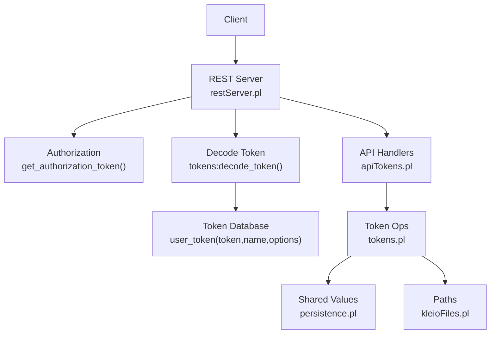
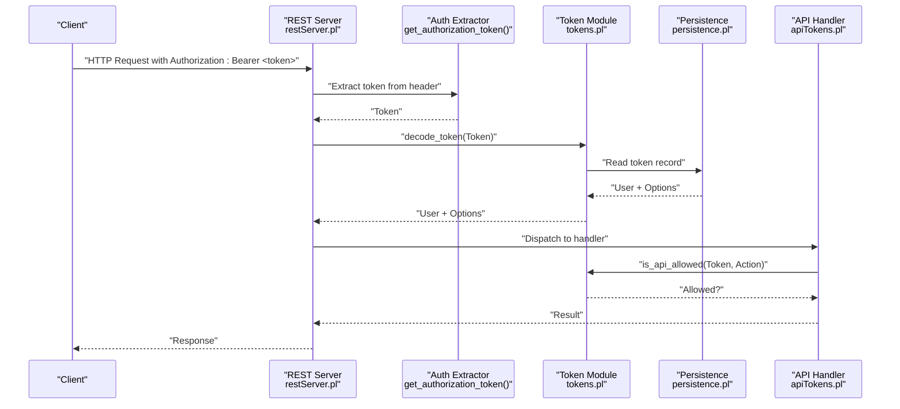
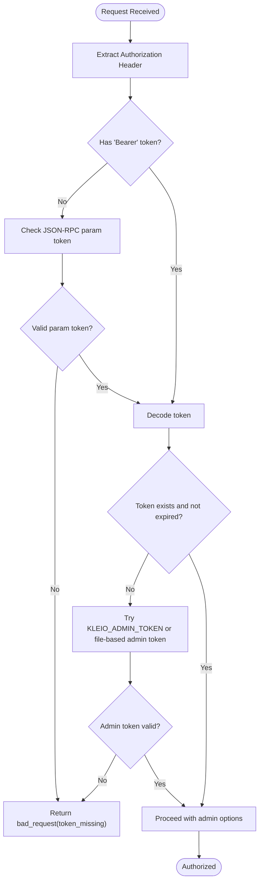
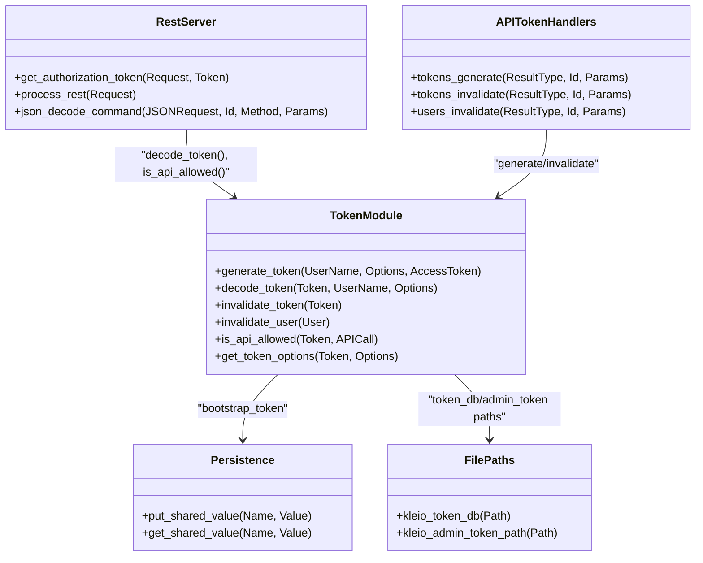
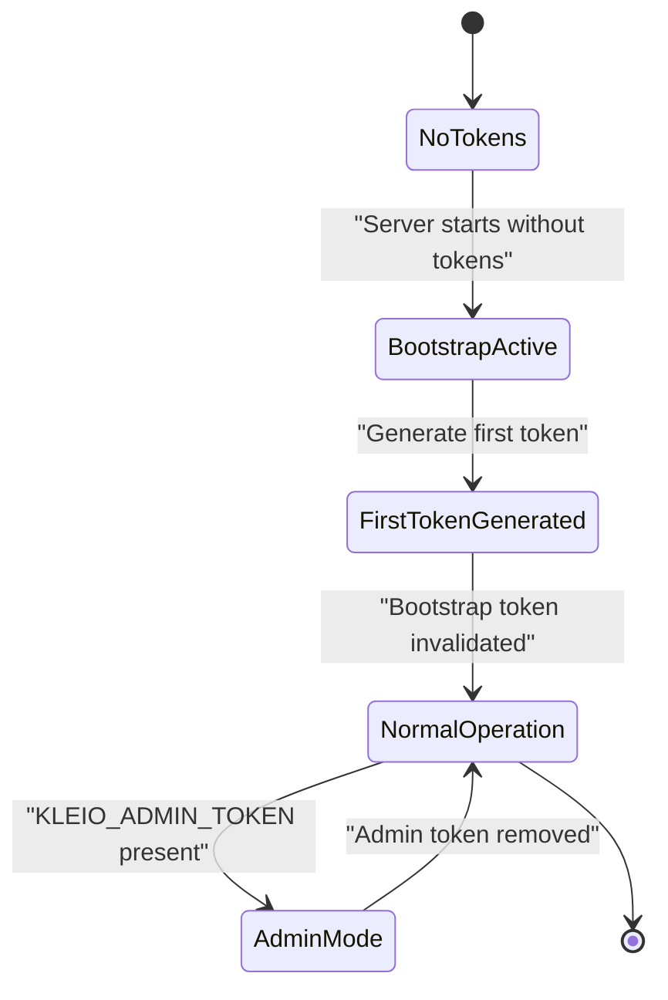
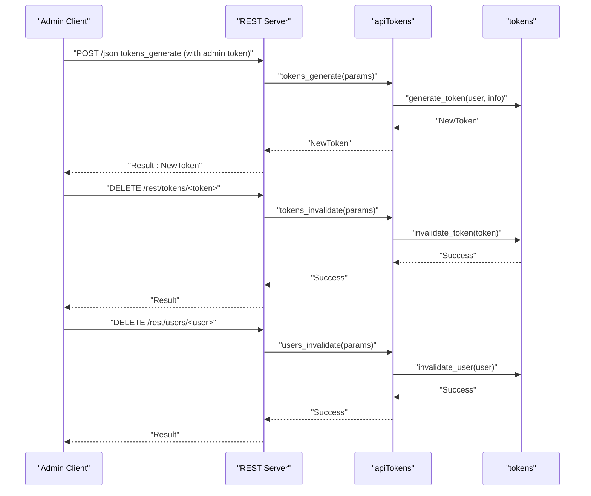
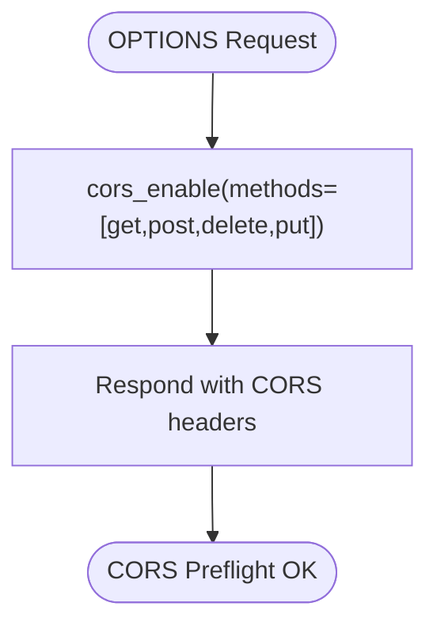
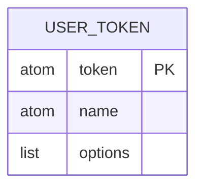
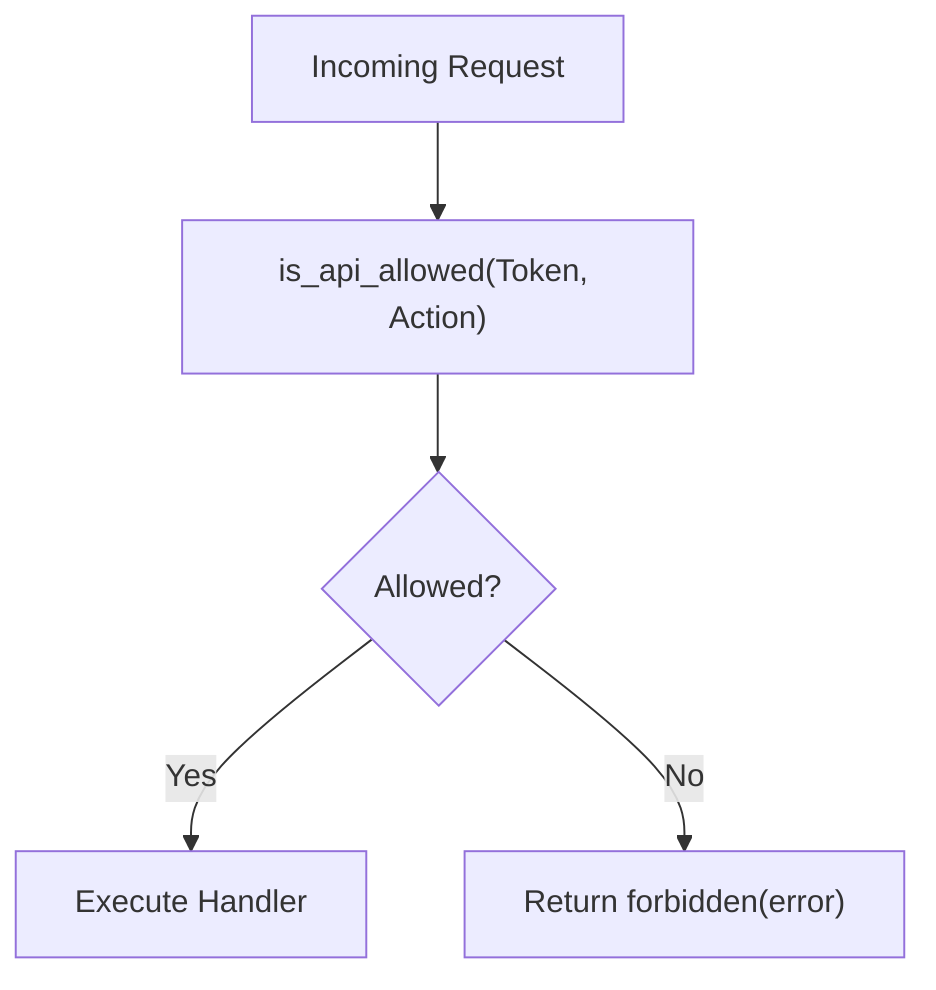
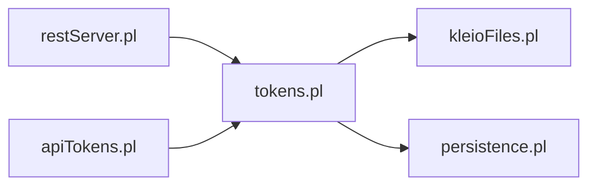

# Authentication & Authorization

<cite>
**Referenced Files in This Document**
- [restServer.pl](file://src/restServer.pl)
- [tokens.pl](file://src/tokens.pl)
- [apiTokens.pl](file://src/apiTokens.pl)
- [kleioFiles.pl](file://src/kleioFiles.pl)
- [persistence.pl](file://src/persistence.pl)
- [api.json](file://api/postman/api.json)
- [.env-sample](file://.env-sample)
</cite>

## Table of Contents
1. [Introduction](#introduction)
2. [Project Structure](#project-structure)
3. [Core Components](#core-components)
4. [Architecture Overview](#architecture-overview)
5. [Detailed Component Analysis](#detailed-component-analysis)
6. [Dependency Analysis](#dependency-analysis)
7. [Performance Considerations](#performance-considerations)
8. [Troubleshooting Guide](#troubleshooting-guide)
9. [Conclusion](#conclusion)
10. [Appendices](#appendices)

## Introduction
This document describes the Kleio API authentication and authorization model. It explains how token-based access control works, including Bearer tokens in Authorization headers, token generation and validation, permission levels (admin, user, bootstrap), token lifecycle management, CORS configuration, and integration with external authentication providers. It also documents the token database structure, user roles, and API access control mechanisms, and provides examples for token creation, validation, and revocation workflows.

## Project Structure
The authentication and authorization system is implemented across a small set of core modules:
- REST/JSON-RPC server entry points and request processing
- Token persistence and validation logic
- API endpoints for token and user management
- File path utilities for token storage locations
- Shared persistence utilities for shared values like bootstrap tokens
- Postman collection demonstrating usage patterns
- Environment sample showing configuration variables

**Diagram sources**
- [restServer.pl:491-579](file://src/restServer.pl#L491-L579)
- [tokens.pl:141-176](file://src/tokens.pl#L141-L176)
- [apiTokens.pl:22-39](file://src/apiTokens.pl#L22-L39)
- [kleioFiles.pl:630-645](file://src/kleioFiles.pl#L630-L645)
- [persistence.pl:55-66](file://src/persistence.pl#L55-L66)

**Section sources**
- [restServer.pl:131-162](file://src/restServer.pl#L131-L162)
- [tokens.pl:1-47](file://src/tokens.pl#L1-L47)
- [apiTokens.pl:1-16](file://src/apiTokens.pl#L1-L16)
- [kleioFiles.pl:630-645](file://src/kleioFiles.pl#L630-L645)
- [persistence.pl:1-31](file://src/persistence.pl#L1-L31)
- [api.json:1-10](file://api/postman/api.json#L1-L10)
- [.env-sample:42-50](file://.env-sample#L42-L50)

## Core Components
- REST/JSON-RPC server: parses requests, enforces CORS, extracts Bearer tokens, decodes commands, and dispatches to handlers.
- Token module: persists tokens, validates them, checks permissions, supports expiration, admin fallback, and bootstrap flow.
- API token endpoints: generate tokens, invalidate tokens, and revoke all tokens for a user.
- File paths: determine where the token database and admin token file are stored.
- Shared persistence: store temporary bootstrap tokens across threads.

Key responsibilities:
- Extracting and validating Bearer tokens from Authorization headers or JSON-RPC params.
- Mapping tokens to users and their allowed API actions.
- Enforcing per-request permissions based on token options.
- Managing token lifecycle (creation, update, invalidation, expiration).
- Supporting bootstrap and admin modes for initial setup.

**Section sources**
- [restServer.pl:491-579](file://src/restServer.pl#L491-L579)
- [tokens.pl:104-176](file://src/tokens.pl#L104-L176)
- [apiTokens.pl:41-122](file://src/apiTokens.pl#L41-L122)
- [kleioFiles.pl:630-645](file://src/kleioFiles.pl#L630-L645)
- [persistence.pl:55-66](file://src/persistence.pl#L55-L66)

## Architecture Overview
The authentication and authorization architecture follows a layered approach:
- HTTP layer handles CORS and routes requests.
- Authorization layer extracts and validates tokens.
- Permission layer evaluates whether an action is allowed for the token’s owner.
- Persistence layer stores tokens and shared state.

**Diagram sources**
- [restServer.pl:615-624](file://src/restServer.pl#L615-L624)
- [tokens.pl:141-176](file://src/tokens.pl#L141-L176)
- [apiTokens.pl:71-88](file://src/apiTokens.pl#L71-L88)
- [persistence.pl:55-66](file://src/persistence.pl#L55-L66)

## Detailed Component Analysis

### Token-Based Authentication Model
- Bearer tokens are required for most API calls. The server extracts the token from the Authorization header using the format "Bearer TOKEN". For debugging via forms, a token can be passed as a parameter, but production should use the Authorization header.
- Tokens are validated by decoding them against the persisted token database. If a valid token exists, the associated username and options are returned.
- An administrative fallback allows a special environment-provided token to act as a super-admin when no other tokens exist or during bootstrap.

**Diagram sources**
- [restServer.pl:615-624](file://src/restServer.pl#L615-L624)
- [tokens.pl:141-176](file://src/tokens.pl#L141-L176)

**Section sources**
- [restServer.pl:615-624](file://src/restServer.pl#L615-L624)
- [tokens.pl:141-176](file://src/tokens.pl#L141-L176)

### Token Generation and Validation Processes
- Token generation:
  - Requires an existing token with the generate_token permission.
  - Accepts user name and info options (e.g., api list, directories).
  - Creates a unique token string and persists it with metadata such as created timestamp and options.
  - Optionally invalidates a bootstrap token after successful first-token generation.
- Token validation:
  - decode_token returns the username and options if the token exists and has not expired.
  - Supports admin fallback via environment variable or file-based admin token.
- Permissions:
  - Each token carries an api list of allowed actions.
  - is_api_allowed checks if a specific action is permitted for the token.

**Diagram sources**
- [tokens.pl:104-176](file://src/tokens.pl#L104-L176)
- [apiTokens.pl:71-122](file://src/apiTokens.pl#L71-L122)
- [restServer.pl:615-624](file://src/restServer.pl#L615-L624)
- [kleioFiles.pl:630-645](file://src/kleioFiles.pl#L630-L645)
- [persistence.pl:55-66](file://src/persistence.pl#L55-L66)

**Section sources**
- [tokens.pl:104-176](file://src/tokens.pl#L104-L176)
- [apiTokens.pl:71-122](file://src/apiTokens.pl#L71-L122)
- [restServer.pl:615-624](file://src/restServer.pl#L615-L624)

### Permission Levels (admin, user, bootstrap)
- Admin:
  - Can be provided via environment variable or file-based admin token.
  - Grants full privileges including generating and revoking tokens.
- User:
  - Regular tokens carry an api list specifying allowed actions.
  - Typical actions include files, structures, translations, upload, delete, mkdir, rmdir, sources, kleioset, generate_token, invalidate_token, invalidate_user.
- Bootstrap:
  - A short-lived token created at startup to allow the first token generation when no tokens exist.
  - Only permits generate_token until a regular token is created; then it is invalidated automatically.

**Diagram sources**
- [restServer.pl:408-421](file://src/restServer.pl#L408-L421)
- [apiTokens.pl:82-88](file://src/apiTokens.pl#L82-L88)
- [tokens.pl:153-176](file://src/tokens.pl#L153-L176)

**Section sources**
- [restServer.pl:408-421](file://src/restServer.pl#L408-L421)
- [apiTokens.pl:82-88](file://src/apiTokens.pl#L82-L88)
- [tokens.pl:153-176](file://src/tokens.pl#L153-L176)

### Token Lifecycle Management
- Creation:
  - POST /json with method tokens_generate requires a token with generate_token permission.
  - Returns a new token string.
- Validation:
  - Every request must include a valid token; otherwise, a bad_request error is returned.
  - Expired tokens are rejected and may be auto-invalidated.
- Revocation:
  - Invalidate a single token: DELETE /rest/tokens/<token>.
  - Revoke all tokens for a user: DELETE /rest/users/<user>.
- Expiration:
  - Tokens can have a life_span option; expired tokens are considered invalid.

**Diagram sources**
- [apiTokens.pl:22-39](file://src/apiTokens.pl#L22-L39)
- [apiTokens.pl:71-122](file://src/apiTokens.pl#L71-L122)
- [tokens.pl:187-198](file://src/tokens.pl#L187-L198)

**Section sources**
- [apiTokens.pl:22-39](file://src/apiTokens.pl#L22-L39)
- [apiTokens.pl:71-122](file://src/apiTokens.pl#L71-L122)
- [tokens.pl:187-198](file://src/tokens.pl#L187-L198)

### Security Best Practices
- Use HTTPS in front of the server to protect tokens in transit.
- Store KLEIO_ADMIN_TOKEN securely and avoid committing secrets to version control.
- Limit token lifespans using life_span options for short-lived access.
- Restrict CORS origins to trusted domains using KLEIO_CORS_SITES.
- Avoid passing tokens in URLs or logs; prefer Authorization headers.
- Regularly rotate tokens and revoke compromised ones.

[No sources needed since this section provides general guidance]

### CORS Configuration
- CORS is enabled for both REST and JSON-RPC endpoints.
- Allowed methods include GET, POST, PUT, DELETE.
- Origins are configured via KLEIO_CORS_SITES; default allows all.

**Diagram sources**
- [restServer.pl:491-496](file://src/restServer.pl#L491-L496)
- [restServer.pl:661-666](file://src/restServer.pl#L661-L666)
- [.env-sample:48-50](file://.env-sample#L48-L50)

**Section sources**
- [restServer.pl:491-496](file://src/restServer.pl#L491-L496)
- [restServer.pl:661-666](file://src/restServer.pl#L661-L666)
- [.env-sample:48-50](file://.env-sample#L48-L50)

### Integration with External Authentication Providers
- The current implementation does not include built-in integration with external identity providers (OAuth, SAML, LDAP).
- To integrate externally:
  - Implement a pre-authentication middleware that validates external tokens and maps them to Kleio users.
  - Generate Kleio tokens on behalf of authenticated users and return them to clients.
  - Alternatively, extend decode_token to accept provider-signed tokens and resolve user identities.
- Until such extensions are added, rely on KLEIO_ADMIN_TOKEN and bootstrap tokens for initial setup.

[No sources needed since this section doesn't analyze specific files]

### Token Database Structure
- Persistent entity: user_token(token, name, options)
  - token: unique access token string
  - name: associated username
  - options: list including created timestamp, api permissions, directory scoping, and optional life_span
- Storage location:
  - Default token database file path under KLEIO_CONF_DIR/token_db
  - Admin token file path under KLEIO_CONF_DIR/.admin_token

**Diagram sources**
- [tokens.pl:54-56](file://src/tokens.pl#L54-L56)
- [kleioFiles.pl:630-645](file://src/kleioFiles.pl#L630-L645)

**Section sources**
- [tokens.pl:54-56](file://src/tokens.pl#L54-L56)
- [kleioFiles.pl:630-645](file://src/kleioFiles.pl#L630-L645)

### User Roles and API Access Control
- Roles:
  - Admin: super-user via KLEIO_ADMIN_TOKEN or file-based admin token.
  - User: standard tokens with explicit api permissions.
  - Bootstrap: temporary role allowing only generate_token until first token is created.
- Access control:
  - Each API call checks is_api_allowed(Token, Action).
  - Forbidden responses are returned when permissions are insufficient.

**Diagram sources**
- [tokens.pl:249-257](file://src/tokens.pl#L249-L257)
- [restServer.pl:590-600](file://src/restServer.pl#L590-L600)

**Section sources**
- [tokens.pl:249-257](file://src/tokens.pl#L249-L257)
- [restServer.pl:590-600](file://src/restServer.pl#L590-L600)

### Examples: Token Creation, Validation, and Revocation Workflows
- Create a token:
  - Use JSON-RPC POST /json with method tokens_generate.
  - Include bearer token with generate_token permission and params containing user and info (api list, directories).
  - See example in Postman collection.
- Validate a token:
  - Include Authorization: Bearer <token> in subsequent requests.
  - Server decodes token and checks permissions before executing.
- Revoke a token:
  - DELETE /rest/tokens/<token> with a token that has invalidate_token permission.
- Revoke all tokens for a user:
  - DELETE /rest/users/<user> with a token that has invalidate_user permission.

**Section sources**
- [api.json:112-126](file://api/postman/api.json#L112-L126)
- [api.json:181-200](file://api/postman/api.json#L181-L200)
- [apiTokens.pl:22-39](file://src/apiTokens.pl#L22-L39)
- [apiTokens.pl:71-122](file://src/apiTokens.pl#L71-L122)

## Dependency Analysis
The authentication and authorization components depend on each other as follows:
- restServer.pl depends on tokens.pl for decoding and permission checks.
- apiTokens.pl depends on tokens.pl for token operations.
- tokens.pl uses kleioFiles.pl for token database and admin token paths.
- tokens.pl uses persistence.pl for shared values (bootstrap token).

**Diagram sources**
- [restServer.pl:131-162](file://src/restServer.pl#L131-L162)
- [apiTokens.pl:7-9](file://src/apiTokens.pl#L7-L9)
- [tokens.pl:49-52](file://src/tokens.pl#L49-L52)

**Section sources**
- [restServer.pl:131-162](file://src/restServer.pl#L131-L162)
- [apiTokens.pl:7-9](file://src/apiTokens.pl#L7-L9)
- [tokens.pl:49-52](file://src/tokens.pl#L49-L52)

## Performance Considerations
- Token decoding involves reading from the persistent token database; ensure the database file is accessible and not excessively large.
- Use short-lived tokens for high-frequency operations to reduce exposure risk.
- Avoid logging sensitive token values; keep debug logs minimal around authentication flows.
- Configure appropriate worker counts and timeouts for concurrent requests.

[No sources needed since this section provides general guidance]

## Troubleshooting Guide
Common issues and resolutions:
- Missing token:
  - Ensure Authorization header includes "Bearer <token>".
  - For JSON-RPC, include token in params if necessary.
- Bad token:
  - Verify token exists and is not expired.
  - Check token permissions for the requested action.
- Bootstrap token expired:
  - Set KLEIO_ADMIN_TOKEN or delete token_db to reset bootstrap state.
- CORS errors:
  - Configure KLEIO_CORS_SITES to include client origin(s).

**Section sources**
- [restServer.pl:553-579](file://src/restServer.pl#L553-L579)
- [restServer.pl:270-292](file://src/restServer.pl#L270-L292)
- [tokens.pl:259-281](file://src/tokens.pl#L259-L281)

## Conclusion
Kleio’s authentication and authorization system centers on Bearer tokens with fine-grained permissions, supported by a persistent token database and flexible bootstrap/admin modes. The REST/JSON-RPC server enforces CORS and validates tokens early in the request pipeline. While external provider integration is not built-in, the design allows extension through middleware or token decoding enhancements. Following best practices for token lifecycle and security ensures robust API access control.

[No sources needed since this section summarizes without analyzing specific files]

## Appendices

### Environment Variables
- KLEIO_ADMIN_TOKEN: Admin token with full privileges.
- KLEIO_CORS_SITES: Comma-separated list of allowed CORS origins or "*" for all.
- KLEIO_SERVER_PORT, KLEIO_DEBUGGER_PORT, KLEIO_SERVER_WORKERS, KLEIO_IDLE_TIMEOUT: Server configuration.

**Section sources**
- [.env-sample:42-50](file://.env-sample#L42-L50)
- [restServer.pl:175-184](file://src/restServer.pl#L175-L184)