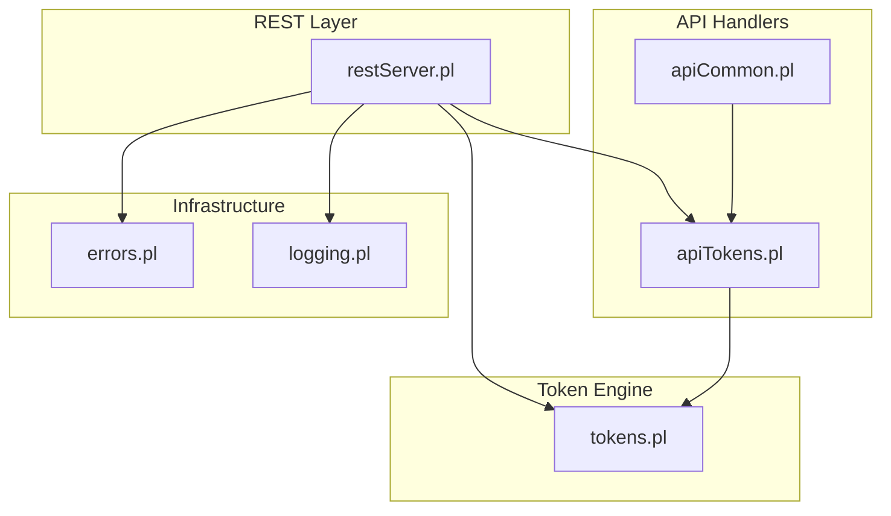
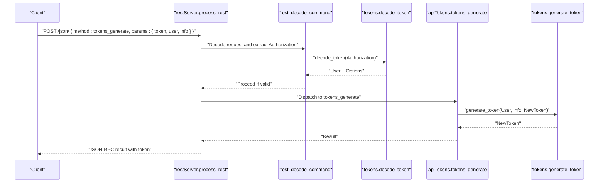
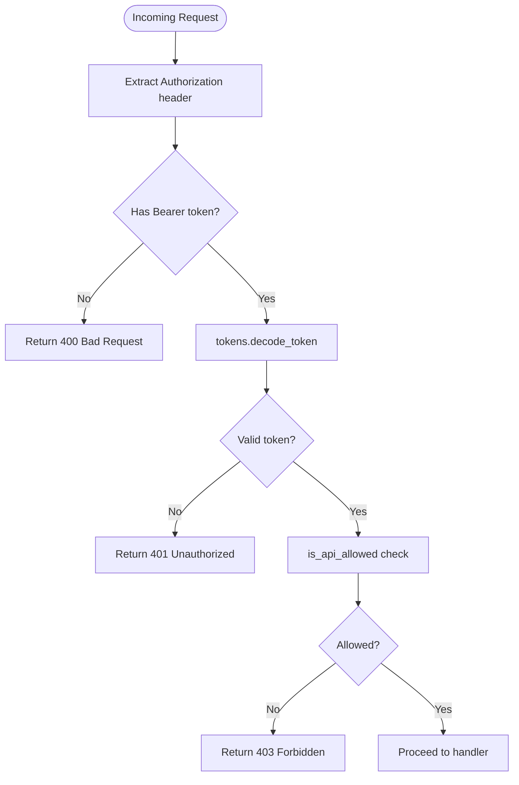
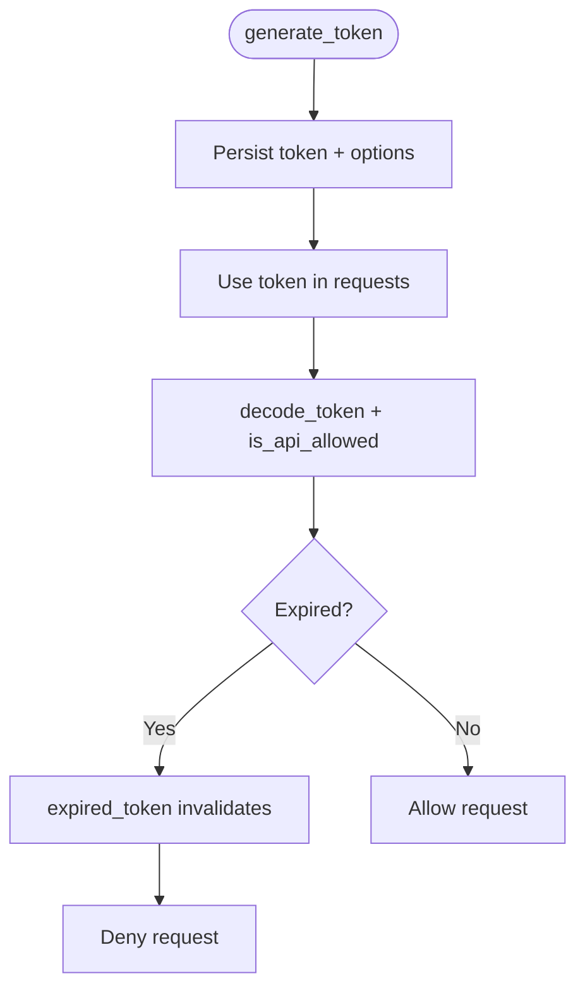
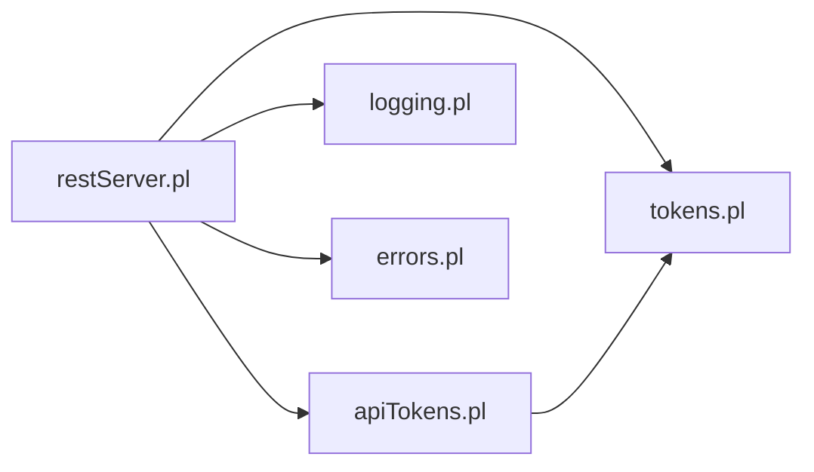

# Authentication API

<cite>
**Referenced Files in This Document**
- [src/apiTokens.pl](file://src/apiTokens.pl)
- [src/tokens.pl](file://src/tokens.pl)
- [src/restServer.pl](file://src/restServer.pl)
- [src/apiCommon.pl](file://src/apiCommon.pl)
- [src/logging.pl](file://src/logging.pl)
- [src/errors.pl](file://src/errors.pl)
- [api/postman/api-tests.postman_collection.json](file://api/postman/api-tests.postman_collection.json)
</cite>

## Table of Contents
1. [Introduction](#introduction)
2. [Project Structure](#project-structure)
3. [Core Components](#core-components)
4. [Architecture Overview](#architecture-overview)
5. [Detailed Component Analysis](#detailed-component-analysis)
6. [Dependency Analysis](#dependency-analysis)
7. [Performance Considerations](#performance-considerations)
8. [Troubleshooting Guide](#troubleshooting-guide)
9. [Conclusion](#conclusion)

## Introduction
This document provides comprehensive API documentation for token-based authentication endpoints in the system. It covers:
- POST /tokens/generate for creating new authentication tokens with scope validation and optional expiration settings
- POST /tokens/invalidate for revoking active tokens
- Token validation via Authorization headers using the Bearer scheme
- Session management and lifecycle controls
- Request/response schemas, token format specifications, and security best practices
- Examples of token generation workflows, authentication header usage, and token invalidation patterns
- Rate limiting, token expiration handling, and audit logging for authentication events
- Common security scenarios and token misuse prevention strategies

## Project Structure
The authentication subsystem is implemented across several modules:
- REST endpoint dispatch and authorization: [src/restServer.pl](file://src/restServer.pl)
- Token generation, validation, and lifecycle: [src/tokens.pl](file://src/tokens.pl)
- API entry points for tokens and users: [src/apiTokens.pl](file://src/apiTokens.pl)
- API documentation and entity mapping: [src/apiCommon.pl](file://src/apiCommon.pl)
- Logging and error handling: [src/logging.pl](file://src/logging.pl), [src/errors.pl](file://src/errors.pl)
- Example test collections demonstrating usage: [api/postman/api-tests.postman_collection.json](file://api/postman/api-tests.postman_collection.json)

**Diagram sources**
- [src/restServer.pl](file://src/restServer.pl#L469-L580)
- [src/apiTokens.pl](file://src/apiTokens.pl#L1-L40)
- [src/tokens.pl](file://src/tokens.pl#L1-L47)
- [src/apiCommon.pl](file://src/apiCommon.pl#L39-L41)
- [src/logging.pl](file://src/logging.pl#L1-L25)
- [src/errors.pl](file://src/errors.pl#L1-L20)

**Section sources**
- [src/restServer.pl](file://src/restServer.pl#L469-L580)
- [src/apiTokens.pl](file://src/apiTokens.pl#L1-L40)
- [src/tokens.pl](file://src/tokens.pl#L1-L47)
- [src/apiCommon.pl](file://src/apiCommon.pl#L39-L41)

## Core Components
- Token generation and validation engine:
  - Generate tokens with associated options (API scopes, directories, expiration)
  - Decode tokens to retrieve user and options
  - Invalidate tokens and users
  - Enforce token expiration checks
- REST authorization pipeline:
  - Extract Authorization: Bearer header
  - Validate token and enforce API scope checks
  - Enforce upload-specific permissions
  - Return standardized error responses
- API entry points:
  - POST /json/ with method tokens_generate
  - POST /json/ with method tokens_invalidate
  - DELETE /json/ with method users_invalidate

Key capabilities:
- Scope validation via is_api_allowed/2
- Optional token lifetime enforcement via life_span
- Bootstrap token generation for initial admin setup
- Audit logging via logging module

**Section sources**
- [src/tokens.pl](file://src/tokens.pl#L104-L139)
- [src/tokens.pl](file://src/tokens.pl#L141-L151)
- [src/tokens.pl](file://src/tokens.pl#L187-L198)
- [src/tokens.pl](file://src/tokens.pl#L249-L257)
- [src/restServer.pl](file://src/restServer.pl#L553-L579)
- [src/restServer.pl](file://src/restServer.pl#L590-L600)
- [src/apiCommon.pl](file://src/apiCommon.pl#L39-L41)

## Architecture Overview
The authentication flow integrates REST request decoding, token validation, and API scope enforcement.

**Diagram sources**
- [src/restServer.pl](file://src/restServer.pl#L491-L515)
- [src/restServer.pl](file://src/restServer.pl#L553-L579)
- [src/tokens.pl](file://src/tokens.pl#L141-L147)
- [src/apiTokens.pl](file://src/apiTokens.pl#L71-L88)
- [src/tokens.pl](file://src/tokens.pl#L116-L139)

## Detailed Component Analysis

### Endpoint: POST /tokens/generate
Purpose:
- Create a new authentication token for a user with specified scopes and optional constraints.

Request
- Method: POST
- Path: /json/
- Body fields:
  - method: tokens_generate
  - params.token: string (admin or authorized token)
  - params.user: string (target username)
  - params.info: object (scope and constraints)
    - info.api: array of allowed operations
    - info.comment: string (optional)
    - info.structures: string (optional, base directory for user str files)
    - info.sources: string (optional, base directory for translations)
    - info.inferences: string (optional)
    - info.mappings: string (optional)
    - info.data_dir: string (optional)
    - info.life_span: number (seconds, optional)
    - info.expire: string (ISO date, optional)
- Headers:
  - Content-Type: application/json
  - Authorization: Bearer {token} (when using REST wrapper)

Response
- JSON-RPC result:
  - result: string (the generated access token)
  - id: string (request identifier)
  - error: null or object (on failure)

Behavior
- Validates that the requester token has the generate_token scope
- Converts info to internal options
- Generates a unique token with creation metadata
- Optionally cleans up bootstrap token after first use
- Returns the new token

Security
- Requires a token with generate_token scope
- Stores token with associated options and creation timestamp
- Supports optional life_span or expire constraints

Examples
- See Postman collection for a complete tokens_generate request and response.

**Section sources**
- [src/apiCommon.pl](file://src/apiCommon.pl#L39-L41)
- [src/apiTokens.pl](file://src/apiTokens.pl#L41-L88)
- [src/tokens.pl](file://src/tokens.pl#L104-L139)
- [api/postman/api-tests.postman_collection.json](file://api/postman/api-tests.postman_collection.json#L112-L127)

### Endpoint: POST /tokens/invalidate
Purpose:
- Revoke a specific active token.

Request
- Method: POST
- Path: /json/
- Body fields:
  - method: tokens_invalidate
  - params.token: string (admin or authorized token)
  - params.user_token: string (the token to invalidate)
- Headers:
  - Content-Type: application/json
  - Authorization: Bearer {token} (when using REST wrapper)

Response
- JSON-RPC result:
  - result: string (the invalidated token)
  - id: string (request identifier)
  - error: null or object (on failure)

Behavior
- Validates that the requester token has the invalidate_token scope
- Verifies the target token exists
- Invalidates the token
- Returns the invalidated token

Security
- Requires a token with invalidate_token scope
- Prevents invalid token parameters

Examples
- See Postman collection for a complete tokens_invalidate request and response.

**Section sources**
- [src/apiCommon.pl](file://src/apiCommon.pl#L40-L41)
- [src/apiTokens.pl](file://src/apiTokens.pl#L90-L105)
- [src/tokens.pl](file://src/tokens.pl#L187-L191)

### Endpoint: DELETE /users/{token}
Purpose:
- Invalidate all tokens associated with a user.

Request
- Method: DELETE
- Path: /json/
- Body fields:
  - method: users_invalidate
  - params.token: string (admin or authorized token)
  - params.user: string (target username)
- Headers:
  - Content-Type: application/json
  - Authorization: Bearer {token} (when using REST wrapper)

Response
- JSON-RPC result:
  - result: string (the invalidated user)
  - id: string (request identifier)
  - error: null or object (on failure)

Behavior
- Validates that the requester token has the invalidate_user scope
- Verifies the target user exists
- Invalidates all tokens for the user
- Returns the invalidated user

Security
- Requires a token with invalidate_user scope
- Prevents invalid user parameters

Examples
- See Postman collection for a complete users_invalidate request and response.

**Section sources**
- [src/apiCommon.pl](file://src/apiCommon.pl#L41-L41)
- [src/apiTokens.pl](file://src/apiTokens.pl#L107-L122)
- [src/tokens.pl](file://src/tokens.pl#L193-L198)

### Token Validation and Bearer Authentication
- Authorization header format: Bearer {token}
- The server extracts the token from the Authorization header and validates it
- decode_token retrieves user and options; expired tokens are rejected
- is_api_allowed enforces scope checks for each API call

**Diagram sources**
- [src/restServer.pl](file://src/restServer.pl#L615-L624)
- [src/restServer.pl](file://src/restServer.pl#L553-L579)
- [src/tokens.pl](file://src/tokens.pl#L141-L151)
- [src/tokens.pl](file://src/tokens.pl#L249-L257)

**Section sources**
- [src/restServer.pl](file://src/restServer.pl#L615-L624)
- [src/restServer.pl](file://src/restServer.pl#L553-L579)
- [src/tokens.pl](file://src/tokens.pl#L141-L151)
- [src/tokens.pl](file://src/tokens.pl#L249-L257)

### Token Lifecycle and Expiration
- Tokens are stored with creation timestamps and optional life_span/expiry
- expired_token automatically invalidates expired tokens during validation
- Short-lived tokens can be used for bootstrap scenarios

**Diagram sources**
- [src/tokens.pl](file://src/tokens.pl#L116-L139)
- [src/tokens.pl](file://src/tokens.pl#L259-L282)

**Section sources**
- [src/tokens.pl](file://src/tokens.pl#L259-L282)

### Upload Permission Enforcement
- upload_allowed checks that the token has the upload scope
- Used for multipart POST requests (file uploads)

**Section sources**
- [src/restServer.pl](file://src/restServer.pl#L590-L600)

## Dependency Analysis
The authentication system depends on:
- REST server for request routing and authorization
- Token engine for cryptographic token generation and validation
- Logging for audit trails
- Error handling for consistent error responses

**Diagram sources**
- [src/restServer.pl](file://src/restServer.pl#L159-L162)
- [src/apiTokens.pl](file://src/apiTokens.pl#L7-L9)
- [src/tokens.pl](file://src/tokens.pl#L49-L52)
- [src/logging.pl](file://src/logging.pl#L1-L25)
- [src/errors.pl](file://src/errors.pl#L1-L20)

**Section sources**
- [src/restServer.pl](file://src/restServer.pl#L159-L162)
- [src/apiTokens.pl](file://src/apiTokens.pl#L7-L9)
- [src/tokens.pl](file://src/tokens.pl#L49-L52)

## Performance Considerations
- Token storage uses persistent database; ensure token_db path is configured appropriately
- Expiration checks occur on decode; consider setting reasonable life_span for high-throughput clients
- Use short-lived tokens for bootstrap and rotate frequently
- Avoid excessive logging in production to reduce I/O overhead

## Troubleshooting Guide
Common issues and resolutions:
- Missing Authorization header or malformed Bearer token:
  - Ensure Authorization: Bearer {token} is present
  - Verify token format and validity
- Insufficient privileges:
  - Confirm the requester token includes the required scope (generate_token, invalidate_token, invalidate_user)
- Invalid token or user:
  - Use users_invalidate to clear stale tokens
  - Regenerate tokens with correct scopes
- Token expired:
  - Generate a new token with appropriate life_span
  - Use bootstrap token only temporarily

Audit logging:
- Enable logging to capture authentication events and failures
- Review logs for unauthorized access attempts and scope violations

**Section sources**
- [src/restServer.pl](file://src/restServer.pl#L553-L579)
- [src/tokens.pl](file://src/tokens.pl#L259-L282)
- [src/logging.pl](file://src/logging.pl#L98-L113)

## Conclusion
The authentication API provides robust token-based access control with clear scope validation, lifecycle management, and security safeguards. By following the documented endpoints, schemas, and best practices, clients can securely manage tokens, enforce permissions, and maintain audit trails.