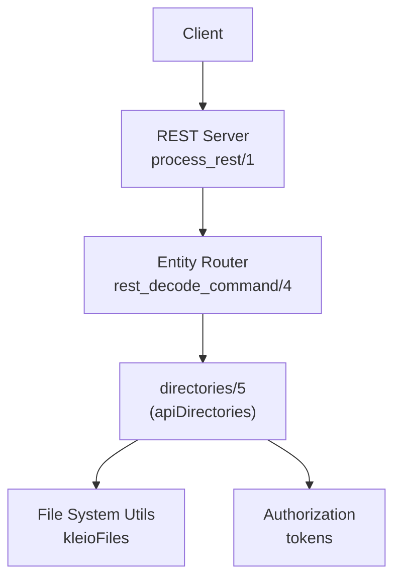
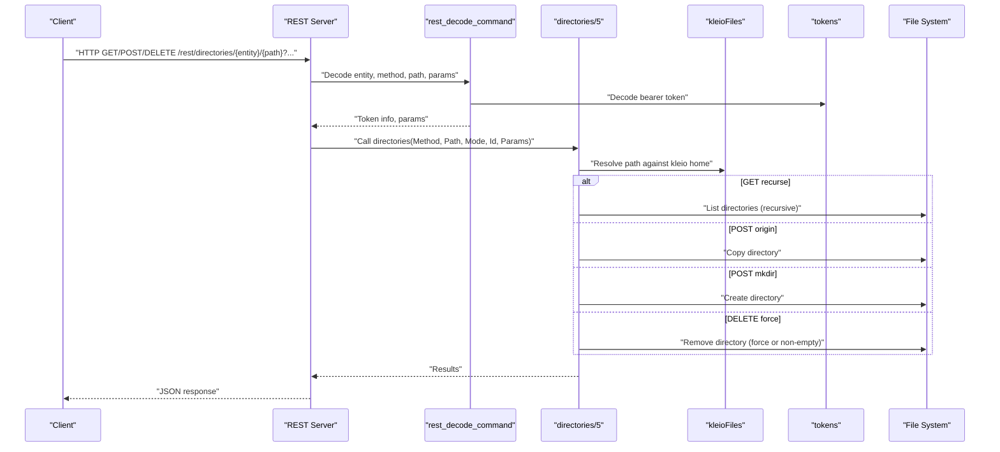
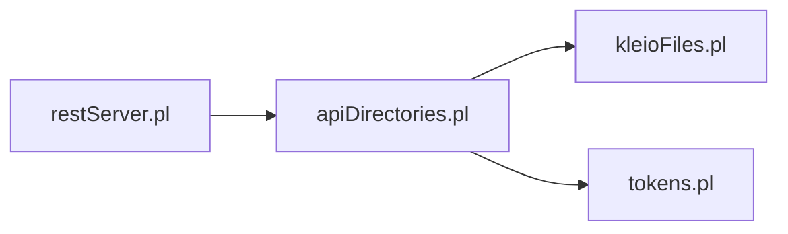

# Directories API

<cite>
**Referenced Files in This Document**
- [apiDirectories.pl](file://src/apiDirectories.pl)
- [restServer.pl](file://src/restServer.pl)
- [kleioFiles.pl](file://src/kleioFiles.pl)
- [tokens.pl](file://src/tokens.pl)
- [errors.pl](file://src/errors.pl)
- [api-tests.postman_collection.json](file://api/postman/api-tests.postman_collection.json)
</cite>

## Table of Contents
1. [Introduction](#introduction)
2. [Project Structure](#project-structure)
3. [Core Components](#core-components)
4. [Architecture Overview](#architecture-overview)
5. [Detailed Component Analysis](#detailed-component-analysis)
6. [Dependency Analysis](#dependency-analysis)
7. [Performance Considerations](#performance-considerations)
8. [Troubleshooting Guide](#troubleshooting-guide)
9. [Conclusion](#conclusion)
10. [Appendices](#appendices)

## Introduction
This document specifies the REST API for managing directories within the timelink-kleio system. It covers:
- Listing directories with recursion
- Creating directories (including copying from an origin)
- Deleting directories with force semantics
- Authentication via bearer tokens
- Request/response schemas and error handling
- Directory structure conventions and security considerations
- Client implementation guidelines for synchronization and management workflows

## Project Structure
The directories API is implemented as part of the REST server and integrates with file system utilities and token-based authorization.

**Diagram sources**
- [restServer.pl](file://src/restServer.pl#L491-L546)
- [restServer.pl](file://src/restServer.pl#L547-L655)
- [apiDirectories.pl](file://src/apiDirectories.pl#L18-L71)
- [kleioFiles.pl](file://src/kleioFiles.pl#L422-L506)
- [tokens.pl](file://src/tokens.pl#L1-L60)

**Section sources**
- [restServer.pl](file://src/restServer.pl#L491-L546)
- [restServer.pl](file://src/restServer.pl#L547-L655)
- [apiDirectories.pl](file://src/apiDirectories.pl#L1-L71)

## Core Components
- REST endpoint: /rest/directories/{entity}/{path}
- Methods:
  - GET: list directories (supports recurse and tstatus filters)
  - POST: create directory or copy directory from origin
  - DELETE: remove directory (supports force)
- Authentication: Bearer token required; permissions validated per operation
- Response format: JSON for REST requests; default_results handles output

Key implementation references:
- Entity routing and decoding: [restServer.pl](file://src/restServer.pl#L547-L655)
- Directory operations: [apiDirectories.pl](file://src/apiDirectories.pl#L18-L168)
- File system helpers: [kleioFiles.pl](file://src/kleioFiles.pl#L422-L506)
- Authorization: [tokens.pl](file://src/tokens.pl#L1-L60)
- Response formatting: [restServer.pl](file://src/restServer.pl#L826-L894)

**Section sources**
- [restServer.pl](file://src/restServer.pl#L547-L655)
- [apiDirectories.pl](file://src/apiDirectories.pl#L18-L168)
- [kleioFiles.pl](file://src/kleioFiles.pl#L422-L506)
- [tokens.pl](file://src/tokens.pl#L1-L60)
- [restServer.pl](file://src/restServer.pl#L826-L894)

## Architecture Overview
The REST server decodes the request, validates the bearer token, resolves the target path against the configured kleio home, and dispatches to the directories handler. Directory listing uses recursive traversal; creation and deletion use file system primitives guarded by permission checks.

**Diagram sources**
- [restServer.pl](file://src/restServer.pl#L547-L655)
- [apiDirectories.pl](file://src/apiDirectories.pl#L18-L168)
- [kleioFiles.pl](file://src/kleioFiles.pl#L422-L506)
- [tokens.pl](file://src/tokens.pl#L141-L176)

## Detailed Component Analysis

### Endpoint Definition
- URL Pattern: /rest/directories/{entity}/{path}
- Supported Methods:
  - GET: list directories
  - POST: create directory or copy directory
  - DELETE: remove directory

Authentication:
- Header: Authorization: Bearer {token}
- Token must be valid and grant required permissions:
  - GET: files
  - POST: mkdir
  - DELETE: delete

Parameters:
- recurse: yes/no (only for GET)
- force: yes/no (only for DELETE)
- origin: source directory path (only for POST copy)
- path: target directory path (implicit in URL; also supported as query param)

Response:
- JSON for REST requests; default_results formats the output

Examples from Postman collection:
- Recursive listing filtered to directories only: [Postman example](file://api/postman/api-tests.postman_collection.json#L702-L725)
- Copy directory with origin: [Postman example](file://api/postman/api-tests.postman_collection.json#L514-L536)
- Forced deletion: [Postman example](file://api/postman/api-tests.postman_collection.json#L406-L428)

**Section sources**
- [restServer.pl](file://src/restServer.pl#L547-L655)
- [apiDirectories.pl](file://src/apiDirectories.pl#L18-L71)
- [api-tests.postman_collection.json](file://api/postman/api-tests.postman_collection.json#L406-L428)
- [api-tests.postman_collection.json](file://api/postman/api-tests.postman_collection.json#L514-L536)
- [api-tests.postman_collection.json](file://api/postman/api-tests.postman_collection.json#L702-L725)

### GET /directories: List directories
Behavior:
- Validates bearer token and files permission
- Resolves path against kleio home
- Lists directories under the given path
- Supports recurse=yes for nested traversal
- Supports tstatus=D to filter only directories

Request:
- Method: GET
- URL: /rest/directories/{entity}/{path}?recurse=yes&tstatus=D
- Headers: Authorization: Bearer {token}, Accept: application/json (recommended)
- Query params:
  - recurse: yes/no
  - tstatus: D (directory-only)

Response:
- JSON object with result array containing directory entries
- Each entry is a relative path resolved for the requesting user

Notes:
- Non-existent path returns not_found
- Directory listing uses recursive traversal controlled by recurse parameter

**Section sources**
- [apiDirectories.pl](file://src/apiDirectories.pl#L18-L35)
- [apiDirectories.pl](file://src/apiDirectories.pl#L160-L168)
- [kleioFiles.pl](file://src/kleioFiles.pl#L422-L506)
- [restServer.pl](file://src/restServer.pl#L826-L894)

### POST /directories: Create or copy directory
Behavior:
- Validates bearer token and mkdir permission
- Two modes:
  - With origin parameter: copy directory from origin to target
  - Without origin parameter: create target directory (and parents as needed)

Request:
- Method: POST
- URL: /rest/directories/{entity}/{path}?origin={source}
- Headers: Authorization: Bearer {token}, Content-Type: application/json
- Query params:
  - origin: source directory path (when copying)

Response:
- JSON object with result indicating the created/copied path

Error conditions:
- Directory already exists
- Could not create/copy directory (e.g., permission denied, invalid path)

**Section sources**
- [apiDirectories.pl](file://src/apiDirectories.pl#L47-L71)
- [apiDirectories.pl](file://src/apiDirectories.pl#L119-L148)
- [restServer.pl](file://src/restServer.pl#L826-L894)

### DELETE /directories: Remove directory
Behavior:
- Validates bearer token and delete permission
- Removes directory:
  - If force=yes: removes even if not empty (removes directory and contents)
  - If force=no: fails if directory not empty

Request:
- Method: DELETE
- URL: /rest/directories/{entity}/{path}?force=yes
- Headers: Authorization: Bearer {token}

Response:
- JSON object with result indicating the removed path

Error conditions:
- Directory not found
- Directory not empty (when force=no)
- Could not delete directory

**Section sources**
- [apiDirectories.pl](file://src/apiDirectories.pl#L36-L46)
- [apiDirectories.pl](file://src/apiDirectories.pl#L93-L117)
- [restServer.pl](file://src/restServer.pl#L826-L894)

### Directory Structure Conventions
- Base directory resolution:
  - The server detects kleio home and resolves entity paths relative to it
  - Supported detection includes /kleio-home, /timelink-home, /mhk-home, and working directory layouts
- User-scoped paths:
  - Tokens can constrain sources and structures directories; API returns paths relative to user’s sources scope
- Directory listing:
  - Directory members are discovered using recursive traversal with hidden=false and file_type(directory)
  - tstatus=D filters to directories only

References:
- Home detection and user source/structure resolution: [kleioFiles.pl](file://src/kleioFiles.pl#L422-L506)
- Directory traversal: [apiDirectories.pl](file://src/apiDirectories.pl#L160-L168)

**Section sources**
- [kleioFiles.pl](file://src/kleioFiles.pl#L422-L506)
- [apiDirectories.pl](file://src/apiDirectories.pl#L160-L168)

### Request/Response Schemas

- Request headers:
  - Authorization: Bearer {token}
  - Accept: application/json (recommended for REST)
  - Content-Type: application/json (for POST)

- GET /rest/directories/{entity}/{path}?recurse=yes&tstatus=D
  - Query params:
    - recurse: yes/no
    - tstatus: D
  - Response: JSON object with result array of directory paths

- POST /rest/directories/{entity}/{path}?origin={source}
  - Query params:
    - origin: source directory path
  - Response: JSON object with result indicating the created/copied path

- POST /rest/directories/{entity}/{path}
  - No special query params
  - Response: JSON object with result indicating the created path

- DELETE /rest/directories/{entity}/{path}?force=yes
  - Query params:
    - force: yes
  - Response: JSON object with result indicating the removed path

Note: The server uses default_results to format responses. For REST requests, the result is typically a JSON object with fields conforming to the default schema.

**Section sources**
- [restServer.pl](file://src/restServer.pl#L826-L894)
- [apiDirectories.pl](file://src/apiDirectories.pl#L18-L71)

### Authentication and Permissions
- Bearer token required in Authorization header
- Token must be valid and decoded by tokens module
- Permissions enforced per operation:
  - GET: files
  - POST: mkdir
  - DELETE: delete
- Admin token can be provided via environment variable and grants broad permissions

References:
- Token decoding and admin options: [tokens.pl](file://src/tokens.pl#L141-L176)
- Permission enforcement in directories: [apiDirectories.pl](file://src/apiDirectories.pl#L18-L46)

**Section sources**
- [tokens.pl](file://src/tokens.pl#L141-L176)
- [apiDirectories.pl](file://src/apiDirectories.pl#L18-L46)

### Error Handling
Common errors and their causes:
- Method not allowed:
  - Occurs when token lacks required permission (files/mkdir/delete)
- Not found:
  - Target path does not exist (or source path for copy)
- Delete failed (directory not empty):
  - DELETE without force=yes on non-empty directory
- Directory already exists:
  - Attempt to create or copy to an existing directory
- Could not create/copy directory:
  - General failure during filesystem operations (e.g., permission denied, invalid path)

References:
- Error conditions and thrown exceptions: [apiDirectories.pl](file://src/apiDirectories.pl#L23-L35), [apiDirectories.pl](file://src/apiDirectories.pl#L107-L116), [apiDirectories.pl](file://src/apiDirectories.pl#L122-L129), [apiDirectories.pl](file://src/apiDirectories.pl#L136-L147)

**Section sources**
- [apiDirectories.pl](file://src/apiDirectories.pl#L23-L35)
- [apiDirectories.pl](file://src/apiDirectories.pl#L107-L116)
- [apiDirectories.pl](file://src/apiDirectories.pl#L122-L129)
- [apiDirectories.pl](file://src/apiDirectories.pl#L136-L147)

### Examples from Postman Collection
- Recursive listing filtered to directories only:
  - URL: /rest/directories?id={{request_id}}&recurse=yes&tstatus=D
  - Purpose: Retrieve only directories under the root path
  - Reference: [api-tests.postman_collection.json](file://api/postman/api-tests.postman_collection.json#L702-L725)
- Copy directory with origin:
  - URL: /rest/directories/sources/{{test_sources}}?id={{request_id}}&origin=sources/{{reference_sources}}
  - Purpose: Create a new directory by copying from a source directory
  - Reference: [api-tests.postman_collection.json](file://api/postman/api-tests.postman_collection.json#L514-L536)
- Forced deletion:
  - URL: /rest/directories/sources/{{test_sources}}?id={{request_id}}&force=yes
  - Purpose: Remove a directory even if not empty
  - Reference: [api-tests.postman_collection.json](file://api/postman/api-tests.postman_collection.json#L406-L428)

**Section sources**
- [api-tests.postman_collection.json](file://api/postman/api-tests.postman_collection.json#L406-L428)
- [api-tests.postman_collection.json](file://api/postman/api-tests.postman_collection.json#L514-L536)
- [api-tests.postman_collection.json](file://api/postman/api-tests.postman_collection.json#L702-L725)

## Dependency Analysis
The directories API depends on:
- REST server for request decoding and response formatting
- Token module for authorization
- File system utilities for path resolution and directory operations

**Diagram sources**
- [restServer.pl](file://src/restServer.pl#L547-L655)
- [apiDirectories.pl](file://src/apiDirectories.pl#L18-L71)
- [kleioFiles.pl](file://src/kleioFiles.pl#L422-L506)
- [tokens.pl](file://src/tokens.pl#L1-L60)

**Section sources**
- [restServer.pl](file://src/restServer.pl#L547-L655)
- [apiDirectories.pl](file://src/apiDirectories.pl#L18-L71)
- [kleioFiles.pl](file://src/kleioFiles.pl#L422-L506)
- [tokens.pl](file://src/tokens.pl#L1-L60)

## Performance Considerations
- Recursive directory traversal:
  - Use recurse=yes judiciously on deep directory structures
  - Consider batching or pagination-like filtering (e.g., tstatus=D) to reduce payload size
- Force deletion:
  - force=yes triggers recursive deletion of directory contents; ensure appropriate safeguards
- Token validation overhead:
  - Minimal; ensure tokens are cached or reused where possible
- Security:
  - Always resolve paths against kleio home and user scopes to prevent path traversal
  - Avoid exposing absolute paths; rely on relative paths returned by the API

[No sources needed since this section provides general guidance]

## Troubleshooting Guide
- 401 Unauthorized:
  - Missing or invalid bearer token
  - Reference: [restServer.pl](file://src/restServer.pl#L547-L655)
- 403 Forbidden:
  - Token lacks required permission (files/mkdir/delete)
  - Reference: [apiDirectories.pl](file://src/apiDirectories.pl#L18-L46)
- 404 Not Found:
  - Target or source path does not exist
  - Reference: [apiDirectories.pl](file://src/apiDirectories.pl#L23-L35), [apiDirectories.pl](file://src/apiDirectories.pl#L136-L147)
- 409 Conflict:
  - Directory already exists when creating/copying
  - Reference: [apiDirectories.pl](file://src/apiDirectories.pl#L122-L129), [apiDirectories.pl](file://src/apiDirectories.pl#L140-L144)
- 423 Locked:
  - Directory not empty and force=no
  - Reference: [apiDirectories.pl](file://src/apiDirectories.pl#L113-L116)
- 500 Internal Server Error:
  - Filesystem errors during create/copy/delete
  - Reference: [apiDirectories.pl](file://src/apiDirectories.pl#L126-L129), [apiDirectories.pl](file://src/apiDirectories.pl#L144-L147)

**Section sources**
- [restServer.pl](file://src/restServer.pl#L547-L655)
- [apiDirectories.pl](file://src/apiDirectories.pl#L18-L46)
- [apiDirectories.pl](file://src/apiDirectories.pl#L113-L147)

## Conclusion
The directories API provides robust REST endpoints for listing, creating, copying, and deleting directories within the kleio home scope. It enforces token-based authorization, supports recursive traversal and filtering, and returns JSON-formatted results. Clients should use bearer tokens with appropriate permissions, apply recurse and tstatus filters thoughtfully, and handle error conditions as documented.

[No sources needed since this section summarizes without analyzing specific files]

## Appendices

### Client Implementation Guidelines
- Authentication:
  - Always include Authorization: Bearer {token} header
  - Store tokens securely and reuse where possible
- Directory listing:
  - Use recurse=yes for full subtree enumeration
  - Use tstatus=D to filter only directories
- Creation and copy:
  - Use origin parameter for copying directories
  - Handle directory already exists errors and retry with a different target
- Deletion:
  - Use force=yes to remove non-empty directories
  - Confirm destructive operations with users
- Synchronization workflows:
  - Compare directory listings (filtered by tstatus=D) to detect changes
  - Use copy operations to mirror subtrees
  - Implement idempotent operations and conflict resolution

[No sources needed since this section provides general guidance]