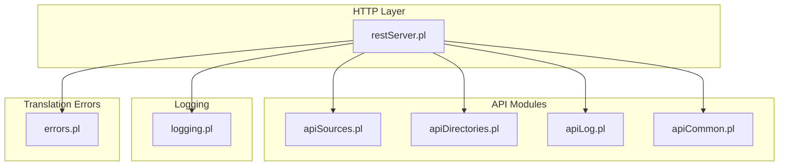
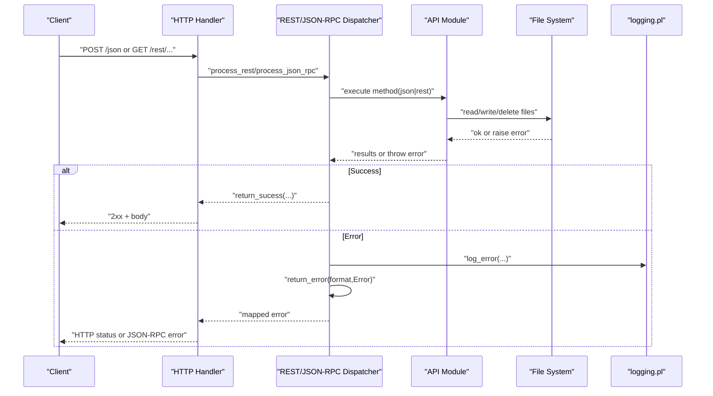
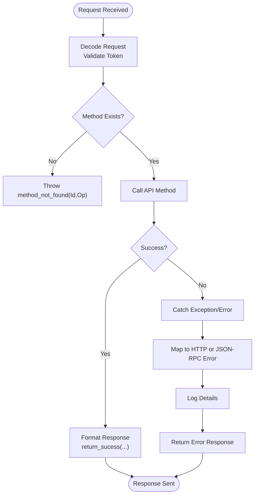
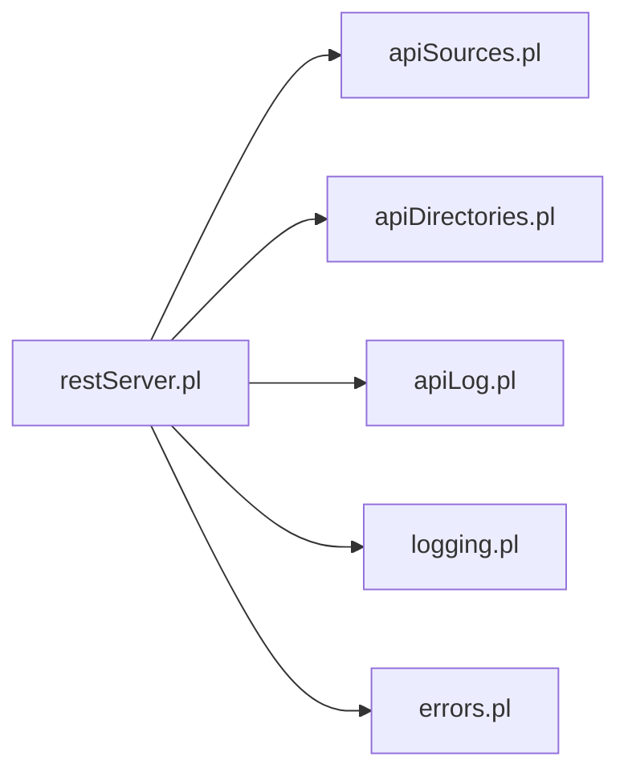

# Error Handling & Status Codes

<cite>
**Referenced Files in This Document**
- [restServer.pl](file://src/restServer.pl)
- [apiCommon.pl](file://src/apiCommon.pl)
- [apiSources.pl](file://src/apiSources.pl)
- [apiDirectories.pl](file://src/apiDirectories.pl)
- [apiLog.pl](file://src/apiLog.pl)
- [logging.pl](file://src/logging.pl)
- [errors.pl](file://src/errors.pl)
</cite>

## Table of Contents
1. [Introduction](#introduction)
2. [Project Structure](#project-structure)
3. [Core Components](#core-components)
4. [Architecture Overview](#architecture-overview)
5. [Detailed Component Analysis](#detailed-component-analysis)
6. [Dependency Analysis](#dependency-analysis)
7. [Performance Considerations](#performance-considerations)
8. [Troubleshooting Guide](#troubleshooting-guide)
9. [Conclusion](#conclusion)
10. [Appendices](#appendices)

## Introduction
This document provides comprehensive error handling documentation for the REST and JSON-RPC server. It covers HTTP status codes, JSON-RPC error codes, application-specific error messages, response formats, exception types, debugging techniques, logging mechanisms, common error scenarios, troubleshooting guides, recovery strategies, and the error propagation chain from API layer through business logic to file system operations. It also includes guidance for client-side error handling and server-side logging configuration.

## Project Structure
The error handling surface is implemented primarily in the REST/JSON-RPC server module and its API modules:
- Server entry points and request dispatching
- Centralized error formatting and mapping
- API modules that throw structured errors
- Logging subsystem for diagnostics
- Translation-time error reporting utilities

**Diagram sources**
- [restServer.pl](file://src/restServer.pl)
- [apiSources.pl](file://src/apiSources.pl)
- [apiDirectories.pl](file://src/apiDirectories.pl)
- [apiLog.pl](file://src/apiLog.pl)
- [apiCommon.pl](file://src/apiCommon.pl)
- [logging.pl](file://src/logging.pl)
- [errors.pl](file://src/errors.pl)

**Section sources**
- [restServer.pl](file://src/restServer.pl)
- [apiCommon.pl](file://src/apiCommon.pl)

## Core Components
- REST and JSON-RPC request processing with centralized error catching and formatting
- Mapping between HTTP exceptions and JSON-RPC error codes
- Structured error responses for both REST and JSON-RPC clients
- Logging facilities for server-side diagnostics
- Translation-time error reporting (separate from HTTP/JSON-RPC)

Key responsibilities:
- Accept requests, decode parameters, authorize tokens
- Execute API methods and handle success via result formatters
- Catch and normalize errors into consistent responses
- Log relevant information at appropriate levels

**Section sources**
- [restServer.pl](file://src/restServer.pl)
- [logging.pl](file://src/logging.pl)
- [errors.pl](file://src/errors.pl)

## Architecture Overview
The server uses a layered approach:
- HTTP handlers catch exceptions and route them to return_error/2
- Business logic throws http_reply/1 or domain-specific error terms
- JSON-RPC path maps these to standardized JSON-RPC error objects
- Logging records diagnostic details for troubleshooting

**Diagram sources**
- [restServer.pl](file://src/restServer.pl)
- [logging.pl](file://src/logging.pl)

## Detailed Component Analysis

### REST and JSON-RPC Request Flow and Error Propagation
- process_rest and process_json_rpc wrap execution in try/catch
- On success, results are formatted by return_sucess/5
- On failure, process_*_error calls return_error/2 which normalizes output
- For JSON-RPC, specific error shapes map to standard codes
- For REST, http_reply/1 exceptions are re-thrown or mapped to JSON-RPC when needed

**Diagram sources**
- [restServer.pl](file://src/restServer.pl)

**Section sources**
- [restServer.pl](file://src/restServer.pl)

### JSON-RPC Error Codes and Responses
Standard JSON-RPC codes used:
- -32700 Parse error
- -32600 Invalid Request
- -32601 Method not found
- -32602 Invalid params
- -32603 Internal error
- -32000 to -32099 Server error range (implementation-defined)

Implementation-defined codes include:
- -32000 Generic server error
- -32001 Invalid token info
- -32002 Resources not found
- -32003 Directory not empty
- -32004 Could not create directory
- -32005 Directory exists
- -32006 Forbidden
- -32007 Destination exists
- -32008 Resource not found
- -32009 Directory does not exist
- -32010 Could not copy directory

JSON-RPC error response format:
- jsonrpc: "2.0"
- error: { code: number, message: string }
- id: request id (or null if none)

Mapping examples:
- http_reply(not_found(Path)) -> -32008
- http_reply(forbidden(Url)) -> -32006
- invalid_params(...) -> -32602
- method_not_found(...) -> -32601
- parse_error(...) -> -32700

**Section sources**
- [restServer.pl](file://src/restServer.pl)

### HTTP Status Codes and REST Responses
REST endpoints use SWI-Prolog’s http_reply/1 exceptions. Common mappings:
- 400 Bad Request: bad_request(ErrorTerm)
- 401 Unauthorized: authorise(Method)
- 403 Forbidden: forbidden(Url)
- 404 Not Found: not_found(Path)
- 405 Method Not Allowed: method_not_allowed(Method, Path)
- 406 Not Acceptable: not_acceptable(WhyHtml)
- 201 Created: created(Location)
- 202 Accepted: busy
- 204 No Content: no_content
- 301 Moved Permanently: moved(To)
- 307 Temporary Redirect: moved_temporary(To)
- 304 Not Modified: not_modified
- 303 See Other: see_other(To)
- 500 Internal Server Error: server_error(ErrorTerm)

When a JSON-RPC request triggers an HTTP-style error, it is converted to a JSON-RPC error object with the corresponding implementation-defined code.

**Section sources**
- [restServer.pl](file://src/restServer.pl)

### API-Specific Error Scenarios

#### Sources API
- Missing or invalid token -> 401/403 or JSON-RPC -32006/-32001
- File not found -> 404 or JSON-RPC -32008
- Upload without multipart/form-data -> 400
- Overwrite existing file without PUT -> 400
- Copy/move destination exists -> 400 or JSON-RPC -32007

Examples of thrown errors:
- http_reply(forbidden(Url),['Request-id'(Id)])
- http_reply(not_found(Path),['Request-id'(Id)])
- http_reply(bad_request(bad_file_upload_no_file_in_request),['Request-id'(Id)])

**Section sources**
- [apiSources.pl](file://src/apiSources.pl)
- [restServer.pl](file://src/restServer.pl)

#### Directories API
- Insufficient permissions -> 403 or JSON-RPC -32006
- Directory not found -> 404 or JSON-RPC -32008
- Delete non-empty directory without force -> JSON-RPC -32003
- Create existing directory -> JSON-RPC -32005
- Create directory fails -> JSON-RPC -32004
- Copy source missing -> 404
- Copy destination exists -> JSON-RPC -32005
- Copy fails -> JSON-RPC -32004

**Section sources**
- [apiDirectories.pl](file://src/apiDirectories.pl)
- [restServer.pl](file://src/restServer.pl)

#### Client Log API
- Requires files privilege; otherwise -> 405 or JSON-RPC -32006
- Logs messages at requested level to server logs

**Section sources**
- [apiLog.pl](file://src/apiLog.pl)
- [restServer.pl](file://src/restServer.pl)

### Logging Mechanisms
- Level-based logging: emerg, alert, crit, err, warning, notice, info, debug
- Default log destination: kleio_service.log under the configured log directory
- Dynamic log level setting via set_log_level/1
- Convenience predicates: log_info, log_debug, log_error, etc.
- Open/close log streams and write to alias logfile

Configuration tips:
- Ensure log directory exists and is writable
- Use start_log(Destination) to open a custom destination
- Use stop_log() to close the stream

**Section sources**
- [logging.pl](file://src/logging.pl)

### Translation-Time Error Reporting
Separate from HTTP/JSON-RPC, translation errors/warnings are reported using:
- error_out/1, error_out/2
- warning_out/1, warning_out/2
- check_continuation/0 to abort after max errors
- perror_count/0 to print counts

These integrate with reports and persistence to provide context-aware messages.

**Section sources**
- [errors.pl](file://src/errors.pl)

## Dependency Analysis
The error handling depends on several modules:
- restServer.pl orchestrates request handling and error normalization
- API modules throw structured errors based on validation and I/O outcomes
- logging.pl provides persistent diagnostics
- errors.pl supports translation-time error reporting

**Diagram sources**
- [restServer.pl](file://src/restServer.pl)
- [apiSources.pl](file://src/apiSources.pl)
- [apiDirectories.pl](file://src/apiDirectories.pl)
- [apiLog.pl](file://src/apiLog.pl)
- [logging.pl](file://src/logging.pl)
- [errors.pl](file://src/errors.pl)

**Section sources**
- [restServer.pl](file://src/restServer.pl)
- [apiSources.pl](file://src/apiSources.pl)
- [apiDirectories.pl](file://src/apiDirectories.pl)
- [apiLog.pl](file://src/apiLog.pl)
- [logging.pl](file://src/logging.pl)
- [errors.pl](file://src/errors.pl)

## Performance Considerations
- Avoid excessive logging at high verbosity in production; prefer info/debug selectively
- Batch JSON-RPC requests where supported to reduce overhead
- Use timeouts configured by the server to prevent long-running requests from blocking workers
- Prefer streaming large file downloads via HTTP file reply mechanism rather than embedding content in JSON

[No sources needed since this section provides general guidance]

## Troubleshooting Guide

### Common Error Scenarios and Recovery Strategies
- Missing or invalid token
  - Symptom: 401/403 or JSON-RPC -32001/-32006
  - Action: Generate a valid token and include it in Authorization header or request parameter
- Resource not found
  - Symptom: 404 or JSON-RPC -32008
  - Action: Verify paths and permissions; ensure files/directories exist under allowed locations
- Directory operations failing
  - Symptom: -32003 (not empty), -32004 (create fail), -32005 (exists), -32007 (destination exists)
  - Action: Remove contents or use force options; choose different destinations; confirm permissions
- Upload issues
  - Symptom: 400 bad request due to missing multipart/form-data
  - Action: Use proper multipart upload; ensure file name and path parameters are provided

### Debugging Techniques
- Enable detailed logging via set_log_level(debug) and inspect kleio_service.log
- Use client_log_send to inject messages into server logs for tracing client-server interactions
- Review server activity and queue status via built-in endpoints
- Validate JSON payloads before sending to avoid -32700 parse errors

### Server-Side Logging Configuration
- Start logging to default location: start_log([])
- Start logging to custom file: start_log('/path/to/logfile')
- Set log level: set_log_level(debug)
- Stop logging: stop_log()

**Section sources**
- [restServer.pl](file://src/restServer.pl)
- [apiLog.pl](file://src/apiLog.pl)
- [logging.pl](file://src/logging.pl)

## Conclusion
The server implements a robust, layered error handling strategy that normalizes HTTP and JSON-RPC errors, provides clear diagnostics via logging, and offers actionable error codes and messages. By following the guidelines here, developers can implement resilient clients and maintain effective server-side observability.

[No sources needed since this section summarizes without analyzing specific files]

## Appendices

### JSON-RPC Error Response Schema
- Fields:
  - jsonrpc: "2.0"
  - error: { code: number, message: string }
  - id: any (request id or null)

### HTTP Status Code Reference
- 2xx: Success
- 400: Bad Request
- 401: Unauthorized
- 403: Forbidden
- 404: Not Found
- 405: Method Not Allowed
- 406: Not Acceptable
- 201: Created
- 202: Accepted
- 204: No Content
- 301/307: Redirects
- 304: Not Modified
- 500: Internal Server Error

### Example Error Propagation Chain
- API validates input and permissions
- If invalid, throws http_reply(...) or error(Id,Code,Message)
- Server catches and maps to JSON-RPC or HTTP response
- Relevant details logged for diagnosis

**Section sources**
- [restServer.pl](file://src/restServer.pl)
- [apiSources.pl](file://src/apiSources.pl)
- [apiDirectories.pl](file://src/apiDirectories.pl)
- [apiLog.pl](file://src/apiLog.pl)
- [logging.pl](file://src/logging.pl)