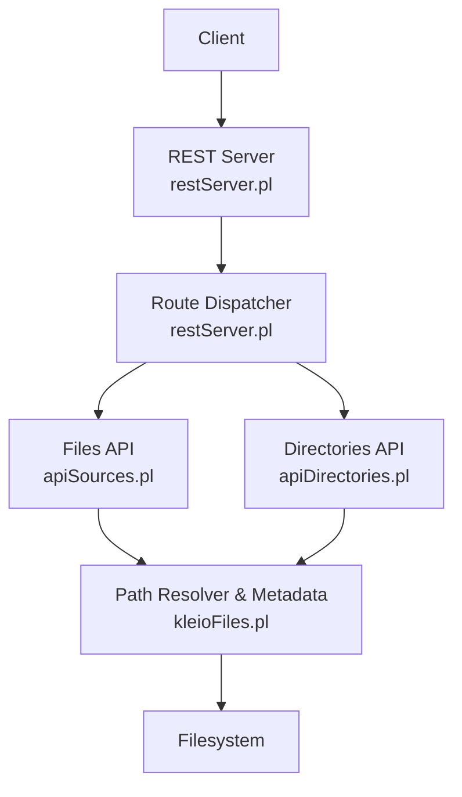
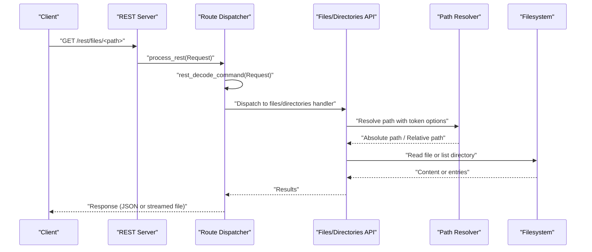
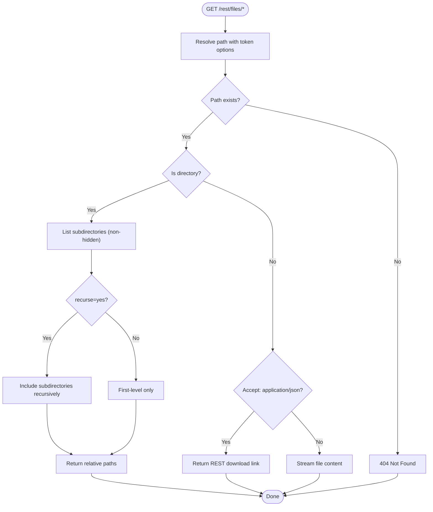
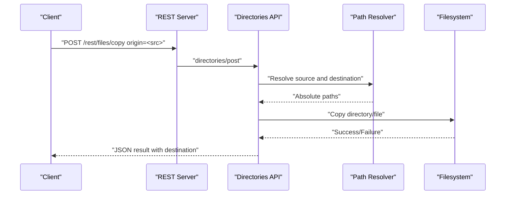
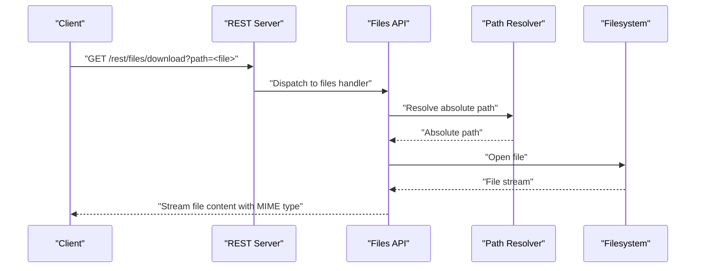
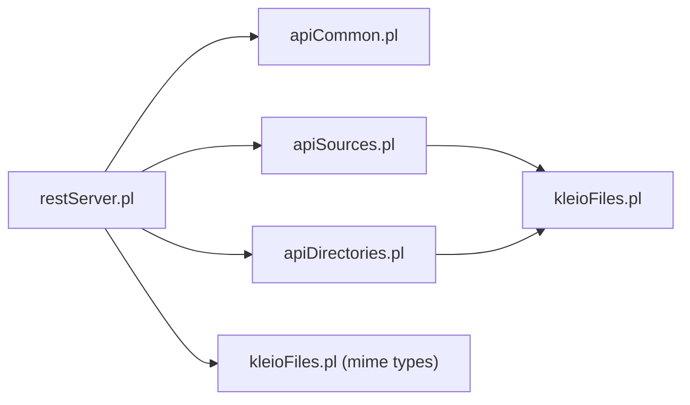

# File Management API

<cite>
**Referenced Files in This Document**
- [restServer.pl](file://src/restServer.pl)
- [apiDirectories.pl](file://src/apiDirectories.pl)
- [kleioFiles.pl](file://src/kleioFiles.pl)
- [apiSources.pl](file://src/apiSources.pl)
- [apiExports.pl](file://src/apiExports.pl)
- [apiCommon.pl](file://src/apiCommon.pl)
- [api.json](file://api/postman/api.json)
</cite>

## Table of Contents
1. [Introduction](#introduction)
2. [Project Structure](#project-structure)
3. [Core Components](#core-components)
4. [Architecture Overview](#architecture-overview)
5. [Detailed Component Analysis](#detailed-component-analysis)
6. [Dependency Analysis](#dependency-analysis)
7. [Performance Considerations](#performance-considerations)
8. [Troubleshooting Guide](#troubleshooting-guide)
9. [Conclusion](#conclusion)

## Introduction
This document describes the File Management API that enables clients to browse, fetch, and manage files and directories within the Kleio system. It covers:
- GET /rest/files/* for directory listing and file metadata retrieval
- POST /rest/files/copy for copying files and directories
- GET /rest/files/download for direct file downloads and streaming
- Authentication, path resolution, sanitization, and security controls
- Error handling, performance considerations, and cross-platform path handling

## Project Structure
The File Management API is implemented on top of a REST/JSON-RPC server. Key modules:
- REST routing and dispatch: [restServer.pl](file://src/restServer.pl)
- File/directory operations: [apiDirectories.pl](file://src/apiDirectories.pl), [apiSources.pl](file://src/apiSources.pl)
- Path resolution and file metadata: [kleioFiles.pl](file://src/kleioFiles.pl)
- Export aliasing: [apiExports.pl](file://src/apiExports.pl)
- API surface and entity mapping: [apiCommon.pl](file://src/apiCommon.pl)
- Example usage and token scopes: [api.json](file://api/postman/api.json)

**Diagram sources**
- [restServer.pl](file://src/restServer.pl#L491-L516)
- [apiSources.pl](file://src/apiSources.pl#L89-L104)
- [apiDirectories.pl](file://src/apiDirectories.pl#L18-L35)
- [kleioFiles.pl](file://src/kleioFiles.pl#L752-L800)

**Section sources**
- [restServer.pl](file://src/restServer.pl#L491-L516)
- [apiCommon.pl](file://src/apiCommon.pl#L48-L77)

## Core Components
- REST endpoint routing and CORS: [restServer.pl](file://src/restServer.pl#L304-L306)
- Entity extraction and authorization: [restServer.pl](file://src/restServer.pl#L553-L579)
- File retrieval and streaming: [apiSources.pl](file://src/apiSources.pl#L212-L225)
- Directory listing and recursion: [apiDirectories.pl](file://src/apiDirectories.pl#L18-L35)
- Directory creation and copy: [apiDirectories.pl](file://src/apiDirectories.pl#L47-L70)
- Path resolution and relative mapping: [kleioFiles.pl](file://src/kleioFiles.pl#L752-L800)
- MIME type mapping: [kleioFiles.pl](file://src/kleioFiles.pl#L31-L32), [restServer.pl](file://src/restServer.pl#L465-L466)

**Section sources**
- [restServer.pl](file://src/restServer.pl#L553-L579)
- [apiSources.pl](file://src/apiSources.pl#L212-L225)
- [apiDirectories.pl](file://src/apiDirectories.pl#L18-L70)
- [kleioFiles.pl](file://src/kleioFiles.pl#L752-L800)

## Architecture Overview
The server exposes REST endpoints under /rest/*. Requests are decoded, authorized via tokens, routed to the appropriate handler, and results are serialized. File downloads are streamed directly from the filesystem when applicable.

**Diagram sources**
- [restServer.pl](file://src/restServer.pl#L491-L516)
- [apiSources.pl](file://src/apiSources.pl#L89-L104)
- [apiDirectories.pl](file://src/apiDirectories.pl#L18-L35)
- [kleioFiles.pl](file://src/kleioFiles.pl#L752-L800)

## Detailed Component Analysis

### Authentication and Authorization
- Authorization token is extracted from the Authorization header as Bearer token.
- Tokens are decoded and validated; requests missing or invalid tokens receive appropriate HTTP errors.
- Handlers enforce API scopes (e.g., files, upload, delete, mkdir) per request method and entity.

Key behaviors:
- Token extraction: [restServer.pl](file://src/restServer.pl#L619-L624)
- Token decoding and permission checks: [restServer.pl](file://src/restServer.pl#L560-L562)
- Scope enforcement in handlers: [apiSources.pl](file://src/apiSources.pl#L92-L100), [apiDirectories.pl](file://src/apiDirectories.pl#L21-L25)

**Section sources**
- [restServer.pl](file://src/restServer.pl#L553-L579)
- [apiSources.pl](file://src/apiSources.pl#L92-L100)
- [apiDirectories.pl](file://src/apiDirectories.pl#L21-L25)

### Path Resolution and Sanitization
- Paths are resolved relative to the user’s sources directory indicated by token options.
- Bidirectional mapping supports converting between absolute and relative paths.
- Hidden files and non-matching patterns are excluded from directory listings.

Highlights:
- Resolve relative to user sources: [kleioFiles.pl](file://src/kleioFiles.pl#L752-L781)
- Relative-to-absolute mapping for lists: [kleioFiles.pl](file://src/kleioFiles.pl#L783-L800)
- Directory listing with recursion and hidden filtering: [apiDirectories.pl](file://src/apiDirectories.pl#L161-L167)

**Section sources**
- [kleioFiles.pl](file://src/kleioFiles.pl#L752-L800)
- [apiDirectories.pl](file://src/apiDirectories.pl#L161-L167)

### GET /rest/files/*
- Purpose: Retrieve file content or list directory contents.
- Behavior:
  - If path resolves to a file: return file content or a download link depending on Accept header.
  - If path resolves to a directory: list subdirectories (non-hidden) with optional recursion.
- Parameters:
  - recurse=yes for recursive listing.
  - url=yes for file listing to include REST URLs for each item.
- Responses:
  - JSON array of relative paths for directories.
  - File content or redirect to download link for files.

Implementation references:
- File retrieval and streaming: [apiSources.pl](file://src/apiSources.pl#L212-L225)
- Directory listing with recursion: [apiDirectories.pl](file://src/apiDirectories.pl#L18-L35)
- Directory member enumeration: [apiDirectories.pl](file://src/apiDirectories.pl#L161-L167)

**Diagram sources**
- [apiSources.pl](file://src/apiSources.pl#L212-L225)
- [apiDirectories.pl](file://src/apiDirectories.pl#L18-L35)
- [kleioFiles.pl](file://src/kleioFiles.pl#L752-L800)

**Section sources**
- [apiSources.pl](file://src/apiSources.pl#L212-L225)
- [apiDirectories.pl](file://src/apiDirectories.pl#L18-L35)
- [kleioFiles.pl](file://src/kleioFiles.pl#L752-L800)

### POST /rest/files/copy
- Purpose: Copy a file or directory to a destination.
- Behavior:
  - Requires origin=path parameter specifying the source.
  - Validates existence of source and non-existence of destination.
  - Enforces mkdir scope for directory creation.
- Responses:
  - JSON result containing the destination path.

Implementation references:
- Copy directory: [apiDirectories.pl](file://src/apiDirectories.pl#L131-L147)
- Copy file: [apiSources.pl](file://src/apiSources.pl#L354-L382)

**Diagram sources**
- [apiDirectories.pl](file://src/apiDirectories.pl#L47-L70)
- [apiDirectories.pl](file://src/apiDirectories.pl#L131-L147)
- [apiSources.pl](file://src/apiSources.pl#L354-L382)
- [kleioFiles.pl](file://src/kleioFiles.pl#L752-L781)

**Section sources**
- [apiDirectories.pl](file://src/apiDirectories.pl#L47-L70)
- [apiDirectories.pl](file://src/apiDirectories.pl#L131-L147)
- [apiSources.pl](file://src/apiSources.pl#L354-L382)

### GET /rest/files/download
- Purpose: Download a file directly.
- Behavior:
  - For REST requests, returns the file content with appropriate MIME type and headers.
  - For JSON requests, returns a REST URL to download the file.
- Streaming:
  - Uses server-side file streaming to efficiently transfer large files.

Implementation references:
- REST file streaming: [apiSources.pl](file://src/apiSources.pl#L212-L218)
- JSON download link: [apiSources.pl](file://src/apiSources.pl#L220-L225)
- MIME type mapping: [kleioFiles.pl](file://src/kleioFiles.pl#L31-L32), [restServer.pl](file://src/restServer.pl#L465-L466)

**Diagram sources**
- [apiSources.pl](file://src/apiSources.pl#L212-L218)
- [kleioFiles.pl](file://src/kleioFiles.pl#L31-L32)
- [restServer.pl](file://src/restServer.pl#L465-L466)

**Section sources**
- [apiSources.pl](file://src/apiSources.pl#L212-L225)
- [kleioFiles.pl](file://src/kleioFiles.pl#L31-L32)
- [restServer.pl](file://src/restServer.pl#L465-L466)

### Cross-Platform Path Handling
- Path normalization and resolution leverage token options to anchor paths under the user’s sources directory.
- Directory enumeration excludes hidden entries and supports recursive traversal.
- MIME type detection ensures correct Content-Type for downloads.

References:
- Path resolution helpers: [kleioFiles.pl](file://src/kleioFiles.pl#L752-L781)
- Directory enumeration: [apiDirectories.pl](file://src/apiDirectories.pl#L161-L167)
- MIME mapping: [kleioFiles.pl](file://src/kleioFiles.pl#L31-L32), [restServer.pl](file://src/restServer.pl#L465-L466)

**Section sources**
- [kleioFiles.pl](file://src/kleioFiles.pl#L752-L781)
- [apiDirectories.pl](file://src/apiDirectories.pl#L161-L167)
- [kleioFiles.pl](file://src/kleioFiles.pl#L31-L32)
- [restServer.pl](file://src/restServer.pl#L465-L466)

### Bulk Operations and Directory Navigation Patterns
- Directory listing supports recursion and URL generation for subsequent file retrieval.
- Copy operations support both files and directories.
- Export aliasing routes GET /rest/exports/* to the sources API for XML exports.

References:
- Recursive directory listing: [apiDirectories.pl](file://src/apiDirectories.pl#L18-L35)
- URL inclusion in listings: [apiSources.pl](file://src/apiSources.pl#L281-L284)
- Export alias: [apiExports.pl](file://src/apiExports.pl#L14-L15)

**Section sources**
- [apiDirectories.pl](file://src/apiDirectories.pl#L18-L35)
- [apiSources.pl](file://src/apiSources.pl#L281-L284)
- [apiExports.pl](file://src/apiExports.pl#L14-L15)

## Dependency Analysis
- REST server depends on route dispatch and token validation.
- Files API depends on path resolution and file metadata utilities.
- Directories API depends on path resolution and filesystem operations.
- MIME type mapping bridges file metadata and HTTP responses.

**Diagram sources**
- [restServer.pl](file://src/restServer.pl#L304-L306)
- [apiCommon.pl](file://src/apiCommon.pl#L79-L88)
- [apiSources.pl](file://src/apiSources.pl#L89-L104)
- [apiDirectories.pl](file://src/apiDirectories.pl#L18-L35)
- [kleioFiles.pl](file://src/kleioFiles.pl#L31-L32)

**Section sources**
- [restServer.pl](file://src/restServer.pl#L304-L306)
- [apiCommon.pl](file://src/apiCommon.pl#L79-L88)
- [apiSources.pl](file://src/apiSources.pl#L89-L104)
- [apiDirectories.pl](file://src/apiDirectories.pl#L18-L35)
- [kleioFiles.pl](file://src/kleioFiles.pl#L31-L32)

## Performance Considerations
- Large directory listings:
  - Prefer first-level listings (recurse=no) when possible.
  - Use url=yes to obtain REST download links and avoid transferring raw file content in directory responses.
- Streaming downloads:
  - Use GET /rest/files/download to stream large files directly from the filesystem.
- Token scope minimization:
  - Assign minimal required scopes to reduce unnecessary checks and improve throughput.

[No sources needed since this section provides general guidance]

## Troubleshooting Guide
Common errors and causes:
- 400 Bad Request:
  - Missing or invalid token, malformed request parameters.
  - Destination file already exists during copy/move.
- 401 Unauthorized:
  - Missing or invalid Authorization header.
- 403 Forbidden:
  - Insufficient API scope for the requested operation.
- 404 Not Found:
  - Path does not resolve to an existing file or directory.
- 409 Conflict:
  - Directory not empty when attempting deletion without force flag.

Resolution tips:
- Verify token presence and validity; ensure scopes include files, upload, delete, mkdir as needed.
- Confirm path resolution against user sources directory.
- For directory deletion, use force flag to remove non-empty directories when appropriate.

**Section sources**
- [restServer.pl](file://src/restServer.pl#L560-L562)
- [apiSources.pl](file://src/apiSources.pl#L106-L107)
- [apiDirectories.pl](file://src/apiDirectories.pl#L101-L116)
- [apiDirectories.pl](file://src/apiDirectories.pl#L120-L129)
- [apiDirectories.pl](file://src/apiDirectories.pl#L131-L147)

## Conclusion
The File Management API provides secure, token-gated access to files and directories with robust path resolution, streaming downloads, and flexible listing options. By leveraging recursion, URL generation, and MIME-aware responses, clients can efficiently navigate and operate on large datasets while adhering to strict security and sanitization policies.