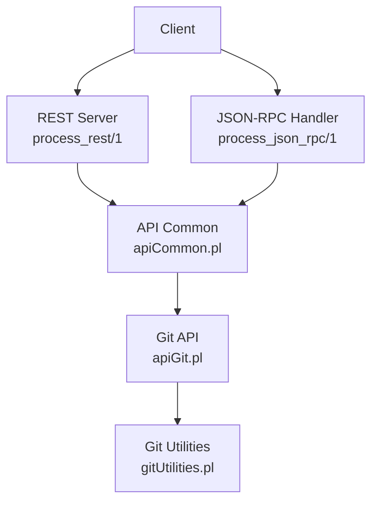
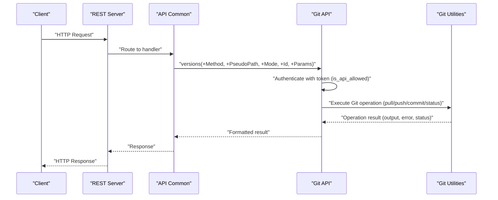
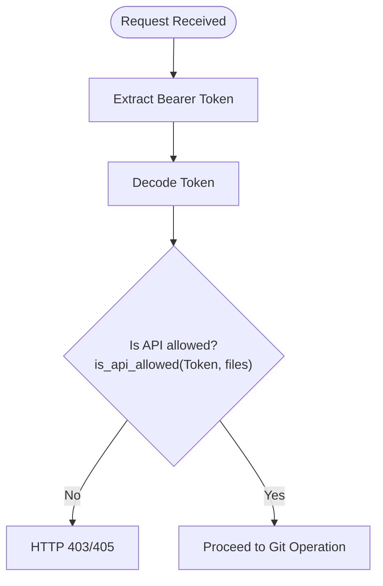
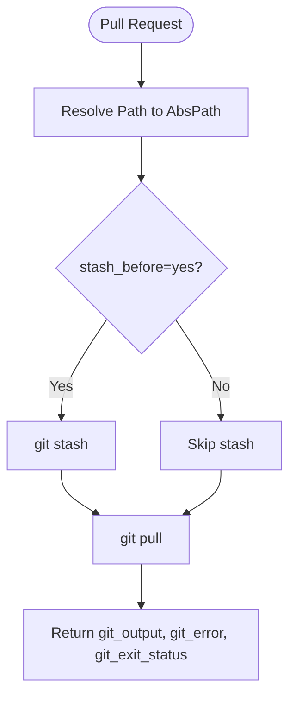
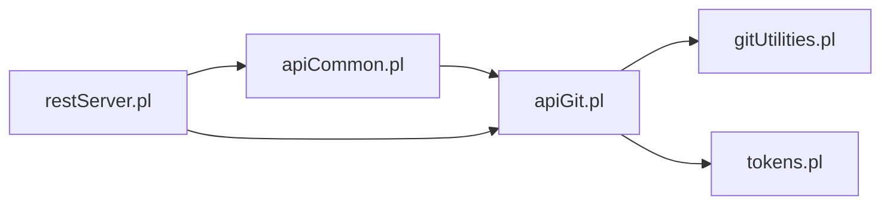

# Git Operations API

<cite>
**Referenced Files in This Document**
- [apiCommon.pl](file://src/apiCommon.pl)
- [apiGit.pl](file://src/apiGit.pl)
- [gitUtilities.pl](file://src/gitUtilities.pl)
- [restServer.pl](file://src/restServer.pl)
- [tokens.pl](file://src/tokens.pl)
- [errors.pl](file://src/errors.pl)
- [api.json](file://api/postman/api.json)
</cite>

## Table of Contents
1. [Introduction](#introduction)
2. [Project Structure](#project-structure)
3. [Core Components](#core-components)
4. [Architecture Overview](#architecture-overview)
5. [Detailed Component Analysis](#detailed-component-analysis)
6. [Dependency Analysis](#dependency-analysis)
7. [Performance Considerations](#performance-considerations)
8. [Troubleshooting Guide](#troubleshooting-guide)
9. [Conclusion](#conclusion)
10. [Appendices](#appendices)

## Introduction
This document provides comprehensive API documentation for Git repository integration endpoints in the Timelink Kleio project. It covers:
- POST /versions/pull/{path}: fetch updates from remote repositories with conflict resolution strategies
- POST /versions/push: commit local changes and push to remote repositories
- GET /versions/status/global: check repository state, branch information, and uncommitted changes
- Authentication requirements for Git operations
- Error handling for network issues and merge conflicts
- Examples of typical Git workflows, automated synchronization patterns, and repository maintenance operations
- Security considerations for Git credentials, branch protection rules, and access control

## Project Structure
The Git API is exposed via a REST and JSON-RPC interface. The primary entry points are defined in the API common module and implemented in the Git API module, which delegates to Git utilities for actual operations. Authentication is enforced via bearer tokens managed by the tokens module.

**Diagram sources**
- [apiCommon.pl](file://src/apiCommon.pl#L65-L76)
- [apiGit.pl](file://src/apiGit.pl#L23-L32)
- [gitUtilities.pl](file://src/gitUtilities.pl#L1-L21)

**Section sources**
- [apiCommon.pl](file://src/apiCommon.pl#L65-L76)
- [restServer.pl](file://src/restServer.pl#L34-L48)

## Core Components
- API Common: Declares the Git endpoints and maps HTTP methods to JSON-RPC or REST handlers.
- Git API: Implements Git operations with authentication checks and result formatting.
- Git Utilities: Provides low-level Git operations (pull, push, commit, status, user info).
- REST Server: Processes REST and JSON-RPC requests and handles errors.
- Tokens: Manages bearer tokens and permission checks for API access.

Key endpoint mappings:
- GET /versions/status/global → JSON-RPC: versions_get_global_status
- GET /versions/remotes/branches → JSON-RPC: versions_get_remotes_branches
- GET /versions/user-info → JSON-RPC: versions_get_user_info
- GET /versions/pull → JSON-RPC: versions_pull
- PUT /versions/push → JSON-RPC: versions_push
- PUT /versions/commit → JSON-RPC: versions_commit
- PUT /versions/set-user-info → JSON-RPC: versions_set_user_info
- DELETE /versions/reset → JSON-RPC: versions_reset

**Section sources**
- [apiCommon.pl](file://src/apiCommon.pl#L65-L76)
- [apiGit.pl](file://src/apiGit.pl#L156-L189)

## Architecture Overview
The Git API enforces authentication using bearer tokens and delegates Git operations to utility predicates. Network failures and Git errors are captured and returned with appropriate status codes and messages.

**Diagram sources**
- [apiGit.pl](file://src/apiGit.pl#L34-L82)
- [gitUtilities.pl](file://src/gitUtilities.pl#L226-L264)
- [restServer.pl](file://src/restServer.pl#L43-L83)

## Detailed Component Analysis

### Authentication and Authorization
- All Git endpoints require a bearer token. The token is validated and checked against allowed permissions (files).
- Tokens are managed centrally and support admin privileges and user-specific scopes.

**Diagram sources**
- [apiGit.pl](file://src/apiGit.pl#L36-L42)
- [tokens.pl](file://src/tokens.pl#L141-L147)

**Section sources**
- [apiGit.pl](file://src/apiGit.pl#L36-L42)
- [tokens.pl](file://src/tokens.pl#L141-L147)

### GET /versions/status/global
Purpose: Retrieve global repository status including branch comparison, ahead/behind counts, recent logs, diffs, and working directory status.

Request
- Method: GET
- Path: /versions/status/global/{path}
- Authentication: Bearer token with files permission
- Query parameters: None (options passed via Params)
- Response: JSON object containing repository metadata, branch info, logs, diffs, and working directory status

Response schema
- directory: string
- git_root: string
- user_name: string
- user_email: string
- branch: string
- remote: string
- rbranch: string
- ahead: integer
- behind: integer
- comparing_to: string
- logs: array of git_log
- origin_new_logs: array of git_log
- local_new_logs: array of git_log
- origin_changes: array of file
- local_changes: array of file
- work_dir_status: array of file
- fetch_status: integer
- fetch_message: string
- fetch_lines: string
- report: string (human-readable summary)

Notes
- The endpoint performs a fetch and computes ahead/behind counts compared to the tracked remote branch.
- Working directory status lists modified files not yet committed.

**Section sources**
- [apiGit.pl](file://src/apiGit.pl#L51-L68)
- [gitUtilities.pl](file://src/gitUtilities.pl#L24-L81)

### GET /versions/remotes/branches
Purpose: List remote branches and their ahead/behind status relative to the current branch.

Request
- Method: GET
- Path: /versions/remotes/branches/{path}
- Authentication: Bearer token with files permission
- Response: JSON array of remote_branch entries

Response schema
- remote_branch: {
  - ahead: integer
  - behind: integer
  - current: string
  - name: string
  - remote: {
    - direction: string
    - name: string
    - url: string
  }
}

**Section sources**
- [apiGit.pl](file://src/apiGit.pl#L34-L49)
- [gitUtilities.pl](file://src/gitUtilities.pl#L632-L678)

### GET /versions/user-info
Purpose: Retrieve configured Git user name and email for the repository.

Request
- Method: GET
- Path: /versions/user-info/{path}
- Authentication: Bearer token with files permission
- Response: JSON object with git_user_name and git_user_email

**Section sources**
- [apiGit.pl](file://src/apiGit.pl#L84-L95)
- [gitUtilities.pl](file://src/gitUtilities.pl#L345-L354)

### GET /versions/pull
Purpose: Fetch updates from the remote repository. Supports optional stash-before behavior to preserve local changes.

Request
- Method: GET
- Path: /versions/pull/{path}
- Authentication: Bearer token with files permission
- Query parameters:
  - stash_before: yes/no (default no)
  - Additional git_params for the underlying git pull command
- Response: JSON object with git_output, git_error, git_exit_status

Conflict resolution strategies
- If stash_before=yes, local changes are stashed prior to pull.
- If conflicts arise during pull, the operation returns non-zero exit status and error details in git_error.

**Diagram sources**
- [apiGit.pl](file://src/apiGit.pl#L71-L82)
- [gitUtilities.pl](file://src/gitUtilities.pl#L240-L264)

**Section sources**
- [apiGit.pl](file://src/apiGit.pl#L71-L82)
- [gitUtilities.pl](file://src/gitUtilities.pl#L240-L264)

### PUT /versions/push
Purpose: Push local commits to the remote repository.

Request
- Method: PUT
- Path: /versions/push
- Authentication: Bearer token with files permission
- Query parameters: Additional git_params for the underlying git push command
- Response: JSON object with git_output, git_error, git_exit_status

Error handling
- Network issues and push failures are captured with error messages and exit status.

**Section sources**
- [apiGit.pl](file://src/apiGit.pl#L97-L108)
- [gitUtilities.pl](file://src/gitUtilities.pl#L291-L313)

### PUT /versions/commit
Purpose: Stage and commit specified files with an optional commit message.

Request
- Method: PUT
- Path: /versions/commit
- Authentication: Bearer token with files permission
- Query parameters:
  - add_files: space-separated list of files to stage
  - commit_files: space-separated list of files to commit
  - commit_message: commit message
  - Additional git_params for the underlying git commit command
- Response: JSON object with git_output, git_error, git_exit_status

Behavior
- If add_files is provided, files are staged before commit.
- If commit_files is provided, only those files are committed; otherwise, the commit may include staged changes.

**Section sources**
- [apiGit.pl](file://src/apiGit.pl#L110-L124)
- [gitUtilities.pl](file://src/gitUtilities.pl#L371-L424)

### PUT /versions/set-user-info
Purpose: Configure Git user name and email for the repository.

Request
- Method: PUT
- Path: /versions/set-user-info/{path}
- Authentication: Bearer token with files permission
- Query parameters:
  - user_name: new user name
  - user_email: new user email
- Response: JSON object with git_output, git_error, git_exit_status

**Section sources**
- [apiGit.pl](file://src/apiGit.pl#L126-L139)
- [gitUtilities.pl](file://src/gitUtilities.pl#L356-L369)

### DELETE /versions/reset
Purpose: Reset the local repository to a specific commit reference.

Request
- Method: DELETE
- Path: /versions/reset/{path}
- Authentication: Bearer token with files permission
- Query parameters:
  - reset_mode: reset mode (e.g., --soft)
  - commit_ref: commit reference (default HEAD)
- Response: JSON object with git_output, git_error, git_exit_status

**Section sources**
- [apiGit.pl](file://src/apiGit.pl#L141-L154)
- [gitUtilities.pl](file://src/gitUtilities.pl#L266-L289)

## Dependency Analysis
The Git API depends on:
- API Common for endpoint routing
- Git Utilities for Git operations
- REST Server for request processing and error formatting
- Tokens for authentication and authorization

**Diagram sources**
- [apiCommon.pl](file://src/apiCommon.pl#L78-L88)
- [apiGit.pl](file://src/apiGit.pl#L17-L21)
- [restServer.pl](file://src/restServer.pl#L151-L162)

**Section sources**
- [apiCommon.pl](file://src/apiCommon.pl#L78-L88)
- [apiGit.pl](file://src/apiGit.pl#L17-L21)
- [restServer.pl](file://src/restServer.pl#L151-L162)

## Performance Considerations
- Fetch operations: The global status endpoint triggers a fetch; consider caching or batching to reduce network overhead.
- Large diffs: Computing diffs and logs can be expensive; use pagination or filtering options where supported.
- Concurrency: The REST server supports multiple workers; ensure Git operations are idempotent to avoid race conditions.

## Troubleshooting Guide
Common issues and resolutions:
- Authentication failures: Ensure the bearer token has files permission. Verify token validity and expiration.
- Not found errors: Confirm the path resolves to an existing repository directory.
- Network errors during pull/push: Check connectivity and remote URL configuration. Retry with stash_before for pull if local changes exist.
- Merge conflicts during pull: Resolve conflicts manually, commit, then push.
- Permission denied: Review token scopes and ensure the user has access to the repository path.

Error handling mechanisms:
- HTTP exceptions are thrown for unauthorized or missing resources.
- Git operations capture stderr and exit status for diagnostics.
- JSON-RPC errors are formatted and returned consistently.

**Section sources**
- [apiGit.pl](file://src/apiGit.pl#L40-L48)
- [gitUtilities.pl](file://src/gitUtilities.pl#L201-L223)
- [errors.pl](file://src/errors.pl#L85-L99)

## Conclusion
The Git Operations API provides a robust interface for managing Git repositories through REST and JSON-RPC. It enforces strict authentication, offers comprehensive status reporting, and supports essential Git operations with clear error handling. By following the recommended workflows and security practices, teams can automate synchronization and maintain repository health effectively.

## Appendices

### Endpoint Reference
- GET /versions/status/global/{path} → JSON-RPC: versions_get_global_status
- GET /versions/remotes/branches/{path} → JSON-RPC: versions_get_remotes_branches
- GET /versions/user-info/{path} → JSON-RPC: versions_get_user_info
- GET /versions/pull/{path} → JSON-RPC: versions_pull
- PUT /versions/push → JSON-RPC: versions_push
- PUT /versions/commit → JSON-RPC: versions_commit
- PUT /versions/set-user-info/{path} → JSON-RPC: versions_set_user_info
- DELETE /versions/reset/{path} → JSON-RPC: versions_reset

### Typical Workflows and Patterns
- Automated synchronization:
  - Periodically call GET /versions/status/global/{path} to detect changes.
  - If behind > 0, call GET /versions/pull/{path} with stash_before=yes to safely incorporate upstream changes.
  - After resolving conflicts, call PUT /versions/commit and PUT /versions/push.
- Repository maintenance:
  - Use GET /versions/user-info/{path} to verify identity.
  - Use PUT /versions/set-user-info/{path} to configure user details.
  - Use DELETE /versions/reset/{path} to undo unwanted commits when appropriate.

### Security Considerations
- Token management: Use short-lived tokens with minimal scopes. Admin tokens should be protected and rotated regularly.
- Credentials: Avoid embedding credentials in URLs. Use token-based authentication.
- Branch protection: Enforce branch protection rules on remote repositories to prevent force pushes and unauthorized merges.
- Access control: Restrict file paths to authorized users to minimize exposure.

**Section sources**
- [apiCommon.pl](file://src/apiCommon.pl#L65-L76)
- [tokens.pl](file://src/tokens.pl#L104-L139)
- [api.json](file://api/postman/api.json#L1-L800)