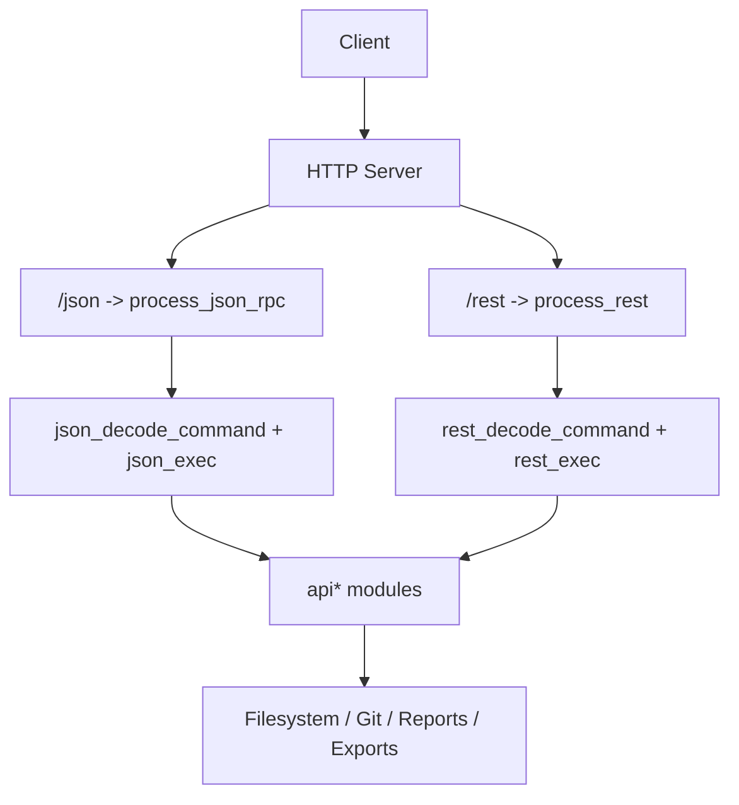
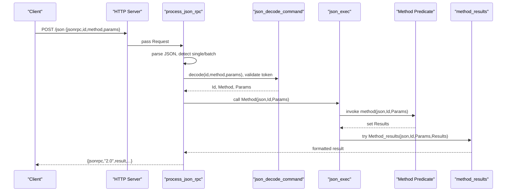
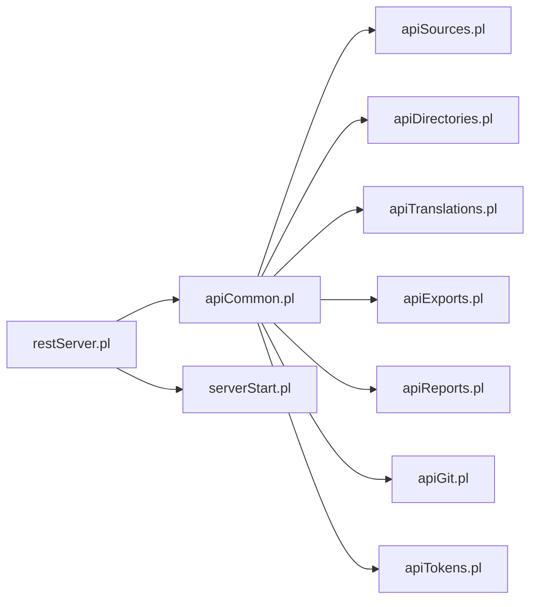

# JSON-RPC Methods

<cite>
**Referenced Files in This Document**
- [restServer.pl](file://src/restServer.pl)
- [apiCommon.pl](file://src/apiCommon.pl)
- [apiSources.pl](file://src/apiSources.pl)
- [apiDirectories.pl](file://src/apiDirectories.pl)
- [apiTranslations.pl](file://src/apiTranslations.pl)
- [apiExports.pl](file://src/apiExports.pl)
- [apiReports.pl](file://src/apiReports.pl)
- [apiGit.pl](file://src/apiGit.pl)
- [apiTokens.pl](file://src/apiTokens.pl)
- [serverStart.pl](file://src/serverStart.pl)
</cite>

## Table of Contents
1. [Introduction](#introduction)
2. [Project Structure](#project-structure)
3. [Core Components](#core-components)
4. [Architecture Overview](#architecture-overview)
5. [Detailed Component Analysis](#detailed-component-analysis)
6. [Dependency Analysis](#dependency-analysis)
7. [Performance Considerations](#performance-considerations)
8. [Troubleshooting Guide](#troubleshooting-guide)
9. [Conclusion](#conclusion)
10. [Appendices](#appendices)

## Introduction
This document provides a comprehensive JSON-RPC API specification for the server implementation. It covers method signatures, parameter schemas, return values, error handling, batch request processing, naming conventions, and the relationship between JSON-RPC methods and REST endpoints. It also includes client implementation guidelines and explains how new methods can be added to the system.

The server exposes a JSON-RPC 2.0 endpoint at /json and a REST endpoint at /rest. Both share common authentication via tokens and dispatch into domain-specific modules (sources, directories, translations, exports, reports, git/versions, tokens).

## Project Structure
The JSON-RPC entry point is registered under the /json path and delegates to process_json_rpc/1. The REST entry point is registered under /rest and delegates to process_rest/1. Domain logic is implemented in separate api* modules and re-exported through apiCommon.

**Diagram sources**
- [restServer.pl:304-306](file://src/restServer.pl#L304-L306)
- [restServer.pl:656-696](file://src/restServer.pl#L656-L696)
- [restServer.pl:469-515](file://src/restServer.pl#L469-L515)

**Section sources**
- [restServer.pl:304-306](file://src/restServer.pl#L304-L306)
- [apiCommon.pl:1-101](file://src/apiCommon.pl#L1-L101)

## Core Components
- JSON-RPC dispatcher: parses requests, validates token, decodes parameters, invokes method predicates, and formats responses.
- Batch support: processes arrays of requests and returns an array of results.
- Method naming convention: JSON-RPC method names are atoms like sources_get, translations_translate, etc., which map to module predicates with signature method(json, Id, Params).
- Result formatting: each method may implement a corresponding method_results(json, Id, Params, Results) predicate to format output; otherwise default formatting is used.

Key responsibilities:
- Authentication and authorization via tokens.
- Parameter decoding and validation.
- Error mapping to JSON-RPC error objects.
- Response serialization.

**Section sources**
- [restServer.pl:656-779](file://src/restServer.pl#L656-L779)
- [restServer.pl:86-106](file://src/restServer.pl#L86-L106)

## Architecture Overview
The JSON-RPC pipeline:
1. HTTP POST to /json.
2. parse JSON payload; if list, treat as batch.
3. decode command: extract id, method, params; validate token.
4. execute method by calling method(json, Id, Params).
5. format result using method_results or default formatter.
6. return JSON-RPC response object(s).

**Diagram sources**
- [restServer.pl:656-779](file://src/restServer.pl#L656-L779)
- [restServer.pl:86-106](file://src/restServer.pl#L86-L106)

## Detailed Component Analysis

### Global JSON-RPC Behavior
- Endpoint: POST /json
- Content-Type: application/json
- Required fields: jsonrpc="2.0", method, params (object), optional id
- Authentication: params.token must be present and valid
- Batch: params is an array of request objects; server returns an array of responses

Request schema:
- Single request:
  - jsonrpc: string "2.0"
  - method: string
  - params: object
  - id: any (string/number/null)
- Batch request:
  - Array of request objects

Response schema:
- Success: { jsonrpc:"2.0", result: ..., id: ... }
- Error: { jsonrpc:"2.0", error: { code:number, message:string, data:any }, id: ... }
- Batch: array of success/error responses

Error codes commonly used:
- -32700: Parse error
- -32600: Invalid Request
- -32601: Method not found
- -32602: Invalid params
- -32000 to -32099: Server-side errors (domain-specific)

Notes:
- If method does not exist, server throws method_not_found(Id,Op).
- Missing or invalid token yields invalid_params or invalid_request errors.
- For batch, each element is processed independently; partial failures are allowed.

**Section sources**
- [restServer.pl:656-779](file://src/restServer.pl#L656-L779)
- [restServer.pl:86-106](file://src/restServer.pl#L86-L106)

### Method Naming Conventions
- Method names follow entity_operation pattern, e.g., sources_get, translations_translate.
- Each method has a corresponding predicate method(json, Id, Params) in the relevant api* module.
- Optional result formatter: method_results(json, Id, Params, Results).

Relationship to REST:
- Many JSON-RPC methods mirror REST endpoints documented in apiCommon.
- Some REST-only operations (e.g., multipart uploads) do not have JSON-RPC equivalents.

**Section sources**
- [apiCommon.pl:22-88](file://src/apiCommon.pl#L22-L88)

### Sources
JSON-RPC methods:
- sources_get
  - Purpose: Retrieve source file content or list files in directory.
  - Parameters:
    - path: string (relative to user sources root)
    - recurse: 'yes' | 'no' (optional)
    - url: 'yes' | 'no' (optional; when listing directories, include download links)
  - Returns:
    - File content or list of files/directories depending on path type.
  - Errors:
    - Not found if path does not exist.
    - Forbidden if token lacks required permissions.
- sources_delete
  - Purpose: Delete a file or directory (optionally recursive).
  - Parameters:
    - path: string
    - recurse: 'yes' | 'no' (optional)
  - Returns:
    - Deletion status or list of deleted items.
  - Errors:
    - Not found, forbidden, or conflict if file is being processed.

REST mapping:
- GET /sources/{path} -> sources_get
- DELETE /sources/{path} -> sources_delete
- POST/PUT multipart upload/update are REST-only.

Example request (single):
{
  "jsonrpc": "2.0",
  "id": 1,
  "method": "sources_get",
  "params": {
    "token": "<your_token>",
    "path": "paroquiais/baptismos",
    "recurse": "no",
    "url": "yes"
  }
}

Example response (success):
{
  "jsonrpc": "2.0",
  "id": 1,
  "result": {
    "files": ["bap-com-celebrantes.cli", "bapt1714.cli"],
    "links": ["http://localhost:8088/sources/paroquiais/baptismos/bap-com-celebrantes.cli", "..."]
  }
}

**Section sources**
- [apiSources.pl:28-104](file://src/apiSources.pl#L28-L104)
- [apiSources.pl:179-200](file://src/apiSources.pl#L179-L200)
- [apiCommon.pl:26-66](file://src/apiCommon.pl#L26-L66)

### Directories
JSON-RPC methods:
- directories_get
  - Purpose: List subdirectories under a path; supports recursion.
  - Parameters:
    - path: string
    - recurse: 'yes' | 'no' (optional)
  - Returns:
    - List of subdirectory paths.
- directories_create
  - Purpose: Create a directory.
  - Parameters:
    - path: string
  - Returns:
    - Creation status.
- directories_copy
  - Purpose: Copy a directory from origin to destination.
  - Parameters:
    - origin: string (source directory)
    - path: string (destination directory)
  - Returns:
    - Copy status.
- directories_delete
  - Purpose: Remove a directory; optionally force delete contents.
  - Parameters:
    - path: string
    - force: 'yes' | 'no' (optional)
  - Returns:
    - Deletion status.

REST mapping:
- GET /directories/{path} -> directories_get
- POST /directories/{path} -> directories_create
- POST /directories/{path}?origin=... -> directories_copy
- DELETE /directories/{path} -> directories_delete

Example request (create):
{
  "jsonrpc": "2.0",
  "id": 2,
  "method": "directories_create",
  "params": {
    "token": "<your_token>",
    "path": "paroquiais/casamentos"
  }
}

Example response (success):
{
  "jsonrpc": "2.0",
  "id": 2,
  "result": {
    "created": "paroquiais/casamentos"
  }
}

**Section sources**
- [apiDirectories.pl:18-91](file://src/apiDirectories.pl#L18-L91)
- [apiCommon.pl:67-70](file://src/apiCommon.pl#L67-L70)

### Translations
JSON-RPC methods:
- translations_translate
  - Purpose: Start translation of one or more files/directories.
  - Parameters:
    - path: string (file or directory)
    - structure: string (optional; structure file path)
    - echo: 'yes' | 'no' (optional; include source lines in report)
    - recurse: 'yes' | 'no' (optional; descend into subdirectories)
    - spawn: 'yes' | 'no' (optional; parallelize across workers)
  - Returns:
    - Job identifiers and metadata for each translated file.
- translations_get
  - Purpose: Retrieve translation status/results for files/directories.
  - Parameters:
    - path: string
    - recurse: 'yes' | 'no' (optional)
    - status: filter by translation status (optional)
  - Returns:
    - Translation status entries per file.
- translations_delete
  - Purpose: Clear translation results for files/directories.
  - Parameters:
    - path: string
  - Returns:
    - Deletion status.

REST mapping:
- POST /translations/{path} -> translations_translate
- GET /translations/{path} -> translations_get
- DELETE /translations/{path} -> translations_delete

Example request (translate):
{
  "jsonrpc": "2.0",
  "id": 3,
  "method": "translations_translate",
  "params": {
    "token": "<your_token>",
    "path": "paroquiais/baptismos/bapt1714.cli",
    "structure": "structures/gacto2.str",
    "echo": "no",
    "recurse": "no",
    "spawn": "no"
  }
}

Example response (success):
{
  "jsonrpc": "2.0",
  "id": 3,
  "result": {
    "jobs": [
      {
        "job_id": "abc123",
        "source": "paroquiais/baptismos/bapt1714.cli",
        "structure": "structures/gacto2.str",
        "echo": false
      }
    ]
  }
}

**Section sources**
- [apiTranslations.pl:35-164](file://src/apiTranslations.pl#L35-L164)
- [apiCommon.pl:72-74](file://src/apiCommon.pl#L72-L74)

### Exports
JSON-RPC methods:
- exports_get
  - Purpose: Retrieve XML export file(s) associated with translation outputs.
  - Parameters:
    - path: string (file or directory)
  - Returns:
    - Export content or list of export files.

REST mapping:
- GET /exports/{path} -> exports_get

Example request:
{
  "jsonrpc": "2.0",
  "id": 4,
  "method": "exports_get",
  "params": {
    "token": "<your_token>",
    "path": "paroquiais/baptismos/bapt1714.xml"
  }
}

**Section sources**
- [apiExports.pl:14-21](file://src/apiExports.pl#L14-L21)
- [apiCommon.pl:75](file://src/apiCommon.pl#L75)

### Reports
JSON-RPC methods:
- reports_get
  - Purpose: Retrieve translation report file(s) (.rpt).
  - Parameters:
    - path: string (file or directory)
  - Returns:
    - Report content or list of report files.

REST mapping:
- GET /reports/{path} -> reports_get

Example request:
{
  "jsonrpc": "2.0",
  "id": 5,
  "method": "reports_get",
  "params": {
    "token": "<your_token>",
    "path": "paroquiais/baptismos/bapt1714.rpt"
  }
}

**Section sources**
- [apiReports.pl:14-21](file://src/apiReports.pl#L14-L21)
- [apiCommon.pl:76](file://src/apiCommon.pl#L76)

### Structures
JSON-RPC methods:
- structures_get
  - Purpose: Retrieve structure file info or resolve structure for a Kleio source file.
  - Parameters:
    - path: string (structure file or directory)
    - kleio: string (optional; Kleio source file path to resolve associated structure)
    - recurse: 'yes' | 'no' (optional; list structure files recursively)
  - Returns:
    - Structure file attributes or list of structure files.

REST mapping:
- GET /structures/{path} -> structures_get

Example request (resolve structure):
{
  "jsonrpc": "2.0",
  "id": 6,
  "method": "structures_get",
  "params": {
    "token": "<your_token>",
    "kleio": "paroquiais/baptismos/bapt1714.cli"
  }
}

Example response (success):
{
  "jsonrpc": "2.0",
  "id": 6,
  "result": {
    "kleio": "paroquiais/baptismos/bapt1714.cli",
    "structure": "structures/gacto2.str"
  }
}

**Section sources**
- [apiStructures.pl:22-152](file://src/apiStructures.pl#L22-L152)
- [apiCommon.pl:71](file://src/apiCommon.pl#L71)

### Git Versions
JSON-RPC methods:
- versions_get_global_status
  - Purpose: Get global repository status.
  - Parameters:
    - path: string (repository root)
  - Returns:
    - Status information including report text.
- versions_get_remotes_branches
  - Purpose: List remote branches.
  - Parameters:
    - path: string (repository root)
  - Returns:
    - Branch list.
- versions_get_user_info
  - Purpose: Get configured user name and email.
  - Parameters:
    - path: string (repository root)
  - Returns:
    - User info.
- versions_pull
  - Purpose: Pull changes from remote.
  - Parameters:
    - path: string (repository root)
  - Returns:
    - Output, error, exit status.
- versions_push
  - Purpose: Push changes to remote.
  - Parameters:
    - path: string (repository root)
  - Returns:
    - Output, error, exit status.
- versions_commit
  - Purpose: Commit changes locally.
  - Parameters:
    - path: string (repository root)
    - add_files: string (optional)
    - commit_files: string (optional)
    - commit_message: string (optional)
  - Returns:
    - Output, error, exit status.
- versions_set_user_info
  - Purpose: Set user name and email.
  - Parameters:
    - path: string (repository root)
    - user_name: string
    - user_email: string
  - Returns:
    - Output, error, exit status.
- versions_reset
  - Purpose: Reset local repository to a reference.
  - Parameters:
    - path: string (repository root)
    - reset_mode: string (default '--soft')
    - commit_ref: string (default 'HEAD')
  - Returns:
    - Output, error, exit status.

REST mapping:
- GET /versions/status/global/{path} -> versions_get_global_status
- GET /versions/remotes/branches/{path} -> versions_get_remotes_branches
- GET /versions/user-info/{path} -> versions_get_user_info
- GET /versions/pull/{path} -> versions_pull
- PUT /versions/push/{path} -> versions_push
- PUT /versions/commit/{path} -> versions_commit
- PUT /versions/set-user-info/{path} -> versions_set_user_info
- DELETE /versions/reset/{path} -> versions_reset

Example request (status):
{
  "jsonrpc": "2.0",
  "id": 7,
  "method": "versions_get_global_status",
  "params": {
    "token": "<your_token>",
    "path": "."
  }
}

**Section sources**
- [apiGit.pl:23-189](file://src/apiGit.pl#L23-L189)
- [apiCommon.pl:78-85](file://src/apiCommon.pl#L78-L85)

### Tokens and Users
JSON-RPC methods:
- tokens_generate
  - Purpose: Generate a token for a user with specified privileges.
  - Parameters:
    - user: string (username)
    - info: object (API privileges and optional settings)
    - token: string (admin token with generate_token privilege)
  - Returns:
    - New token string.
- tokens_invalidate
  - Purpose: Invalidate a specific token.
  - Parameters:
    - token: string (admin token with invalidate_token privilege)
    - user_token: string (token to invalidate)
  - Returns:
    - Confirmation of invalidation.
- users_invalidate
  - Purpose: Invalidate all tokens for a user.
  - Parameters:
    - token: string (admin token with invalidate_user privilege)
    - user: string (username)
  - Returns:
    - Confirmation of invalidation.

REST mapping:
- POST /tokens/{user} -> tokens_generate
- DELETE /tokens/{token} -> tokens_invalidate
- DELETE /users/{token} -> users_invalidate

Example request (generate token):
{
  "jsonrpc": "2.0",
  "id": 8,
  "method": "tokens_generate",
  "params": {
    "token": "<admin_token>",
    "user": "analyst",
    "info": {
      "comment": "Analyst access",
      "api": ["files","translations","structures"]
    }
  }
}

Example response (success):
{
  "jsonrpc": "2.0",
  "id": 8,
  "result": "new_user_token_value"
}

**Section sources**
- [apiTokens.pl:18-122](file://src/apiTokens.pl#L18-L122)
- [apiCommon.pl:53-55](file://src/apiCommon.pl#L53-L55)

### Client Log
JSON-RPC methods:
- client_log_send
  - Purpose: Send debug messages to server logs.
  - Parameters:
    - message: string
    - level: string (optional; e.g., 'debug', 'info')
  - Returns:
    - Acknowledgement.

REST mapping:
- POST /client_log -> client_log_send

Example request:
{
  "jsonrpc": "2.0",
  "id": 9,
  "method": "client_log_send",
  "params": {
    "token": "<your_token>",
    "message": "Client started translation job",
    "level": "info"
  }
}

**Section sources**
- [apiCommon.pl:56](file://src/apiCommon.pl#L56)

## Dependency Analysis
The JSON-RPC layer depends on:
- HTTP server and JSON parsing libraries.
- Token management and permission checks.
- Domain modules (api*) for business logic.
- Utilities for logging, persistence, and reporting.

**Diagram sources**
- [restServer.pl:131-162](file://src/restServer.pl#L131-L162)
- [apiCommon.pl:90-100](file://src/apiCommon.pl#L90-L100)
- [serverStart.pl:1-10](file://src/serverStart.pl#L1-L10)

**Section sources**
- [restServer.pl:131-162](file://src/restServer.pl#L131-L162)
- [apiCommon.pl:90-100](file://src/apiCommon.pl#L90-L100)

## Performance Considerations
- Use spawn=yes for translations_translate to distribute work across workers when appropriate.
- Prefer recurse=no for large trees unless necessary.
- Cache-friendly calls: translations_get uses internal caching for repeated queries; avoid excessive concurrent calls with different parameters to reduce cache churn.
- Batch requests: group independent operations to reduce overhead.

[No sources needed since this section provides general guidance]

## Troubleshooting Guide
Common errors:
- Parse error (-32700): malformed JSON payload.
- Invalid Request (-32600): missing required fields (e.g., method).
- Method not found (-32601): unknown method name.
- Invalid params (-32602): missing token or invalid token value.
- Server errors (-320xx): domain-specific issues (e.g., file not found, forbidden, directory not empty).

Debugging tips:
- Enable debug logging via environment variables.
- Inspect server logs for detailed stack traces.
- Validate token permissions and ensure correct API privileges.

**Section sources**
- [restServer.pl:676-683](file://src/restServer.pl#L676-L683)
- [restServer.pl:752-769](file://src/restServer.pl#L752-L769)

## Conclusion
The JSON-RPC API provides a consistent, token-authenticated interface to manage sources, directories, translations, exports, reports, structures, git operations, and tokens. Methods follow clear naming conventions and map closely to REST endpoints. Clients should handle both single and batch requests, respect error codes, and use appropriate parameters for performance and correctness.

[No sources needed since this section summarizes without analyzing specific files]

## Appendices

### Adding a New JSON-RPC Method
Steps:
1. Choose a method name following entity_operation convention (e.g., myentity_doaction).
2. Implement myentity_doaction(json, Id, Params) in the relevant api* module.
3. Optionally implement myentity_doaction_results(json, Id, Params, Results) for custom formatting.
4. Ensure token permissions cover the operation.
5. Register the method in apiCommon documentation if it maps to a REST endpoint.
6. Test with single and batch requests.

**Section sources**
- [restServer.pl:86-106](file://src/restServer.pl#L86-L106)
- [apiCommon.pl:22-88](file://src/apiCommon.pl#L22-L88)

### Batch Request Processing
Behavior:
- Input: array of request objects.
- Processing: each request decoded and executed independently.
- Output: array of responses preserving order.

Example batch request:
[
  {
    "jsonrpc": "2.0",
    "id": 1,
    "method": "sources_get",
    "params": {"token":"<t>","path":"dir1"}
  },
  {
    "jsonrpc": "2.0",
    "id": 2,
    "method": "translations_get",
    "params": {"token":"<t>","path":"dir2"}
  }
]

Example batch response:
[
  {"jsonrpc":"2.0","id":1,"result":{"files":["a.cli","b.cli"]}},
  {"jsonrpc":"2.0","id":2,"result":{"status":[{"file":"c.cli","state":"ok"}]}}
]

**Section sources**
- [restServer.pl:698-716](file://src/restServer.pl#L698-L716)

### Relationship Between JSON-RPC and REST Endpoints
- Most JSON-RPC methods correspond to REST endpoints documented in apiCommon.
- Some REST features (multipart uploads) are not exposed via JSON-RPC.
- Method names often mirror REST actions (get, post, put, delete) mapped to entity_operation.

**Section sources**
- [apiCommon.pl:26-87](file://src/apiCommon.pl#L26-L87)