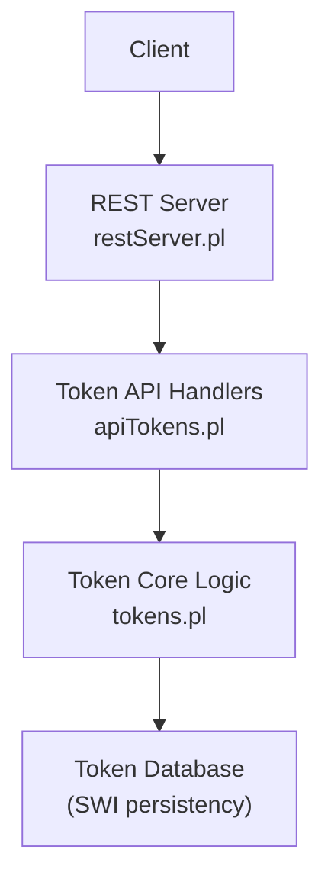
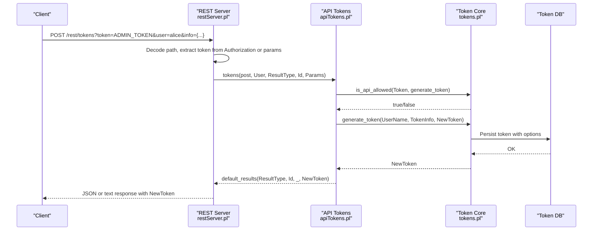
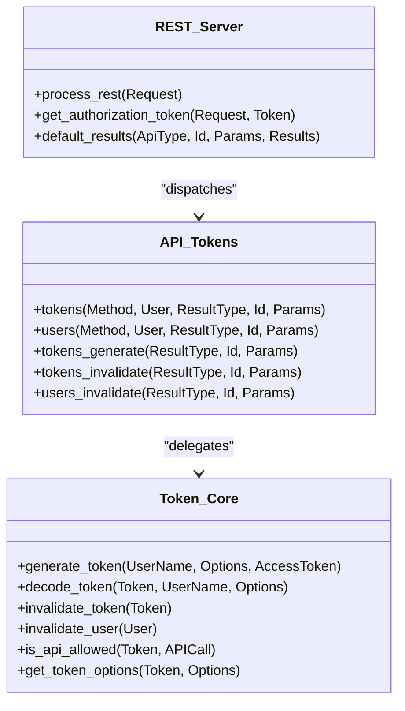

# Authentication & Token Endpoints

<cite>
**Referenced Files in This Document**
- [restServer.pl](file://src/restServer.pl)
- [apiTokens.pl](file://src/apiTokens.pl)
- [tokens.pl](file://src/tokens.pl)
</cite>

## Table of Contents
1. [Introduction](#introduction)
2. [Project Structure](#project-structure)
3. [Core Components](#core-components)
4. [Architecture Overview](#architecture-overview)
5. [Detailed Component Analysis](#detailed-component-analysis)
6. [Dependency Analysis](#dependency-analysis)
7. [Performance Considerations](#performance-considerations)
8. [Troubleshooting Guide](#troubleshooting-guide)
9. [Conclusion](#conclusion)
10. [Appendices](#appendices)

## Introduction
This document provides detailed API documentation for authentication and token management endpoints under /rest/tokens/*. It covers the full token lifecycle:
- Generate a new token (POST to /rest/tokens)
- Invalidate a specific token (DELETE to /rest/tokens/{token})
- Invalidate all tokens for a user (DELETE to /rest/users/{user_token})
- Retrieve token details (GET to /rest/tokens/{token})

It also documents request/response schemas, practical examples (bootstrap token generation, user-specific token creation, permission-based access control), security best practices, token rotation strategies, and integration with external authentication systems.

## Project Structure
The REST server is implemented in Prolog and exposes HTTP handlers for /rest/* paths. The token-related endpoints are handled by the apiTokens module, which delegates core logic to the tokens module. The restServer module performs routing, authorization extraction, parameter decoding, and response formatting.

**Diagram sources**
- [restServer.pl:304-306](file://src/restServer.pl#L304-L306)
- [apiTokens.pl:1-125](file://src/apiTokens.pl#L1-L125)
- [tokens.pl:1-120](file://src/tokens.pl#L1-L120)

**Section sources**
- [restServer.pl:304-306](file://src/restServer.pl#L304-L306)
- [apiTokens.pl:1-125](file://src/apiTokens.pl#L1-L125)
- [tokens.pl:1-120](file://src/tokens.pl#L1-L120)

## Core Components
- REST Router and Dispatcher:
  - Handles /rest/* requests, extracts Authorization header, decodes parameters, and dispatches to entity handlers.
- Token API Handlers:
  - Implements POST /rest/tokens (generate), DELETE /rest/tokens/{token} (invalidate), DELETE /rest/users/{user_token} (invalidate user).
- Token Core:
  - Generates tokens, persists them, checks permissions, supports expiration via life_span, and provides admin bootstrap flow.

Key responsibilities:
- Authorization: Extract Bearer token from Authorization header or query parameter.
- Permission checks: Validate that the calling token has required API permissions (e.g., generate_token, invalidate_token, invalidate_user).
- Persistence: Store tokens and associated options using SWI Prolog persistency.
- Expiration: Enforce token lifetime via created timestamp and life_span option.

**Section sources**
- [restServer.pl:547-579](file://src/restServer.pl#L547-L579)
- [apiTokens.pl:18-125](file://src/apiTokens.pl#L18-L125)
- [tokens.pl:104-176](file://src/tokens.pl#L104-L176)

## Architecture Overview
The following sequence diagram shows how a token generation request flows through the system.

**Diagram sources**
- [restServer.pl:547-579](file://src/restServer.pl#L547-L579)
- [apiTokens.pl:71-88](file://src/apiTokens.pl#L71-L88)
- [tokens.pl:116-139](file://src/tokens.pl#L116-L139)

**Section sources**
- [restServer.pl:547-579](file://src/restServer.pl#L547-L579)
- [apiTokens.pl:71-88](file://src/apiTokens.pl#L71-L88)
- [tokens.pl:116-139](file://src/tokens.pl#L116-L139)

## Detailed Component Analysis

### Endpoint: POST /rest/tokens (Generate Token)
- Purpose: Create a new token for a specified user with optional permissions and constraints.
- Required parameters:
  - token: Admin token used to authorize this operation. Must have generate_token permission.
  - user: Target username for the new token.
  - info: JSON structure describing token options.
- Info schema:
  - comment: Optional string describing the token/user.
  - api: Array of allowed actions. Supported values include:
    - files, structures, translations, upload, sources, kleioset, generate_token, invalidate_token, invalidate_user, delete, mkdir, rmdir
  - data_dir: Optional base directory for user data.
  - stru_dir: Optional base directory for user structures.
  - sources: Optional base directory for sources.
  - life_span: Integer seconds for token lifetime. If omitted or zero, token does not expire automatically.
- Response:
  - Returns the newly generated token value.
- Notes:
  - If a bootstrap token exists and was used to create the first user token, it is invalidated automatically after successful generation.

Request example (JSON-RPC style):
- Method: json_exec(tokens)
- Params: { token: "<admin_token>", user: "alice", info: { api: ["translations","sources","files"], data_dir: "sources/alice", stru_dir: "system/conf/kleio/stru", life_span: 3600 } }

Response example:
- JSON-RPC result contains the new token string.

Security considerations:
- Only tokens with generate_token permission can call this endpoint.
- Prefer using an admin token stored securely (environment variable or file) to issue user tokens.

**Section sources**
- [apiTokens.pl:41-88](file://src/apiTokens.pl#L41-L88)
- [tokens.pl:104-139](file://src/tokens.pl#L104-L139)
- [restServer.pl:547-579](file://src/restServer.pl#L547-L579)

### Endpoint: DELETE /rest/tokens/{token} (Invalidate Token)
- Purpose: Revoke a specific token immediately.
- Required parameters:
  - token: Caller’s token (must have invalidate_token permission).
  - user_token: The token to be revoked.
- Behavior:
  - Validates caller permission.
  - Verifies target token exists.
  - Removes token from persistence.
- Response:
  - Confirms revocation; returns the revoked token identifier.

Request example (REST):
- Method: DELETE
- Path: /rest/tokens/<target_token>
- Headers: Authorization: Bearer <caller_token>
- Query params: user_token=<target_token>

Security considerations:
- Ensure only trusted administrators can revoke tokens.
- Use short-lived tokens for automated processes and rotate frequently.

**Section sources**
- [apiTokens.pl:90-105](file://src/apiTokens.pl#L90-L105)
- [tokens.pl:187-191](file://src/tokens.pl#L187-L191)
- [restServer.pl:547-579](file://src/restServer.pl#L547-L579)

### Endpoint: DELETE /rest/users/{user_token} (Invalidate All Tokens for User)
- Purpose: Revoke all tokens associated with a given user.
- Required parameters:
  - token: Caller’s token (must have invalidate_user permission).
  - user: Username whose tokens should be revoked.
- Behavior:
  - Validates caller permission.
  - Verifies user exists.
  - Removes all tokens for the user.
- Response:
  - Confirms revocation; returns the affected user identifier.

Request example (REST):
- Method: DELETE
- Path: /rest/users/<username>
- Headers: Authorization: Bearer <caller_token>
- Query params: user=<username>

Security considerations:
- Restrict this endpoint to high-privilege accounts.
- Combine with audit logging to track administrative actions.

**Section sources**
- [apiTokens.pl:107-122](file://src/apiTokens.pl#L107-L122)
- [tokens.pl:193-198](file://src/tokens.pl#L193-L198)
- [restServer.pl:547-579](file://src/restServer.pl#L547-L579)

### Endpoint: GET /rest/tokens/{token} (Get Token Info)
- Purpose: Retrieve information associated with a token.
- Current status: Not implemented in code comments.
- Expected behavior (design intent):
  - Return metadata such as user, permissions, directories, and expiration settings.
- Implementation note:
  - The comment indicates token_info is planned but not yet implemented.

Recommendation:
- Implement a handler similar to other endpoints, using decode_token and get_token_options to return structured info.

**Section sources**
- [apiTokens.pl:61](file://src/apiTokens.pl#L61)
- [tokens.pl:141-176](file://src/tokens.pl#L141-L176)

### Bootstrap Token Generation Flow
- On startup, if no tokens exist and no admin token is configured, the server creates a bootstrap token with limited privileges to allow initial token issuance.
- After the first user token is successfully generated, the bootstrap token is automatically invalidated.

Operational implications:
- Use bootstrap token only once during initial setup.
- Immediately configure KLEIO_ADMIN_TOKEN for ongoing administration.

**Section sources**
- [restServer.pl:408-421](file://src/restServer.pl#L408-L421)
- [apiTokens.pl:83-87](file://src/apiTokens.pl#L83-L87)
- [tokens.pl:153-176](file://src/tokens.pl#L153-L176)

### Request/Response Schemas

- Common headers:
  - Authorization: Bearer <token>
  - Accept: application/json (for JSON responses)

- POST /rest/tokens
  - Query/form parameters:
    - token: Admin token with generate_token permission
    - user: Username
    - info: JSON object with fields:
      - comment: string (optional)
      - api: array of strings (required)
      - data_dir: string (optional)
      - stru_dir: string (optional)
      - sources: string (optional)
      - life_span: integer seconds (optional)
  - Response:
    - JSON-RPC result containing the new token string
    - Or plain text depending on content negotiation

- DELETE /rest/tokens/{token}
  - Query/form parameters:
    - token: Caller token with invalidate_token permission
    - user_token: Token to revoke
  - Response:
    - Confirmation including revoked token identifier

- DELETE /rest/users/{user_token}
  - Query/form parameters:
    - token: Caller token with invalidate_user permission
    - user: Username to revoke all tokens for
  - Response:
    - Confirmation including affected user identifier

- GET /rest/tokens/{token}
  - Status: Not implemented
  - Planned response:
    - JSON object with token metadata (user, permissions, directories, expiration)

**Section sources**
- [apiTokens.pl:41-122](file://src/apiTokens.pl#L41-L122)
- [tokens.pl:104-176](file://src/tokens.pl#L104-L176)
- [restServer.pl:547-579](file://src/restServer.pl#L547-L579)

### Practical Examples

- Bootstrap token generation:
  - Start server without KLEIO_ADMIN_TOKEN.
  - Use the auto-generated bootstrap token to call POST /rest/tokens with minimal api permissions (e.g., generate_token).
  - After first user token creation, bootstrap token is invalidated.

- User-specific token creation:
  - Call POST /rest/tokens with admin token, specifying user and desired api list (e.g., translations, sources, files).
  - Optionally set data_dir, stru_dir, and life_span.

- Permission-based access control:
  - Issue tokens with least privilege: only include necessary api entries.
  - Use life_span to enforce short-lived tokens for automation.
  - Revoke tokens promptly when no longer needed.

**Section sources**
- [apiTokens.pl:41-88](file://src/apiTokens.pl#L41-L88)
- [tokens.pl:104-139](file://src/tokens.pl#L104-L139)
- [restServer.pl:408-421](file://src/restServer.pl#L408-L421)

## Dependency Analysis
The token subsystem depends on:
- REST routing and parameter handling in restServer.pl
- API handlers in apiTokens.pl
- Core token operations in tokens.pl
- SWI Prolog persistency for token storage

**Diagram sources**
- [restServer.pl:547-579](file://src/restServer.pl#L547-L579)
- [apiTokens.pl:18-125](file://src/apiTokens.pl#L18-L125)
- [tokens.pl:104-176](file://src/tokens.pl#L104-L176)

**Section sources**
- [restServer.pl:547-579](file://src/restServer.pl#L547-L579)
- [apiTokens.pl:18-125](file://src/apiTokens.pl#L18-L125)
- [tokens.pl:104-176](file://src/tokens.pl#L104-L176)

## Performance Considerations
- Token database persistence uses SWI Prolog’s persistency; ensure adequate disk I/O performance.
- Short-lived tokens reduce long-term storage growth and simplify cleanup.
- Avoid excessive token listing operations; implement efficient queries if needed.
- Use connection pooling and worker threads appropriately for high concurrency.

[No sources needed since this section provides general guidance]

## Troubleshooting Guide
Common issues and resolutions:
- Missing token:
  - Ensure Authorization header includes Bearer token or pass token parameter for debugging.
- Bad token:
  - Verify token validity and that it has not expired.
- Insufficient privileges:
  - Confirm the caller token includes required permissions (generate_token, invalidate_token, invalidate_user).
- Invalid token or user:
  - Check existence of target token or user before invalidation.
- Bootstrap token expired:
  - Set KLEIO_ADMIN_TOKEN environment variable or delete token_db to reset state.

Error codes and messages:
- JSON-RPC error codes map to standard codes (parse error, invalid request, method not found, invalid params, internal error, server errors).
- REST errors use standard HTTP status codes (400, 403, 404, 405, 500).

**Section sources**
- [restServer.pl:1413-1586](file://src/restServer.pl#L1413-L1586)
- [apiTokens.pl:76-122](file://src/apiTokens.pl#L76-L122)
- [tokens.pl:259-281](file://src/tokens.pl#L259-L281)

## Conclusion
The token management endpoints provide a robust mechanism for issuing, revoking, and managing API tokens with fine-grained permissions and optional expiration. While GET token info is not yet implemented, the existing endpoints support secure bootstrap workflows, user-specific token creation, and comprehensive permission controls. Adopting short-lived tokens and regular rotation enhances security posture.

[No sources needed since this section summarizes without analyzing specific files]

## Appendices

### Security Best Practices
- Use HTTPS to protect tokens in transit.
- Store admin tokens securely (environment variables or protected files).
- Apply least privilege principle: grant only necessary api permissions.
- Enforce life_span for automation tokens and rotate regularly.
- Monitor and log administrative actions (token generation and revocation).

### Token Rotation Strategies
- Issue short-lived tokens for services and scripts.
- Automate renewal before expiration using scheduled jobs.
- Revoke old tokens immediately upon rotation.
- Maintain separate tokens per service or user to limit blast radius.

### Integration with External Authentication Systems
- Map external identities to Kleio usernames at token issuance time.
- Use external identity providers to validate users before generating tokens.
- Sync token lifetimes with external session policies.
- Consider implementing token introspection endpoints for centralized validation.

[No sources needed since this section provides general guidance]