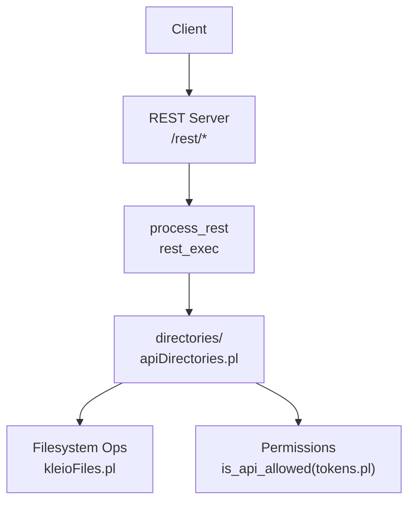
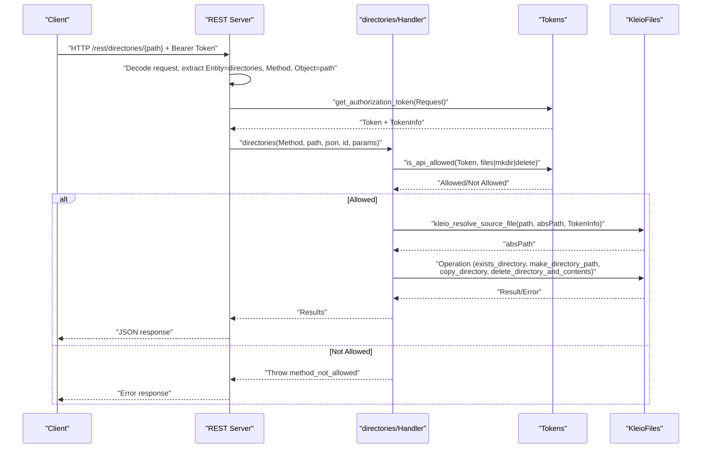
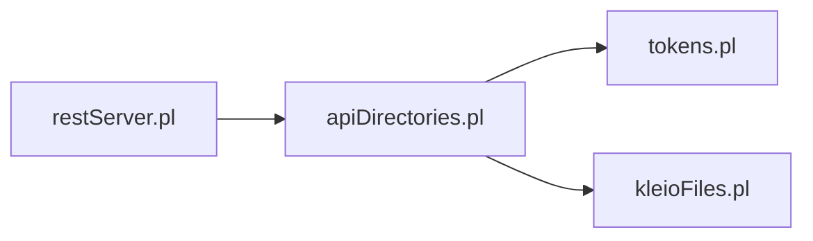

# Directory Operations Endpoints

<cite>
**Referenced Files in This Document**
- [apiDirectories.pl](file://src/apiDirectories.pl)
- [restServer.pl](file://src/restServer.pl)
- [kleioFiles.pl](file://src/kleioFiles.pl)
- [tokens.pl](file://src/tokens.pl)
- [apiCommon.pl](file://src/apiCommon.pl)
</cite>

## Table of Contents
1. [Introduction](#introduction)
2. [Project Structure](#project-structure)
3. [Core Components](#core-components)
4. [Architecture Overview](#architecture-overview)
5. [Detailed Component Analysis](#detailed-component-analysis)
6. [Dependency Analysis](#dependency-analysis)
7. [Performance Considerations](#performance-considerations)
8. [Troubleshooting Guide](#troubleshooting-guide)
9. [Conclusion](#conclusion)

## Introduction
This document provides detailed API documentation for directory management endpoints under /rest/directories/*. It covers the following operations:
- Create directory (POST)
- Copy directory (POST with origin parameter)
- Move directory (POST with origin and path; implemented as copy then delete)
- Delete directory (DELETE)
- List directories (GET)

It includes request/response schemas, parameters such as source_path, destination_path, recursive flag, overwrite behavior, practical examples for directory tree manipulation and bulk operations, error handling for permission issues and path conflicts, and security restrictions on directory traversal and path validation.

## Project Structure
The REST server routes requests to entity-specific handlers. For directories, the handler is implemented in apiDirectories.pl and relies on kleioFiles.pl for path resolution and filesystem operations. Authorization and permissions are enforced via tokens.pl. The REST dispatcher is defined in restServer.pl.

**Diagram sources**
- [restServer.pl:498-515](file://src/restServer.pl#L498-L515)
- [restServer.pl:645-648](file://src/restServer.pl#L645-L648)
- [apiDirectories.pl:18-89](file://src/apiDirectories.pl#L18-L89)
- [kleioFiles.pl:800-828](file://src/kleioFiles.pl#L800-L828)
- [tokens.pl:249-257](file://src/tokens.pl#L249-L257)

**Section sources**
- [restServer.pl:498-515](file://src/restServer.pl#L498-L515)
- [restServer.pl:645-648](file://src/restServer.pl#L645-L648)
- [apiDirectories.pl:18-89](file://src/apiDirectories.pl#L18-L89)
- [kleioFiles.pl:800-828](file://src/kleioFiles.pl#L800-L828)
- [tokens.pl:249-257](file://src/tokens.pl#L249-L257)

## Core Components
- REST routing and dispatching:
  - All /rest/* requests are handled by process_rest and dispatched to entity handlers via rest_exec.
- Directory API handler:
  - Implements GET, POST, DELETE for directories with JSON output mode support.
- Path resolution and filesystem utilities:
  - Resolves relative paths to absolute paths within user-scoped sources and performs directory operations.
- Token-based authorization:
  - Validates token presence and checks required API permissions per operation.

Key responsibilities:
- Validate token and permissions before any filesystem operation.
- Resolve and normalize paths within the user’s allowed sources directory.
- Perform create/copy/move/delete/list operations with appropriate error handling.

**Section sources**
- [restServer.pl:498-515](file://src/restServer.pl#L498-L515)
- [restServer.pl:645-648](file://src/restServer.pl#L645-L648)
- [apiDirectories.pl:18-89](file://src/apiDirectories.pl#L18-L89)
- [kleioFiles.pl:800-828](file://src/kleioFiles.pl#L800-L828)
- [tokens.pl:249-257](file://src/tokens.pl#L249-L257)

## Architecture Overview
The directory endpoints follow a consistent flow:
1. HTTP request arrives at /rest/directories/...
2. REST server decodes method, path info, and parameters, extracts token from Authorization header or query param.
3. Dispatches to directories(Method, Path, Mode, Id, Params).
4. Handler validates permissions using is_api_allowed(Token, ...).
5. Resolves relative path to absolute path within user’s sources directory.
6. Executes operation (list/create/copy/move/delete).
7. Returns results in JSON format.

**Diagram sources**
- [restServer.pl:553-579](file://src/restServer.pl#L553-L579)
- [restServer.pl:645-648](file://src/restServer.pl#L645-L648)
- [apiDirectories.pl:18-89](file://src/apiDirectories.pl#L18-L89)
- [kleioFiles.pl:800-828](file://src/kleioFiles.pl#L800-L828)
- [tokens.pl:249-257](file://src/tokens.pl#L249-L257)

## Detailed Component Analysis

### Endpoint: GET /rest/directories/{path}
Purpose:
- List immediate subdirectories under the given path. Supports optional recursion.

HTTP Method:
- GET

Path Parameters:
- path: Relative path within the user’s sources directory.

Query Parameters:
- recurse: yes | no (default no)
- json: yes | true | no | false (optional; defaults based on Accept header)
- id: Request identifier (optional)

Authentication:
- Requires Bearer token with files permission.

Behavior:
- If recurse=yes, lists all nested subdirectories; otherwise only immediate children.
- Returns a list of resolved directory entries.

Response Schema:
- Success: JSON array of directory entries.
- Error: JSON error object with code and message.

Example Requests:
- List immediate subdirectories:
  - GET http://localhost:8088/rest/directories/sources/mydir?token=YOUR_TOKEN&json=true
- Recursively list subdirectories:
  - GET http://localhost:8088/rest/directories/sources/mydir?token=YOUR_TOKEN&recurse=yes&json=true

Example Responses:
- Success:
  - ["subdir1", "subdir2"]
- Error (not found):
  - {"error": {"code": -32003, "message": "Directory not found"}}

Security and Validation:
- Path is resolved within the user’s sources directory using token-scoped base path.
- Traversal outside allowed scope is prevented by path resolution.

**Section sources**
- [apiDirectories.pl:18-35](file://src/apiDirectories.pl#L18-L35)
- [apiDirectories.pl:73-75](file://src/apiDirectories.pl#L73-L75)
- [kleioFiles.pl:800-828](file://src/kleioFiles.pl#L800-L828)
- [tokens.pl:249-257](file://src/tokens.pl#L249-L257)

### Endpoint: POST /rest/directories/{path} — Create Directory
Purpose:
- Create a new directory at the specified path.

HTTP Method:
- POST

Path Parameters:
- path: Target directory path to create.

Query Parameters:
- json: yes | true | no | false (optional)
- id: Request identifier (optional)

Authentication:
- Requires Bearer token with mkdir permission.

Behavior:
- Creates the directory path if it does not exist.
- Throws an error if the directory already exists.

Response Schema:
- Success: JSON result indicating created path.
- Error: JSON error object with code and message.

Example Requests:
- Create directory:
  - POST http://localhost:8088/rest/directories/sources/newdir?token=YOUR_TOKEN&json=true

Example Responses:
- Success:
  - {"result": "sources/newdir"}
- Error (already exists):
  - {"error": {"code": -32005, "message": "Directory already exists"}}

Security and Validation:
- Path is resolved within the user’s sources directory.
- Creation fails if parent directories cannot be created due to permissions.

**Section sources**
- [apiDirectories.pl:61-70](file://src/apiDirectories.pl#L61-L70)
- [apiDirectories.pl:81-83](file://src/apiDirectories.pl#L81-L83)
- [kleioFiles.pl:800-828](file://src/kleioFiles.pl#L800-L828)
- [tokens.pl:249-257](file://src/tokens.pl#L249-L257)

### Endpoint: POST /rest/directories/{path} — Copy Directory
Purpose:
- Copy a directory from a source path to the target path.

HTTP Method:
- POST

Path Parameters:
- path: Destination directory path.

Query Parameters:
- origin: Source directory path (required for copy operation)
- json: yes | true | no | false (optional)
- id: Request identifier (optional)

Authentication:
- Requires Bearer token with mkdir permission.

Behavior:
- Validates existence of source directory.
- Ensures destination does not already exist.
- Copies directory contents recursively.

Response Schema:
- Success: JSON result indicating copied destination path.
- Error: JSON error object with code and message.

Example Requests:
- Copy directory:
  - POST http://localhost:8088/rest/directories/sources/target?origin=sources/source_dir&token=YOUR_TOKEN&json=true

Example Responses:
- Success:
  - {"result": "sources/target"}
- Error (source not found):
  - {"error": {"code": -32003, "message": "Source directory not found"}}
- Error (destination exists):
  - {"error": {"code": -32005, "message": "Directory already exists"}}

Security and Validation:
- Both source and destination paths are resolved within the user’s sources directory.
- Overwrite is not supported; destination must not exist.

**Section sources**
- [apiDirectories.pl:47-59](file://src/apiDirectories.pl#L47-L59)
- [apiDirectories.pl:85-88](file://src/apiDirectories.pl#L85-L88)
- [kleioFiles.pl:800-828](file://src/kleioFiles.pl#L800-L828)
- [tokens.pl:249-257](file://src/tokens.pl#L249-L257)

### Endpoint: POST /rest/directories/{path} — Move Directory
Purpose:
- Move a directory from a source path to the target path. Implemented as copy followed by delete.

HTTP Method:
- POST

Path Parameters:
- path: Destination directory path.

Query Parameters:
- origin: Source directory path (required for move operation)
- json: yes | true | no | false (optional)
- id: Request identifier (optional)

Authentication:
- Requires Bearer token with mkdir and delete permissions.

Behavior:
- Performs copy operation to destination.
- Deletes the original source directory after successful copy.

Response Schema:
- Success: JSON result indicating moved destination path.
- Error: JSON error object with code and message.

Example Requests:
- Move directory:
  - POST http://localhost:8088/rest/directories/sources/new_location?origin=sources/old_location&token=YOUR_TOKEN&json=true

Example Responses:
- Success:
  - {"result": "sources/new_location"}
- Error (copy failed):
  - {"error": {"code": -32004, "message": "Could not copy directory. Check error log."}}
- Error (delete failed):
  - {"error": {"code": -32003, "message": "Delete failed. Directory not empty?"}}

Security and Validation:
- Both source and destination paths are resolved within the user’s sources directory.
- Overwrite is not supported; destination must not exist.

Note:
- There is no dedicated move endpoint; move is achieved by combining copy and delete semantics.

**Section sources**
- [apiDirectories.pl:47-59](file://src/apiDirectories.pl#L47-L59)
- [apiDirectories.pl:93-116](file://src/apiDirectories.pl#L93-L116)
- [kleioFiles.pl:800-828](file://src/kleioFiles.pl#L800-L828)
- [tokens.pl:249-257](file://src/tokens.pl#L249-L257)

### Endpoint: DELETE /rest/directories/{path}
Purpose:
- Remove a directory. Optionally remove contents if requested.

HTTP Method:
- DELETE

Path Parameters:
- path: Directory path to remove.

Query Parameters:
- force: yes | no (default no)
  - yes: Remove directory even if not empty.
  - no: Fail if directory is not empty.
- json: yes | true | no | false (optional)
- id: Request identifier (optional)

Authentication:
- Requires Bearer token with delete permission.

Behavior:
- If force=no and directory is not empty, returns an error.
- If force=yes, removes directory and its contents.

Response Schema:
- Success: JSON result indicating removed path.
- Error: JSON error object with code and message.

Example Requests:
- Delete non-empty directory without force:
  - DELETE http://localhost:8088/rest/directories/sources/dir_to_remove?token=YOUR_TOKEN&json=true
- Force delete directory:
  - DELETE http://localhost:8088/rest/directories/sources/dir_to_remove?force=yes&token=YOUR_TOKEN&json=true

Example Responses:
- Success:
  - {"result": "sources/dir_to_remove"}
- Error (not found):
  - {"error": {"code": -32003, "message": "Directory not found"}}
- Error (not empty):
  - {"error": {"code": -32003, "message": "Delete failed. Directory not empty?"}}

Security and Validation:
- Path is resolved within the user’s sources directory.
- Deletion respects file system permissions.

**Section sources**
- [apiDirectories.pl:37-45](file://src/apiDirectories.pl#L37-L45)
- [apiDirectories.pl:77-79](file://src/apiDirectories.pl#L77-L79)
- [apiDirectories.pl:93-116](file://src/apiDirectories.pl#L93-L116)
- [kleioFiles.pl:800-828](file://src/kleioFiles.pl#L800-L828)
- [tokens.pl:249-257](file://src/tokens.pl#L249-L257)

### Security Restrictions and Path Validation
- Token-based access control:
  - Each request must include a valid Bearer token.
  - Permissions are checked per operation:
    - GET directories requires files permission.
    - POST create/copy/move requires mkdir permission.
    - DELETE requires delete permission.
- Path scoping:
  - Paths are resolved relative to the user’s sources directory defined in token options.
  - Absolute paths provided by clients are normalized against the user’s base directory.
- Directory traversal protection:
  - Path resolution prevents escaping the user’s sources directory.
- Overwrite policy:
  - Copy and move operations do not overwrite existing destinations; they fail if the destination exists.

**Section sources**
- [restServer.pl:553-579](file://src/restServer.pl#L553-L579)
- [apiDirectories.pl:18-35](file://src/apiDirectories.pl#L18-L35)
- [apiDirectories.pl:47-70](file://src/apiDirectories.pl#L47-L70)
- [apiDirectories.pl:93-116](file://src/apiDirectories.pl#L93-L116)
- [kleioFiles.pl:800-828](file://src/kleioFiles.pl#L800-L828)
- [tokens.pl:249-257](file://src/tokens.pl#L249-L257)

### Practical Examples

#### Directory Tree Manipulation
- Create a nested directory structure:
  - POST /rest/directories/sources/projectA/data?token=YOUR_TOKEN&json=true
  - POST /rest/directories/sources/projectA/data/raw?token=YOUR_TOKEN&json=true
- List top-level directories:
  - GET /rest/directories/sources?token=YOUR_TOKEN&json=true
- Recursively list projectA:
  - GET /rest/directories/sources/projectA?recurse=yes&token=YOUR_TOKEN&json=true

#### Bulk Operations
- Copy multiple directories:
  - POST /rest/directories/sources/archive_2024?origin=sources/current&token=YOUR_TOKEN&json=true
- Move directories in batches:
  - POST /rest/directories/sources/processed?origin=sources/in_progress&token=YOUR_TOKEN&json=true
  - DELETE /rest/directories/sources/in_progress?force=yes&token=YOUR_TOKEN&json=true

#### Error Handling
- Permission denied:
  - Response includes method_not_allowed when token lacks required permission.
- Path conflict:
  - Response includes error code -32005 when destination already exists.
- Non-empty directory deletion:
  - Response includes error code -32003 when force=no and directory is not empty.

**Section sources**
- [apiDirectories.pl:18-35](file://src/apiDirectories.pl#L18-L35)
- [apiDirectories.pl:47-70](file://src/apiDirectories.pl#L47-L70)
- [apiDirectories.pl:93-116](file://src/apiDirectories.pl#L93-L116)
- [tokens.pl:249-257](file://src/tokens.pl#L249-L257)

## Dependency Analysis
The directory endpoints depend on:
- REST server dispatcher for routing and decoding.
- Token module for authentication and authorization.
- KleioFiles module for path resolution and filesystem operations.

**Diagram sources**
- [restServer.pl:498-515](file://src/restServer.pl#L498-L515)
- [apiDirectories.pl:18-89](file://src/apiDirectories.pl#L18-L89)
- [kleioFiles.pl:800-828](file://src/kleioFiles.pl#L800-L828)
- [tokens.pl:249-257](file://src/tokens.pl#L249-L257)

**Section sources**
- [restServer.pl:498-515](file://src/restServer.pl#L498-L515)
- [apiDirectories.pl:18-89](file://src/apiDirectories.pl#L18-L89)
- [kleioFiles.pl:800-828](file://src/kleioFiles.pl#L800-L828)
- [tokens.pl:249-257](file://src/tokens.pl#L249-L257)

## Performance Considerations
- Recursive listing can be expensive on large trees; use recurse=no for shallow listings.
- Copy operations traverse entire directory trees; consider batching and monitoring disk I/O.
- Avoid frequent small operations; batch where possible to reduce overhead.
- Ensure adequate timeout settings for long-running operations.

[No sources needed since this section provides general guidance]

## Troubleshooting Guide
Common errors and resolutions:
- Method not allowed:
  - Cause: Token lacks required permission (files, mkdir, delete).
  - Resolution: Update token permissions accordingly.
- Directory not found:
  - Cause: Path does not exist or is outside user’s sources scope.
  - Resolution: Verify path and ensure it resolves within allowed directory.
- Directory already exists:
  - Cause: Destination path exists during copy/move.
  - Resolution: Choose a different destination or remove existing directory first.
- Delete failed (directory not empty):
  - Cause: Attempted to delete non-empty directory without force=yes.
  - Resolution: Use force=yes or manually remove contents.

**Section sources**
- [apiDirectories.pl:18-35](file://src/apiDirectories.pl#L18-L35)
- [apiDirectories.pl:47-70](file://src/apiDirectories.pl#L47-L70)
- [apiDirectories.pl:93-116](file://src/apiDirectories.pl#L93-L116)
- [tokens.pl:249-257](file://src/tokens.pl#L249-L257)

## Conclusion
The /rest/directories/* endpoints provide comprehensive directory management capabilities with robust security and path validation. By leveraging token-based permissions and scoped path resolution, these endpoints enable safe and controlled directory operations including creation, copying, moving, deletion, and listing. Proper usage of parameters like recurse, force, and origin ensures predictable behavior across various scenarios.

[No sources needed since this section summarizes without analyzing specific files]