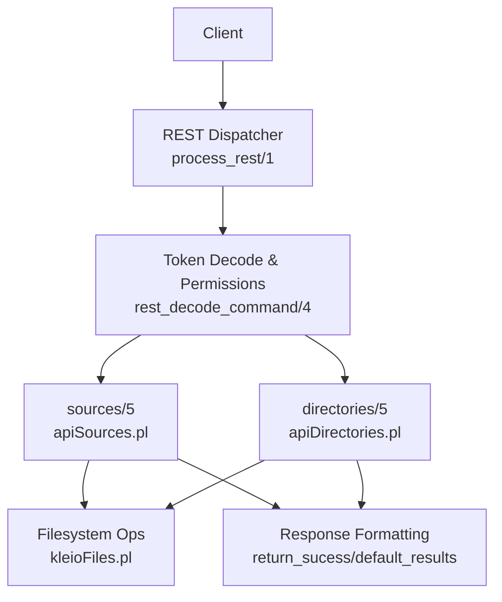
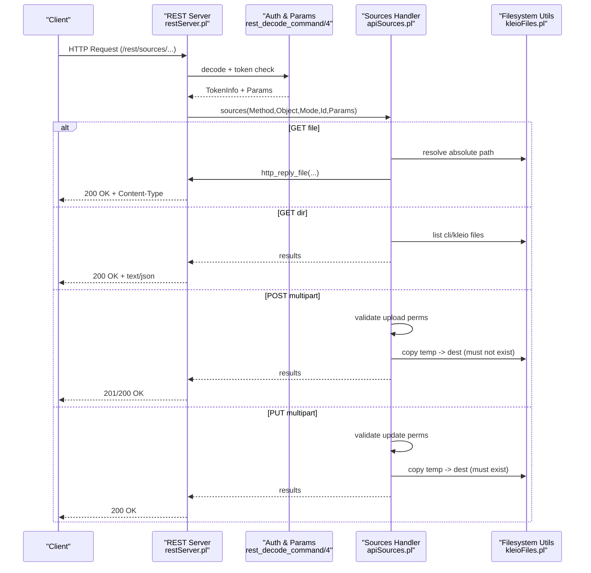
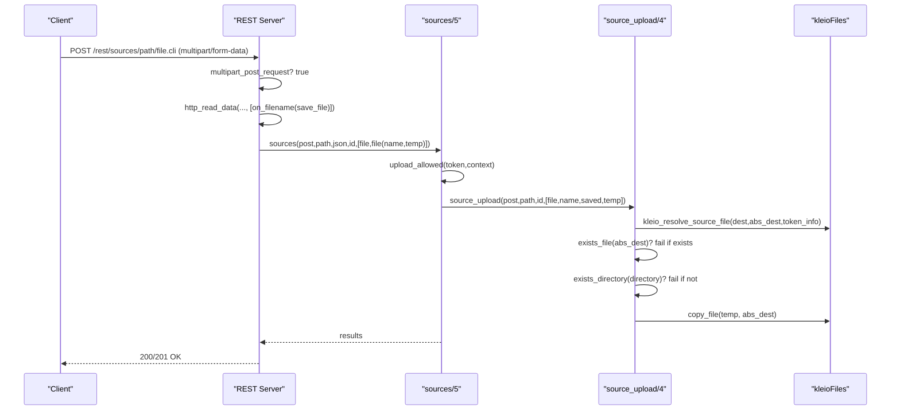
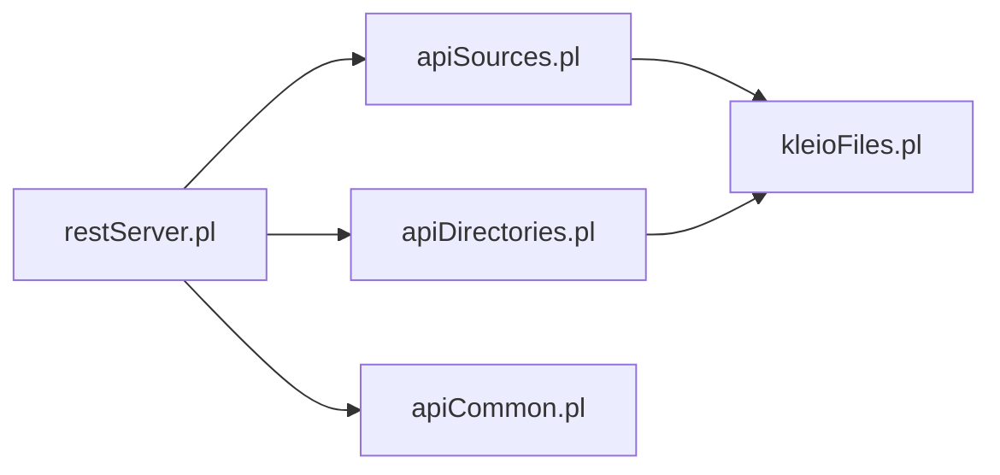

# File Management Endpoints

<cite>
**Referenced Files in This Document**
- [restServer.pl](file://src/restServer.pl)
- [apiSources.pl](file://src/apiSources.pl)
- [apiDirectories.pl](file://src/apiDirectories.pl)
- [kleioFiles.pl](file://src/kleioFiles.pl)
- [apiCommon.pl](file://src/apiCommon.pl)
</cite>

## Table of Contents
1. [Introduction](#introduction)
2. [Project Structure](#project-structure)
3. [Core Components](#core-components)
4. [Architecture Overview](#architecture-overview)
5. [Detailed Component Analysis](#detailed-component-analysis)
6. [Dependency Analysis](#dependency-analysis)
7. [Performance Considerations](#performance-considerations)
8. [Troubleshooting Guide](#troubleshooting-guide)
9. [Conclusion](#conclusion)
10. [Appendices](#appendices)

## Introduction
This document provides comprehensive API documentation for file management endpoints under /rest/sources/* and /rest/files/*. It covers:
- Uploading files using multipart/form-data (POST/PUT)
- Downloading files with streaming responses and proper MIME types
- Deleting files and directories
- Listing directory contents
- Parameter specifications including path resolution, encoding options, and overwrite policies
- Security considerations such as path validation, size limits, and access controls
- Error responses for permission denied, file not found, and disk space issues

The REST server routes all requests to a central dispatcher that decodes the request, validates authorization tokens, parses parameters or multipart data, and dispatches to entity-specific handlers. The sources and directories entities implement the core file management operations.

## Project Structure
The relevant implementation is organized into modules:
- restServer.pl: HTTP server setup, routing, multipart handling, token decoding, error formatting, and default result formatting
- apiSources.pl: Sources entity handlers for GET, POST, PUT, DELETE; upload, copy, move, delete, list, and download
- apiDirectories.pl: Directories entity handlers for listing, creating, copying, and removing directories
- kleioFiles.pl: Path resolution utilities, MIME type mapping, file attribute helpers, and translation artifact management
- apiCommon.pl: Re-exports and high-level API map

**Diagram sources**
- [restServer.pl:491-515](file://src/restServer.pl#L491-L515)
- [restServer.pl:547-612](file://src/restServer.pl#L547-L612)
- [apiSources.pl:28-177](file://src/apiSources.pl#L28-L177)
- [apiDirectories.pl:18-91](file://src/apiDirectories.pl#L18-L91)
- [kleioFiles.pl:800-878](file://src/kleioFiles.pl#L800-L878)

**Section sources**
- [restServer.pl:301-308](file://src/restServer.pl#L301-L308)
- [apiCommon.pl:26-87](file://src/apiCommon.pl#L26-L87)

## Core Components
- REST entrypoint: process_rest/1 handles CORS, logging, decoding, and dispatching to entity handlers via rest_exec/4
- Authorization: get_authorization_token/2 extracts Bearer token; upload_allowed/2 enforces upload permissions
- Multipart parsing: multipart_post_request/1 detects multipart/form-data; http_read_data/3 stores uploaded parts to temp files
- Sources handler: sources/5 implements GET (download/list), POST (upload/copy), PUT (update/move), DELETE (delete)
- Directories handler: directories/5 implements GET (list subdirs), POST (create/copy), DELETE (remove)
- Path resolution: kleio_resolve_source_file/3 resolves relative paths within user-scoped source directories
- MIME mapping: kleio_mime_type/2 maps extensions to MIME types for downloads

Key behaviors:
- GET on a file returns the file content directly with correct MIME type
- GET on a directory lists .cli and .kleio files (optionally recursive)
- POST with multipart/form-data uploads a new file; destination must not exist
- PUT with multipart/form-data updates an existing file; destination must exist
- POST with origin=... copies a file; PUT with origin=... moves a file
- DELETE removes a file or directory (with optional recursion)

**Section sources**
- [restServer.pl:491-515](file://src/restServer.pl#L491-L515)
- [restServer.pl:547-612](file://src/restServer.pl#L547-L612)
- [restServer.pl:582-600](file://src/restServer.pl#L582-L600)
- [apiSources.pl:89-177](file://src/apiSources.pl#L89-L177)
- [apiDirectories.pl:18-91](file://src/apiDirectories.pl#L18-L91)
- [kleioFiles.pl:879-896](file://src/kleioFiles.pl#L879-L896)

## Architecture Overview
The REST flow for file operations:

**Diagram sources**
- [restServer.pl:491-515](file://src/restServer.pl#L491-L515)
- [restServer.pl:547-612](file://src/restServer.pl#L547-L612)
- [apiSources.pl:89-177](file://src/apiSources.pl#L89-L177)
- [kleioFiles.pl:800-878](file://src/kleioFiles.pl#L800-L878)

## Detailed Component Analysis

### REST Entry Point and Routing
- Route registration: root('rest/') with prefix and methods [get,delete,put,post,options]
- process_rest/1 enables CORS, logs request, decodes command, and calls rest_exec/4
- rest_exec/4 constructs goal Entity(Method,Object,Mode,Id,Params) and invokes it

Security and parsing:
- get_authorization_token/2 supports Authorization header and query token parameter
- multipart_post_request/1 checks method and content-type multipart/form-data
- http_read_data/3 reads multipart parts and saves uploaded files to temporary streams

Error handling:
- process_rest_error/1 delegates to return_error/2
- return_error(rest,...) re-throws http_reply exceptions for SWI HTTP server to handle

**Section sources**
- [restServer.pl:301-308](file://src/restServer.pl#L301-L308)
- [restServer.pl:491-515](file://src/restServer.pl#L491-L515)
- [restServer.pl:547-612](file://src/restServer.pl#L547-L612)
- [restServer.pl:582-600](file://src/restServer.pl#L582-L600)
- [restServer.pl:1468-1476](file://src/restServer.pl#L1468-L1476)

### Sources Entity: /rest/sources/*
Operations:
- GET /rest/sources/{path}
  - If path is a file: stream file content with appropriate MIME type
  - If path is a directory: list .cli and .kleio files; optional recurse=yes and url=yes
- POST /rest/sources/{path} (multipart/form-data)
  - Uploads a new file; destination must not exist
  - Also supports copy when param origin=existing_path
- PUT /rest/sources/{path} (multipart/form-data)
  - Updates an existing file; destination must exist
  - Also supports move when param origin=existing_path
- DELETE /rest/sources/{path}
  - Deletes file or directory; directory deletion can be recursive

Parameters:
- path: relative to user’s sources directory (resolved by kleio_resolve_source_file/3)
- recurse: yes/no for directory listing and deletion
- url: yes to return URLs instead of raw file names in directory listings
- origin: existing file path for copy/move operations
- id: optional request identifier used in response headers and JSON-RPC contexts

Permissions:
- GET requires files permission
- POST/PUT require upload permission
- DELETE requires delete permission

Responses:
- GET file: 200 OK with Content-Type set by kleio_mime_type/2
- GET dir: 200 OK with plain text or JSON depending on Accept header
- POST/PUT: 200/201 OK with result list
- DELETE: 200 OK with deleted items

Errors:
- 403 Forbidden if insufficient permissions
- 404 Not Found if resource does not exist
- 400 Bad Request for invalid operations (e.g., POST to existing file, PUT to non-existing file)
- 400 Bad Request if directory does not exist for destination

Examples:
- Upload .cli file:
  - Method: POST
  - Content-Type: multipart/form-data
  - Fields: file=<binary>, path=<relative_dir>/<filename.cli>
- Download generated XML output:
  - Method: GET
  - Path: <relative_dir>/<base>.xml
  - Response: Content-Type: text/xml
- Navigate directory structure:
  - Method: GET
  - Path: <relative_dir>
  - Query: recurse=yes&url=yes

**Section sources**
- [apiSources.pl:28-177](file://src/apiSources.pl#L28-L177)
- [apiSources.pl:212-246](file://src/apiSources.pl#L212-L246)
- [apiSources.pl:257-285](file://src/apiSources.pl#L257-L285)
- [apiSources.pl:324-352](file://src/apiSources.pl#L324-L352)
- [apiSources.pl:354-422](file://src/apiSources.pl#L354-L422)
- [kleioFiles.pl:879-896](file://src/kleioFiles.pl#L879-L896)

#### Sequence Diagram: Upload Flow

**Diagram sources**
- [restServer.pl:566-578](file://src/restServer.pl#L566-L578)
- [apiSources.pl:125-142](file://src/apiSources.pl#L125-L142)
- [apiSources.pl:324-352](file://src/apiSources.pl#L324-L352)

### Directories Entity: /rest/directories/*
Operations:
- GET /rest/directories/{path}
  - Lists immediate subdirectories; recurse=yes to include nested directories
- POST /rest/directories/{path}
  - Create directory at path
  - Copy directory from origin=path2 to path (when origin param present)
- DELETE /rest/directories/{path}
  - Remove directory; optional force=yes to remove non-empty directories

Parameters:
- path: relative to user’s sources directory
- recurse: yes/no for listing
- origin: source directory for copy operation
- force: yes/no for deletion behavior

Permissions:
- GET requires files permission
- POST requires mkdir permission
- DELETE requires delete permission

Responses:
- GET: 200 OK with list of directories
- POST: 200/201 OK with created/copied path
- DELETE: 200 OK with removed path

Errors:
- 403 Forbidden if insufficient permissions
- 404 Not Found if directory does not exist
- 400 Bad Request for invalid operations (e.g., create existing directory)

**Section sources**
- [apiDirectories.pl:18-91](file://src/apiDirectories.pl#L18-L91)
- [apiDirectories.pl:93-147](file://src/apiDirectories.pl#L93-L147)

### Path Resolution and MIME Types
- kleio_resolve_source_file/3 resolves relative paths within user-scoped source directories based on token info
- kleio_mime_type/2 maps file extensions to MIME types for downloads
- Kleio file sets include related artifacts (.rpt, .err, .xml, .org, .ids, .old, .files.json)

Security implications:
- All paths are resolved relative to user-scoped directories to prevent traversal outside allowed areas
- Absolute paths are never returned to clients; only relative paths are exposed

**Section sources**
- [kleioFiles.pl:800-878](file://src/kleioFiles.pl#L800-L878)
- [kleioFiles.pl:879-896](file://src/kleioFiles.pl#L879-L896)

## Dependency Analysis
The following diagram shows key dependencies between components involved in file management:

**Diagram sources**
- [restServer.pl:151-162](file://src/restServer.pl#L151-L162)
- [apiCommon.pl:90-100](file://src/apiCommon.pl#L90-L100)

**Section sources**
- [restServer.pl:151-162](file://src/restServer.pl#L151-L162)
- [apiCommon.pl:90-100](file://src/apiCommon.pl#L90-L100)

## Performance Considerations
- Streaming downloads: GET file uses http_reply_file/3 which streams content efficiently
- Directory listing: recurse=yes may traverse large trees; consider pagination or limiting depth in client logic
- Multipart uploads: files are temporarily stored before copying; ensure adequate disk space and temp directory permissions
- Token decoding and permission checks occur per request; caching token info could reduce overhead if needed

[No sources needed since this section provides general guidance]

## Troubleshooting Guide
Common errors and causes:
- Permission Denied (403): Insufficient token permissions for files, upload, or delete operations
- File Not Found (404): Resource path does not exist or is outside user scope
- Destination Exists (400): POST to existing file or copy/move to existing destination
- Directory Does Not Exist (400): Destination directory missing for upload/copy/move
- Directory Not Empty (400): Attempted to delete non-empty directory without force option
- Disk Space Issues: Upload or copy fails due to insufficient space; check server logs and filesystem quotas

Debugging tips:
- Use the upload form endpoint to test multipart uploads
- Check server logs for detailed error messages
- Validate token permissions and scopes
- Ensure path parameters are relative and within user scope

**Section sources**
- [restServer.pl:1468-1476](file://src/restServer.pl#L1468-L1476)
- [restServer.pl:1503-1532](file://src/restServer.pl#L1503-L1532)
- [apiSources.pl:109-177](file://src/apiSources.pl#L109-L177)
- [apiDirectories.pl:37-91](file://src/apiDirectories.pl#L37-L91)

## Conclusion
The file management endpoints provide a robust REST interface for uploading, downloading, deleting, and navigating source files and directories. Security is enforced through token-based authorization and path resolution within user-scoped directories. Proper error handling ensures clear feedback for common issues like permissions, existence checks, and system constraints.

[No sources needed since this section summarizes without analyzing specific files]

## Appendices

### Endpoint Summary
- GET /rest/sources/{path}: Download file or list directory
- POST /rest/sources/{path} (multipart): Upload new file or copy from origin
- PUT /rest/sources/{path} (multipart): Update existing file or move from origin
- DELETE /rest/sources/{path}: Delete file or directory
- GET /rest/directories/{path}: List subdirectories
- POST /rest/directories/{path}: Create directory or copy from origin
- DELETE /rest/directories/{path}: Remove directory

[No sources needed since this section provides general guidance]