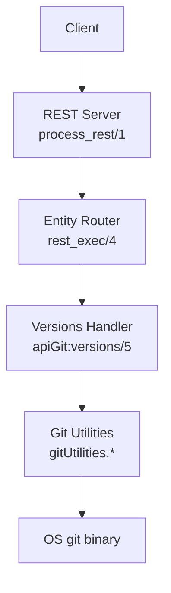
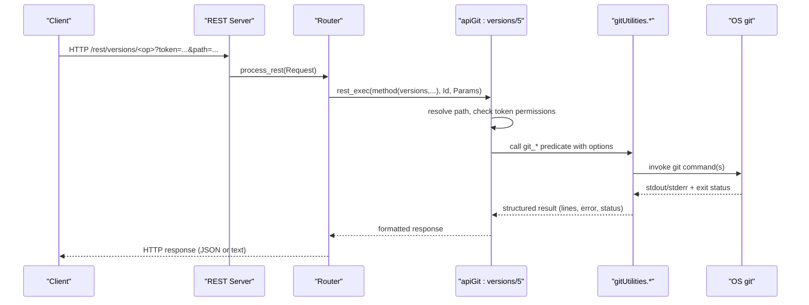
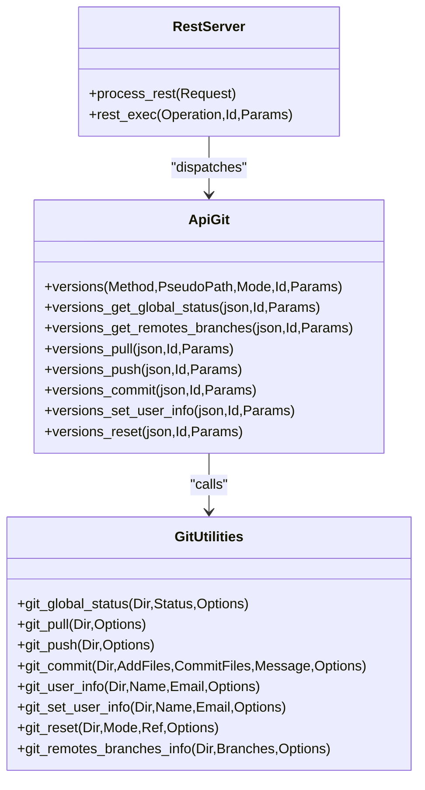

# Git Integration Endpoints

<cite>
**Referenced Files in This Document**
- [apiCommon.pl](file://src/apiCommon.pl)
- [apiGit.pl](file://src/apiGit.pl)
- [gitUtilities.pl](file://src/gitUtilities.pl)
- [restServer.pl](file://src/restServer.pl)
- [index.html](file://docs/api/index.html)
</cite>

## Table of Contents
1. [Introduction](#introduction)
2. [Project Structure](#project-structure)
3. [Core Components](#core-components)
4. [Architecture Overview](#architecture-overview)
5. [Detailed Component Analysis](#detailed-component-analysis)
6. [Dependency Analysis](#dependency-analysis)
7. [Performance Considerations](#performance-considerations)
8. [Troubleshooting Guide](#troubleshooting-guide)
9. [Conclusion](#conclusion)
10. [Appendices](#appendices)

## Introduction
This document provides comprehensive API documentation for the Git repository integration endpoints exposed under /rest/versions/*. It covers HTTP methods and JSON-RPC equivalents for version control operations including:
- git_status (GET to check repository status)
- git_pull (PUT to fetch remote changes; note: documented as GET in some places, but implemented via PUT semantics)
- git_push (PUT to push local changes)
- git_commit (PUT to create commits)
- Branch management (GET to list remote branches; no dedicated branch creation endpoint is provided)

The endpoints operate on a repository path resolved relative to the token’s source directory. Authentication is required via an API token.

## Project Structure
The Git integration is implemented across several modules:
- REST routing and request processing are handled by the server module.
- The versions entity maps HTTP paths to Prolog predicates that implement Git operations.
- A utilities module wraps low-level git commands and returns structured results.

**Diagram sources**
- [restServer.pl:498-515](file://src/restServer.pl#L498-L515)
- [restServer.pl:645-648](file://src/restServer.pl#L645-L648)
- [apiGit.pl:23-33](file://src/apiGit.pl#L23-L33)
- [gitUtilities.pl:1-21](file://src/gitUtilities.pl#L1-L21)

**Section sources**
- [restServer.pl:498-515](file://src/restServer.pl#L498-L515)
- [apiCommon.pl:77-86](file://src/apiCommon.pl#L77-L86)

## Core Components
- REST entrypoint: routes /rest/... requests to entity handlers.
- Entity router: dispatches method calls to versions/5 based on HTTP verb and path prefix.
- Git utilities: execute git commands and return structured outputs (status, logs, diffs).

Key responsibilities:
- Authentication and authorization checks per token.
- Path resolution to absolute repository root.
- Execution of git commands with options and capturing output/errors/status.
- Formatting responses for REST or JSON-RPC clients.

**Section sources**
- [restServer.pl:498-515](file://src/restServer.pl#L498-L515)
- [restServer.pl:645-648](file://src/restServer.pl#L645-L648)
- [apiGit.pl:23-33](file://src/apiGit.pl#L23-L33)
- [gitUtilities.pl:24-81](file://src/gitUtilities.pl#L24-L81)

## Architecture Overview
The following sequence shows how a typical Git operation flows through the system.

**Diagram sources**
- [restServer.pl:498-515](file://src/restServer.pl#L498-L515)
- [restServer.pl:645-648](file://src/restServer.pl#L645-L648)
- [apiGit.pl:23-33](file://src/apiGit.pl#L23-L33)
- [gitUtilities.pl:24-81](file://src/gitUtilities.pl#L24-L81)

## Detailed Component Analysis

### Endpoint: GET /rest/versions/status/global[/path]
Purpose:
- Returns a global overview of the repository state, including divergence from origin, recent logs, diffs, and working directory status.

HTTP Method:
- GET

Path Parameters:
- path: optional subdirectory within the token-scoped repository root. The result always refers to the whole branch associated with the repository root.

Query Parameters:
- compare_to_branch: optional git reference to compare against (e.g., upstream/master). Defaults to origin/current_branch.
- recurse: yes/no (used by other endpoints; not applicable here).

Authentication:
- Requires a valid token with files permission.

Response:
- JSON object containing:
  - directory: current working directory
  - git_root: repository root
  - user_name, user_email: configured git user info
  - branch: current branch name
  - remote, rbranch: tracked remote and branch
  - ahead, behind: commit counts compared to target
  - comparing_to: target reference used for comparison
  - logs: recent log entries
  - origin_new_logs, local_new_logs: divergent logs
  - origin_changes, local_changes: file change summaries
  - work_dir_status: uncommitted changes
  - fetch_status, fetch_message, fetch_lines: last fetch details
  - report: human-readable summary string

Example Request:
- GET http://localhost:8088/rest/versions/status/global/?id=1234&compare_to_branch=upstream/master

Example Response:
- JSON with fields listed above.

Notes:
- If no remote tracking is configured, fetch-related fields indicate no remote branch.

**Section sources**
- [apiCommon.pl:79](file://src/apiCommon.pl#L79)
- [apiGit.pl:51-68](file://src/apiGit.pl#L51-L68)
- [gitUtilities.pl:24-81](file://src/gitUtilities.pl#L24-L81)
- [index.html:16926-16951](file://docs/api/index.html#L16926-L16951)

### Endpoint: GET /rest/versions/remotes/branches[/path]
Purpose:
- Lists information about remote branches known to the repository, including ahead/behind counts relative to the current branch.

HTTP Method:
- GET

Path Parameters:
- path: optional subdirectory within the token-scoped repository root.

Query Parameters:
- compare_to_brach: typo in docs; intended to be compare_to_branch. Optional git reference to compute ahead/behind.

Authentication:
- Requires a valid token with files permission.

Response:
- JSON array of remote branch descriptors, each including:
  - name: full remote/branch reference (e.g., origin/main)
  - remote: remote metadata (name, url, direction)
  - ahead, behind: commit counts vs. current branch
  - current: current local branch

Example Request:
- GET http://localhost:8088/rest/versions/remotes/branches?id=1234&compare_to_branch=upstream/master

Example Response:
- JSON array of branch objects as described.

Notes:
- Information reflects the last fetch.

**Section sources**
- [apiCommon.pl:78](file://src/apiCommon.pl#L78)
- [apiGit.pl:34-49](file://src/apiGit.pl#L34-L49)
- [gitUtilities.pl:632-678](file://src/gitUtilities.pl#L632-L678)
- [index.html:18366-18458](file://docs/api/index.html#L18366-L18458)

### Endpoint: GET /rest/versions/pull[/path]
Purpose:
- Pulls changes from the remote into the local repository.

HTTP Method:
- GET (note: implementation enforces PUT semantics; see notes below)

Path Parameters:
- path: repository subdirectory within the token-scoped root.

Query Parameters:
- git_params: additional parameters passed to git pull (string or list).
- stash_before: if yes, performs a stash before pulling to avoid conflicts.

Authentication:
- Requires a valid token with files permission.

Response:
- JSON object with:
  - git_output: lines from git pull
  - git_error: stderr lines
  - git_exit_status: numeric exit code

Example Request:
- PUT http://localhost:8088/rest/versions/pull/?id=1234&git_params=upstream/origin

Example Response:
- JSON with output/error/status fields.

Important Notes:
- Documentation lists this as GET, but the handler checks for PUT permission and throws method_not_allowed for GET. Use PUT when calling this endpoint.

**Section sources**
- [apiCommon.pl:81](file://src/apiCommon.pl#L81)
- [apiGit.pl:70-82](file://src/apiGit.pl#L70-L82)
- [gitUtilities.pl:226-264](file://src/gitUtilities.pl#L226-L264)
- [index.html:18140-18339](file://docs/api/index.html#L18140-L18339)

### Endpoint: PUT /rest/versions/push[/path]
Purpose:
- Pushes local commits to the remote repository.

HTTP Method:
- PUT

Path Parameters:
- path: repository subdirectory within the token-scoped root.

Query Parameters:
- git_params: additional parameters passed to git push (string or list).

Authentication:
- Requires a valid token with files permission.

Response:
- JSON object with:
  - git_output: lines from git push
  - git_error: stderr lines
  - git_exit_status: numeric exit code

Example Request:
- PUT http://localhost:8088/rest/versions/push/?id=1234&git_params=--force

Example Response:
- JSON with output/error/status fields.

**Section sources**
- [apiCommon.pl:82](file://src/apiCommon.pl#L82)
- [apiGit.pl:97-108](file://src/apiGit.pl#L97-L108)
- [gitUtilities.pl:291-313](file://src/gitUtilities.pl#L291-L313)

### Endpoint: PUT /rest/versions/commit[/path]
Purpose:
- Adds and/or commits files in the repository.

HTTP Method:
- PUT

Path Parameters:
- path: repository subdirectory within the token-scoped root.

Query Parameters:
- add_files: space-separated list of files to stage before commit.
- commit_files: space-separated list of files to include explicitly in the commit (even if unstaged).
- commit_message: commit message string.
- git_params: additional parameters passed to git commit (string or list).

Authentication:
- Requires a valid token with files permission.

Response:
- JSON object with:
  - git_output: combined output from add and commit
  - git_error: stderr lines
  - git_exit_status: numeric exit code

Example Request:
- PUT http://localhost:8088/rest/versions/commit/?id=1234&add_files=file1.txt file2.txt&commit_message=Update%20files

Example Response:
- JSON with output/error/status fields.

Notes:
- If add_files is empty and commit_files is empty, the call may report “Nothing to commit”.

**Section sources**
- [apiCommon.pl:83](file://src/apiCommon.pl#L83)
- [apiGit.pl:110-124](file://src/apiGit.pl#L110-L124)
- [gitUtilities.pl:371-424](file://src/gitUtilities.pl#L371-L424)
- [index.html:2507-2526](file://docs/api/index.html#L2507-L2526)

### Endpoint: GET /rest/versions/user-info[/path]
Purpose:
- Retrieves the configured git user name and email for the repository.

HTTP Method:
- GET

Path Parameters:
- path: repository subdirectory within the token-scoped root.

Authentication:
- Requires a valid token with files permission.

Response:
- JSON object with:
  - git_user_name: configured user name or 'none'
  - git_user_email: configured user email or 'none'

Example Request:
- GET http://localhost:8088/rest/versions/user-info/?id=1234

Example Response:
- JSON with user name and email fields.

**Section sources**
- [apiCommon.pl:80](file://src/apiCommon.pl#L80)
- [apiGit.pl:84-95](file://src/apiGit.pl#L84-L95)
- [gitUtilities.pl:345-354](file://src/gitUtilities.pl#L345-L354)

### Endpoint: PUT /rest/versions/set-user-info[/path]
Purpose:
- Sets the git user name and email for the repository.

HTTP Method:
- PUT

Path Parameters:
- path: repository subdirectory within the token-scoped root.

Query Parameters:
- user_name: new user name (default 'none').
- user_email: new user email (default 'none').
- git_params: additional parameters passed to git config (string or list).

Authentication:
- Requires a valid token with files permission.

Response:
- JSON object with:
  - git_output: output from git config
  - git_error: stderr lines
  - git_exit_status: numeric exit code

Example Request:
- PUT http://localhost:8088/rest/versions/set-user-info/?id=1234&user_name=Alice&user_email=alice@example.com

Example Response:
- JSON with output/error/status fields.

**Section sources**
- [apiCommon.pl:84](file://src/apiCommon.pl#L84)
- [apiGit.pl:126-139](file://src/apiGit.pl#L126-L139)
- [gitUtilities.pl:356-369](file://src/gitUtilities.pl#L356-L369)

### Endpoint: DELETE /rest/versions/reset[/path]
Purpose:
- Resets the local repository to a specified commit reference using a given mode.

HTTP Method:
- DELETE

Path Parameters:
- path: repository subdirectory within the token-scoped root.

Query Parameters:
- reset_mode: git reset mode (e.g., --soft, default '--soft').
- commit_ref: target commit reference (default HEAD).
- git_params: additional parameters passed to git reset (string or list).

Authentication:
- Requires a valid token with files permission.

Response:
- JSON object with:
  - git_output: output from git reset
  - git_error: stderr lines
  - git_exit_status: numeric exit code

Example Request:
- DELETE http://localhost:8088/rest/versions/reset/?id=1234&reset_mode=--soft&commit_ref=HEAD~1

Example Response:
- JSON with output/error/status fields.

**Section sources**
- [apiCommon.pl:85](file://src/apiCommon.pl#L85)
- [apiGit.pl:141-154](file://src/apiGit.pl#L141-L154)
- [gitUtilities.pl:266-289](file://src/gitUtilities.pl#L266-L289)

### Branch Management Note
There is no dedicated endpoint for creating or deleting branches. To manage branches:
- Use git commit/push workflows to advance branches.
- For advanced scenarios, use git_params to pass custom flags to underlying git commands where supported.

[No sources needed since this section doesn't analyze specific files]

## Dependency Analysis
The following diagram shows key dependencies between components involved in Git operations.

**Diagram sources**
- [restServer.pl:645-648](file://src/restServer.pl#L645-L648)
- [apiGit.pl:1-21](file://src/apiGit.pl#L1-L21)
- [gitUtilities.pl:1-21](file://src/gitUtilities.pl#L1-L21)

**Section sources**
- [restServer.pl:645-648](file://src/restServer.pl#L645-L648)
- [apiGit.pl:1-21](file://src/apiGit.pl#L1-L21)
- [gitUtilities.pl:1-21](file://src/gitUtilities.pl#L1-L21)

## Performance Considerations
- Network latency: Pull/Push operations depend on network connectivity and remote performance.
- Stashing: Using stash_before can add overhead but helps avoid conflicts during pulls.
- Large repositories: Status and diff computations may be slower; consider limiting compare_to_branch scope.
- Concurrency: Multiple concurrent Git operations on the same repository may lead to contention; serialize critical sequences at the client level.

[No sources needed since this section provides general guidance]

## Troubleshooting Guide
Common issues and resolutions:
- Authentication failures: Ensure a valid token is provided and has files permission.
- Method mismatch: The pull endpoint requires PUT despite some documentation listing GET; use PUT.
- Not found errors: Verify the path resolves to an existing directory within the token-scoped repository.
- Remote configuration: If no remote branch is tracked, pull/fetch operations will report no remote branch.
- Conflicts: Use stash_before=yes for pull to temporarily hide local changes; resolve conflicts after merge.

Operational tips:
- Inspect git_error and git_exit_status fields to diagnose failures.
- Use status/global to review divergence and pending changes before pushing.

**Section sources**
- [apiGit.pl:70-82](file://src/apiGit.pl#L70-L82)
- [gitUtilities.pl:226-264](file://src/gitUtilities.pl#L226-L264)
- [gitUtilities.pl:24-81](file://src/gitUtilities.pl#L24-L81)

## Conclusion
The /rest/versions/* endpoints provide a robust set of Git operations for repository status inspection, synchronization, committing, and basic configuration. While branch creation/deletion is not directly exposed, the available endpoints support common collaborative workflows when combined with proper authentication and careful sequencing.

[No sources needed since this section summarizes without analyzing specific files]

## Appendices

### Practical Workflows

- Automated Deployment Workflow:
  - GET /rest/versions/status/global to assess divergence.
  - PUT /rest/versions/pull to fetch updates (use stash_before=yes if needed).
  - Commit application artifacts using PUT /rest/versions/commit.
  - PUT /rest/versions/push to publish changes.

- Collaborative Editing Scenario:
  - GET /rest/versions/remotes/branches to inspect peers’ branches.
  - GET /rest/versions/status/global to understand ahead/behind counts.
  - PUT /rest/versions/pull to integrate remote changes.
  - PUT /rest/versions/commit to record local edits.
  - PUT /rest/versions/push to share updates.

- Conflict Resolution Process:
  - GET /rest/versions/status/global to identify conflicting files.
  - PUT /rest/versions/pull with stash_before=yes to isolate changes.
  - Resolve conflicts manually, then PUT /rest/versions/commit.
  - PUT /rest/versions/push to finalize.

[No sources needed since this section provides general guidance]

### Security Considerations
- Token-based access: All endpoints require a valid token; ensure tokens are scoped appropriately and rotated regularly.
- Permission model: Tokens must have files permission to interact with Git endpoints.
- Credential management: Avoid embedding credentials in URLs; prefer secure storage and environment variables.
- HTTPS: Always expose the server over HTTPS to protect tokens and data in transit.
- Least privilege: Limit token scopes to only necessary operations.

[No sources needed since this section provides general guidance]