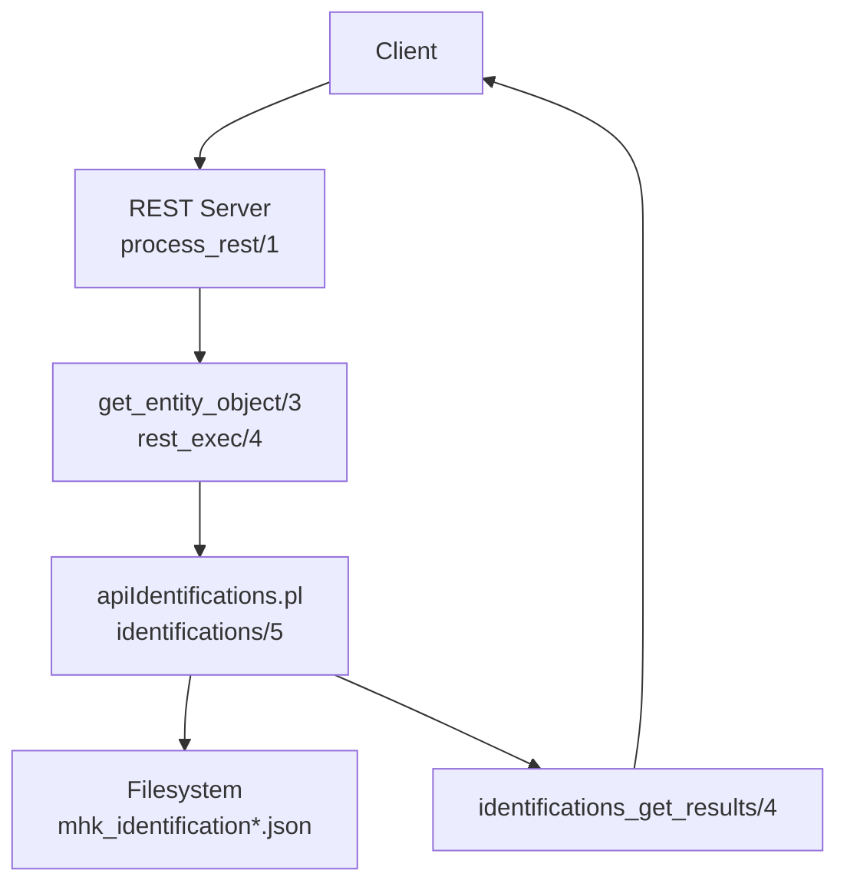
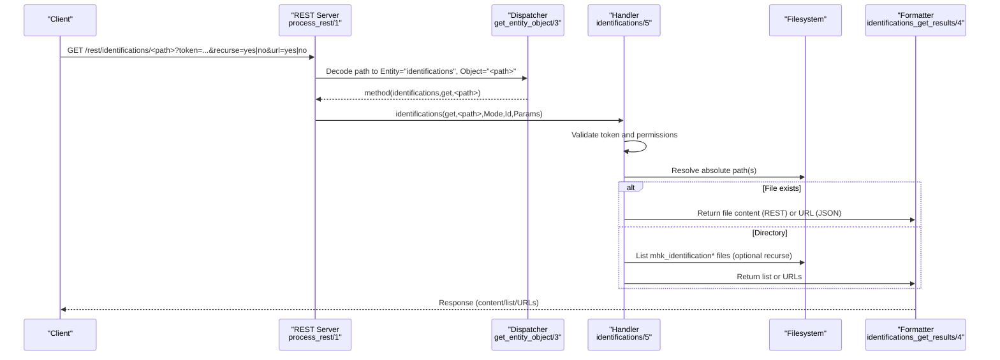
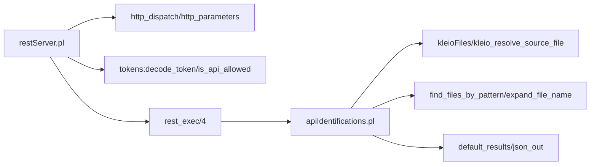

# Identification Management Endpoints

<cite>
**Referenced Files in This Document**
- [apiCommon.pl](file://src/apiCommon.pl)
- [restServer.pl](file://src/restServer.pl)
- [apiIdentifications.pl](file://src/apiIdentifications.pl)
- [index.html](file://docs/api/index.html)
- [api.json](file://api/postman/api.json)
</cite>

## Table of Contents
1. [Introduction](#introduction)
2. [Project Structure](#project-structure)
3. [Core Components](#core-components)
4. [Architecture Overview](#architecture-overview)
5. [Detailed Component Analysis](#detailed-component-analysis)
6. [Dependency Analysis](#dependency-analysis)
7. [Performance Considerations](#performance-considerations)
8. [Troubleshooting Guide](#troubleshooting-guide)
9. [Conclusion](#conclusion)
10. [Appendices](#appendices)

## Introduction
This document provides comprehensive API documentation for identification management endpoints under /rest/identifications/*. It focuses on the currently implemented read-only capabilities for retrieving identification files (mhk_identification*.json). The repository exposes a REST interface and a JSON-RPC interface; however, only GET retrieval of identification files is implemented at this time. There are no create, update, or delete endpoints for identifications in the current codebase.

The identification endpoint supports:
- Listing identification files in a directory
- Retrieving an individual identification file
- Optional recursion into subdirectories
- Optional URL-based listing

It does not include:
- POST to create identifications
- PUT to update identifications
- DELETE to remove identifications

Consequently, request/response schemas for creation/update/delete operations are not applicable here.

## Project Structure
The identification management functionality is implemented as part of the REST server and is exposed via the /rest/identifications path. The relevant modules are:
- REST server entry point and routing
- Identification module implementing GET behavior
- Common API documentation mapping
- Generated API docs and Postman collection referencing the endpoint

**Diagram sources**
- [restServer.pl:498-515](file://src/restServer.pl#L498-L515)
- [restServer.pl:602-612](file://src/restServer.pl#L602-L612)
- [restServer.pl:635-648](file://src/restServer.pl#L635-L648)
- [apiIdentifications.pl:20-35](file://src/apiIdentifications.pl#L20-L35)
- [apiIdentifications.pl:67-78](file://src/apiIdentifications.pl#L67-L78)

**Section sources**
- [apiCommon.pl:43-44](file://src/apiCommon.pl#L43-L44)
- [apiCommon.pl:76-77](file://src/apiCommon.pl#L76-L77)
- [restServer.pl:498-515](file://src/restServer.pl#L498-L515)
- [restServer.pl:602-612](file://src/restServer.pl#L602-L612)
- [restServer.pl:635-648](file://src/restServer.pl#L635-L648)
- [apiIdentifications.pl:20-35](file://src/apiIdentifications.pl#L20-L35)
- [apiIdentifications.pl:67-78](file://src/apiIdentifications.pl#L67-L78)

## Core Components
- REST routing and decoding:
  - process_rest/1 handles incoming requests, decodes entity/method/object, and dispatches to handlers.
  - get_entity_object/3 extracts entity and object from path info.
  - rest_exec/4 invokes the appropriate handler predicate with mode json or rest.

- Identification handler:
  - identifications(get, Path, Mode, Id, Params) validates token permissions, resolves absolute paths, and delegates to internal getters.
  - identifications_abs_get/4 serves either raw file content (REST), a download link (JSON), or directory listings.
  - identifications_in_dir/3 lists mhk_identification* files with optional recursion and URL generation.
  - identifications_get_results/4 formats results for REST or JSON responses.

- API mapping:
  - apiCommon.pl documents that identifications entity supports GET via identifications_get.

**Section sources**
- [restServer.pl:498-515](file://src/restServer.pl#L498-L515)
- [restServer.pl:602-612](file://src/restServer.pl#L602-L612)
- [restServer.pl:635-648](file://src/restServer.pl#L635-L648)
- [apiIdentifications.pl:20-35](file://src/apiIdentifications.pl#L20-L35)
- [apiIdentifications.pl:45-65](file://src/apiIdentifications.pl#L45-L65)
- [apiIdentifications.pl:80-105](file://src/apiIdentifications.pl#L80-L105)
- [apiIdentifications.pl:67-78](file://src/apiIdentifications.pl#L67-L78)
- [apiCommon.pl:43-44](file://src/apiCommon.pl#L43-L44)
- [apiCommon.pl:76-77](file://src/apiCommon.pl#L76-L77)

## Architecture Overview
The identification GET flow uses the REST server’s generic dispatcher to route to the identification handler. The handler checks authorization, resolves paths within the user’s source scope, and returns either file contents, a list of files, or URLs depending on parameters and output mode.

**Diagram sources**
- [restServer.pl:498-515](file://src/restServer.pl#L498-L515)
- [restServer.pl:602-612](file://src/restServer.pl#L602-L612)
- [restServer.pl:635-648](file://src/restServer.pl#L635-L648)
- [apiIdentifications.pl:20-35](file://src/apiIdentifications.pl#L20-L35)
- [apiIdentifications.pl:45-65](file://src/apiIdentifications.pl#L45-L65)
- [apiIdentifications.pl:80-105](file://src/apiIdentifications.pl#L80-L105)
- [apiIdentifications.pl:67-78](file://src/apiIdentifications.pl#L67-L78)

## Detailed Component Analysis

### Endpoint: GET /rest/identifications/<path>
- Purpose: Retrieve identification files (mhk_identification*.json) by path. If path points to a file, returns its content; if it points to a directory, returns a list of matching files.
- HTTP Method: GET
- Authentication: Bearer token required in Authorization header or via search[token] parameter.
- Parameters:
  - path: Relative path within the token-scoped source directory. Defaults to token’s source root if omitted.
  - recurse: yes/no. When yes and path is a directory, recursively lists subdirectories.
  - url: yes/no. When yes and path is a directory, returns URLs instead of relative paths.
  - id: Request identifier used in response headers/metadata.
  - Accept: application/json to receive JSON-formatted responses; otherwise plain text/file stream.
- Behavior:
  - If path is a file:
    - REST: Returns file content directly with appropriate MIME type.
    - JSON: Returns a result containing a download URL.
  - If path is a directory:
    - Lists files matching mhk_identification* pattern.
    - With url=yes, returns a list of REST URLs.
    - With recurse=yes, includes files from subdirectories.
- Responses:
  - 200 OK with file content or list/URLs.
  - 403 Forbidden if token lacks permission to access files.
  - 404 Not Found if path does not exist.

Request examples:
- List identification files in default directory:
  - GET /rest/identifications/?token=<TOKEN>
- Recursively list with URLs:
  - GET /rest/identifications/?token=<TOKEN>&recurse=yes&url=yes
- Get a specific file:
  - GET /rest/identifications/identifications/mhk_identification.json?token=<TOKEN>

Response examples:
- For a file (REST): Raw JSON content of the identification file.
- For a file (JSON): A JSON result with a download URL.
- For a directory (REST): A list of relative file paths.
- For a directory (JSON): A list of REST URLs.

Validation rules:
- Token must be present and valid.
- Path must resolve within the token’s allowed source directory.
- recurse and url parameters accept yes/no values.

Conflict resolution strategies:
- Not applicable for GET. No write operations are supported for identifications.

Practical usage scenarios:
- Person name disambiguation: Retrieve identification files that contain candidate matches for person names across sources.
- Location matching: Obtain identification records linking location references to canonical identifiers.
- Cross-reference resolution: Use identification files to map entities between different datasets.

Note: These scenarios describe how clients may use the retrieved identification data; they do not imply additional server-side logic beyond file retrieval.

**Section sources**
- [apiCommon.pl:43-44](file://src/apiCommon.pl#L43-L44)
- [apiCommon.pl:76-77](file://src/apiCommon.pl#L76-L77)
- [restServer.pl:498-515](file://src/restServer.pl#L498-L515)
- [restServer.pl:602-612](file://src/restServer.pl#L602-L612)
- [restServer.pl:635-648](file://src/restServer.pl#L635-L648)
- [apiIdentifications.pl:20-35](file://src/apiIdentifications.pl#L20-L35)
- [apiIdentifications.pl:45-65](file://src/apiIdentifications.pl#L45-L65)
- [apiIdentifications.pl:80-105](file://src/apiIdentifications.pl#L80-L105)
- [apiIdentifications.pl:67-78](file://src/apiIdentifications.pl#L67-L78)
- [index.html:18461-18479](file://docs/api/index.html#L18461-L18479)
- [api.json:4733-4766](file://api/postman/api.json#L4733-L4766)

### Non-implemented Endpoints
- POST /rest/identifications/* (create_identification): Not implemented.
- PUT /rest/identifications/* (update_identification): Not implemented.
- DELETE /rest/identifications/* (delete_identification): Not implemented.

Clients should not rely on these methods; attempting them will result in method not found or forbidden responses per general server behavior.

**Section sources**
- [apiCommon.pl:43-44](file://src/apiCommon.pl#L43-L44)
- [apiCommon.pl:76-77](file://src/apiCommon.pl#L76-L77)
- [restServer.pl:635-648](file://src/restServer.pl#L635-L648)

## Dependency Analysis
The identification GET endpoint depends on:
- REST server routing and decoding
- Token validation and permission checks
- Filesystem utilities for resolving paths and listing files
- Result formatting for REST and JSON modes

**Diagram sources**
- [restServer.pl:498-515](file://src/restServer.pl#L498-L515)
- [restServer.pl:602-612](file://src/restServer.pl#L602-L612)
- [restServer.pl:635-648](file://src/restServer.pl#L635-L648)
- [apiIdentifications.pl:20-35](file://src/apiIdentifications.pl#L20-L35)
- [apiIdentifications.pl:80-105](file://src/apiIdentifications.pl#L80-L105)

**Section sources**
- [restServer.pl:498-515](file://src/restServer.pl#L498-L515)
- [restServer.pl:602-612](file://src/restServer.pl#L602-L612)
- [restServer.pl:635-648](file://src/restServer.pl#L635-L648)
- [apiIdentifications.pl:20-35](file://src/apiIdentifications.pl#L20-L35)
- [apiIdentifications.pl:80-105](file://src/apiIdentifications.pl#L80-L105)

## Performance Considerations
- Recursive listing can be expensive on large directories; prefer non-recursive listing when possible.
- Using url=yes avoids transferring large file contents over the wire; clients can fetch files individually using returned URLs.
- Token decoding and permission checks add overhead; reuse tokens where appropriate.
- Avoid excessive concurrent requests to large directories; consider pagination-like strategies by narrowing paths.

[No sources needed since this section provides general guidance]

## Troubleshooting Guide
Common issues:
- Missing or invalid token: Ensure Authorization header contains a valid Bearer token or pass token via search[token].
- Forbidden access: Verify token has files permission and path resolves within allowed source directory.
- Not found: Confirm path exists and matches mhk_identification* naming convention for directory listings.
- Unexpected content type: Use Accept: application/json for structured responses; otherwise expect raw file content or plain text lists.

Error handling:
- 403 Forbidden: Returned when token lacks permission to access files.
- 404 Not Found: Returned when path does not exist.
- Method not found: Attempting unsupported methods (POST/PUT/DELETE) will fail.

**Section sources**
- [restServer.pl:498-515](file://src/restServer.pl#L498-L515)
- [restServer.pl:602-612](file://src/restServer.pl#L602-L612)
- [restServer.pl:635-648](file://src/restServer.pl#L635-L648)
- [apiIdentifications.pl:20-35](file://src/apiIdentifications.pl#L20-L35)
- [apiIdentifications.pl:37-38](file://src/apiIdentifications.pl#L37-L38)

## Conclusion
The identification management API currently supports read-only access to identification files via GET /rest/identifications/*. It enables listing and downloading identification records, which clients can use for tasks such as person name disambiguation, location matching, and cross-reference resolution. Create, update, and delete operations are not implemented and should not be relied upon. Future enhancements could extend the API to support full CRUD operations with robust validation and conflict resolution strategies.

[No sources needed since this section summarizes without analyzing specific files]

## Appendices

### API Mapping Reference
- Entity: identifications
- HTTP Method: GET
- JSON-RPC Method: identifications_get
- Description: Retrieve identification files (mhk_identification*.json)

**Section sources**
- [apiCommon.pl:43-44](file://src/apiCommon.pl#L43-L44)
- [apiCommon.pl:76-77](file://src/apiCommon.pl#L76-L77)