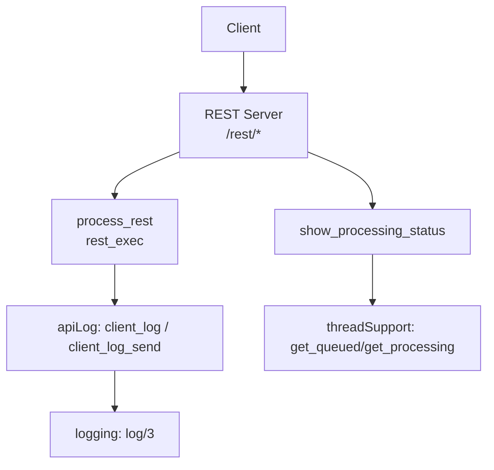
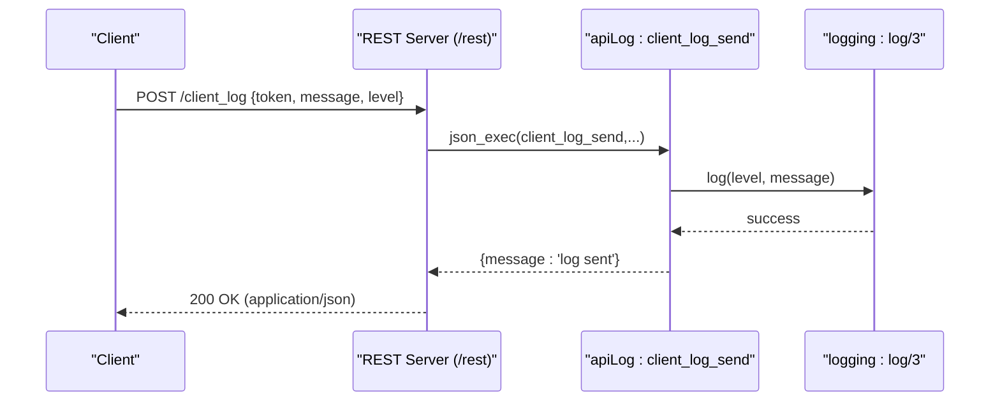
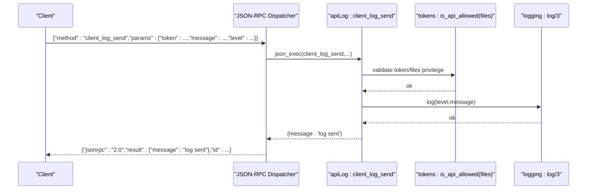
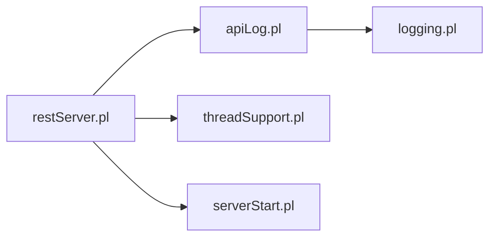

# Logging & Monitoring Endpoints

<cite>
**Referenced Files in This Document**
- [restServer.pl](file://src/restServer.pl)
- [apiLog.pl](file://src/apiLog.pl)
- [logging.pl](file://src/logging.pl)
- [threadSupport.pl](file://src/threadSupport.pl)
- [serverStart.pl](file://src/serverStart.pl)
</cite>

## Table of Contents
1. Introduction
2. Project Structure
3. Core Components
4. Architecture Overview
5. Detailed Component Analysis
6. Dependency Analysis
7. Performance Considerations
8. Troubleshooting Guide
9. Conclusion

## Introduction
This document provides API documentation for logging and monitoring endpoints under /rest/logs/*. It covers:
- get_logs (GET): retrieve application logs
- get_server_status (GET): check server health
- get_processing_status (GET): monitor translation jobs
- clear_logs (DELETE): manage log retention

It also includes request/response schemas, examples for debugging workflows, performance monitoring, operational dashboards, and notes on log rotation policies, storage limits, and sensitive information filtering.

## Project Structure
The REST server exposes a single dispatcher at /rest/ with prefix routing. The relevant modules are:
- restServer.pl: HTTP handlers, JSON-RPC bridge, default result formatting, processing status reporting
- apiLog.pl: client_log and client_log_send methods to write into the server log
- logging.pl: core logging engine (levels, output destination, level control)
- threadSupport.pl: job queue and processing state used by processing status
- serverStart.pl: idle detection helpers used by monitoring

**Diagram sources**
- [restServer.pl:498-515](file://src/restServer.pl#L498-L515)
- [apiLog.pl:15-33](file://src/apiLog.pl#L15-L33)
- [logging.pl:98-120](file://src/logging.pl#L98-L120)
- [threadSupport.pl:137-149](file://src/threadSupport.pl#L137-L149)

**Section sources**
- [restServer.pl:304-309](file://src/restServer.pl#L304-L309)
- [apiCommon.pl:1-101](file://src/apiCommon.pl#L1-L101)

## Core Components
- REST dispatcher: routes /rest/<entity>/<path> to entity-specific handlers via rest_exec.
- Logging API: POST /client_log sends messages into the server log; JSON-RPC method client_log_send is supported.
- Processing status: show_processing_status reads queued and processing jobs from threadSupport.
- Logging engine: logging module manages levels, timestamps, and file output.

Key responsibilities:
- Authentication and authorization: tokens are required for most operations; client_log requires files privilege.
- Output formats: text/plain for REST, application/json for JSON-RPC or when requested via Accept header.
- Error handling: standardized JSON-RPC error codes and HTTP status mapping.

**Section sources**
- [restServer.pl:498-515](file://src/restServer.pl#L498-L515)
- [restServer.pl:544-545](file://src/restServer.pl#L544-L545)
- [restServer.pl:826-886](file://src/restServer.pl#L826-L886)
- [apiLog.pl:15-33](file://src/apiLog.pl#L15-L33)
- [logging.pl:25-120](file://src/logging.pl#L25-L120)
- [threadSupport.pl:137-149](file://src/threadSupport.pl#L137-L149)

## Architecture Overview
The REST endpoint /rest/logs/* is not explicitly registered as a separate handler in the codebase. Instead, the system uses a generic /rest/ prefix and dispatches to entity-specific predicates. For logging and monitoring, the following patterns apply:
- Writing logs: POST /client_log (JSON-RPC method client_log_send) writes to the server log.
- Reading logs: Not exposed via a dedicated REST endpoint; logs are written to a file managed by the logging module.
- Server status: The home page and internal utilities expose processing status; no dedicated /rest/logs/get_server_status endpoint is present.
- Processing status: Internal predicate show_processing_status reports queued and processing jobs.

**Diagram sources**
- [restServer.pl:777-779](file://src/restServer.pl#L777-L779)
- [apiLog.pl:30-33](file://src/apiLog.pl#L30-L33)
- [logging.pl:98-120](file://src/logging.pl#L98-L120)

## Detailed Component Analysis

### Endpoint: GET /rest/logs/get_logs
- Availability: Not implemented as a REST endpoint in the current codebase.
- Behavior: Logs are written to a file by the logging module; there is no read-back API.
- Workaround: Use external tools to tail or parse the log file path reported by the server configuration.

Request
- Method: GET
- Path: /rest/logs/get_logs
- Query parameters: none
- Headers: Authorization: Bearer <token> (if required by policy)

Response
- Status: 404 Not Found (no handler defined)
- Body: N/A

Notes
- If you need this capability, implement a new handler similar to other entities and route it through rest_exec.

**Section sources**
- [restServer.pl:304-309](file://src/restServer.pl#L304-L309)
- [logging.pl:132-155](file://src/logging.pl#L132-L155)

### Endpoint: GET /rest/logs/get_server_status
- Availability: Not implemented as a dedicated REST endpoint.
- Behavior: Server activity and configuration are printed by internal utilities and shown on the home page.
- Workaround: Use the home page or internal predicates to inspect server status.

Request
- Method: GET
- Path: /rest/logs/get_server_status
- Query parameters: none
- Headers: Authorization: Bearer <token> (if required by policy)

Response
- Status: 404 Not Found (no handler defined)
- Body: N/A

Notes
- The home page renders server configuration and processing status. See home_page implementation.

**Section sources**
- [restServer.pl:424-447](file://src/restServer.pl#L424-L447)
- [restServer.pl:186-226](file://src/restServer.pl#L186-L226)

### Endpoint: GET /rest/logs/get_processing_status
- Availability: Not implemented as a dedicated REST endpoint.
- Behavior: Internal predicate show_processing_status reports queued and processing jobs.
- Workaround: Expose via a new REST handler that calls show_processing_status and returns JSON.

Request
- Method: GET
- Path: /rest/logs/get_processing_status
- Query parameters: none
- Headers: Authorization: Bearer <token> (if required by policy)

Response
- Status: 404 Not Found (no handler defined)
- Body: N/A

Notes
- show_processing_status reads queues and processing lists from threadSupport.

**Section sources**
- [restServer.pl:1687-1712](file://src/restServer.pl#L1687-L1712)
- [threadSupport.pl:137-149](file://src/threadSupport.pl#L137-L149)

### Endpoint: DELETE /rest/logs/clear_logs
- Availability: Not implemented as a dedicated REST endpoint.
- Behavior: No built-in mechanism to clear logs via API.
- Workaround: Implement a handler that deletes the log file path obtained from shared properties.

Request
- Method: DELETE
- Path: /rest/logs/clear_logs
- Query parameters: none
- Headers: Authorization: Bearer <token> (if required by policy)

Response
- Status: 404 Not Found (no handler defined)
- Body: N/A

Notes
- Ensure proper authorization checks before deleting log files.

**Section sources**
- [logging.pl:156-161](file://src/logging.pl#L156-L161)

### Existing Logging Write Endpoint: POST /client_log (JSON-RPC: client_log_send)
- Purpose: Send debug messages to the server log.
- Route: JSON-RPC method client_log_send; mapped through the JSON-RPC dispatcher.
- Authorization: Requires token with files privilege.

Request (JSON-RPC)
- Method: client_log_send
- Params:
  - token: string (required)
  - message: string (required)
  - level: string (optional, default debug)
  - path: string (optional, used internally)

Response (JSON-RPC)
- result: object with message field indicating success

**Diagram sources**
- [restServer.pl:777-779](file://src/restServer.pl#L777-L779)
- [apiLog.pl:30-33](file://src/apiLog.pl#L30-L33)
- [apiLog.pl:15-27](file://src/apiLog.pl#L15-L27)
- [logging.pl:98-120](file://src/logging.pl#L98-L120)

**Section sources**
- [apiLog.pl:15-33](file://src/apiLog.pl#L15-L33)
- [restServer.pl:777-779](file://src/restServer.pl#L777-L779)

## Dependency Analysis
- REST server depends on:
  - apiLog for writing logs
  - logging for log levels and output
  - threadSupport for processing status
  - serverStart for idle detection

**Diagram sources**
- [restServer.pl:151-162](file://src/restServer.pl#L151-L162)
- [apiLog.pl:7-9](file://src/apiLog.pl#L7-L9)
- [threadSupport.pl:20-25](file://src/threadSupport.pl#L20-L25)
- [serverStart.pl:80-91](file://src/serverStart.pl#L80-L91)

**Section sources**
- [restServer.pl:151-162](file://src/restServer.pl#L151-L162)
- [apiLog.pl:7-9](file://src/apiLog.pl#L7-L9)
- [threadSupport.pl:20-25](file://src/threadSupport.pl#L20-L25)
- [serverStart.pl:80-91](file://src/serverStart.pl#L80-L91)

## Performance Considerations
- Worker pool mode: The server can run in message queue or thread pool modes; processing status reflects these states.
- Idle detection: server_idle waits until both queued and processing lists are empty; useful for auto-stopping servers.
- Request counts: Shared counters track REST and JSON-RPC requests for basic metrics.

Recommendations
- Monitor queued and processing job lengths to detect backlogs.
- Use JSON-RPC client_log_send sparingly in high-throughput scenarios due to I/O overhead.

[No sources needed since this section provides general guidance]

## Troubleshooting Guide
- Missing token: Requests without a valid token will fail with appropriate errors.
- Insufficient privileges: client_log requires files privilege; otherwise, method_not_allowed is returned.
- Log destination: Verify the log file path via server configuration output.
- Processing backlog: Use show_processing_status to inspect queued and processing jobs.

Operational tips
- Use the home page to view server configuration and processing status.
- For automated shutdowns, use wait_for_idle to ensure all jobs complete before stopping.

**Section sources**
- [restServer.pl:544-545](file://src/restServer.pl#L544-L545)
- [apiLog.pl:15-27](file://src/apiLog.pl#L15-L27)
- [restServer.pl:186-226](file://src/restServer.pl#L186-L226)
- [restServer.pl:1687-1712](file://src/restServer.pl#L1687-L1712)
- [serverStart.pl:80-91](file://src/serverStart.pl#L80-L91)

## Conclusion
The repository does not provide dedicated REST endpoints under /rest/logs/* for reading logs, checking server status, monitoring processing, or clearing logs. However, it offers:
- A JSON-RPC method client_log_send to write logs
- Internal utilities to display processing status and server configuration
- A robust logging engine with configurable levels and file output

To fulfill the documented objectives, implement new REST handlers for get_logs, get_server_status, get_processing_status, and clear_logs, leveraging existing components (logging, threadSupport, serverStart).

[No sources needed since this section summarizes without analyzing specific files]