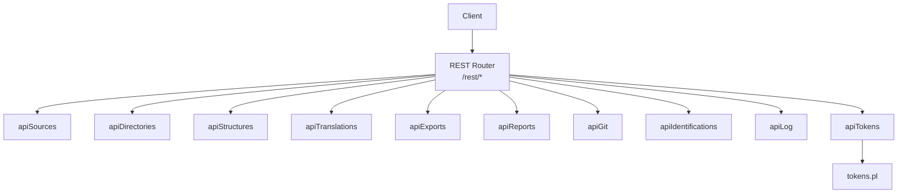
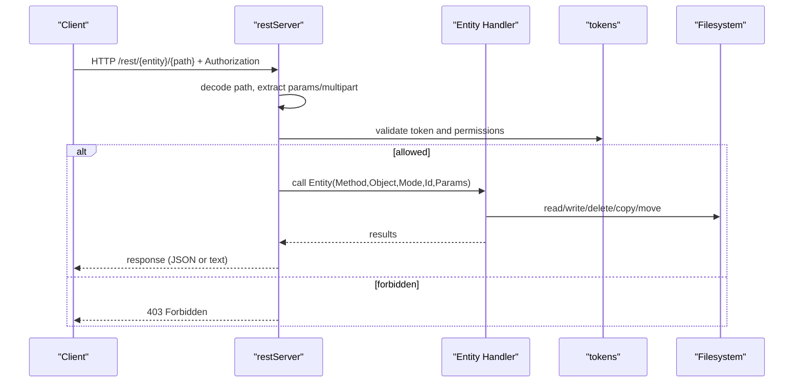
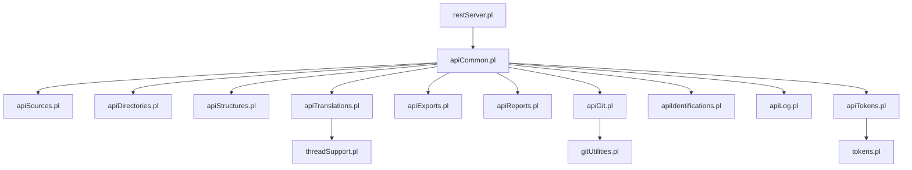

# REST Endpoints

<cite>
**Referenced Files in This Document**
- [restServer.pl](file://src/restServer.pl)
- [apiCommon.pl](file://src/apiCommon.pl)
- [serverStart.pl](file://src/serverStart.pl)
- [apiSources.pl](file://src/apiSources.pl)
- [apiDirectories.pl](file://src/apiDirectories.pl)
- [apiStructures.pl](file://src/apiStructures.pl)
- [apiTranslations.pl](file://src/apiTranslations.pl)
- [apiExports.pl](file://src/apiExports.pl)
- [apiReports.pl](file://src/apiReports.pl)
- [apiGit.pl](file://src/apiGit.pl)
- [apiIdentifications.pl](file://src/apiIdentifications.pl)
- [apiLog.pl](file://src/apiLog.pl)
- [apiTokens.pl](file://src/apiTokens.pl)
- [tokens.pl](file://src/tokens.pl)
</cite>

## Table of Contents
1. [Introduction](#introduction)
2. [Project Structure](#project-structure)
3. [Core Components](#core-components)
4. [Architecture Overview](#architecture-overview)
5. [Detailed Component Analysis](#detailed-component-analysis)
6. [Dependency Analysis](#dependency-analysis)
7. [Performance Considerations](#performance-considerations)
8. [Troubleshooting Guide](#troubleshooting-guide)
9. [Conclusion](#conclusion)
10. [Appendices](#appendices)

## Introduction
This document provides comprehensive REST API documentation for all HTTP endpoints exposed by the server under the /rest prefix. It covers authentication, URL patterns, request/response schemas, parameters, success and error responses, and practical examples using curl. It also documents file upload/download operations, multipart form data handling, and content type requirements.

The server supports:
- REST endpoints under /rest/*
- JSON-RPC 2.0 endpoint at /json
- Token-based authorization via Authorization header or query parameter
- Multipart uploads for files
- Content negotiation (text/plain vs application/json)

## Project Structure
The REST server is implemented in Prolog with a central dispatcher that routes requests to entity-specific modules. The main components are:
- restServer.pl: HTTP server setup, routing, token extraction, multipart parsing, and common utilities
- apiCommon.pl: Re-exports all API modules and maps entities to methods
- Entity modules: apiSources.pl, apiDirectories.pl, apiStructures.pl, apiTranslations.pl, apiExports.pl, apiReports.pl, apiGit.pl, apiIdentifications.pl, apiLog.pl, apiTokens.pl
- tokens.pl: Token generation, validation, and permissions
- serverStart.pl: Server startup helpers and test utilities



**Diagram sources**
- [restServer.pl:304-308](file://src/restServer.pl#L304-L308)
- [apiCommon.pl:90-99](file://src/apiCommon.pl#L90-L99)

**Section sources**
- [restServer.pl:304-308](file://src/restServer.pl#L304-L308)
- [apiCommon.pl:90-99](file://src/apiCommon.pl#L90-L99)
- [serverStart.pl:52-54](file://src/serverStart.pl#L52-L54)

## Core Components
- Authentication: Bearer token via Authorization header or token=... query parameter. Admin fallback via KLEIO_ADMIN_TOKEN environment variable.
- Request decoding: PathInfo parsed into Entity and Object; parameters extracted from query string or multipart body.
- Dispatching: method(Entity, Method, Object) mapped to predicate Entity(Method,Object,Mode,Id,Params).
- Output formatting: default_results/4 formats responses for REST and JSON modes.

Key behaviors:
- JSON output when Accept: application/json or json=yes|true parameter
- Multipart POST/PUT handled via http_read_data with on_filename(save_file)
- CORS enabled for GET/POST/DELETE/PUT

**Section sources**
- [restServer.pl:547-579](file://src/restServer.pl#L547-L579)
- [restServer.pl:518-543](file://src/restServer.pl#L518-L543)
- [restServer.pl:615-624](file://src/restServer.pl#L615-L624)
- [restServer.pl:491-509](file://src/restServer.pl#L491-L509)

## Architecture Overview
The REST server uses SWI-Prolog’s HTTP server with dispatch handlers. Requests to /rest/* are decoded and dispatched to entity handlers. Each handler validates permissions, resolves paths relative to user source directories, performs operations, and returns results.



**Diagram sources**
- [restServer.pl:491-509](file://src/restServer.pl#L491-L509)
- [restServer.pl:547-579](file://src/restServer.pl#L547-L579)
- [tokens.pl:141-151](file://src/tokens.pl#L141-L151)

## Detailed Component Analysis

### Authentication and Authorization
- Token sources:
  - Authorization: Bearer <token>
  - Query parameter: token=<token>
  - Admin fallback: KLEIO_ADMIN_TOKEN env var
- Permissions checked per endpoint (files, upload, delete, mkdir, rmdir, translations, generate_token, invalidate_token, invalidate_user, etc.)
- Token database persistence via tokens module

Example curl:
- Get with token header:
  - curl -H "Authorization: Bearer YOUR_TOKEN" http://localhost:8088/rest/sources/
- Get with token param:
  - curl "http://localhost:8088/rest/sources/?token=YOUR_TOKEN"

**Section sources**
- [restServer.pl:615-624](file://src/restServer.pl#L615-L624)
- [tokens.pl:141-151](file://src/tokens.pl#L141-L151)
- [apiTokens.pl:71-88](file://src/apiTokens.pl#L71-L88)

### Common Response Format
- Success responses use default_results(Mode, Id, Params, Result) which outputs either plain text or JSON depending on mode.
- For JSON mode, responses include id and result fields.
- For REST mode, responses are human-readable text.

Error responses:
- HTTP status codes like 400 Bad Request, 403 Forbidden, 404 Not Found, 405 Method Not Allowed
- JSON-RPC errors for invalid requests or missing parameters

**Section sources**
- [restServer.pl:781-800](file://src/restServer.pl#L781-L800)
- [restServer.pl:544-546](file://src/restServer.pl#L544-L546)

---

### /rest/sources/*
Operations for managing Kleio source files (.cli, .kleio).

#### GET /rest/sources/{path}
- Purpose: Retrieve file content or list directory contents.
- Parameters:
  - recurse=yes: Recurse into subdirectories (default no)
  - url=yes: Return URLs instead of file paths
- Success:
  - File: Returns file content with appropriate MIME type
  - Directory: Returns list of files or URLs if url=yes
- Errors:
  - 404 Not Found if path does not exist
  - 403 Forbidden if token lacks files permission

curl examples:
- List files:
  - curl -H "Authorization: Bearer YOUR_TOKEN" http://localhost:8088/rest/sources/api/
- Download file:
  - curl -H "Authorization: Bearer YOUR_TOKEN" http://localhost:8088/rest/sources/api/file.cli
- List with URLs:
  - curl -H "Authorization: Bearer YOUR_TOKEN" "http://localhost:8088/rest/sources/api/?url=yes"

#### POST /rest/sources/{path} (multipart upload)
- Purpose: Upload new file to destination path.
- Content-Type: multipart/form-data
- Form fields:
  - file: Uploaded file
- Validation:
  - Destination must not exist
  - Target directory must exist
- Success: Returns saved file path
- Errors:
  - 400 Bad Request if destination exists or directory missing
  - 403 Forbidden if token lacks upload permission

curl example:
- curl -X POST -F "file=@local_file.cli" -H "Authorization: Bearer YOUR_TOKEN" http://localhost:8088/rest/sources/api/new_file.cli

#### PUT /rest/sources/{path} (multipart update)
- Purpose: Replace existing file at destination path.
- Content-Type: multipart/form-data
- Form fields:
  - file: Uploaded file
- Validation:
  - Destination must exist
  - Target directory must exist
- Success: Returns updated file path
- Errors:
  - 404 Not Found if destination doesn't exist
  - 403 Forbidden if token lacks upload permission

curl example:
- curl -X PUT -F "file=@updated_file.cli" -H "Authorization: Bearer YOUR_TOKEN" http://localhost:8088/rest/sources/api/existing_file.cli

#### POST /rest/sources/{dest}?origin={source}
- Purpose: Copy file from origin to destination.
- Parameters:
  - origin: Source file path
- Validation:
  - Origin must exist
  - Destination must not exist
  - Destination directory must exist
- Success: Returns destination path
- Errors:
  - 404 Not Found if origin doesn't exist
  - 400 Bad Request if destination exists or directory missing
  - 403 Forbidden if token lacks upload permission

curl example:
- curl -X POST -H "Authorization: Bearer YOUR_TOKEN" "http://localhost:8088/rest/sources/api/copy_dest.cli?origin=api/source.cli"

#### PUT /rest/sources/{dest}?origin={source}
- Purpose: Move file from origin to destination.
- Parameters:
  - origin: Source file path
- Behavior: Copies then deletes origin
- Validation: Same as copy
- Success: Returns destination path
- Errors: Same as copy plus origin deletion failures

curl example:
- curl -X PUT -H "Authorization: Bearer YOUR_TOKEN" "http://localhost:8088/rest/sources/api/moved_file.cli?origin=api/original.cli"

#### DELETE /rest/sources/{path}
- Purpose: Delete file or directory.
- Parameters:
  - recurse=yes: Delete directory recursively
- Behavior: Deletes file and associated translation artifacts
- Success: Returns deleted file paths
- Errors:
  - 404 Not Found if path doesn't exist
  - 403 Forbidden if token lacks delete permission

curl example:
- curl -X DELETE -H "Authorization: Bearer YOUR_TOKEN" http://localhost:8088/rest/sources/api/file_to_delete.cli

**Section sources**
- [apiSources.pl:28-177](file://src/apiSources.pl#L28-L177)
- [apiSources.pl:212-245](file://src/apiSources.pl#L212-L245)
- [apiSources.pl:287-320](file://src/apiSources.pl#L287-L320)
- [apiSources.pl:324-422](file://src/apiSources.pl#L324-L422)

---

### /rest/directories/*
Operations for managing source directories.

#### GET /rest/directories/{path}
- Purpose: List subdirectories under path.
- Parameters:
  - recurse=yes: Include subdirectories recursively
- Success: Returns list of directory paths
- Errors:
  - 404 Not Found if path doesn't exist
  - 403 Forbidden if token lacks files permission

curl example:
- curl -H "Authorization: Bearer YOUR_TOKEN" http://localhost:8088/rest/directories/api/

#### POST /rest/directories/{path}
- Purpose: Create directory.
- Validation:
  - Directory must not already exist
- Success: Returns created directory path
- Errors:
  - 400 Bad Request if directory exists
  - 403 Forbidden if token lacks mkdir permission

curl example:
- curl -X POST -H "Authorization: Bearer YOUR_TOKEN" http://localhost:8088/rest/directories/api/new_dir/

#### POST /rest/directories/{dest}?origin={source}
- Purpose: Copy directory from source to destination.
- Parameters:
  - origin: Source directory path
- Validation:
  - Source must exist
  - Destination must not exist
- Success: Returns destination path
- Errors:
  - 404 Not Found if source doesn't exist
  - 400 Bad Request if destination exists
  - 403 Forbidden if token lacks mkdir permission

curl example:
- curl -X POST -H "Authorization: Bearer YOUR_TOKEN" "http://localhost:8088/rest/directories/api/copied_dir/?origin=api/source_dir/"

#### DELETE /rest/directories/{path}
- Purpose: Remove directory.
- Parameters:
  - force=yes: Delete even if directory is not empty
- Success: Returns removed directory path
- Errors:
  - 404 Not Found if path doesn't exist
  - 400 Bad Request if directory not empty and force=no
  - 403 Forbidden if token lacks rmdir permission

curl example:
- curl -X DELETE -H "Authorization: Bearer YOUR_TOKEN" http://localhost:8088/rest/directories/api/dir_to_remove/

**Section sources**
- [apiDirectories.pl:18-91](file://src/apiDirectories.pl#L18-L91)
- [apiDirectories.pl:93-147](file://src/apiDirectories.pl#L93-L147)

---

### /rest/structures/*
Operations for retrieving structure files (.str, .yaml, .srpt).

#### GET /rest/structures/{path}
- Purpose: Retrieve structure file info or list structure files.
- Parameters:
  - kleio={file}: Resolve structure associated with a Kleio file
  - recurse=yes: List structure files recursively
- Success:
  - Single file: Returns file attributes
  - Directory: Returns directory and list of structure files
  - With kleio param: Returns associated structure file
- Errors:
  - 404 Not Found if path doesn't exist
  - 403 Forbidden if token lacks files permission

curl examples:
- List structure files:
  - curl -H "Authorization: Bearer YOUR_TOKEN" http://localhost:8088/rest/structures/
- Get structure for specific file:
  - curl -H "Authorization: Bearer YOUR_TOKEN" "http://localhost:8088/rest/structures/?kleio=api/test.cli"

**Section sources**
- [apiStructures.pl:22-92](file://src/apiStructures.pl#L22-L92)
- [apiStructures.pl:94-144](file://src/apiStructures.pl#L94-L144)
- [apiStructures.pl:146-188](file://src/apiStructures.pl#L146-L188)

---

### /rest/translations/*
Operations for translating Kleio source files.

#### POST /rest/translations/{path}
- Purpose: Start translation of file(s).
- Parameters:
  - structure={file}: Structure file to use (optional, defaults to configured default)
  - echo=yes: Include source lines in report
  - recurse=yes: Translate files in directory recursively
  - spawn=yes: Distribute translation across workers
  - status={status}: Filter files by translation status
- Success: Returns job IDs and associated files
- Errors:
  - 403 Forbidden if token lacks translations permission
  - 404 Not Found if path doesn't exist

curl example:
- curl -X POST -H "Authorization: Bearer YOUR_TOKEN" "http://localhost:8088/rest/translations/api/?recurse=yes&spawn=yes"

#### GET /rest/translations/{path}
- Purpose: Get translation status/results for file(s).
- Parameters:
  - status={status}: Filter by translation status (V, T, E, W, P, Q)
- Success: Returns list of translation statuses with metadata including:
  - name, path, status, modified time, size
  - For translated files: errors, warnings, version, translated time, URLs to reports and exports
- Errors:
  - 403 Forbidden if token lacks translations permission

curl example:
- curl -H "Authorization: Bearer YOUR_TOKEN" http://localhost:8088/rest/translations/api/

#### DELETE /rest/translations/{path}
- Purpose: Clean translation results for file(s).
- Behavior: Removes derived files (.rpt, .err, .xml, etc.)
- Success: Returns cleaned file paths
- Errors:
  - 403 Forbidden if token lacks translations permission

curl example:
- curl -X DELETE -H "Authorization: Bearer YOUR_TOKEN" http://localhost:8088/rest/translations/api/file.cli

**Section sources**
- [apiTranslations.pl:35-83](file://src/apiTranslations.pl#L35-L83)
- [apiTranslations.pl:87-123](file://src/apiTranslations.pl#L87-L123)
- [apiTranslations.pl:125-139](file://src/apiTranslations.pl#L125-L139)
- [apiTranslations.pl:494-577](file://src/apiTranslations.pl#L494-L577)

---

### /rest/exports/*
Operations for retrieving XML export files generated from translations.

#### GET /rest/exports/{path}
- Purpose: Retrieve XML export file or list exports in directory.
- Behavior: Delegates to sources API
- Success: Returns file content or directory listing
- Errors:
  - 404 Not Found if path doesn't exist
  - 403 Forbidden if token lacks files permission

curl example:
- curl -H "Authorization: Bearer YOUR_TOKEN" http://localhost:8088/rest/exports/api/file.xml

**Section sources**
- [apiExports.pl:14-20](file://src/apiExports.pl#L14-L20)

---

### /rest/reports/*
Operations for retrieving translation report files (.rpt).

#### GET /rest/reports/{path}
- Purpose: Retrieve report file or list reports in directory.
- Behavior: Delegates to sources API
- Success: Returns file content or directory listing
- Errors:
  - 404 Not Found if path doesn't exist
  - 403 Forbidden if token lacks files permission

curl example:
- curl -H "Authorization: Bearer YOUR_TOKEN" http://localhost:8088/rest/reports/api/file.rpt

**Section sources**
- [apiReports.pl:14-20](file://src/apiReports.pl#L14-L20)

---

### /rest/git/*
Operations for Git repository management.

#### GET /rest/git/status/global/{path}
- Purpose: Get global repository status.
- Success: Returns git status information
- Errors:
  - 404 Not Found if path doesn't exist
  - 403 Forbidden if token lacks files permission

curl example:
- curl -H "Authorization: Bearer YOUR_TOKEN" http://localhost:8088/rest/git/status/global/

#### GET /rest/git/remotes/branches/{path}
- Purpose: List branches in remote repository.
- Success: Returns list of branches
- Errors:
  - 404 Not Found if path doesn't exist
  - 403 Forbidden if token lacks files permission

curl example:
- curl -H "Authorization: Bearer YOUR_TOKEN" http://localhost:8088/rest/git/remotes/branches/

#### GET /rest/git/user-info/{path}
- Purpose: Get Git user name and email.
- Success: Returns user information
- Errors:
  - 404 Not Found if path doesn't exist
  - 403 Forbidden if token lacks files permission

curl example:
- curl -H "Authorization: Bearer YOUR_TOKEN" http://localhost:8088/rest/git/user-info/

#### GET /rest/git/pull/{path}
- Purpose: Pull from remote repository.
- Note: Uses GET but should be PUT according to implementation comments
- Success: Returns pull operation results
- Errors:
  - 404 Not Found if path doesn't exist
  - 403 Forbidden if token lacks files permission

curl example:
- curl -H "Authorization: Bearer YOUR_TOKEN" http://localhost:8088/rest/git/pull/

#### PUT /rest/git/push/{path}
- Purpose: Push to remote repository.
- Success: Returns push operation results
- Errors:
  - 404 Not Found if path doesn't exist
  - 403 Forbidden if token lacks files permission

curl example:
- curl -X PUT -H "Authorization: Bearer YOUR_TOKEN" http://localhost:8088/rest/git/push/

#### PUT /rest/git/commit/{path}
- Purpose: Commit changes to local repository.
- Parameters:
  - add_files={files}: Files to add
  - commit_files={files}: Files to commit
  - commit_message={message}: Commit message
- Success: Returns commit operation results
- Errors:
  - 404 Not Found if path doesn't exist
  - 403 Forbidden if token lacks files permission

curl example:
- curl -X PUT -H "Authorization: Bearer YOUR_TOKEN" "http://localhost:8088/rest/git/commit/?add_files=file1,file2&commit_message=Update%20files"

#### PUT /rest/git/set-user-info/{path}
- Purpose: Set Git user name and email.
- Parameters:
  - user_name={name}: User name
  - user_email={email}: User email
- Success: Returns operation results
- Errors:
  - 404 Not Found if path doesn't exist
  - 403 Forbidden if token lacks files permission

curl example:
- curl -X PUT -H "Authorization: Bearer YOUR_TOKEN" "http://localhost:8088/rest/git/set-user-info/?user_name=John%20Doe&user_email=john@example.com"

#### DELETE /rest/git/reset/{path}
- Purpose: Reset local repository to specific commit.
- Parameters:
  - reset_mode={mode}: Reset mode (--soft, --mixed, --hard)
  - commit_ref={ref}: Reference to reset to (default HEAD)
- Success: Returns reset operation results
- Errors:
  - 404 Not Found if path doesn't exist
  - 403 Forbidden if token lacks files permission

curl example:
- curl -X DELETE -H "Authorization: Bearer YOUR_TOKEN" "http://localhost:8088/rest/git/reset/?reset_mode=--soft&commit_ref=HEAD"

**Section sources**
- [apiGit.pl:34-154](file://src/apiGit.pl#L34-L154)
- [apiGit.pl:156-189](file://src/apiGit.pl#L156-L189)

---

### /rest/identifications/*
Operations for retrieving identification files (mhk_identification*.json).

#### GET /rest/identifications/{path}
- Purpose: Retrieve identification file or list identification files in directory.
- Parameters:
  - recurse=yes: Search recursively
  - url=yes: Return URLs instead of paths
- Success: Returns file content or directory listing
- Errors:
  - 404 Not Found if path doesn't exist
  - 403 Forbidden if token lacks files permission

curl example:
- curl -H "Authorization: Bearer YOUR_TOKEN" http://localhost:8088/rest/identifications/api/

**Section sources**
- [apiIdentifications.pl:20-104](file://src/apiIdentifications.pl#L20-L104)

---

### /rest/logs/*
Utility endpoint for sending debug messages to server logs.

#### POST /rest/logs
- Purpose: Send debug message to server logs.
- Parameters:
  - message={text}: Message to log
  - level={level}: Log level (default: debug)
- Success: Returns confirmation
- Errors:
  - 403 Forbidden if token lacks files permission

curl example:
- curl -X POST -H "Authorization: Bearer YOUR_TOKEN" "http://localhost:8088/rest/logs?message=Test%20message&level=info"

**Section sources**
- [apiLog.pl:15-33](file://src/apiLog.pl#L15-L33)

---

### /rest/tokens/*
Operations for managing API tokens.

#### POST /rest/tokens/{user}
- Purpose: Generate token for user.
- Parameters:
  - info={json}: Token configuration including:
    - api: List of allowed actions
    - comment: Optional description
    - structures: Optional structure directory
    - sources: Optional sources directory
- Requires: Token with generate_token permission
- Success: Returns new token
- Errors:
  - 403 Forbidden if caller lacks generate_token permission
  - 400 Bad Request if user already has token

curl example:
- curl -X POST -H "Authorization: Bearer ADMIN_TOKEN" "http://localhost:8088/rest/tokens/newuser?info={\"api\":[\"files\",\"translations\"],\"comment\":\"Test user\"}"

#### DELETE /rest/tokens/{token}
- Purpose: Invalidate specific token.
- Requires: Token with invalidate_token permission
- Success: Returns invalidated token
- Errors:
  - 403 Forbidden if caller lacks invalidate_token permission
  - 400 Bad Request if token doesn't exist

curl example:
- curl -X DELETE -H "Authorization: Bearer ADMIN_TOKEN" http://localhost:8088/rest/tokens/TOKEN_TO_INVALIDATE

#### DELETE /rest/users/{user}
- Purpose: Invalidate all tokens for user.
- Requires: Token with invalidate_user permission
- Success: Returns invalidated user
- Errors:
  - 403 Forbidden if caller lacks invalidate_user permission
  - 400 Bad Request if user doesn't exist

curl example:
- curl -X DELETE -H "Authorization: Bearer ADMIN_TOKEN" http://localhost:8088/rest/users/USERNAME

**Section sources**
- [apiTokens.pl:18-88](file://src/apiTokens.pl#L18-L88)
- [apiTokens.pl:90-122](file://src/apiTokens.pl#L90-L122)

## Dependency Analysis
The REST API follows a clear dependency hierarchy:
- restServer.pl depends on all API modules through apiCommon.pl re-exports
- Each API module depends on core services: tokens, kleioFiles, logging
- Translation operations depend on threadSupport for parallel processing
- Git operations depend on gitUtilities module



**Diagram sources**
- [apiCommon.pl:90-99](file://src/apiCommon.pl#L90-L99)
- [apiTokens.pl:7-9](file://src/apiTokens.pl#L7-L9)
- [apiTranslations.pl:22-33](file://src/apiTranslations.pl#L22-L33)
- [apiGit.pl:17-21](file://src/apiGit.pl#L17-L21)

**Section sources**
- [apiCommon.pl:90-99](file://src/apiCommon.pl#L90-L99)

## Performance Considerations
- Translation jobs can be distributed across multiple workers using spawn=yes parameter
- Status caching for translations_get reduces load on repeated queries
- File operations use efficient Prolog predicates for directory traversal
- Token validation is performed once per request and cached in params
- Large directory listings support recursive traversal with performance considerations

## Troubleshooting Guide
Common issues and solutions:
- 403 Forbidden: Check token permissions and ensure required API privileges are granted
- 404 Not Found: Verify file paths exist and are accessible within user's source directory
- 400 Bad Request: Check multipart form data format for uploads, verify required parameters
- Token expiration: Regenerate tokens using admin interface or KLEIO_ADMIN_TOKEN
- Translation failures: Check report files at /rest/reports/{path} for detailed error information

Debugging tips:
- Use client_log endpoint to send debug messages to server logs
- Enable debug logging via KLEIO_DEBUG environment variable
- Check server home page for current status and configuration

**Section sources**
- [apiLog.pl:15-33](file://src/apiLog.pl#L15-L33)
- [restServer.pl:424-447](file://src/restServer.pl#L424-L447)

## Conclusion
The REST API provides comprehensive access to Kleio's translation and file management capabilities through a well-structured endpoint design. The token-based authentication system ensures secure access control, while the modular architecture allows for easy extension and maintenance. The API supports both simple file operations and complex translation workflows with robust error handling and debugging capabilities.

## Appendices

### HTTP Status Codes
- 200 OK: Successful operation
- 400 Bad Request: Invalid request parameters or malformed data
- 403 Forbidden: Insufficient permissions
- 404 Not Found: Resource doesn't exist
- 405 Method Not Allowed: Unsupported HTTP method for endpoint

### Content Types
- application/json: JSON responses and JSON-RPC requests
- multipart/form-data: File uploads
- text/plain: Default REST responses
- Various MIME types for file downloads based on file extensions

### Error Response Format
JSON errors follow JSON-RPC 2.0 specification:
```json
{
  "error": {
    "code": -32600,
    "message": "Invalid Request",
    "data": "Additional context"
  }
}
```

HTTP errors return appropriate status codes with descriptive messages in the response body.