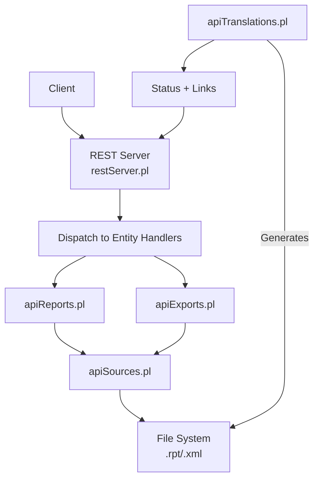
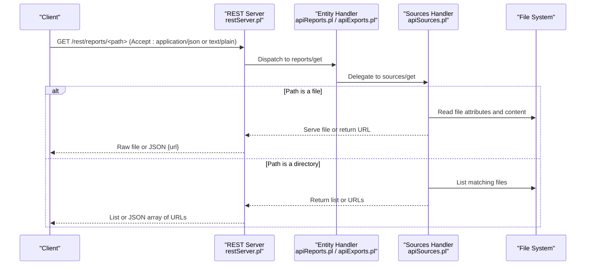
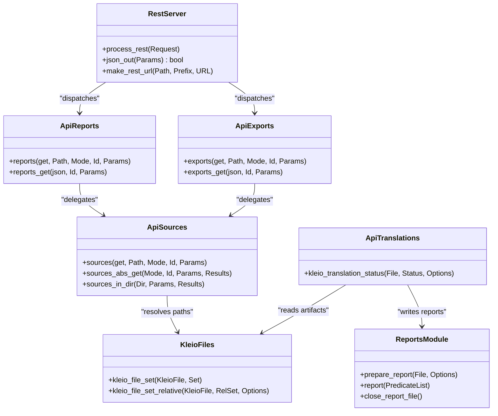

# Reporting & Export Endpoints

<cite>
**Referenced Files in This Document**
- [restServer.pl](file://src/restServer.pl)
- [apiCommon.pl](file://src/apiCommon.pl)
- [apiReports.pl](file://src/apiReports.pl)
- [apiExports.pl](file://src/apiExports.pl)
- [apiSources.pl](file://src/apiSources.pl)
- [apiTranslations.pl](file://src/apiTranslations.pl)
- [kleioFiles.pl](file://src/kleioFiles.pl)
- [reports.pl](file://src/reports.pl)
</cite>

## Table of Contents
1. [Introduction](#introduction)
2. [Project Structure](#project-structure)
3. [Core Components](#core-components)
4. [Architecture Overview](#architecture-overview)
5. [Detailed Component Analysis](#detailed-component-analysis)
6. [Dependency Analysis](#dependency-analysis)
7. [Performance Considerations](#performance-considerations)
8. [Troubleshooting Guide](#troubleshooting-guide)
9. [Conclusion](#conclusion)
10. [Appendices](#appendices)

## Introduction
This document provides detailed API documentation for reporting and export endpoints under /rest/reports/* and /rest/exports/*. It explains how reports are generated during translation, how to retrieve them, and how exports (XML) are produced and accessed. It also clarifies the current capabilities and limitations:

- Reports (.rpt) and exports (.xml) are artifacts created by the translation process. They are not generated on demand via dedicated POST endpoints; instead, they are produced when translations run and then served via GET endpoints.
- The REST server exposes:
  - GET /rest/reports/<path> to retrieve a report file or list reports in a directory.
  - GET /rest/exports/<path> to retrieve an export file or list exports in a directory.
- There is no separate generate_report endpoint; report generation occurs as part of translation execution.
- There is no get_report_status endpoint; status information is available through the translations status API, which includes links to rpt and xml files.
- Download behavior depends on Accept header:
  - application/json returns a JSON response with download URLs.
  - text/plain or default returns the raw file content directly.

## Project Structure
The reporting/export functionality is implemented across several modules:

- REST routing and dispatching: restServer.pl
- Entity handlers: apiReports.pl, apiExports.pl, apiSources.pl
- Translation orchestration and status: apiTranslations.pl
- File set management and artifact discovery: kleioFiles.pl
- Report writer utilities: reports.pl

**Diagram sources**
- [restServer.pl:498-515](file://src/restServer.pl#L498-L515)
- [apiReports.pl:14-19](file://src/apiReports.pl#L14-L19)
- [apiExports.pl:14-19](file://src/apiExports.pl#L14-L19)
- [apiSources.pl:89-104](file://src/apiSources.pl#L89-L104)
- [apiTranslations.pl:529-577](file://src/apiTranslations.pl#L529-L577)
- [kleioFiles.pl:88-113](file://src/kleioFiles.pl#L88-L113)

**Section sources**
- [restServer.pl:498-515](file://src/restServer.pl#L498-L515)
- [apiCommon.pl:22-87](file://src/apiCommon.pl#L22-L87)

## Core Components
- REST dispatcher:
  - Routes /rest/* requests to entity handlers based on path segments.
  - Determines output mode (JSON vs raw) from Accept header or json parameter.
- Reports handler:
  - Delegates to sources handler to serve .rpt files or list directories.
- Exports handler:
  - Delegates to sources handler to serve .xml files or list directories.
- Sources handler:
  - Resolves absolute paths using token info.
  - For files: serves raw content with correct MIME type.
  - For directories: lists files; if JSON requested, returns download URLs.
- Translation status:
  - Provides rpt_url and xml_url fields that point to the corresponding report and export resources.

Key behaviors:
- GET /rest/reports/<path>:
  - If <path> is a file: returns the .rpt file content (or JSON link).
  - If <path> is a directory: lists .rpt files (or JSON array of URLs).
- GET /rest/exports/<path>:
  - If <path> is a file: returns the .xml file content (or JSON link).
  - If <path> is a directory: lists .xml files (or JSON array of URLs).

**Section sources**
- [apiReports.pl:14-19](file://src/apiReports.pl#L14-L19)
- [apiExports.pl:14-19](file://src/apiExports.pl#L14-L19)
- [apiSources.pl:89-104](file://src/apiSources.pl#L89-L104)
- [apiSources.pl:212-232](file://src/apiSources.pl#L212-L232)
- [apiSources.pl:234-245](file://src/apiSources.pl#L234-L245)
- [apiTranslations.pl:529-577](file://src/apiTranslations.pl#L529-L577)

## Architecture Overview
The request flow for retrieving reports and exports:

**Diagram sources**
- [restServer.pl:498-515](file://src/restServer.pl#L498-L515)
- [apiReports.pl:14-19](file://src/apiReports.pl#L14-L19)
- [apiExports.pl:14-19](file://src/apiExports.pl#L14-L19)
- [apiSources.pl:89-104](file://src/apiSources.pl#L89-L104)
- [apiSources.pl:212-232](file://src/apiSources.pl#L212-L232)

## Detailed Component Analysis

### Endpoint: GET /rest/reports/<path>
- Purpose: Retrieve a translation report (.rpt) or list reports in a directory.
- Behavior:
  - If <path> points to a file:
    - Returns the .rpt file content directly (text/plain).
    - If Accept: application/json, returns a JSON object containing a download URL.
  - If <path> points to a directory:
    - Lists .rpt files within the directory.
    - If Accept: application/json, returns a JSON array of download URLs.
- Authentication: Requires a valid token with appropriate permissions (files access).
- Parameters:
  - path: relative path within user’s sources directory.
  - recurse=yes: optional; include subdirectories when listing.
  - url=yes: optional; when listing directories, return URLs instead of file names.

Request examples:
- Raw file retrieval:
  - GET /rest/reports/paroquiais/casamentos/cas1714-1722.rpt
  - Accept: text/plain
- JSON link retrieval:
  - GET /rest/reports/paroquiais/casamentos/cas1714-1722.rpt
  - Accept: application/json
- Directory listing (raw):
  - GET /rest/reports/paroquiais/casamentos?recurse=no
- Directory listing (JSON URLs):
  - GET /rest/reports/paroquiais/casamentos?url=yes&recurse=no

Response schemas:
- Single file (text/plain):
  - Body: raw .rpt content.
- Single file (application/json):
  - Body: { "result": "<download_url>" }
- Directory listing (text/plain):
  - Body: newline-separated file names.
- Directory listing (application/json):
  - Body: { "result": ["<url_1>", "<url_2>", ...] }

Notes:
- The actual report generation happens during translation; this endpoint only retrieves existing artifacts.
- MIME types are resolved automatically based on file extension.

**Section sources**
- [apiReports.pl:14-19](file://src/apiReports.pl#L14-L19)
- [apiSources.pl:89-104](file://src/apiSources.pl#L89-L104)
- [apiSources.pl:212-232](file://src/apiSources.pl#L212-L232)
- [apiSources.pl:234-245](file://src/apiSources.pl#L234-L245)

### Endpoint: GET /rest/exports/<path>
- Purpose: Retrieve an XML export (.xml) or list exports in a directory.
- Behavior:
  - If <path> points to a file:
    - Returns the .xml file content directly (text/plain).
    - If Accept: application/json, returns a JSON object containing a download URL.
  - If <path> points to a directory:
    - Lists .xml files within the directory.
    - If Accept: application/json, returns a JSON array of download URLs.
- Authentication: Requires a valid token with appropriate permissions (files access).
- Parameters:
  - path: relative path within user’s sources directory.
  - recurse=yes: optional; include subdirectories when listing.
  - url=yes: optional; when listing directories, return URLs instead of file names.

Request examples:
- Raw file retrieval:
  - GET /rest/exports/paroquiais/casamentos/cas1714-1722.xml
  - Accept: text/plain
- JSON link retrieval:
  - GET /rest/exports/paroquiais/casamentos/cas1714-1722.xml
  - Accept: application/json
- Directory listing (raw):
  - GET /rest/exports/paroquiais/casamentos?recurse=no
- Directory listing (JSON URLs):
  - GET /rest/exports/paroquiais/casamentos?url=yes&recurse=no

Response schemas:
- Single file (text/plain):
  - Body: raw .xml content.
- Single file (application/json):
  - Body: { "result": "<download_url>" }
- Directory listing (text/plain):
  - Body: newline-separated file names.
- Directory listing (application/json):
  - Body: { "result": ["<url_1>", "<url_2>", ...] }

Notes:
- The export is produced during translation; this endpoint only retrieves existing artifacts.

**Section sources**
- [apiExports.pl:14-19](file://src/apiExports.pl#L14-L19)
- [apiSources.pl:89-104](file://src/apiSources.pl#L89-L104)
- [apiSources.pl:212-232](file://src/apiSources.pl#L212-L232)
- [apiSources.pl:234-245](file://src/apiSources.pl#L234-L245)

### Generating Reports and Exports (via Translations)
There is no dedicated generate_report endpoint. Reports and exports are generated when translations run. Use the translations API to trigger processing:

- POST /rest/translations/<path>
  - Starts translation for a file or directory.
  - Produces .rpt and .xml artifacts alongside the source.
  - Options:
    - structure=<stru_file>: specify schema file.
    - echo=yes/no: include source lines in report.
    - recurse=yes/no: descend into subdirectories.
    - spawn=yes/no: distribute work across workers.

After translation completes, use GET /rest/reports/<path> and GET /rest/exports/<path> to retrieve artifacts. Alternatively, query translation status to obtain direct URLs:

- GET /rest/translations/<path>
  - Returns status entries including rpt_url and xml_url for each translated file.

Example sequence:
1. Start translation:
   - POST /rest/translations/paroquiais/casamentos/cas1714-1722.cli
2. Check status:
   - GET /rest/translations/paroquiais/casamentos/cas1714-1722.cli
   - Response includes rpt_url and xml_url.
3. Retrieve report:
   - GET <rpt_url>
4. Retrieve export:
   - GET <xml_url>

**Section sources**
- [apiTranslations.pl:53-83](file://src/apiTranslations.pl#L53-L83)
- [apiTranslations.pl:529-577](file://src/apiTranslations.pl#L529-L577)
- [kleioFiles.pl:88-113](file://src/kleioFiles.pl#L88-L113)

### Request/Response Schemas and Examples

#### Common Headers and Parameters
- Authorization: Bearer <token>
- Accept: application/json or text/plain
- Query parameters:
  - path: required for most operations.
  - recurse: yes/no (default no).
  - url: yes/no (default no).

#### Example: Get Report File (JSON)
- Request:
  - Method: GET
  - URL: /rest/reports/paroquiais/casamentos/cas1714-1722.rpt
  - Headers:
    - Authorization: Bearer <token>
    - Accept: application/json
- Response:
  - Content-Type: application/json
  - Body: { "result": "/rest/reports/paroquiais/casamentos/cas1714-1722.rpt" }

#### Example: Get Export File (Raw)
- Request:
  - Method: GET
  - URL: /rest/exports/paroquiais/casamentos/cas1714-1722.xml
  - Headers:
    - Authorization: Bearer <token>
    - Accept: text/plain
- Response:
  - Content-Type: application/xml
  - Body: <xml content>

#### Example: List Reports in Directory (JSON URLs)
- Request:
  - Method: GET
  - URL: /rest/reports/paroquiais/casamentos?url=yes&recurse=no
  - Headers:
    - Authorization: Bearer <token>
    - Accept: application/json
- Response:
  - Content-Type: application/json
  - Body: { "result": ["/rest/reports/paroquiais/casamentos/file1.rpt", "/rest/reports/paroquiais/casamentos/file2.rpt"] }

#### Example: Translation Status with Report and Export URLs
- Request:
  - Method: GET
  - URL: /rest/translations/paroquiais/casamentos/cas1714-1722.cli
  - Headers:
    - Authorization: Bearer <token>
    - Accept: application/json
- Response:
  - Content-Type: application/json
  - Body includes fields such as:
    - name, path, status, modified, size
    - errors, warnings, version, translated
    - rpt_url, xml_url

Note: These examples reflect the documented behavior and patterns observed in the codebase. Actual responses may vary slightly depending on server configuration and implementation details.

**Section sources**
- [apiSources.pl:212-232](file://src/apiSources.pl#L212-L232)
- [apiSources.pl:234-245](file://src/apiSources.pl#L234-L245)
- [apiTranslations.pl:529-577](file://src/apiTranslations.pl#L529-L577)

## Dependency Analysis
The following diagram shows key dependencies between components involved in reporting and exporting:

**Diagram sources**
- [restServer.pl:498-515](file://src/restServer.pl#L498-L515)
- [apiReports.pl:14-19](file://src/apiReports.pl#L14-L19)
- [apiExports.pl:14-19](file://src/apiExports.pl#L14-L19)
- [apiSources.pl:89-104](file://src/apiSources.pl#L89-L104)
- [apiSources.pl:212-232](file://src/apiSources.pl#L212-L232)
- [apiTranslations.pl:529-577](file://src/apiTranslations.pl#L529-L577)
- [kleioFiles.pl:88-113](file://src/kleioFiles.pl#L88-L113)
- [reports.pl:51-57](file://src/reports.pl#L51-L57)

**Section sources**
- [apiCommon.pl:22-87](file://src/apiCommon.pl#L22-L87)
- [restServer.pl:498-515](file://src/restServer.pl#L498-L515)

## Performance Considerations
- Large dataset processing:
  - Use recursion carefully; recurse=yes can significantly increase response time and payload size.
  - Prefer filtering by status via translations status API to target specific files.
- Report caching strategies:
  - The translations status API implements a shared cache for large sets to avoid recomputation on frequent calls. Cache age adapts based on set size.
  - When polling for completion, consider client-side caching and exponential backoff to reduce load.
- Streaming downloads:
  - For large .xml exports, prefer direct file retrieval (Accept: text/plain) to avoid JSON overhead.
- Worker distribution:
  - When initiating translations, spawn=yes distributes work across workers, improving throughput for large batches.

[No sources needed since this section provides general guidance]

## Troubleshooting Guide
- Forbidden errors:
  - Ensure the token has sufficient permissions (files, translations).
  - Verify Authorization header format: Bearer <token>.
- Not found errors:
  - Confirm the path exists within the user’s sources directory.
  - Check that translation has been executed to produce .rpt and .xml artifacts.
- Empty listings:
  - Use recurse=yes to include subdirectories.
  - Validate that files have expected extensions (.rpt, .xml).
- JSON vs raw responses:
  - Set Accept: application/json to receive URLs; otherwise, raw content is returned.

**Section sources**
- [apiSources.pl:89-104](file://src/apiSources.pl#L89-L104)
- [apiSources.pl:212-232](file://src/apiSources.pl#L212-L232)
- [apiTranslations.pl:529-577](file://src/apiTranslations.pl#L529-L577)

## Conclusion
Reporting and export endpoints provide straightforward access to translation artifacts:
- GET /rest/reports/<path> and GET /rest/exports/<path> support both raw file retrieval and JSON-based URL discovery.
- Reports and exports are generated during translation; use the translations API to initiate processing and obtain status with direct links.
- For large datasets, leverage recursion controls, status filtering, and worker distribution to optimize performance.

[No sources needed since this section summarizes without analyzing specific files]

## Appendices

### Appendix A: Supported Output Formats
- Reports: .rpt (human-readable text)
- Exports: .xml (structured data)
- JSON responses: used for metadata and download URLs

[No sources needed since this section provides general guidance]

### Appendix B: Related Artifacts
- .err: error summary (machine-readable)
- .org: original file before first translation
- .old: previous version
- .ids: temporary identifiers
- .files.json: metadata about related files

**Section sources**
- [kleioFiles.pl:88-113](file://src/kleioFiles.pl#L88-L113)