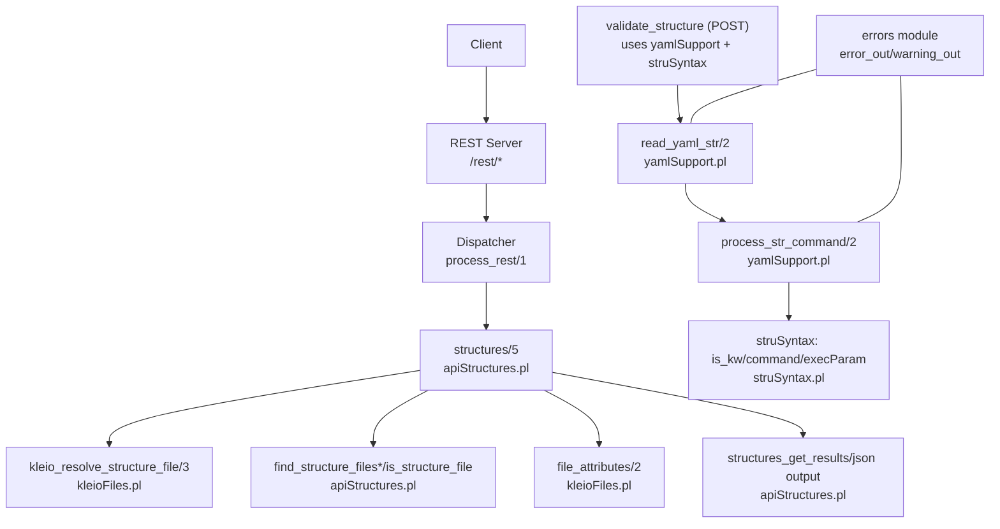
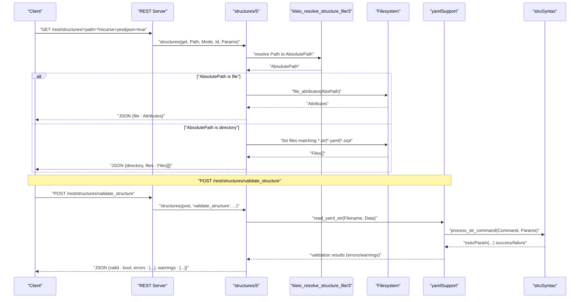
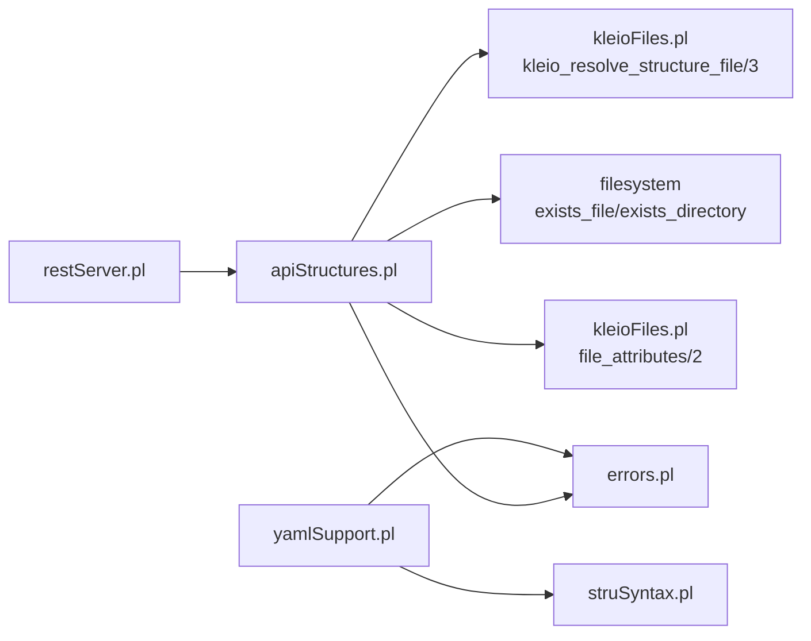

# Structure Management Endpoints

<cite>
**Referenced Files in This Document**
- [restServer.pl](file://src/restServer.pl)
- [apiStructures.pl](file://src/apiStructures.pl)
- [kleioFiles.pl](file://src/kleioFiles.pl)
- [yamlSupport.pl](file://src/yamlSupport.pl)
- [struSyntax.pl](file://src/struSyntax.pl)
- [errors.pl](file://src/errors.pl)
- [apiTranslations.pl](file://src/apiTranslations.pl)
</cite>

## Table of Contents
1. [Introduction](#introduction)
2. [Project Structure](#project-structure)
3. [Core Components](#core-components)
4. [Architecture Overview](#architecture-overview)
5. [Detailed Component Analysis](#detailed-component-analysis)
6. [Dependency Analysis](#dependency-analysis)
7. [Performance Considerations](#performance-considerations)
8. [Troubleshooting Guide](#troubleshooting-guide)
9. [Conclusion](#conclusion)
10. [Appendices](#appendices)

## Introduction
This document provides comprehensive API documentation for structure and schema management endpoints under /rest/structures/*. It covers:
- GET structures: retrieve structure definitions or list available schemas
- POST validate_structure: validate YAML/.str files against the Kleio structure syntax
- GET list_structures: enumerate available structure files (alias behavior via directory listing)
- PUT update_structure: modify structure definitions (write/update operations)

It also details parameter specifications, supported formats (.str legacy vs .yaml modern), validation options, error reporting, schema versioning and migration workflows, and the relationship between structure files and translation processes.

## Project Structure
The REST server exposes a unified /rest/* dispatcher that routes requests to entity-specific handlers. The structures handler implements retrieval and metadata operations for structure files. Validation and parsing are performed by dedicated modules supporting both legacy .str and modern .yaml formats.

**Diagram sources**
- [restServer.pl:491-515](file://src/restServer.pl#L491-L515)
- [apiStructures.pl:22-66](file://src/apiStructures.pl#L22-L66)
- [apiStructures.pl:77-92](file://src/apiStructures.pl#L77-L92)
- [apiStructures.pl:99-134](file://src/apiStructures.pl#L99-L134)
- [apiStructures.pl:158-188](file://src/apiStructures.pl#L158-L188)
- [kleioFiles.pl:850-877](file://src/kleioFiles.pl#L850-L877)
- [yamlSupport.pl:28-46](file://src/yamlSupport.pl#L28-L46)
- [yamlSupport.pl:49-72](file://src/yamlSupport.pl#L49-L72)
- [yamlSupport.pl:119-140](file://src/yamlSupport.pl#L119-L140)
- [struSyntax.pl:132-140](file://src/struSyntax.pl#L132-L140)
- [errors.pl:77-113](file://src/errors.pl#L77-L113)

**Section sources**
- [restServer.pl:491-515](file://src/restServer.pl#L491-L515)
- [apiStructures.pl:22-66](file://src/apiStructures.pl#L22-L66)
- [kleioFiles.pl:850-877](file://src/kleioFiles.pl#L850-L877)
- [yamlSupport.pl:28-46](file://src/yamlSupport.pl#L28-L46)
- [struSyntax.pl:132-140](file://src/struSyntax.pl#L132-L140)
- [errors.pl:77-113](file://src/errors.pl#L77-L113)

## Core Components
- REST dispatcher: parses HTTP method, path, token, and parameters; delegates to entity handlers.
- Structures handler: resolves paths, lists files, returns file attributes, supports recursive listing, and JSON-RPC compatibility.
- Path resolution: maps relative structure paths to absolute paths using token-scoped directories.
- YAML processing: reads YAML structure files, includes other files, and translates YAML commands into internal structure commands.
- Legacy .str support: parsed through the same command execution pipeline as YAML.
- Error reporting: structured errors and warnings with context (file, line numbers).

Key responsibilities:
- GET /rest/structures/<path>: return file info or directory listing of structure files (.str, .yaml, .srpt)
- GET /rest/structures?kleio=<source.cli>: resolve associated structure for a given source file
- POST /rest/structures/validate_structure: parse and validate structure content (YAML or .str)
- PUT /rest/structures/<path>: write/update structure file content (subject to permissions)

**Section sources**
- [restServer.pl:491-515](file://src/restServer.pl#L491-L515)
- [apiStructures.pl:22-66](file://src/apiStructures.pl#L22-L66)
- [apiStructures.pl:77-92](file://src/apiStructures.pl#L77-L92)
- [kleioFiles.pl:850-877](file://src/kleioFiles.pl#L850-L877)
- [yamlSupport.pl:28-46](file://src/yamlSupport.pl#L28-L46)
- [errors.pl:77-113](file://src/errors.pl#L77-L113)

## Architecture Overview
The REST layer decodes requests, enforces authorization, and dispatches to handlers. The structures handler uses path resolution utilities to locate files within user-scoped directories and returns either file metadata or a directory listing. Validation leverages YAML parsing and the shared structure command pipeline.

**Diagram sources**
- [restServer.pl:491-515](file://src/restServer.pl#L491-L515)
- [apiStructures.pl:22-66](file://src/apiStructures.pl#L22-L66)
- [apiStructures.pl:77-92](file://src/apiStructures.pl#L77-L92)
- [apiStructures.pl:99-134](file://src/apiStructures.pl#L99-L134)
- [kleioFiles.pl:850-877](file://src/kleioFiles.pl#L850-L877)
- [yamlSupport.pl:49-72](file://src/yamlSupport.pl#L49-L72)
- [yamlSupport.pl:119-140](file://src/yamlSupport.pl#L119-L140)
- [struSyntax.pl:132-140](file://src/struSyntax.pl#L132-L140)

## Detailed Component Analysis

### Endpoint: GET /rest/structures/<path>
Retrieves structure file information or enumerates structure files in a directory.

- Method: GET
- Path: /rest/structures/<path>
- Query Parameters:
  - kleio: optional path to a Kleio source file; if provided, returns the structure associated with that source file
  - recurse: 'yes' or 'no' (default 'no'); when 'yes', recursively lists subdirectories
  - json: 'true'/'false' or Accept header application/json; controls JSON output
- Authorization: requires token with 'structures' permission
- Behavior:
  - If kleio is provided, resolves the default structure for the source file and returns its path
  - Otherwise, resolves <path> to an absolute location and:
    - If it is a file: returns file attributes
    - If it is a directory: returns a list of structure files (.str, .yaml, .srpt)
- Response Formats:
  - JSON: { file: {...} } or { directory: "<relative_path>", files: ["..."] }
  - Text/plain: human-readable option list

Example responses:
- Single file: { "file": { "name": "gacto2.str", "extension": "str", "size": 1234, ... } }
- Directory listing: { "directory": "src/stru", "files": ["src/stru/gacto2.str", "src/stru/sources-structure.yaml", ...] }

**Section sources**
- [apiStructures.pl:22-66](file://src/apiStructures.pl#L22-L66)
- [apiStructures.pl:77-92](file://src/apiStructures.pl#L77-L92)
- [apiStructures.pl:99-134](file://src/apiStructures.pl#L99-L134)
- [apiStructures.pl:158-188](file://src/apiStructures.pl#L158-L188)
- [kleioFiles.pl:850-877](file://src/kleioFiles.pl#L850-L877)

### Endpoint: GET /rest/structures?kleio=<source.cli>
Resolves the structure definition associated with a specific Kleio source file.

- Method: GET
- Path: /rest/structures
- Query Parameters:
  - kleio: path to a Kleio source file
  - json: 'true'/'false'
- Behavior:
  - Resolves the Kleio file path using token-scoped sources directory
  - Determines the default structure file for translations
  - Returns the resolved structure path
- Response Format:
  - JSON: { "kleio": "<source_path>", "structure": "<resolved_structure_path>" }

**Section sources**
- [apiStructures.pl:22-66](file://src/apiStructures.pl#L22-L66)
- [apiTranslations.pl:277-290](file://src/apiTranslations.pl#L277-L290)

### Endpoint: GET /rest/structures/list_structures
Enumerates available schemas. This endpoint behaves like directory listing for structures.

- Method: GET
- Path: /rest/structures/list_structures
- Query Parameters:
  - recurse: 'yes' or 'no' (default 'no')
  - json: 'true'/'false'
- Behavior:
  - Treats "list_structures" as a directory path and returns all structure files found
- Response Format:
  - JSON: { "directory": "list_structures", "files": ["..."] }

Note: The implementation treats any non-file path as a directory and lists matching structure files.

**Section sources**
- [apiStructures.pl:77-92](file://src/apiStructures.pl#L77-L92)
- [apiStructures.pl:99-134](file://src/apiStructures.pl#L99-L134)

### Endpoint: POST /rest/structures/validate_structure
Validates a structure file (YAML or .str) against the Kleio structure syntax.

- Method: POST
- Path: /rest/structures/validate_structure
- Request Body:
  - For multipart/form-data uploads: include a file field with the structure file (.yaml or .str)
  - Alternatively, provide a path parameter pointing to an existing structure file
- Query Parameters:
  - json: 'true'/'false'
- Behavior:
  - Reads the structure file content
  - Parses YAML or legacy .str format
  - Executes structure commands and collects errors/warnings
  - Returns validation status and detailed diagnostics
- Response Format:
  - JSON: { "valid": true/false, "errors": [...], "warnings": [...] }

Validation rules and options:
- Supports YAML structure files with commands translated into internal structure commands
- Supports legacy .str files via the same command execution pipeline
- Includes include directives for modular structure definitions
- Reports errors and warnings with file and line context

**Section sources**
- [yamlSupport.pl:28-46](file://src/yamlSupport.pl#L28-L46)
- [yamlSupport.pl:49-72](file://src/yamlSupport.pl#L49-L72)
- [yamlSupport.pl:119-140](file://src/yamlSupport.pl#L119-L140)
- [struSyntax.pl:132-140](file://src/struSyntax.pl#L132-L140)
- [errors.pl:77-113](file://src/errors.pl#L77-L113)

### Endpoint: PUT /rest/structures/<path>
Updates or writes a structure file.

- Method: PUT
- Path: /rest/structures/<path>
- Request Body:
  - For multipart/form-data uploads: include a file field with the new structure content
  - Alternatively, provide text/plain body with the structure content
- Query Parameters:
  - json: 'true'/'false'
- Authorization: requires token with upload permission
- Behavior:
  - Resolves <path> to an absolute location within the user’s structures directory
  - Writes or updates the structure file
  - Returns confirmation and updated file attributes

Security considerations:
- Paths are resolved relative to the user’s structures directory based on token options
- Upload permissions are enforced before writing

**Section sources**
- [restServer.pl:590-600](file://src/restServer.pl#L590-L600)
- [kleioFiles.pl:850-877](file://src/kleioFiles.pl#L850-L877)

## Dependency Analysis
The structures endpoints depend on:
- REST dispatcher for routing and decoding
- Token-based authorization and permission checks
- Path resolution utilities for mapping relative paths to absolute locations
- Filesystem utilities for listing and attribute retrieval
- YAML parser and structure command pipeline for validation
- Error reporting module for consistent diagnostics

**Diagram sources**
- [restServer.pl:491-515](file://src/restServer.pl#L491-L515)
- [apiStructures.pl:22-66](file://src/apiStructures.pl#L22-L66)
- [kleioFiles.pl:850-877](file://src/kleioFiles.pl#L850-L877)
- [yamlSupport.pl:28-46](file://src/yamlSupport.pl#L28-L46)
- [struSyntax.pl:132-140](file://src/struSyntax.pl#L132-L140)
- [errors.pl:77-113](file://src/errors.pl#L77-L113)

**Section sources**
- [restServer.pl:491-515](file://src/restServer.pl#L491-L515)
- [apiStructures.pl:22-66](file://src/apiStructures.pl#L22-L66)
- [kleioFiles.pl:850-877](file://src/kleioFiles.pl#L850-L877)
- [yamlSupport.pl:28-46](file://src/yamlSupport.pl#L28-L46)
- [struSyntax.pl:132-140](file://src/struSyntax.pl#L132-L140)
- [errors.pl:77-113](file://src/errors.pl#L77-L113)

## Performance Considerations
- Recursive directory listings can be expensive; prefer non-recursive listing and client-side filtering when possible.
- File attribute caching improves repeated queries; avoid excessive polling.
- Validation of large structure files may incur parsing overhead; consider batching validations and caching results where appropriate.
- Use JSON output consistently to reduce serialization overhead on clients.

[No sources needed since this section provides general guidance]

## Troubleshooting Guide
Common issues and resolutions:
- Forbidden response: ensure your token has 'structures' permission and is included in the request
- Not Found: verify the path exists within the user’s structures directory; check token-scoped base directories
- Validation errors: review reported errors and warnings with file and line context; correct YAML syntax or .str command usage
- Default structure missing: when resolving structure for a source file, ensure the default structure file exists

Error reporting features:
- Structured errors and warnings with context (file, line number, surrounding lines)
- Counts of errors and warnings for summary reporting

**Section sources**
- [apiStructures.pl:68-69](file://src/apiStructures.pl#L68-L69)
- [errors.pl:77-113](file://src/errors.pl#L77-L113)
- [apiTranslations.pl:290-290](file://src/apiTranslations.pl#L290-L290)

## Conclusion
The /rest/structures/* endpoints provide robust capabilities for retrieving, validating, and updating structure definitions in both legacy .str and modern .yaml formats. They integrate with token-based authorization, support recursive enumeration, and offer detailed validation diagnostics. These endpoints are foundational for managing schema evolution and ensuring consistency across translation pipelines.

[No sources needed since this section summarizes without analyzing specific files]

## Appendices

### Schema Versioning and Migration Workflows
- Maintain multiple versions of structure files alongside each other (e.g., v1.yaml, v2.yaml)
- Use include directives to compose modular structures and migrate incrementally
- Validate new versions before switching defaults; update default structure references after successful validation
- Keep backward-compatible changes where possible; introduce breaking changes only with clear migration steps

[No sources needed since this section provides general guidance]

### Relationship Between Structure Files and Translation Processes
- Translations rely on a default structure file to interpret source data
- The system resolves the default structure from configuration or environment variables
- Structure validation ensures correctness prior to translation runs
- Errors during structure processing propagate into translation reports

**Section sources**
- [apiTranslations.pl:277-290](file://src/apiTranslations.pl#L277-L290)
- [restServer.pl:1025-1033](file://src/restServer.pl#L1025-L1033)