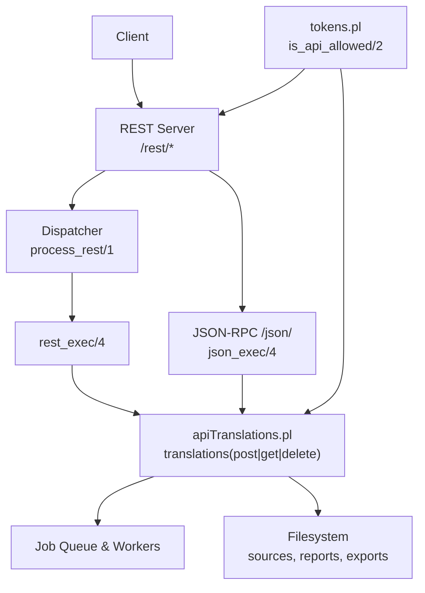
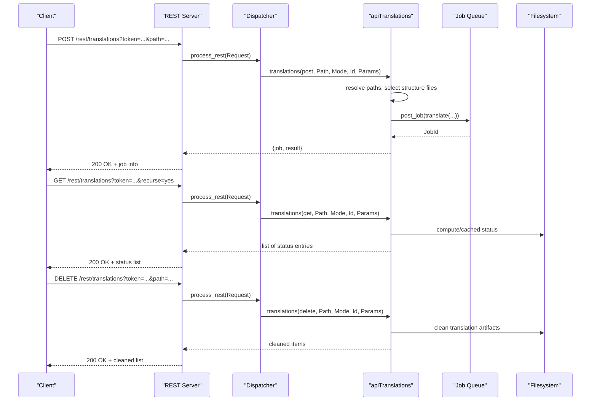
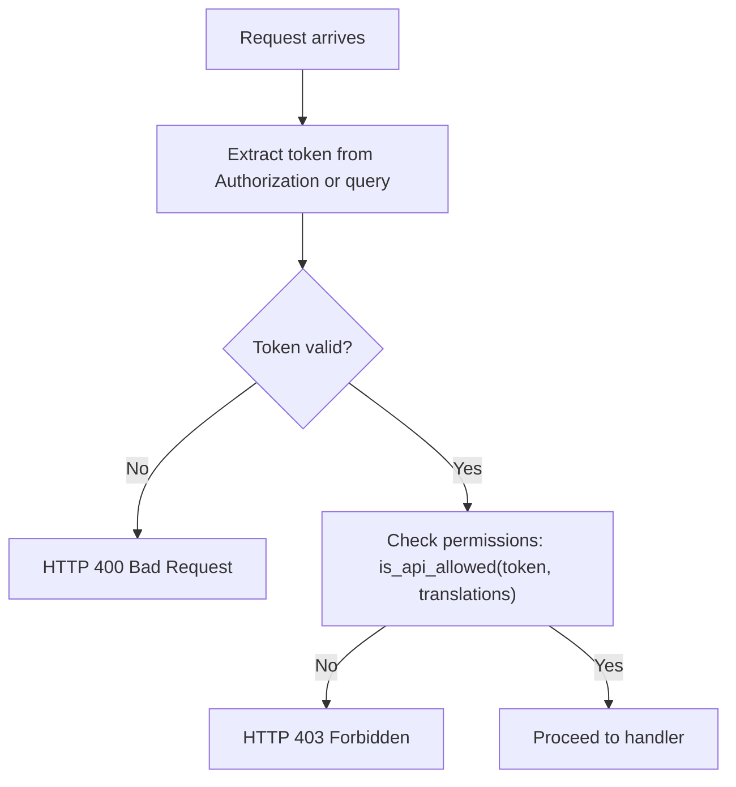

# Translation Endpoints

<cite>
**Referenced Files in This Document**
- [restServer.pl](file://src/restServer.pl)
- [apiTranslations.pl](file://src/apiTranslations.pl)
- [tokens.pl](file://src/tokens.pl)
- [apiTokens.pl](file://src/apiTokens.pl)
- [translation_results.md](file://docs/doc/translation_results.md)
- [api-tests.postman_collection.json](file://api/postman/api-tests.postman_collection.json)
</cite>

## Table of Contents
1. [Introduction](#introduction)
2. [Project Structure](#project-structure)
3. [Core Components](#core-components)
4. [Architecture Overview](#architecture-overview)
5. [Detailed Component Analysis](#detailed-component-analysis)
6. [Dependency Analysis](#dependency-analysis)
7. [Performance Considerations](#performance-considerations)
8. [Troubleshooting Guide](#troubleshooting-guide)
9. [Conclusion](#conclusion)
10. [Appendices](#appendices)

## Introduction
This document provides detailed API documentation for translation endpoints under /rest/translations/*. It covers:
- POST to start a translation job (single file or directory)
- GET to check translation status
- DELETE to remove translation results
It also documents authentication, request/response schemas, practical curl examples, and operational considerations such as timeouts and monitoring.

## Project Structure
The translation feature is implemented across the REST server dispatcher and the translations module:
- REST routing and JSON-RPC bridge are defined in the REST server.
- The translations business logic (job creation, status, cleanup) is implemented in the translations module.
- Authentication and token management are handled by the tokens module and token API.

**Diagram sources**
- [restServer.pl:300-310](file://src/restServer.pl#L300-L310)
- [restServer.pl:468-516](file://src/restServer.pl#L468-L516)
- [restServer.pl:635-648](file://src/restServer.pl#L635-L648)
- [restServer.pl:1014-1074](file://src/restServer.pl#L1014-L1074)
- [apiTranslations.pl:35-84](file://src/apiTranslations.pl#L35-L84)
- [apiTranslations.pl:87-124](file://src/apiTranslations.pl#L87-L124)
- [apiTranslations.pl:125-140](file://src/apiTranslations.pl#L125-L140)
- [tokens.pl:249-257](file://src/tokens.pl#L249-L257)

**Section sources**
- [restServer.pl:300-310](file://src/restServer.pl#L300-L310)
- [restServer.pl:468-516](file://src/restServer.pl#L468-L516)
- [restServer.pl:635-648](file://src/restServer.pl#L635-L648)
- [restServer.pl:1014-1074](file://src/restServer.pl#L1014-L1074)
- [apiTranslations.pl:35-84](file://src/apiTranslations.pl#L35-L84)
- [apiTranslations.pl:87-124](file://src/apiTranslations.pl#L87-L124)
- [apiTranslations.pl:125-140](file://src/apiTranslations.pl#L125-L140)
- [tokens.pl:249-257](file://src/tokens.pl#L249-L257)

## Core Components
- REST endpoint group: /rest/translations
  - POST /rest/translations: Start translation job(s). Accepts parameters like path, structure, recurse, echo, spawn.
  - GET /rest/translations: Get translation status for files/directories. Supports filter by status and recursion.
  - DELETE /rest/translations: Remove translation artifacts for a file or directory.
- JSON-RPC bridge: /json/ with method "translations"
  - Provides an alternative invocation path that internally delegates to the same logic.
- Job orchestration:
  - Single-stru mode vs multi-stru/spawned mode.
  - Status cache for large sets.
- Authentication:
  - Token required via Authorization header or query parameter.
  - Permission "translations" must be granted to the token.

Key behaviors:
- POST resolves source paths, selects structure files per file, queues jobs, returns job metadata.
- GET computes or retrieves cached status, filters by status, returns structured status objects.
- DELETE cleans translation outputs while avoiding active jobs.

**Section sources**
- [restServer.pl:300-310](file://src/restServer.pl#L300-L310)
- [restServer.pl:1014-1074](file://src/restServer.pl#L1014-L1074)
- [apiTranslations.pl:35-84](file://src/apiTranslations.pl#L35-L84)
- [apiTranslations.pl:87-124](file://src/apiTranslations.pl#L87-L124)
- [apiTranslations.pl:125-140](file://src/apiTranslations.pl#L125-L140)
- [tokens.pl:249-257](file://src/tokens.pl#L249-L257)

## Architecture Overview
The REST server dispatches requests to entity handlers. For translations, the handler coordinates job submission, status retrieval, and cleanup.

**Diagram sources**
- [restServer.pl:468-516](file://src/restServer.pl#L468-L516)
- [restServer.pl:635-648](file://src/restServer.pl#L635-L648)
- [restServer.pl:1014-1074](file://src/restServer.pl#L1014-L1074)
- [apiTranslations.pl:35-84](file://src/apiTranslations.pl#L35-L84)
- [apiTranslations.pl:87-124](file://src/apiTranslations.pl#L87-L124)
- [apiTranslations.pl:125-140](file://src/apiTranslations.pl#L125-L140)

## Detailed Component Analysis

### Endpoint: POST /rest/translations
Starts one or more translation jobs. If the path points to a directory, all matching source files are translated.

- Method: POST
- Path: /rest/translations
- Required headers:
  - Authorization: Bearer <token>
  - Content-Type: application/x-www-form-urlencoded (for REST) or application/json (for JSON-RPC)
- Query/form parameters:
  - token: string (required unless using Authorization header)
  - path: string (required; single file or directory)
  - structure: string (optional; explicit structure file path)
  - recurse: yes|no (optional; default no; affects directory traversal for GET and status resolution)
  - echo: yes|no (optional; default no; include source lines in report)
  - spawn: yes|no (optional; default no; parallelize across workers when multiple stru files)
  - status: T|P|Q|W|E|no (optional; used by GET to filter)
- Response:
  - JSON-RPC style response includes job metadata (method, object, job id).
  - REST text output includes method, path, and job id.

Notes:
- If structure is not provided, the system resolves a suitable structure file per source file or uses the default.
- When multiple structure files are needed, processing may be spawned across workers.

Practical curl examples:
- Translate a single file:
  - curl -X POST "http://localhost:8088/rest/translations?id=req1&token=TOKEN&path=sources/foo.cli&echo=no"
- Translate a directory recursively:
  - curl -X POST "http://localhost:8088/rest/translations?id=req2&token=TOKEN&path=sources/bar/&recurse=yes"
- Use a specific structure file:
  - curl -X POST "http://localhost:8088/rest/translations?id=req3&token=TOKEN&path=sources/baz.cli&structure=structures/baz.str"

Error handling:
- Missing token or invalid token: HTTP 400 Bad Request.
- Source file does not exist: HTTP 404 Not Found with resource error details.
- Structure file does not exist: HTTP 400 Bad Request with message indicating missing structure.

**Section sources**
- [restServer.pl:300-310](file://src/restServer.pl#L300-L310)
- [restServer.pl:1014-1074](file://src/restServer.pl#L1014-L1074)
- [apiTranslations.pl:35-84](file://src/apiTranslations.pl#L35-L84)
- [apiTranslations.pl:264-307](file://src/apiTranslations.pl#L264-L307)

### Endpoint: GET /rest/translations
Retrieves translation status for files or directories.

- Method: GET
- Path: /rest/translations
- Parameters:
  - token: string (required unless using Authorization header)
  - path: string (required; single file or directory)
  - recurse: yes|no (optional; default no; traverse subdirectories)
  - status: T|P|Q|W|E|no (optional; filter by status)
- Response:
  - List of status entries, each including:
    - name: file name
    - path: full path
    - source_url: URL to fetch the source file
    - status: T (translated), P (processing), Q (queued), W (warnings), E (errors), ? (unknown)
    - modified, modified_string, modified_rfc1123, modified_iso: timestamps
    - size: file size in bytes
    - directory: parent directory
    - ttime, ttime_string: processing start time (if applicable)
    - qtime, qtime_string: queue entry time (if applicable)
    - errors, warnings, version, translated, translated_string: translation metrics (if available)
    - rpt_url, xml_url: URLs to report and XML export (if available)

Behavior:
- Uses a status cache for large sets to reduce overhead.
- Filters results by status if provided.

Practical curl examples:
- Check status for a directory recursively:
  - curl "http://localhost:8088/rest/translations?id=status1&token=TOKEN&path=sources/bar/&recurse=yes"
- Filter by status:
  - curl "http://localhost:8088/rest/translations?id=status2&token=TOKEN&status=P"

**Section sources**
- [restServer.pl:300-310](file://src/restServer.pl#L300-L310)
- [apiTranslations.pl:87-124](file://src/apiTranslations.pl#L87-L124)
- [apiTranslations.pl:236-241](file://src/apiTranslations.pl#L236-L241)
- [apiTranslations.pl:494-577](file://src/apiTranslations.pl#L494-L577)
- [apiTranslations.pl:598-611](file://src/apiTranslations.pl#L598-L611)

### Endpoint: DELETE /rest/translations
Removes translation artifacts for a file or directory.

- Method: DELETE
- Path: /rest/translations
- Parameters:
  - token: string (required unless using Authorization header)
  - path: string (required; single file or directory)
- Behavior:
  - Resolves absolute path and deletes .rpt, .err, .xml, .ids, .files.json, etc., associated with the target.
  - Skips files currently being processed or queued.
- Response:
  - List of cleaned items.

Practical curl examples:
- Clean a single file:
  - curl -X DELETE "http://localhost:8088/rest/translations?id=clean1&token=TOKEN&path=sources/foo.cli"
- Clean a directory:
  - curl -X DELETE "http://localhost:8088/rest/translations?id=clean2&token=TOKEN&path=sources/bar/"

**Section sources**
- [restServer.pl:300-310](file://src/restServer.pl#L300-L310)
- [apiTranslations.pl:125-140](file://src/apiTranslations.pl#L125-L140)
- [apiTranslations.pl:724-767](file://src/apiTranslations.pl#L724-L767)

### JSON-RPC Bridge: POST /json/ with method "translations"
Alternative invocation path for translation operations.

- Method: POST
- Path: /json/
- Body:
  - jsonrpc: "2.0"
  - method: "translations"
  - params:
    - token: string
    - path: string
    - structure: string (optional)
  - id: number|string
- Response:
  - JSON-RPC envelope with result "OK" and job metadata.

Practical curl example:
- curl -X POST "http://localhost:8088/json/" \
  -H "Content-Type: application/json" \
  -d '{"jsonrpc":"2.0","method":"translations","params":{"token":"TOKEN","path":"sources/foo.cli"},"id":1}'

**Section sources**
- [restServer.pl:1014-1074](file://src/restServer.pl#L1014-L1074)

## Dependency Analysis
Authentication and authorization flow:
- Requests must include a valid token.
- The token must have the "translations" permission.
- Admin token can bypass user-specific restrictions.

**Diagram sources**
- [restServer.pl:547-579](file://src/restServer.pl#L547-L579)
- [tokens.pl:249-257](file://src/tokens.pl#L249-L257)

**Section sources**
- [restServer.pl:547-579](file://src/restServer.pl#L547-L579)
- [tokens.pl:249-257](file://src/tokens.pl#L249-L257)
- [apiTokens.pl:18-24](file://src/apiTokens.pl#L18-L24)

## Performance Considerations
- Worker threads:
  - Configurable via KLEIO_SERVER_WORKERS. Default is 3.
- Timeouts:
  - Global HTTP timeout configured via KLEIO_IDLE_TIMEOUT (default 900 seconds).
  - REST handler time limit set at route registration (e.g., 300 seconds).
- Status caching:
  - GET /rest/translations caches results for large sets to avoid recomputation. Cache age depends on set size.
- Parallelization:
  - spawn=yes distributes work across workers when multiple structure files are involved.

Operational tips:
- Increase KLEIO_SERVER_WORKERS for high concurrency.
- Adjust KLEIO_IDLE_TIMEOUT for long-running operations.
- Use recurse=yes judiciously for large directories.

**Section sources**
- [restServer.pl:175-184](file://src/restServer.pl#L175-L184)
- [restServer.pl:300-310](file://src/restServer.pl#L300-L310)
- [restServer.pl:344-349](file://src/restServer.pl#L344-L349)
- [apiTranslations.pl:169-233](file://src/apiTranslations.pl#L169-L233)
- [apiTranslations.pl:242-260](file://src/apiTranslations.pl#L242-L260)

## Troubleshooting Guide
Common issues and resolutions:
- Missing or invalid token:
  - Ensure Authorization header contains "Bearer TOKEN" or pass token parameter.
  - Verify token has "translations" permission.
- Resource not found:
  - Confirm path exists under the sources root accessible to the token.
- Structure file not found:
  - Provide explicit structure parameter or ensure default structure exists.
- Long-running jobs:
  - Monitor status via GET /rest/translations with status filtering.
  - Check server activity and worker pool configuration.

Useful references:
- Translation artifacts and their meanings are documented for interpreting reports and exports.

**Section sources**
- [restServer.pl:547-579](file://src/restServer.pl#L547-L579)
- [restServer.pl:1014-1074](file://src/restServer.pl#L1014-L1074)
- [apiTranslations.pl:264-307](file://src/apiTranslations.pl#L264-L307)
- [translation_results.md:1-81](file://docs/doc/translation_results.md#L1-L81)

## Conclusion
The /rest/translations endpoints provide a robust mechanism to initiate, monitor, and manage translation jobs across single files and directories. With token-based authentication, flexible parameters, and efficient status caching, they support both interactive and automated workflows. Proper configuration of workers and timeouts ensures reliable operation under varying loads.

## Appendices

### Request/Response Schemas Summary
- POST /rest/translations
  - Parameters: token, path, structure (optional), recurse (optional), echo (optional), spawn (optional)
  - Response: job metadata (method, object, job id)
- GET /rest/translations
  - Parameters: token, path, recurse (optional), status (optional)
  - Response: array of status entries with fields like name, path, status, timestamps, metrics, and URLs
- DELETE /rest/translations
  - Parameters: token, path
  - Response: list of cleaned items

### Practical curl Examples
- Batch workflow:
  - Start translations for multiple files:
    - curl -X POST "http://localhost:8088/rest/translations?id=b1&token=TOKEN&path=sources/dir1/cli1.cli"
    - curl -X POST "http://localhost:8088/rest/translations?id=b2&token=TOKEN&path=sources/dir2/cli2.cli"
  - Poll status:
    - curl "http://localhost:8088/rest/translations?id=poll1&token=TOKEN&recurse=yes&status=P"
  - Clean after completion:
    - curl -X DELETE "http://localhost:8088/rest/translations?id=del1&token=TOKEN&path=sources/dir1/"

- Error handling:
  - Invalid token: expect HTTP 400
  - Missing source: expect HTTP 404 with resource error
  - Missing structure: expect HTTP 400 with message

- Monitoring long-running jobs:
  - Periodically poll GET /rest/translations with status filters
  - Inspect rpt_url and xml_url in status entries for detailed reports and exports

**Section sources**
- [api-tests.postman_collection.json:4480-4506](file://api/postman/api-tests.postman_collection.json#L4480-L4506)
- [restServer.pl:1014-1074](file://src/restServer.pl#L1014-L1074)
- [apiTranslations.pl:87-124](file://src/apiTranslations.pl#L87-L124)
- [apiTranslations.pl:125-140](file://src/apiTranslations.pl#L125-L140)