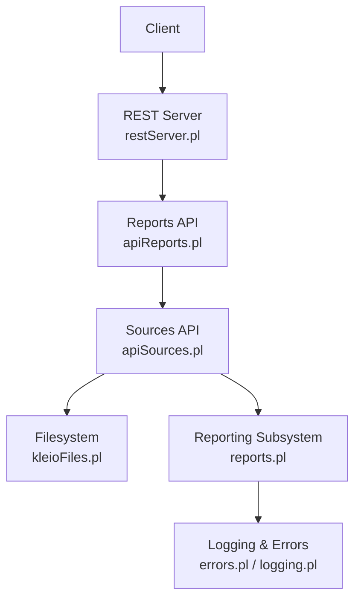
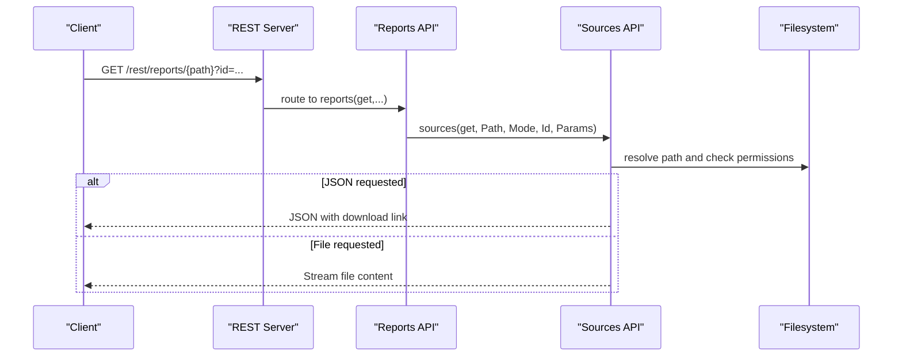
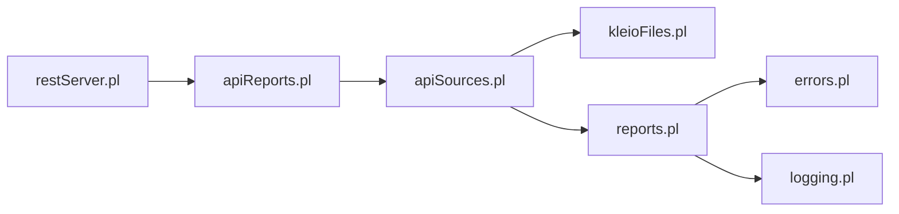

# Reporting API

<cite>
**Referenced Files in This Document**
- [apiReports.pl](file://src/apiReports.pl)
- [apiSources.pl](file://src/apiSources.pl)
- [restServer.pl](file://src/restServer.pl)
- [kleioFiles.pl](file://src/kleioFiles.pl)
- [reports.pl](file://src/reports.pl)
- [errors.pl](file://src/errors.pl)
- [logging.pl](file://src/logging.pl)
- [index.html](file://docs/api/index.html)
- [api.json](file://api/postman/api.json)
</cite>

## Table of Contents
1. [Introduction](#introduction)
2. [Project Structure](#project-structure)
3. [Core Components](#core-components)
4. [Architecture Overview](#architecture-overview)
5. [Detailed Component Analysis](#detailed-component-analysis)
6. [Dependency Analysis](#dependency-analysis)
7. [Performance Considerations](#performance-considerations)
8. [Troubleshooting Guide](#troubleshooting-guide)
9. [Conclusion](#conclusion)
10. [Appendices](#appendices)

## Introduction
This document describes the Reporting API for retrieving translation reports and exporting them in multiple formats. It covers:
- Retrieving report files via REST endpoints
- Export formats supported by the system (CSV, JSON, XML) and how they relate to internal report artifacts
- Filtering and selection of report artifacts by file status and error categories
- Pagination and query parameters
- Caching and performance characteristics for large datasets
- Error reporting formats, warning categorization, and diagnostic information
- Examples of common reporting scenarios and integration patterns

## Project Structure
The Reporting API is implemented on top of the REST server and reuses the Sources API to resolve and serve report-related files. The key modules involved are:
- REST server dispatcher and routing
- Sources API for file retrieval and resolution
- Reporting subsystem for writing and managing report artifacts
- Error and logging subsystems for diagnostics

**Diagram sources**
- [restServer.pl](file://src/restServer.pl#L491-L515)
- [apiReports.pl](file://src/apiReports.pl#L14-L19)
- [apiSources.pl](file://src/apiSources.pl#L89-L104)
- [kleioFiles.pl](file://src/kleioFiles.pl#L69-L92)
- [reports.pl](file://src/reports.pl#L51-L106)
- [errors.pl](file://src/errors.pl#L85-L113)
- [logging.pl](file://src/logging.pl#L35-L39)

**Section sources**
- [restServer.pl](file://src/restServer.pl#L491-L515)
- [apiReports.pl](file://src/apiReports.pl#L14-L19)
- [apiSources.pl](file://src/apiSources.pl#L89-L104)
- [kleioFiles.pl](file://src/kleioFiles.pl#L69-L92)
- [reports.pl](file://src/reports.pl#L51-L106)
- [errors.pl](file://src/errors.pl#L85-L113)
- [logging.pl](file://src/logging.pl#L35-L39)

## Core Components
- Reports API entry points:
  - GET /rest/reports/{path} to retrieve a report file by path
  - GET /rest/reports/{path}?json=yes to receive a JSON response with metadata and a download link
- Sources API integration:
  - The Reports API delegates to the Sources API to resolve and serve files, ensuring proper authorization and path resolution
- Report artifact model:
  - Translation produces multiple artifacts per source file: .rpt (human-readable report), .err (machine-readable summary), .xml (export), .org/.old (versions), .ids (temporary), and .files.json (metadata)
- Status and filtering:
  - File status is derived from the presence and timestamps of artifacts (needs translation, errors, warnings, valid)
- Export formats:
  - CSV/JSON/XML are supported by the broader system; the Reports API serves .rpt and .err artifacts; .xml is available via the Exports API

**Section sources**
- [apiReports.pl](file://src/apiReports.pl#L14-L19)
- [apiSources.pl](file://src/apiSources.pl#L89-L104)
- [kleioFiles.pl](file://src/kleioFiles.pl#L69-L92)
- [kleioFiles.pl](file://src/kleioFiles.pl#L146-L185)
- [apiExports.pl](file://src/apiExports.pl#L14-L19)

## Architecture Overview
The Reporting API leverages the REST server’s routing and the Sources API’s file resolution. Requests are authenticated, routed to the appropriate handler, and resolved to filesystem paths. The Sources API ensures secure access and returns either the file content or a JSON response containing a download link.

**Diagram sources**
- [restServer.pl](file://src/restServer.pl#L491-L515)
- [apiReports.pl](file://src/apiReports.pl#L14-L19)
- [apiSources.pl](file://src/apiSources.pl#L89-L104)

## Detailed Component Analysis

### Reports API Endpoints
- Endpoint: GET /rest/reports/{path}
  - Purpose: Retrieve a report artifact by path
  - Behavior:
    - If Accept: application/json or json=yes is specified, returns a JSON object with metadata and a download link
    - Otherwise, streams the raw file content
  - Authentication: Requires a valid bearer token
  - Authorization: Requires permission to access files
- Notes:
  - The endpoint is implemented by delegating to the Sources API
  - The path is resolved relative to the user’s sources directory

**Section sources**
- [apiReports.pl](file://src/apiReports.pl#L14-L19)
- [apiSources.pl](file://src/apiSources.pl#L89-L104)
- [restServer.pl](file://src/restServer.pl#L556-L562)
- [index.html](file://docs/api/index.html#L13400-L13430)

### Report Artifact Model and Status
- Artifacts per source file:
  - .rpt: Human-readable translation report
  - .err: Machine-readable summary (includes counts and categories)
  - .xml: Exported data
  - .org/.old: Versioned copies
  - .ids: Temporary pretty-printed CLI
  - .files.json: Metadata dictionary of related files
- Status derivation:
  - Needs translation if .rpt or .err missing or source newer than .rpt
  - Has errors if .err indicates nonzero error count
  - Has warnings if .err indicates nonzero warning count
  - Valid otherwise

**Section sources**
- [kleioFiles.pl](file://src/kleioFiles.pl#L69-L92)
- [kleioFiles.pl](file://src/kleioFiles.pl#L146-L185)

### Export Formats and Download Links
- Supported formats:
  - CSV, JSON, XML are part of the broader export ecosystem
- How to obtain:
  - Reports: GET /rest/reports/{path} returns .rpt or .err files
  - Exports: Use the Exports API to retrieve .xml exports
  - JSON metadata: When requesting JSON output, the response includes a download link to the artifact
- Link generation:
  - The Sources API resolves the artifact path and returns a link suitable for downloading

**Section sources**
- [apiReports.pl](file://src/apiReports.pl#L14-L19)
- [apiExports.pl](file://src/apiExports.pl#L14-L19)
- [apiSources.pl](file://src/apiSources.pl#L89-L104)

### Filtering and Selection
- By file status:
  - Use the Sources API to list/report artifacts and filter by status (needs translation, errors, warnings, valid)
- By error categories:
  - The .err artifact contains counts and can be used to filter by severity
- By date ranges:
  - Artifact timestamps are available via the artifact metadata; clients can filter by modified times
- Pagination:
  - The Sources API supports listing directories and can be used to paginate artifact discovery

**Section sources**
- [kleioFiles.pl](file://src/kleioFiles.pl#L69-L92)
- [kleioFiles.pl](file://src/kleioFiles.pl#L146-L185)
- [apiSources.pl](file://src/apiSources.pl#L28-L54)

### Error Reporting and Diagnostics
- Error and warning categorization:
  - Errors and warnings are tracked and emitted during translation
  - The .err artifact summarizes counts and contextual information
- Diagnostic information:
  - The .rpt file includes contextual lines and near-line information for errors
  - Logging supports multiple levels and can be used for operational diagnostics
- Integration:
  - Clients can parse .err for structured summaries and .rpt for human-readable context

**Section sources**
- [errors.pl](file://src/errors.pl#L85-L113)
- [errors.pl](file://src/errors.pl#L135-L167)
- [logging.pl](file://src/logging.pl#L35-L39)
- [logging.pl](file://src/logging.pl#L98-L119)

### Request/Response Schemas
- Request
  - Path parameters: path (relative to user sources)
  - Query parameters: id (optional request identifier), json=yes|no (optional)
  - Headers: Accept: application/json (optional)
  - Authentication: Bearer token
- Response (JSON)
  - Fields:
    - download_link: URL to download the artifact
    - metadata: Dictionary of related files (.rpt, .err, .xml, .org, .old, .ids, .files.json)
    - status: Derived status (T, E, W, V)
- Response (Raw file)
  - Content depends on the artifact type (.rpt, .err, .xml)

**Section sources**
- [apiReports.pl](file://src/apiReports.pl#L14-L19)
- [apiSources.pl](file://src/apiSources.pl#L89-L104)
- [kleioFiles.pl](file://src/kleioFiles.pl#L69-L92)

### Examples and Scenarios
- Retrieve a report file:
  - GET /rest/reports/paroquiais/casamentos/cas1714-1722.rpt
- Retrieve JSON metadata with download link:
  - GET /rest/reports/paroquiais/casamentos/cas1714-1722.rpt?json=yes
- Export in XML:
  - Use the Exports API to fetch the .xml artifact
- Filter by status:
  - List artifacts and filter by status derived from metadata

**Section sources**
- [index.html](file://docs/api/index.html#L13400-L13430)
- [api.json](file://api/postman/api.json#L3784-L3823)
- [apiExports.pl](file://src/apiExports.pl#L14-L19)

## Dependency Analysis
The Reports API depends on the REST server for routing and authentication, and on the Sources API for path resolution and file serving. The Sources API, in turn, uses filesystem utilities and the reporting subsystem for diagnostics.

**Diagram sources**
- [restServer.pl](file://src/restServer.pl#L491-L515)
- [apiReports.pl](file://src/apiReports.pl#L14-L19)
- [apiSources.pl](file://src/apiSources.pl#L89-L104)
- [kleioFiles.pl](file://src/kleioFiles.pl#L69-L92)
- [reports.pl](file://src/reports.pl#L51-L106)
- [errors.pl](file://src/errors.pl#L85-L113)
- [logging.pl](file://src/logging.pl#L35-L39)

**Section sources**
- [restServer.pl](file://src/restServer.pl#L491-L515)
- [apiReports.pl](file://src/apiReports.pl#L14-L19)
- [apiSources.pl](file://src/apiSources.pl#L89-L104)
- [kleioFiles.pl](file://src/kleioFiles.pl#L69-L92)
- [reports.pl](file://src/reports.pl#L51-L106)
- [errors.pl](file://src/errors.pl#L85-L113)
- [logging.pl](file://src/logging.pl#L35-L39)

## Performance Considerations
- Streaming vs. JSON responses:
  - Raw file streaming is efficient for large artifacts
  - JSON responses add metadata overhead but provide structured access
- Artifact caching:
  - The system caches attribute files and shared resources; this reduces repeated filesystem scans
- Timeouts:
  - REST server enforces request timeouts; long-running operations should be designed accordingly
- Recommendations:
  - Prefer JSON responses for programmatic consumption
  - Use pagination when listing artifacts
  - Cache frequently accessed metadata to reduce I/O

[No sources needed since this section provides general guidance]

## Troubleshooting Guide
- Authentication failures:
  - Ensure a valid bearer token is provided; missing or invalid tokens cause 400/403 responses
- Permission denied:
  - Verify the token has file access permissions
- Not found:
  - The path may be incorrect or outside the user’s sources directory
- Large report downloads:
  - Use JSON responses to avoid large file transfers when only metadata is needed
- Error parsing:
  - Parse .err for structured summaries; consult .rpt for contextual lines around errors
- Logging:
  - Enable appropriate log levels for diagnostics

**Section sources**
- [restServer.pl](file://src/restServer.pl#L556-L562)
- [errors.pl](file://src/errors.pl#L85-L113)
- [logging.pl](file://src/logging.pl#L98-L119)

## Conclusion
The Reporting API provides a straightforward mechanism to retrieve translation artifacts and metadata. By leveraging the Sources API and filesystem utilities, it supports flexible filtering, status-based selection, and efficient delivery of reports in multiple formats. Proper use of JSON responses, pagination, and caching enables scalable reporting for large datasets.

[No sources needed since this section summarizes without analyzing specific files]

## Appendices

### API Definition Summary
- GET /rest/reports/{path}
  - Query params: id, json=yes|no
  - Headers: Accept: application/json
  - Response: Raw artifact or JSON with download link and metadata
- GET /rest/reports/{path}?json=yes
  - Response includes download_link and metadata dictionary

**Section sources**
- [apiReports.pl](file://src/apiReports.pl#L14-L19)
- [apiSources.pl](file://src/apiSources.pl#L89-L104)
- [index.html](file://docs/api/index.html#L13400-L13430)