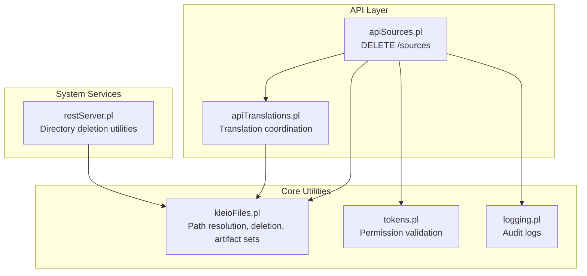
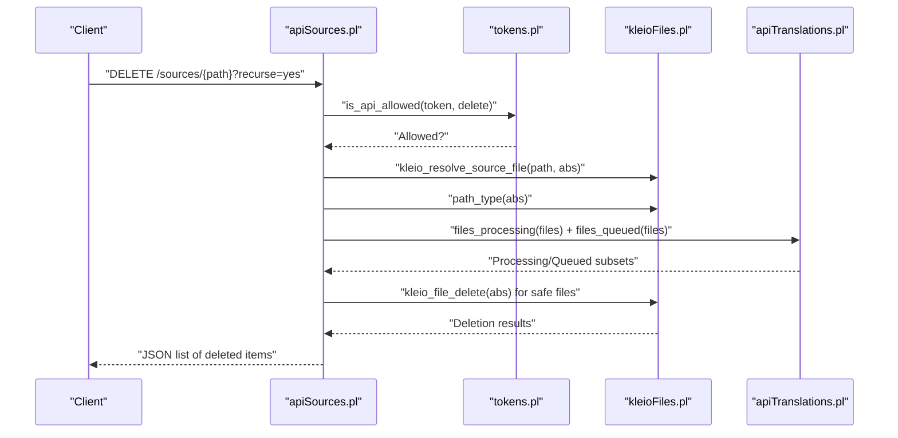
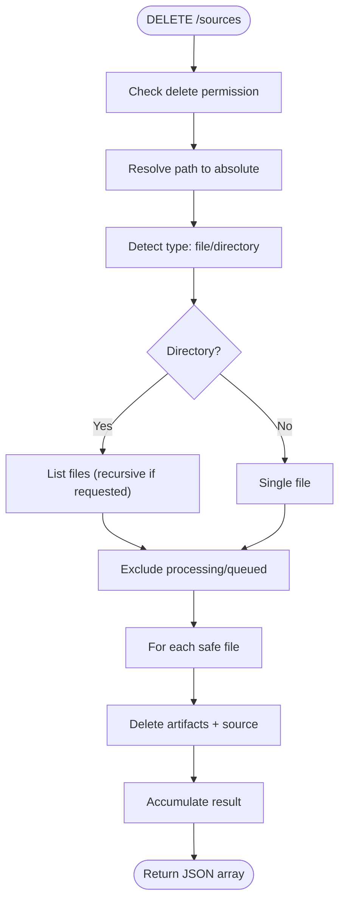
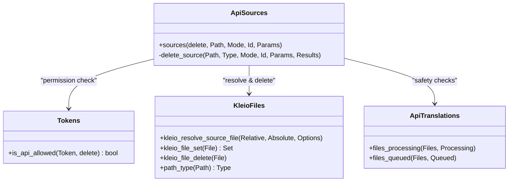
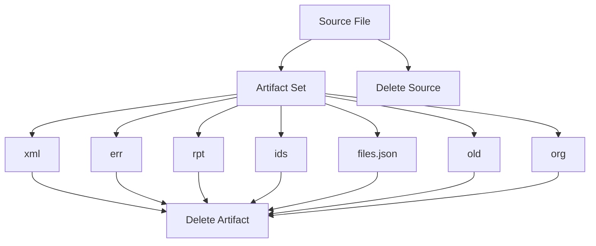
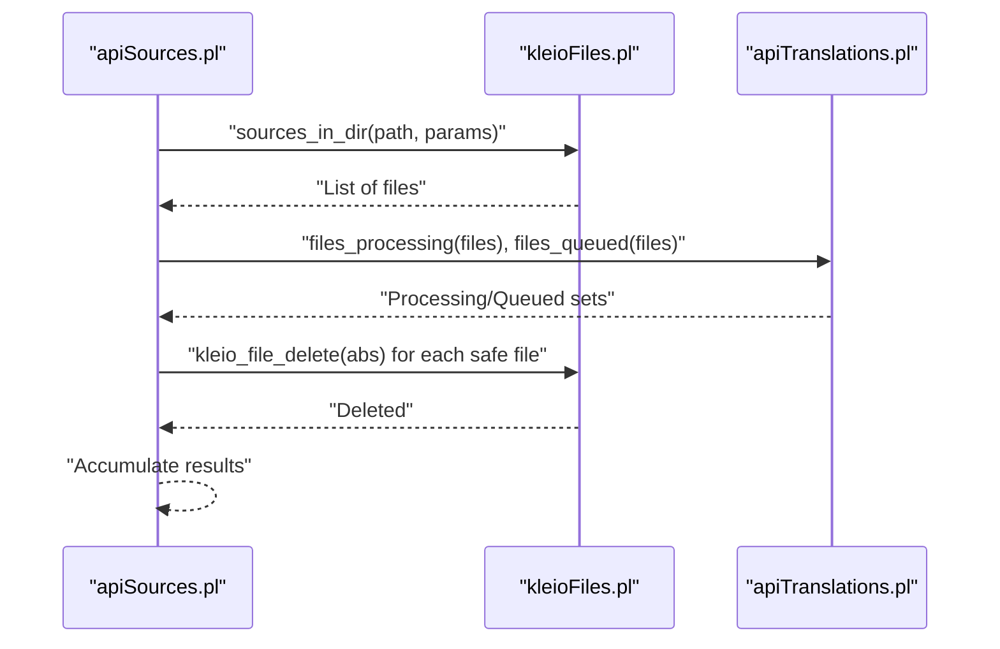
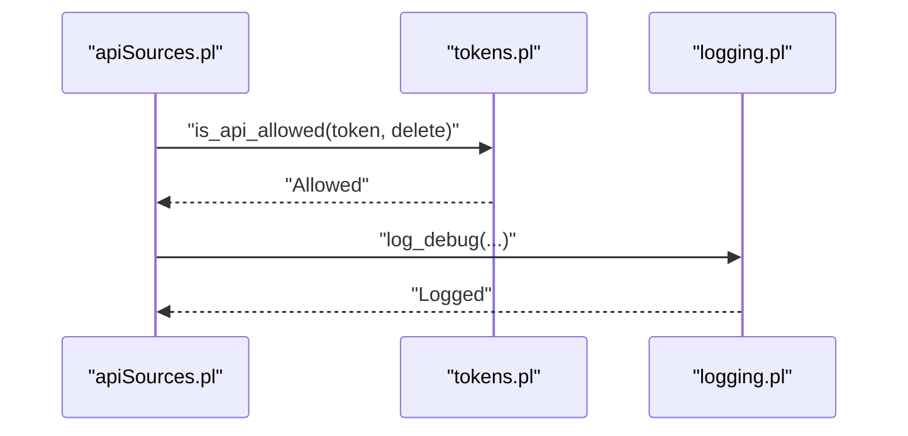
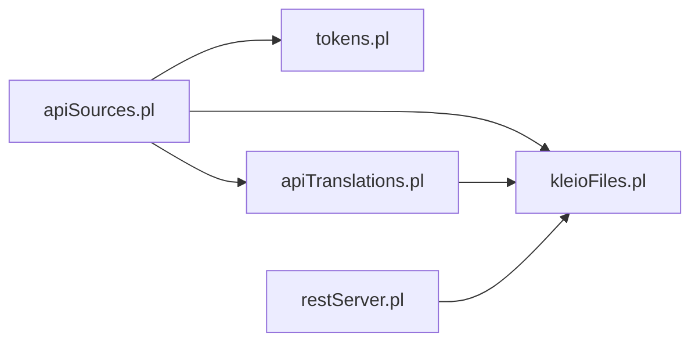

# Delete Operations

<cite>
**Referenced Files in This Document**
- [src/apiSources.pl](file://src/apiSources.pl)
- [src/kleioFiles.pl](file://src/kleioFiles.pl)
- [src/tokens.pl](file://src/tokens.pl)
- [src/apiTranslations.pl](file://src/apiTranslations.pl)
- [src/restServer.pl](file://src/restServer.pl)
- [src/logging.pl](file://src/logging.pl)
- [api/postman/api-tests.postman_collection.json](file://api/postman/api-tests.postman_collection.json)
</cite>

## Table of Contents
1. [Introduction](#introduction)
2. [Project Structure](#project-structure)
3. [Core Components](#core-components)
4. [Architecture Overview](#architecture-overview)
5. [Detailed Component Analysis](#detailed-component-analysis)
6. [Dependency Analysis](#dependency-analysis)
7. [Performance Considerations](#performance-considerations)
8. [Troubleshooting Guide](#troubleshooting-guide)
9. [Conclusion](#conclusion)
10. [Appendices](#appendices)

## Introduction
This document provides comprehensive API documentation for file deletion operations in the sources management system. It covers:
- DELETE /sources for removing individual files and entire directory trees with recursive deletion support
- Safety mechanisms preventing deletion of files currently in translation or queued for processing
- Cascading deletion behavior for translation artifacts and derived files
- Path resolution process, permission validation, and audit trail generation
- Examples of safe deletion scenarios, error conditions for protected files, and bulk deletion operations
- Relationship between file deletion and translation job cleanup, cache invalidation, and system resource management
- Guidance on backup strategies and irreversible operation warnings

## Project Structure
The deletion functionality is implemented across several modules:
- API entry points and routing for sources management
- File system utilities for path resolution and deletion
- Token-based permission validation
- Translation job coordination and safety checks
- Logging and audit trail facilities

**Diagram sources**
- [src/apiSources.pl](file://src/apiSources.pl#L109-L123)
- [src/kleioFiles.pl](file://src/kleioFiles.pl#L753-L800)
- [src/tokens.pl](file://src/tokens.pl#L249-L257)
- [src/apiTranslations.pl](file://src/apiTranslations.pl#L124-L138)
- [src/restServer.pl](file://src/restServer.pl#L1307-L1340)

**Section sources**
- [src/apiSources.pl](file://src/apiSources.pl#L109-L123)
- [src/kleioFiles.pl](file://src/kleioFiles.pl#L753-L800)
- [src/tokens.pl](file://src/tokens.pl#L249-L257)
- [src/apiTranslations.pl](file://src/apiTranslations.pl#L124-L138)
- [src/restServer.pl](file://src/restServer.pl#L1307-L1340)

## Core Components
- DELETE /sources endpoint: Validates permissions, resolves path, determines type (file/directory), and invokes deletion logic.
- Path resolution: Converts relative paths to absolute paths using user-specific source directories.
- Safety checks: Excludes files currently in translation or queued for processing.
- Artifact deletion: Removes translation artifacts (xml, err, rpt, ids, files.json, old, org) alongside the source file.
- Bulk deletion: Iterates over directory listings and applies safety checks per file.
- Audit trail: Logs deletion actions and outcomes.

Key implementation references:
- DELETE handler and results formatting
- Path type detection and resolution
- Artifact set composition and deletion
- Permission validation via tokens
- Translation job coordination for safety checks

**Section sources**
- [src/apiSources.pl](file://src/apiSources.pl#L109-L123)
- [src/apiSources.pl](file://src/apiSources.pl#L287-L320)
- [src/kleioFiles.pl](file://src/kleioFiles.pl#L284-L292)
- [src/kleioFiles.pl](file://src/kleioFiles.pl#L69-L144)
- [src/tokens.pl](file://src/tokens.pl#L249-L257)
- [src/apiTranslations.pl](file://src/apiTranslations.pl#L723-L760)

## Architecture Overview
The deletion workflow integrates API validation, path resolution, safety checks, and artifact cleanup.

**Diagram sources**
- [src/apiSources.pl](file://src/apiSources.pl#L109-L123)
- [src/tokens.pl](file://src/tokens.pl#L249-L257)
- [src/kleioFiles.pl](file://src/kleioFiles.pl#L753-L800)
- [src/apiTranslations.pl](file://src/apiTranslations.pl#L636-L721)

## Detailed Component Analysis

### DELETE /sources Endpoint
- Validates delete permission using tokens.
- Resolves relative path to absolute path using user token options.
- Determines whether target is a file or directory.
- Applies safety checks to exclude files currently processing or queued.
- Deletes artifacts and source files for each eligible target.
- Returns a JSON array of deleted items.

**Diagram sources**
- [src/apiSources.pl](file://src/apiSources.pl#L109-L123)
- [src/apiSources.pl](file://src/apiSources.pl#L287-L320)
- [src/apiTranslations.pl](file://src/apiTranslations.pl#L636-L721)
- [src/kleioFiles.pl](file://src/kleioFiles.pl#L128-L144)

**Section sources**
- [src/apiSources.pl](file://src/apiSources.pl#L109-L123)
- [src/apiSources.pl](file://src/apiSources.pl#L287-L320)

### Path Resolution and Safety Mechanisms
- Path resolution ensures targets are within user-accessible source directories.
- Safety checks prevent deletion of files currently being processed or queued for translation.
- Artifact deletion removes all derivative files produced by translation.

**Diagram sources**
- [src/kleioFiles.pl](file://src/kleioFiles.pl#L753-L800)
- [src/kleioFiles.pl](file://src/kleioFiles.pl#L69-L144)
- [src/kleioFiles.pl](file://src/kleioFiles.pl#L284-L292)
- [src/tokens.pl](file://src/tokens.pl#L249-L257)
- [src/apiSources.pl](file://src/apiSources.pl#L109-L123)
- [src/apiTranslations.pl](file://src/apiTranslations.pl#L636-L721)

**Section sources**
- [src/kleioFiles.pl](file://src/kleioFiles.pl#L753-L800)
- [src/kleioFiles.pl](file://src/kleioFiles.pl#L69-L144)
- [src/kleioFiles.pl](file://src/kleioFiles.pl#L284-L292)
- [src/tokens.pl](file://src/tokens.pl#L249-L257)
- [src/apiTranslations.pl](file://src/apiTranslations.pl#L636-L721)

### Cascading Deletion Behavior
- Artifact set includes xml, err, rpt, ids, files.json, old, org.
- Deletion removes the source file and all associated artifacts.
- Directory deletion enumerates files and applies the same artifact deletion logic.

**Diagram sources**
- [src/kleioFiles.pl](file://src/kleioFiles.pl#L69-L144)

**Section sources**
- [src/kleioFiles.pl](file://src/kleioFiles.pl#L69-L144)

### Recursive Directory Deletion
- When deleting a directory, the system lists all matching files (optionally recursively).
- Each file is individually checked for safety and then deleted with artifacts.
- The operation accumulates a list of deleted items for the response.

**Diagram sources**
- [src/apiSources.pl](file://src/apiSources.pl#L294-L304)
- [src/apiTranslations.pl](file://src/apiTranslations.pl#L636-L721)
- [src/kleioFiles.pl](file://src/kleioFiles.pl#L128-L144)

**Section sources**
- [src/apiSources.pl](file://src/apiSources.pl#L294-L304)
- [src/apiTranslations.pl](file://src/apiTranslations.pl#L636-L721)
- [src/kleioFiles.pl](file://src/kleioFiles.pl#L128-L144)

### Permission Validation and Audit Trail
- Permissions are validated against the token’s allowed API calls.
- Audit logs record deletion actions and outcomes for traceability.

**Diagram sources**
- [src/tokens.pl](file://src/tokens.pl#L249-L257)
- [src/logging.pl](file://src/logging.pl#L84-L112)

**Section sources**
- [src/tokens.pl](file://src/tokens.pl#L249-L257)
- [src/logging.pl](file://src/logging.pl#L84-L112)

## Dependency Analysis
- apiSources.pl depends on tokens.pl for permission checks, kleioFiles.pl for path resolution and deletion, and apiTranslations.pl for safety filtering.
- kleioFiles.pl encapsulates path resolution and artifact deletion.
- apiTranslations.pl provides translation job state queries used for safety.
- restServer.pl provides auxiliary directory deletion utilities.

**Diagram sources**
- [src/apiSources.pl](file://src/apiSources.pl#L109-L123)
- [src/tokens.pl](file://src/tokens.pl#L249-L257)
- [src/kleioFiles.pl](file://src/kleioFiles.pl#L753-L800)
- [src/apiTranslations.pl](file://src/apiTranslations.pl#L636-L721)
- [src/restServer.pl](file://src/restServer.pl#L1307-L1340)

**Section sources**
- [src/apiSources.pl](file://src/apiSources.pl#L109-L123)
- [src/tokens.pl](file://src/tokens.pl#L249-L257)
- [src/kleioFiles.pl](file://src/kleioFiles.pl#L753-L800)
- [src/apiTranslations.pl](file://src/apiTranslations.pl#L636-L721)
- [src/restServer.pl](file://src/restServer.pl#L1307-L1340)

## Performance Considerations
- Recursive directory deletion enumerates files and performs per-file safety checks; consider limiting recursion depth or batch sizes for very large directories.
- Artifact deletion involves multiple file operations; ensure filesystem performance is considered for bulk operations.
- Caching of translation status can reduce repeated computation during safety checks.

## Troubleshooting Guide
Common error conditions and resolutions:
- Forbidden: The token lacks delete permission. Ensure the token includes the delete API call.
- Not Found: The resolved path does not exist. Verify the relative path and user source directory.
- Protected Files: Files currently processing or queued are excluded from deletion. Wait for jobs to complete or cancel them before retrying.
- Directory Not Empty: Directory deletion may fail if contents are not explicitly requested. Use appropriate parameters to force deletion of contents.

Operational tips:
- Use the Postman collection to validate DELETE /sources behavior and confirm expected responses.
- Enable debug logging to capture detailed deletion events and outcomes.

**Section sources**
- [src/apiSources.pl](file://src/apiSources.pl#L109-L123)
- [src/apiTranslations.pl](file://src/apiTranslations.pl#L636-L721)
- [src/restServer.pl](file://src/restServer.pl#L1307-L1340)
- [api/postman/api-tests.postman_collection.json](file://api/postman/api-tests.postman_collection.json#L1407-L1443)

## Conclusion
The sources deletion subsystem provides robust, safe, and auditable file removal capabilities. It enforces permission-based access, prevents deletion of files in active translation workflows, and cleans up all associated artifacts. The recursive directory support enables efficient bulk operations while maintaining safety and traceability.

## Appendices

### API Definition: DELETE /sources
- Method: DELETE
- Path: /sources/{path}
- Query parameters:
  - recurse: yes|no (optional; default no)
  - id: request identifier (optional)
- Authentication: Bearer token with delete permission
- Response: JSON array of deleted items

Example request (Postman):
- DELETE http://{{endpoint}}/rest/sources/{{deleted_file}}?id={{request_id}}

**Section sources**
- [src/apiSources.pl](file://src/apiSources.pl#L109-L123)
- [api/postman/api-tests.postman_collection.json](file://api/postman/api-tests.postman_collection.json#L1407-L1443)

### Safe Deletion Scenarios
- Deleting a single file: The system resolves the path, checks safety, and deletes artifacts plus the source.
- Deleting a directory: The system lists files (optionally recursively), filters out protected files, and deletes each eligible file with artifacts.

**Section sources**
- [src/apiSources.pl](file://src/apiSources.pl#L287-L320)
- [src/kleioFiles.pl](file://src/kleioFiles.pl#L128-L144)

### Error Conditions and Protection
- Forbidden: Token missing delete permission.
- Not Found: Target path does not resolve to an existing file or directory.
- Protected Files: Files currently processing or queued are excluded from deletion.
- Directory Not Empty: Directory deletion fails unless contents are explicitly requested.

**Section sources**
- [src/apiSources.pl](file://src/apiSources.pl#L109-L123)
- [src/apiTranslations.pl](file://src/apiTranslations.pl#L636-L721)
- [src/restServer.pl](file://src/restServer.pl#L1307-L1340)

### Backup and Irreversibility Guidance
- Back up critical sources and artifacts before bulk deletions.
- Use the Postman collection to recover deleted files by copying from reference sources.
- Understand that deletion removes artifacts and derived files; ensure backups include all necessary data.

**Section sources**
- [api/postman/api-tests.postman_collection.json](file://api/postman/api-tests.postman_collection.json#L1407-L1443)