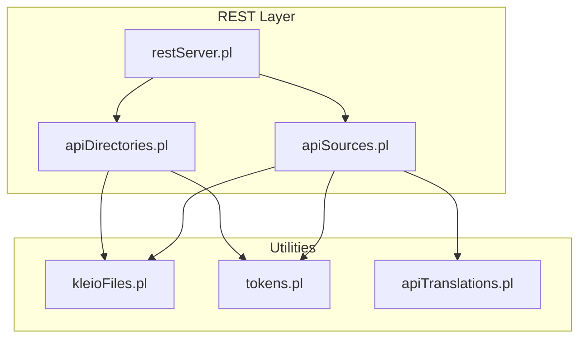
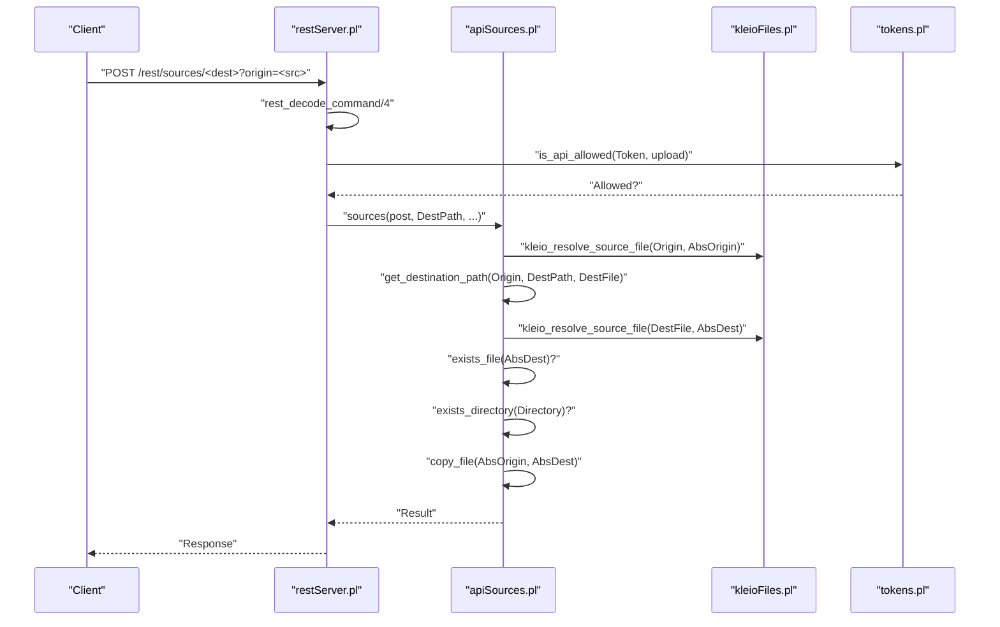
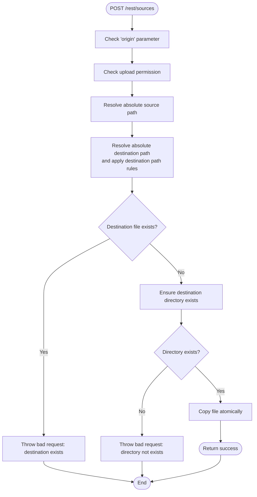
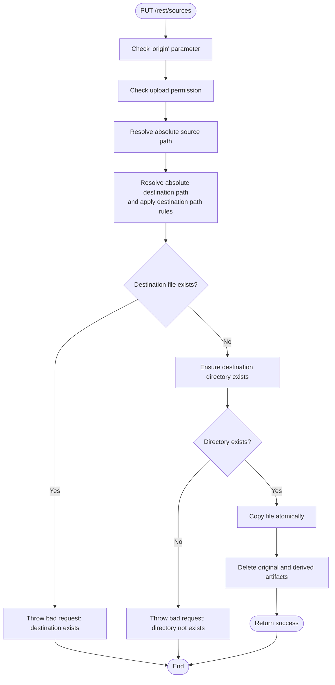
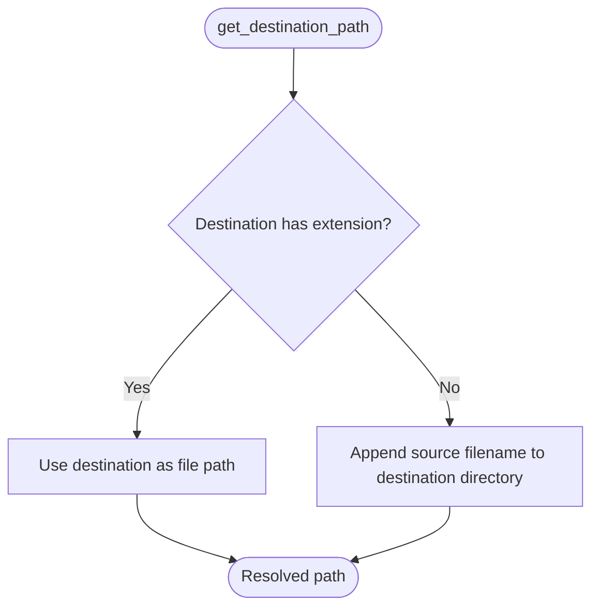
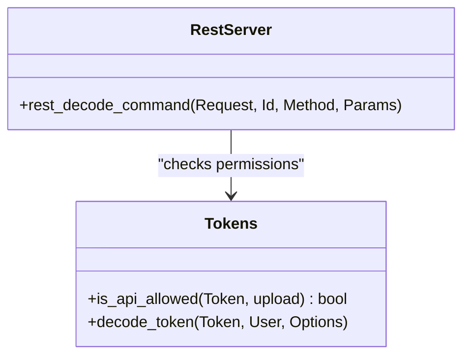
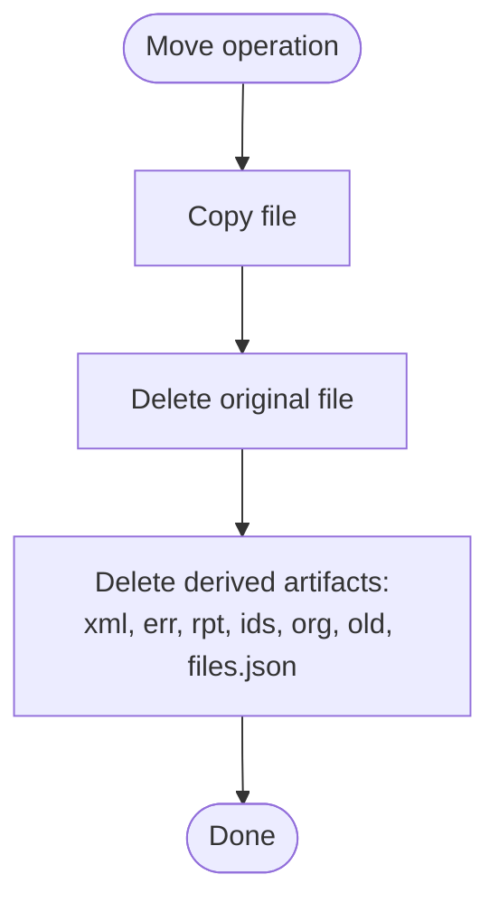
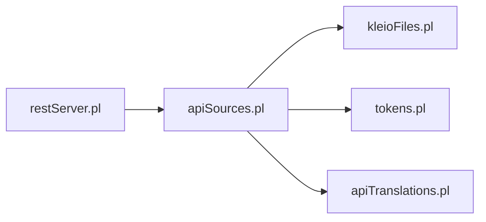

# File Management Operations

<cite>
**Referenced Files in This Document**
- [apiSources.pl](file://src/apiSources.pl)
- [restServer.pl](file://src/restServer.pl)
- [kleioFiles.pl](file://src/kleioFiles.pl)
- [tokens.pl](file://src/tokens.pl)
- [apiDirectories.pl](file://src/apiDirectories.pl)
- [apiTranslations.pl](file://src/apiTranslations.pl)
- [api-tests.postman_collection.json](file://api/postman/api-tests.postman_collection.json)
- [tests.json](file://api/postman/tests.json)
</cite>

## Table of Contents
1. [Introduction](#introduction)
2. [Project Structure](#project-structure)
3. [Core Components](#core-components)
4. [Architecture Overview](#architecture-overview)
5. [Detailed Component Analysis](#detailed-component-analysis)
6. [Dependency Analysis](#dependency-analysis)
7. [Performance Considerations](#performance-considerations)
8. [Troubleshooting Guide](#troubleshooting-guide)
9. [Conclusion](#conclusion)
10. [Appendices](#appendices)

## Introduction
This document provides comprehensive API documentation for file management operations focused on copying and moving files within the sources directory. It covers:
- POST /rest/sources with origin parameter for copying files
- PUT /rest/sources with origin parameter for moving files
- Destination path resolution logic, automatic filename handling when destination lacks extensions, and directory creation requirements
- Atomicity characteristics, rollback mechanisms for failed operations, and cleanup procedures
- Validation rules preventing overwriting existing files, cross-directory operation limitations, and permission requirements
- Examples of successful copy/move operations, error scenarios, and best practices for batch operations
- Relationship with translation artifacts and derived file management

## Project Structure
The file management APIs are implemented as part of the REST server and rely on shared utilities for file resolution, permissions, and derived artifact handling.

**Diagram sources**
- [restServer.pl](file://src/restServer.pl#L300-L307)
- [apiSources.pl](file://src/apiSources.pl#L1-L27)
- [apiDirectories.pl](file://src/apiDirectories.pl#L47-L91)
- [kleioFiles.pl](file://src/kleioFiles.pl#L1-L33)
- [tokens.pl](file://src/tokens.pl#L1-L17)
- [apiTranslations.pl](file://src/apiTranslations.pl#L124-L165)

**Section sources**
- [restServer.pl](file://src/restServer.pl#L300-L307)
- [apiSources.pl](file://src/apiSources.pl#L1-L27)
- [apiDirectories.pl](file://src/apiDirectories.pl#L47-L91)

## Core Components
- REST endpoint routing and decoding: [restServer.pl](file://src/restServer.pl#L469-L580)
- Sources API handlers for copy/move: [apiSources.pl](file://src/apiSources.pl#L144-L177)
- Destination path resolution and filename handling: [apiSources.pl](file://src/apiSources.pl#L412-L422)
- Derived artifact management utilities: [kleioFiles.pl](file://src/kleioFiles.pl#L128-L144)
- Permission enforcement: [tokens.pl](file://src/tokens.pl#L104-L147)
- Directory operations (for comparison and cross-directory semantics): [apiDirectories.pl](file://src/apiDirectories.pl#L47-L91)

Key behaviors:
- Copy: Validates source existence, resolves destination path, ensures destination directory exists, prevents overwriting, and copies the file.
- Move: Similar to copy but deletes the original file after successful copy, including derived artifacts.

**Section sources**
- [apiSources.pl](file://src/apiSources.pl#L144-L177)
- [apiSources.pl](file://src/apiSources.pl#L354-L422)
- [kleioFiles.pl](file://src/kleioFiles.pl#L128-L144)
- [tokens.pl](file://src/tokens.pl#L104-L147)
- [apiDirectories.pl](file://src/apiDirectories.pl#L47-L91)

## Architecture Overview
The copy/move operations follow a consistent flow:
1. REST request is decoded and validated for permissions.
2. Source file path is resolved against the user’s sources directory.
3. Destination path is resolved and validated (directory existence, no overwrite).
4. File copy is executed atomically at the filesystem level.
5. For move, the original file and its derived artifacts are deleted.

**Diagram sources**
- [restServer.pl](file://src/restServer.pl#L547-L580)
- [apiSources.pl](file://src/apiSources.pl#L144-L177)
- [apiSources.pl](file://src/apiSources.pl#L354-L422)
- [kleioFiles.pl](file://src/kleioFiles.pl#L753-L781)
- [tokens.pl](file://src/tokens.pl#L104-L147)

## Detailed Component Analysis

### Copy Operation (POST /rest/sources)
- Endpoint: POST /rest/sources/<dest>?origin=<src>
- Behavior:
  - Validates presence of origin parameter and upload permission.
  - Resolves absolute paths for source and destination.
  - Ensures destination directory exists and destination file does not exist.
  - Copies the file atomically at the filesystem level.
- Destination path resolution:
  - If destination has an extension, it is treated as a file path.
  - If destination lacks an extension, it is treated as a directory and the source filename is appended.
- Overwrite prevention:
  - Throws bad request if destination file already exists.
- Directory creation requirement:
  - Destination directory must exist; otherwise, returns bad request indicating missing directory.
- Atomicity and rollback:
  - Copy is atomic at the filesystem level; no rollback is implemented for failures.
- Cleanup:
  - No cleanup is performed on failure; the caller must retry or handle errors accordingly.

**Diagram sources**
- [apiSources.pl](file://src/apiSources.pl#L144-L177)
- [apiSources.pl](file://src/apiSources.pl#L354-L382)
- [apiSources.pl](file://src/apiSources.pl#L412-L422)

**Section sources**
- [apiSources.pl](file://src/apiSources.pl#L144-L177)
- [apiSources.pl](file://src/apiSources.pl#L354-L382)
- [apiSources.pl](file://src/apiSources.pl#L412-L422)

### Move Operation (PUT /rest/sources)
- Endpoint: PUT /rest/sources/<dest>?origin=<src>
- Behavior:
  - Same validations as copy.
  - On success, deletes the original file and all derived artifacts.
- Derived artifacts:
  - The deletion routine removes files with extensions: xml, err, rpt, ids, org, old, files.json.
- Atomicity and rollback:
  - Copy is atomic; deletion occurs after copy. If deletion fails, the moved file remains at the destination and the original may still exist, leading to inconsistent state. No automatic rollback is implemented.

**Diagram sources**
- [apiSources.pl](file://src/apiSources.pl#L160-L173)
- [apiSources.pl](file://src/apiSources.pl#L384-L410)
- [kleioFiles.pl](file://src/kleioFiles.pl#L128-L144)

**Section sources**
- [apiSources.pl](file://src/apiSources.pl#L160-L173)
- [apiSources.pl](file://src/apiSources.pl#L384-L410)
- [kleioFiles.pl](file://src/kleioFiles.pl#L128-L144)

### Destination Path Resolution Logic
- If destination has an extension, treat it as a file path.
- If destination lacks an extension, treat it as a directory and append the source filename to it.
- The destination path is resolved against the user’s sources directory using token information.

**Diagram sources**
- [apiSources.pl](file://src/apiSources.pl#L412-L422)

**Section sources**
- [apiSources.pl](file://src/apiSources.pl#L412-L422)

### Permission Requirements
- Copy and move require upload permission.
- The server validates the token and enforces allowed API endpoints.

**Diagram sources**
- [tokens.pl](file://src/tokens.pl#L104-L147)
- [restServer.pl](file://src/restServer.pl#L547-L580)

**Section sources**
- [tokens.pl](file://src/tokens.pl#L104-L147)
- [restServer.pl](file://src/restServer.pl#L547-L580)

### Relationship with Translation Artifacts and Derived Files
- Copy does not delete derived artifacts; it simply copies the file.
- Move deletes the original file and all derived artifacts (xml, err, rpt, ids, org, old, files.json).
- The derived artifact set is defined in the file utilities module.

**Diagram sources**
- [apiSources.pl](file://src/apiSources.pl#L384-L410)
- [kleioFiles.pl](file://src/kleioFiles.pl#L128-L144)

**Section sources**
- [apiSources.pl](file://src/apiSources.pl#L384-L410)
- [kleioFiles.pl](file://src/kleioFiles.pl#L128-L144)

## Dependency Analysis
- REST decoding and routing: [restServer.pl](file://src/restServer.pl#L547-L580)
- Sources API entry points: [apiSources.pl](file://src/apiSources.pl#L144-L177)
- File path resolution: [kleioFiles.pl](file://src/kleioFiles.pl#L753-L781)
- Permission enforcement: [tokens.pl](file://src/tokens.pl#L104-L147)
- Derived artifact deletion: [kleioFiles.pl](file://src/kleioFiles.pl#L128-L144)

**Diagram sources**
- [restServer.pl](file://src/restServer.pl#L547-L580)
- [apiSources.pl](file://src/apiSources.pl#L1-L27)
- [kleioFiles.pl](file://src/kleioFiles.pl#L1-L33)
- [tokens.pl](file://src/tokens.pl#L1-L17)
- [apiTranslations.pl](file://src/apiTranslations.pl#L124-L165)

**Section sources**
- [restServer.pl](file://src/restServer.pl#L547-L580)
- [apiSources.pl](file://src/apiSources.pl#L1-L27)
- [kleioFiles.pl](file://src/kleioFiles.pl#L1-L33)
- [tokens.pl](file://src/tokens.pl#L1-L17)
- [apiTranslations.pl](file://src/apiTranslations.pl#L124-L165)

## Performance Considerations
- Copy/move operations are bound by filesystem I/O; large files will dominate latency.
- Atomicity at the filesystem level avoids partial writes but does not prevent long-running operations.
- Batch operations can reduce connection overhead; however, the current implementation focuses on single-file operations. For batch processing, consider:
  - Using JSON-RPC batch requests to minimize round trips.
  - Ensuring adequate worker threads for concurrent operations.
  - Monitoring server activity and idle thresholds.

[No sources needed since this section provides general guidance]

## Troubleshooting Guide
Common error scenarios and their causes:
- Missing origin parameter:
  - The server throws a bad request when origin is not provided for POST/PUT copy/move.
- Forbidden access:
  - Missing or invalid token, or insufficient permissions (upload).
- Source file not found:
  - The absolute source path does not exist.
- Destination file exists:
  - Overwrite is prevented; remove the destination file first.
- Directory does not exist:
  - Destination directory must exist; create it before attempting move/copy.
- Cross-directory operation limitations:
  - The move operation deletes the original file and derived artifacts; ensure the destination is within the user’s sources directory as resolved by token options.

Validation and error handling are implemented in the API predicates and REST decoding logic.

**Section sources**
- [apiSources.pl](file://src/apiSources.pl#L175-L177)
- [apiSources.pl](file://src/apiSources.pl#L364-L410)
- [restServer.pl](file://src/restServer.pl#L547-L580)

## Conclusion
The copy and move operations provide robust file management within the sources directory with clear validation rules and deterministic destination path resolution. While copy is atomic at the filesystem level, move includes deletion of derived artifacts and lacks automatic rollback on failure. Proper permission management and directory creation are essential for reliable operations. For production use, implement idempotent workflows, handle errors gracefully, and consider batch processing for efficiency.

[No sources needed since this section summarizes without analyzing specific files]

## Appendices

### API Definitions

- POST /rest/sources/<dest>?origin=<src>
  - Purpose: Copy a file from origin to destination.
  - Validation:
    - Requires origin parameter.
    - Requires upload permission.
    - Destination directory must exist.
    - Destination file must not exist.
  - Behavior:
    - Resolves absolute paths using token information.
    - If destination lacks extension, appends source filename.
    - Copies file atomically.

- PUT /rest/sources/<dest>?origin=<src>
  - Purpose: Move a file from origin to destination.
  - Validation:
    - Same as copy.
  - Behavior:
    - Copies file atomically.
    - Deletes original file and derived artifacts.

**Section sources**
- [apiSources.pl](file://src/apiSources.pl#L144-L177)
- [apiSources.pl](file://src/apiSources.pl#L354-L410)
- [kleioFiles.pl](file://src/kleioFiles.pl#L128-L144)

### Examples and Best Practices

- Successful copy:
  - POST /rest/sources/mydir?origin=baptisms/b1686.cli
  - Destination: mydir/b1686.cli (filename appended automatically).

- Successful move:
  - PUT /rest/sources/archive?origin=baptisms/b1686.cli
  - Destination: archive/b1686.cli; original file and derived artifacts are deleted.

- Error scenarios:
  - Missing origin: Bad request.
  - Forbidden: Forbidden.
  - Destination exists: Bad request.
  - Directory not exists: Bad request.
  - Source not found: Not found.

- Best practices:
  - Ensure destination directory exists before move/copy.
  - Use JSON-RPC batch for multiple operations to reduce overhead.
  - Implement idempotency: check destination existence and handle conflicts.
  - Monitor server logs and activity for long-running operations.

**Section sources**
- [api-tests.postman_collection.json](file://api/postman/api-tests.postman_collection.json#L2242-L2285)
- [tests.json](file://api/postman/tests.json#L2242-L2285)