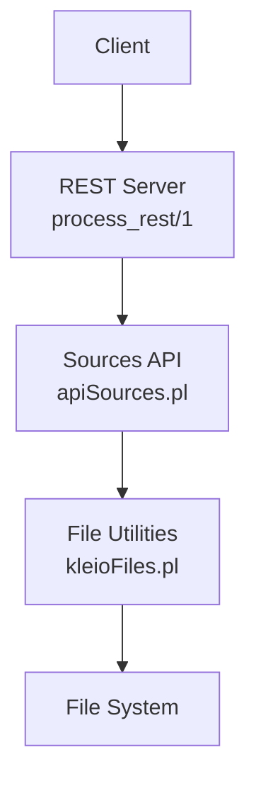
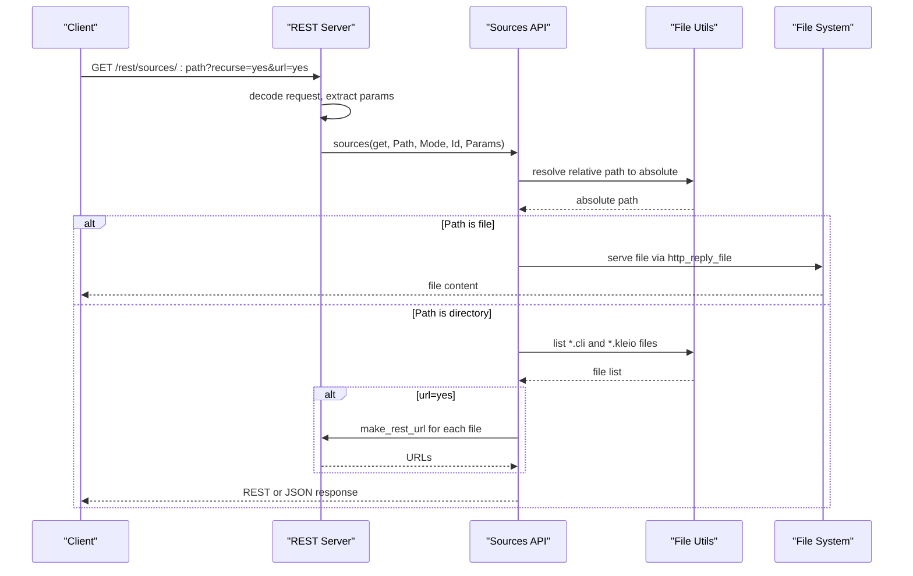
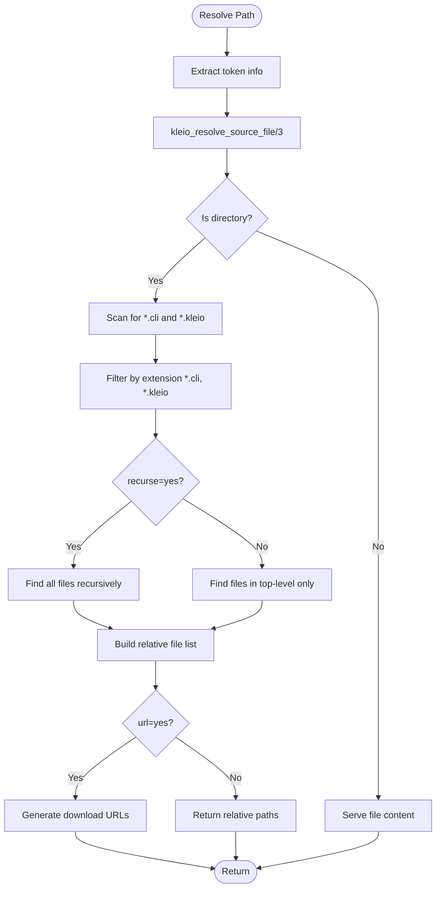
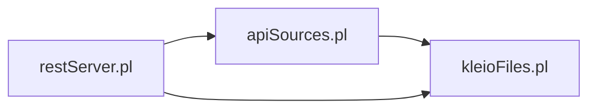

# List Sources Endpoint

<cite>
**Referenced Files in This Document**
- [src/apiSources.pl](file://src/apiSources.pl)
- [src/restServer.pl](file://src/restServer.pl)
- [src/kleioFiles.pl](file://src/kleioFiles.pl)
- [src/apiCommon.pl](file://src/apiCommon.pl)
- [api/postman/api.json](file://api/postman/api.json)
- [docs/api/index.html](file://docs/api/index.html)
</cite>

## Table of Contents
1. [Introduction](#introduction)
2. [Project Structure](#project-structure)
3. [Core Components](#core-components)
4. [Architecture Overview](#architecture-overview)
5. [Detailed Component Analysis](#detailed-component-analysis)
6. [Dependency Analysis](#dependency-analysis)
7. [Performance Considerations](#performance-considerations)
8. [Troubleshooting Guide](#troubleshooting-guide)
9. [Conclusion](#conclusion)

## Introduction
This document provides comprehensive API documentation for the GET /sources endpoint used to list source files and directories. It explains query parameters, response modes, path resolution, filtering, recursion, and error handling. It also includes practical examples and troubleshooting guidance.

## Project Structure
The GET /sources endpoint is implemented within the REST server and integrates with the sources API module and file utilities.

**Diagram sources**
- [src/restServer.pl](file://src/restServer.pl#L469-L546)
- [src/apiSources.pl](file://src/apiSources.pl#L89-L104)
- [src/kleioFiles.pl](file://src/kleioFiles.pl#L753-L800)

**Section sources**
- [src/restServer.pl](file://src/restServer.pl#L469-L546)
- [src/apiSources.pl](file://src/apiSources.pl#L89-L104)
- [src/kleioFiles.pl](file://src/kleioFiles.pl#L753-L800)

## Core Components
- REST handler: routes requests to the sources API based on Accept header or json parameter.
- Sources API: resolves paths, lists files, and returns either raw file content or structured results.
- File utilities: resolve relative paths to absolute paths, filter by extension, and compute URLs.

Key behaviors:
- Path resolution uses token context to determine the user’s sources directory.
- File filtering supports only *.cli and *.kleio files.
- Two response modes:
  - REST mode: returns either raw file content (when path is a file) or plain-text listings (when path is a directory).
  - JSON mode: returns structured data with metadata and optionally download URLs.

**Section sources**
- [src/apiSources.pl](file://src/apiSources.pl#L28-L54)
- [src/apiSources.pl](file://src/apiSources.pl#L257-L285)
- [src/restServer.pl](file://src/restServer.pl#L525-L542)

## Architecture Overview
The GET /sources request follows this flow:

**Diagram sources**
- [src/restServer.pl](file://src/restServer.pl#L469-L546)
- [src/apiSources.pl](file://src/apiSources.pl#L212-L232)
- [src/apiSources.pl](file://src/apiSources.pl#L257-L285)
- [src/kleioFiles.pl](file://src/kleioFiles.pl#L753-L800)

## Detailed Component Analysis

### Endpoint Definition
- Path: /rest/sources/:path
- Method: GET
- Purpose: Retrieve a source file (if path points to a file) or list source files in a directory (only *.cli and *.kleio).

Response modes:
- REST mode: Plain text output for files and directory listings.
- JSON mode: Structured JSON response with metadata and optional URLs.

**Section sources**
- [src/apiCommon.pl](file://src/apiCommon.pl#L48-L54)
- [src/apiSources.pl](file://src/apiSources.pl#L28-L54)

### Query Parameters
- path (required): Target directory or file path relative to the user’s sources directory.
- recurse (optional): yes/no. When yes, recursively traverse subdirectories; default is no.
- url (optional): yes/no. When yes, return download URLs instead of file names; default is no.

Notes:
- The Accept header or json parameter determines the response mode.
- The path is resolved against the user’s sources directory derived from the token.

**Section sources**
- [src/restServer.pl](file://src/restServer.pl#L525-L542)
- [src/apiSources.pl](file://src/apiSources.pl#L266-L278)
- [src/apiSources.pl](file://src/apiSources.pl#L281-L284)

### Path Resolution Mechanism
- The token contains user-specific options including the sources directory base.
- Relative paths are resolved to absolute paths using the user’s sources directory.
- Directory listings are resolved to absolute paths before scanning.

**Diagram sources**
- [src/kleioFiles.pl](file://src/kleioFiles.pl#L753-L800)
- [src/apiSources.pl](file://src/apiSources.pl#L262-L284)

**Section sources**
- [src/kleioFiles.pl](file://src/kleioFiles.pl#L753-L800)
- [src/apiSources.pl](file://src/apiSources.pl#L262-L284)

### Directory Traversal Patterns and Filtering
- Top-level scan: Uses shell find commands to locate *.cli and *.kleio files.
- Recursive scan: Aggregates results from both extensions and merges them.
- Sorting: Results are sorted to ensure deterministic output.
- Relative path exposure: Paths are returned relative to the user’s sources directory to avoid leaking absolute paths.

**Section sources**
- [src/apiSources.pl](file://src/apiSources.pl#L266-L284)
- [src/kleioFiles.pl](file://src/kleioFiles.pl#L212-L250)

### Response Modes

#### REST Mode
- File content: When path points to a single file, the server serves the file content directly.
- Directory listing: Returns a plain-text list of relative paths to *.cli and *.kleio files.

#### JSON Mode
- Directory listing: Returns structured data (typically a list of relative paths or URLs).
- File content: Returns a single URL to download the file.

**Section sources**
- [src/apiSources.pl](file://src/apiSources.pl#L212-L245)
- [src/restServer.pl](file://src/restServer.pl#L826-L886)

### URL Generation for Downloads
- When url=yes is specified, the server constructs REST URLs for each file using the current host and the sources endpoint.
- The URLs are relative to the server and designed for direct retrieval.

**Section sources**
- [src/apiSources.pl](file://src/apiSources.pl#L281-L284)
- [src/restServer.pl](file://src/restServer.pl#L449-L457)

### Examples

- Listing root directory contents:
  - Request: GET /rest/sources/?recurse=no&url=no
  - Behavior: Returns relative paths to *.cli and *.kleio files in the root of the user’s sources directory.

- Recursive directory search:
  - Request: GET /rest/sources/some/dir?recurse=yes&url=no
  - Behavior: Returns relative paths to all *.cli and *.kleio files under the specified directory and subdirectories.

- URL generation for file downloads:
  - Request: GET /rest/sources/some/dir?recurse=no&url=yes
  - Behavior: Returns a list of URLs pointing to downloadable files under the sources endpoint.

These examples align with the documented behavior and Postman collection.

**Section sources**
- [api/postman/api.json](file://api/postman/api.json#L1962-L1986)
- [docs/api/index.html](file://docs/api/index.html#L914-L917)

## Dependency Analysis
The GET /sources endpoint depends on:
- REST decoding and routing to select REST vs JSON mode.
- Sources API to resolve paths and list files.
- File utilities for path resolution and extension filtering.
- URL generation for REST endpoints.

**Diagram sources**
- [src/restServer.pl](file://src/restServer.pl#L547-L579)
- [src/apiSources.pl](file://src/apiSources.pl#L89-L104)
- [src/kleioFiles.pl](file://src/kleioFiles.pl#L753-L800)

**Section sources**
- [src/restServer.pl](file://src/restServer.pl#L547-L579)
- [src/apiSources.pl](file://src/apiSources.pl#L89-L104)
- [src/kleioFiles.pl](file://src/kleioFiles.pl#L753-L800)

## Performance Considerations
- Directory scans use shell find commands; recursive scans can be expensive on large trees.
- Sorting results adds overhead proportional to the number of files found.
- Prefer non-recursive listing for large directories unless necessary.

## Troubleshooting Guide

Common errors and resolutions:
- Invalid path or file not found:
  - Symptom: 404 Not Found.
  - Cause: Path does not resolve to an existing file or directory.
  - Resolution: Verify the path relative to the user’s sources directory and ensure the file exists.

- Permission denied:
  - Symptom: 403 Forbidden.
  - Cause: Missing or invalid token, or insufficient permissions for the requested operation.
  - Resolution: Ensure a valid token is included and that the token grants files access.

- Bad request:
  - Symptom: 400 Bad Request.
  - Cause: Missing token, malformed request, or invalid parameters.
  - Resolution: Confirm token presence and correct parameter values.

- Internal server error:
  - Symptom: 500 Internal Server Error.
  - Cause: Unexpected system error during processing.
  - Resolution: Check server logs and retry; contact support if the issue persists.

**Section sources**
- [src/apiSources.pl](file://src/apiSources.pl#L95-L99)
- [src/apiSources.pl](file://src/apiSources.pl#L106-L107)
- [src/restServer.pl](file://src/restServer.pl#L1467-L1572)

## Conclusion
The GET /sources endpoint provides flexible access to source files with two response modes and robust path resolution using token context. By leveraging recurse and url parameters, clients can efficiently discover and retrieve files while maintaining secure path exposure. Proper error handling ensures predictable outcomes for invalid paths, permissions, and missing files.