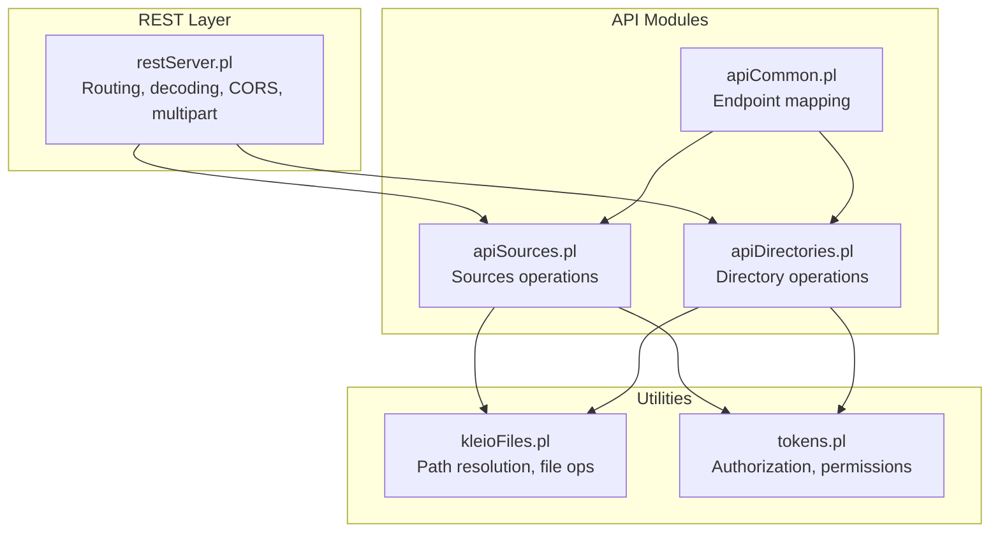
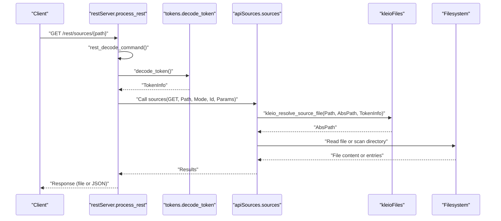
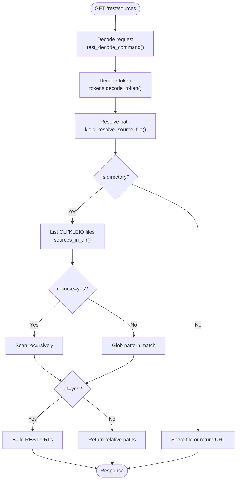
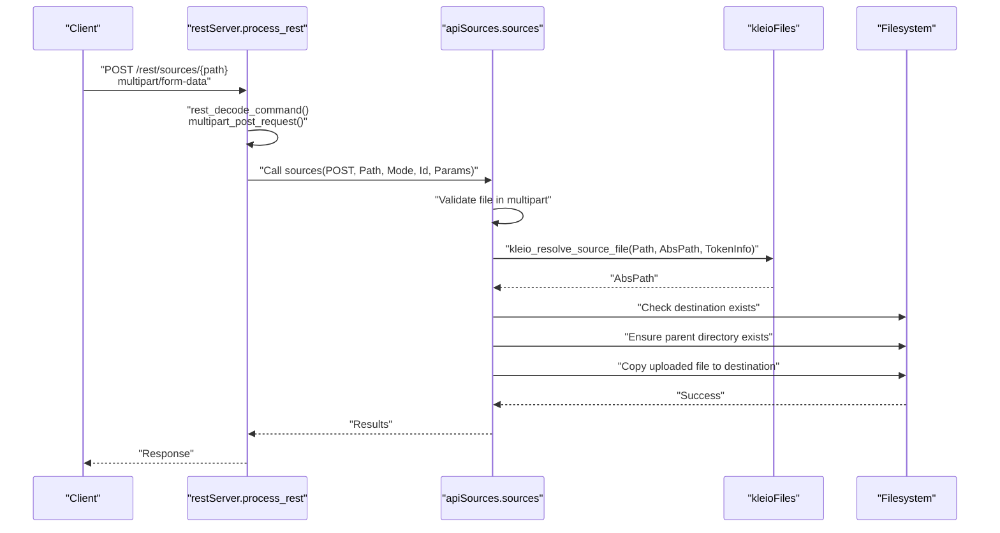
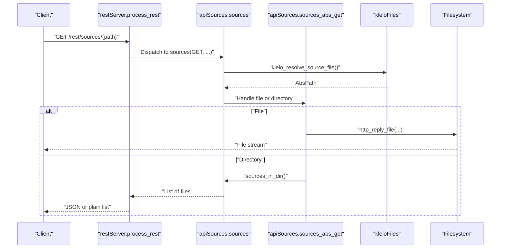
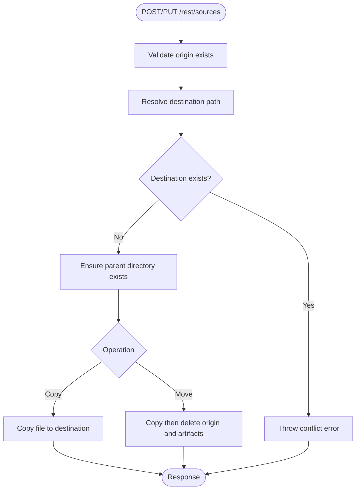
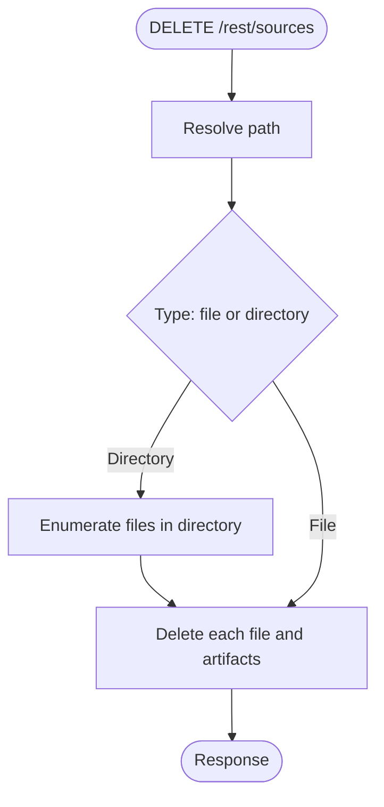
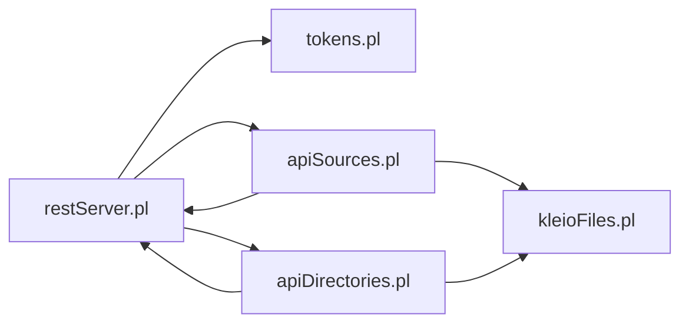

# Sources Management API

<cite>
**Referenced Files in This Document**
- [apiSources.pl](file://src/apiSources.pl)
- [restServer.pl](file://src/restServer.pl)
- [kleioFiles.pl](file://src/kleioFiles.pl)
- [apiCommon.pl](file://src/apiCommon.pl)
- [tokens.pl](file://src/tokens.pl)
- [apiDirectories.pl](file://src/apiDirectories.pl)
- [restServer-errors-test.pl](file://src/restServer.pl)
</cite>

## Table of Contents
1. [Introduction](#introduction)
2. [Project Structure](#project-structure)
3. [Core Components](#core-components)
4. [Architecture Overview](#architecture-overview)
5. [Detailed Component Analysis](#detailed-component-analysis)
6. [Dependency Analysis](#dependency-analysis)
7. [Performance Considerations](#performance-considerations)
8. [Troubleshooting Guide](#troubleshooting-guide)
9. [Conclusion](#conclusion)

## Introduction
This document describes the Sources Management API that enables listing, retrieving, uploading, downloading, copying, moving, and deleting source files and directories. It covers:
- GET /sources for listing source files with filtering and recursion
- POST /sources for file uploads via multipart form data
- GET /sources for retrieving files and directory listings
- Authentication, authorization, path resolution, and security controls
- Error handling patterns and response formats

## Project Structure
The Sources Management API is implemented as part of the REST/JSON-RPC server. Key modules involved:
- REST routing and dispatch: [restServer.pl](file://src/restServer.pl)
- Sources operations: [apiSources.pl](file://src/apiSources.pl)
- Path resolution and file utilities: [kleioFiles.pl](file://src/kleioFiles.pl)
- Token-based authorization: [tokens.pl](file://src/tokens.pl)
- API documentation and endpoint mapping: [apiCommon.pl](file://src/apiCommon.pl)
- Directory operations (complementary): [apiDirectories.pl](file://src/apiDirectories.pl)

**Diagram sources**
- [restServer.pl](file://src/restServer.pl#L469-L516)
- [apiSources.pl](file://src/apiSources.pl#L88-L177)
- [kleioFiles.pl](file://src/kleioFiles.pl#L753-L800)
- [tokens.pl](file://src/tokens.pl#L1-L200)
- [apiCommon.pl](file://src/apiCommon.pl#L28-L77)

**Section sources**
- [restServer.pl](file://src/restServer.pl#L469-L516)
- [apiSources.pl](file://src/apiSources.pl#L88-L177)
- [kleioFiles.pl](file://src/kleioFiles.pl#L753-L800)
- [tokens.pl](file://src/tokens.pl#L1-L200)
- [apiCommon.pl](file://src/apiCommon.pl#L28-L77)

## Core Components
- REST dispatcher: routes requests to entity handlers, supports multipart uploads, JSON-RPC, and CORS.
- Sources handler: implements GET/POST/PUT/DELETE for sources, with path resolution and security checks.
- Directory handler: complementary operations for directories (listing, creation, deletion, copying).
- Token service: validates tokens and enforces permissions (files, upload, delete, mkdir, rmdir).
- Path resolver: resolves relative paths to absolute locations under user-specific sources directories.

Key responsibilities:
- Authentication and authorization via bearer tokens
- Path resolution to user sources directories
- Recursive directory listing and URL generation for REST downloads
- Safe file operations (upload, copy, move, delete) with validation and error propagation

**Section sources**
- [restServer.pl](file://src/restServer.pl#L547-L580)
- [apiSources.pl](file://src/apiSources.pl#L88-L177)
- [kleioFiles.pl](file://src/kleioFiles.pl#L753-L800)
- [tokens.pl](file://src/tokens.pl#L1-L200)
- [apiDirectories.pl](file://src/apiDirectories.pl#L18-L71)

## Architecture Overview
The Sources Management API follows a layered architecture:
- HTTP layer: routing and request decoding
- Authorization layer: token validation and permission checks
- Domain layer: sources/directories operations
- Infrastructure layer: path resolution and filesystem operations

**Diagram sources**
- [restServer.pl](file://src/restServer.pl#L547-L580)
- [apiSources.pl](file://src/apiSources.pl#L88-L104)
- [kleioFiles.pl](file://src/kleioFiles.pl#L753-L781)
- [tokens.pl](file://src/tokens.pl#L141-L147)

## Detailed Component Analysis

### Endpoint: GET /sources
- Purpose: Retrieve a source file or list files in a directory.
- Behavior:
  - If path is a file: returns the file content or a download URL depending on mode and Accept header.
  - If path is a directory: lists CLI/KLEIO files, optionally recursively and with URLs for REST downloads.
- Parameters:
  - path: target file or directory (relative to user sources directory)
  - recurse: "yes" to traverse subdirectories
  - url: "yes" to return REST URLs instead of raw paths
  - json: "yes"/"true" to force JSON output
- Authentication: requires token with "files" permission.
- Security: path resolution ensures access only within user sources directory.

**Diagram sources**
- [restServer.pl](file://src/restServer.pl#L547-L580)
- [apiSources.pl](file://src/apiSources.pl#L257-L285)
- [kleioFiles.pl](file://src/kleioFiles.pl#L753-L800)

**Section sources**
- [apiSources.pl](file://src/apiSources.pl#L28-L104)
- [apiSources.pl](file://src/apiSources.pl#L257-L285)
- [kleioFiles.pl](file://src/kleioFiles.pl#L753-L800)
- [restServer.pl](file://src/restServer.pl#L547-L580)
- [apiCommon.pl](file://src/apiCommon.pl#L48-L49)

### Endpoint: POST /sources
- Purpose: Upload a new source file (multipart/form-data).
- Behavior:
  - Validates presence of uploaded file in multipart body.
  - Ensures destination does not already exist.
  - Creates parent directories if missing.
  - Saves uploaded file to resolved absolute path.
- Parameters:
  - path: destination path (relative to user sources directory)
  - multipart/form-data: file field with the source file
- Authentication: requires token with "upload" permission.
- Notes: Not available in JSON-RPC.

**Diagram sources**
- [restServer.pl](file://src/restServer.pl#L567-L578)
- [apiSources.pl](file://src/apiSources.pl#L125-L142)
- [kleioFiles.pl](file://src/kleioFiles.pl#L753-L781)

**Section sources**
- [apiSources.pl](file://src/apiSources.pl#L69-L78)
- [apiSources.pl](file://src/apiSources.pl#L125-L142)
- [restServer.pl](file://src/restServer.pl#L567-L578)
- [apiCommon.pl](file://src/apiCommon.pl#L49-L50)

### Endpoint: GET /sources/{path}
- Purpose: Retrieve a specific source file or directory listing.
- Behavior:
  - File: returns file content or a REST URL for download depending on mode.
  - Directory: returns list of CLI/KLEIO files, optionally with URLs.
- Parameters:
  - path: target file or directory
  - recurse: "yes" for recursive listing
  - url: "yes" to return REST URLs
  - json: "yes"/"true" to force JSON output
- Authentication: requires token with "files" permission.

**Diagram sources**
- [apiSources.pl](file://src/apiSources.pl#L88-L104)
- [apiSources.pl](file://src/apiSources.pl#L212-L232)
- [apiSources.pl](file://src/apiSources.pl#L257-L285)

**Section sources**
- [apiSources.pl](file://src/apiSources.pl#L28-L104)
- [apiSources.pl](file://src/apiSources.pl#L212-L232)
- [apiSources.pl](file://src/apiSources.pl#L257-L285)

### Endpoint: POST /sources (Copy) and PUT /sources (Move)
- Purpose: Copy or move an existing source file to a new location.
- Behavior:
  - Validates existence of origin file.
  - Ensures destination does not exist.
  - Creates parent directories if needed.
  - Copy: preserves origin, writes to destination.
  - Move: copies then deletes origin and related translation artifacts.
- Parameters:
  - origin: source path (relative to user sources directory)
  - path: destination path (relative to user sources directory)
- Authentication: requires token with "upload" permission.
- Notes: Not available in JSON-RPC.

**Diagram sources**
- [apiSources.pl](file://src/apiSources.pl#L354-L411)

**Section sources**
- [apiSources.pl](file://src/apiSources.pl#L80-L86)
- [apiSources.pl](file://src/apiSources.pl#L144-L173)
- [apiSources.pl](file://src/apiSources.pl#L354-L411)

### Endpoint: DELETE /sources
- Purpose: Delete a source file or directory.
- Behavior:
  - Validates file or directory existence.
  - For directories, enumerates and deletes all contained source files and translation artifacts.
  - Respects processing queues and avoids deleting files actively processed.
- Parameters:
  - path: target file or directory
  - recurse: "yes" to delete recursively
- Authentication: requires token with "delete" permission.

**Diagram sources**
- [apiSources.pl](file://src/apiSources.pl#L287-L321)

**Section sources**
- [apiSources.pl](file://src/apiSources.pl#L57-L67)
- [apiSources.pl](file://src/apiSources.pl#L109-L123)
- [apiSources.pl](file://src/apiSources.pl#L287-L321)

## Dependency Analysis
- REST server depends on:
  - tokens for authorization
  - kleioFiles for path resolution and file operations
  - http multipart plugin for uploads
- Sources handler depends on:
  - kleioFiles for path resolution and deletion/copy/move semantics
  - tokens for permission checks
- Directory handler complements sources with directory operations.

**Diagram sources**
- [restServer.pl](file://src/restServer.pl#L1-L162)
- [apiSources.pl](file://src/apiSources.pl#L1-L27)
- [apiDirectories.pl](file://src/apiDirectories.pl#L1-L16)
- [kleioFiles.pl](file://src/kleioFiles.pl#L1-L33)
- [tokens.pl](file://src/tokens.pl#L1-L200)

**Section sources**
- [restServer.pl](file://src/restServer.pl#L1-L162)
- [apiSources.pl](file://src/apiSources.pl#L1-L27)
- [apiDirectories.pl](file://src/apiDirectories.pl#L1-L16)
- [kleioFiles.pl](file://src/kleioFiles.pl#L1-L33)
- [tokens.pl](file://src/tokens.pl#L1-L200)

## Performance Considerations
- Directory listing:
  - Non-recursive listing uses glob expansion for efficiency.
  - Recursive listing scans subdirectories; use judiciously on large trees.
- File serving:
  - Serving files directly via HTTP exceptions avoids loading entire content into memory.
- Upload handling:
  - Multipart uploads store temporary files; ensure adequate disk space and permissions.
- Token validation:
  - Decode token once per request; cache results where appropriate.

[No sources needed since this section provides general guidance]

## Troubleshooting Guide
Common errors and resolutions:
- Forbidden (insufficient privileges):
  - Cause: missing or invalid token, or token lacks required permissions.
  - Resolution: obtain a token with appropriate permissions ("files", "upload", "delete").
- Bad request (destination file exists):
  - Cause: attempting to POST/PUT upload to an existing file or destination already exists.
  - Resolution: choose a different destination or delete the existing file.
- Resource not found:
  - Cause: path does not exist or is outside user sources directory.
  - Resolution: verify path and ensure it is relative to user sources directory.
- Directory does not exist:
  - Cause: parent directory for upload or destination does not exist.
  - Resolution: create parent directories first or adjust destination path.

Error mapping and codes:
- Forbidden: -32006
- Conflict (destination exists): -32007
- Not found: -32008
- Bad request (directory not exists): -32009
- Parse error: -32700

**Section sources**
- [restServer-errors-test.pl](file://src/restServer.pl#L1503-L1538)
- [apiSources.pl](file://src/apiSources.pl#L341-L348)
- [apiSources.pl](file://src/apiSources.pl#L375-L382)
- [apiSources.pl](file://src/apiSources.pl#L402-L404)

## Conclusion
The Sources Management API provides secure, flexible operations for managing source files and directories. It enforces strict path resolution and authorization, supports efficient directory listing and recursive scanning, and offers robust upload, copy, move, and delete workflows. Proper use of tokens and adherence to path resolution rules ensures safe and predictable behavior.