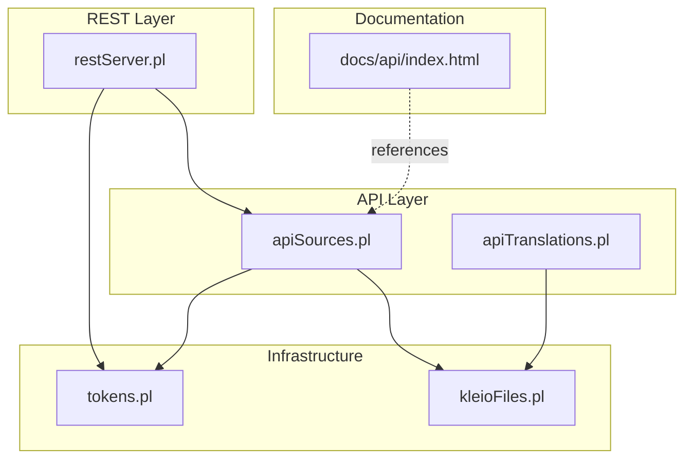
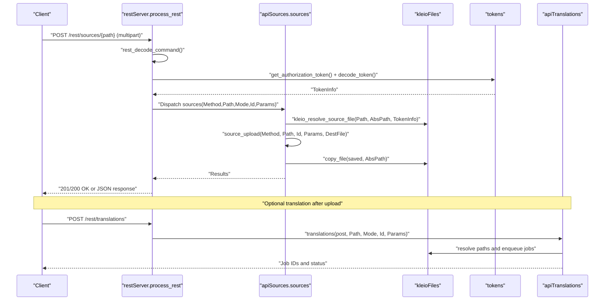
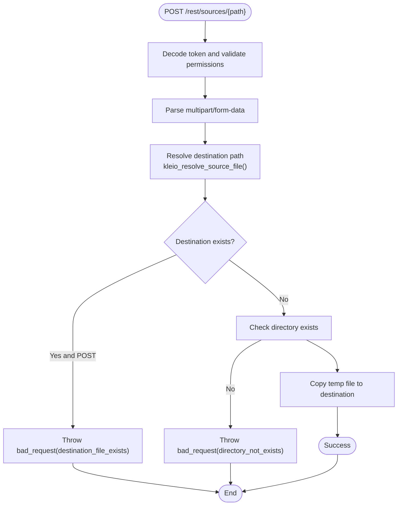
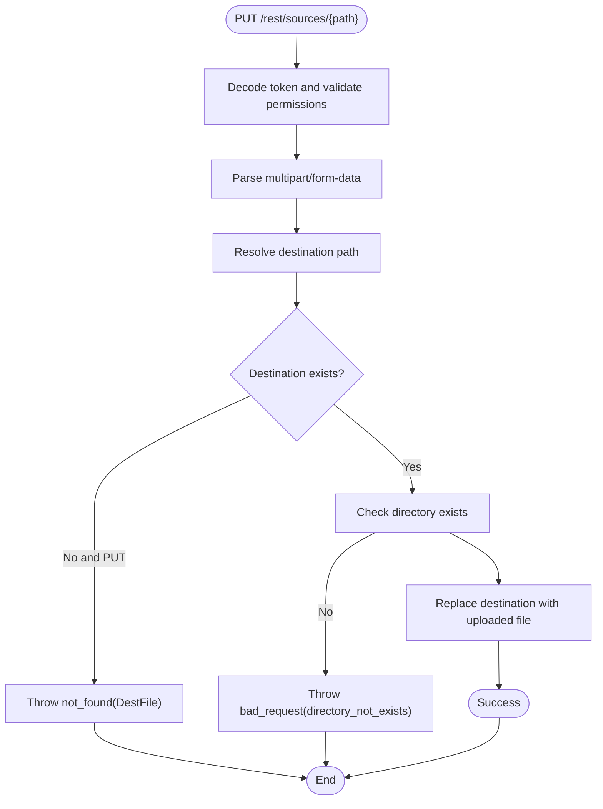
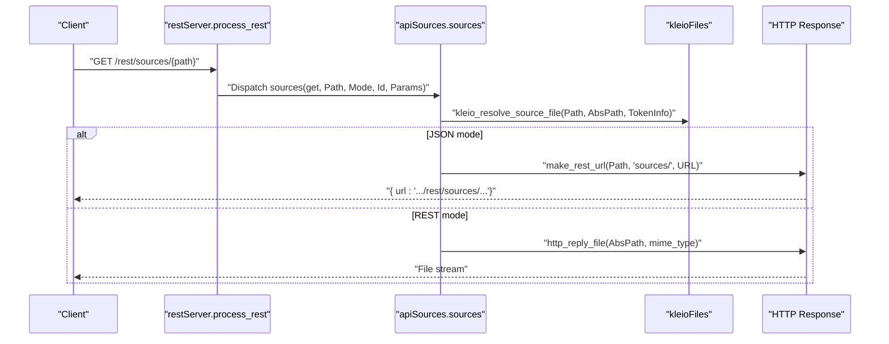
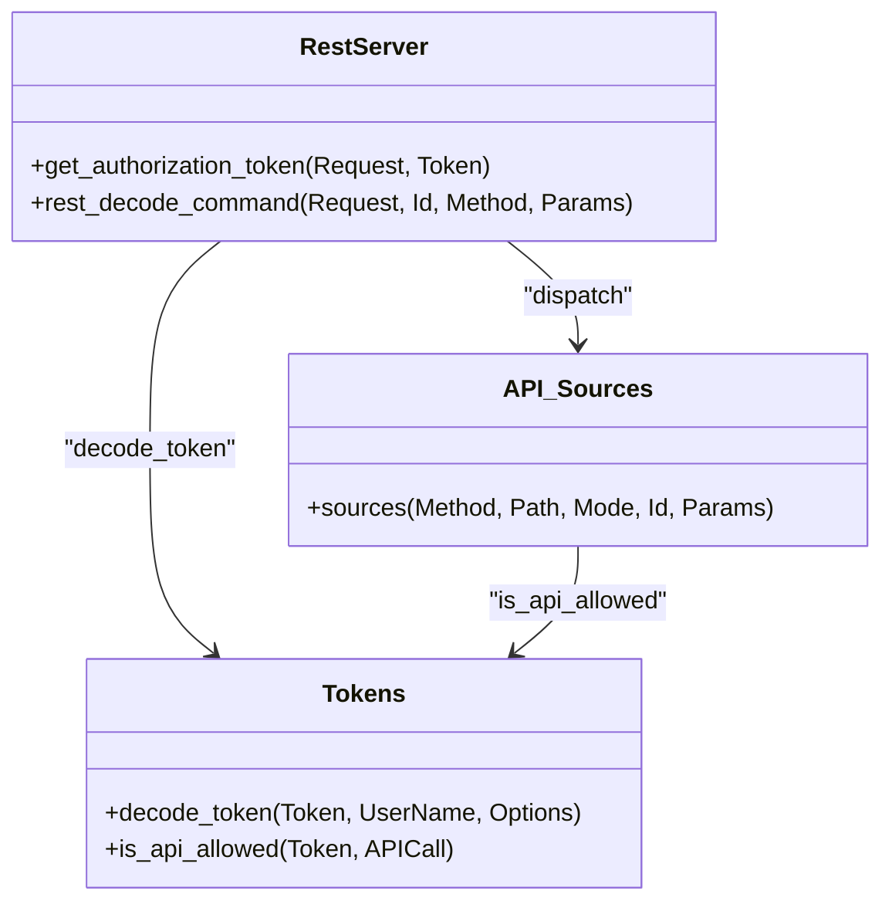
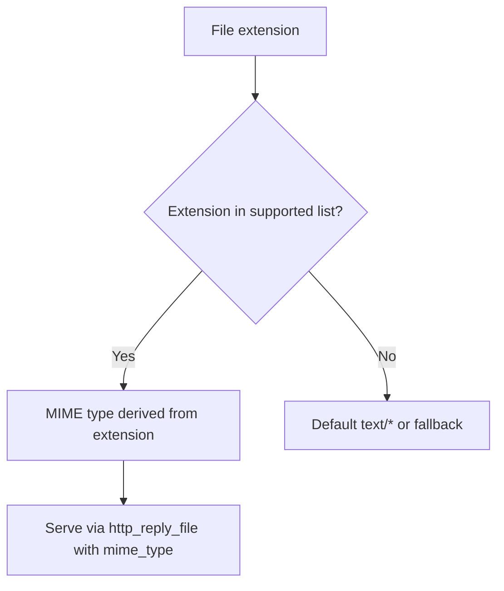
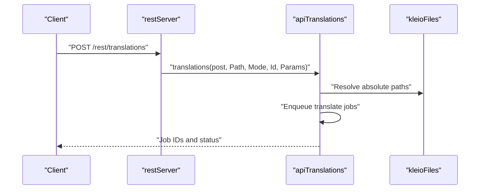
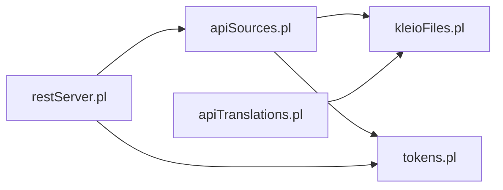

# Upload and Download Operations

<cite>
**Referenced Files in This Document**
- [apiSources.pl](file://src/apiSources.pl)
- [restServer.pl](file://src/restServer.pl)
- [kleioFiles.pl](file://src/kleioFiles.pl)
- [tokens.pl](file://src/tokens.pl)
- [apiTranslations.pl](file://src/apiTranslations.pl)
- [index.html](file://docs/api/index.html)
</cite>

## Table of Contents
1. [Introduction](#introduction)
2. [Project Structure](#project-structure)
3. [Core Components](#core-components)
4. [Architecture Overview](#architecture-overview)
5. [Detailed Component Analysis](#detailed-component-analysis)
6. [Dependency Analysis](#dependency-analysis)
7. [Performance Considerations](#performance-considerations)
8. [Troubleshooting Guide](#troubleshooting-guide)
9. [Conclusion](#conclusion)

## Introduction
This document describes the file upload and download operations for the sources management system. It covers:
- POST /sources for multipart file uploads with validation rules preventing overwriting existing files
- PUT /sources for file updates replacing existing files
- The upload workflow including multipart form data handling, temporary file storage, and final destination resolution
- Download mechanisms for both direct file serving (REST mode) and URL generation (JSON mode)
- Authentication requirements, file size limits, supported file types, and security considerations
- Examples of successful upload scenarios, error conditions for invalid uploads, and proper cleanup procedures
- The relationship between upload operations and subsequent translation processing

## Project Structure
The upload and download functionality spans several modules:
- REST routing and multipart handling: [restServer.pl](file://src/restServer.pl)
- Sources API endpoints: [apiSources.pl](file://src/apiSources.pl)
- File system utilities and MIME types: [kleioFiles.pl](file://src/kleioFiles.pl)
- Authentication and permissions: [tokens.pl](file://src/tokens.pl)
- Translation orchestration: [apiTranslations.pl](file://src/apiTranslations.pl)
- API documentation: [index.html](file://docs/api/index.html)

**Diagram sources**
- [restServer.pl](file://src/restServer.pl#L300-L309)
- [apiSources.pl](file://src/apiSources.pl#L1-L40)
- [kleioFiles.pl](file://src/kleioFiles.pl#L1-L50)
- [tokens.pl](file://src/tokens.pl#L1-L50)
- [apiTranslations.pl](file://src/apiTranslations.pl#L1-L35)
- [index.html](file://docs/api/index.html#L790-L810)

**Section sources**
- [restServer.pl](file://src/restServer.pl#L300-L309)
- [apiSources.pl](file://src/apiSources.pl#L1-L40)
- [kleioFiles.pl](file://src/kleioFiles.pl#L1-L50)
- [tokens.pl](file://src/tokens.pl#L1-L50)
- [apiTranslations.pl](file://src/apiTranslations.pl#L1-L35)
- [index.html](file://docs/api/index.html#L790-L810)

## Core Components
- REST endpoint dispatcher and multipart handling: [restServer.pl](file://src/restServer.pl)
- Sources API handlers for GET/POST/PUT/DELETE and file operations: [apiSources.pl](file://src/apiSources.pl)
- File system resolution and MIME type mapping: [kleioFiles.pl](file://src/kleioFiles.pl)
- Authentication and authorization tokens: [tokens.pl](file://src/tokens.pl)
- Translation orchestration and status reporting: [apiTranslations.pl](file://src/apiTranslations.pl)

Key responsibilities:
- Validate authentication and permissions
- Parse multipart/form-data uploads
- Resolve destination paths within user sources directory
- Enforce overwrite prevention rules
- Serve files directly or return URLs depending on mode
- Trigger translation jobs after uploads

**Section sources**
- [restServer.pl](file://src/restServer.pl#L547-L599)
- [apiSources.pl](file://src/apiSources.pl#L28-L178)
- [kleioFiles.pl](file://src/kleioFiles.pl#L753-L800)
- [tokens.pl](file://src/tokens.pl#L249-L258)
- [apiTranslations.pl](file://src/apiTranslations.pl#L34-L83)

## Architecture Overview
The upload/download pipeline integrates REST routing, authentication, file handling, and optional translation processing.

**Diagram sources**
- [restServer.pl](file://src/restServer.pl#L491-L516)
- [restServer.pl](file://src/restServer.pl#L547-L599)
- [apiSources.pl](file://src/apiSources.pl#L125-L142)
- [apiSources.pl](file://src/apiSources.pl#L324-L353)
- [kleioFiles.pl](file://src/kleioFiles.pl#L753-L782)
- [apiTranslations.pl](file://src/apiTranslations.pl#L52-L82)

## Detailed Component Analysis

### Upload Workflow (POST /sources)
- Endpoint: POST /rest/sources/{path}
- Content-Type: multipart/form-data
- Required headers:
  - Authorization: Bearer {token}
  - Accept: application/json (optional for JSON mode)
- Request body:
  - file: binary stream (uploaded file)
  - id: optional request identifier
- Validation rules:
  - Destination must not exist when Method=post
  - Directory must exist
  - Token must have upload permission
- Behavior:
  - Temporary file saved via http_read_data with save_file callback
  - Destination path resolved using user sources directory from token
  - Overwrite prevented for POST
  - File copied to final destination

**Diagram sources**
- [restServer.pl](file://src/restServer.pl#L563-L578)
- [restServer.pl](file://src/restServer.pl#L908-L915)
- [apiSources.pl](file://src/apiSources.pl#L125-L142)
- [apiSources.pl](file://src/apiSources.pl#L324-L353)
- [kleioFiles.pl](file://src/kleioFiles.pl#L753-L782)

**Section sources**
- [restServer.pl](file://src/restServer.pl#L563-L578)
- [restServer.pl](file://src/restServer.pl#L908-L915)
- [apiSources.pl](file://src/apiSources.pl#L125-L142)
- [apiSources.pl](file://src/apiSources.pl#L324-L353)
- [kleioFiles.pl](file://src/kleioFiles.pl#L753-L782)

### Update Workflow (PUT /sources)
- Endpoint: PUT /rest/sources/{path}
- Content-Type: multipart/form-data
- Validation rules:
  - Destination must exist when Method=put
  - Directory must exist
  - Token must have upload permission
- Behavior:
  - Overwrite allowed for PUT
  - Destination replaced with uploaded file

**Diagram sources**
- [apiSources.pl](file://src/apiSources.pl#L160-L173)
- [apiSources.pl](file://src/apiSources.pl#L341-L348)
- [kleioFiles.pl](file://src/kleioFiles.pl#L753-L782)

**Section sources**
- [apiSources.pl](file://src/apiSources.pl#L160-L173)
- [apiSources.pl](file://src/apiSources.pl#L341-L348)
- [kleioFiles.pl](file://src/kleioFiles.pl#L753-L782)

### Download Mechanisms
- REST mode (direct file serving):
  - GET /rest/sources/{path} serves file directly when path is a file
  - Uses http_reply_file with mime type detection
- JSON mode (URL generation):
  - GET /rest/sources/{path}?json=true returns a URL to download the file
  - URL built via http_link_to_id(process_rest, ...) and make_rest_url()

**Diagram sources**
- [apiSources.pl](file://src/apiSources.pl#L89-L104)
- [apiSources.pl](file://src/apiSources.pl#L212-L225)
- [kleioFiles.pl](file://src/kleioFiles.pl#L832-L849)
- [restServer.pl](file://src/restServer.pl#L449-L457)

**Section sources**
- [apiSources.pl](file://src/apiSources.pl#L89-L104)
- [apiSources.pl](file://src/apiSources.pl#L212-L225)
- [kleioFiles.pl](file://src/kleioFiles.pl#L832-L849)
- [restServer.pl](file://src/restServer.pl#L449-L457)

### Authentication and Permissions
- Authorization: Bearer {token} in Authorization header
- Token decoding and validation performed in restServer.get_authorization_token and tokens.decode_token
- Allowed APIs per token are enforced via tokens.is_api_allowed
- Required permissions:
  - upload: for POST/PUT uploads
  - files: for GET downloads
  - delete: for DELETE operations

**Diagram sources**
- [tokens.pl](file://src/tokens.pl#L141-L151)
- [tokens.pl](file://src/tokens.pl#L249-L258)
- [restServer.pl](file://src/restServer.pl#L615-L624)
- [restServer.pl](file://src/restServer.pl#L553-L579)
- [apiSources.pl](file://src/apiSources.pl#L89-L104)

**Section sources**
- [tokens.pl](file://src/tokens.pl#L141-L151)
- [tokens.pl](file://src/tokens.pl#L249-L258)
- [restServer.pl](file://src/restServer.pl#L615-L624)
- [restServer.pl](file://src/restServer.pl#L553-L579)
- [apiSources.pl](file://src/apiSources.pl#L89-L104)

### File Types and MIME Handling
Supported file types for sources include:
- cli, org, old, rpt, err, xml, xerr, xrpt, str, json, ids, srpt
- MIME types are determined by kleioFiles.kleio_mime_type based on extension

**Diagram sources**
- [kleioFiles.pl](file://src/kleioFiles.pl#L832-L849)

**Section sources**
- [kleioFiles.pl](file://src/kleioFiles.pl#L832-L849)

### Security Considerations
- Path resolution is bound to user sources directory via token options
- Overwrite prevention for POST ensures idempotent uploads
- Directory existence validated before writing
- Token-based authorization controls access to upload, download, and delete operations

**Section sources**
- [kleioFiles.pl](file://src/kleioFiles.pl#L753-L782)
- [apiSources.pl](file://src/apiSources.pl#L324-L353)
- [tokens.pl](file://src/tokens.pl#L249-L258)

### Cleanup Procedures
- DELETE /rest/sources/{path} removes files and translation artifacts
- kleio_file_delete removes all related files (xml, err, rpt, ids, files.json, old)
- kleio_file_clean removes translation results while preserving source

**Section sources**
- [apiSources.pl](file://src/apiSources.pl#L287-L321)
- [kleioFiles.pl](file://src/kleioFiles.pl#L128-L144)

### Relationship to Translation Processing
- After upload, files become eligible for translation
- POST /rest/translations enqueues translation jobs
- Status and URLs for reports and exports are derived from uploaded files

**Diagram sources**
- [apiTranslations.pl](file://src/apiTranslations.pl#L52-L82)
- [apiTranslations.pl](file://src/apiTranslations.pl#L433-L455)

**Section sources**
- [apiTranslations.pl](file://src/apiTranslations.pl#L52-L82)
- [apiTranslations.pl](file://src/apiTranslations.pl#L433-L455)

## Dependency Analysis
- apiSources depends on:
  - restServer for multipart parsing and dispatch
  - kleioFiles for path resolution and MIME types
  - tokens for authentication and permissions
- restServer depends on:
  - tokens for authorization
  - kleioFiles for MIME mapping
- apiTranslations depends on:
  - kleioFiles for path resolution and status reporting

**Diagram sources**
- [restServer.pl](file://src/restServer.pl#L1-L50)
- [apiSources.pl](file://src/apiSources.pl#L1-L30)
- [kleioFiles.pl](file://src/kleioFiles.pl#L1-L40)
- [tokens.pl](file://src/tokens.pl#L1-L40)
- [apiTranslations.pl](file://src/apiTranslations.pl#L1-L35)

**Section sources**
- [restServer.pl](file://src/restServer.pl#L1-L50)
- [apiSources.pl](file://src/apiSources.pl#L1-L30)
- [kleioFiles.pl](file://src/kleioFiles.pl#L1-L40)
- [tokens.pl](file://src/tokens.pl#L1-L40)
- [apiTranslations.pl](file://src/apiTranslations.pl#L1-L35)

## Performance Considerations
- Multipart uploads are streamed to temporary files using http_read_data and save_file
- Directory existence checks prevent unnecessary filesystem operations
- Translation jobs are enqueued asynchronously; REST responses are immediate for uploads
- Status caching in translations_get reduces repeated filesystem scans for large sets

[No sources needed since this section provides general guidance]

## Troubleshooting Guide
Common error conditions and resolutions:
- Forbidden (insufficient privileges)
  - Cause: missing or invalid token, or token lacks upload/files/delete permissions
  - Resolution: obtain a valid token with required scopes
- Bad request (destination_file_exists)
  - Cause: attempting POST to an existing file
  - Resolution: use PUT to replace or choose a different destination
- Not found (resource not found)
  - Cause: attempting PUT to a non-existent file
  - Resolution: upload the file first or adjust destination path
- Bad request (directory_not_exists)
  - Cause: destination directory does not exist
  - Resolution: create the directory or upload to an existing one

**Section sources**
- [restServer.pl](file://src/restServer.pl#L1503-L1538)
- [apiSources.pl](file://src/apiSources.pl#L341-L348)
- [apiSources.pl](file://src/apiSources.pl#L375-L382)

## Conclusion
The sources management system provides robust upload and download capabilities with strong security and validation:
- POST prevents overwrites; PUT enables controlled replacement
- Authentication and permissions are enforced at every step
- File serving supports both direct streaming and URL generation
- Path resolution keeps operations scoped to user sources directories
- Translation processing is integrated and observable via dedicated endpoints