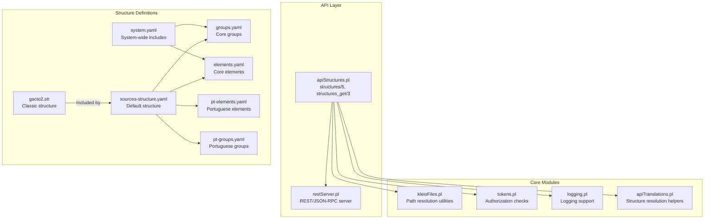
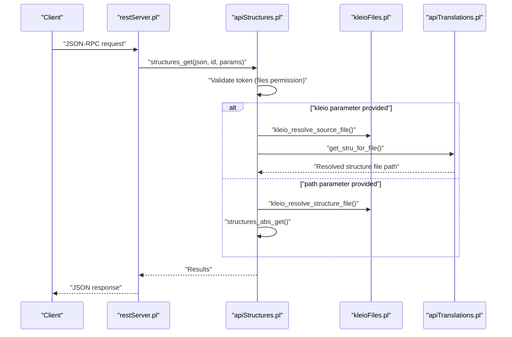
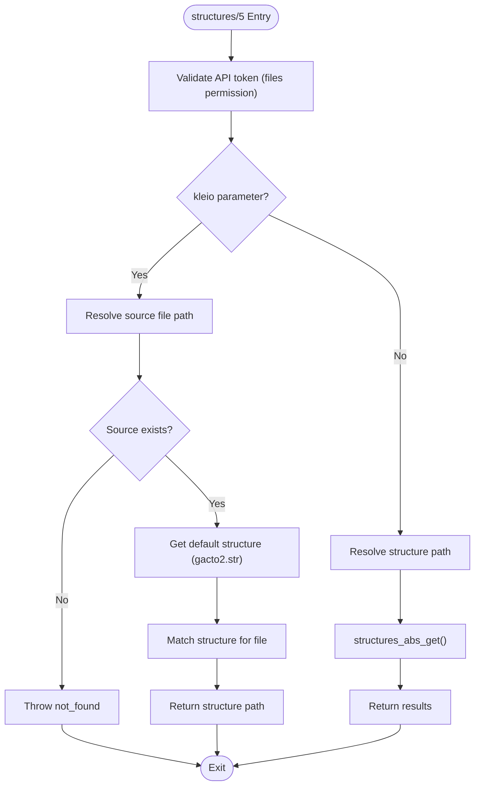
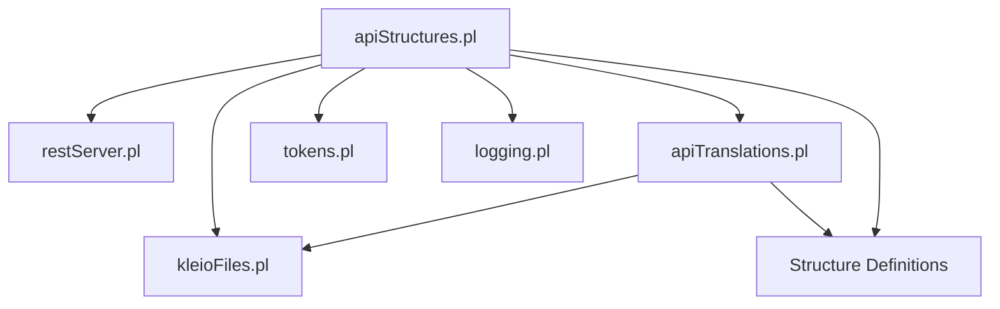

# Structures API

<cite>
**Referenced Files in This Document**
- [apiStructures.pl](file://src/apiStructures.pl)
- [restServer.pl](file://src/restServer.pl)
- [kleioFiles.pl](file://src/kleioFiles.pl)
- [apiTranslations.pl](file://src/apiTranslations.pl)
- [gacto2.str](file://src/stru/gacto2.str)
- [system.yaml](file://src/stru/system.yaml)
- [groups.yaml](file://src/stru/groups.yaml)
- [elements.yaml](file://src/stru/elements.yaml)
- [sources-structure.yaml](file://src/stru/sources-structure.yaml)
- [pt-elements.yaml](file://src/stru/pt-elements.yaml)
- [pt-groups.yaml](file://src/stru/pt-groups.yaml)
- [README.md](file://README.md)
- [stru README.md](file://src/stru/README.md)
</cite>

## Table of Contents
1. [Introduction](#introduction)
2. [Project Structure](#project-structure)
3. [Core Components](#core-components)
4. [Architecture Overview](#architecture-overview)
5. [Detailed Component Analysis](#detailed-component-analysis)
6. [Dependency Analysis](#dependency-analysis)
7. [Performance Considerations](#performance-considerations)
8. [Troubleshooting Guide](#troubleshooting-guide)
9. [Conclusion](#conclusion)

## Introduction
The Structures API provides programmatic access to Kleio structure files (.str, .yaml, .srpt) and their metadata. It enables clients to:
- Retrieve structure file information for a given path
- Discover structure files within directories (optionally recursively)
- Resolve the structure associated with a specific Kleio source file
- Obtain structure file metadata (file attributes) for single-file queries

The API supports both REST and JSON-RPC modes and integrates with the broader Kleio translation and file management ecosystem.

## Project Structure
The Structures API is implemented as a dedicated module within the server, with supporting modules for file resolution, token-based authorization, and logging. Structure definitions are provided in both classic .str format and modern YAML format.

**Diagram sources**
- [apiStructures.pl:1-189](file://src/apiStructures.pl#L1-L189)
- [restServer.pl:1-200](file://src/restServer.pl#L1-L200)
- [kleioFiles.pl:850-862](file://src/kleioFiles.pl#L850-L862)
- [apiTranslations.pl:384-424](file://src/apiTranslations.pl#L384-L424)
- [system.yaml:1-4](file://src/stru/system.yaml#L1-L4)
- [groups.yaml:1-690](file://src/stru/groups.yaml#L1-L690)
- [elements.yaml:1-305](file://src/stru/elements.yaml#L1-L305)
- [sources-structure.yaml:1-10](file://src/stru/sources-structure.yaml#L1-L10)
- [pt-elements.yaml:1-136](file://src/stru/pt-elements.yaml#L1-L136)
- [pt-groups.yaml:1-229](file://src/stru/pt-groups.yaml#L1-L229)
- [gacto2.str:1-800](file://src/stru/gacto2.str#L1-L800)

**Section sources**
- [apiStructures.pl:1-189](file://src/apiStructures.pl#L1-L189)
- [restServer.pl:1-200](file://src/restServer.pl#L1-L200)
- [kleioFiles.pl:850-862](file://src/kleioFiles.pl#L850-L862)
- [apiTranslations.pl:384-424](file://src/apiTranslations.pl#L384-L424)
- [system.yaml:1-4](file://src/stru/system.yaml#L1-L4)
- [groups.yaml:1-690](file://src/stru/groups.yaml#L1-L690)
- [elements.yaml:1-305](file://src/stru/elements.yaml#L1-L305)
- [sources-structure.yaml:1-10](file://src/stru/sources-structure.yaml#L1-L10)
- [pt-elements.yaml:1-136](file://src/stru/pt-elements.yaml#L1-L136)
- [pt-groups.yaml:1-229](file://src/stru/pt-groups.yaml#L1-L229)
- [gacto2.str:1-800](file://src/stru/gacto2.str#L1-L800)

## Core Components
- structures/5: Main entry point for structure retrieval. Supports:
  - Path-based retrieval for files or directories
  - Structure resolution for a specific Kleio source file
  - Optional recursion for directory listings
- structures_get/3: JSON-RPC entry point for structures_get method
- structures_abs_get/4: Core logic for retrieving structure information
- find_structure_files/3 and find_structure_files_recursive/2: Directory traversal utilities for discovering structure files
- kleio_resolve_structure_file/3: Resolves relative structure paths to absolute locations using configured directories
- get_stru_for_file/3: Resolves the appropriate structure file for a given Kleio source file

Key capabilities:
- Authorization enforcement via tokens
- File existence verification
- Metadata retrieval (file attributes)
- Recursive directory scanning for structure discovery

**Section sources**
- [apiStructures.pl:22-189](file://src/apiStructures.pl#L22-L189)
- [kleioFiles.pl:850-862](file://src/kleioFiles.pl#L850-L862)
- [apiTranslations.pl:384-424](file://src/apiTranslations.pl#L384-L424)

## Architecture Overview
The Structures API follows a layered architecture with clear separation of concerns:
- Presentation layer: REST and JSON-RPC handlers
- Business logic: Structure retrieval and resolution
- Infrastructure: File system access and path resolution
- Data layer: Structure definitions in .str and .yaml formats

**Diagram sources**
- [restServer.pl:43-106](file://src/restServer.pl#L43-L106)
- [apiStructures.pl:38-92](file://src/apiStructures.pl#L38-L92)
- [kleioFiles.pl:850-862](file://src/kleioFiles.pl#L850-L862)
- [apiTranslations.pl:384-424](file://src/apiTranslations.pl#L384-L424)

## Detailed Component Analysis

### API Entry Points
The API exposes two primary entry points:
- structures/5: Main handler supporting both REST and JSON-RPC modes
- structures_get/3: JSON-RPC-specific entry point delegating to structures/5

Processing flow:
1. Token validation against files permission
2. Parameter evaluation (kleio vs path)
3. Structure resolution or directory traversal
4. Results formatting based on mode

**Section sources**
- [apiStructures.pl:22-153](file://src/apiStructures.pl#L22-L153)

### Structure Resolution Logic
The system resolves structure files through a multi-step process:
1. Validate and resolve the target Kleio file path
2. Determine the default structure (gacto2.str)
3. Match the source file to an appropriate structure using depth-first search
4. Return the resolved structure file path

**Diagram sources**
- [apiStructures.pl:38-92](file://src/apiStructures.pl#L38-L92)
- [kleioFiles.pl:850-862](file://src/kleioFiles.pl#L850-L862)
- [apiTranslations.pl:384-424](file://src/apiTranslations.pl#L384-L424)

**Section sources**
- [apiStructures.pl:38-92](file://src/apiStructures.pl#L38-L92)
- [apiTranslations.pl:384-424](file://src/apiTranslations.pl#L384-L424)

### Directory Traversal and Discovery
The API supports recursive directory scanning to discover structure files:
- Single-level discovery: Lists files with extensions .str, .yaml, .srpt
- Recursive discovery: Traverses subdirectories excluding . and ..
- File attribute retrieval: Provides metadata for single-file queries

Implementation highlights:
- Extension filtering for structure files
- Directory entry validation
- Path concatenation utilities

**Section sources**
- [apiStructures.pl:94-144](file://src/apiStructures.pl#L94-L144)

### Structure Definition Formats
The system supports both classic .str and YAML formats:
- Classic format: gacto2.str provides comprehensive structure definitions
- YAML format: Modern, flexible structure definitions with includes
- Hybrid approach: YAML files can include core elements and groups

Structure composition patterns:
- system.yaml: Base includes for groups.yaml and elements.yaml
- sources-structure.yaml: Default structure combining core and domain-specific definitions
- Domain-specific: pt-elements.yaml and pt-groups.yaml for Portuguese sources

**Section sources**
- [gacto2.str:1-800](file://src/stru/gacto2.str#L1-L800)
- [system.yaml:1-4](file://src/stru/system.yaml#L1-L4)
- [groups.yaml:1-690](file://src/stru/groups.yaml#L1-L690)
- [elements.yaml:1-305](file://src/stru/elements.yaml#L1-L305)
- [sources-structure.yaml:1-10](file://src/stru/sources-structure.yaml#L1-L10)
- [pt-elements.yaml:1-136](file://src/stru/pt-elements.yaml#L1-L136)
- [pt-groups.yaml:1-229](file://src/stru/pt-groups.yaml#L1-L229)

## Dependency Analysis
The Structures API has well-defined dependencies that support modularity and maintainability:

**Diagram sources**
- [apiStructures.pl:16-21](file://src/apiStructures.pl#L16-L21)
- [restServer.pl:1-22](file://src/restServer.pl#L1-L22)
- [kleioFiles.pl:850-862](file://src/kleioFiles.pl#L850-L862)
- [apiTranslations.pl:384-424](file://src/apiTranslations.pl#L384-L424)

Key dependency characteristics:
- Low coupling between API and infrastructure modules
- Clear separation between presentation and business logic
- Extensible structure definition system
- Robust path resolution utilities

**Section sources**
- [apiStructures.pl:16-21](file://src/apiStructures.pl#L16-L21)
- [restServer.pl:1-22](file://src/restServer.pl#L1-L22)

## Performance Considerations
- Directory traversal performance: Recursive scanning can be expensive for large directory trees
- File system access: Minimize redundant file existence checks
- Structure resolution: Depth-first search ensures appropriate structure selection
- Memory usage: YAML parsing versus .str parsing performance characteristics

Recommendations:
- Use recursion judiciously for large directory structures
- Cache frequently accessed structure file paths
- Monitor file system I/O during bulk operations

## Troubleshooting Guide
Common issues and resolutions:

**Authorization failures**
- Symptom: HTTP 403 Forbidden responses
- Cause: Missing or invalid files permission token
- Resolution: Generate or validate API token with appropriate permissions

**File not found errors**
- Symptom: HTTP 404 Not Found responses
- Causes:
  - Non-existent structure file path
  - Unresolvable source file path
  - Incorrect directory permissions
- Resolution: Verify file paths and directory accessibility

**Structure resolution failures**
- Symptom: Unable to determine appropriate structure for source file
- Causes:
  - Missing structure files in expected locations
  - Incorrect directory structure configuration
- Resolution: Ensure proper placement of sources-structure.yaml, gacto2.str, or custom structure files

**Directory traversal issues**
- Symptom: Empty or incomplete directory listings
- Causes: Permission restrictions or invalid directory paths
- Resolution: Check directory permissions and path validity

**Section sources**
- [apiStructures.pl:38-69](file://src/apiStructures.pl#L38-L69)
- [kleioFiles.pl:850-862](file://src/kleioFiles.pl#L850-L862)
- [apiTranslations.pl:384-424](file://src/apiTranslations.pl#L384-L424)

## Conclusion
The Structures API provides a robust, extensible framework for managing Kleio structure definitions. Its modular design supports both classic and modern structure formats while maintaining clear separation between presentation, business logic, and infrastructure concerns. The API's integration with the broader Kleio ecosystem enables seamless structure discovery, resolution, and management for translation workflows.

The system's architecture supports future enhancements including additional structure formats, improved caching mechanisms, and expanded directory traversal capabilities. The comprehensive structure definition system (both .str and YAML formats) provides flexibility for diverse historical source requirements while maintaining consistency across the platform.