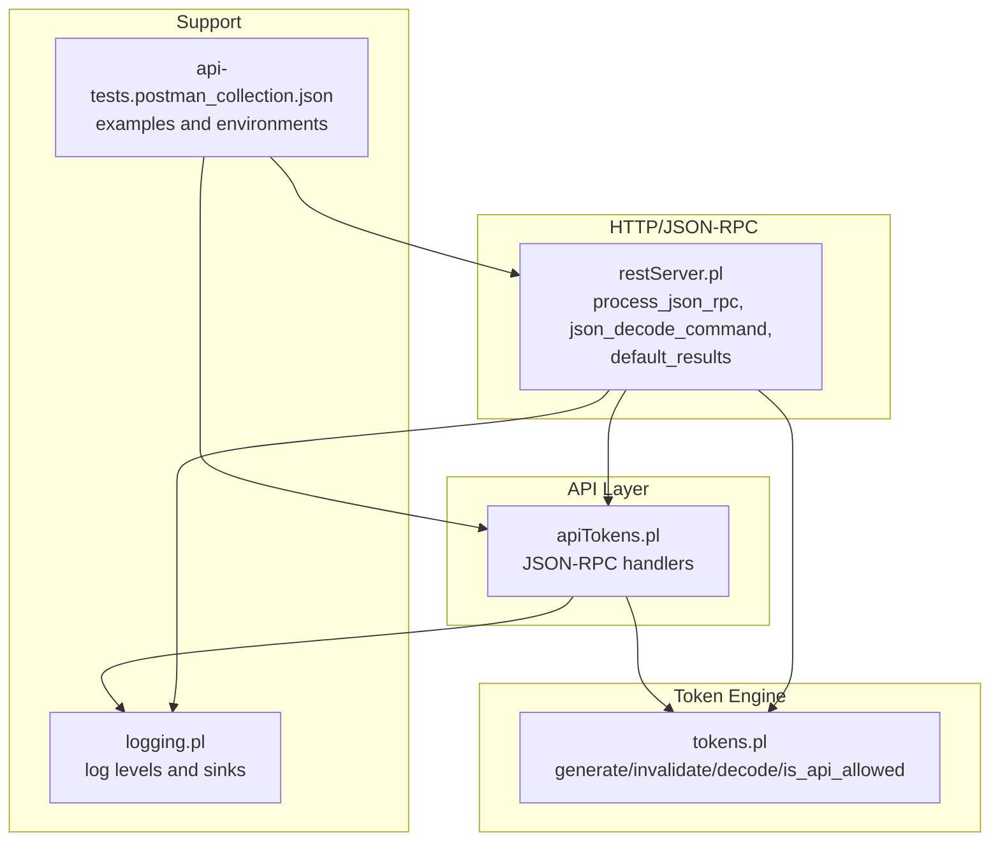
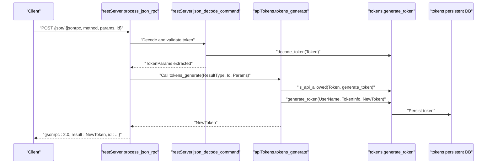
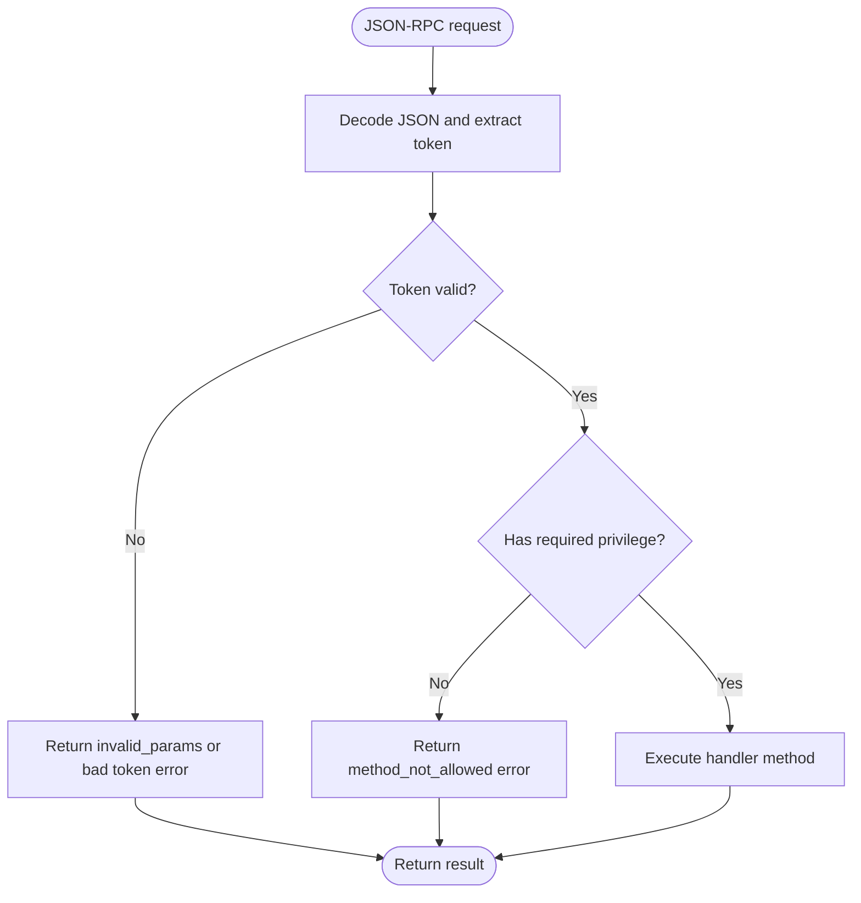
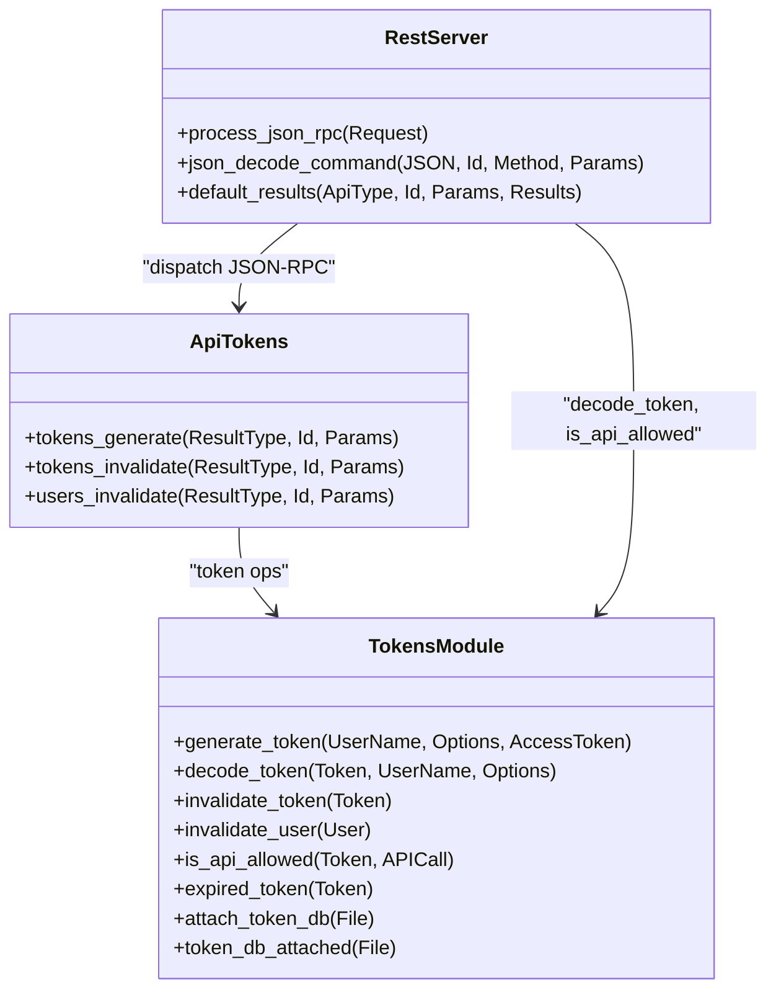
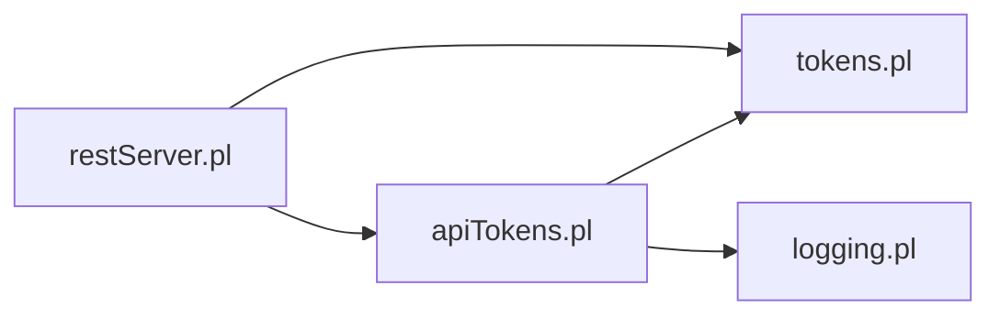

# Tokens API

<cite>
**Referenced Files in This Document**
- [apiTokens.pl](file://src/apiTokens.pl)
- [tokens.pl](file://src/tokens.pl)
- [restServer.pl](file://src/restServer.pl)
- [api-tests.postman_collection.json](file://api/postman/api-tests.postman_collection.json)
- [environment.json](file://api/postman/environment.json)
- [logging.pl](file://src/logging.pl)
</cite>

## Table of Contents
1. [Introduction](#introduction)
2. [Project Structure](#project-structure)
3. [Core Components](#core-components)
4. [Architecture Overview](#architecture-overview)
5. [Detailed Component Analysis](#detailed-component-analysis)
6. [Dependency Analysis](#dependency-analysis)
7. [Performance Considerations](#performance-considerations)
8. [Troubleshooting Guide](#troubleshooting-guide)
9. [Conclusion](#conclusion)
10. [Appendices](#appendices)

## Introduction
This document describes the token management API for the timelink-kleio system. It covers JSON-RPC methods for token generation, token invalidation, and user invalidation, along with bearer authentication validation. It specifies request/response schemas, privileges, administrative tokens, error handling, and security considerations such as privilege escalation prevention and token revocation. It also provides client implementation guidelines for secure authentication workflows and token lifecycle management.

## Project Structure
The token management functionality spans several modules:
- API entry points for token operations
- Token storage and validation logic
- JSON-RPC decoding and bearer authentication
- Logging and error handling

**Diagram sources**
- [apiTokens.pl](file://src/apiTokens.pl#L1-L125)
- [tokens.pl](file://src/tokens.pl#L1-L200)
- [restServer.pl](file://src/restServer.pl#L656-L779)
- [logging.pl](file://src/logging.pl#L1-L161)
- [api-tests.postman_collection.json](file://api/postman/api-tests.postman_collection.json#L1-L400)

**Section sources**
- [apiTokens.pl](file://src/apiTokens.pl#L1-L125)
- [tokens.pl](file://src/tokens.pl#L1-L200)
- [restServer.pl](file://src/restServer.pl#L656-L779)
- [logging.pl](file://src/logging.pl#L1-L161)
- [api-tests.postman_collection.json](file://api/postman/api-tests.postman_collection.json#L1-L400)

## Core Components
- JSON-RPC handlers for token operations:
  - tokens_generate: creates a token for a user with associated privileges and directories
  - tokens_invalidate: invalidates a specific token
  - users_invalidate: invalidates all tokens for a user
- Token engine:
  - generate_token/3: persists a new token with options
  - decode_token/3: validates bearer token and returns user/options
  - is_api_allowed/2: checks if a token grants permission for a given endpoint
  - invalidate_token/1 and invalidate_user/1: token revocation
  - expired_token/1: enforces token lifetime
- JSON-RPC decoding and bearer authentication:
  - json_decode_command: extracts method, id, params, and validates token via decode_token
  - default_results: standard JSON-RPC response formatting

**Section sources**
- [apiTokens.pl](file://src/apiTokens.pl#L41-L122)
- [tokens.pl](file://src/tokens.pl#L104-L200)
- [restServer.pl](file://src/restServer.pl#L752-L769)

## Architecture Overview
The token management flow integrates JSON-RPC decoding, token validation, and privilege checks.

**Diagram sources**
- [restServer.pl](file://src/restServer.pl#L656-L779)
- [apiTokens.pl](file://src/apiTokens.pl#L41-L88)
- [tokens.pl](file://src/tokens.pl#L104-L140)

## Detailed Component Analysis

### JSON-RPC Methods

- tokens_generate
  - Purpose: Issue a new token for a user with specified privileges and directories.
  - Endpoint: JSON-RPC method name "tokens_generate".
  - Authentication: Requires a valid bearer token with the "generate_token" privilege.
  - Request schema (JSON):
    - jsonrpc: string "2.0"
    - method: string "tokens_generate"
    - params:
      - user: string (identifier of the user to create a token for)
      - info: object
        - comment: string (optional)
        - api: array of strings (allowed operations)
        - structures: string (optional base directory for user structure files)
        - sources: string (optional base directory for user source files)
      - token: string (administrative bearer token)
    - id: number or string (request identifier)
  - Response schema (JSON):
    - result: string (the newly generated token)
    - id: number or string (matches request id)
  - Privileges:
    - Requires "generate_token" in token's api list.
  - Notes:
    - The info object is stored as-is; the server persists it with the token.
    - If a bootstrap token exists and is consumed, it is invalidated automatically.

- tokens_invalidate
  - Purpose: Invalidate a specific token.
  - Endpoint: JSON-RPC method name "tokens_invalidate".
  - Authentication: Requires a valid bearer token with the "invalidate_token" privilege.
  - Request schema (JSON):
    - jsonrpc: string "2.0"
    - method: string "tokens_invalidate"
    - params:
      - user_token: string (token to invalidate)
      - token: string (administrative bearer token)
    - id: number or string
  - Response schema (JSON):
    - result: string (the invalidated token)
    - id: number or string

- users_invalidate
  - Purpose: Invalidate all tokens associated with a user.
  - Endpoint: JSON-RPC method name "users_invalidate".
  - Authentication: Requires a valid bearer token with the "invalidate_user" privilege.
  - Request schema (JSON):
    - jsonrpc: string "2.0"
    - method: string "users_invalidate"
    - params:
      - user: string (user whose tokens are invalidated)
      - token: string (administrative bearer token)
    - id: number or string
  - Response schema (JSON):
    - result: string (the user identifier)
    - id: number or string

Examples from Postman collection:
- Creating tokens for different user roles:
  - limited_user: minimal privileges
  - tester: broad privileges for translations and file operations
  - coordinator: root-level access to manage files for others
- The Postman collection demonstrates bearer authentication using environment variables and includes sequences to invalidate users before generating new tokens.

**Section sources**
- [apiTokens.pl](file://src/apiTokens.pl#L41-L122)
- [api-tests.postman_collection.json](file://api/postman/api-tests.postman_collection.json#L1-L365)
- [environment.json](file://api/postman/environment.json#L1-L109)

### Bearer Authentication and Validation

- Token extraction:
  - The server accepts a bearer token either as a header or embedded in the JSON-RPC params.
  - The JSON-RPC decoder extracts the token and validates it using decode_token/3.
- Token validation:
  - decode_token(Token, UserName, Options) resolves the token to a user and options, rejecting expired tokens.
  - If no token is provided or it is invalid, the server responds with an error.
- Privilege enforcement:
  - Each API handler checks is_api_allowed(Token, Privilege) before proceeding.
  - If missing privileges, the server returns a method-not-allowed error.

**Diagram sources**
- [restServer.pl](file://src/restServer.pl#L752-L769)
- [apiTokens.pl](file://src/apiTokens.pl#L70-L122)
- [tokens.pl](file://src/tokens.pl#L249-L267)

**Section sources**
- [restServer.pl](file://src/restServer.pl#L752-L769)
- [apiTokens.pl](file://src/apiTokens.pl#L70-L122)
- [tokens.pl](file://src/tokens.pl#L141-L177)

### Token Storage and Lifecycle

- Generation:
  - generate_token(UserName, Options, AccessToken) creates a unique token, persists it, and sets options (including api list, directories, and optional lifetime).
- Revocation:
  - invalidate_token(Token) removes a specific token.
  - invalidate_user(User) removes all tokens for a user.
- Lifetime enforcement:
  - expired_token/1 checks token age and invalidates expired tokens automatically.
- Persistence:
  - Tokens are persisted using SWI-Prolog persistence facilities; a default token database path is derived from configuration.

**Diagram sources**
- [tokens.pl](file://src/tokens.pl#L104-L200)
- [restServer.pl](file://src/restServer.pl#L656-L779)
- [apiTokens.pl](file://src/apiTokens.pl#L41-L122)

**Section sources**
- [tokens.pl](file://src/tokens.pl#L104-L200)
- [tokens.pl](file://src/tokens.pl#L249-L282)

### Security Model

- Privilege escalation prevention:
  - Handlers enforce privilege checks via is_api_allowed(Token, Privilege).
  - Administrative tokens (with generate_token, invalidate_token, invalidate_user) are required to perform sensitive operations.
- Token revocation:
  - tokens_invalidate invalidates a single token.
  - users_invalidate invalidates all tokens for a user.
  - Expired tokens are automatically removed by expired_token/1.
- Administrative tokens:
  - Tokens can be sourced from environment variables or a dedicated admin token file.
  - Admin options grant broad privileges across API endpoints.

**Section sources**
- [apiTokens.pl](file://src/apiTokens.pl#L70-L122)
- [tokens.pl](file://src/tokens.pl#L153-L177)
- [tokens.pl](file://src/tokens.pl#L249-L267)

### Error Handling

- Invalid credentials:
  - Missing token or invalid token triggers invalid_params errors during JSON-RPC decoding.
- Insufficient privileges:
  - Missing required privilege raises method_not_allowed errors.
- Expired tokens:
  - decode_token rejects expired tokens; expired_token automatically invalidates them.
- Logging:
  - Debug logs are emitted around token operations and JSON-RPC processing.

Common error scenarios:
- Missing parameter "token" in JSON-RPC request
- Bad token format or unknown token
- Attempting privileged operations without required privileges
- Attempting to invalidate a non-existent token or user

**Section sources**
- [restServer.pl](file://src/restServer.pl#L752-L769)
- [apiTokens.pl](file://src/apiTokens.pl#L70-L122)
- [tokens.pl](file://src/tokens.pl#L249-L267)
- [logging.pl](file://src/logging.pl#L1-L161)

### Rate Limiting and Best Practices

- Rate limiting:
  - No explicit rate limiting is implemented in the analyzed code. Consider deploying reverse proxies or middleware to enforce rate limits for authentication endpoints.
- Token storage and transmission:
  - Store tokens securely (encrypted at rest, restricted filesystem permissions).
  - Transmit tokens over HTTPS/TLS only.
  - Rotate tokens regularly and invalidate on compromise.
  - Avoid embedding tokens in URLs; use Authorization headers or JSON-RPC params.
- Client implementation guidelines:
  - Use short-lived tokens with refresh mechanisms when appropriate.
  - Cache tokens locally and refresh silently before expiration.
  - Log token usage and monitor for anomalies.
  - Implement graceful fallback on privilege failures.

[No sources needed since this section provides general guidance]

## Dependency Analysis

**Diagram sources**
- [restServer.pl](file://src/restServer.pl#L656-L779)
- [apiTokens.pl](file://src/apiTokens.pl#L1-L125)
- [tokens.pl](file://src/tokens.pl#L1-L200)
- [logging.pl](file://src/logging.pl#L1-L161)

**Section sources**
- [restServer.pl](file://src/restServer.pl#L656-L779)
- [apiTokens.pl](file://src/apiTokens.pl#L1-L125)
- [tokens.pl](file://src/tokens.pl#L1-L200)

## Performance Considerations

- Token persistence:
  - Token database operations are guarded by mutexes to prevent race conditions; ensure the token database file is on fast storage.
- Token validation:
  - decode_token performs a database lookup; caching decoded tokens at the application level can reduce latency for repeated validations.
- JSON-RPC overhead:
  - Batch requests are supported; consider batching token operations to reduce network overhead.

[No sources needed since this section provides general guidance]

## Troubleshooting Guide

- Symptom: "Missing parameter: token"
  - Cause: JSON-RPC request lacks the token field.
  - Resolution: Include the token in the params object.
- Symptom: "Bad token"
  - Cause: Token not found or invalid format.
  - Resolution: Regenerate token with tokens_generate or verify token correctness.
- Symptom: "method_not_allowed"
  - Cause: Token lacks required privilege for the operation.
  - Resolution: Ensure the token includes the required privilege (e.g., generate_token, invalidate_token, invalidate_user).
- Symptom: Operation succeeds but token appears revoked
  - Cause: Token expired; expired_token automatically invalidates it.
  - Resolution: Generate a new token or adjust lifetime options.

**Section sources**
- [restServer.pl](file://src/restServer.pl#L752-L769)
- [apiTokens.pl](file://src/apiTokens.pl#L70-L122)
- [tokens.pl](file://src/tokens.pl#L249-L267)

## Conclusion
The timelink-kleio token management API provides robust bearer authentication and fine-grained privilege controls via JSON-RPC. Administrators can generate, invalidate, and revoke tokens with explicit privileges, while clients can securely authenticate and authorize operations. The system enforces privilege checks, supports token lifetimes, and offers clear error signaling. For production deployments, combine the existing capabilities with rate limiting, secure token storage/transmission, and rotation policies.

## Appendices

### Request/Response Schemas

- tokens_generate
  - Request:
    - jsonrpc: "2.0"
    - method: "tokens_generate"
    - params:
      - user: string
      - info.api: array of strings
      - info.structures: string
      - info.sources: string
      - token: string
    - id: number|string
  - Response:
    - result: string (token)
    - id: number|string

- tokens_invalidate
  - Request:
    - jsonrpc: "2.0"
    - method: "tokens_invalidate"
    - params:
      - user_token: string
      - token: string
    - id: number|string
  - Response:
    - result: string (token)
    - id: number|string

- users_invalidate
  - Request:
    - jsonrpc: "2.0"
    - method: "users_invalidate"
    - params:
      - user: string
      - token: string
    - id: number|string
  - Response:
    - result: string (user)
    - id: number|string

**Section sources**
- [apiTokens.pl](file://src/apiTokens.pl#L41-L122)
- [restServer.pl](file://src/restServer.pl#L849-L860)

### Examples from Postman Collection

- Token creation for limited_user, tester, and coordinator:
  - See the "create tokens" section in the Postman collection for method invocations and environment variable usage.
- Environment variables:
  - testadmintoken, limited_token, tester_token, coordinator_token are used to drive the test sequences.

**Section sources**
- [api-tests.postman_collection.json](file://api/postman/api-tests.postman_collection.json#L1-L365)
- [environment.json](file://api/postman/environment.json#L1-L109)