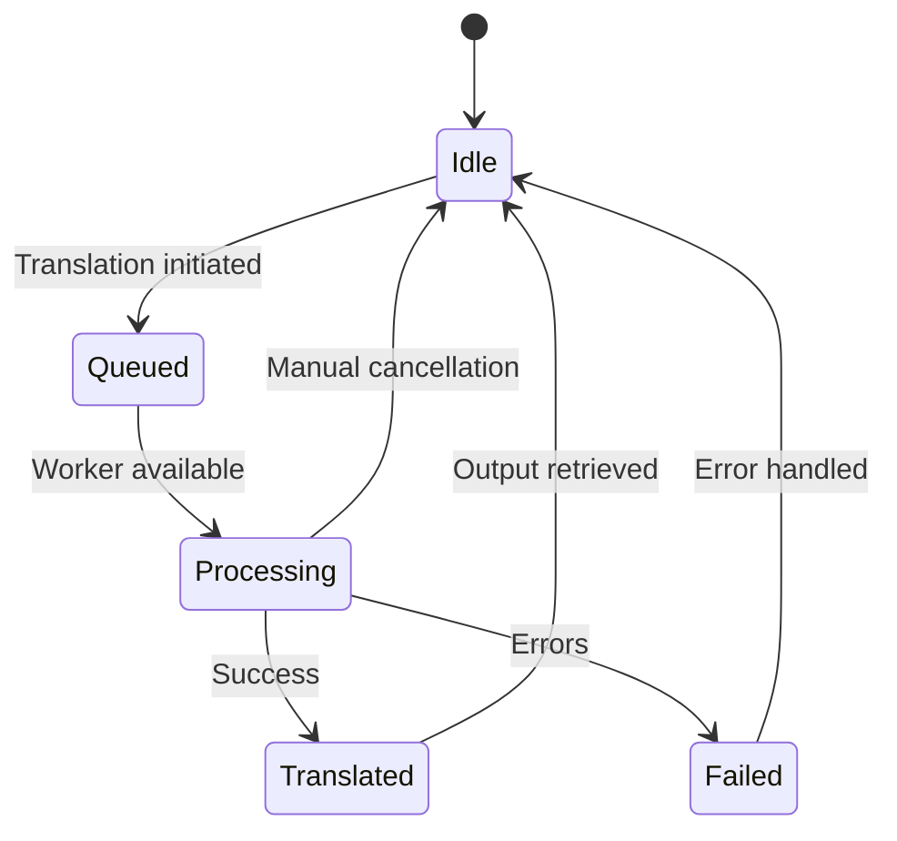
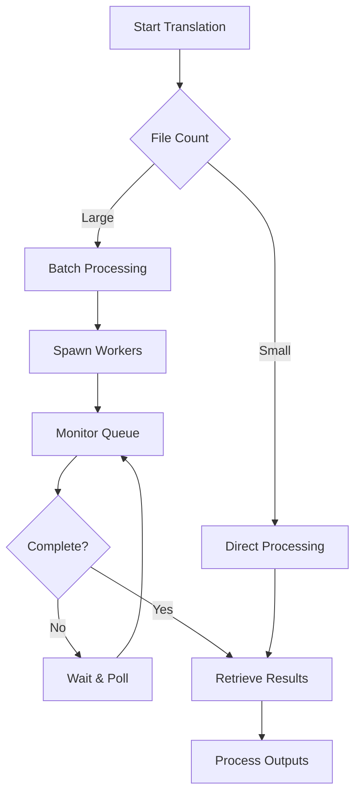

# Translations API

<cite>
**Referenced Files in This Document**   
- [apiTranslations.pl](file://src/apiTranslations.pl)
- [restServer.pl](file://src/restServer.pl)
- [api-tests.postman_collection.json](file://api/postman/api-tests.postman_collection.json)
- [translation_results.md](file://docs/doc/translation_results.md)
</cite>

## Table of Contents
1. [Introduction](#introduction)
2. [Endpoint Overview](#endpoint-overview)
3. [HTTP Methods](#http-methods)
4. [Request Parameters](#request-parameters)
5. [Response Schemas](#response-schemas)
6. [Translation Status and Metadata](#translation-status-and-metadata)
7. [Error Handling](#error-handling)
8. [Client Implementation Patterns](#client-implementation-patterns)
9. [Performance Considerations](#performance-considerations)
10. [Examples](#examples)

## Introduction
The Translations API provides a RESTful interface for managing the translation of Kleio source files into structured data formats. This API enables users to initiate translations, retrieve translation results, and manage translation outputs through a token-based authentication system. The translation process is asynchronous, allowing for efficient processing of single files or entire directories. The API supports batch processing through recursive operations and provides comprehensive metadata about translation status and results.

**Section sources**
- [apiTranslations.pl](file://src/apiTranslations.pl#L34-L50)
- [translation_results.md](file://docs/doc/translation_results.md#L1-L81)

## Endpoint Overview
The `/translations` endpoint serves as the primary interface for translation operations in the timelink-kleio system. It supports three main operations: initiating translations (POST), retrieving translation results (GET), and removing translation outputs (DELETE). The endpoint operates on Kleio source files (typically with .cli extension) and their associated structure files (.str or .yaml), producing XML exports and various report files as outputs.

The API follows REST principles with resource-oriented URLs and standard HTTP methods. All requests require token-based authentication, ensuring secure access to translation resources. The endpoint handles both single file operations and batch processing of directories, with the ability to recursively process subdirectories through the `recurse` parameter.

```mermaid
graph TD
A[Client Application] --> B[/translations Endpoint]
B --> C{HTTP Method}
C --> D[POST: Initiate Translation]
C --> E[GET: Retrieve Results]
C --> F[DELETE: Remove Outputs]
D --> G[Translation Job Queue]
G --> H[Worker Threads]
H --> I[Translated Files]
I --> J[XML Export]
I --> K[Report Files]
I --> L[Error Files]
```

**Diagram sources**
- [apiTranslations.pl](file://src/apiTranslations.pl#L52-L82)
- [restServer.pl](file://src/restServer.pl#L1036-L1073)

## HTTP Methods
The `/translations` endpoint supports three HTTP methods for different operations:

### POST Method
The POST method initiates a translation job for a specified file or directory. When applied to a file, it starts the translation process for that single file. When applied to a directory, it processes all Kleio source files within that directory. The operation is asynchronous, returning immediately with a job identifier while the translation executes in the background.

### GET Method
The GET method retrieves the translation results, known as a "kleioset," for a specified file or directory. It returns comprehensive metadata about the translation status, including timestamps, error counts, and file attributes. For directories, it can recursively return information about all files in subdirectories when the `recurse=yes` parameter is used.

### DELETE Method
The DELETE method removes translation outputs (derived files) for a specified file or directory. This includes files with extensions such as .rpt, .err, .xml, .org, .old, and .ids. The operation does not affect the original source file (.cli). When applied to a directory, it can recursively remove translation outputs from all subdirectories.

**Section sources**
- [apiCommon.pl](file://src/apiCommon.pl#L42-L44)
- [api-tests.postman_collection.json](file://api/postman/api-tests.postman_collection.json#L4174-L4202)
- [apiTranslations.pl](file://src/apiTranslations.pl#L52-L138)

## Request Parameters
The Translations API supports several query parameters to customize translation operations:

### Common Parameters
- **path**: Specifies the file path to the Kleio source file or directory (relative to user sources directory)
- **token**: Authentication token for API access
- **id**: Request identifier for tracking and debugging

### Translation-Specific Parameters
- **structure**: Path to the structure file (.str or .yaml) to be used in translation
- **echo**: If set to "yes", includes source lines in the translation report (.rpt file)
- **recurse**: If set to "yes", descends into subdirectories for batch processing
- **spawn**: If set to "yes", distributes files to different workers for parallel processing; if "no" (default), processes files sequentially with the structure file processed once

### Parameter Examples
```json
{
  "path": "sources/baptismos/b1685.cli",
  "token": "your-auth-token",
  "id": "request-123",
  "structure": "structures/baptismos.yaml",
  "echo": "yes",
  "recurse": "yes",
  "spawn": "yes"
}
```

**Section sources**
- [apiTranslations.pl](file://src/apiTranslations.pl#L42-L49)
- [api-tests.postman_collection.json](file://api/postman/api-tests.postman_collection.json#L4193-L4200)

## Response Schemas
The Translations API returns responses in JSON format, with different structures depending on the HTTP method used.

### POST Response Schema
When initiating a translation, the API returns a JSON object containing the job identifier:

```json
{
  "id": "request-123",
  "jsonrpc": "2.0",
  "result": "OK",
  "job": {
    "method": "translations",
    "object": "sources/baptismos/b1685.cli",
    "job": 12345
  }
}
```

### GET Response Schema
When retrieving translation results, the API returns an array of kleioset objects, each containing metadata for the various files in the translation set:

```json
{
  "id": "request-123",
  "jsonrpc": "2.0",
  "result": [
    {
      "kleio": {
        "name": "b1685.cli",
        "path": "sources/baptismos/b1685.cli",
        "status": "T",
        "modified": 1559627793,
        "modified_string": "2019-06-04 07:56:33",
        "size": 631744
      },
      "rpt": {
        "name": "b1685.rpt",
        "path": "sources/baptismos/b1685.rpt",
        "modified": 1559627793,
        "size": 746448
      },
      "err": {
        "name": "b1685.err",
        "path": "sources/baptismos/b1685.err",
        "errors": 2,
        "warnings": 9,
        "translated": 1559624160,
        "translated_string": "2019-06-04 06:56:00",
        "version": "ClioInput - version 2.3.1 - build 1768"
      },
      "xml": {
        "name": "b1685.xml",
        "path": "sources/baptismos/b1685.xml",
        "modified": 1559627793,
        "size": 29435260
      }
    }
  ]
}
```

### DELETE Response Schema
When removing translation outputs, the API returns a JSON array of the deleted files:

```json
{
  "id": "request-123",
  "jsonrpc": "2.0",
  "result": [
    "sources/baptismos/b1685.rpt",
    "sources/baptismos/b1685.err",
    "sources/baptismos/b1685.xml"
  ]
}
```

**Section sources**
- [api-tests.postman_collection.json](file://api/postman/api-tests.postman_collection.json#L4270-L4323)
- [apiTranslations.pl](file://src/apiTranslations.pl#L622-L634)
- [restServer.pl](file://src/restServer.pl#L1053-L1066)

## Translation Status and Metadata
The Translations API provides comprehensive metadata about the status and attributes of translated files. This information is crucial for monitoring translation progress and managing translation workflows.

### Status Codes
The API uses single-character status codes to indicate the translation state of files:
- **T**: Needs translation
- **V**: Valid translation (can be imported)
- **E**: Translated with errors
- **W**: Translated with warnings
- **P**: Currently being translated
- **Q**: Queued for translation
- **D**: Directory (not a file)

When multiple statuses apply, the priority order is P > Q > T > V > E > W.

### File Metadata
For each file in the kleioset, the API returns the following metadata:

#### Common Attributes
- **name**: File name without directory path
- **path**: Full path to the file
- **directory**: Directory containing the file
- **base**: Base name without extension
- **base_path**: Full base name with path but without extension
- **extension**: File extension
- **modified**: Last modification time as a float timestamp
- **modified_string**: Formatted modification time (YYYY-MM-DD HH:MM:SS)
- **modified_rfc1123**: Modification time in RFC 1123 format
- **modified_iso**: Modification time in ISO 8601 format
- **size**: File size in bytes

#### Translation-Specific Attributes
- **errors**: Number of errors in translation
- **warnings**: Number of warnings in translation
- **version**: Translator version string
- **translated**: Time of last translation as a float timestamp
- **translated_string**: Formatted translation time
- **rpt_url**: URL to fetch the translation report
- **xml_url**: URL to fetch the XML export file

#### Processing Status Attributes
- **ttime**: Time when file started processing
- **ttime_string**: Formatted processing start time
- **qtime**: Time when file was queued
- **qtime_string**: Formatted queue time



**Diagram sources**
- [apiTranslations.pl](file://src/apiTranslations.pl#L494-L527)
- [translation_results.md](file://docs/doc/translation_results.md#L14-L47)

## Error Handling
The Translations API implements comprehensive error handling to manage various failure scenarios during translation operations.

### Common Error Types
- **Structure File Mismatch**: Occurs when the specified structure file does not exist or cannot be accessed
- **Parsing Errors**: Generated when the source file contains syntax errors or invalid data
- **File Not Found**: Triggered when the requested source file or directory does not exist
- **Permission Denied**: Returned when the authentication token does not have sufficient privileges
- **Translation Failures**: Occur when the translation process encounters internal errors

### Error Response Format
Error responses follow the JSON-RPC 2.0 specification:

```json
{
  "id": "request-123",
  "jsonrpc": "2.0",
  "error": {
    "code": -32602,
    "message": "Structure file does not exist",
    "data": "structures/baptismos.yaml"
  }
}
```

### Error Prevention and Recovery
The API includes several mechanisms to prevent and recover from errors:
- **Structure File Validation**: Verifies the existence of structure files before initiating translation
- **File Locking**: Uses mutexes to prevent concurrent access to the same structure or data files
- **Caching**: Implements status caching to reduce server load from repeated status checks
- **Job Queue Management**: Tracks queued and processing files to prevent duplicate processing

**Section sources**
- [apiTranslations.pl](file://src/apiTranslations.pl#L281-L291)
- [errors.pl](file://src/errors.pl#L77-L87)
- [translation_results.md](file://docs/doc/translation_results.md#L28-L30)

## Client Implementation Patterns
Clients can implement both synchronous and asynchronous workflows when interacting with the Translations API.

### Synchronous Processing
For simple operations, clients can use a direct request-response pattern:

```python
# Synchronous translation
response = requests.post(
    "http://localhost:8088/rest/translations",
    params={
        "path": "sources/baptismos/b1685.cli",
        "token": "your-token",
        "id": "req-123"
    }
)
# Wait for response and process results
```

### Asynchronous Processing
For large-scale translations, an asynchronous polling pattern is recommended:

```python
# Asynchronous translation with polling
# 1. Initiate translation
job_response = requests.post(
    "http://localhost:8088/rest/translations",
    params={
        "path": "sources/baptismos/",
        "token": "your-token",
        "id": "req-123",
        "recurse": "yes"
    }
)
job_id = job_response.json()["job"]["job"]

# 2. Poll for completion
while True:
    status_response = requests.get(
        "http://localhost:8088/rest/translations",
        params={
            "path": "sources/baptismos/",
            "token": "your-token",
            "id": "req-124",
            "recurse": "yes"
        }
    )
    results = status_response.json()["result"]
    # Check if all files have status V, E, or W
    if all(r["kleio"]["status"] in ["V", "E", "W"] for r in results):
        break
    time.sleep(5)  # Wait before next poll
```

### Batch Processing
For processing multiple directories, clients can implement batch operations:

```python
# Batch processing of multiple directories
directories = ["baptismos", "casamentos", "obitos"]
for directory in directories:
    # Initiate translation for each directory
    requests.post(
        "http://localhost:8088/rest/translations",
        params={
            "path": f"sources/{directory}/",
            "token": "your-token",
            "id": f"req-{directory}",
            "spawn": "yes"
        }
    )
```

**Section sources**
- [apiTranslations.pl](file://src/apiTranslations.pl#L80-L82)
- [restServer.pl](file://src/restServer.pl#L1113-L1123)

## Performance Considerations
The Translations API is designed to handle large-scale translation operations efficiently, but certain practices can optimize performance.

### Large-Scale Translations
For directories with many files, consider the following:
- Use `spawn=yes` to distribute files across multiple worker threads
- Implement appropriate polling intervals to avoid overwhelming the server
- Use the `recurse=yes` parameter for batch processing of directory hierarchies
- Consider the server's worker thread count when estimating processing time

### Polling Guidelines
When polling for translation status:
- Start with shorter intervals (e.g., 5 seconds) immediately after job submission
- Gradually increase intervals as the expected completion time approaches
- Implement exponential backoff for long-running jobs
- Use the cached status feature to reduce server load from frequent polling

### Resource Management
- Monitor server worker threads to avoid overloading
- Be aware of file locking mechanisms that may affect concurrent access
- Consider the impact of echo=yes on report file size and processing time
- Plan for sufficient disk space for translation outputs, especially XML files which can be significantly larger than source files



**Diagram sources**
- [apiTranslations.pl](file://src/apiTranslations.pl#L77-L82)
- [restServer.pl](file://src/restServer.pl#L180-L184)

## Examples
This section provides practical examples of using the Translations API based on the Postman collection.

### Initiating a Translation Job
```http
POST http://localhost:8088/rest/translations?id=request-123&recurse=yes&spawn=yes
Authorization: Bearer your-token-here
Content-Type: application/json

{
  "path": "sources/baptismos/"
}
```

**Response:**
```json
{
  "id": "request-123",
  "jsonrpc": "2.0",
  "result": "OK",
  "job": {
    "method": "translations",
    "object": "sources/baptismos/",
    "job": 12345
  }
}
```

### Checking Translation Status
```http
GET http://localhost:8088/rest/translations?id=request-124&recurse=yes
Authorization: Bearer your-token-here
Accept: application/json
```

**Response:**
```json
{
  "id": "request-124",
  "jsonrpc": "2.0",
  "result": [
    {
      "kleio": {
        "name": "b1685.cli",
        "path": "sources/baptismos/b1685.cli",
        "status": "V",
        "modified": 1559627793,
        "size": 631744
      },
      "err": {
        "name": "b1685.err",
        "errors": 0,
        "warnings": 0,
        "translated": 1559624160,
        "version": "ClioInput - version 2.3.1"
      },
      "xml": {
        "name": "b1685.xml",
        "size": 29435260
      }
    }
  ]
}
```

### Removing Translation Outputs
```http
DELETE http://localhost:8088/rest/translations?id=request-125&recurse=yes
Authorization: Bearer your-token-here
```

**Response:**
```json
{
  "id": "request-125",
  "jsonrpc": "2.0",
  "result": [
    "sources/baptismos/b1685.rpt",
    "sources/baptismos/b1685.err",
    "sources/baptismos/b1685.xml"
  ]
}
```

**Section sources**
- [api-tests.postman_collection.json](file://api/postman/api-tests.postman_collection.json#L4174-L4323)
- [apiTranslations.pl](file://src/apiTranslations.pl#L52-L138)