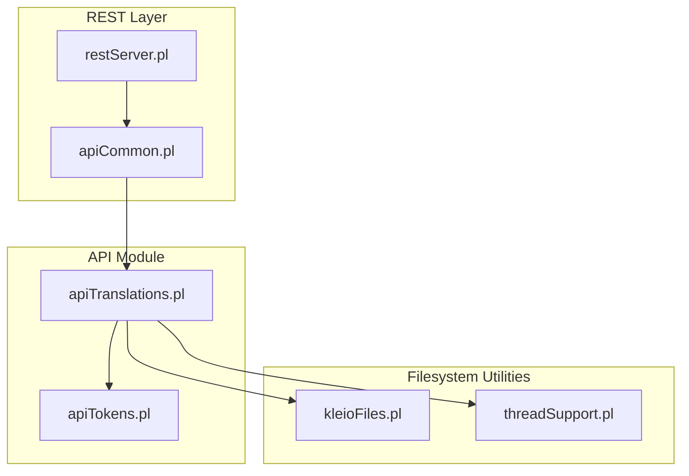
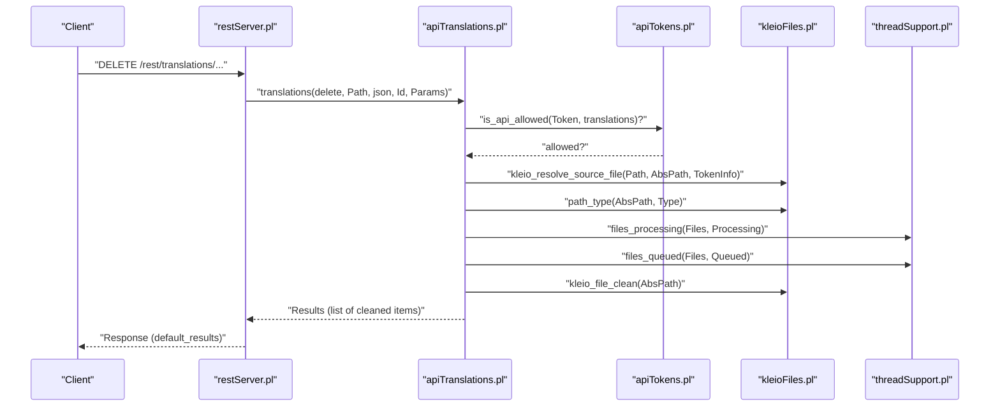
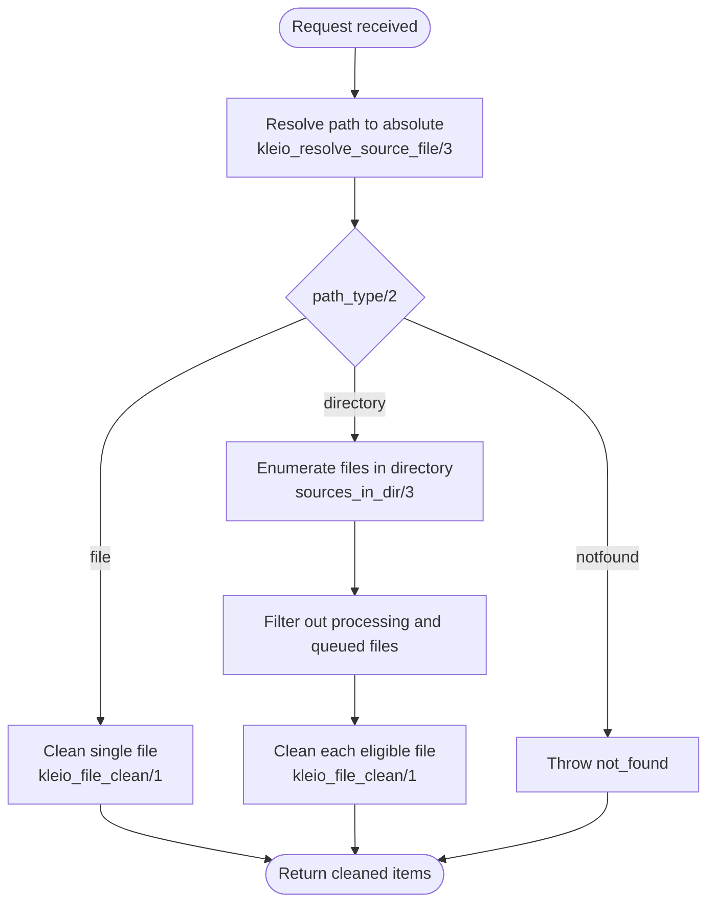
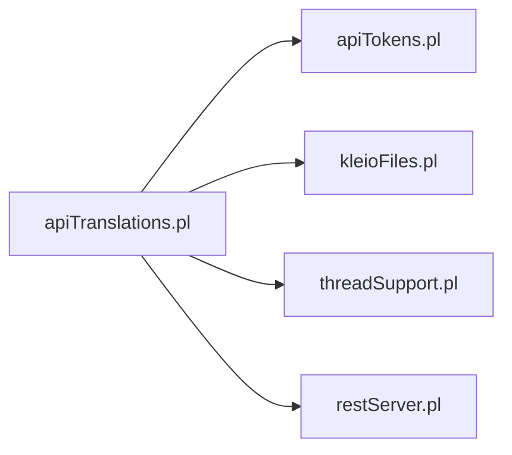

# DELETE /translations Endpoint

<cite>
**Referenced Files in This Document**
- [apiTranslations.pl](file://src/apiTranslations.pl)
- [kleioFiles.pl](file://src/kleioFiles.pl)
- [apiCommon.pl](file://src/apiCommon.pl)
- [restServer.pl](file://src/restServer.pl)
- [threadSupport.pl](file://src/threadSupport.pl)
- [apiTokens.pl](file://src/apiTokens.pl)
- [index.html](file://docs/api/index.html)
- [tests.json](file://api/postman/tests.json)
</cite>

## Table of Contents
1. [Introduction](#introduction)
2. [Project Structure](#project-structure)
3. [Core Components](#core-components)
4. [Architecture Overview](#architecture-overview)
5. [Detailed Component Analysis](#detailed-component-analysis)
6. [Dependency Analysis](#dependency-analysis)
7. [Performance Considerations](#performance-considerations)
8. [Troubleshooting Guide](#troubleshooting-guide)
9. [Conclusion](#conclusion)

## Introduction
This document describes the DELETE /translations endpoint used to clean up translation results and associated files. It explains how the endpoint resolves target paths, determines whether targets are files or directories, and deletes derived artifacts such as report files (.rpt), error summary files (.err), XML exports, and auxiliary files. It also documents request parameters, authentication requirements, response format, and operational considerations for safe cleanup.

## Project Structure
The DELETE /translations functionality spans several modules:
- API entrypoint and orchestration in the translations module
- Filesystem path resolution and cleanup utilities
- REST server plumbing and default result formatting
- Thread support for translation pipeline state
- Token-based authorization enforcement

**Diagram sources**
- [restServer.pl](file://src/restServer.pl#L1-L200)
- [apiCommon.pl](file://src/apiCommon.pl#L40-L89)
- [apiTranslations.pl](file://src/apiTranslations.pl#L124-L138)
- [kleioFiles.pl](file://src/kleioFiles.pl#L111-L144)
- [threadSupport.pl](file://src/threadSupport.pl#L1-L153)
- [apiTokens.pl](file://src/apiTokens.pl#L1-L125)

**Section sources**
- [apiTranslations.pl](file://src/apiTranslations.pl#L124-L138)
- [kleioFiles.pl](file://src/kleioFiles.pl#L111-L144)
- [apiCommon.pl](file://src/apiCommon.pl#L40-L89)
- [restServer.pl](file://src/restServer.pl#L1-L200)
- [threadSupport.pl](file://src/threadSupport.pl#L1-L153)
- [apiTokens.pl](file://src/apiTokens.pl#L1-L125)

## Core Components
- DELETE /translations handler: validates token permissions, resolves the requested path, determines path type, and performs cleanup.
- Path type resolution: distinguishes between files and directories to decide the scope of cleanup.
- Cleanup logic: deletes derived artifacts (.rpt, .err, .xml, auxiliary files) while preserving the original source file unless explicitly deleting the source itself.
- Response formatting: returns a list of cleaned items via the default results mechanism.

Key responsibilities:
- Authentication: enforced via is_api_allowed/2 with the translations action.
- Path resolution: kleio_resolve_source_file/3 ensures the path is resolved safely within user-accessible boundaries.
- Cleanup scope: path_type/2 decides whether to iterate over a directory or operate on a single file.
- Safety: avoids deleting files currently queued or processing in the translation pipeline.

**Section sources**
- [apiTranslations.pl](file://src/apiTranslations.pl#L124-L138)
- [kleioFiles.pl](file://src/kleioFiles.pl#L284-L293)
- [kleioFiles.pl](file://src/kleioFiles.pl#L111-L144)
- [apiCommon.pl](file://src/apiCommon.pl#L40-L89)
- [apiTokens.pl](file://src/apiTokens.pl#L50-L70)

## Architecture Overview
The DELETE /translations request follows this flow:
1. REST routing maps the request to the translations module.
2. Authentication is verified using is_api_allowed/2.
3. The path is resolved to an absolute location.
4. The path type is determined (file vs directory).
5. Cleanup is performed for eligible targets (excluding files currently queued or processing).
6. Results are formatted and returned.

**Diagram sources**
- [apiTranslations.pl](file://src/apiTranslations.pl#L124-L138)
- [kleioFiles.pl](file://src/kleioFiles.pl#L284-L293)
- [kleioFiles.pl](file://src/kleioFiles.pl#L111-L144)
- [threadSupport.pl](file://src/threadSupport.pl#L689-L722)
- [apiTokens.pl](file://src/apiTokens.pl#L50-L70)
- [restServer.pl](file://src/restServer.pl#L781-L811)

## Detailed Component Analysis

### Endpoint Definition and Request Handling
- Endpoint: DELETE /rest/translations/{path}
- Purpose: Clean translation artifacts for a file or directory.
- Authentication: Requires a token with translations permission.
- Path resolution: Resolves the path against user context to prevent unauthorized filesystem traversal.
- Path type detection: Determines whether the path refers to a file or directory.
- Cleanup scope: Excludes files currently queued or processing; operates on eligible targets.

Operational notes:
- The handler delegates to clean_translation/5, which:
  - For directories: enumerates files, filters out those currently processing or queued, and cleans each.
  - For files: cleans the file’s derived artifacts.
- Results are returned as a list of cleaned items.

**Section sources**
- [apiTranslations.pl](file://src/apiTranslations.pl#L124-L138)
- [apiCommon.pl](file://src/apiCommon.pl#L40-L89)
- [index.html](file://docs/api/index.html#L8584-L8594)

### Path Resolution and Type Detection
- Path resolution: kleio_resolve_source_file/3 ensures the path is valid and accessible within the configured home/source directories.
- Path type: path_type/2 identifies whether the path is a file, directory, or not found.

**Diagram sources**
- [apiTranslations.pl](file://src/apiTranslations.pl#L731-L760)
- [kleioFiles.pl](file://src/kleioFiles.pl#L284-L293)
- [kleioFiles.pl](file://src/kleioFiles.pl#L111-L126)

**Section sources**
- [kleioFiles.pl](file://src/kleioFiles.pl#L284-L293)
- [apiTranslations.pl](file://src/apiTranslations.pl#L731-L760)

### Cleanup Logic and Affected Artifacts
- Derived artifacts cleaned:
  - Report file (.rpt)
  - Error summary file (.err)
  - XML export file (.xml)
  - Auxiliary files: temporary ids file, files.json, and old backup file
- Original source file is preserved unless the user explicitly deletes it via the sources endpoint.

Safety checks:
- Files currently processing or queued are excluded from cleanup to avoid race conditions.

**Section sources**
- [kleioFiles.pl](file://src/kleioFiles.pl#L111-L126)
- [apiTranslations.pl](file://src/apiTranslations.pl#L731-L760)

### Authentication and Authorization
- The endpoint enforces authorization using is_api_allowed/2 with the translations action.
- Tokens carry permissions; only tokens with translations permission can invoke the endpoint.

Practical guidance:
- Ensure the token used includes the translations permission.
- Use the tokens API to generate or invalidate tokens as needed.

**Section sources**
- [apiTranslations.pl](file://src/apiTranslations.pl#L124-L133)
- [apiTokens.pl](file://src/apiTokens.pl#L50-L70)

### Response Format
- The endpoint returns a list of cleaned items.
- Responses are formatted via default_results/4, which is the standard mechanism for API responses.

Example shape:
- Array of strings representing the paths or identifiers of cleaned items.

**Section sources**
- [apiTranslations.pl](file://src/apiTranslations.pl#L762-L766)
- [restServer.pl](file://src/restServer.pl#L781-L811)

### Practical Examples

- Targeted cleanup of a single file:
  - DELETE /rest/translations/sources/.../somefile.cli
  - Effect: removes .rpt, .err, .xml, ids, files.json, and old for the file if present.

- Bulk cleanup of a directory:
  - DELETE /rest/translations/sources/.../directory
  - Effect: enumerates files under the directory, excludes those currently processing or queued, and cleans eligible artifacts.

- Cleanup verification:
  - Use GET /rest/translations/sources/.../path to inspect status and confirm artifacts are gone.

- Postman examples:
  - The collection includes examples of translations endpoints and can be used to test DELETE operations.

**Section sources**
- [tests.json](file://api/postman/tests.json#L4174-L4202)
- [index.html](file://docs/api/index.html#L8584-L8594)

### Thread Safety and Pipeline State
- Pipeline state detection:
  - files_processing/2 and files_queued/2 intersect the target set with the translation pipeline to avoid deleting files actively being processed or queued.
- Concurrency model:
  - The translation subsystem uses a worker pool and message queues; cleanup avoids touching files in these states.
- File locking:
  - No explicit file locks are used in cleanup; the safety relies on excluding files currently in the pipeline.

Recommendations:
- Avoid invoking DELETE /translations on files that are actively queued or processing.
- Monitor the translation pipeline status via GET /rest/translations to plan cleanup windows.

**Section sources**
- [apiTranslations.pl](file://src/apiTranslations.pl#L731-L760)
- [threadSupport.pl](file://src/threadSupport.pl#L689-L722)

## Dependency Analysis
The DELETE /translations endpoint depends on:
- Authentication: apiTokens.pl for is_api_allowed/2
- Path resolution and cleanup: kleioFiles.pl for path_type/2 and kleio_file_clean/1
- Pipeline state: threadSupport.pl for files_processing/2 and files_queued/2
- REST formatting: restServer.pl for default_results/4

**Diagram sources**
- [apiTranslations.pl](file://src/apiTranslations.pl#L124-L138)
- [kleioFiles.pl](file://src/kleioFiles.pl#L111-L144)
- [threadSupport.pl](file://src/threadSupport.pl#L689-L722)
- [restServer.pl](file://src/restServer.pl#L781-L811)

**Section sources**
- [apiTranslations.pl](file://src/apiTranslations.pl#L124-L138)
- [kleioFiles.pl](file://src/kleioFiles.pl#L111-L144)
- [threadSupport.pl](file://src/threadSupport.pl#L689-L722)
- [restServer.pl](file://src/restServer.pl#L781-L811)

## Performance Considerations
- Directory cleanup iterates over files; for very large directories, expect proportional runtime.
- Pipeline filtering avoids unnecessary work by skipping files in processing or queued states.
- Caching in other endpoints (e.g., translations_get) is unrelated to cleanup but demonstrates awareness of performance-sensitive operations.

## Troubleshooting Guide
Common issues and resolutions:
- Permission denied:
  - Cause: Token lacks translations permission.
  - Fix: Generate or use a token with translations permission.

- Not found:
  - Cause: Path does not resolve to an existing file or directory.
  - Fix: Verify the path and token context.

- Files still present after cleanup:
  - Cause: File is currently processing or queued.
  - Fix: Wait until processing completes or cancel the job; retry cleanup.

- Unexpected deletions:
  - Cause: Confusion between cleaning artifacts and deleting the source file.
  - Clarification: Artifact cleanup does not delete the original source file.

Verification tips:
- Use GET /rest/translations to inspect status and confirm artifacts are removed.
- Confirm path resolution by checking the absolute path returned by path resolution utilities.

**Section sources**
- [apiTranslations.pl](file://src/apiTranslations.pl#L124-L138)
- [kleioFiles.pl](file://src/kleioFiles.pl#L111-L144)
- [threadSupport.pl](file://src/threadSupport.pl#L689-L722)

## Conclusion
DELETE /translations provides a safe and efficient way to remove translation artifacts for individual files or entire directories. Its design ensures that only eligible targets are cleaned, excluding files currently in the translation pipeline. Proper authentication and path resolution protect the system from unauthorized access and unsafe filesystem operations. Use the provided verification patterns to confirm successful cleanup and plan operations around active translation jobs.