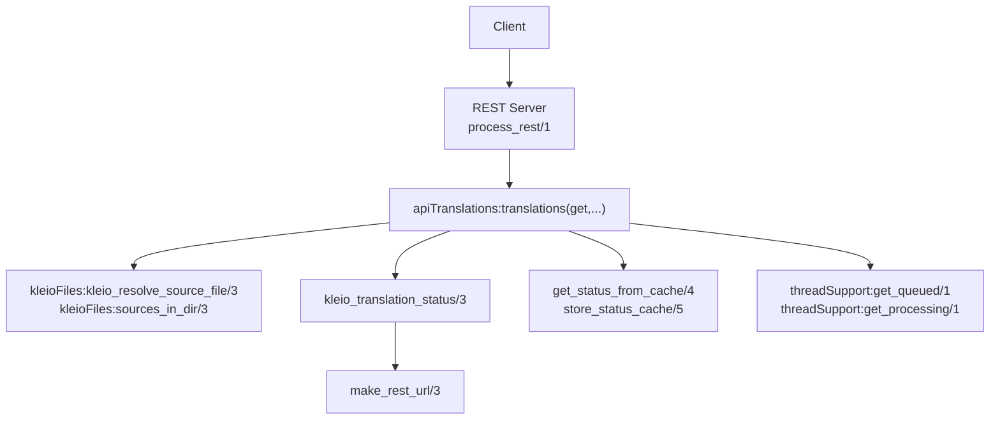
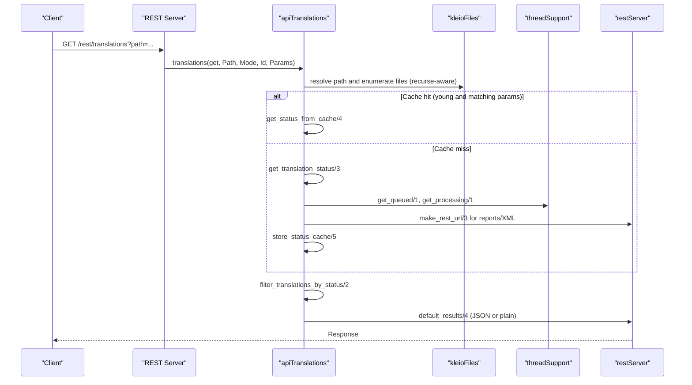
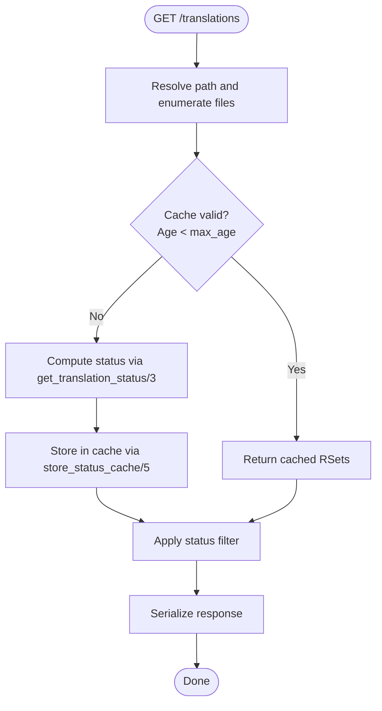
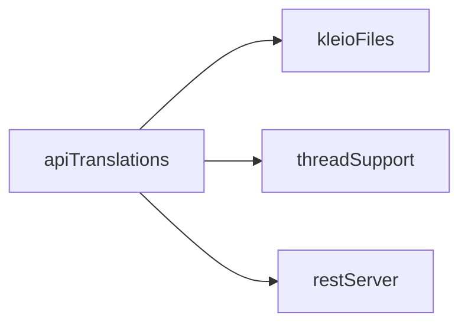

# GET /translations Endpoint

<cite>
**Referenced Files in This Document**
- [apiTranslations.pl](file://src/apiTranslations.pl)
- [threadSupport.pl](file://src/threadSupport.pl)
- [kleioFiles.pl](file://src/kleioFiles.pl)
- [restServer.pl](file://src/restServer.pl)
- [apiCommon.pl](file://src/apiCommon.pl)
- [index.html](file://docs/api/index.html)
</cite>

## Table of Contents
1. [Introduction](#introduction)
2. [Project Structure](#project-structure)
3. [Core Components](#core-components)
4. [Architecture Overview](#architecture-overview)
5. [Detailed Component Analysis](#detailed-component-analysis)
6. [Dependency Analysis](#dependency-analysis)
7. [Performance Considerations](#performance-considerations)
8. [Troubleshooting Guide](#troubleshooting-guide)
9. [Conclusion](#conclusion)

## Introduction
This document provides comprehensive API documentation for the GET /translations endpoint, which retrieves translation status and results for Kleio source files. It explains how to query translation job status with filtering by status codes, how the caching mechanism works to optimize performance for large file sets, and how the response is structured. Practical examples demonstrate status polling, batch retrieval, filtered queries, and integration with monitoring systems. Thread safety, concurrent access patterns, and performance implications of frequent queries are addressed, along with troubleshooting guidance for cache invalidation and status synchronization.

## Project Structure
The GET /translations endpoint is implemented within the translations module and integrates with supporting modules for file discovery, status computation, shared caching, and REST output formatting.

**Diagram sources**
- [apiTranslations.pl](file://src/apiTranslations.pl#L86-L122)
- [kleioFiles.pl](file://src/kleioFiles.pl#L26-L29)
- [restServer.pl](file://src/restServer.pl#L448-L453)
- [threadSupport.pl](file://src/threadSupport.pl#L137-L149)

**Section sources**
- [apiCommon.pl](file://src/apiCommon.pl#L42-L44)
- [index.html](file://docs/api/index.html#L6899-L6924)

## Core Components
- Endpoint: GET /translations
- Purpose: Retrieve translation status and derived file metadata for one or more Kleio source files.
- Authentication: Requires a valid token with appropriate permissions.
- Request parameters:
  - path: Target file or directory path (relative to user sources).
  - recurse: Optional flag to include subdirectories when path is a directory.
  - status: Optional filter to include only files with a specific status code.
  - Additional parameters may influence structure selection and echo behavior during translation.
- Response: A list of file status entries with metadata, timestamps, processing queue states, and URLs to reports and XML exports.

**Section sources**
- [apiTranslations.pl](file://src/apiTranslations.pl#L86-L122)
- [kleioFiles.pl](file://src/kleioFiles.pl#L94-L109)
- [restServer.pl](file://src/restServer.pl#L448-L453)

## Architecture Overview
The GET /translations flow combines file discovery, status computation, optional filtering, and caching. It also integrates with the translation pipeline to surface queue and processing states.

**Diagram sources**
- [apiTranslations.pl](file://src/apiTranslations.pl#L86-L122)
- [kleioFiles.pl](file://src/kleioFiles.pl#L26-L29)
- [threadSupport.pl](file://src/threadSupport.pl#L137-L149)
- [restServer.pl](file://src/restServer.pl#L813-L847)

## Detailed Component Analysis

### Endpoint Definition and Access Control
- The endpoint is mapped to the translations entity with GET method.
- Authentication requires a token with translations permission; otherwise, a forbidden response is thrown.
- The path parameter resolves to an absolute path using token-scoped resolution.

**Section sources**
- [apiCommon.pl](file://src/apiCommon.pl#L42-L44)
- [apiTranslations.pl](file://src/apiTranslations.pl#L86-L97)

### Request Parameters
- path: Specifies the target file or directory. When a directory is provided, the endpoint enumerates files according to recurse and token permissions.
- recurse: When enabled, includes subdirectories in enumeration.
- status: Filters results to include only files whose status equals the provided value. Supported status codes are derived from translation status computation.

Notes on structure selection and echo behavior are documented in the translations POST documentation; similar parameters may influence status computation for consistency.

**Section sources**
- [apiTranslations.pl](file://src/apiTranslations.pl#L34-L50)
- [apiTranslations.pl](file://src/apiTranslations.pl#L86-L122)

### Status Computation and Response Fields
The endpoint computes a comprehensive status for each file, merging Kleio set attributes and processing pipeline state. The resulting record includes:
- name: Basename of the file.
- path: Relative path used internally; absolute paths are not returned.
- source_url: URL to access the source file via the sources entity.
- status: One of V, T, E, W, P, Q, with priority P > Q > others.
- timestamps: modified, modified_string, modified_rfc1123, modified_iso, translated, translated_string.
- sizes: size in bytes.
- directory: Indicates if the entry represents a directory.
- processing queue: ttime, ttime_string, qtime, qtime_string when applicable.
- translation metrics: errors, warnings, version.
- URLs: rpt_url (report), xml_url (XML export), more_url (additional properties).

These fields are assembled by combining kleio_file_set_relative/3 and kleio_processing_status/3.

**Section sources**
- [apiTranslations.pl](file://src/apiTranslations.pl#L493-L576)
- [kleioFiles.pl](file://src/kleioFiles.pl#L94-L109)
- [apiTranslations.pl](file://src/apiTranslations.pl#L580-L595)

### Filtering by Status Codes
The status filter accepts a single status code and retains only files matching that code. The filter supports:
- no: No filtering (include all).
- Specific status code: Include only files with that status.

Filtering is applied after status computation and before response serialization.

**Section sources**
- [apiTranslations.pl](file://src/apiTranslations.pl#L597-L610)

### Caching Mechanism
To reduce server load for frequent polling and large directories, the endpoint caches status results keyed by:
- Absolute path
- Recurse flag
- Token identity

Cache options:
- min_set(N): Only cache if the number of files exceeds N.
- max_age(A): Maximum age for small sets.
- max_age_large_set(O): Extended maximum age for large sets (> large_set(L)).
- large_set(L): Threshold to consider a set “large.”

Cache storage includes:
- status_cache_time: Timestamp of cache creation.
- max_cache_age: Effective maximum age used.
- status_cache_rsets: Cached result sets.

Cache retrieval:
- Validates age against effective max age.
- On invalid age or missing record, the cache is invalidated and recomputation is performed.

**Diagram sources**
- [apiTranslations.pl](file://src/apiTranslations.pl#L101-L122)
- [apiTranslations.pl](file://src/apiTranslations.pl#L168-L232)

**Section sources**
- [apiTranslations.pl](file://src/apiTranslations.pl#L101-L122)
- [apiTranslations.pl](file://src/apiTranslations.pl#L168-L232)

### Thread Safety and Concurrent Access
- The endpoint reads queue and processing state from shared thread pools without modifying them.
- Queue and processing lists are captured via get_queued/1 and get_processing/1, ensuring thread-safe reads.
- Mutexes are used during translation to protect shared resources, preventing race conditions during file updates.

Implications:
- Frequent GET /translations queries are safe and lightweight when served from cache.
- Without cache, status computation iterates over files and queries shared state; still safe due to read-only operations.

**Section sources**
- [threadSupport.pl](file://src/threadSupport.pl#L137-L149)
- [apiTranslations.pl](file://src/apiTranslations.pl#L439-L455)

### Response Format
The response is a list of dictionaries, each representing a file’s status and metadata. Keys include:
- name, path, source_url, status
- timestamps: modified, modified_string, modified_rfc1123, modified_iso, translated, translated_string
- size, directory
- processing queue: ttime, ttime_string, qtime, qtime_string
- translation metrics: errors, warnings, version
- URLs: rpt_url, xml_url, more_url

Serialization is handled by default_results/4, which formats JSON or plain output depending on request mode.

**Section sources**
- [apiTranslations.pl](file://src/apiTranslations.pl#L528-L576)
- [restServer.pl](file://src/restServer.pl#L813-L847)

### Practical Examples

#### Status Polling Pattern
- Poll GET /translations with a short interval while files are queued or processing.
- Use the status field to detect completion (V/E/W) or progress (P/Q).
- Respect cache to avoid overloading the server.

#### Batch Status Retrieval
- Provide a directory path with recurse enabled to retrieve statuses for all files under that directory.
- Apply status filtering to focus on specific outcomes (e.g., errors only).

#### Filtered Queries by Status Codes
- Use status=V to retrieve only validated translations ready for import.
- Use status=E or status=W to monitor problematic files.

#### Integration with Monitoring Systems
- Periodically poll the endpoint and expose results via a dashboard.
- Track trends in processing times (ttime/qtime) and error/warning counts.

[No sources needed since this section provides usage guidance]

## Dependency Analysis
The GET /translations endpoint depends on:
- File resolution and enumeration (kleioFiles)
- Shared thread state for queue and processing (threadSupport)
- REST URL construction for derived assets (restServer)
- Status computation and filtering (apiTranslations)

**Diagram sources**
- [apiTranslations.pl](file://src/apiTranslations.pl#L86-L122)
- [kleioFiles.pl](file://src/kleioFiles.pl#L26-L29)
- [threadSupport.pl](file://src/threadSupport.pl#L137-L149)
- [restServer.pl](file://src/restServer.pl#L448-L453)

**Section sources**
- [apiTranslations.pl](file://src/apiTranslations.pl#L86-L122)
- [kleioFiles.pl](file://src/kleioFiles.pl#L26-L29)
- [threadSupport.pl](file://src/threadSupport.pl#L137-L149)
- [restServer.pl](file://src/restServer.pl#L448-L453)

## Performance Considerations
- Caching thresholds:
  - min_set(N): Avoids caching tiny sets to save memory.
  - large_set(L): Enables extended cache for large directories.
  - max_age(A)/max_age_large_set(O): Balances freshness vs. performance.
- Concurrency:
  - Reads from shared queues/processing are safe and fast.
  - Avoid excessive polling; leverage cache to minimize filesystem scans.
- Scalability:
  - For very large directories, prefer filtered queries (status) to reduce payload size.
  - Consider pagination or chunked retrieval if the system evolves to support it.

[No sources needed since this section provides general guidance]

## Troubleshooting Guide
- Cache not updating:
  - Cause: Cache age exceeded or parameters changed (path/recurse/token).
  - Resolution: Wait for cache to expire or trigger a fresh computation; ensure consistent parameters.
- Unexpected empty results:
  - Verify path resolution and recurse flag; confirm token permissions.
- Stale status (P/Q not clearing):
  - Ensure translation workers are running and processing; check queue/processing state.
- Excessive server load:
  - Reduce polling frequency; rely on cache; apply status filters.

**Section sources**
- [apiTranslations.pl](file://src/apiTranslations.pl#L168-L232)
- [threadSupport.pl](file://src/threadSupport.pl#L137-L149)

## Conclusion
The GET /translations endpoint offers a robust, cache-aware mechanism to query translation statuses across single files and entire directories. By leveraging filtering, caching, and thread-safe reads, it supports efficient monitoring and integration scenarios. Proper use of parameters and awareness of cache behavior ensures optimal performance and reliability.