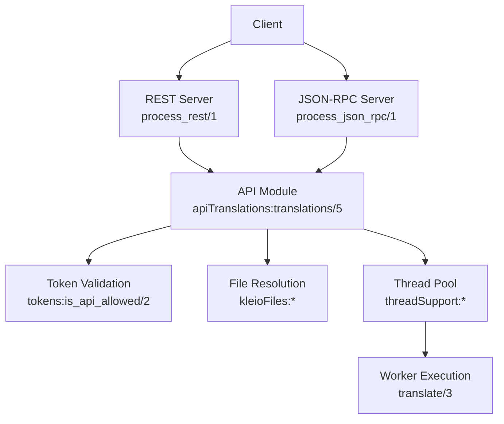
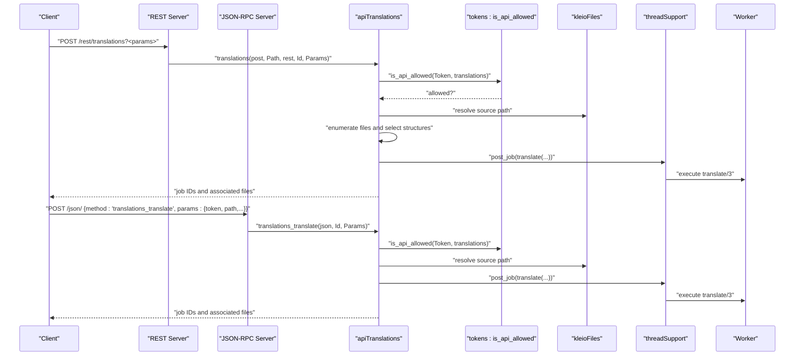
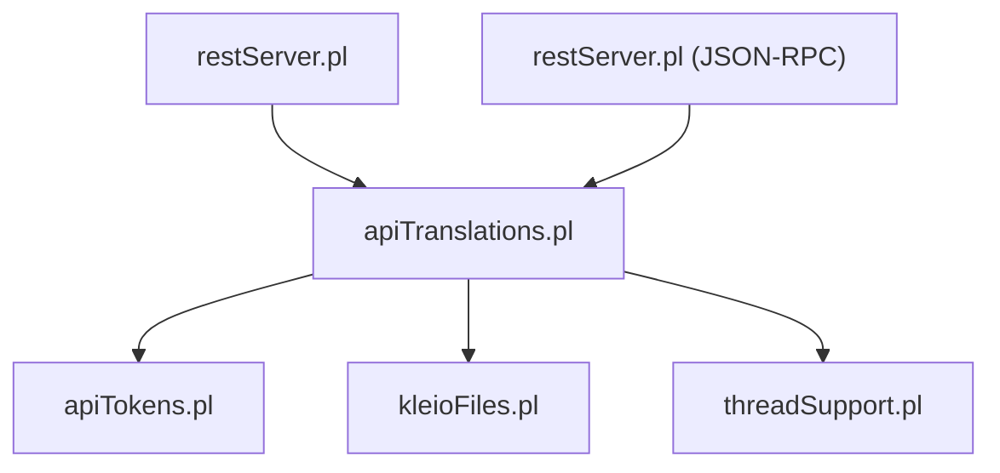

# POST /translations Endpoint

<cite>
**Referenced Files in This Document**
- [apiTranslations.pl](file://src/apiTranslations.pl)
- [restServer.pl](file://src/restServer.pl)
- [threadSupport.pl](file://src/threadSupport.pl)
- [kleioFiles.pl](file://src/kleioFiles.pl)
- [apiTokens.pl](file://src/apiTokens.pl)
- [apiCommon.pl](file://tests/stable/apiCommon.pl)
- [api.json](file://api/postman/api.json)
</cite>

## Table of Contents
1. [Introduction](#introduction)
2. [Project Structure](#project-structure)
3. [Core Components](#core-components)
4. [Architecture Overview](#architecture-overview)
5. [Detailed Component Analysis](#detailed-component-analysis)
6. [Dependency Analysis](#dependency-analysis)
7. [Performance Considerations](#performance-considerations)
8. [Troubleshooting Guide](#troubleshooting-guide)
9. [Conclusion](#conclusion)
10. [Appendices](#appendices)

## Introduction
This document provides comprehensive API documentation for the POST /translations endpoint used to initiate document translations in the system. It explains how to start translation jobs via REST and JSON-RPC, details the supported parameters (structure file selection, echo options, recursion, parallel processing), authentication and permission validation, request/response formats, error handling, and operational guidance for multi-user environments and large-scale translation workloads.

## Project Structure
The translation endpoint integrates with the REST and JSON-RPC servers, token-based authentication, thread pooling for parallel execution, and file system utilities for resolving source and structure paths. The following diagram maps the primary components involved in the POST /translations flow.

**Diagram sources**
- [restServer.pl](file://src/restServer.pl#L491-L515)
- [restServer.pl](file://src/restServer.pl#L656-L726)
- [apiTranslations.pl](file://src/apiTranslations.pl#L52-L82)
- [kleioFiles.pl](file://src/kleioFiles.pl#L26-L29)
- [threadSupport.pl](file://src/threadSupport.pl#L41-L60)

**Section sources**
- [restServer.pl](file://src/restServer.pl#L491-L515)
- [restServer.pl](file://src/restServer.pl#L656-L726)
- [apiTranslations.pl](file://src/apiTranslations.pl#L52-L82)
- [kleioFiles.pl](file://src/kleioFiles.pl#L26-L29)
- [threadSupport.pl](file://src/threadSupport.pl#L41-L60)

## Core Components
- REST endpoint routing and decoding:
  - REST handler for POST /rest/translations resolves the entity and method, extracts Authorization and parameters, validates tokens, and invokes the API.
- JSON-RPC endpoint:
  - JSON-RPC handler accepts POST requests to the /json/ endpoint, decodes method and parameters, validates tokens, and executes the requested operation.
- Translation API:
  - The translations/5 predicate validates permissions, resolves the target path (file or directory), enumerates files, selects structure files, spawns jobs, and returns job identifiers and associated files.
- Authentication and permissions:
  - Uses tokens:is_api_allowed/2 to validate that the token grants the "translations" permission.
- Parallel execution:
  - Uses threadSupport:create_workers/1 and post_job/2 to distribute translation tasks across worker threads.
- File resolution:
  - Uses kleioFiles:kleio_resolve_source_file/3 and kleioFiles:kleio_resolve_structure_file/3 to resolve absolute paths and structure files.

**Section sources**
- [restServer.pl](file://src/restServer.pl#L547-L579)
- [restServer.pl](file://src/restServer.pl#L752-L769)
- [apiTranslations.pl](file://src/apiTranslations.pl#L52-L82)
- [apiTokens.pl](file://src/apiTokens.pl#L50-L70)
- [threadSupport.pl](file://src/threadSupport.pl#L41-L60)
- [kleioFiles.pl](file://src/kleioFiles.pl#L26-L29)

## Architecture Overview
The POST /translations flow supports two entry points:
- REST: POST /rest/translations with query parameters (e.g., recurse, status).
- JSON-RPC: POST /json/ with method "translations_translate" and params including token and path.

Both paths converge on the same translations/5 predicate, which:
- Validates the bearer token against is_api_allowed/2 with the "translations" action.
- Resolves the target path to an absolute location.
- Enumerates files (single file or directory traversal).
- Selects structure files (explicitly provided or discovered).
- Spawns translation jobs (parallel or sequential).
- Returns job identifiers and associated files.

**Diagram sources**
- [restServer.pl](file://src/restServer.pl#L491-L515)
- [restServer.pl](file://src/restServer.pl#L656-L726)
- [apiTranslations.pl](file://src/apiTranslations.pl#L52-L82)
- [apiTranslations.pl](file://src/apiTranslations.pl#L241-L260)
- [threadSupport.pl](file://src/threadSupport.pl#L109-L124)

**Section sources**
- [restServer.pl](file://src/restServer.pl#L491-L515)
- [restServer.pl](file://src/restServer.pl#L656-L726)
- [apiTranslations.pl](file://src/apiTranslations.pl#L52-L82)
- [apiTranslations.pl](file://src/apiTranslations.pl#L241-L260)
- [threadSupport.pl](file://src/threadSupport.pl#L109-L124)

## Detailed Component Analysis

### Endpoint Definition
- REST path: POST /rest/translations
- JSON-RPC method: translations_translate
- Purpose: Start translation jobs for a single file or a directory of files.

Parameters (REST):
- path: Target file or directory (required).
- recurse: yes/no for recursive directory traversal.
- status: filter by translation status.
- echo: yes/no to include source lines in reports.
- spawn: yes/no to distribute files to workers (parallel) or process sequentially.
- structure: explicit structure file path (optional; otherwise resolved automatically).

Parameters (JSON-RPC):
- token: Bearer token (required).
- path: Target file or directory (required).
- recurse/status/echo/spawn/structure: same semantics as REST.

Authentication:
- Authorization: Bearer <token>
- Permission: is_api_allowed(Token, translations)

Response:
- REST: default_results/4 returns job IDs and associated files.
- JSON-RPC: translations_results/4 returns a dictionary with job{job, sources} entries.

**Section sources**
- [apiTranslations.pl](file://src/apiTranslations.pl#L34-L51)
- [apiTranslations.pl](file://src/apiTranslations.pl#L52-L82)
- [apiTranslations.pl](file://src/apiTranslations.pl#L613-L634)
- [restServer.pl](file://src/restServer.pl#L547-L579)
- [restServer.pl](file://src/restServer.pl#L752-L769)
- [apiTokens.pl](file://src/apiTokens.pl#L50-L70)

### Parameter Specifications
- structure:
  - Explicit path overrides automatic discovery.
  - If missing, the system attempts to discover a structure file based on the source file and directory context.
  - Validation ensures the selected structure file exists; otherwise, an error is thrown.
- echo:
  - When yes, reports include source lines.
- recurse:
  - When yes, enumerates files recursively under the target directory.
- spawn:
  - When yes, distributes individual files to separate workers for parallel processing.
  - When no, posts a single job with all files and a single structure file processing pass.
- status:
  - Used by the GET endpoint to filter results by status; not enforced during POST.

**Section sources**
- [apiTranslations.pl](file://src/apiTranslations.pl#L74-L77)
- [apiTranslations.pl](file://src/apiTranslations.pl#L263-L293)
- [apiTranslations.pl](file://src/apiTranslations.pl#L295-L312)

### Request Body Structure (JSON-RPC)
- Required:
  - method: "translations_translate"
  - params.token: Bearer token
  - params.path: Target file or directory
- Optional:
  - params.recurse, params.status, params.echo, params.spawn, params.structure

Example (Postman-style):
- Content-Type: application/json
- Body includes token, path, and optional parameters.

**Section sources**
- [restServer.pl](file://src/restServer.pl#L752-L769)
- [api.json](file://api/postman/api.json#L1395-L1398)

### Response Format
- REST:
  - default_results/4 returns a list of job identifiers and associated files.
- JSON-RPC:
  - translations_results/4 returns a dictionary with entries of the form {job: JobId, sources: [Files]}.

The response provides identifiers to poll or query the translation status via the GET endpoint.

**Section sources**
- [apiTranslations.pl](file://src/apiTranslations.pl#L613-L634)
- [apiTranslations.pl](file://src/apiTranslations.pl#L632-L642)

### Error Handling Mechanisms
- Permission denied:
  - Throws http_reply(forbidden(...)) when is_api_allowed/2 fails for the "translations" action.
- Token issues:
  - Missing or invalid Authorization header or token causes appropriate error responses.
- Structure file validation:
  - If an explicitly provided structure file does not exist, an error is thrown.
- Default error propagation:
  - Errors are caught by the server and formatted via return_error/2.

**Section sources**
- [apiTranslations.pl](file://src/apiTranslations.pl#L55-L63)
- [apiTranslations.pl](file://src/apiTranslations.pl#L275-L293)
- [restServer.pl](file://src/restServer.pl#L544-L546)
- [restServer.pl](file://src/restServer.pl#L676-L683)

### Practical Examples

#### Single File Translation (JSON-RPC)
- Method: translations_translate
- Params: { token, path: "path/to/file.cli", echo: "no", spawn: "no" }

**Section sources**
- [api.json](file://api/postman/api.json#L1395-L1398)

#### Directory Batch Processing with Recursion
- REST: POST /rest/translations?id={{request_id}}&path=sources/&recurse=yes
- JSON-RPC: translations_translate with recurse:"yes"

**Section sources**
- [api.json](file://api/postman/api.json#L3275-L3296)
- [apiCommon.pl](file://tests/stable/apiCommon.pl#L61-L63)

#### Parallel vs Sequential Execution Modes
- spawn:"yes" distributes files to workers for parallel processing.
- spawn:"no" processes all files sequentially with a single structure pass.

**Section sources**
- [apiTranslations.pl](file://src/apiTranslations.pl#L241-L260)

#### Structure File Specification
- Explicit structure file:
  - params.structure: "path/to/custom-structure.yaml"
- Automatic discovery:
  - If omitted, the system attempts to match structure files based on the source file and directory context.

**Section sources**
- [apiTranslations.pl](file://src/apiTranslations.pl#L263-L293)
- [apiTranslations.pl](file://src/apiTranslations.pl#L314-L382)

### Thread Safety Considerations
- Worker model:
  - Jobs are posted to a thread pool or message queue and executed concurrently.
- Mutex protection:
  - translate/3 uses with_mutex/2 to synchronize access to structure and data files during processing.
- Multi-user fairness:
  - Using spawn:"no" is recommended in multi-user environments to improve access to free workers.

**Section sources**
- [threadSupport.pl](file://src/threadSupport.pl#L41-L60)
- [apiTranslations.pl](file://src/apiTranslations.pl#L439-L455)

### Performance Optimization Strategies
- Use spawn:"yes" for large directories to leverage parallelism.
- Prefer spawn:"no" in shared environments to reduce contention.
- Limit recursion depth by avoiding excessive recurse:"yes" on very large trees.
- Cache-friendly status queries:
  - The GET endpoint caches status results for repeated queries, reducing server load.

**Section sources**
- [apiTranslations.pl](file://src/apiTranslations.pl#L168-L232)

## Dependency Analysis
The POST /translations endpoint depends on:
- REST/JSON-RPC server for request decoding and response formatting.
- Token validation for authorization.
- File resolution utilities for paths and structure files.
- Thread support for job distribution and execution.

**Diagram sources**
- [restServer.pl](file://src/restServer.pl#L491-L515)
- [restServer.pl](file://src/restServer.pl#L656-L726)
- [apiTranslations.pl](file://src/apiTranslations.pl#L52-L82)
- [apiTokens.pl](file://src/apiTokens.pl#L50-L70)
- [kleioFiles.pl](file://src/kleioFiles.pl#L26-L29)
- [threadSupport.pl](file://src/threadSupport.pl#L41-L60)

**Section sources**
- [restServer.pl](file://src/restServer.pl#L491-L515)
- [restServer.pl](file://src/restServer.pl#L656-L726)
- [apiTranslations.pl](file://src/apiTranslations.pl#L52-L82)
- [apiTokens.pl](file://src/apiTokens.pl#L50-L70)
- [kleioFiles.pl](file://src/kleioFiles.pl#L26-L29)
- [threadSupport.pl](file://src/threadSupport.pl#L41-L60)

## Performance Considerations
- Parallelism:
  - spawn:"yes" scales with available workers; tune KLEIO_SERVER_WORKERS accordingly.
- Resource contention:
  - Mutex synchronization around structure and data files prevents corruption but may serialize access to shared resources.
- Caching:
  - Status queries cache results to avoid repeated computation for large sets.

[No sources needed since this section provides general guidance]

## Troubleshooting Guide
- 403 Forbidden:
  - Ensure the token has the "translations" permission validated by is_api_allowed/2.
- 400 Bad Request:
  - Verify Authorization header format ("Bearer <token>") and presence of required parameters.
- Structure file errors:
  - If a custom structure file is provided, confirm it exists and is readable.
- No jobs returned:
  - Confirm the path resolves to existing files and that recurse is set appropriately.

**Section sources**
- [apiTranslations.pl](file://src/apiTranslations.pl#L55-L63)
- [apiTranslations.pl](file://src/apiTranslations.pl#L275-L293)
- [restServer.pl](file://src/restServer.pl#L544-L546)

## Conclusion
The POST /translations endpoint provides a robust mechanism to start translation jobs for single files or entire directories. By combining REST and JSON-RPC entry points, flexible parameter control (structure selection, echo, recursion, parallelism), and secure token-based authorization, it supports both interactive and automated workflows. Proper tuning of parallelism and awareness of thread safety and caching characteristics enable efficient large-scale translation operations.

[No sources needed since this section summarizes without analyzing specific files]

## Appendices

### API Definitions

- REST
  - Method: POST
  - Path: /rest/translations
  - Headers: Authorization: Bearer <token>
  - Query parameters:
    - path: Target file or directory
    - recurse: yes/no
    - status: filter by status
    - echo: yes/no
    - spawn: yes/no
    - structure: optional explicit structure file path

- JSON-RPC
  - Endpoint: /json/
  - Method: translations_translate
  - Params:
    - token: Bearer token
    - path: Target file or directory
    - recurse/status/echo/spawn/structure: optional

**Section sources**
- [restServer.pl](file://src/restServer.pl#L547-L579)
- [restServer.pl](file://src/restServer.pl#L752-L769)
- [apiCommon.pl](file://tests/stable/apiCommon.pl#L61-L63)
- [api.json](file://api/postman/api.json#L1395-L1398)