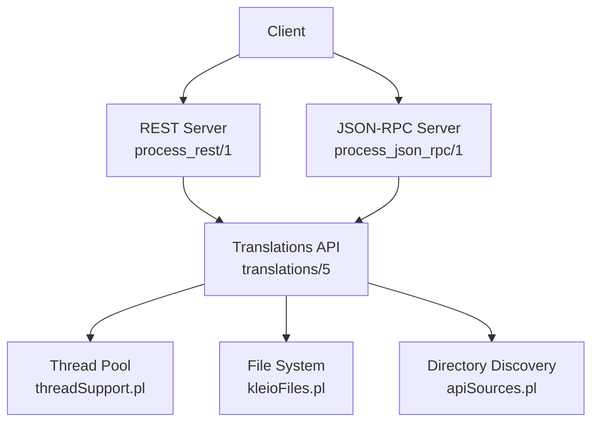
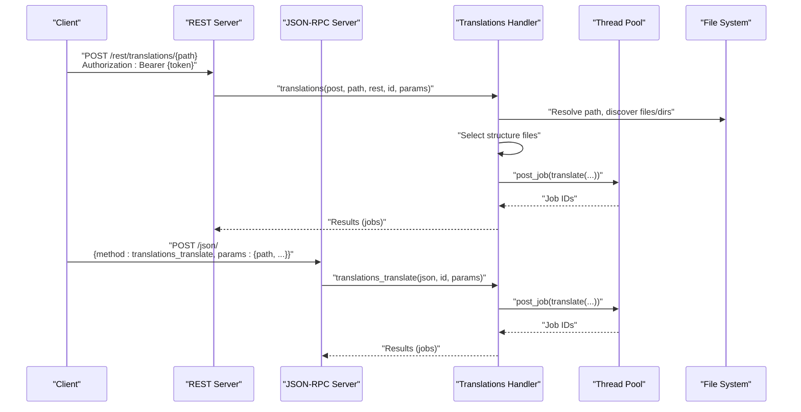
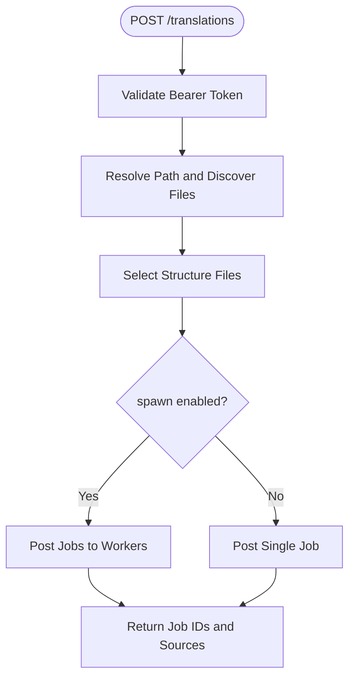
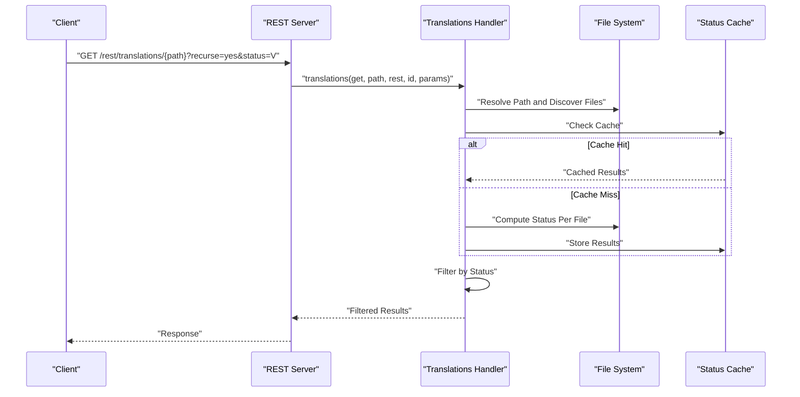
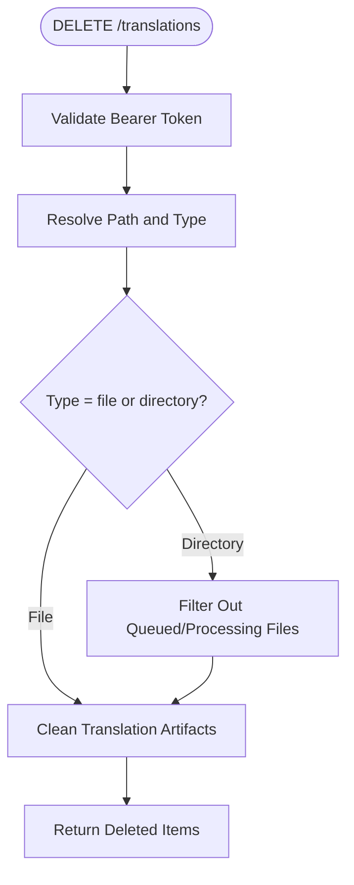
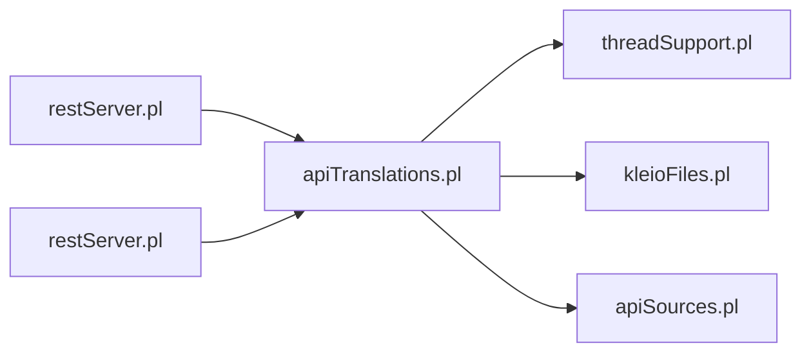

# Translations API

<cite>
**Referenced Files in This Document**
- [apiTranslations.pl](file://src/apiTranslations.pl)
- [restServer.pl](file://src/restServer.pl)
- [threadSupport.pl](file://src/threadSupport.pl)
- [kleioFiles.pl](file://src/kleioFiles.pl)
- [apiSources.pl](file://src/apiSources.pl)
- [translation_results.md](file://docs/doc/translation_results.md)
- [api-tests.postman_collection.json](file://api/postman/api-tests.postman_collection.json)
</cite>

## Table of Contents
1. [Introduction](#introduction)
2. [Project Structure](#project-structure)
3. [Core Components](#core-components)
4. [Architecture Overview](#architecture-overview)
5. [Detailed Component Analysis](#detailed-component-analysis)
6. [Dependency Analysis](#dependency-analysis)
7. [Performance Considerations](#performance-considerations)
8. [Troubleshooting Guide](#troubleshooting-guide)
9. [Conclusion](#conclusion)
10. [Appendices](#appendices)

## Introduction
This document provides comprehensive API documentation for the translations service endpoints. It covers:
- POST /translations: start translations with parameters for structure file selection, echo options, recursion, and parallel processing.
- GET /translations: retrieve translation status with filtering by status codes and recursive directory traversal.
- DELETE /translations: clean translation results for a file or directory.

It includes request/response schemas, authentication requirements using bearer tokens, parameter validation rules, error handling, practical curl examples, and operational guidance for thread safety, job queuing, and performance optimization.

## Project Structure
The translations API is implemented as part of the REST and JSON-RPC server. The key modules involved are:
- REST routing and decoding: [restServer.pl](file://src/restServer.pl)
- Translation orchestration: [apiTranslations.pl](file://src/apiTranslations.pl)
- Thread pool and job queue: [threadSupport.pl](file://src/threadSupport.pl)
- File system utilities and translation artifacts: [kleioFiles.pl](file://src/kleioFiles.pl)
- Directory traversal and file discovery: [apiSources.pl](file://src/apiSources.pl)

**Diagram sources**
- [restServer.pl](file://src/restServer.pl#L469-L516)
- [apiTranslations.pl](file://src/apiTranslations.pl#L34-L82)
- [threadSupport.pl](file://src/threadSupport.pl#L33-L64)
- [kleioFiles.pl](file://src/kleioFiles.pl#L53-L109)
- [apiSources.pl](file://src/apiSources.pl#L88-L104)

**Section sources**
- [restServer.pl](file://src/restServer.pl#L469-L516)
- [apiTranslations.pl](file://src/apiTranslations.pl#L34-L82)
- [threadSupport.pl](file://src/threadSupport.pl#L33-L64)
- [kleioFiles.pl](file://src/kleioFiles.pl#L53-L109)
- [apiSources.pl](file://src/apiSources.pl#L88-L104)

## Core Components
- Authentication and Authorization
  - Bearer token required in Authorization header.
  - Token decoded and validated; API permissions enforced per token.
- Endpoint Routing
  - REST: /rest/translations/{path} with methods GET, POST, DELETE.
  - JSON-RPC: methods translations_translate, translations_get, translations_delete.
- Parameter Handling
  - POST: structure, echo, recurse, spawn, status, token.
  - GET: recurse, status, token.
  - DELETE: token.
- Job Queueing and Parallelism
  - spawn controls whether jobs are distributed to workers (parallel) or run sequentially.
  - Thread pool manages queued and processing jobs.
- Status Reporting
  - Status aggregation per file with caching for large directories.

**Section sources**
- [restServer.pl](file://src/restServer.pl#L547-L579)
- [apiTranslations.pl](file://src/apiTranslations.pl#L52-L82)
- [threadSupport.pl](file://src/threadSupport.pl#L104-L125)

## Architecture Overview
The translations API integrates with the REST and JSON-RPC servers. Requests are decoded, validated, and dispatched to the translations handler, which resolves paths, selects structure files, posts jobs to the thread pool, and returns results.

**Diagram sources**
- [restServer.pl](file://src/restServer.pl#L469-L516)
- [apiTranslations.pl](file://src/apiTranslations.pl#L52-L82)
- [threadSupport.pl](file://src/threadSupport.pl#L104-L125)

## Detailed Component Analysis

### POST /translations
Starts translation jobs for a file or directory.

- Endpoint
  - REST: POST /rest/translations/{path}
  - JSON-RPC: translations_translate
- Authentication
  - Bearer token required; must have translations permission.
- Parameters
  - path (optional): target file or directory.
  - structure: structure file to use (optional; defaults to configured default).
  - echo: include source lines in rpt if yes.
  - recurse: traverse subdirectories if yes.
  - spawn: distribute jobs to workers for parallel processing if yes; otherwise run sequentially.
  - token: bearer token.
- Behavior
  - Resolves absolute path and discovers files (single file or directory traversal).
  - Selects structure files per target file.
  - Posts jobs to thread pool; returns job identifiers and associated files.
- Responses
  - REST: list of jobs with job IDs and source files.
  - JSON-RPC: dictionary with job IDs and source lists.

**Diagram sources**
- [apiTranslations.pl](file://src/apiTranslations.pl#L52-L82)
- [threadSupport.pl](file://src/threadSupport.pl#L104-L125)

**Section sources**
- [apiTranslations.pl](file://src/apiTranslations.pl#L34-L82)
- [restServer.pl](file://src/restServer.pl#L547-L579)
- [apiSources.pl](file://src/apiSources.pl#L88-L104)

### GET /translations
Retrieves translation status for a file or directory.

- Endpoint
  - REST: GET /rest/translations/{path}
  - JSON-RPC: translations_get
- Authentication
  - Bearer token required; must have translations permission.
- Parameters
  - path (optional): target file or directory.
  - recurse: traverse subdirectories if yes.
  - status: filter by status (T, V, E, W, P, Q, D).
  - token: bearer token.
- Behavior
  - Resolves path and discovers files.
  - Computes status per file; caches results for large sets.
  - Filters by status if provided.
- Responses
  - Array of dictionaries containing file metadata, status, timestamps, sizes, and URLs to reports and exports.

**Diagram sources**
- [apiTranslations.pl](file://src/apiTranslations.pl#L86-L122)
- [kleioFiles.pl](file://src/kleioFiles.pl#L53-L109)

**Section sources**
- [apiTranslations.pl](file://src/apiTranslations.pl#L86-L122)
- [kleioFiles.pl](file://src/kleioFiles.pl#L53-L109)

### DELETE /translations
Deletes translation results for a file or directory.

- Endpoint
  - REST: DELETE /rest/translations/{path}
  - JSON-RPC: translations_delete
- Authentication
  - Bearer token required; must have translations permission.
- Behavior
  - Resolves path; determines if path is file or directory.
  - For directories: filters out files currently queued or processing.
  - Deletes translation artifacts (xml, err, rpt, ids, files.json, old).
- Responses
  - List of deleted items.

**Diagram sources**
- [apiTranslations.pl](file://src/apiTranslations.pl#L124-L138)
- [kleioFiles.pl](file://src/kleioFiles.pl#L111-L144)

**Section sources**
- [apiTranslations.pl](file://src/apiTranslations.pl#L124-L138)
- [kleioFiles.pl](file://src/kleioFiles.pl#L111-L144)

### Request/Response Schemas

- POST /translations
  - Request body (REST): form-encoded parameters (structure, echo, recurse, spawn, token).
  - JSON-RPC params: path, structure, echo, recurse, spawn, token.
  - Response (REST): list of job entries with job IDs and source files.
  - Response (JSON-RPC): dictionary with job IDs and source arrays.

- GET /translations
  - Query parameters: recurse, status, token.
  - Response: array of dictionaries with keys:
    - name, path, source_url, status, modified, modified_string, modified_rfc1123, modified_iso, size, directory
    - ttime, ttime_string, qtime, qtime_string
    - errors, warnings, version, translated, translated_string
    - rpt_url, xml_url
    - Additional keys may include processing or queued indicators.

- DELETE /translations
  - Request parameters: token.
  - Response: list of deleted items.

**Section sources**
- [apiTranslations.pl](file://src/apiTranslations.pl#L613-L642)
- [kleioFiles.pl](file://src/kleioFiles.pl#L53-L109)

### Authentication and Authorization
- Header: Authorization: Bearer {token}
- Token decoding and validation occur during request decoding.
- Permission checks enforce that the token grants translations access.

**Section sources**
- [restServer.pl](file://src/restServer.pl#L615-L624)
- [restServer.pl](file://src/restServer.pl#L556-L562)
- [apiTranslations.pl](file://src/apiTranslations.pl#L52-L63)

### Parameter Validation Rules
- Required
  - token: bearer token present and valid.
- Optional
  - structure: must exist if provided; defaults to configured default if absent.
  - echo: boolean-like values supported.
  - recurse: boolean-like values supported.
  - spawn: boolean-like values; affects job distribution.
  - status: one of T, V, E, W, P, Q, D (or combinations via filtering).
- Validation outcomes
  - Missing token: 400 Bad Request.
  - Invalid token: 400 Bad Request.
  - Forbidden: 403 Forbidden.
  - Not Found: 404 Not Found (when path does not resolve).

**Section sources**
- [restServer.pl](file://src/restServer.pl#L556-L579)
- [apiTranslations.pl](file://src/apiTranslations.pl#L272-L293)

### Error Handling
- HTTP errors raised as exceptions and converted to standardized responses.
- Common errors include:
  - 400 Bad Request: missing or invalid token.
  - 403 Forbidden: insufficient permissions.
  - 404 Not Found: path not found.
  - 500 Internal Server Error: unexpected errors during processing.

**Section sources**
- [restServer.pl](file://src/restServer.pl#L544-L546)
- [apiTranslations.pl](file://src/apiTranslations.pl#L58-L63)
- [apiTranslations.pl](file://src/apiTranslations.pl#L129-L132)
- [apiTranslations.pl](file://src/apiTranslations.pl#L281-L291)

### Practical Examples

- Start a translation for a single file
  - REST
    - curl -X POST "http://localhost:8088/rest/translations/sources/paroquiais/baptismos/bapt1714.cli" \
      -H "Authorization: Bearer YOUR_TOKEN" \
      -F "structure=structures/baptismos.yaml" \
      -F "echo=yes" \
      -F "spawn=yes"
  - JSON-RPC
    - curl -X POST "http://localhost:8089/json/" \
      -H "Content-Type: application/json" \
      -d '{"jsonrpc":"2.0","method":"translations_translate","params":{"path":"sources/paroquiais/baptismos/bapt1714.cli","structure":"structures/baptismos.yaml","echo":"yes","spawn":"yes","token":"YOUR_TOKEN"},"id":1}'

- Retrieve translation status for a directory
  - curl -X GET "http://localhost:8088/rest/translations/sources/paroquiais/baptismos?recurse=yes&status=V" \
      -H "Authorization: Bearer YOUR_TOKEN"

- Clean translation results for a directory
  - curl -X DELETE "http://localhost:8088/rest/translations/sources/paroquiais/baptismos" \
      -H "Authorization: Bearer YOUR_TOKEN"

Notes:
- Replace YOUR_TOKEN with a valid bearer token.
- Adjust paths to match your environment.
- Use spawn for large directories to improve throughput; use spawn=no for multi-user fairness.

**Section sources**
- [api-tests.postman_collection.json](file://api/postman/api-tests.postman_collection.json#L1-L200)
- [translation_results.md](file://docs/doc/translation_results.md#L1-L81)

## Dependency Analysis
The translations API depends on:
- REST/JSON-RPC server for request routing and decoding.
- Thread pool for job distribution and parallel execution.
- File system utilities for artifact management and status computation.
- Directory discovery for recursive traversal.

**Diagram sources**
- [restServer.pl](file://src/restServer.pl#L469-L516)
- [apiTranslations.pl](file://src/apiTranslations.pl#L21-L32)
- [threadSupport.pl](file://src/threadSupport.pl#L1-L25)
- [kleioFiles.pl](file://src/kleioFiles.pl#L1-L33)
- [apiSources.pl](file://src/apiSources.pl#L1-L27)

**Section sources**
- [apiTranslations.pl](file://src/apiTranslations.pl#L21-L32)
- [restServer.pl](file://src/restServer.pl#L469-L516)
- [threadSupport.pl](file://src/threadSupport.pl#L1-L25)
- [kleioFiles.pl](file://src/kleioFiles.pl#L1-L33)
- [apiSources.pl](file://src/apiSources.pl#L1-L27)

## Performance Considerations
- Parallel Processing
  - Use spawn=yes to distribute jobs across workers for large directories.
  - Use spawn=no to avoid contention in multi-user environments.
- Caching
  - Status responses are cached for large sets to reduce repeated computation.
  - Cache age varies by set size; small sets are not cached.
- Worker Pool
  - Configure worker count via environment variable KLEIO_SERVER_WORKERS.
- Recursive Traversal
  - Use recurse=yes judiciously; it increases I/O and computation.
- Echo Reports
  - Enabling echo adds verbosity to rpt files; consider disabling for bulk processing.

**Section sources**
- [apiTranslations.pl](file://src/apiTranslations.pl#L106-L118)
- [apiTranslations.pl](file://src/apiTranslations.pl#L217-L232)
- [restServer.pl](file://src/restServer.pl#L179-L182)

## Troubleshooting Guide
- Authentication Failures
  - Ensure Authorization header includes a valid bearer token.
  - Verify token permissions include translations.
- Forbidden Access
  - Confirm the token has translations permission; otherwise receive 403.
- Not Found Paths
  - Ensure the path resolves to an existing file or directory under sources.
- Long-Running Status Queries
  - Use caching-friendly patterns and status filtering to minimize server load.
- Cleaning Issues
  - Files currently queued or processing are not deleted; wait or cancel jobs first.

**Section sources**
- [restServer.pl](file://src/restServer.pl#L556-L579)
- [apiTranslations.pl](file://src/apiTranslations.pl#L129-L132)
- [kleioFiles.pl](file://src/kleioFiles.pl#L111-L144)

## Conclusion
The translations API provides robust endpoints for starting, monitoring, and cleaning translation results. With bearer token authentication, flexible parameters for structure selection and parallel processing, and built-in caching and thread pooling, it supports efficient batch processing and reliable status reporting. Use the provided examples and guidelines to integrate the API effectively in automated workflows.

## Appendices

### Endpoint Summary
- POST /rest/translations/{path}
  - Purpose: Start translations for a file or directory.
  - Parameters: structure, echo, recurse, spawn, token.
  - Response: Jobs with IDs and source files.

- GET /rest/translations/{path}
  - Purpose: Retrieve translation status.
  - Parameters: recurse, status, token.
  - Response: Array of file status dictionaries.

- DELETE /rest/translations/{path}
  - Purpose: Clean translation results.
  - Parameters: token.
  - Response: List of deleted items.

**Section sources**
- [apiTranslations.pl](file://src/apiTranslations.pl#L34-L82)
- [apiTranslations.pl](file://src/apiTranslations.pl#L86-L122)
- [apiTranslations.pl](file://src/apiTranslations.pl#L124-L138)