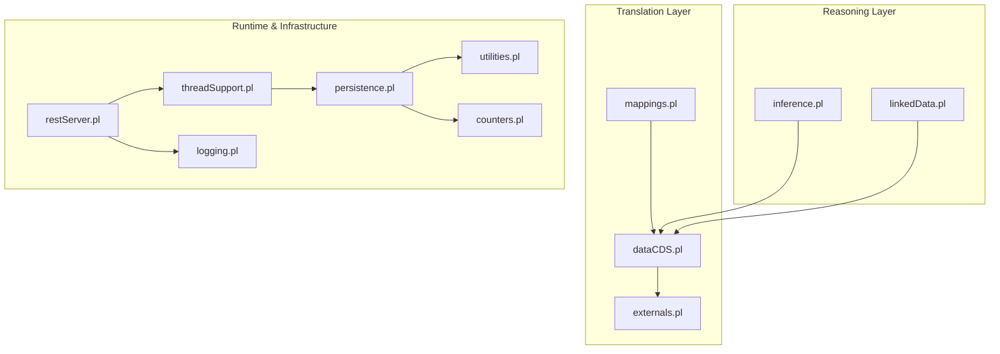
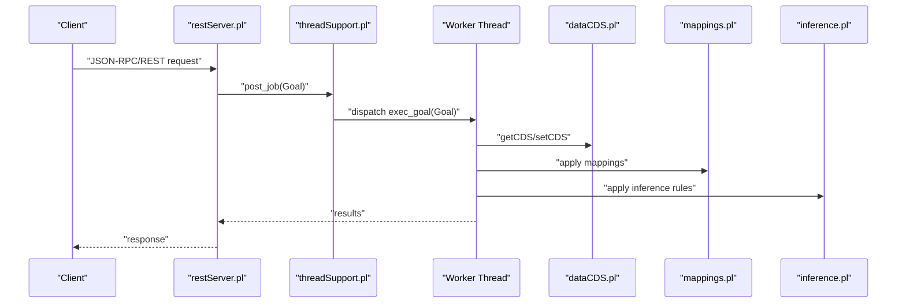
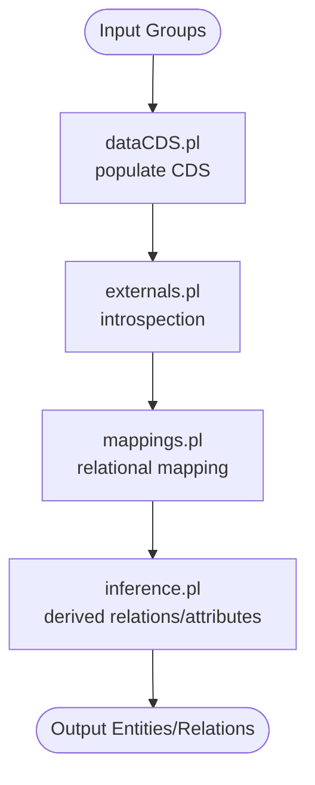
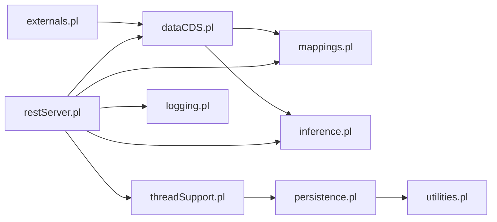

# Advanced Topics

<cite>
**Referenced Files in This Document**
- [mappings.pl](file://src/mappings.pl)
- [inference.pl](file://src/inference.pl)
- [externals.pl](file://src/externals.pl)
- [threadSupport.pl](file://src/threadSupport.pl)
- [restServer.pl](file://src/restServer.pl)
- [logging.pl](file://src/logging.pl)
- [persistence.pl](file://src/persistence.pl)
- [utilities.pl](file://src/utilities.pl)
- [counters.pl](file://src/counters.pl)
- [dataCDS.pl](file://src/dataCDS.pl)
- [linkedData.pl](file://src/linkedData.pl)
- [inference_sample.yml](file://tests/kleio-home/inferences/inference_sample.yml)
- [person-mapping.yml](file://tests/kleio-home/mappings/person-mapping.yml)
- [sample-mapping.yml](file://tests/kleio-home/mappings/sample-mapping.yml)
</cite>

## Table of Contents
1. [Introduction](#introduction)
2. [Project Structure](#project-structure)
3. [Core Components](#core-components)
4. [Architecture Overview](#architecture-overview)
5. [Detailed Component Analysis](#detailed-component-analysis)
6. [Dependency Analysis](#dependency-analysis)
7. [Performance Considerations](#performance-considerations)
8. [Troubleshooting Guide](#troubleshooting-guide)
9. [Conclusion](#conclusion)
10. [Appendices](#appendices)

## Introduction
This document presents advanced topics for expert-level usage and customization of the Timelink Kleio system. It focuses on:
- Advanced mapping rule development: complex transformations, conditional mappings, and recursive processing
- Custom inference rule creation for domain-specific relationship discovery and data enrichment
- Plugin development patterns for extending functionality and integrating external services
- Advanced configuration, performance tuning, and optimization techniques
- Integration patterns with external systems and specialized processing workflows
- Advanced debugging, profiling, and performance analysis methods
- Scalability considerations, distributed processing, and high-throughput scenarios
- Guidelines for maintaining backward compatibility and evolving the system sustainably

## Project Structure
Kleio is implemented in SWI-Prolog with modular components handling translation, inference, REST server, threading, persistence, logging, and linked data. Key modules include:
- Mapping engine for relational schema definitions
- Inference engine for automatic relations and attributes
- REST server with JSON-RPC support and worker pools
- Threading utilities for distributed processing
- Logging and persistence utilities
- Linked data utilities for cross-entity linking

**Diagram sources**
- [mappings.pl](file://src/mappings.pl#L1-L518)
- [inference.pl](file://src/inference.pl#L1-L800)
- [externals.pl](file://src/externals.pl#L1-L288)
- [dataCDS.pl](file://src/dataCDS.pl#L1-L591)
- [linkedData.pl](file://src/linkedData.pl#L1-L116)
- [restServer.pl](file://src/restServer.pl#L1-L800)
- [threadSupport.pl](file://src/threadSupport.pl#L1-L153)
- [logging.pl](file://src/logging.pl#L1-L161)
- [persistence.pl](file://src/persistence.pl#L1-L392)
- [utilities.pl](file://src/utilities.pl#L1-L371)
- [counters.pl](file://src/counters.pl#L1-L94)

**Section sources**
- [mappings.pl](file://src/mappings.pl#L1-L518)
- [inference.pl](file://src/inference.pl#L1-L800)
- [externals.pl](file://src/externals.pl#L1-L288)
- [dataCDS.pl](file://src/dataCDS.pl#L1-L591)
- [linkedData.pl](file://src/linkedData.pl#L1-L116)
- [restServer.pl](file://src/restServer.pl#L1-L800)
- [threadSupport.pl](file://src/threadSupport.pl#L1-L153)
- [logging.pl](file://src/logging.pl#L1-L161)
- [persistence.pl](file://src/persistence.pl#L1-L392)
- [utilities.pl](file://src/utilities.pl#L1-L371)
- [counters.pl](file://src/counters.pl#L1-L94)

## Core Components
- Mapping engine: declarative mapping of source groups to relational classes and attributes
- Inference engine: rule-based discovery of relations and attributes from structured input
- REST server: JSON-RPC and REST endpoints with configurable workers and CORS
- Threading and worker pools: message queues and thread pools for distributed processing
- Logging and counters: structured logging and shared counters for observability
- Persistence utilities: thread-safe shared state and property bags
- Linked data utilities: pattern-based cross-linking to external vocabularies

**Section sources**
- [mappings.pl](file://src/mappings.pl#L1-L518)
- [inference.pl](file://src/inference.pl#L1-L800)
- [restServer.pl](file://src/restServer.pl#L1-L800)
- [threadSupport.pl](file://src/threadSupport.pl#L1-L153)
- [logging.pl](file://src/logging.pl#L1-L161)
- [persistence.pl](file://src/persistence.pl#L1-L392)
- [utilities.pl](file://src/utilities.pl#L1-L371)
- [counters.pl](file://src/counters.pl#L1-L94)
- [dataCDS.pl](file://src/dataCDS.pl#L1-L591)
- [linkedData.pl](file://src/linkedData.pl#L1-L116)

## Architecture Overview
Kleio’s runtime architecture integrates translation, reasoning, and service layers:
- Translation reads structured input and materializes a current data structure (CDS)
- Mapping transforms CDS into relational classes and attributes
- Inference enriches the dataset with derived relations and attributes
- REST server exposes APIs backed by worker pools and shared state
- Logging and counters provide operational visibility

**Diagram sources**
- [restServer.pl](file://src/restServer.pl#L326-L350)
- [threadSupport.pl](file://src/threadSupport.pl#L41-L125)
- [dataCDS.pl](file://src/dataCDS.pl#L153-L214)
- [mappings.pl](file://src/mappings.pl#L1-L518)
- [inference.pl](file://src/inference.pl#L1-L800)

## Detailed Component Analysis

### Advanced Mapping Rule Development
Kleio’s mapping engine defines relational schemas and class hierarchies declaratively. Expert customizations can:
- Define complex transformations by mapping nested elements to relational attributes
- Implement conditional mappings using external callbacks to inspect group/element properties
- Enable recursive processing by chaining mappings across hierarchical structures

Key capabilities:
- Declarative mapping syntax for classes, tables, and attributes
- Support for base classes and inheritance-like extensions
- Attribute metadata (types, sizes, keys) enabling precise schema generation

Practical customization patterns:
- Use external predicates to resolve element aspects and base-class mappings
- Combine mapping with inference to derive composite identifiers or computed attributes
- Leverage YAML-based mapping definitions for domain-specific classes

Examples from the codebase:
- Relational mapping definitions for core entities and acts
- YAML mapping samples demonstrating class extension and attribute definitions

**Section sources**
- [mappings.pl](file://src/mappings.pl#L1-L518)
- [externals.pl](file://src/externals.pl#L106-L151)
- [person-mapping.yml](file://tests/kleio-home/mappings/person-mapping.yml#L1-L15)
- [sample-mapping.yml](file://tests/kleio-home/mappings/sample-mapping.yml#L1-L24)

### Custom Inference Rule Creation
The inference engine supports domain-specific discovery of relations and attributes using a rule language:
- Rule syntax: “if PATH then ACTION” with optional “and”/“or”
- PATH supports sequences, group/class matching, and predicates
- ACTIONs include relation creation, attribute assignment, and scope management

Expert techniques:
- Build complex condition chains to capture multi-level family relationships
- Use sequence matching to handle flat and nested act structures
- Combine inference with external callbacks to validate semantic constraints

Example rule patterns:
- Parent-child relationships across multiple generational levels
- Marital relationships with historical constraints
- Derived attributes indicating marital status or prior unions

**Section sources**
- [inference.pl](file://src/inference.pl#L1-L800)
- [inference_sample.yml](file://tests/kleio-home/inferences/inference_sample.yml#L1-L100)

### Plugin Development Patterns
Kleio exposes a callback API for export modules and plugins:
- Access to current group, ancestors, elements, and aspects
- Inspection of group and element parameters and inheritance
- Reporting and diagnostic hooks

Recommended patterns:
- Use CLI callback predicates to introspect structure and content
- Implement custom export modules by composing CLI predicates
- Integrate external services by invoking HTTP clients within plugin goals

**Section sources**
- [externals.pl](file://src/externals.pl#L1-L288)

### Linked Data Integration
Kleio supports cross-linking to external vocabularies:
- Define link patterns with placeholders
- Annotate content with external identifiers
- Generate URIs dynamically from annotations and patterns

Use cases:
- Wikidata/Q-ids, GeoNames, or custom authority URIs
- Enrich entities with authoritative identifiers and references

**Section sources**
- [linkedData.pl](file://src/linkedData.pl#L1-L116)

### REST Server and Worker Pools
The REST server provides:
- JSON-RPC and REST endpoints with CORS and timeouts
- Configurable worker threads and environment-driven defaults
- Token-based authorization and administrative bootstrap

Worker pool modes:
- Message queue-based dispatch
- Thread pool-based execution
- Debug mode for synchronous execution

Operational controls:
- Server activity monitoring and idle detection
- Token database initialization and status reporting
- URL construction helpers for REST calls

**Section sources**
- [restServer.pl](file://src/restServer.pl#L107-L292)
- [restServer.pl](file://src/restServer.pl#L326-L422)
- [restServer.pl](file://src/restServer.pl#L469-L546)
- [restServer.pl](file://src/restServer.pl#L656-L780)
- [threadSupport.pl](file://src/threadSupport.pl#L31-L63)
- [threadSupport.pl](file://src/threadSupport.pl#L104-L125)

### Logging, Observability, and Diagnostics
Kleio offers structured logging with levels and backtraces:
- Log levels from emergency to debug
- Centralized logging with configurable destinations
- Backtrace utilities for diagnostics

Counters and persistence:
- Shared counters for throughput metrics
- Thread-safe shared properties for inter-thread state
- Utility predicates for stacks and property bags

**Section sources**
- [logging.pl](file://src/logging.pl#L1-L161)
- [counters.pl](file://src/counters.pl#L1-L94)
- [persistence.pl](file://src/persistence.pl#L1-L392)
- [utilities.pl](file://src/utilities.pl#L1-L371)

### Data Flow Through the System
The translation pipeline:
- Input groups populate the current data structure (CDS)
- External predicates inspect and transform content
- Mappings define relational schema and attributes
- Inference enriches with derived relations and attributes
- REST server orchestrates execution and returns results

**Diagram sources**
- [dataCDS.pl](file://src/dataCDS.pl#L153-L214)
- [externals.pl](file://src/externals.pl#L106-L151)
- [mappings.pl](file://src/mappings.pl#L1-L518)
- [inference.pl](file://src/inference.pl#L1-L800)

## Dependency Analysis
The system exhibits clear layering:
- Translation layer depends on CDS and external introspection
- Reasoning layer depends on CDS and external predicates
- Runtime layer depends on threading, persistence, and logging
- REST layer orchestrates runtime and exposes APIs

**Diagram sources**
- [externals.pl](file://src/externals.pl#L100-L151)
- [dataCDS.pl](file://src/dataCDS.pl#L153-L214)
- [mappings.pl](file://src/mappings.pl#L1-L518)
- [inference.pl](file://src/inference.pl#L1-L800)
- [restServer.pl](file://src/restServer.pl#L152-L162)
- [threadSupport.pl](file://src/threadSupport.pl#L20-L26)
- [persistence.pl](file://src/persistence.pl#L1-L392)
- [utilities.pl](file://src/utilities.pl#L1-L371)
- [logging.pl](file://src/logging.pl#L1-L161)

**Section sources**
- [restServer.pl](file://src/restServer.pl#L152-L162)
- [threadSupport.pl](file://src/threadSupport.pl#L20-L26)
- [persistence.pl](file://src/persistence.pl#L1-L392)
- [utilities.pl](file://src/utilities.pl#L1-L371)
- [logging.pl](file://src/logging.pl#L1-L161)
- [externals.pl](file://src/externals.pl#L100-L151)
- [dataCDS.pl](file://src/dataCDS.pl#L153-L214)
- [mappings.pl](file://src/mappings.pl#L1-L518)
- [inference.pl](file://src/inference.pl#L1-L800)

## Performance Considerations
- Worker pool sizing: tune KLEIO_SERVER_WORKERS for throughput
- Timeouts: configure idle timeouts and request limits in the REST server
- Logging levels: reduce verbosity in production to minimize I/O overhead
- Shared counters: monitor request rates and queue depths
- Thread pools: adjust pool sizes and backlog based on workload characteristics
- Caching: leverage shared caches for frequently accessed attribute files

[No sources needed since this section provides general guidance]

## Troubleshooting Guide
- REST server diagnostics: use server activity and idle detection to identify bottlenecks
- Logging: enable structured logs and backtraces for deep diagnostics
- Token database: ensure bootstrap/admin tokens are configured correctly
- Queue and processing status: inspect queued and processing jobs to detect stalled workloads
- Linked data patterns: verify link definitions and annotation formats

**Section sources**
- [restServer.pl](file://src/restServer.pl#L351-L387)
- [logging.pl](file://src/logging.pl#L89-L120)
- [threadSupport.pl](file://src/threadSupport.pl#L126-L150)
- [linkedData.pl](file://src/linkedData.pl#L92-L116)

## Conclusion
Kleio’s architecture supports advanced customization through declarative mappings, rule-based inference, and a robust REST/runtime infrastructure. Expert users can extend the system by developing domain-specific mappings and inference rules, integrating external services via plugin patterns, and tuning performance through worker pools and logging. Maintaining backward compatibility hinges on careful schema evolution, preserving existing mappings and inference rules, and leveraging shared persistence and counters for stable operational metrics.

[No sources needed since this section summarizes without analyzing specific files]

## Appendices

### Advanced Mapping Examples
- Relational mapping definitions for core entities and acts
- YAML mapping samples for class extension and attribute definitions

**Section sources**
- [mappings.pl](file://src/mappings.pl#L1-L518)
- [person-mapping.yml](file://tests/kleio-home/mappings/person-mapping.yml#L1-L15)
- [sample-mapping.yml](file://tests/kleio-home/mappings/sample-mapping.yml#L1-L24)

### Advanced Inference Examples
- Rule-based parent-child relationships across generational levels
- Marital relationships with historical constraints
- Derived attributes indicating marital status or prior unions

**Section sources**
- [inference.pl](file://src/inference.pl#L1-L800)
- [inference_sample.yml](file://tests/kleio-home/inferences/inference_sample.yml#L1-L100)

### REST and Threading Controls
- Environment-driven server configuration and worker counts
- Token database initialization and status reporting
- Server activity monitoring and idle detection

**Section sources**
- [restServer.pl](file://src/restServer.pl#L107-L292)
- [restServer.pl](file://src/restServer.pl#L326-L422)
- [restServer.pl](file://src/restServer.pl#L469-L546)
- [threadSupport.pl](file://src/threadSupport.pl#L31-L63)
- [threadSupport.pl](file://src/threadSupport.pl#L126-L150)