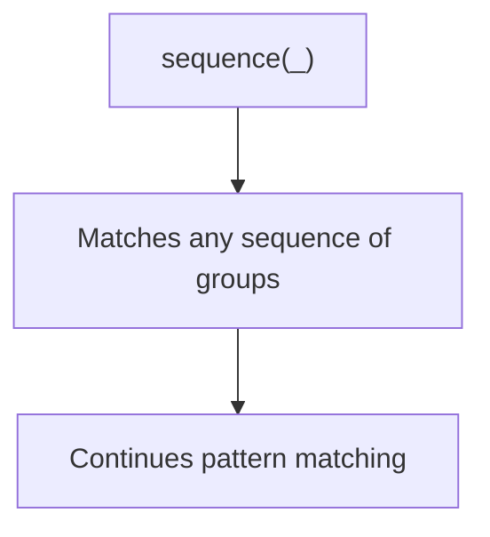
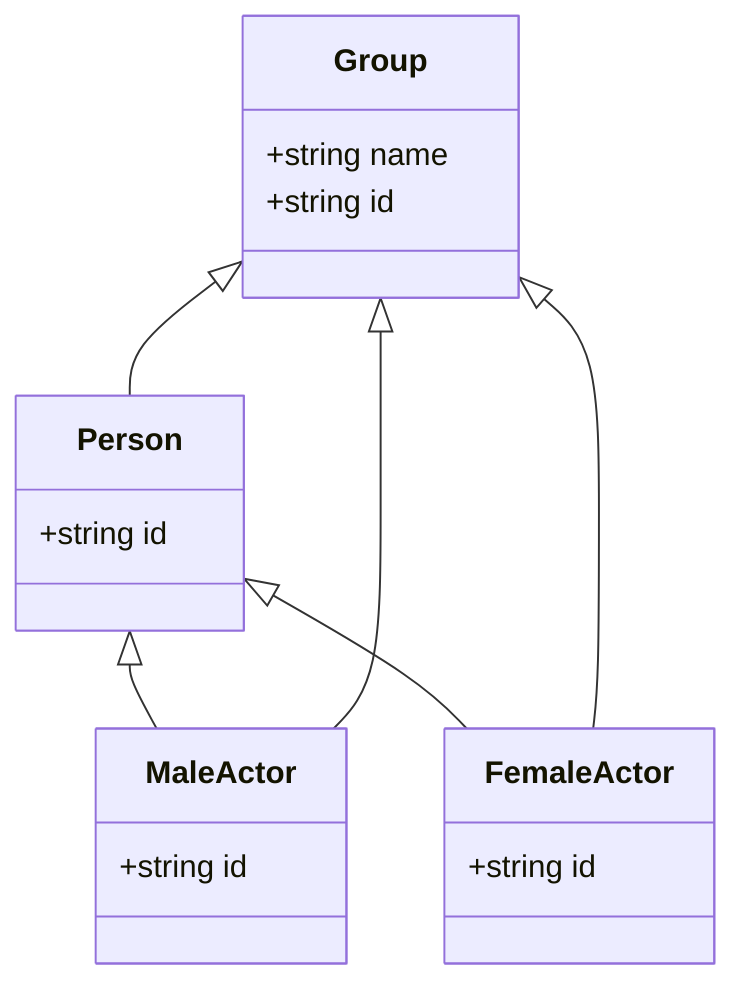
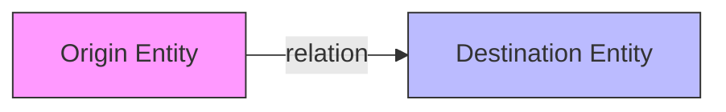
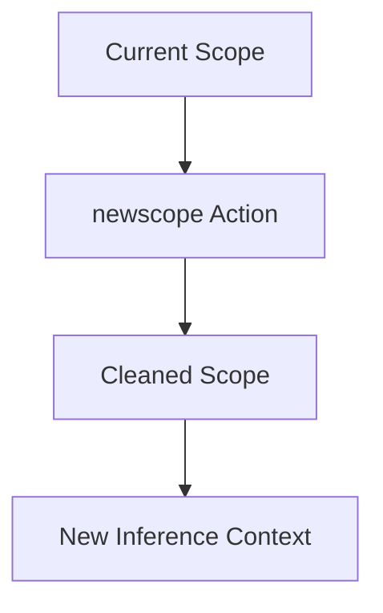
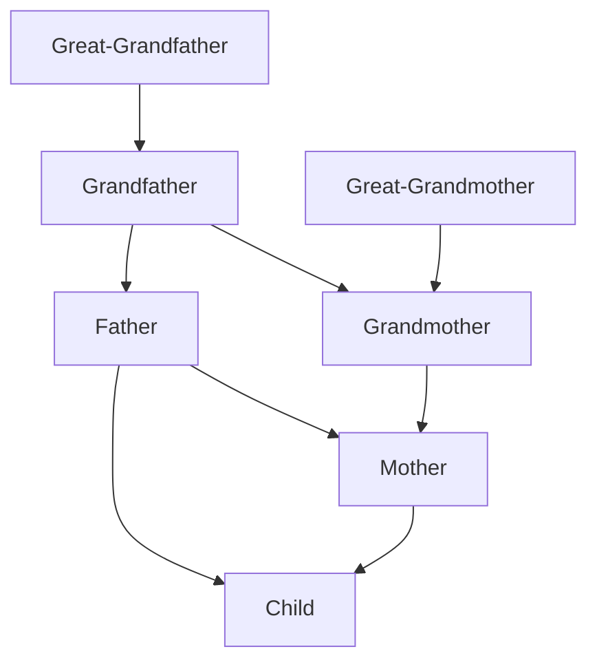
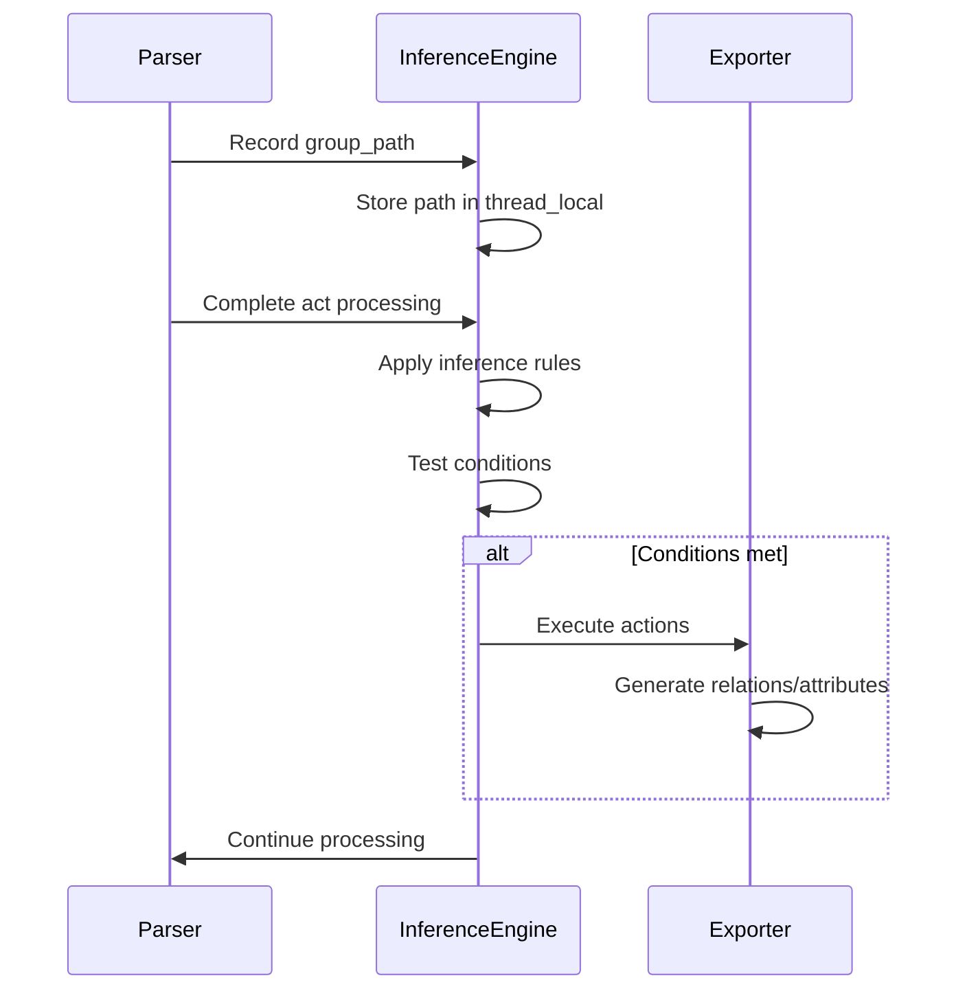

# Custom Inference Rules

<cite>
**Referenced Files in This Document**   
- [inference.pl](file://src/inference.pl)
- [gactoxml.pl](file://src/gactoxml.pl)
- [inference_sample.yml](file://tests/kleio-home/inferences/inference_sample.yml)
- [apiTranslations.pl](file://src/apiTranslations.pl)
</cite>

## Table of Contents
1. [Introduction](#introduction)
2. [Rule Syntax and Structure](#rule-syntax-and-structure)
3. [Path Matching Patterns](#path-matching-patterns)
4. [Action Types](#action-types)
5. [Family Relationship Inference](#family-relationship-inference)
6. [Custom Rule Creation](#custom-rule-creation)
7. [Rule Processing and Application](#rule-processing-and-application)
8. [Debugging and Testing](#debugging-and-testing)
9. [Common Issues and Solutions](#common-issues-and-solutions)

## Introduction
The inference rules system in Timelink-Kleio enables automatic generation of relations and attributes during the translation of historical documents. This system analyzes Kleio notation structures to infer complex relationships such as parent-child connections, marital relationships, and multi-generational family trees. The rules are implemented in Prolog and processed during the translation phase to enrich the semantic representation of historical data.

**Section sources**
- [inference.pl](file://src/inference.pl#L1-L52)

## Rule Syntax and Structure
Inference rules follow a specific syntax pattern using conditional logic with if/then statements and logical operators. The system defines custom operators to create a domain-specific language for expressing inference rules.

The basic structure of an inference rule is:
```
if PATH then ACTION
```

Multiple conditions can be combined using logical operators:
```
if PATH and PATH or PATH then ACTION and ACTION
```

The system defines the following operators with specific precedence:
- `if` (prefix, priority 230)
- `then` (infix, priority 220) 
- `and` (infix, priority 210)
- `or` (infix, priority 210)

These operators allow for complex conditional expressions that can match specific patterns in the Kleio notation and trigger appropriate actions to generate relations and attributes.

**Section sources**
- [inference.pl](file://src/inference.pl#L1-L7)

## Path Matching Patterns
Path matching patterns are used to identify specific structural patterns in Kleio notation that trigger inference rules. The system supports several types of path elements that can be combined to create sophisticated matching patterns.

### Sequence Pattern
The `sequence(C)` pattern matches a sequence of groups, including an empty sequence. This is particularly useful for matching hierarchical structures where the exact path depth may vary. The sequence pattern allows rules to match regardless of intervening groups between the elements of interest.



**Diagram sources**
- [inference.pl](file://src/inference.pl#L20-L21)

### Group Pattern
The `group(Name,ID)` pattern matches a specific group by name and extracts its identifier. This pattern is useful for identifying and extracting specific group names from the Kleio structure, allowing rules to target particular elements in the document hierarchy.

### Extends Pattern
The `extends(Class,ID)` pattern matches any group that extends a specified class. This is particularly powerful for inferring relationships across different types of actors and entities. For example, it can match any group that extends the `actorm` (male actor) or `actorf` (female actor) classes, enabling rules to apply to all actors regardless of their specific group type.



**Diagram sources**
- [inference.pl](file://src/inference.pl#L24-L25)

### Clause Pattern
The `clause(C)` pattern allows for the execution of arbitrary Prolog predicates within the rule condition. This provides maximum flexibility for implementing complex matching logic that cannot be expressed through simple pattern matching alone. The clause pattern can call any Prolog predicate, enabling integration with other parts of the system.

**Section sources**
- [inference.pl](file://src/inference.pl#L18-L27)

## Action Types
When a rule's conditions are met, one or more actions are executed to generate relations, attributes, or modify the processing scope.

### Relation Action
The `relation(type,value,idorigin,iddestinhation)` action generates a relation between two entities. This is the primary mechanism for creating connections between actors, such as parent-child or marital relationships. The action specifies the relation type, value, and the origin and destination entity identifiers.



**Diagram sources**
- [inference.pl](file://src/inference.pl#L30-L31)

### Attribute Action
The `attribute(id,type,value)` action generates an attribute for a specified entity. This is used to add properties to entities, such as marital status or other characteristics inferred from the context. Attributes provide additional semantic information about entities beyond their relationships.

### Newscope Action
The `newscope` action cleans the current scope, forgetting previous actor and object references. This is important for preventing incorrect inferences across different contexts or document sections. When a newscope action is executed, the system clears cached paths and attribute information, ensuring that subsequent rules operate on a clean state.



**Diagram sources**
- [inference.pl](file://src/inference.pl#L32-L33)

**Section sources**
- [inference.pl](file://src/inference.pl#L29-L33)

## Family Relationship Inference
The inference system includes comprehensive rules for automatically generating family relationships from Kleio notation. These rules handle various scenarios including direct parentage, marital connections, and multi-generational relationships.

### Parent-Child Relationships
The system infers parent-child relationships based on the presence of parent indicators in the Kleio notation. For male actors, the system recognizes "pai" (father) and "mae" (mother) indicators:

```prolog
if [sequence(_),extends(actorm,N),pai(P)]
then relation(parentesco,pai,P,N).

if [sequence(_),extends(actorm,N),mae(M)]
then relation(parentesco,mae,M,N).
```

Similarly, for female actors:

```prolog
if [sequence(_),extends(actorf,N),pai(P)]
then relation(parentesco,pai,P,N).

if [sequence(_),extends(actorf,N),mae(M)]
then relation(parentesco,mae,M,N).
```

The system also handles cases where parents are mentioned at the same level in marriage records:

```prolog
if [sequence(Path),pai(P)] and [sequence(Path),mae(M)]
then relation(parentesco,marido,P,M) and 
     attribute(P,ec,c) and
     attribute(M,ec,c).
```

### Marital Connections
The inference system handles marital relationships for both current and previous marriages. For current marriages, it establishes the relationship and sets the marital status for both partners:

```prolog
if [sequence(_),extends(actorm,N),mulher(M)]
then relation(parentesco,marido,N,M) and
     attribute(N,ec,c) and
     attribute(M,ec,c).
```

For previous marriages (indicated by mulher1, mulher2, mulher3), the system creates "was-husband" relationships and marks the wife as deceased:

```prolog
if [sequence(_),extends(actorm,N),mulher1(M)]
then relation(parentesco,foi-marido,N,M) and
     attribute(M,morta,antes).
```

The system also handles marriage records where both groom and bride are specified:

```prolog
if [sequence(X),cas(C),noivo(Noivo)] and
   [sequence(X),cas(C),noiva(Noiva)]
then relation(parentesco,marido,Noivo,Noiva) and
     attribute(Noivo,ec,c) and
     attribute(Noiva,ec,c).
```

### Multi-generational Family Trees
The system includes extensive rules for inferring multi-generational relationships, allowing it to construct complete family trees from the notation. These rules handle various levels of ancestry, from direct parents to great-great-grandparents.

For example, rules for inferring grandfather relationships:

```prolog
if [sequence(_),pai(Son),ppai(Parent)]
then relation(parentesco,pai,Parent,Son).
```

And rules for establishing relationships between grandparents:

```prolog
if [sequence(Path),ppai(Husband)] and [sequence(Path),mpai(Wife)]
then relation(parentesco,marido,Husband,Wife).
```

The system includes similar rules for multiple generations and various combinations of ancestry indicators (ppai, pppai, ppppai, etc.), enabling comprehensive family tree reconstruction.



**Diagram sources**
- [inference.pl](file://src/inference.pl#L36-L291)

**Section sources**
- [inference.pl](file://src/inference.pl#L36-L303)

## Custom Rule Creation
Users can create custom inference rules to handle domain-specific historical contexts. The system supports user-defined rules that can be integrated with the existing rule set.

### Rule Ordering
Rule ordering is critical for correct inference, as rules are processed in the order they appear in the file. More specific rules should generally precede more general rules to ensure proper matching. The system processes rules sequentially, and once a rule matches and executes, it may affect the context for subsequent rules.

### Scoping Considerations
When creating custom rules, proper scoping is essential to prevent incorrect inferences. The `newscope` action can be used to reset the context when moving between different document sections or contexts. This prevents relationships from being incorrectly inferred across unrelated parts of a document.

### Domain-Specific Examples
For historical contexts involving godparents in baptism records, custom rules can be created:

```prolog
if [sequence(Path),mad(Mad)] and [sequence(Path),pmad(PMad)] 
then relation(parentesco,pai,PMad,Mad).
```

For household lists (rois), rules can establish head-of-household relationships:

```prolog
if [kleio(__K),fonte(__F),rol(__R),fogo(FG),n(N)] 
then relation(function,'has-head-of-household',FG,N).
```

These examples demonstrate how the rule system can be extended to handle specific historical document types and relationships.

**Section sources**
- [inference.pl](file://src/inference.pl#L2216-L2287)

## Rule Processing and Application
The inference rules are processed during the translation phase by the gactoxml.pl module. The system follows a specific workflow to apply rules to Kleio notation.

### Processing Workflow
1. The system initializes the database and sets up thread-local storage for path tracking and attribute caching.
2. During translation, group paths are recorded as the document structure is processed.
3. After processing each act (document unit), the inference rules are applied.
4. Rules are tested against the recorded group paths.
5. When a rule's conditions are met, its actions are executed.
6. Generated relations and attributes are exported to the output.



**Diagram sources**
- [gactoxml.pl](file://src/gactoxml.pl#L1683-L1698)

### Condition Testing
The system uses a recursive approach to test rule conditions:

```prolog
condition_test(ConditionA and ConditionB):-
   condition_test(ConditionA),
   condition_test(ConditionB).

condition_test(ConditionA or ConditionB):-
   condition_test(ConditionA);condition_test(ConditionB).

condition_test(Condition):-
   group_path(P),
   path_matching(P,Condition).
```

This allows for complex logical expressions in rule conditions, combining multiple path patterns with AND and OR operators.

### Action Execution
Actions are executed through dedicated predicates that handle the specific action type:

```prolog
do_action(relation(Type,Value,Origin,Destination)):-
   export_auto_rel((na,Origin),(na,Destination),Type,Value),!.

do_action(attribute(ID,Type,Value)):-
   export_auto_attribute(ID,Type,Value),!.

do_action(newscope):-
   clean_paths([kleio(_),sequence(__S)]),
   clean_attribute_cache.
```

The `export_auto_rel` and `export_auto_attribute` predicates handle the actual generation of XML output for relations and attributes, ensuring they are properly formatted and integrated into the translation result.

**Section sources**
- [gactoxml.pl](file://src/gactoxml.pl#L1683-L1728)

## Debugging and Testing
The inference rule system includes mechanisms for debugging and testing to ensure rules behave as expected.

### Debugging Techniques
The system supports debugging through commented-out reporting statements in the rules:

```prolog
% report([writeln('**** detectando viajante e mestre'-M-X)])
```

These can be uncommented to trace rule execution and understand why specific rules are or are not firing. The `clause(C)` pattern can also be used to insert debugging predicates directly into rules.

### Testing with Sample Data
The system includes test files that demonstrate rule behavior with sample data. The `inference_sample.yml` file provides examples of how rules are structured and expected outcomes:

```yaml
- inference:
    name: parentesco
    description: >
      This inference creates the parentesco relation between a person and his/her parents.
    conditions:
      - if:
          - sequence: _
          - extends: actorm
          - pai: P
        then:
          - relation:
              name: parentesco
              parent: P
              child: N
```

These test cases help validate that rules are working correctly and can be used as a reference when creating new rules.

### Integration with Translation Process
Custom inference rules can be loaded during the translation process through the API. The `apiTranslations.pl` module includes TODO comments indicating where user-defined rules should be loaded:

```prolog
% TODO: check_user_irules(TokenInfo) % load usr defined inference rules if any
```

This suggests that user rules are intended to be loaded based on the user's token information, allowing for personalized rule sets.

**Section sources**
- [inference_sample.yml](file://tests/kleio-home/inferences/inference_sample.yml#L1-L100)
- [apiTranslations.pl](file://src/apiTranslations.pl#L78-L79)

## Common Issues and Solutions
When working with the inference rules system, several common issues may arise. Understanding these issues and their solutions is essential for effective rule creation and maintenance.

### Issue: Rules Not Firing
Sometimes rules may not trigger as expected. This can be caused by:
- Incorrect path patterns that don't match the actual document structure
- Rules appearing too late in the rule file, after more general rules have already matched
- Scope issues where previous inferences affect current matching

**Solution**: Use debugging statements to trace rule execution and verify that the expected paths are being recorded. Check the order of rules and consider using `newscope` to reset context when necessary.

### Issue: Incorrect Relation Generation
Relations may be generated with incorrect origin or destination entities. This often occurs when variable binding is not properly managed across multiple conditions.

**Solution**: Carefully review the variable usage in AND conditions to ensure consistent binding. Test rules with simple cases first before applying them to complex scenarios.

### Issue: Performance Problems
With many rules and complex documents, performance can become an issue due to the combinatorial nature of rule testing.

**Solution**: Optimize rule ordering to place more specific rules first, reducing unnecessary testing of general rules. Consider breaking complex rules into simpler ones when possible.

### Issue: Conflicting Rules
Multiple rules may apply to the same pattern, leading to conflicting or redundant relations.

**Solution**: Review rule precedence and consider using `newscope` to isolate contexts. Document rule interactions and test thoroughly with representative data.

By understanding these common issues and their solutions, users can create more effective and reliable inference rules for their specific historical research needs.

**Section sources**
- [inference.pl](file://src/inference.pl#L1-L2936)
- [gactoxml.pl](file://src/gactoxml.pl#L106-L1737)