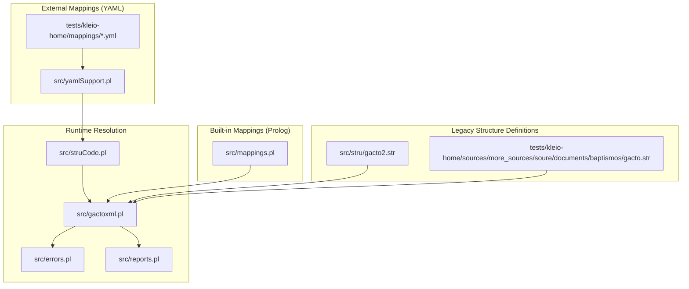
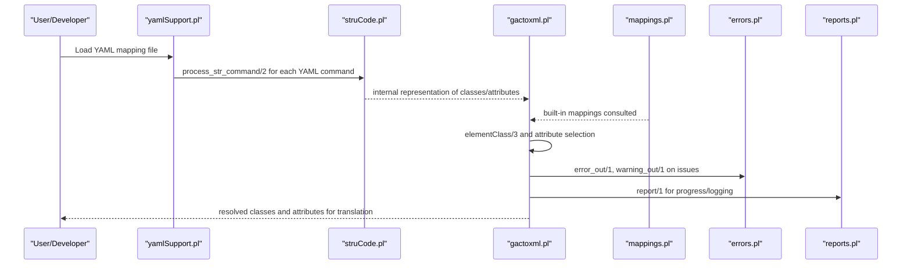
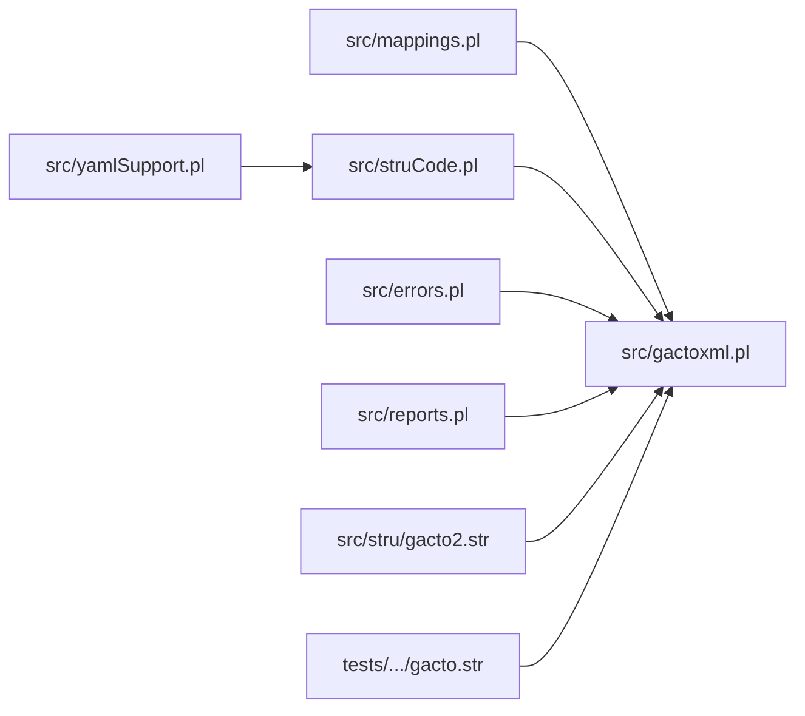
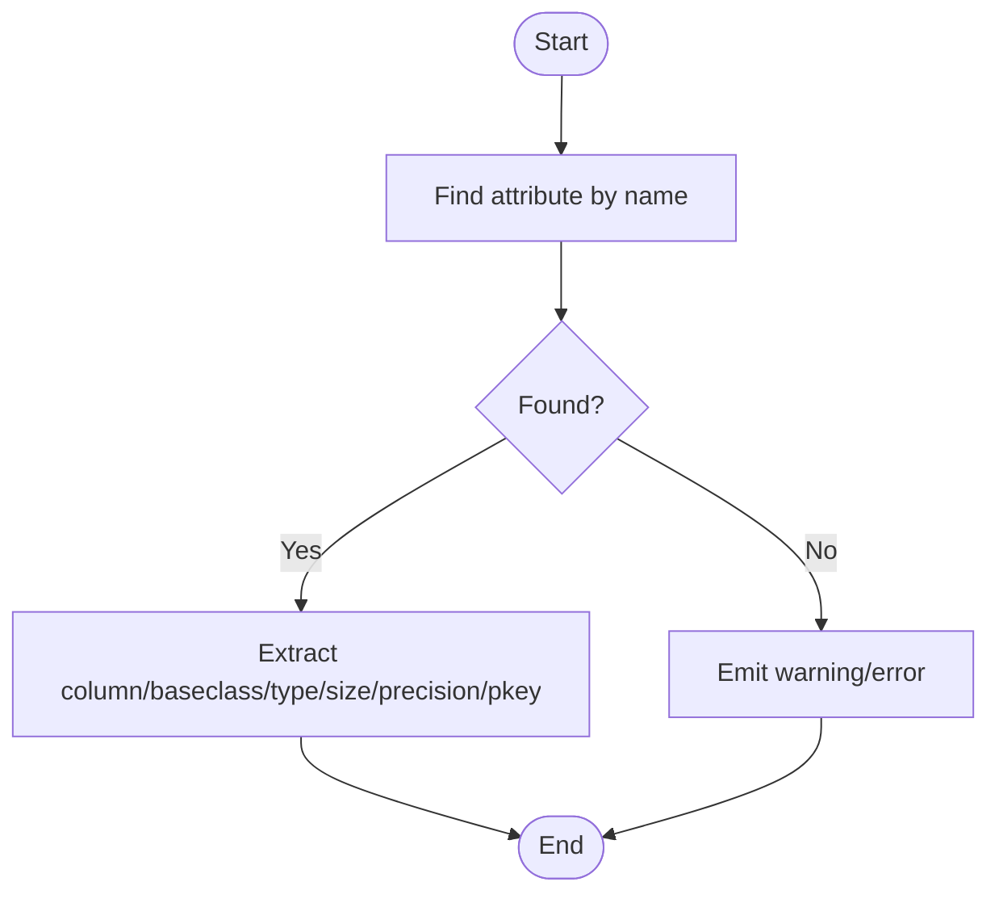

# Custom Mapping Rules

<cite>
**Referenced Files in This Document**
- [mappings.pl](file://src/mappings.pl)
- [person-mapping.yml](file://tests/kleio-home/mappings/person-mapping.yml)
- [sample-mapping.yml](file://tests/kleio-home/mappings/sample-mapping.yml)
- [geodesc-mapping.pl](file://tests/kleio-home/mappings/geodesc-mapping.pl)
- [yamlSupport.pl](file://src/yamlSupport.pl)
- [gactoxml.pl](file://src/gactoxml.pl)
- [errors.pl](file://src/errors.pl)
- [reports.pl](file://src/reports.pl)
- [struCode.pl](file://src/struCode.pl)
- [stru/gacto2.str](file://src/stru/gacto2.str)
- [gacto.str](file://tests/kleio-home/sources/more_sources/soure/documents/baptismos/gacto.str)
</cite>

## Table of Contents
1. [Introduction](#introduction)
2. [Project Structure](#project-structure)
3. [Core Components](#core-components)
4. [Architecture Overview](#architecture-overview)
5. [Detailed Component Analysis](#detailed-component-analysis)
6. [Dependency Analysis](#dependency-analysis)
7. [Performance Considerations](#performance-considerations)
8. [Troubleshooting Guide](#troubleshooting-guide)
9. [Conclusion](#conclusion)
10. [Appendices](#appendices)

## Introduction
This document explains how to develop custom mapping rules in the Timelink Kleio system. It covers the mapping syntax and grammar, class inheritance patterns, attribute definitions, and how Prolog-based mappings integrate with YAML/external mapping files. It also provides advanced techniques such as dynamic attribute generation, computed columns, cross-referencing, performance optimization, error handling, debugging, and migration strategies for evolving mapping rules while maintaining backward compatibility.

## Project Structure
The mapping system spans three complementary mechanisms:
- Built-in Prolog mappings: canonical, versioned mappings embedded in the codebase
- YAML mappings: external, user-defined mappings for classes and attributes
- Legacy structure mappings: older str-based definitions that define elements and group-to-column mappings

**Diagram sources**
- [mappings.pl](file://src/mappings.pl#L1-L518)
- [yamlSupport.pl](file://src/yamlSupport.pl#L1-L273)
- [stru/gacto2.str](file://src/stru/gacto2.str#L1-L200)
- [gacto.str](file://tests/kleio-home/sources/more_sources/soure/documents/baptismos/gacto.str#L505-L559)
- [gactoxml.pl](file://src/gactoxml.pl#L2127-L2162)
- [errors.pl](file://src/errors.pl#L1-L200)
- [reports.pl](file://src/reports.pl#L1-L136)
- [struCode.pl](file://src/struCode.pl#L1-L200)

**Section sources**
- [mappings.pl](file://src/mappings.pl#L1-L518)
- [yamlSupport.pl](file://src/yamlSupport.pl#L1-L273)
- [stru/gacto2.str](file://src/stru/gacto2.str#L1-L200)
- [gacto.str](file://tests/kleio-home/sources/more_sources/soure/documents/baptismos/gacto.str#L505-L559)
- [gactoxml.pl](file://src/gactoxml.pl#L2127-L2162)
- [errors.pl](file://src/errors.pl#L1-L200)
- [reports.pl](file://src/reports.pl#L1-L136)
- [struCode.pl](file://src/struCode.pl#L1-L200)

## Core Components
- Built-in Prolog mappings: define canonical mappings via operator-based syntax and class definitions with attributes and constraints.
- YAML mappings: define classes and attributes declaratively in YAML, processed by the YAML support module.
- Runtime resolution: resolves element-to-class mappings and attribute metadata during translation.

Key responsibilities:
- Define mapping declarations and class hierarchies
- Parse and validate YAML mapping files
- Resolve element classes and attributes at runtime
- Report errors and warnings consistently

**Section sources**
- [mappings.pl](file://src/mappings.pl#L1-L518)
- [yamlSupport.pl](file://src/yamlSupport.pl#L1-L273)
- [gactoxml.pl](file://src/gactoxml.pl#L2127-L2162)

## Architecture Overview
The mapping pipeline integrates built-in Prolog mappings, YAML mappings, and legacy structure definitions. At runtime, the system resolves which class and attributes apply to each element in the source data.

**Diagram sources**
- [yamlSupport.pl](file://src/yamlSupport.pl#L90-L137)
- [struCode.pl](file://src/struCode.pl#L90-L120)
- [gactoxml.pl](file://src/gactoxml.pl#L2127-L2162)
- [mappings.pl](file://src/mappings.pl#L1-L518)
- [errors.pl](file://src/errors.pl#L85-L113)
- [reports.pl](file://src/reports.pl#L84-L110)

## Detailed Component Analysis

### Mapping Syntax and Grammar
The built-in Prolog mappings use operator-based syntax to declare mappings and classes with attributes. Operators enable readable DSL-like declarations.

- Mapping declaration: connects a source group/class to a target class.
- Class declaration: defines inheritance, table, and attributes.
- Attribute definition: specifies column name, base class, type, size, precision, and primary key flag.

Examples of constructs visible in the codebase:
- Mapping declaration: mapping X to class Y.
- Class declaration: class C super P table T with attributes ...
- Attribute specification: name column X baseclass B coltype T colsize S colprecision P pkey K.

These operators are declared in the module header and used throughout the built-in mappings file.

**Section sources**
- [mappings.pl](file://src/mappings.pl#L1-L518)

### Class Inheritance Patterns
Classes can inherit from a parent class using the super keyword. This enables polymorphic behavior and shared attribute sets across related classes.

Patterns observed:
- A class extends entity, act, object, or other domain-specific base classes.
- Inheritance allows reusing common attributes (e.g., id, date, type) across subclasses.

Example patterns:
- class person super entity table persons with attributes ...
- class act super entity table acts with attributes ...

**Section sources**
- [mappings.pl](file://src/mappings.pl#L136-L146)
- [mappings.pl](file://src/mappings.pl#L121-L135)
- [mappings.pl](file://src/mappings.pl#L137-L146)

### Attribute Definition System
Each attribute is defined with:
- Name: logical attribute name
- Column: physical column name in the target table
- Base class: semantic class of the element in the source
- Type: data type (e.g., varchar, int, numeric)
- Size: column size
- Precision: decimal precision
- Primary key flag: indicates whether the column is a primary key

Selection and retrieval:
- Runtime selection uses predicates that match attribute definitions by name and extract column/baseclass/type/size/precision/pkey.

**Section sources**
- [mappings.pl](file://src/mappings.pl#L24-L33)
- [gactoxml.pl](file://src/gactoxml.pl#L2141-L2157)

### YAML Mapping Integration
YAML mappings complement built-in mappings by allowing external, user-defined class and attribute definitions. The YAML support module:
- Reads YAML files
- Normalizes values and processes commands
- Bridges YAML commands to internal structure processing

Key behaviors:
- process_str_command/2 routes YAML commands to struCode for execution
- sanitize_value/1 ensures proper typing (atoms vs. strings)
- include_yaml_str/2 supports including other YAML files

**Section sources**
- [yamlSupport.pl](file://src/yamlSupport.pl#L90-L137)
- [yamlSupport.pl](file://src/yamlSupport.pl#L176-L186)
- [yamlSupport.pl](file://src/yamlSupport.pl#L188-L192)

### Runtime Resolution of Classes and Attributes
At translation time, the system resolves:
- Which class applies to a given element in a group
- Which attributes are defined for that element
- How to map element values to target columns

Mechanisms:
- elementClass/3 selects the target class for an element
- rch_get_attribute/2 and atr_select/N extract attribute metadata
- Errors and warnings are emitted via errors.pl

**Section sources**
- [gactoxml.pl](file://src/gactoxml.pl#L2137-L2139)
- [gactoxml.pl](file://src/gactoxml.pl#L2141-L2157)
- [errors.pl](file://src/errors.pl#L85-L113)

### Legacy Structure Element-to-Column Mappings
Older str-based structure files define element-to-column mappings that inform the mapping system. These mappings help translate generic elements (e.g., id, date, type, obs) into concrete columns.

Examples:
- id-element-mapping maps element id to column id
- date-element-mapping maps element date to column the_date
- day/month/year/type/loc/ref/obs-element-mapping define common mappings

**Section sources**
- [gacto.str](file://tests/kleio-home/sources/more_sources/soure/documents/baptismos/gacto.str#L505-L559)

### Comprehensive Examples

#### Example 1: Person Mapping (YAML)
A YAML mapping defines a person class inheriting from person, targeting the entities table, and specifying attributes with types, sizes, and primary keys.

- Mapping: name and class
- Class: name, extends, table, description
- Attributes: id, name, sex, obs with type, size, and primary key flags

**Section sources**
- [person-mapping.yml](file://tests/kleio-home/mappings/person-mapping.yml#L1-L15)

#### Example 2: Minutes Mapping (YAML)
A YAML mapping defines a minutes class extending act, mapped to the minutes table, with attributes including date, pages, summary, and optional obs.

- Mapping: minutes to minutes
- Class: extends act, table minutes
- Attributes: id (PK), the_day, the_month, the_year, summary, pages, obs

**Section sources**
- [sample-mapping.yml](file://tests/kleio-home/mappings/sample-mapping.yml#L7-L23)

#### Example 3: Geographic Hierarchies (Prolog)
A Prolog mapping defines geo1 inheriting from entity, mapped to geoentities table, with attributes id, type, name, and obs.

- Mapping: geo1 to class geo1
- Class: super entity, table geoentities
- Attributes: id (PK), type, name, obs

**Section sources**
- [geodesc-mapping.pl](file://tests/kleio-home/mappings/geodesc-mapping.pl#L42-L51)

#### Example 4: Multi-Table Joins and Cross-References
Multi-table mappings are supported by defining classes that inherit from higher-level classes and mapping to different tables. Cross-references are handled by mapping foreign keys to target entity identifiers.

- Example: relation class with origin and destination columns referencing other entities
- Example: authority-register mapping with replace_mode and dbase fields

**Section sources**
- [mappings.pl](file://src/mappings.pl#L160-L176)
- [mappings.pl](file://src/mappings.pl#L35-L50)

#### Example 5: Conditional Mappings and Recursive Transformations
Conditional mappings can be modeled by:
- Using different mappings for different source groups
- Defining specialized classes that inherit from a common base
- Leveraging YAML includes to compose mappings incrementally

Recursive transformations can be achieved by:
- Chaining mappings across multiple levels
- Using inheritance to reuse common attribute sets

**Section sources**
- [yamlSupport.pl](file://src/yamlSupport.pl#L115-L126)
- [mappings.pl](file://src/mappings.pl#L121-L135)

#### Example 6: Dynamic Attribute Generation and Computed Columns
Dynamic attribute generation can be implemented by:
- Defining attributes in YAML that map to computed expressions in downstream processing
- Using baseclass to semantically categorize elements and letting the runtime resolve columns

Computed columns can be represented by:
- Attributes with baseclass pointing to synthetic or derived elements
- Ensuring the target table schema accommodates computed values

**Section sources**
- [yamlSupport.pl](file://src/yamlSupport.pl#L171-L174)
- [mappings.pl](file://src/mappings.pl#L24-L33)

### Advanced Techniques

#### Cross-Referencing Between Mapped Entities
Cross-referencing is achieved by:
- Defining foreign key columns in attribute definitions
- Using baseclass to indicate semantic roles (e.g., origin, destination)
- Ensuring referential integrity constraints in the target schema

**Section sources**
- [mappings.pl](file://src/mappings.pl#L160-L176)

#### Integration Between Prolog and YAML Mappings
- Prolog mappings are consulted directly
- YAML mappings are parsed and executed through struCode
- Both contribute to the same runtime resolution

**Section sources**
- [geodesc-mapping.pl](file://tests/kleio-home/mappings/geodesc-mapping.pl#L31-L41)
- [yamlSupport.pl](file://src/yamlSupport.pl#L90-L137)

## Dependency Analysis
The mapping system exhibits layered dependencies:
- Built-in mappings depend on operator declarations and runtime resolution predicates
- YAML support depends on struCode for command processing
- Runtime resolution depends on both built-in and YAML mappings
- Error reporting and logging are centralized

**Diagram sources**
- [mappings.pl](file://src/mappings.pl#L1-L518)
- [yamlSupport.pl](file://src/yamlSupport.pl#L1-L273)
- [struCode.pl](file://src/struCode.pl#L1-L200)
- [gactoxml.pl](file://src/gactoxml.pl#L2127-L2162)
- [errors.pl](file://src/errors.pl#L1-L200)
- [reports.pl](file://src/reports.pl#L1-L136)
- [stru/gacto2.str](file://src/stru/gacto2.str#L1-L200)
- [gacto.str](file://tests/kleio-home/sources/more_sources/soure/documents/baptismos/gacto.str#L505-L559)

**Section sources**
- [mappings.pl](file://src/mappings.pl#L1-L518)
- [yamlSupport.pl](file://src/yamlSupport.pl#L1-L273)
- [struCode.pl](file://src/struCode.pl#L1-L200)
- [gactoxml.pl](file://src/gactoxml.pl#L2127-L2162)
- [errors.pl](file://src/errors.pl#L1-L200)
- [reports.pl](file://src/reports.pl#L1-L136)
- [stru/gacto2.str](file://src/stru/gacto2.str#L1-L200)
- [gacto.str](file://tests/kleio-home/sources/more_sources/soure/documents/baptismos/gacto.str#L505-L559)

## Performance Considerations
- Minimize redundant attribute lookups by caching resolved mappings per group/class.
- Prefer compact YAML mappings and avoid excessive includes to reduce parsing overhead.
- Use inheritance to share common attributes and reduce duplication.
- Keep attribute lists concise; only define necessary columns to reduce I/O.
- Use primary keys judiciously to optimize join performance.

[No sources needed since this section provides general guidance]

## Troubleshooting Guide
Common issues and strategies:
- Unknown or missing commands in YAML: errors.pl emits contextualized error messages; verify command spelling and context.
- Attribute resolution failures: ensure element names match attribute definitions; confirm baseclass alignment.
- Cross-reference errors: verify foreign key columns and referential integrity; check that origin/destination entities exist.
- Reporting and logging: use reports.pl to capture detailed logs for debugging.

Diagnostic aids:
- Error and warning predicates emit contextual information including file, line, and surrounding text.
- Reports module supports console and file output for traceability.

**Section sources**
- [errors.pl](file://src/errors.pl#L85-L113)
- [errors.pl](file://src/errors.pl#L135-L167)
- [reports.pl](file://src/reports.pl#L84-L110)

## Conclusion
Timelink Kleio’s mapping system combines built-in Prolog mappings, YAML-based user mappings, and legacy structure definitions. By leveraging operator-based syntax, inheritance, and robust runtime resolution, developers can create expressive, maintainable mappings. YAML integration enables flexible, externalized configurations, while centralized error and reporting facilities support reliable debugging and maintenance.

[No sources needed since this section summarizes without analyzing specific files]

## Appendices

### Appendix A: Mapping Declaration Reference
- Mapping: mapping X to class Y
- Class: class C super P table T with attributes ...
- Attribute: name column X baseclass B coltype T colsize S colprecision P pkey K

**Section sources**
- [mappings.pl](file://src/mappings.pl#L1-L518)

### Appendix B: YAML Mapping Fields
- mapping: name, class
- class: name, extends, table, description, attributes
- attributes: name, column, class, type, size, precision, pkey

**Section sources**
- [person-mapping.yml](file://tests/kleio-home/mappings/person-mapping.yml#L1-L15)
- [sample-mapping.yml](file://tests/kleio-home/mappings/sample-mapping.yml#L7-L23)

### Appendix C: Runtime Attribute Selection Flow

**Diagram sources**
- [gactoxml.pl](file://src/gactoxml.pl#L2141-L2157)