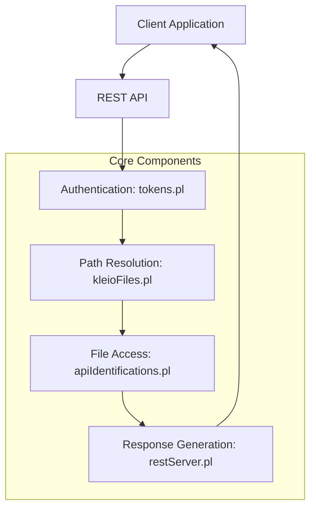
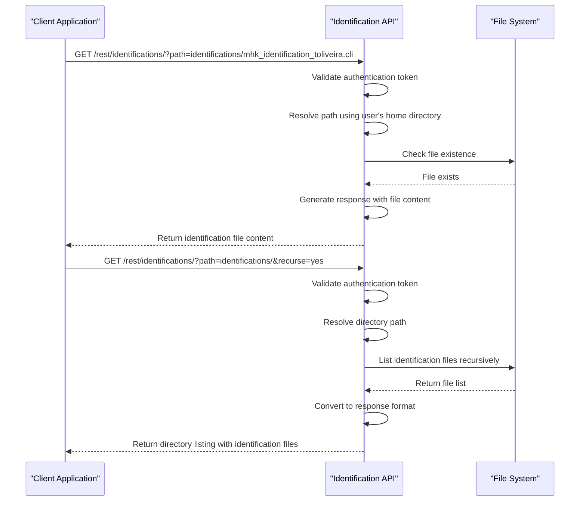
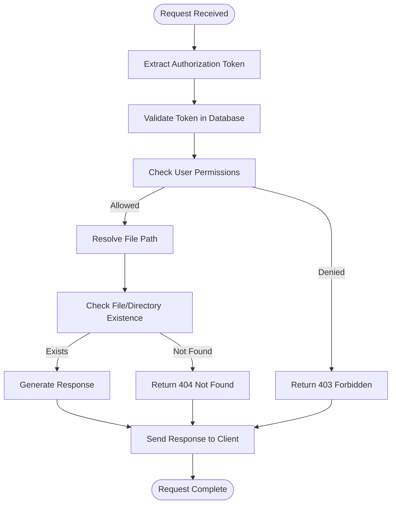
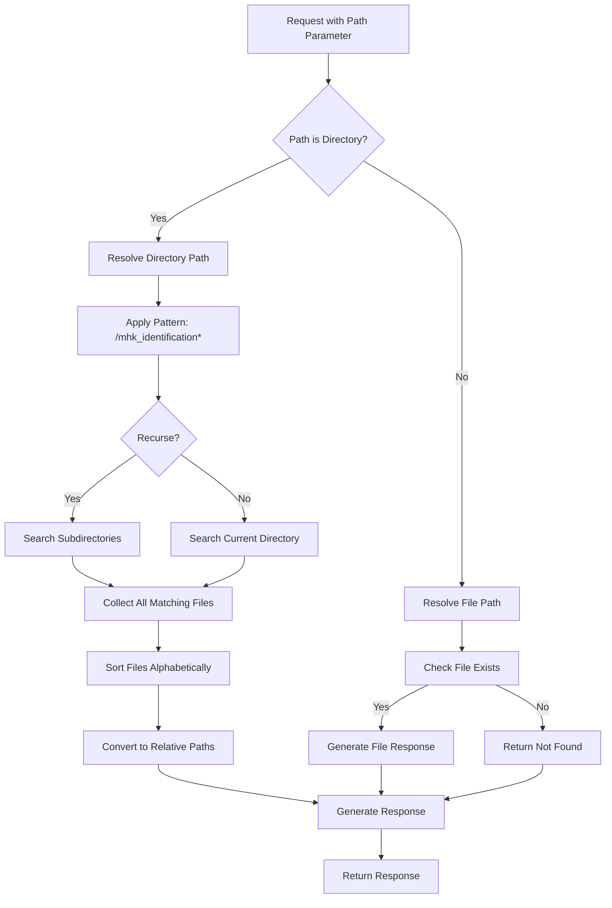
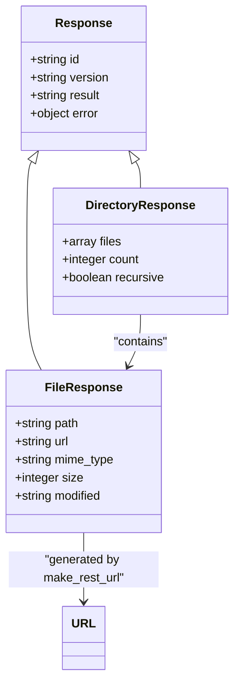
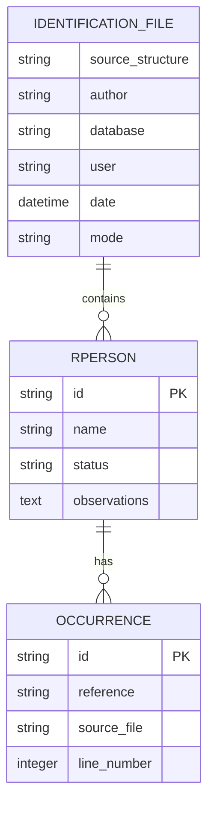
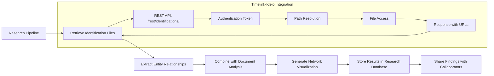

# Identification Resolution

<cite>
**Referenced Files in This Document**   
- [apiIdentifications.pl](file://src/apiIdentifications.pl)
- [kleioFiles.pl](file://src/kleioFiles.pl)
- [restServer.pl](file://src/restServer.pl)
- [tokens.pl](file://src/tokens.pl)
- [mhk_identification_toliveira.cli](file://tests/kleio-home/identifications/mhk_identification_toliveira.cli)
</cite>

## Table of Contents
1. [Introduction](#introduction)
2. [Core Components](#core-components)
3. [REST API Endpoints](#rest-api-endpoints)
4. [Authentication and Authorization](#authentication-and-authorization)
5. [Path Resolution Logic](#path-resolution-logic)
6. [Response Formats](#response-formats)
7. [Identification File Structure](#identification-file-structure)
8. [Integration with Research Pipelines](#integration-with-research-pipelines)
9. [Common Issues and Solutions](#common-issues-and-solutions)

## Introduction
The Identification Resolution system in Timelink-Kleio provides a comprehensive solution for managing entity identification files (mhk_identification*.cli) that link real-world entities across historical documents. This system enables researchers to establish connections between persons, objects, and other entities mentioned in different sources, supporting collaborative annotation workflows and advanced research analysis. The system exposes REST API endpoints for retrieving identification files, handles authentication through token-based access control, and implements sophisticated path resolution logic to locate files relative to user home directories. Identification files serve as a critical bridge between raw historical documents and structured data, enabling cross-document entity linking and supporting complex research queries.

**Section sources**
- [apiIdentifications.pl](file://src/apiIdentifications.pl#L1-L18)
- [mhk_identification_toliveira.cli](file://tests/kleio-home/identifications/mhk_identification_toliveira.cli#L1-L10)

## Core Components
The Identification Resolution system consists of several interconnected components that work together to provide entity identification services. The core module `apiIdentifications.pl` implements the REST API endpoints for retrieving identification files, while `kleioFiles.pl` handles file system operations and path resolution. The `restServer.pl` module provides the underlying REST and JSON-RPC server infrastructure, and `tokens.pl` manages authentication and authorization through token-based access control. These components work in concert to provide a secure and efficient system for accessing identification files. The system is designed to handle both individual file requests and directory listings, with support for recursive directory traversal. The identification files themselves follow a specific structure that enables linking entities across documents through occurrence identifiers that reference specific mentions in source files.

**Diagram sources **
- [apiIdentifications.pl](file://src/apiIdentifications.pl#L1-L105)
- [kleioFiles.pl](file://src/kleioFiles.pl#L1-L33)
- [restServer.pl](file://src/restServer.pl#L1-L22)
- [tokens.pl](file://src/tokens.pl#L1-L17)

**Section sources**
- [apiIdentifications.pl](file://src/apiIdentifications.pl#L1-L105)
- [kleioFiles.pl](file://src/kleioFiles.pl#L1-L33)
- [restServer.pl](file://src/restServer.pl#L1-L22)
- [tokens.pl](file://src/tokens.pl#L1-L17)

## REST API Endpoints
The Identification Resolution system exposes REST API endpoints for retrieving identification files through the `/rest/identifications/` route. The primary endpoint `identifications_get` handles GET requests for identification files, accepting parameters such as `path` to specify the file or directory to retrieve and `recurse` to enable recursive directory traversal. When requesting a specific identification file, the system returns the file content directly, while directory requests return a list of available identification files. The API supports both REST and JSON-RPC protocols, allowing clients to choose the most appropriate communication method. The endpoint structure follows a consistent pattern where the path parameter determines whether the request is for a single file or a directory listing. For file requests, the system validates the file existence and returns the content with appropriate MIME types, while directory requests return structured data containing file information or download URLs based on client preferences.

**Diagram sources **
- [apiIdentifications.pl](file://src/apiIdentifications.pl#L20-L42)
- [restServer.pl](file://src/restServer.pl#L498-L515)

**Section sources**
- [apiIdentifications.pl](file://src/apiIdentifications.pl#L20-L42)
- [restServer.pl](file://src/restServer.pl#L498-L515)

## Authentication and Authorization
The Identification Resolution system implements token-based authentication and authorization to control access to identification files. Clients must provide a valid API token in their requests, which is validated against the token database to verify user identity and permissions. The system uses the `is_api_allowed/2` predicate to check if the authenticated user has the necessary permissions to access identification files, specifically requiring the `files` privilege. Authentication tokens are generated and managed through the tokens system, which associates each token with a user and a set of permissions that define what operations the user can perform. The token contains information about the user's source directory, which is used for path resolution to ensure users can only access files within their designated directories. This security model prevents unauthorized access to identification files while allowing legitimate users to retrieve the data they need for their research. The system also supports administrative tokens with elevated privileges for system management tasks.

**Diagram sources **
- [apiIdentifications.pl](file://src/apiIdentifications.pl#L21-L31)
- [tokens.pl](file://src/tokens.pl#L1-L17)

**Section sources**
- [apiIdentifications.pl](file://src/apiIdentifications.pl#L21-L31)
- [tokens.pl](file://src/tokens.pl#L1-L17)

## Path Resolution Logic
The Identification Resolution system implements sophisticated path resolution logic to locate identification files relative to user home directories. When a request is received, the system uses the `kleio_resolve_source_file/3` predicate to convert the relative path from the request into an absolute file path based on the user's home directory specified in their authentication token. This resolution process ensures that users can only access files within their designated directories, providing a security boundary while maintaining flexibility in file organization. For directory requests, the system uses pattern matching with the glob pattern `/mhk_identification*` to find all identification files in the specified directory, with support for recursive searching through subdirectories when the `recurse=yes` parameter is provided. The path resolution logic also handles the conversion between absolute and relative paths, ensuring that responses contain appropriate path information that clients can use for further operations. This system allows for a consistent and secure way to access identification files regardless of the underlying file system structure.

**Diagram sources **
- [apiIdentifications.pl](file://src/apiIdentifications.pl#L84-L105)
- [kleioFiles.pl](file://src/kleioFiles.pl#L753-L781)

**Section sources**
- [apiIdentifications.pl](file://src/apiIdentifications.pl#L84-L105)
- [kleioFiles.pl](file://src/kleioFiles.pl#L753-L781)

## Response Formats
The Identification Resolution system supports multiple response formats to accommodate different client requirements and use cases. For REST requests, the system can return either the raw file content or a structured response containing file metadata and download URLs. When the `url=yes` parameter is included in the request, the system generates REST URLs for each identification file using the `make_rest_url/3` function, allowing clients to retrieve files through subsequent requests. The JSON response format follows a standardized structure that includes request identifiers, status information, and result data, making it easy for clients to parse and process the responses. For individual file requests, the system sets appropriate HTTP headers including MIME types and location information to ensure proper handling by clients. Directory listings return an array of file paths or URLs, which can be used by clients to navigate the identification file hierarchy. The system also supports JSON-RPC protocol for more complex interactions, providing a flexible interface for different types of clients and applications.

**Diagram sources **
- [apiIdentifications.pl](file://src/apiIdentifications.pl#L70-L78)
- [restServer.pl](file://src/restServer.pl#L13-L14)
- [kleioFiles.pl](file://src/kleioFiles.pl#L2-L3)

**Section sources**
- [apiIdentifications.pl](file://src/apiIdentifications.pl#L70-L78)
- [restServer.pl](file://src/restServer.pl#L13-L14)
- [kleioFiles.pl](file://src/kleioFiles.pl#L2-L3)

## Identification File Structure
Identification files in the Timelink-Kleio system follow a structured format that enables linking entities across documents through a hierarchical organization of real persons, real objects, and their occurrences. Each identification file, such as `mhk_identification_toliveira.cli`, begins with metadata specifying the source structure, author, database, user, date, and mode. The core content consists of `rperson` elements that represent real persons, each with a unique identifier, name, status, and optional observations. Within each real person, `occ` (occurrence) elements link to specific mentions in source documents, using identifiers that reference the exact location of the mention. This structure allows researchers to establish connections between different mentions of the same person across multiple documents, supporting collaborative annotation and entity resolution workflows. The hierarchical organization enables efficient querying and analysis of entity relationships, making it possible to trace the appearance of individuals throughout historical records.

**Diagram sources **
- [mhk_identification_toliveira.cli](file://tests/kleio-home/identifications/mhk_identification_toliveira.cli#L1-L514)

**Section sources**
- [mhk_identification_toliveira.cli](file://tests/kleio-home/identifications/mhk_identification_toliveira.cli#L1-L514)

## Integration with Research Pipelines
The Identification Resolution system can be integrated into research pipelines to support advanced analysis of historical documents. Researchers can use the REST API to programmatically retrieve identification files and extract entity relationships for further processing. The system's support for both individual file access and directory listings enables batch processing of identification data, which can be combined with other document analysis tools to create comprehensive research workflows. For example, a research pipeline might first retrieve all identification files for a specific period, extract the entity relationships, and then use this information to enhance text analysis or network visualization. The URL generation feature allows for efficient downloading of multiple files without requiring repeated authentication, optimizing performance for large-scale analysis. The structured response formats make it easy to parse identification data and integrate it with other research tools and databases, supporting collaborative research efforts across different institutions and projects.

**Diagram sources **
- [apiIdentifications.pl](file://src/apiIdentifications.pl#L1-L105)
- [restServer.pl](file://src/restServer.pl#L1-L22)

**Section sources**
- [apiIdentifications.pl](file://src/apiIdentifications.pl#L1-L105)
- [restServer.pl](file://src/restServer.pl#L1-L22)

## Common Issues and Solutions
Users of the Identification Resolution system may encounter several common issues, along with their corresponding solutions. Authentication failures typically occur when invalid or expired tokens are used; these can be resolved by generating a new token with appropriate permissions. Path resolution errors may happen when requesting files outside the user's designated directory; ensuring the path is relative to the user's home directory resolves this issue. For directory listing requests, users may not see expected files if the `recurse` parameter is not set correctly for nested directories; setting `recurse=yes` enables recursive searching. Response format issues can occur when clients don't properly handle JSON vs. raw file responses; using the `url=yes` parameter ensures consistent URL-based responses. Performance issues with large directory listings can be mitigated by using pagination or filtering parameters if supported. Finally, file not found errors should be verified by checking the exact file name and path, as the system is case-sensitive and requires exact matches for identification file names.

**Section sources**
- [apiIdentifications.pl](file://src/apiIdentifications.pl#L37-L38)
- [tokens.pl](file://src/tokens.pl#L141-L148)
- [kleioFiles.pl](file://src/kleioFiles.pl#L753-L781)