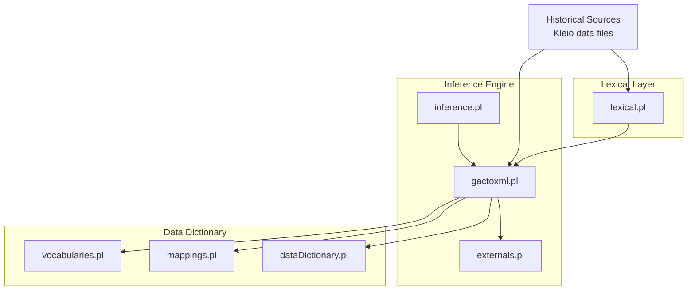
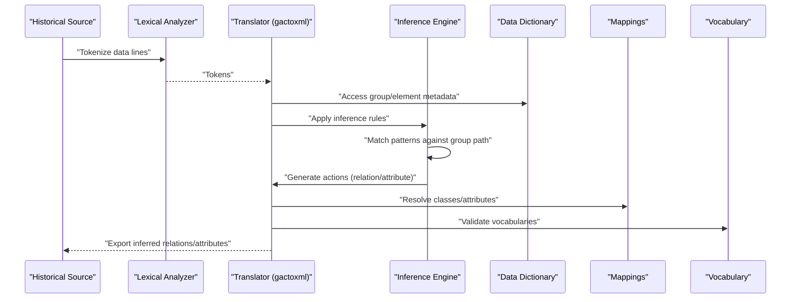
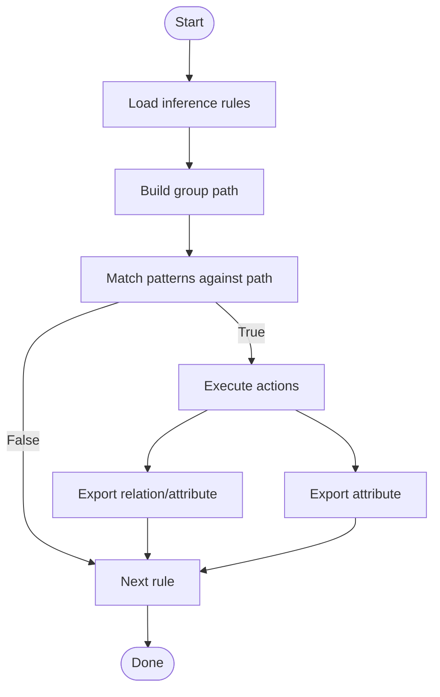
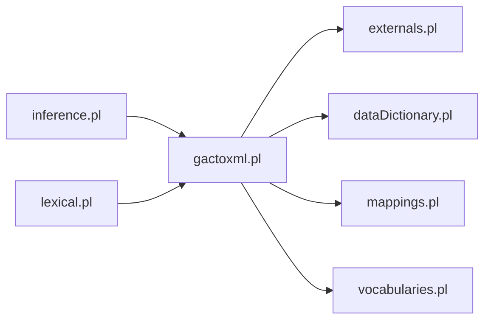

# Inference Rule Development

<cite>
**Referenced Files in This Document**
- [inference.pl](file://src/inference.pl)
- [gactoxml.pl](file://src/gactoxml.pl)
- [externals.pl](file://src/externals.pl)
- [dataDictionary.pl](file://src/dataDictionary.pl)
- [lexical.pl](file://src/lexical.pl)
- [mappings.pl](file://src/mappings.pl)
- [vocabularies.pl](file://src/vocabularies.pl)
- [inference_sample.yml](file://tests/kleio-home/inferences/inference_sample.yml)
- [README.md](file://README.md)
</cite>

## Table of Contents
1. [Introduction](#introduction)
2. [Project Structure](#project-structure)
3. [Core Components](#core-components)
4. [Architecture Overview](#architecture-overview)
5. [Detailed Component Analysis](#detailed-component-analysis)
6. [Dependency Analysis](#dependency-analysis)
7. [Performance Considerations](#performance-considerations)
8. [Troubleshooting Guide](#troubleshooting-guide)
9. [Conclusion](#conclusion)
10. [Appendices](#appendices)

## Introduction
This document explains how to develop custom inference rules in the Timelink Kleio system. It covers the inference engine architecture, the logical rule syntax, and how rules are matched against structured historical data to discover implicit relationships. It also documents integration points with the data dictionary and lexical analysis systems, advanced techniques such as temporal reasoning and cross-document correlations, and practical guidance for performance, caching, and debugging.

## Project Structure
The inference system is implemented primarily in Prolog modules:
- Inference rules and operators are defined in the inference module.
- The translation pipeline invokes inference during act-level processing.
- The data dictionary provides hierarchical group and element metadata used by inference.
- Lexical analysis supports tokenization of input and data flags.
- Mappings define how Kleio groups and elements map to relational classes and attributes.
- Vocabulary utilities support controlled vocabularies for attributes and relations.

**Diagram sources**
- [inference.pl](file://src/inference.pl#L1-L52)
- [gactoxml.pl](file://src/gactoxml.pl#L1691-L1706)
- [externals.pl](file://src/externals.pl#L1-L25)
- [dataDictionary.pl](file://src/dataDictionary.pl#L1-L37)
- [lexical.pl](file://src/lexical.pl#L1-L26)
- [mappings.pl](file://src/mappings.pl#L1-L18)
- [vocabularies.pl](file://src/vocabularies.pl#L1-L14)

**Section sources**
- [README.md](file://README.md#L1-L503)
- [inference.pl](file://src/inference.pl#L1-L52)
- [gactoxml.pl](file://src/gactoxml.pl#L1691-L1706)
- [externals.pl](file://src/externals.pl#L1-L25)
- [dataDictionary.pl](file://src/dataDictionary.pl#L1-L37)
- [lexical.pl](file://src/lexical.pl#L1-L26)
- [mappings.pl](file://src/mappings.pl#L1-L18)
- [vocabularies.pl](file://src/vocabularies.pl#L1-L14)

## Core Components
- Inference rules: Define pattern matching over group paths and generate relations or attributes.
- Translation pipeline: Applies inference rules during act-level processing.
- Data dictionary: Provides group containment, inheritance, and element membership.
- Lexical analyzer: Tokenizes input and supports data flags for multi-valued fields.
- Mappings: Connects Kleio groups/elements to relational classes and attributes.
- Vocabulary utilities: Maintain controlled vocabularies for attributes and relations.

Key rule syntax constructs:
- Pattern matching: sequence/1, group/2, extends/2, clause/1.
- Actions: relation/4, attribute/3, newscope/0.

**Section sources**
- [inference.pl](file://src/inference.pl#L9-L34)
- [gactoxml.pl](file://src/gactoxml.pl#L1691-L1706)
- [dataDictionary.pl](file://src/dataDictionary.pl#L159-L262)
- [lexical.pl](file://src/lexical.pl#L42-L73)
- [mappings.pl](file://src/mappings.pl#L1-L18)
- [vocabularies.pl](file://src/vocabularies.pl#L15-L53)

## Architecture Overview
The inference engine runs within the translation pipeline. At act scope, the system:
- Builds a group path representing the current context.
- Matches inference rules against the path using pattern constructs.
- Executes actions to export inferred relations or attributes.

**Diagram sources**
- [gactoxml.pl](file://src/gactoxml.pl#L1691-L1706)
- [externals.pl](file://src/externals.pl#L107-L151)
- [dataDictionary.pl](file://src/dataDictionary.pl#L159-L262)
- [mappings.pl](file://src/mappings.pl#L1-L18)
- [vocabularies.pl](file://src/vocabularies.pl#L15-L53)

## Detailed Component Analysis

### Inference Engine and Rule Syntax
The inference module defines operators and rule syntax:
- Operators: if/1, then/2, and/2, or/2.
- Patterns:
  - sequence(Path): matches a sequence of groups with a given prefix.
  - group(Name, ID): matches a group by name and binds ID.
  - extends(Class, ID): matches any group extending a given class.
  - clause(Predicate): calls a Prolog predicate for constraint satisfaction.
- Actions:
  - relation(Type, Value, Origin, Destination): exports an inferred relation.
  - attribute(ID, Type, Value): exports an inferred attribute.
  - newscope: resets current scope.

Rule evaluation:
- apply_inference_rules iterates rules, condition_test evaluates patterns against the current group path, and do_actions executes actions.

**Diagram sources**
- [inference.pl](file://src/inference.pl#L1-L52)
- [gactoxml.pl](file://src/gactoxml.pl#L1691-L1706)

**Section sources**
- [inference.pl](file://src/inference.pl#L1-L52)
- [gactoxml.pl](file://src/gactoxml.pl#L1691-L1706)

### Pattern Matching and Constraint Satisfaction
Pattern matching uses:
- sequence/1 to anchor matching to a specific path prefix.
- group/2 and extends/2 to identify actors and roles.
- clause/1 to embed Prolog predicates for additional constraints.

Constraint satisfaction:
- clause(Name \= ls) and clause(Name \= rel) are used to exclude certain group names during matching.

Path composition:
- path_matching concatenates sequence fragments to match the full group path.

**Section sources**
- [gactoxml.pl](file://src/gactoxml.pl#L1708-L1717)

### Actions: Relations and Attributes
Actions are executed via:
- do_action(relation(Type, Value, Origin, Destination)): exports inferred relations.
- do_action(attribute(ID, Type, Value)): exports inferred attributes.
- do_action(newscope): clears paths and attribute cache.

Export behavior:
- export_auto_rel writes relation records with type/value and origin/destination.
- export_auto_attribute writes attribute records with type/value.

**Section sources**
- [gactoxml.pl](file://src/gactoxml.pl#L1717-L1731)
- [gactoxml.pl](file://src/gactoxml.pl#L1786-L1809)
- [gactoxml.pl](file://src/gactoxml.pl#L1817-L1848)

### Data Dictionary Integration
The data dictionary provides:
- contained_by/2: determines containment relationships between groups, including cached positive/negative results.
- element_of/2 and group_elements/2: resolve element membership and group elements.
- super_groups/2 and extend_groups/2: traverse inheritance hierarchies.

These predicates enable inference rules to reason about group/class hierarchies and element memberships.

**Section sources**
- [dataDictionary.pl](file://src/dataDictionary.pl#L159-L262)
- [dataDictionary.pl](file://src/dataDictionary.pl#L279-L308)

### Lexical Analysis Integration
Lexical analysis supports:
- get_tokens/3 for data and command tokenization.
- data flags for multi-valued fields (e.g., multiple-entry-flag).
- Character classification via chartype/2 and data_flag_char/2.

This enables inference to handle complex data formats and multi-valued entries consistently.

**Section sources**
- [lexical.pl](file://src/lexical.pl#L42-L73)
- [lexical.pl](file://src/lexical.pl#L238-L333)

### Mappings and Controlled Vocabularies
Mappings define how Kleio groups and elements map to relational classes and attributes. This enables inference to:
- Resolve class and attribute semantics for inferred relations and attributes.
- Enforce schema-driven validation.

Vocabularies maintain controlled lists for attributes and relation types, supporting validation and consistency.

**Section sources**
- [mappings.pl](file://src/mappings.pl#L1-L18)
- [mappings.pl](file://src/mappings.pl#L136-L191)
- [vocabularies.pl](file://src/vocabularies.pl#L15-L53)

### Rule Syntax Examples and Domain-Specific Guidance
Below are examples of inference rule patterns and how to adapt them for domains such as family relationships, property ownership, social hierarchies, and legal connections. These examples illustrate the rule syntax and how to combine pattern matching with actions.

- Family relationships (parents, spouses, children):
  - Use sequence/1 to anchor to a person group.
  - Use extends/2 to match actor classes (e.g., actorm, actorf).
  - Use group/2 to bind parent/child/spouse identifiers.
  - Emit relation/4 with appropriate types (e.g., parentesco).

- Property ownership:
  - Match document/act groups and property-related elements.
  - Use extends/2 to identify property holders and assets.
  - Emit relation/4 connecting owners to objects.

- Social hierarchies:
  - Match roles within institutional contexts (e.g., church, guild).
  - Use group/2 to bind role holders and institutions.
  - Emit relation/4 with role types.

- Legal connections:
  - Match legal acts and parties.
  - Use extends/2 to identify litigants and legal entities.
  - Emit relation/4 with legal action types.

Note: The repository includes a YAML sample that demonstrates rule structure and how to express conditions and actions.

**Section sources**
- [inference_sample.yml](file://tests/kleio-home/inferences/inference_sample.yml#L1-L100)
- [inference.pl](file://src/inference.pl#L36-L103)

## Dependency Analysis
The inference engine depends on:
- Translation pipeline (gactoxml) for invoking inference at act scope.
- Data dictionary for group containment and inheritance.
- Mappings for class and attribute resolution.
- Lexical analyzer for tokenization and data flags.
- Vocabulary utilities for controlled vocabularies.

**Diagram sources**
- [inference.pl](file://src/inference.pl#L1-L52)
- [gactoxml.pl](file://src/gactoxml.pl#L1691-L1706)
- [externals.pl](file://src/externals.pl#L1-L25)
- [dataDictionary.pl](file://src/dataDictionary.pl#L1-L37)
- [lexical.pl](file://src/lexical.pl#L1-L26)
- [mappings.pl](file://src/mappings.pl#L1-L18)
- [vocabularies.pl](file://src/vocabularies.pl#L1-L14)

**Section sources**
- [gactoxml.pl](file://src/gactoxml.pl#L1691-L1706)
- [externals.pl](file://src/externals.pl#L107-L151)
- [dataDictionary.pl](file://src/dataDictionary.pl#L159-L262)
- [lexical.pl](file://src/lexical.pl#L42-L73)
- [mappings.pl](file://src/mappings.pl#L1-L18)
- [vocabularies.pl](file://src/vocabularies.pl#L15-L53)

## Performance Considerations
- Path caching: The data dictionary caches containment decisions to avoid repeated computation.
- Attribute cache cleanup: The translation pipeline cleans attribute caches per act to prevent memory growth.
- Efficient pattern matching: Use sequence/1 anchors to limit search space.
- Controlled vocabularies: Maintain vocabularies to reduce ambiguity and improve lookup performance.
- Multi-valued fields: Leverage data flags to parse multi-valued entries efficiently.

Practical tips:
- Keep rules scoped to specific act contexts using sequence/1.
- Prefer extends/2 over exhaustive group checks.
- Clear caches after act processing to minimize memory footprint.

**Section sources**
- [dataDictionary.pl](file://src/dataDictionary.pl#L105-L106)
- [dataDictionary.pl](file://src/dataDictionary.pl#L215-L261)
- [gactoxml.pl](file://src/gactoxml.pl#L1684-L1688)
- [gactoxml.pl](file://src/gactoxml.pl#L1732-L1735)

## Troubleshooting Guide
Common issues and debugging approaches:
- Rule not firing:
  - Verify pattern anchors (sequence/1) align with actual group paths.
  - Confirm extends/2 matches intended classes.
  - Check clause/1 predicates for unintended constraints.

- Conflicting rules:
  - Order of rules matters; earlier rules may preempt later ones.
  - Use newscope/0 to reset state when needed.

- Attribute/Relation export problems:
  - Ensure mappings resolve to valid classes and attributes.
  - Validate controlled vocabularies for attribute types and relation values.

- Containment mismatches:
  - Review contained_by/2 results and caches.
  - Confirm group inheritance hierarchy via super_groups/2.

Debugging aids:
- Logging and reporting utilities are used throughout the pipeline to trace rule application and export steps.
- Use vocabulary utilities to list stored vocabularies and detect inconsistencies.

**Section sources**
- [gactoxml.pl](file://src/gactoxml.pl#L1691-L1706)
- [dataDictionary.pl](file://src/dataDictionary.pl#L159-L262)
- [vocabularies.pl](file://src/vocabularies.pl#L55-L76)

## Conclusion
The Timelink Kleio inference engine provides a flexible, declarative framework for discovering implicit relationships in historical data. By combining pattern matching over group paths with controlled vocabularies and schema mappings, developers can encode domain-specific knowledge to enrich datasets. Proper use of sequence anchoring, class extensions, and action generation yields robust, scalable inference rules suited to complex historical narratives.

## Appendices

### Advanced Techniques
- Temporal reasoning:
  - Use date elements and act-level metadata to infer temporal ordering among relations.
  - Validate chronological consistency with controlled vocabularies for temporal qualifiers.

- Spatial relationships:
  - Leverage geoentity mappings and element semantics to infer spatial proximity or hierarchy.
  - Cross-reference locations with controlled place vocabularies.

- Cross-document correlations:
  - Use linked data annotations and mappings to correlate entities across documents.
  - Apply vocabulary utilities to maintain consistency across sources.

**Section sources**
- [mappings.pl](file://src/mappings.pl#L24-L33)
- [README.md](file://README.md#L410-L440)