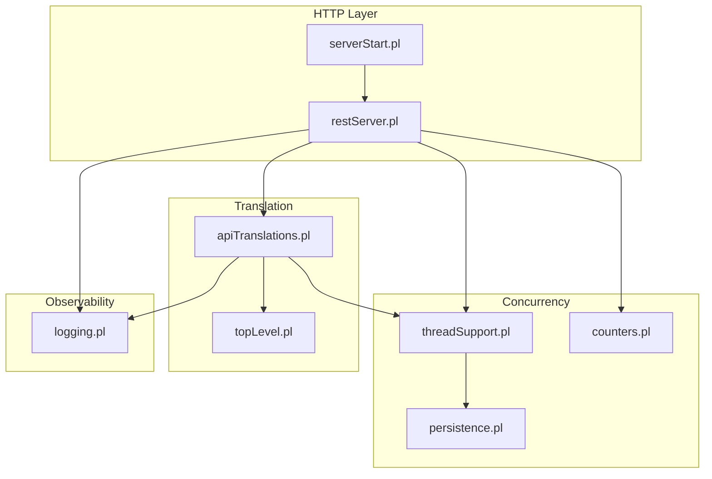
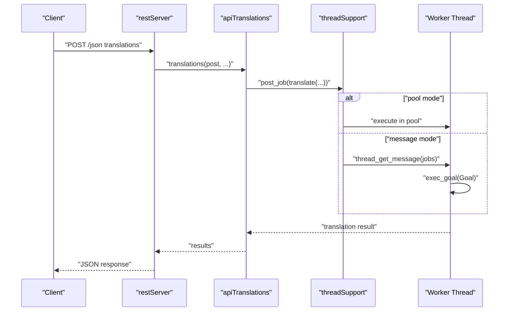
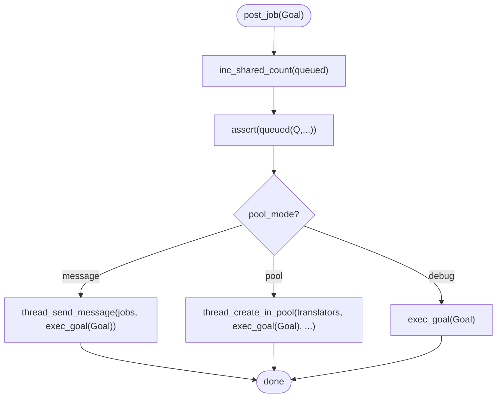
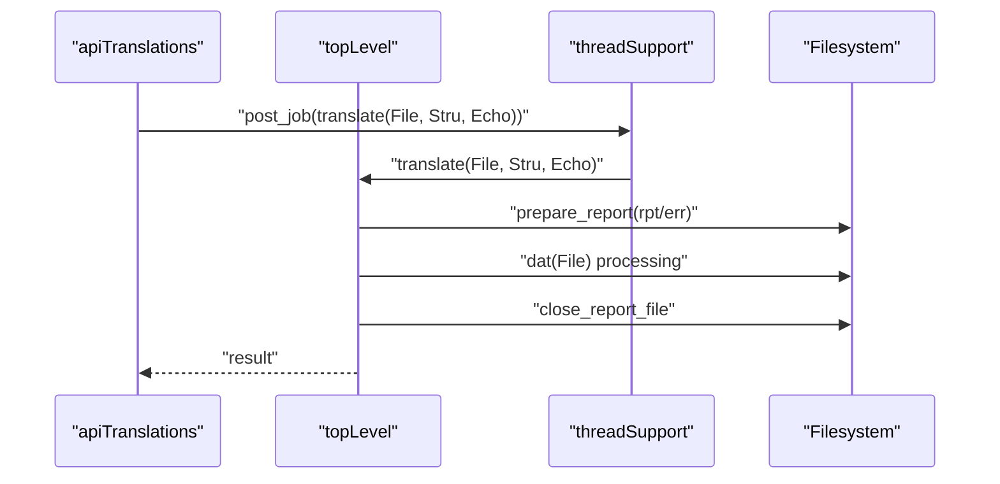
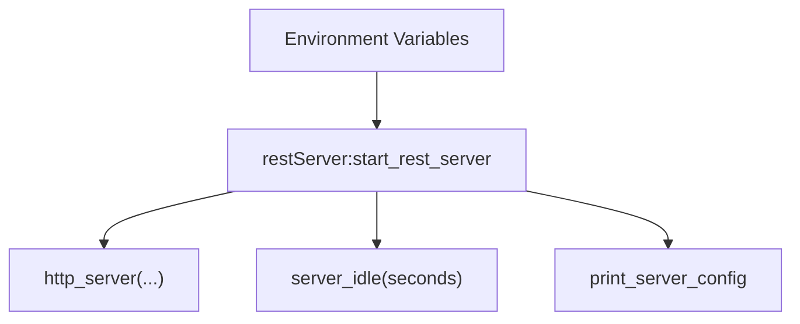
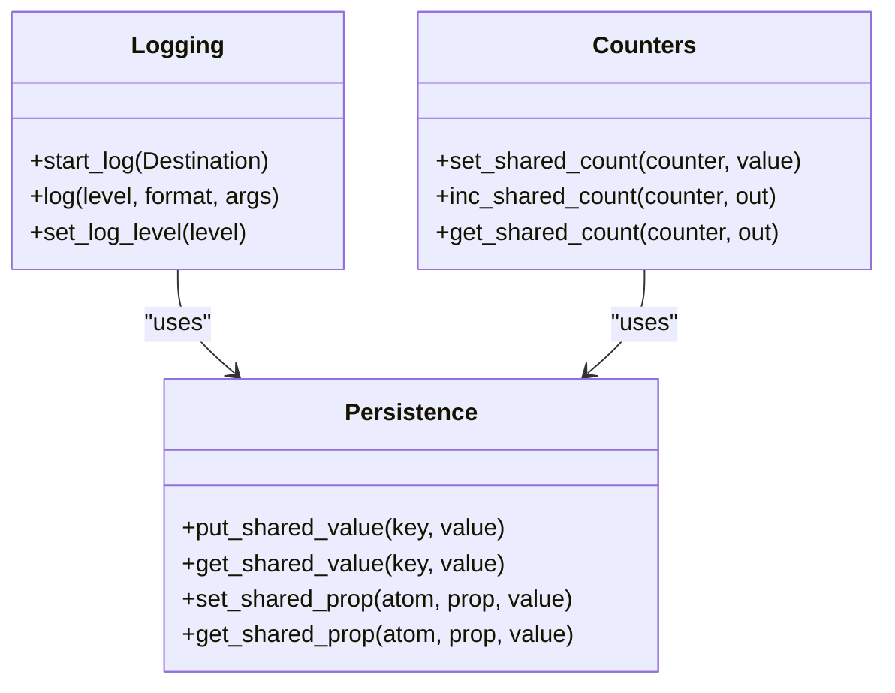
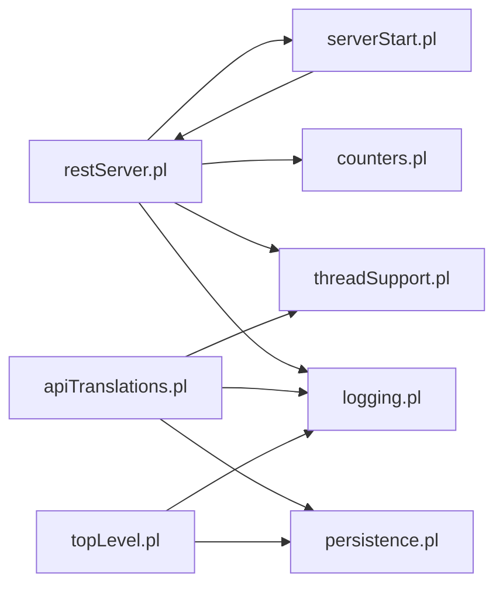

# Performance Optimization and Tuning

<cite>
**Referenced Files in This Document**
- [threadSupport.pl](file://src/threadSupport.pl)
- [apiTranslations.pl](file://src/apiTranslations.pl)
- [restServer.pl](file://src/restServer.pl)
- [serverStart.pl](file://src/serverStart.pl)
- [persistence.pl](file://src/persistence.pl)
- [logging.pl](file://src/logging.pl)
- [counters.pl](file://src/counters.pl)
- [topLevel.pl](file://src/topLevel.pl)
- [clioStart.pl](file://src/clioStart.pl)
- [run_tests.sh](file://tests/scripts/run_tests.sh)
- [kleio_start_server.sh](file://tests/scripts/kleio_start_server.sh)
</cite>

## Table of Contents
1. [Introduction](#introduction)
2. [Project Structure](#project-structure)
3. [Core Components](#core-components)
4. [Architecture Overview](#architecture-overview)
5. [Detailed Component Analysis](#detailed-component-analysis)
6. [Dependency Analysis](#dependency-analysis)
7. [Performance Considerations](#performance-considerations)
8. [Troubleshooting Guide](#troubleshooting-guide)
9. [Conclusion](#conclusion)
10. [Appendices](#appendices)

## Introduction
This document provides comprehensive guidance for performance optimization and system tuning in the Timelink Kleio framework. It explains the multi-threading architecture and concurrent processing model used to handle high-throughput translation workloads, details performance profiling techniques, memory usage optimization, and garbage collection tuning. It also covers query optimization, indexing strategies, and caching mechanisms, along with advanced topics such as distributed processing, load balancing, and horizontal scaling. Monitoring and observability techniques, memory management optimization, database connection pooling, and external service integration performance are addressed. Finally, it includes benchmarking methodologies, performance regression testing, continuous monitoring strategies, and troubleshooting guides for common performance issues.

## Project Structure
The performance-critical subsystems are organized around:
- REST and JSON-RPC server orchestration
- Worker thread pools and job dispatch
- Translation pipeline and synchronization
- Logging and counters for observability
- Environment-driven configuration for workers and timeouts

**Diagram sources**
- [restServer.pl](file://src/restServer.pl#L326-L350)
- [serverStart.pl](file://src/serverStart.pl#L50-L66)
- [threadSupport.pl](file://src/threadSupport.pl#L41-L63)
- [apiTranslations.pl](file://src/apiTranslations.pl#L52-L82)
- [topLevel.pl](file://src/topLevel.pl#L89-L95)
- [persistence.pl](file://src/persistence.pl#L55-L66)
- [logging.pl](file://src/logging.pl#L27-L31)
- [counters.pl](file://src/counters.pl#L61-L76)

**Section sources**
- [restServer.pl](file://src/restServer.pl#L1-L120)
- [serverStart.pl](file://src/serverStart.pl#L1-L120)
- [threadSupport.pl](file://src/threadSupport.pl#L1-L60)
- [apiTranslations.pl](file://src/apiTranslations.pl#L1-L60)
- [topLevel.pl](file://src/topLevel.pl#L1-L80)
- [persistence.pl](file://src/persistence.pl#L1-L40)
- [logging.pl](file://src/logging.pl#L1-L40)
- [counters.pl](file://src/counters.pl#L1-L40)

## Core Components
- REST and JSON-RPC server with configurable worker threads and timeouts
- Thread pool and message queue-based job dispatcher for translation tasks
- Shared counters and properties for runtime telemetry and coordination
- Logging subsystem with configurable destinations and levels
- Translation pipeline with synchronization and reporting

Key performance-relevant elements:
- Worker creation and selection modes (message queue vs thread pool)
- Job queuing and processing lifecycle
- Shared state for queued and processing jobs
- Request counters and idle detection for auto-shutdown
- Logging destination and level controls

**Section sources**
- [restServer.pl](file://src/restServer.pl#L175-L184)
- [restServer.pl](file://src/restServer.pl#L326-L350)
- [threadSupport.pl](file://src/threadSupport.pl#L31-L63)
- [threadSupport.pl](file://src/threadSupport.pl#L109-L125)
- [threadSupport.pl](file://src/threadSupport.pl#L140-L149)
- [persistence.pl](file://src/persistence.pl#L55-L107)
- [counters.pl](file://src/counters.pl#L61-L94)
- [logging.pl](file://src/logging.pl#L27-L40)

## Architecture Overview
The system uses a hybrid concurrency model:
- HTTP handlers accept requests and dispatch translation jobs
- Jobs are posted to a message queue or a dedicated thread pool depending on mode
- Workers execute translation goals with synchronization and reporting
- Observability tracks queued and processing jobs, logs, and counters

**Diagram sources**
- [restServer.pl](file://src/restServer.pl#L656-L727)
- [apiTranslations.pl](file://src/apiTranslations.pl#L52-L82)
- [threadSupport.pl](file://src/threadSupport.pl#L109-L125)
- [threadSupport.pl](file://src/threadSupport.pl#L64-L102)

## Detailed Component Analysis

### Multi-threading and Concurrency Model
- Worker creation supports:
  - Message queue mode: workers receive jobs via message queues
  - Thread pool mode: jobs dispatched to a managed pool with sizing parameters
  - Debug mode: synchronous execution for development
- Job lifecycle:
  - Enqueue with timestamps and metadata
  - Dequeue and execute with error handling and logging
  - Track processing state for monitoring

**Diagram sources**
- [threadSupport.pl](file://src/threadSupport.pl#L109-L125)
- [threadSupport.pl](file://src/threadSupport.pl#L49-L63)

**Section sources**
- [threadSupport.pl](file://src/threadSupport.pl#L31-L63)
- [threadSupport.pl](file://src/threadSupport.pl#L109-L125)
- [threadSupport.pl](file://src/threadSupport.pl#L140-L149)

### Translation Pipeline and Synchronization
- Translation entry points:
  - Single-file or multi-file translation
  - Structure file resolution and synchronization
- Synchronization:
  - Mutex-based protection per file to avoid contention
  - Structured report preparation and closure
- Status tracking:
  - Queued and processing queries for monitoring
  - Status filtering and caching for GET requests

**Diagram sources**
- [apiTranslations.pl](file://src/apiTranslations.pl#L439-L482)
- [topLevel.pl](file://src/topLevel.pl#L139-L160)
- [threadSupport.pl](file://src/threadSupport.pl#L70-L102)

**Section sources**
- [apiTranslations.pl](file://src/apiTranslations.pl#L433-L482)
- [topLevel.pl](file://src/topLevel.pl#L89-L160)
- [threadSupport.pl](file://src/threadSupport.pl#L70-L102)

### REST Server Configuration and Scaling
- Environment-driven configuration:
  - Worker threads, ports, CORS, idle timeout
- Auto-idle shutdown:
  - Detects when no jobs are queued or processing
- Startup variants:
  - Debug server, test server, forever loop

**Diagram sources**
- [restServer.pl](file://src/restServer.pl#L175-L184)
- [restServer.pl](file://src/restServer.pl#L326-L350)
- [serverStart.pl](file://src/serverStart.pl#L80-L92)

**Section sources**
- [restServer.pl](file://src/restServer.pl#L175-L184)
- [restServer.pl](file://src/restServer.pl#L326-L350)
- [serverStart.pl](file://src/serverStart.pl#L80-L92)

### Observability and Telemetry
- Logging:
  - Configurable destinations and levels
  - Timestamped entries with optional backtraces
- Counters:
  - Thread-local and shared counters for requests and jobs
- Shared properties:
  - Atom-keyed properties for cross-thread state

**Diagram sources**
- [logging.pl](file://src/logging.pl#L27-L40)
- [counters.pl](file://src/counters.pl#L61-L94)
- [persistence.pl](file://src/persistence.pl#L55-L107)

**Section sources**
- [logging.pl](file://src/logging.pl#L27-L40)
- [counters.pl](file://src/counters.pl#L61-L94)
- [persistence.pl](file://src/persistence.pl#L55-L107)

## Dependency Analysis
The following diagram shows key dependencies among performance-critical modules:

**Diagram sources**
- [restServer.pl](file://src/restServer.pl#L152-L162)
- [threadSupport.pl](file://src/threadSupport.pl#L20-L26)
- [apiTranslations.pl](file://src/apiTranslations.pl#L21-L32)
- [topLevel.pl](file://src/topLevel.pl#L54-L56)
- [serverStart.pl](file://src/serverStart.pl#L1-L12)
- [logging.pl](file://src/logging.pl#L19-L24)
- [counters.pl](file://src/counters.pl#L12-L14)
- [persistence.pl](file://src/persistence.pl#L17-L20)

**Section sources**
- [restServer.pl](file://src/restServer.pl#L152-L162)
- [threadSupport.pl](file://src/threadSupport.pl#L20-L26)
- [apiTranslations.pl](file://src/apiTranslations.pl#L21-L32)
- [topLevel.pl](file://src/topLevel.pl#L54-L56)
- [serverStart.pl](file://src/serverStart.pl#L1-L12)
- [logging.pl](file://src/logging.pl#L19-L24)
- [counters.pl](file://src/counters.pl#L12-L14)
- [persistence.pl](file://src/persistence.pl#L17-L20)

## Performance Considerations

### Multi-threading and Concurrency
- Worker mode selection:
  - Use pool mode for predictable throughput and resource limits
  - Use message mode for simpler setup or debugging
- Thread pool sizing:
  - Adjust worker count via environment variable for CPU-bound translation tasks
  - Monitor queued vs processing to tune concurrency
- Job distribution:
  - Enable parallel spawning to distribute workload across workers
  - Use spawn mode for independent files; fallback to single-worker for multi-structure scenarios

**Section sources**
- [threadSupport.pl](file://src/threadSupport.pl#L31-L63)
- [threadSupport.pl](file://src/threadSupport.pl#L109-L125)
- [apiTranslations.pl](file://src/apiTranslations.pl#L241-L254)
- [restServer.pl](file://src/restServer.pl#L179-L180)

### Memory Management and Garbage Collection
- Stack sizing:
  - Inspect local/global/trail stacks for adequate headroom
- Logging destination:
  - Redirect logs to files to reduce stdout overhead
- Report lifecycle:
  - Prepare and close reports promptly to minimize resource retention

**Section sources**
- [serverStart.pl](file://src/serverStart.pl#L285-L294)
- [logging.pl](file://src/logging.pl#L132-L155)
- [topLevel.pl](file://src/topLevel.pl#L146-L160)

### Query Optimization and Caching
- Status caching:
  - Cache translation status results for repeated GET requests
  - Tune cache age and size thresholds to balance freshness and performance
- Filtering:
  - Filter by status to avoid reprocessing unchanged files

**Section sources**
- [apiTranslations.pl](file://src/apiTranslations.pl#L168-L232)
- [apiTranslations.pl](file://src/apiTranslations.pl#L597-L611)

### Indexing Strategies
- File system:
  - Place source and structure files on fast disks; avoid network mounts for hot paths
- Directory layout:
  - Keep related files grouped to minimize directory traversal overhead

[No sources needed since this section provides general guidance]

### Distributed Processing and Horizontal Scaling
- Load balancing:
  - Run multiple instances behind a load balancer
  - Use consistent hashing or round-robin to distribute translation requests
- Coordination:
  - Use shared storage or a message bus for job distribution
- Health checks:
  - Implement idle detection and graceful shutdown for auto-scaling

**Section sources**
- [serverStart.pl](file://src/serverStart.pl#L80-L92)

### Monitoring and Observability
- Metrics:
  - Track REST and JSON-RPC request counts
  - Monitor queued and processing job counts
- Logging:
  - Set appropriate log levels for production
  - Persist logs to files for later analysis
- Idle shutdown:
  - Use idle detection to conserve resources when inactive

**Section sources**
- [restServer.pl](file://src/restServer.pl#L434-L447)
- [counters.pl](file://src/counters.pl#L61-L94)
- [logging.pl](file://src/logging.pl#L89-L113)
- [serverStart.pl](file://src/serverStart.pl#L80-L92)

### Benchmarking and Regression Testing
- Automated tests:
  - Use scripts to launch servers and run translations
  - Compare outputs against reference baselines
- Methodology:
  - Measure wall-clock time per translation set
  - Record request counts and queue depths
  - Repeat under varying concurrency levels

**Section sources**
- [run_tests.sh](file://tests/scripts/run_tests.sh#L1-L39)
- [kleio_start_server.sh](file://tests/scripts/kleio_start_server.sh#L1-L22)

## Troubleshooting Guide

### Common Performance Issues and Resolution Approaches
- High queue times:
  - Increase worker threads or switch to pool mode
  - Verify spawn option for independent files
- Memory pressure:
  - Redirect logs to files; reduce log level
  - Close reports promptly; avoid excessive buffering
- Idle server shutdown:
  - Confirm idle detection logic and thresholds
- Slow translations:
  - Profile translation steps and optimize structure files
  - Ensure sufficient disk I/O bandwidth

**Section sources**
- [restServer.pl](file://src/restServer.pl#L175-L184)
- [logging.pl](file://src/logging.pl#L132-L155)
- [topLevel.pl](file://src/topLevel.pl#L146-L160)
- [serverStart.pl](file://src/serverStart.pl#L80-L92)

## Conclusion
The Timelink Kleio framework employs a robust, configurable concurrency model with explicit observability hooks to support high-throughput translation workloads. By tuning worker pools, leveraging caching, optimizing file placement, and instrumenting logs and counters, operators can achieve predictable performance and scalability. The included scripts and environment-driven configuration enable repeatable benchmarking and regression testing, supporting continuous performance monitoring and improvement.

## Appendices

### Environment Variables and Configuration
- KLEIO_SERVER_WORKERS: Number of REST worker threads
- KLEIO_SERVER_PORT: REST server port
- KLEIO_IDLE_TIMEOUT: Idle timeout for auto-shutdown
- KLEIO_ADMIN_TOKEN: Admin token for bootstrap and management
- KLEIO_DEBUGGER_PORT: Debug server port
- KLEIO_CORS_SITES: CORS origins

**Section sources**
- [restServer.pl](file://src/restServer.pl#L107-L120)
- [restServer.pl](file://src/restServer.pl#L175-L184)

### Startup Entrypoints
- CLI entrypoint for interactive use
- Server startup predicates for development and testing

**Section sources**
- [clioStart.pl](file://src/clioStart.pl#L1-L4)
- [serverStart.pl](file://src/serverStart.pl#L50-L66)