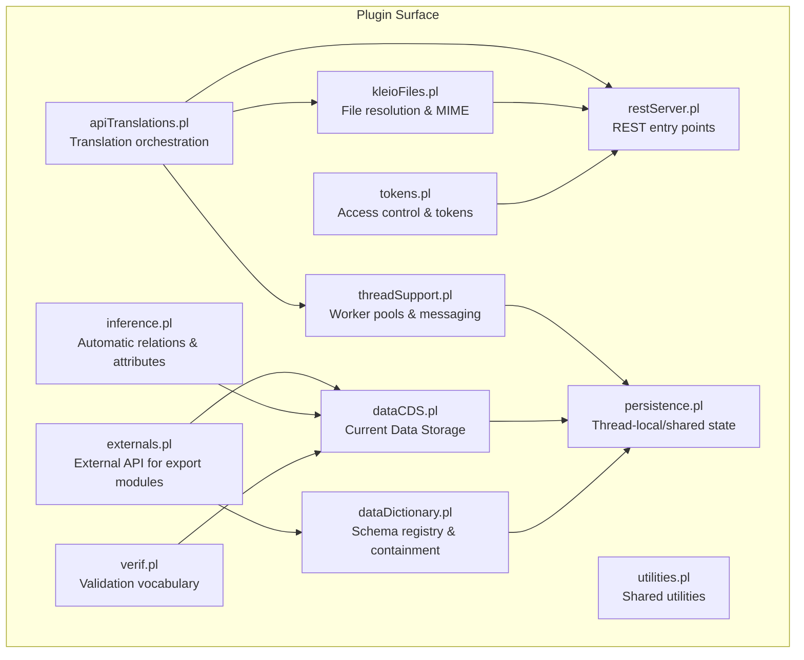
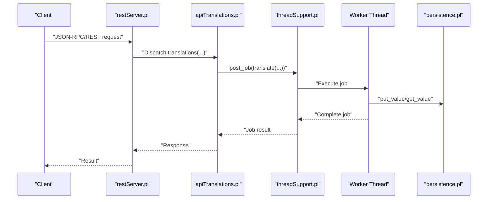
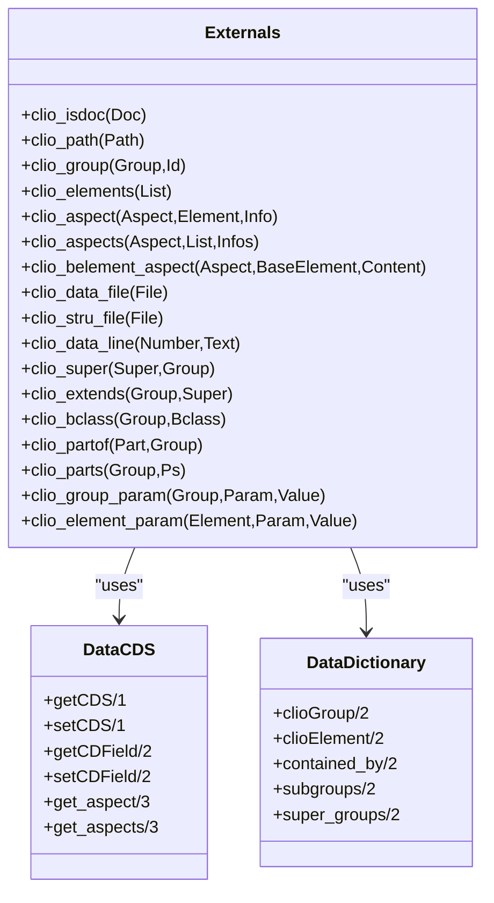
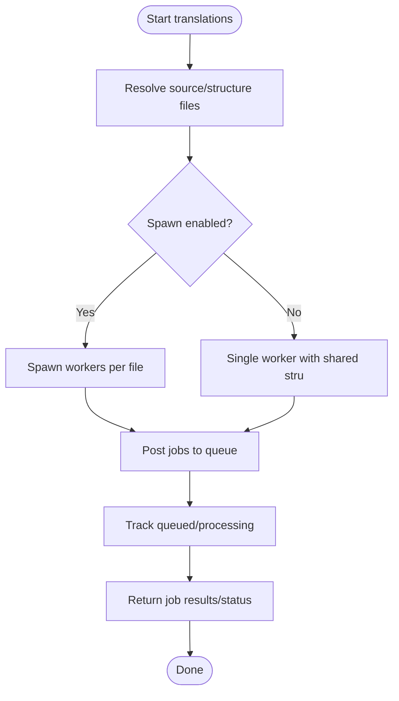
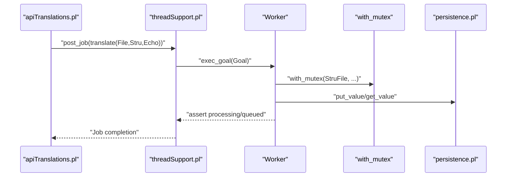
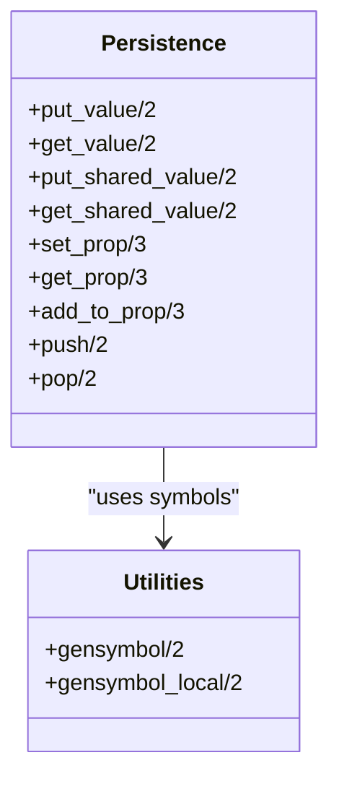
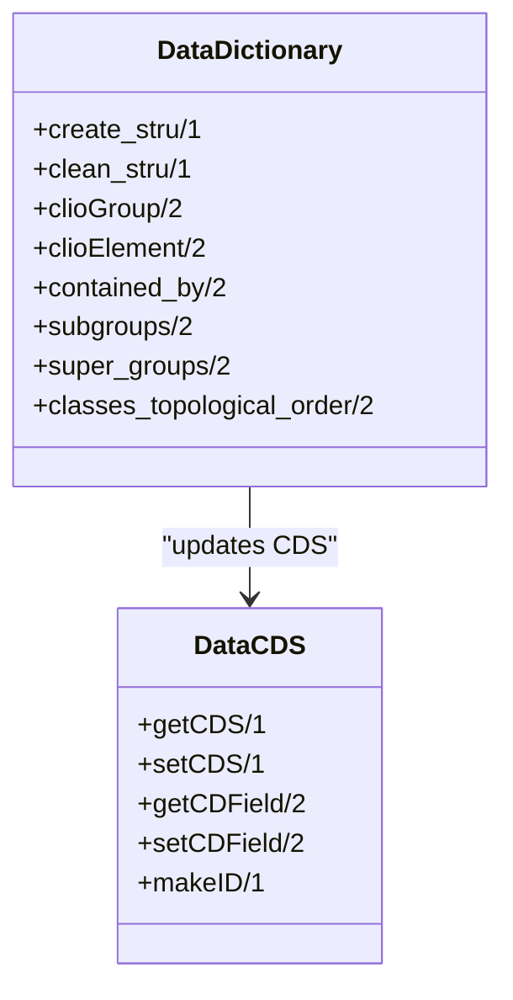
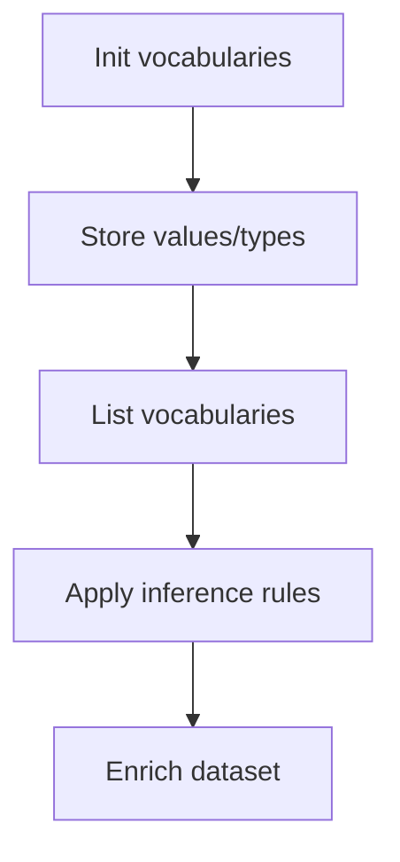
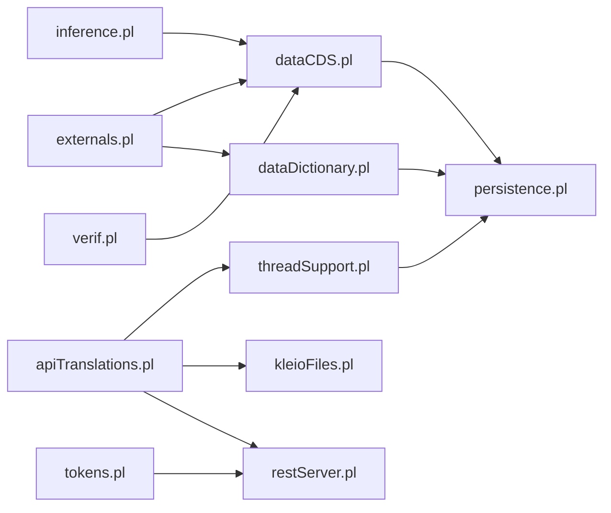

# Plugin and Extension Development

<cite>
**Referenced Files in This Document**
- [src/externals.pl](file://src/externals.pl)
- [src/apiTranslations.pl](file://src/apiTranslations.pl)
- [src/threadSupport.pl](file://src/threadSupport.pl)
- [src/persistence.pl](file://src/persistence.pl)
- [src/dataCDS.pl](file://src/dataCDS.pl)
- [src/dataDictionary.pl](file://src/dataDictionary.pl)
- [src/utilities.pl](file://src/utilities.pl)
- [src/verif.pl](file://src/verif.pl)
- [src/inference.pl](file://src/inference.pl)
- [src/kleioFiles.pl](file://src/kleioFiles.pl)
- [src/restServer.pl](file://src/restServer.pl)
- [src/tokens.pl](file://src/tokens.pl)
- [AGENTS.md](file://AGENTS.md)
</cite>

## Table of Contents
1. [Introduction](#introduction)
2. [Project Structure](#project-structure)
3. [Core Components](#core-components)
4. [Architecture Overview](#architecture-overview)
5. [Detailed Component Analysis](#detailed-component-analysis)
6. [Dependency Analysis](#dependency-analysis)
7. [Performance Considerations](#performance-considerations)
8. [Troubleshooting Guide](#troubleshooting-guide)
9. [Conclusion](#conclusion)
10. [Appendices](#appendices)

## Introduction
This document explains how to develop plugins and extensions for the Timelink Kleio system, a Prolog-based framework for historical source processing. It focuses on the plugin architecture, extension points for translation processors, validation rules, and specialized data handlers. It also covers multi-user execution, threading and concurrency, memory management, resource isolation, persistence integration, hot-swapping, version compatibility, dependency resolution, security, sandboxing, and packaging/distribution strategies.

## Project Structure
Kleio’s plugin surface is primarily exposed through:
- External API predicates for export modules and translators
- Translation orchestration and job scheduling
- Thread pools and message queues for multi-user concurrency
- Persistence and shared state management
- Data dictionary and current data storage for schema-aware processing
- Validation and inference engines
- File resolution and MIME handling for diverse input formats

**Diagram sources**
- [src/externals.pl](file://src/externals.pl#L1-L288)
- [src/apiTranslations.pl](file://src/apiTranslations.pl#L1-L779)
- [src/threadSupport.pl](file://src/threadSupport.pl#L1-L153)
- [src/persistence.pl](file://src/persistence.pl#L1-L392)
- [src/dataCDS.pl](file://src/dataCDS.pl#L1-L591)
- [src/dataDictionary.pl](file://src/dataDictionary.pl#L1-L800)
- [src/utilities.pl](file://src/utilities.pl#L1-L371)
- [src/verif.pl](file://src/verif.pl#L1-L62)
- [src/inference.pl](file://src/inference.pl#L1-L800)
- [src/kleioFiles.pl](file://src/kleioFiles.pl#L332-L849)
- [src/restServer.pl](file://src/restServer.pl#L1109-L1140)
- [src/tokens.pl](file://src/tokens.pl#L104-L426)

**Section sources**
- [src/externals.pl](file://src/externals.pl#L1-L288)
- [src/apiTranslations.pl](file://src/apiTranslations.pl#L1-L779)
- [src/threadSupport.pl](file://src/threadSupport.pl#L1-L153)
- [src/persistence.pl](file://src/persistence.pl#L1-L392)
- [src/dataCDS.pl](file://src/dataCDS.pl#L1-L591)
- [src/dataDictionary.pl](file://src/dataDictionary.pl#L1-L800)
- [src/utilities.pl](file://src/utilities.pl#L1-L371)
- [src/verif.pl](file://src/verif.pl#L1-L62)
- [src/inference.pl](file://src/inference.pl#L1-L800)
- [src/kleioFiles.pl](file://src/kleioFiles.pl#L332-L849)
- [src/restServer.pl](file://src/restServer.pl#L1109-L1140)
- [src/tokens.pl](file://src/tokens.pl#L104-L426)

## Core Components
- External API for export modules: Provides predicates to access the current group, elements, aspects, and processing metadata. See [externals.pl](file://src/externals.pl#L26-L197).
- Translation orchestration: Starts, tracks, and manages translation jobs, supports spawning workers, and resolves structure files. See [apiTranslations.pl](file://src/apiTranslations.pl#L34-L482).
- Threading and concurrency: Worker pools and message queues for multi-user execution. See [threadSupport.pl](file://src/threadSupport.pl#L33-L124).
- Persistence: Thread-local and shared properties for inter-module state. See [persistence.pl](file://src/persistence.pl#L33-L107).
- Data dictionary and current data storage: Schema registry and runtime data buffer. See [dataDictionary.pl](file://src/dataDictionary.pl#L110-L146) and [dataCDS.pl](file://src/dataCDS.pl#L140-L234).
- Validation and inference: Vocabulary validation and automatic relation/attribute generation. See [verif.pl](file://src/verif.pl#L10-L61) and [inference.pl](file://src/inference.pl#L1-L800).
- File resolution and MIME: Resolves relative/absolute paths and determines MIME types. See [kleioFiles.pl](file://src/kleioFiles.pl#L332-L849).
- REST and tokens: JSON-RPC/REST entry points and access control. See [restServer.pl](file://src/restServer.pl#L1109-L1140) and [tokens.pl](file://src/tokens.pl#L104-L426).

**Section sources**
- [src/externals.pl](file://src/externals.pl#L26-L197)
- [src/apiTranslations.pl](file://src/apiTranslations.pl#L34-L482)
- [src/threadSupport.pl](file://src/threadSupport.pl#L33-L124)
- [src/persistence.pl](file://src/persistence.pl#L33-L107)
- [src/dataCDS.pl](file://src/dataCDS.pl#L140-L234)
- [src/dataDictionary.pl](file://src/dataDictionary.pl#L110-L146)
- [src/verif.pl](file://src/verif.pl#L10-L61)
- [src/inference.pl](file://src/inference.pl#L1-L800)
- [src/kleioFiles.pl](file://src/kleioFiles.pl#L332-L849)
- [src/restServer.pl](file://src/restServer.pl#L1109-L1140)
- [src/tokens.pl](file://src/tokens.pl#L104-L426)

## Architecture Overview
Kleio’s plugin architecture centers on:
- An external API that export modules call to inspect the current data and schema.
- A translation pipeline that spawns jobs, resolves structure files, and coordinates processing.
- A thread pool that isolates execution contexts and synchronizes access to shared resources.
- A persistence layer that stores thread-local and shared properties.
- A data dictionary that defines groups, elements, and containment relationships.
- Optional validation and inference modules that enrich the dataset.

**Diagram sources**
- [src/restServer.pl](file://src/restServer.pl#L1109-L1140)
- [src/apiTranslations.pl](file://src/apiTranslations.pl#L141-L163)
- [src/threadSupport.pl](file://src/threadSupport.pl#L104-L124)
- [src/persistence.pl](file://src/persistence.pl#L33-L65)

**Section sources**
- [src/restServer.pl](file://src/restServer.pl#L1109-L1140)
- [src/apiTranslations.pl](file://src/apiTranslations.pl#L141-L163)
- [src/threadSupport.pl](file://src/threadSupport.pl#L104-L124)
- [src/persistence.pl](file://src/persistence.pl#L33-L65)

## Detailed Component Analysis

### External API for Export Modules
The external interface exposes:
- Current group and path accessors
- Element enumeration and aspects
- Processing metadata (data/structure files, current line)
- Data dictionary navigation (superclasses, base classes, containment)
- Base element aspect lookup

**Diagram sources**
- [src/externals.pl](file://src/externals.pl#L106-L197)
- [src/dataCDS.pl](file://src/dataCDS.pl#L140-L234)
- [src/dataDictionary.pl](file://src/dataDictionary.pl#L347-L391)

**Section sources**
- [src/externals.pl](file://src/externals.pl#L26-L197)
- [src/dataCDS.pl](file://src/dataCDS.pl#L140-L234)
- [src/dataDictionary.pl](file://src/dataDictionary.pl#L347-L391)

### Translation Orchestration and Job Execution
The translation API:
- Validates permissions via tokens
- Resolves source and structure files
- Spawns jobs (single or parallel)
- Tracks queued and processing jobs
- Produces status and results

**Diagram sources**
- [src/apiTranslations.pl](file://src/apiTranslations.pl#L52-L82)
- [src/apiTranslations.pl](file://src/apiTranslations.pl#L241-L259)
- [src/apiTranslations.pl](file://src/apiTranslations.pl#L644-L721)

**Section sources**
- [src/apiTranslations.pl](file://src/apiTranslations.pl#L52-L82)
- [src/apiTranslations.pl](file://src/apiTranslations.pl#L241-L259)
- [src/apiTranslations.pl](file://src/apiTranslations.pl#L644-L721)

### Threading, Concurrency, and Resource Isolation
Workers are managed via:
- Message queues or thread pools
- Shared state guarded by mutexes
- Per-thread property storage
- Contention control via file/stru mutexes during processing

**Diagram sources**
- [src/threadSupport.pl](file://src/threadSupport.pl#L49-L68)
- [src/threadSupport.pl](file://src/threadSupport.pl#L104-L124)
- [src/apiTranslations.pl](file://src/apiTranslations.pl#L439-L455)
- [src/persistence.pl](file://src/persistence.pl#L33-L65)

**Section sources**
- [src/threadSupport.pl](file://src/threadSupport.pl#L49-L68)
- [src/threadSupport.pl](file://src/threadSupport.pl#L104-L124)
- [src/apiTranslations.pl](file://src/apiTranslations.pl#L439-L455)
- [src/persistence.pl](file://src/persistence.pl#L33-L65)

### Persistence Layer Integration
Persistence supports:
- Thread-local values and properties
- Shared values and properties with mutex protection
- Property lists and stacks
- Atom-to-atom property maps

**Diagram sources**
- [src/persistence.pl](file://src/persistence.pl#L33-L107)
- [src/utilities.pl](file://src/utilities.pl#L184-L228)

**Section sources**
- [src/persistence.pl](file://src/persistence.pl#L33-L107)
- [src/utilities.pl](file://src/utilities.pl#L184-L228)

### Data Dictionary and Current Data Storage
The data dictionary maintains:
- Group and element definitions
- Containment and inheritance relationships
- Topological ordering and hierarchy traversal

Current data storage holds:
- The active group path, group, element, and aspects
- Entry lists for core/original/comment
- ID generation and control fields

**Diagram sources**
- [src/dataDictionary.pl](file://src/dataDictionary.pl#L110-L146)
- [src/dataDictionary.pl](file://src/dataDictionary.pl#L656-L682)
- [src/dataCDS.pl](file://src/dataCDS.pl#L140-L234)

**Section sources**
- [src/dataDictionary.pl](file://src/dataDictionary.pl#L110-L146)
- [src/dataDictionary.pl](file://src/dataDictionary.pl#L656-L682)
- [src/dataCDS.pl](file://src/dataCDS.pl#L140-L234)

### Validation and Inference Extensions
Validation:
- Vocabulary initialization and storage for life stories and relationships
- Lists of stored attributes/values and types/variants

Inference:
- Rule engine with pattern matching across sequences and groups
- Automatic relation and attribute generation

**Diagram sources**
- [src/verif.pl](file://src/verif.pl#L10-L61)
- [src/inference.pl](file://src/inference.pl#L1-L800)

**Section sources**
- [src/verif.pl](file://src/verif.pl#L10-L61)
- [src/inference.pl](file://src/inference.pl#L1-L800)

### File Resolution and MIME Handling
- Relative-to-absolute resolution for sources and structures
- MIME type detection for Kleio file types

**Section sources**
- [src/kleioFiles.pl](file://src/kleioFiles.pl#L332-L849)

### Security, Sandboxing, and Access Control
- Token-based access control for API endpoints
- Permission checks before processing
- Optional sandboxing via thread isolation and mutex-protected shared state

**Section sources**
- [src/tokens.pl](file://src/tokens.pl#L104-L426)
- [src/apiTranslations.pl](file://src/apiTranslations.pl#L52-L63)

## Dependency Analysis
Inter-module dependencies and extension points:

**Diagram sources**
- [src/externals.pl](file://src/externals.pl#L100-L104)
- [src/apiTranslations.pl](file://src/apiTranslations.pl#L21-L32)
- [src/threadSupport.pl](file://src/threadSupport.pl#L20-L25)
- [src/persistence.pl](file://src/persistence.pl#L17-L18)
- [src/dataCDS.pl](file://src/dataCDS.pl#L83-L88)
- [src/dataDictionary.pl](file://src/dataDictionary.pl#L87-L99)
- [src/inference.pl](file://src/inference.pl#L1-L7)
- [src/verif.pl](file://src/verif.pl#L1-L9)
- [src/kleioFiles.pl](file://src/kleioFiles.pl#L332-L360)
- [src/restServer.pl](file://src/restServer.pl#L1109-L1140)
- [src/tokens.pl](file://src/tokens.pl#L104-L138)

**Section sources**
- [src/externals.pl](file://src/externals.pl#L100-L104)
- [src/apiTranslations.pl](file://src/apiTranslations.pl#L21-L32)
- [src/threadSupport.pl](file://src/threadSupport.pl#L20-L25)
- [src/persistence.pl](file://src/persistence.pl#L17-L18)
- [src/dataCDS.pl](file://src/dataCDS.pl#L83-L88)
- [src/dataDictionary.pl](file://src/dataDictionary.pl#L87-L99)
- [src/inference.pl](file://src/inference.pl#L1-L7)
- [src/verif.pl](file://src/verif.pl#L1-L9)
- [src/kleioFiles.pl](file://src/kleioFiles.pl#L332-L360)
- [src/restServer.pl](file://src/restServer.pl#L1109-L1140)
- [src/tokens.pl](file://src/tokens.pl#L104-L138)

## Performance Considerations
- Use spawn mode judiciously; single-worker mode reduces contention for shared structure processing.
- Leverage caching for translation status to avoid repeated filesystem scans.
- Keep per-thread properties minimal; prefer shared properties only when necessary.
- Use mutexes around file/stru-bound operations to prevent race conditions.
- Monitor thread pool backlog and adjust worker counts based on workload.

[No sources needed since this section provides general guidance]

## Troubleshooting Guide
- Forbidden errors: Verify token permissions and endpoint access.
- Structure file resolution failures: Confirm structure path resolution and existence.
- Job queueing vs processing: Inspect queued/processing lists to diagnose bottlenecks.
- Memory and resource issues: Reduce spawn usage, limit concurrent jobs, and ensure proper cleanup.

**Section sources**
- [src/apiTranslations.pl](file://src/apiTranslations.pl#L52-L63)
- [src/apiTranslations.pl](file://src/apiTranslations.pl#L176-L232)
- [src/threadSupport.pl](file://src/threadSupport.pl#L137-L149)

## Conclusion
Kleio’s plugin architecture leverages a well-defined external API, robust translation orchestration, and a thread-safe persistence model. Developers can extend the system by implementing custom translation processors, validation rules, and inference logic while adhering to the threading and isolation patterns. Proper use of tokens, mutexes, and caching ensures secure, scalable, and maintainable plugin development.

[No sources needed since this section summarizes without analyzing specific files]

## Appendices

### Plugin Development Guidelines
- Implement translation processors using the external API predicates to read current data and schema.
- Respect spawn/no-spawn modes depending on whether shared structure processing is required.
- Use persistence for inter-module state and avoid global mutable state.
- Apply validation and inference rules to enrich datasets consistently.
- Integrate with REST endpoints and tokens for access control.

**Section sources**
- [src/externals.pl](file://src/externals.pl#L26-L197)
- [src/apiTranslations.pl](file://src/apiTranslations.pl#L48-L82)
- [src/persistence.pl](file://src/persistence.pl#L33-L107)
- [src/verif.pl](file://src/verif.pl#L10-L61)
- [src/inference.pl](file://src/inference.pl#L1-L800)
- [AGENTS.md](file://AGENTS.md#L136-L144)

### Examples Index
- External service integration: Use REST endpoints and tokens to trigger translation jobs and retrieve results.
- Custom file format support: Extend file resolution and MIME handling to support new input formats.
- Specialized processing workflows: Implement custom validation and inference rules tailored to domain-specific semantics.

**Section sources**
- [src/restServer.pl](file://src/restServer.pl#L1109-L1140)
- [src/tokens.pl](file://src/tokens.pl#L104-L426)
- [src/kleioFiles.pl](file://src/kleioFiles.pl#L332-L849)
- [src/verif.pl](file://src/verif.pl#L10-L61)
- [src/inference.pl](file://src/inference.pl#L1-L800)