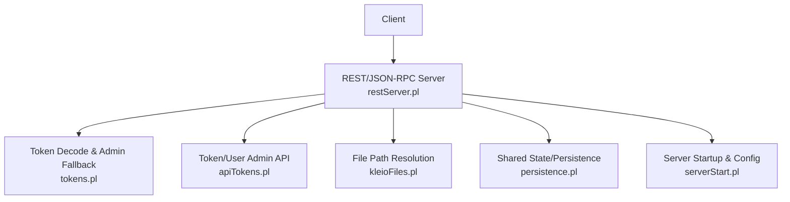
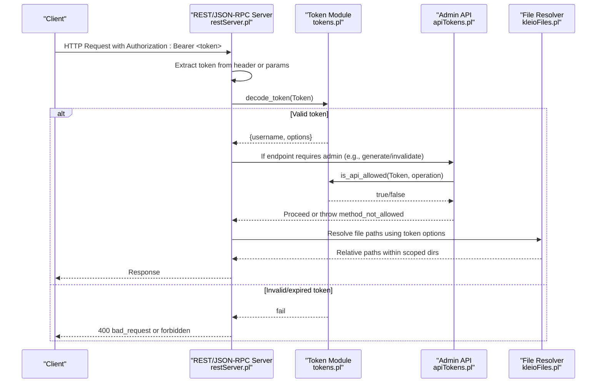
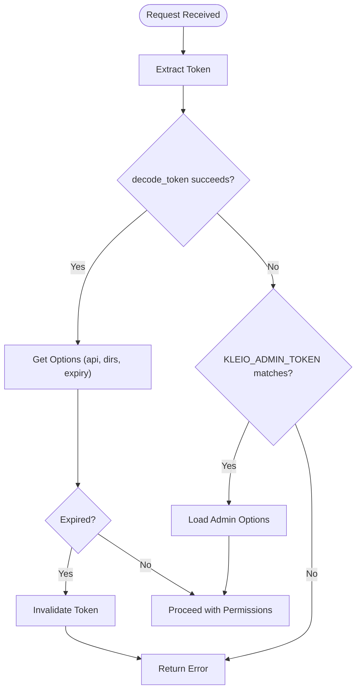
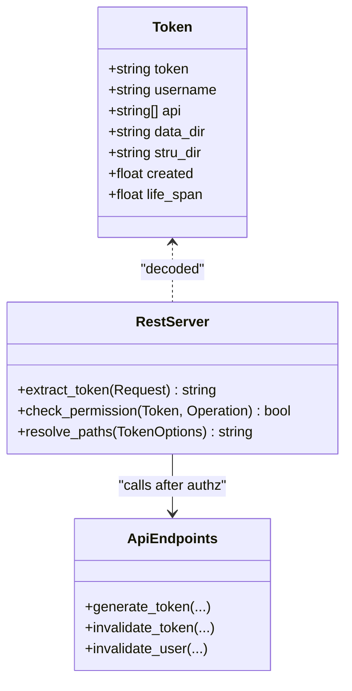
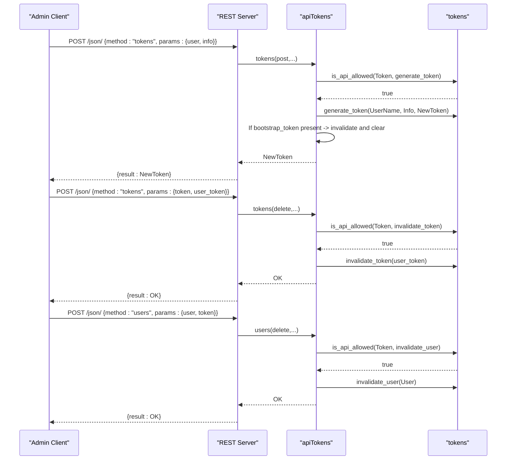
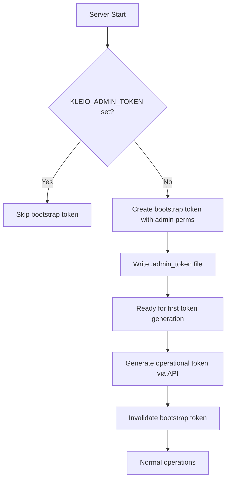
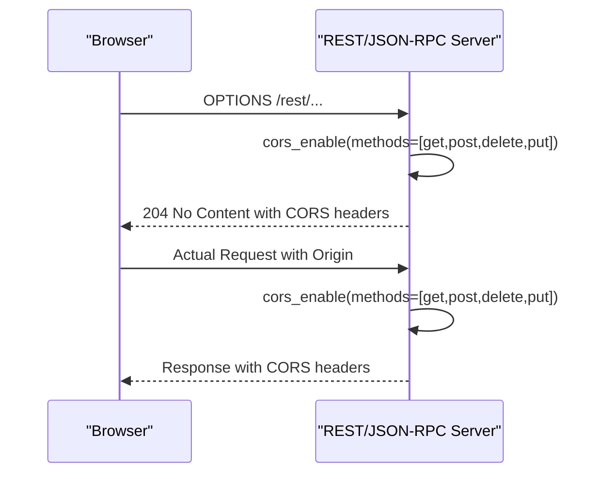
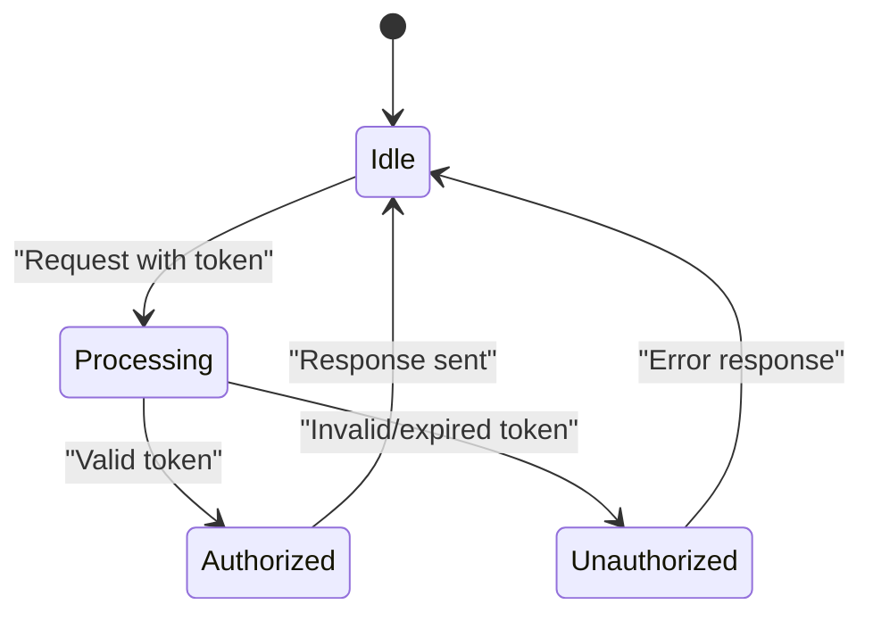
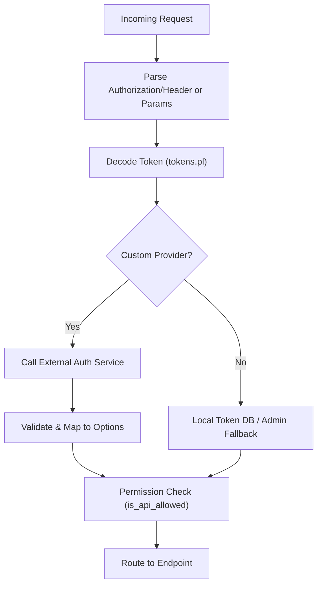
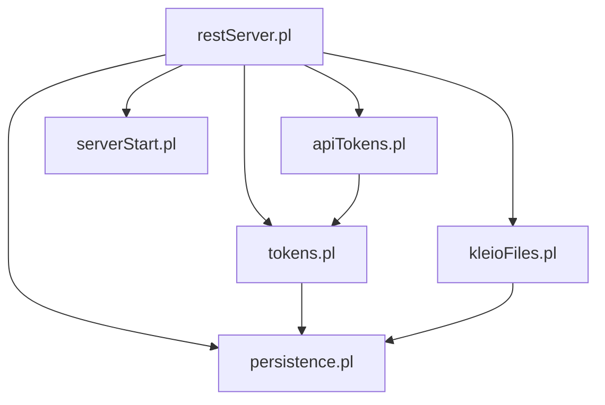

# Authentication and Security

<cite>
**Referenced Files in This Document**
- [restServer.pl](file://src/restServer.pl)
- [tokens.pl](file://src/tokens.pl)
- [apiTokens.pl](file://src/apiTokens.pl)
- [kleioFiles.pl](file://src/kleioFiles.pl)
- [persistence.pl](file://src/persistence.pl)
- [serverStart.pl](file://src/serverStart.pl)
</cite>

## Table of Contents
1. [Introduction](#introduction)
2. [Project Structure](#project-structure)
3. [Core Components](#core-components)
4. [Architecture Overview](#architecture-overview)
5. [Detailed Component Analysis](#detailed-component-analysis)
6. [Dependency Analysis](#dependency-analysis)
7. [Performance Considerations](#performance-considerations)
8. [Troubleshooting Guide](#troubleshooting-guide)
9. [Conclusion](#conclusion)
10. [Appendices](#appendices)

## Introduction
This document explains the authentication and security model for Kleio translation services. It covers token-based authentication, token lifecycle management, permission models, user administration, CORS configuration, access control mechanisms, bootstrap token generation, token invalidation, session management, production hardening guidance, custom authentication provider considerations, and monitoring of security events. The goal is to provide both a conceptual overview and code-level details so that operators and developers can secure deployments effectively.

## Project Structure
The authentication and security features are implemented across several core modules:
- REST/JSON-RPC server entry points and request processing
- Token persistence and validation
- API endpoints for token and user administration
- File path resolution and isolation
- Shared state and persistence utilities
- Server startup and environment configuration

**Diagram sources**
- [restServer.pl:491-515](file://src/restServer.pl#L491-L515)
- [tokens.pl:141-176](file://src/tokens.pl#L141-L176)
- [apiTokens.pl:18-40](file://src/apiTokens.pl#L18-L40)
- [kleioFiles.pl:773-797](file://src/kleioFiles.pl#L773-L797)
- [persistence.pl:55-66](file://src/persistence.pl#L55-L66)
- [serverStart.pl:165-188](file://src/serverStart.pl#L165-L188)

**Section sources**
- [restServer.pl:131-162](file://src/restServer.pl#L131-L162)
- [tokens.pl:1-47](file://src/tokens.pl#L1-L47)
- [apiTokens.pl:1-16](file://src/apiTokens.pl#L1-L16)
- [kleioFiles.pl:468-504](file://src/kleioFiles.pl#L468-L504)
- [persistence.pl:21-31](file://src/persistence.pl#L21-L31)
- [serverStart.pl:1-11](file://src/serverStart.pl#L1-L11)

## Core Components
- Token-based authentication: Every request must include an Authorization header with a Bearer token or a JSON-RPC parameter named token. Tokens map to a username and options (API permissions, data/structure directories).
- Permission model: Each token carries an api list of allowed operations. Endpoints check permissions before executing actions.
- Bootstrap token: On first run without admin token, the server creates a short-lived bootstrap token to allow initial token creation.
- User administration: Admin-capable tokens can generate new tokens and invalidate existing ones or revoke all tokens for a user.
- CORS: The server enables Cross-Origin Resource Sharing based on configuration.
- Access control: Uploads require explicit upload permission; file paths are resolved relative to token-scoped directories.

Key responsibilities by module:
- restServer.pl: Request routing, CORS, token extraction, authorization checks, error handling, and response formatting.
- tokens.pl: Token storage, decoding, expiration checks, admin fallback, and permission evaluation.
- apiTokens.pl: REST endpoints for token and user administration.
- kleioFiles.pl: Resolves absolute vs relative paths and enforces per-token directory scoping.
- persistence.pl: Thread-safe shared properties and values used for bootstrap tokens and runtime state.
- serverStart.pl: Environment setup and server initialization.

**Section sources**
- [restServer.pl:491-515](file://src/restServer.pl#L491-L515)
- [restServer.pl:615-625](file://src/restServer.pl#L615-L625)
- [tokens.pl:141-176](file://src/tokens.pl#L141-L176)
- [tokens.pl:249-257](file://src/tokens.pl#L249-L257)
- [apiTokens.pl:71-88](file://src/apiTokens.pl#L71-L88)
- [kleioFiles.pl:773-797](file://src/kleioFiles.pl#L773-L797)
- [persistence.pl:55-66](file://src/persistence.pl#L55-L66)
- [serverStart.pl:165-188](file://src/serverStart.pl#L165-L188)

## Architecture Overview
The request flow integrates authentication, authorization, and resource access controls.

**Diagram sources**
- [restServer.pl:491-515](file://src/restServer.pl#L491-L515)
- [restServer.pl:615-625](file://src/restServer.pl#L615-L625)
- [tokens.pl:141-176](file://src/tokens.pl#L141-L176)
- [apiTokens.pl:71-88](file://src/apiTokens.pl#L71-L88)
- [kleioFiles.pl:773-797](file://src/kleioFiles.pl#L773-L797)

## Detailed Component Analysis

### Token Lifecycle Management
- Generation: Admin-capable tokens call the token generation endpoint to create a new token bound to a user and options (API permissions, data/structure directories, optional expiry).
- Decoding: Incoming requests are decoded to extract username and options. An admin fallback allows a special environment-provided token to act as KLEIO_ADMIN.
- Expiration: Tokens may carry a life_span; expired tokens are automatically invalidated upon use.
- Invalidation: Individual tokens or all tokens for a user can be revoked.

**Diagram sources**
- [tokens.pl:141-176](file://src/tokens.pl#L141-L176)
- [tokens.pl:259-281](file://src/tokens.pl#L259-L281)
- [restServer.pl:615-625](file://src/restServer.pl#L615-L625)

**Section sources**
- [tokens.pl:104-139](file://src/tokens.pl#L104-L139)
- [tokens.pl:141-176](file://src/tokens.pl#L141-L176)
- [tokens.pl:259-281](file://src/tokens.pl#L259-L281)
- [apiTokens.pl:71-88](file://src/apiTokens.pl#L71-L88)

### Permission Model and Access Control
- Each token includes an api list of permitted operations. Endpoints verify permissions via is_api_allowed before execution.
- Uploads require explicit upload permission; otherwise, a forbidden response is returned.
- Directory scoping: Paths are resolved relative to token-scoped directories to prevent cross-user access.

**Diagram sources**
- [tokens.pl:249-257](file://src/tokens.pl#L249-L257)
- [restServer.pl:590-600](file://src/restServer.pl#L590-L600)
- [kleioFiles.pl:773-797](file://src/kleioFiles.pl#L773-L797)

**Section sources**
- [tokens.pl:249-257](file://src/tokens.pl#L249-L257)
- [restServer.pl:590-600](file://src/restServer.pl#L590-L600)
- [kleioFiles.pl:773-797](file://src/kleioFiles.pl#L773-L797)

### User Administration APIs
- Generate token: Requires generate_token permission. Accepts user name and info dict including api permissions and optional directories. After successful generation, if a bootstrap token exists, it is invalidated and cleared.
- Invalidate token: Requires invalidate_token permission. Validates target token existence and revokes it.
- Invalidate user: Requires invalidate_user permission. Revokes all tokens associated with a user.

**Diagram sources**
- [apiTokens.pl:71-88](file://src/apiTokens.pl#L71-L88)
- [apiTokens.pl:94-122](file://src/apiTokens.pl#L94-L122)
- [tokens.pl:104-139](file://src/tokens.pl#L104-L139)
- [tokens.pl:187-198](file://src/tokens.pl#L187-L198)

**Section sources**
- [apiTokens.pl:18-40](file://src/apiTokens.pl#L18-L40)
- [apiTokens.pl:71-88](file://src/apiTokens.pl#L71-L88)
- [apiTokens.pl:94-122](file://src/apiTokens.pl#L94-L122)
- [tokens.pl:187-198](file://src/tokens.pl#L187-L198)

### Bootstrap Token Generation
- On startup, if no admin token is configured and no tokens exist, the server generates a bootstrap token with administrative privileges and writes it to a file. This bootstrap token has a limited life span and is intended solely for creating the first operational token.
- Once a new token is generated via the admin API, the bootstrap token is automatically invalidated and removed from shared state.

**Diagram sources**
- [restServer.pl:408-421](file://src/restServer.pl#L408-L421)
- [apiTokens.pl:82-88](file://src/apiTokens.pl#L82-L88)

**Section sources**
- [restServer.pl:408-421](file://src/restServer.pl#L408-L421)
- [apiTokens.pl:82-88](file://src/apiTokens.pl#L82-L88)

### CORS Configuration
- The server enables CORS for REST and JSON-RPC endpoints. Default allowed sites can be configured via environment variables; otherwise, defaults apply.
- OPTIONS preflight responses are handled to support cross-origin requests.

**Diagram sources**
- [restServer.pl:492-496](file://src/restServer.pl#L492-L496)
- [restServer.pl:498-509](file://src/restServer.pl#L498-L509)
- [restServer.pl:662-674](file://src/restServer.pl#L662-L674)

**Section sources**
- [restServer.pl:183-184](file://src/restServer.pl#L183-L184)
- [restServer.pl:492-496](file://src/restServer.pl#L492-L496)
- [restServer.pl:498-509](file://src/restServer.pl#L498-L509)
- [restServer.pl:662-674](file://src/restServer.pl#L662-L674)

### Session Management
- Stateless design: There is no persistent session store. Authentication relies on tokens included in each request.
- Shared state: The server uses shared properties/values for bootstrap tokens and runtime counters. These are process-scoped and not persisted across restarts.

**Diagram sources**
- [persistence.pl:55-66](file://src/persistence.pl#L55-L66)
- [restServer.pl:491-515](file://src/restServer.pl#L491-L515)

**Section sources**
- [persistence.pl:55-66](file://src/persistence.pl#L55-L66)
- [restServer.pl:491-515](file://src/restServer.pl#L491-L515)

### Security Best Practices and Production Hardening
- Use HTTPS in front of the server (reverse proxy) to protect tokens in transit.
- Configure CORS explicitly to restrict origins rather than allowing all.
- Set KLEIO_ADMIN_TOKEN securely via environment variables or secret managers; avoid storing plaintext tokens in files unless necessary.
- Limit token lifetimes using life_span options when generating tokens.
- Restrict upload permissions to trusted clients only.
- Ensure token database file permissions are restrictive.
- Monitor logs for failed authentication attempts and unauthorized access.

[No sources needed since this section provides general guidance]

### Custom Authentication Providers
- Current implementation supports token-based authentication and an admin fallback via environment variable or file. Extending to external providers would require modifying token decoding and permission evaluation logic.
- Integration points:
  - Token decoding: tokens.pl decode_token/3 and get_kleio_admin/3
  - Permission checks: tokens.pl is_api_allowed/2
  - Request parsing: restServer.pl get_authorization_token/2 and json_decode_command/3

**Diagram sources**
- [tokens.pl:141-176](file://src/tokens.pl#L141-L176)
- [tokens.pl:249-257](file://src/tokens.pl#L249-L257)
- [restServer.pl:615-625](file://src/restServer.pl#L615-L625)

**Section sources**
- [tokens.pl:141-176](file://src/tokens.pl#L141-L176)
- [tokens.pl:249-257](file://src/tokens.pl#L249-L257)
- [restServer.pl:615-625](file://src/restServer.pl#L615-L625)

### Monitoring Security Events
- Logging: The server logs debug information for incoming requests and errors. Errors are captured and formatted for JSON-RPC and REST responses.
- Counters: Shared counters track REST and JSON-RPC request counts for observability.
- Recommendations:
  - Enable structured logging to a centralized system.
  - Alert on repeated 401/403 responses indicating potential brute-force or misconfiguration.
  - Track token generation and invalidation events for audit trails.

**Section sources**
- [restServer.pl:504-509](file://src/restServer.pl#L504-L509)
- [restServer.pl:679-683](file://src/restServer.pl#L679-L683)
- [restServer.pl:434-437](file://src/restServer.pl#L434-L437)

## Dependency Analysis
The following diagram shows key dependencies among authentication and security components.

**Diagram sources**
- [restServer.pl:131-162](file://src/restServer.pl#L131-L162)
- [tokens.pl:49-52](file://src/tokens.pl#L49-L52)
- [apiTokens.pl:7-9](file://src/apiTokens.pl#L7-L9)
- [kleioFiles.pl:35-39](file://src/kleioFiles.pl#L35-L39)
- [persistence.pl:17-18](file://src/persistence.pl#L17-L18)
- [serverStart.pl:1-4](file://src/serverStart.pl#L1-L4)

**Section sources**
- [restServer.pl:131-162](file://src/restServer.pl#L131-L162)
- [tokens.pl:49-52](file://src/tokens.pl#L49-L52)
- [apiTokens.pl:7-9](file://src/apiTokens.pl#L7-L9)
- [kleioFiles.pl:35-39](file://src/kleioFiles.pl#L35-L39)
- [persistence.pl:17-18](file://src/persistence.pl#L17-L18)
- [serverStart.pl:1-4](file://src/serverStart.pl#L1-L4)

## Performance Considerations
- Token decoding and permission checks are lightweight but executed per request; ensure efficient token storage and minimal overhead in decode_token.
- Avoid excessive logging in high-throughput environments; tune log levels appropriately.
- Use appropriate worker thread counts to balance concurrency and resource usage.

[No sources needed since this section provides general guidance]

## Troubleshooting Guide
Common issues and resolutions:
- Missing token: Requests without Authorization header or token parameter return bad_request. Ensure clients send Bearer tokens correctly.
- Invalid token: decode_token fails; verify token validity and expiration.
- Forbidden uploads: Missing upload permission; grant upload capability to the token.
- Bootstrap token expired: If bootstrap token expires before first operational token is created, set KLEIO_ADMIN_TOKEN or delete token_db to reset.

**Section sources**
- [restServer.pl:560-562](file://src/restServer.pl#L560-L562)
- [restServer.pl:590-600](file://src/restServer.pl#L590-L600)
- [restServer.pl:408-421](file://src/restServer.pl#L408-L421)

## Conclusion
Kleio’s authentication and security model centers on token-based access with fine-grained permissions, robust bootstrap provisioning, and strict path scoping. By configuring CORS carefully, securing admin tokens, limiting token lifetimes, and monitoring security events, operators can deploy Kleio securely in production environments. Extensibility points exist for integrating custom authentication providers while maintaining consistent permission checks and request handling.

[No sources needed since this section summarizes without analyzing specific files]

## Appendices

### Environment Variables and Configuration
- KLEIO_ADMIN_TOKEN: Provides an administrative token fallback.
- KLEIO_CORS_SITES: Configures allowed CORS origins.
- KLEIO_SERVER_PORT, KLEIO_DEBUGGER_PORT, KLEIO_SERVER_WORKERS, KLEIO_IDLE_TIMEOUT: Server runtime settings.
- KLEIO_HOME_DIR, KLEIO_CONF_DIR, KLEIO_SOURCE_DIR, KLEIO_STRU_DIR, KLEIO_TOKEN_DB, KLEIO_DEFAULT_STRU: Directory and structure configuration.

**Section sources**
- [restServer.pl:175-184](file://src/restServer.pl#L175-L184)
- [kleioFiles.pl:468-504](file://src/kleioFiles.pl#L468-L504)
- [serverStart.pl:165-188](file://src/serverStart.pl#L165-L188)