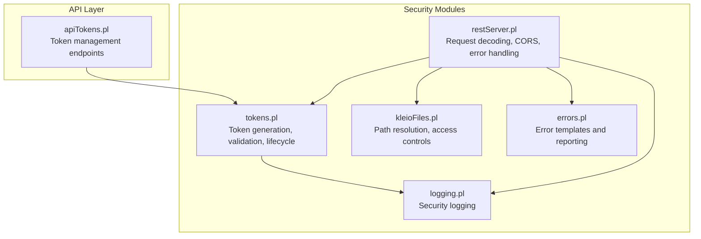
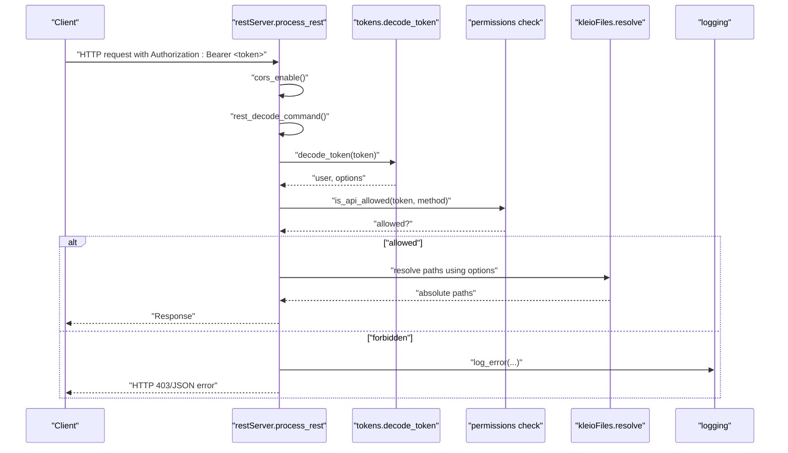
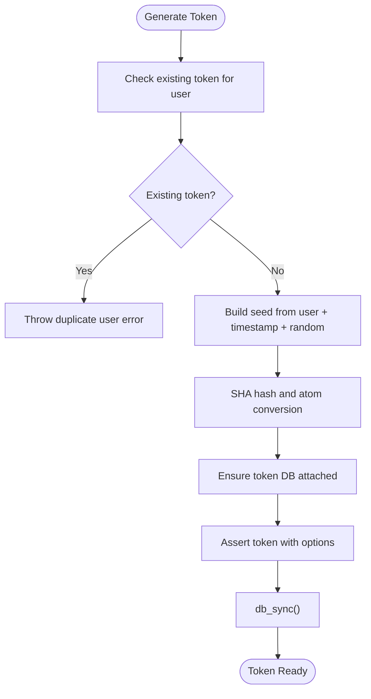
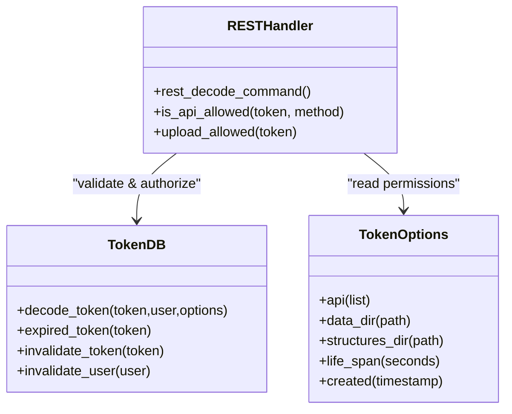
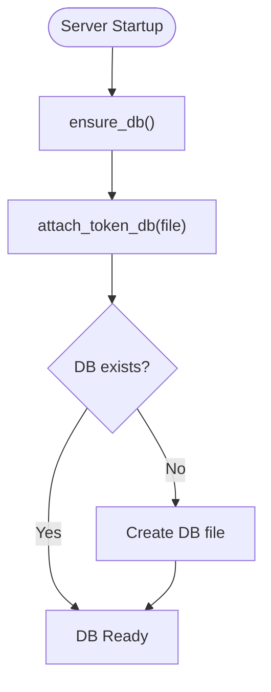
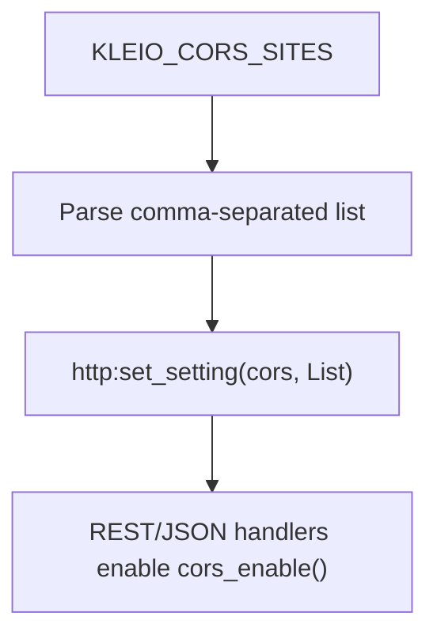
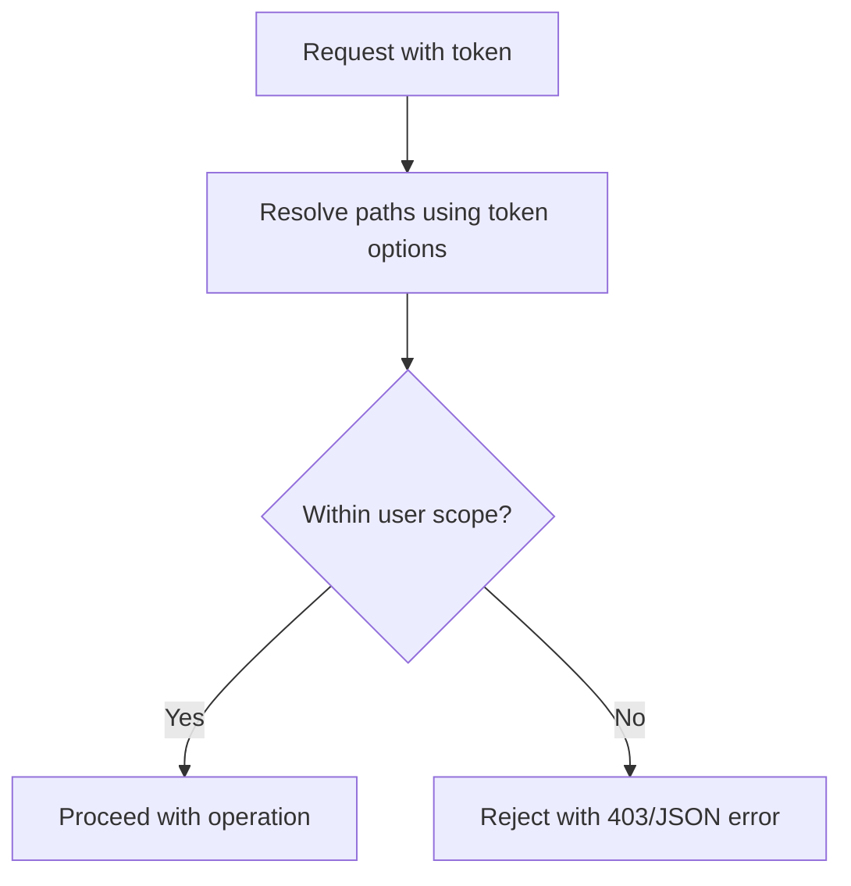
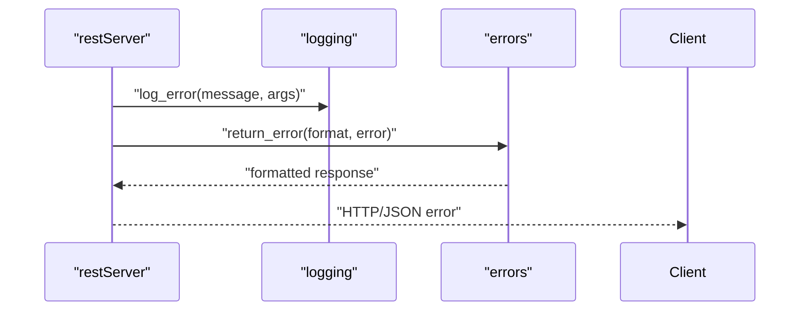
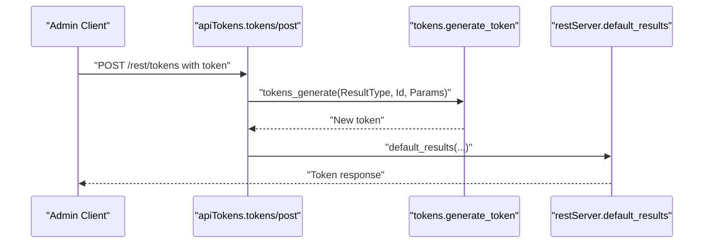
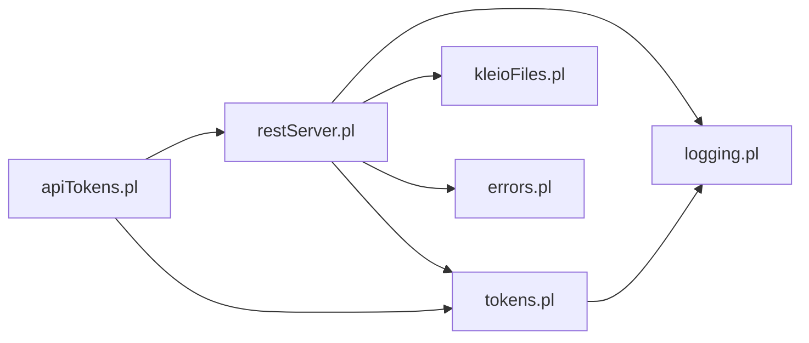

# Authentication and Security

<cite>
**Referenced Files in This Document**
- [tokens.pl](file://src/tokens.pl)
- [apiTokens.pl](file://src/apiTokens.pl)
- [restServer.pl](file://src/restServer.pl)
- [logging.pl](file://src/logging.pl)
- [kleioFiles.pl](file://src/kleioFiles.pl)
- [errors.pl](file://src/errors.pl)
</cite>

## Table of Contents
1. [Introduction](#introduction)
2. [Project Structure](#project-structure)
3. [Core Components](#core-components)
4. [Architecture Overview](#architecture-overview)
5. [Detailed Component Analysis](#detailed-component-analysis)
6. [Dependency Analysis](#dependency-analysis)
7. [Performance Considerations](#performance-considerations)
8. [Troubleshooting Guide](#troubleshooting-guide)
9. [Conclusion](#conclusion)

## Introduction
This document describes the authentication and security model for the Timelink Kleio server. The system uses token-based authentication to protect access to the REST and JSON-RPC APIs. Tokens are stored in a persistent database and validated on every request. The server enforces a granular permission model per token, supports token lifecycle management (generation, invalidation, rotation), and provides CORS configuration for web application integration. Security logging and error handling are integrated throughout the request pipeline.

## Project Structure
The authentication and security functionality is implemented across several modules:
- Token management and persistence
- REST and JSON-RPC request decoding and validation
- Logging and error reporting
- File system access controls and path resolution
- CORS configuration for cross-origin requests

**Diagram sources**
- [tokens.pl](file://src/tokens.pl#L1-L426)
- [restServer.pl](file://src/restServer.pl#L1-L1802)
- [logging.pl](file://src/logging.pl#L1-L161)
- [kleioFiles.pl](file://src/kleioFiles.pl#L1-L933)
- [errors.pl](file://src/errors.pl#L1-L220)
- [apiTokens.pl](file://src/apiTokens.pl#L1-L125)

**Section sources**
- [tokens.pl](file://src/tokens.pl#L1-L426)
- [restServer.pl](file://src/restServer.pl#L1-L1802)
- [logging.pl](file://src/logging.pl#L1-L161)
- [kleioFiles.pl](file://src/kleioFiles.pl#L1-L933)
- [errors.pl](file://src/errors.pl#L1-L220)
- [apiTokens.pl](file://src/apiTokens.pl#L1-L125)

## Core Components
- Token database: Persistent store for tokens and user options, managed via SWI-Prolog persistence.
- Token generation: Creates unique tokens with embedded metadata and optional lifetime.
- Token validation: Decodes tokens, verifies permissions, and enforces expiration.
- Permission model: Per-token API endpoint allowances and directory scoping.
- Request pipeline: REST and JSON-RPC handlers enforce token presence and permissions.
- CORS: Configurable cross-origin policies for browser clients.
- Logging and errors: Structured logging and standardized error responses.

**Section sources**
- [tokens.pl](file://src/tokens.pl#L54-L139)
- [restServer.pl](file://src/restServer.pl#L491-L579)
- [restServer.pl](file://src/restServer.pl#L183-L184)
- [logging.pl](file://src/logging.pl#L98-L119)
- [errors.pl](file://src/errors.pl#L1413-L1586)

## Architecture Overview
The authentication flow integrates with the REST and JSON-RPC request processors. Requests must include a Bearer token; otherwise, they are rejected. The token is decoded to retrieve user identity and options, including allowed API endpoints and directory scopes. Permissions are enforced per operation, and file paths are resolved relative to user-scoped directories to prevent unauthorized access.

**Diagram sources**
- [restServer.pl](file://src/restServer.pl#L491-L579)
- [restServer.pl](file://src/restServer.pl#L1413-L1586)
- [tokens.pl](file://src/tokens.pl#L141-L151)
- [kleioFiles.pl](file://src/kleioFiles.pl#L752-L781)
- [logging.pl](file://src/logging.pl#L98-L119)

## Detailed Component Analysis

### Token Management and Lifecycle
- Generation: Creates a unique token derived from user, timestamp, and random data, hashed and stored with creation metadata and options. Enforces uniqueness per user.
- Validation: Extracts user and options from the token database and rejects expired tokens automatically.
- Invalidation: Supports revocation of individual tokens or all tokens for a user.
- Persistence: Attaches to a configurable token database file; defaults to a path under the configuration directory.
- Admin bootstrap: Supports an environment-based admin token and a bootstrap token for initial setup.

**Diagram sources**
- [tokens.pl](file://src/tokens.pl#L111-L139)

**Section sources**
- [tokens.pl](file://src/tokens.pl#L54-L139)
- [tokens.pl](file://src/tokens.pl#L187-L198)
- [tokens.pl](file://src/tokens.pl#L263-L282)
- [restServer.pl](file://src/restServer.pl#L411-L421)

### Permission Model and Access Control
- API endpoints: Tokens carry an API list indicating allowed operations (e.g., files, structures, translations, upload, sources, generate_token, invalidate_token, invalidate_user, delete, mkdir, rmdir).
- Directory scoping: Tokens can specify user-specific sources and structures directories; all file operations resolve paths relative to these scopes.
- Enforcement: REST and JSON-RPC handlers validate token presence and permissions before executing operations.

**Diagram sources**
- [tokens.pl](file://src/tokens.pl#L249-L257)
- [restServer.pl](file://src/restServer.pl#L553-L579)
- [restServer.pl](file://src/restServer.pl#L590-L600)

**Section sources**
- [apiTokens.pl](file://src/apiTokens.pl#L50-L70)
- [tokens.pl](file://src/tokens.pl#L249-L257)
- [restServer.pl](file://src/restServer.pl#L553-L579)
- [restServer.pl](file://src/restServer.pl#L590-L600)

### Token Database and Storage
- Persistence: Uses SWI-Prolog persistence to store token-to-user mappings and options.
- Attachment: Supports attaching to a specific file or defaulting to a configuration-managed path.
- Initialization: On startup, ensures the token database exists and is attached; creates bootstrap/admin tokens if needed.

**Diagram sources**
- [tokens.pl](file://src/tokens.pl#L88-L102)
- [tokens.pl](file://src/tokens.pl#L64-L85)
- [restServer.pl](file://src/restServer.pl#L394-L421)

**Section sources**
- [tokens.pl](file://src/tokens.pl#L54-L85)
- [tokens.pl](file://src/tokens.pl#L88-L102)
- [restServer.pl](file://src/restServer.pl#L394-L421)

### CORS Configuration for Web Applications
- Configuration: The server reads a comma-separated list of allowed origins from an environment variable and sets the CORS policy accordingly.
- Behavior: Applies CORS preflight handling for REST and JSON-RPC endpoints, enabling cross-origin browser requests.

**Diagram sources**
- [restServer.pl](file://src/restServer.pl#L183-L184)
- [restServer.pl](file://src/restServer.pl#L338-L339)
- [restServer.pl](file://src/restServer.pl#L492-L495)
- [restServer.pl](file://src/restServer.pl#L662-L665)

**Section sources**
- [restServer.pl](file://src/restServer.pl#L183-L184)
- [restServer.pl](file://src/restServer.pl#L338-L339)
- [restServer.pl](file://src/restServer.pl#L492-L495)
- [restServer.pl](file://src/restServer.pl#L662-L665)

### Secure File Access and Path Resolution
- Path resolution: All file operations resolve paths relative to user-specified sources or structures directories, preventing traversal attacks.
- Safe output: File listings and metadata are normalized to relative paths derived from token options.
- Upload restrictions: Uploads require explicit upload permission and are validated for allowed file types.

**Diagram sources**
- [kleioFiles.pl](file://src/kleioFiles.pl#L752-L781)
- [kleioFiles.pl](file://src/kleioFiles.pl#L94-L109)
- [restServer.pl](file://src/restServer.pl#L590-L600)

**Section sources**
- [kleioFiles.pl](file://src/kleioFiles.pl#L752-L781)
- [kleioFiles.pl](file://src/kleioFiles.pl#L94-L109)
- [restServer.pl](file://src/restServer.pl#L590-L600)

### Audit Logging and Security Event Tracking
- Logging: Centralized logging with levels and structured output; logs are written to a configured directory or stdout.
- Error handling: Standardized error responses for REST and JSON-RPC, including context and request IDs.
- Security events: Authentication failures, permission denials, and invalid tokens are logged and surfaced as HTTP 401/403 or JSON error codes.

**Diagram sources**
- [logging.pl](file://src/logging.pl#L98-L119)
- [restServer.pl](file://src/restServer.pl#L1413-L1586)
- [errors.pl](file://src/errors.pl#L1413-L1586)

**Section sources**
- [logging.pl](file://src/logging.pl#L98-L119)
- [restServer.pl](file://src/restServer.pl#L1413-L1586)
- [errors.pl](file://src/errors.pl#L1413-L1586)

### Token-Based Authentication Endpoints
- Token generation: Requires a token with generate_token permission; accepts user and info parameters.
- Token invalidation: Supports revoking a specific token or all tokens for a user.
- User-level invalidation: Revokes all tokens associated with a user.

**Diagram sources**
- [apiTokens.pl](file://src/apiTokens.pl#L22-L28)
- [apiTokens.pl](file://src/apiTokens.pl#L71-L88)
- [restServer.pl](file://src/restServer.pl#L826-L841)

**Section sources**
- [apiTokens.pl](file://src/apiTokens.pl#L18-L39)
- [apiTokens.pl](file://src/apiTokens.pl#L71-L122)

## Dependency Analysis
The authentication system relies on a small set of tightly coupled modules:
- restServer depends on tokens for validation and on kleioFiles for path resolution.
- tokens depends on persistence and logging.
- apiTokens depends on tokens and restServer for results formatting.
- errors and logging provide shared infrastructure for consistent error handling and logging.

**Diagram sources**
- [restServer.pl](file://src/restServer.pl#L152-L162)
- [tokens.pl](file://src/tokens.pl#L49-L52)
- [apiTokens.pl](file://src/apiTokens.pl#L7-L9)

**Section sources**
- [restServer.pl](file://src/restServer.pl#L152-L162)
- [tokens.pl](file://src/tokens.pl#L49-L52)
- [apiTokens.pl](file://src/apiTokens.pl#L7-L9)

## Performance Considerations
- Token validation overhead: Each request performs a database lookup and permission check; caching options are minimal due to the lightweight persistence model.
- Concurrency: Token operations are protected by a mutex to ensure atomic updates to the token database.
- CORS overhead: Preflight OPTIONS requests are handled efficiently; ensure CORS lists are minimized to reduce wildcard usage.
- Logging: Logging is enabled by default; tune log levels to balance observability and performance.

[No sources needed since this section provides general guidance]

## Troubleshooting Guide
Common issues and resolutions:
- Missing token: Requests without a Bearer token receive a “token missing” error; ensure clients include Authorization headers.
- Bad token: Malformed or invalid tokens trigger “bad token” errors; regenerate tokens using the token management endpoints.
- Insufficient privileges: Attempts to call disallowed API endpoints return 403/JSON error; adjust token options to include required permissions.
- Expired token: Tokens with exceeded lifespans are invalidated automatically; regenerate tokens with appropriate lifetimes.
- CORS errors: Configure KLEIO_CORS_SITES to include the origin of the requesting client; verify wildcard usage and allowed methods.
- Bootstrap/admin token problems: If the bootstrap token expires or the admin token environment variable is invalid, the server blocks token generation until corrected.

**Section sources**
- [restServer.pl](file://src/restServer.pl#L1593-L1648)
- [restServer.pl](file://src/restServer.pl#L1413-L1586)
- [tokens.pl](file://src/tokens.pl#L263-L282)
- [restServer.pl](file://src/restServer.pl#L411-L421)

## Conclusion
Timelink Kleio’s authentication system centers on token-based access control with strong enforcement of permissions and directory scoping. Tokens are persisted securely and validated on every request, while CORS support enables modern web integrations. The system provides robust error handling and logging to aid in monitoring and troubleshooting. For production deployments, carefully manage token lifetimes, restrict CORS origins, and monitor logs for security events.