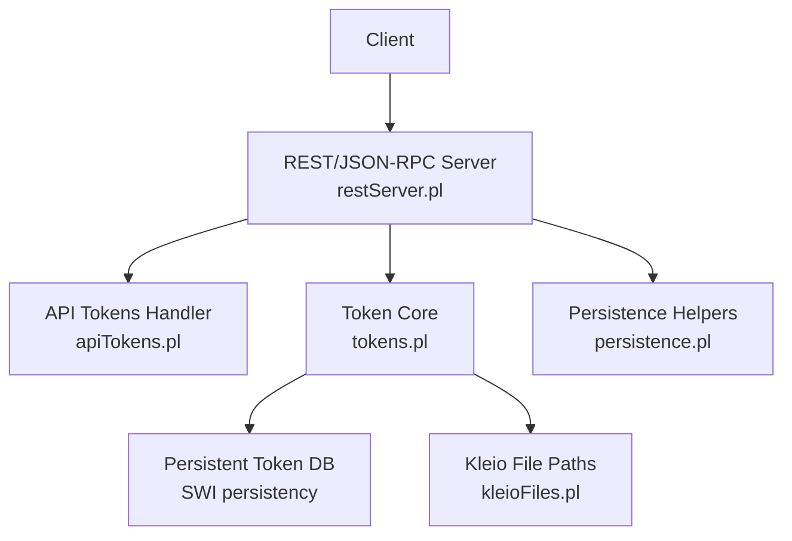
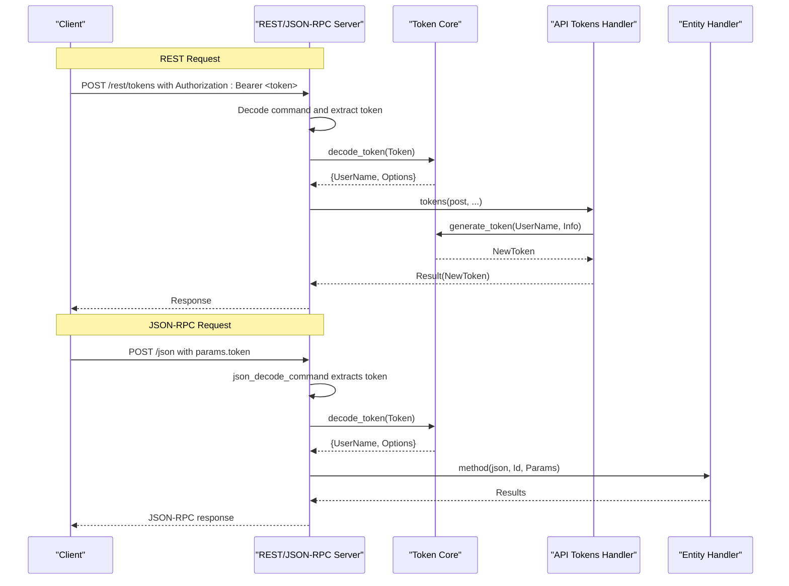
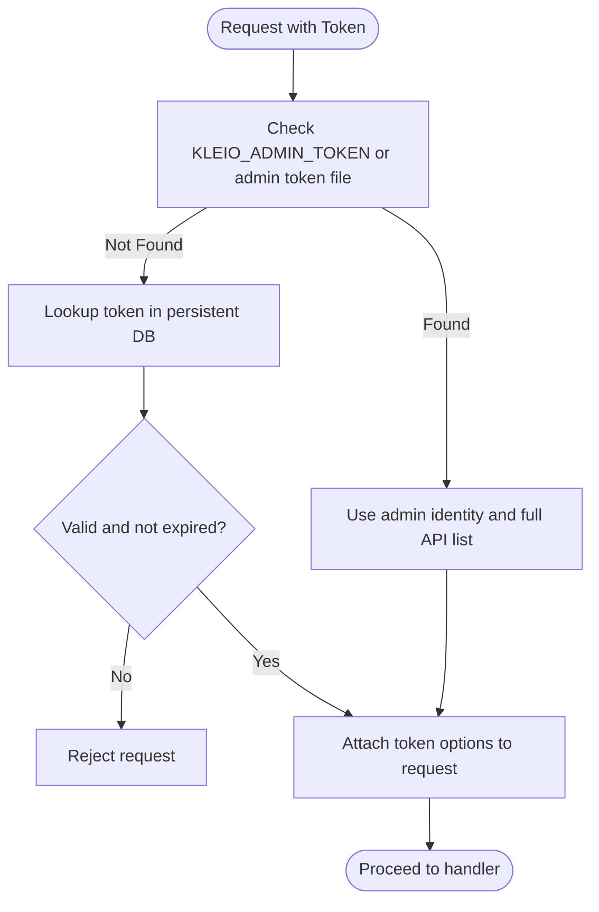
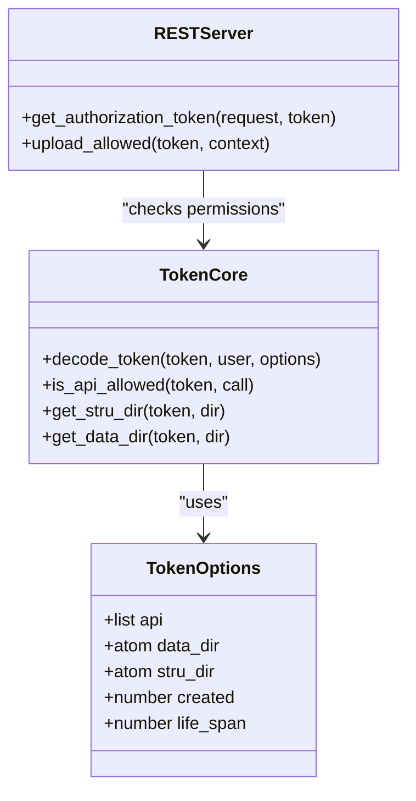
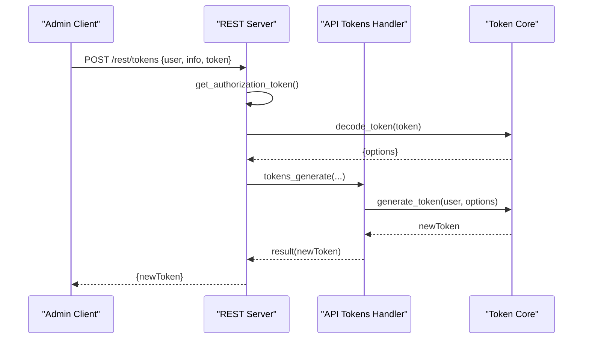
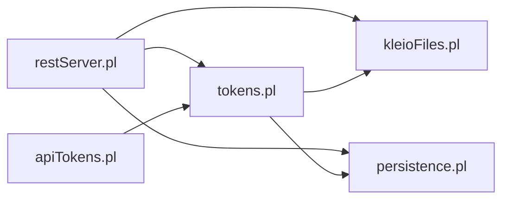

# Authentication and Security Model

<cite>
**Referenced Files in This Document**
- [tokens.pl](file://src/tokens.pl)
- [apiTokens.pl](file://src/apiTokens.pl)
- [restServer.pl](file://src/restServer.pl)
- [kleioFiles.pl](file://src/kleioFiles.pl)
- [persistence.pl](file://src/persistence.pl)
</cite>

## Table of Contents
1. [Introduction](#introduction)
2. [Project Structure](#project-structure)
3. [Core Components](#core-components)
4. [Architecture Overview](#architecture-overview)
5. [Detailed Component Analysis](#detailed-component-analysis)
6. [Dependency Analysis](#dependency-analysis)
7. [Performance Considerations](#performance-considerations)
8. [Troubleshooting Guide](#troubleshooting-guide)
9. [Conclusion](#conclusion)
10. [Appendices](#appendices)

## Introduction
This document explains the authentication and security model used by the system, focusing on token-based authentication, permission systems, user administration, token lifecycle management (including bootstrap tokens), API access control for REST and JSON-RPC endpoints, role-like permissions, configuration examples, token storage and persistence, and security best practices. It also covers how authentication integrates with both REST endpoints and JSON-RPC methods.

## Project Structure
The authentication and authorization logic is implemented across a small set of focused modules:
- Token generation, validation, expiration, and options handling
- REST and JSON-RPC request processing that enforces authentication and authorization
- File and path resolution utilities for token-scoped directories
- Persistence helpers for shared state and properties

**Diagram sources**
- [restServer.pl:491-579](file://src/restServer.pl#L491-L579)
- [restServer.pl:752-766](file://src/restServer.pl#L752-L766)
- [apiTokens.pl:71-88](file://src/apiTokens.pl#L71-L88)
- [tokens.pl:116-139](file://src/tokens.pl#L116-L139)
- [kleioFiles.pl:624-645](file://src/kleioFiles.pl#L624-L645)
- [persistence.pl:55-65](file://src/persistence.pl#L55-L65)

**Section sources**
- [restServer.pl:107-128](file://src/restServer.pl#L107-L128)
- [tokens.pl:19-47](file://src/tokens.pl#L19-L47)
- [apiTokens.pl:11-16](file://src/apiTokens.pl#L11-L16)
- [kleioFiles.pl:624-645](file://src/kleioFiles.pl#L624-L645)
- [persistence.pl:21-31](file://src/persistence.pl#L21-L31)

## Core Components
- Token core module provides:
  - Token generation with cryptographic hashing
  - Token decoding and admin fallback via environment or file
  - Expiration checks and automatic invalidation
  - Permission checking against an allowed API list
  - Directory scoping per token (data_dir, stru_dir)
- REST/JSON-RPC server:
  - Extracts Bearer token from Authorization header or query parameter
  - Decodes tokens and attaches token info to requests
  - Enforces upload permissions for multipart uploads
  - Routes to entity handlers after successful authz
- API tokens handler:
  - Generates new tokens for users
  - Invalidates specific tokens or all tokens for a user
  - Uses bootstrap token cleanup when appropriate
- Kleio files utility:
  - Resolves token database path and admin token file path
  - Provides base directory resolution for sources and structures based on token options
- Persistence helpers:
  - Shared values and properties used for bootstrap token tracking and server state

**Section sources**
- [tokens.pl:104-139](file://src/tokens.pl#L104-L139)
- [tokens.pl:141-176](file://src/tokens.pl#L141-L176)
- [tokens.pl:249-257](file://src/tokens.pl#L249-L257)
- [tokens.pl:259-281](file://src/tokens.pl#L259-L281)
- [restServer.pl:615-624](file://src/restServer.pl#L615-L624)
- [restServer.pl:590-600](file://src/restServer.pl#L590-L600)
- [apiTokens.pl:71-88](file://src/apiTokens.pl#L71-L88)
- [kleioFiles.pl:624-645](file://src/kleioFiles.pl#L624-L645)
- [persistence.pl:55-65](file://src/persistence.pl#L55-L65)

## Architecture Overview
The authentication flow is enforced at the HTTP layer before any business logic executes. Both REST and JSON-RPC paths decode the token early and attach associated metadata to the request context.

**Diagram sources**
- [restServer.pl:491-579](file://src/restServer.pl#L491-L579)
- [restServer.pl:752-766](file://src/restServer.pl#L752-L766)
- [apiTokens.pl:71-88](file://src/apiTokens.pl#L71-L88)
- [tokens.pl:141-151](file://src/tokens.pl#L141-L151)

## Detailed Component Analysis

### Token Lifecycle Management
- Generation:
  - Creates a unique token using a hash of username, timestamp, and random value
  - Persists token with creation time and provided options (e.g., api list, life_span, data_dir, stru_dir)
  - Ensures thread-safe updates with mutex and persists to SWI Prolog persistent database
- Validation:
  - Accepts tokens with optional "Bearer " prefix
  - Falls back to admin token if configured via environment variable or admin token file
  - Rejects expired tokens and auto-invalidates them
- Expiration:
  - Supports life_span option; tokens older than their lifespan are considered expired
  - Expired tokens are removed automatically upon detection
- Invalidation:
  - Revoke a single token or all tokens for a user
- Bootstrap token:
  - On first run without existing tokens and no admin token, the server creates a short-lived bootstrap token with limited privileges to allow initial token generation
  - After a successful token generation, the bootstrap token is invalidated and cleared from shared memory

**Diagram sources**
- [tokens.pl:141-176](file://src/tokens.pl#L141-L176)
- [tokens.pl:259-281](file://src/tokens.pl#L259-L281)
- [restServer.pl:615-624](file://src/restServer.pl#L615-L624)

**Section sources**
- [tokens.pl:116-139](file://src/tokens.pl#L116-L139)
- [tokens.pl:141-176](file://src/tokens.pl#L141-L176)
- [tokens.pl:259-281](file://src/tokens.pl#L259-L281)
- [restServer.pl:394-421](file://src/restServer.pl#L394-L421)
- [apiTokens.pl:82-88](file://src/apiTokens.pl#L82-L88)

### Permission Systems and Role-Based Access Control
- Permissions are represented as an ordered list of allowed API calls stored in token options under the api key.
- The server checks whether a requested operation is permitted by consulting the token’s options.
- Special operations:
  - Upload requires explicit upload permission; otherwise, a forbidden error is returned.
  - Token management operations require specific permissions (generate_token, invalidate_token, invalidate_user).
- While there is no formal “role” abstraction, tokens effectively act as roles by enumerating allowed actions.

**Diagram sources**
- [tokens.pl:249-257](file://src/tokens.pl#L249-L257)
- [tokens.pl:233-247](file://src/tokens.pl#L233-L247)
- [restServer.pl:590-600](file://src/restServer.pl#L590-L600)

**Section sources**
- [tokens.pl:249-257](file://src/tokens.pl#L249-L257)
- [restServer.pl:590-600](file://src/restServer.pl#L590-L600)
- [apiTokens.pl:94-122](file://src/apiTokens.pl#L94-L122)

### User Administration
- Generate token for a user:
  - Requires the caller to have generate_token permission
  - Converts JSON info into token options and persists the new token
  - Cleans up bootstrap token if present
- Invalidate token:
  - Requires invalidate_token permission
  - Validates the target token exists before revocation
- Invalidate user:
  - Requires invalidate_user permission
  - Revokes all tokens associated with a user

**Diagram sources**
- [apiTokens.pl:71-88](file://src/apiTokens.pl#L71-L88)
- [restServer.pl:615-624](file://src/restServer.pl#L615-L624)
- [tokens.pl:116-139](file://src/tokens.pl#L116-L139)

**Section sources**
- [apiTokens.pl:71-88](file://src/apiTokens.pl#L71-L88)
- [apiTokens.pl:94-122](file://src/apiTokens.pl#L94-L122)

### Integration with REST Endpoints
- REST endpoint routing:
  - Requests to /rest/* are decoded into entity, method, object, and parameters
  - Authorization token is extracted from Authorization header or search parameter
  - Token is validated and attached to request context
  - Upload endpoints check upload permission explicitly
- Example entities include tokens and users for token administration.

**Section sources**
- [restServer.pl:491-579](file://src/restServer.pl#L491-L579)
- [restServer.pl:590-600](file://src/restServer.pl#L590-L600)
- [apiTokens.pl:18-39](file://src/apiTokens.pl#L18-L39)

### Integration with JSON-RPC Methods
- JSON-RPC endpoint routing:
  - Requests to /json are parsed and dispatched to method(json, Id, Params)
  - Token must be provided in params; otherwise, an invalid_params error is thrown
  - Token is decoded and attached to request context before execution

**Section sources**
- [restServer.pl:752-766](file://src/restServer.pl#L752-L766)
- [restServer.pl:656-696](file://src/restServer.pl#L656-L696)

### Configuration Examples for Different Deployment Scenarios
- Development with admin token:
  - Set KLEIO_ADMIN_TOKEN to a valid token string to bypass token database and operate with full privileges
- Production with token database:
  - Ensure KLEIO_TOKEN_DB points to a secure location (default is within KLEIO_CONF_DIR/token_db)
  - Do not rely on KLEIO_ADMIN_TOKEN; manage tokens via API
- First-run bootstrap:
  - If no tokens exist and no admin token is set, the server generates a bootstrap token and writes it to the admin token file path for initial setup
- Environment variables:
  - KLEIO_HOME_DIR, KLEIO_SOURCE_DIR, KLEIO_CONF_DIR, KLEIO_STRU_DIR, KLEIO_TOKEN_DB, KLEIO_DEFAULT_STRU, KLEIO_DEBUGGER_PORT, KLEIO_SERVER_PORT, KLEIO_SERVER_WORKERS, KLEIO_IDLE_TIMEOUT, KLEIO_ADMIN_TOKEN

**Section sources**
- [restServer.pl:107-128](file://src/restServer.pl#L107-L128)
- [kleioFiles.pl:624-645](file://src/kleioFiles.pl#L624-L645)
- [restServer.pl:394-421](file://src/restServer.pl#L394-L421)

### Token Storage and Persistence Mechanisms
- Persistent token database:
  - Uses SWI Prolog persistency to store user_token facts in a file-backed database
  - Database path is configurable via KLEIO_TOKEN_DB or defaults to KLEIO_CONF_DIR/token_db
- Admin token file:
  - When bootstrap is needed, the server writes the admin token to KLEIO_CONF_DIR/.admin_token
- Shared state:
  - Bootstrap token reference may be kept in shared memory during startup and cleaned up after first token generation

**Section sources**
- [tokens.pl:54-79](file://src/tokens.pl#L54-L79)
- [kleioFiles.pl:624-645](file://src/kleioFiles.pl#L624-L645)
- [apiTokens.pl:82-88](file://src/apiTokens.pl#L82-L88)
- [persistence.pl:55-65](file://src/persistence.pl#L55-L65)

### Security Vulnerabilities Mitigation
- Token exposure:
  - Prefer Authorization header with Bearer scheme; avoid passing tokens in URLs unless necessary for debugging
- Token lifetime:
  - Use short life_span for service-to-service tokens; rotate frequently
- Privilege minimization:
  - Assign only required API entries to each token; avoid granting broad permissions
- Secure storage:
  - Protect token database and admin token file with restrictive filesystem permissions
- CSRF and CORS:
  - Configure CORS carefully; restrict allowed origins and methods
- Input validation:
  - Ensure malformed or missing tokens are rejected early with clear errors

[No sources needed since this section provides general guidance]

## Dependency Analysis
The following diagram shows key dependencies among authentication-related modules:

**Diagram sources**
- [restServer.pl:151-162](file://src/restServer.pl#L151-L162)
- [apiTokens.pl:7-9](file://src/apiTokens.pl#L7-L9)
- [tokens.pl:49-52](file://src/tokens.pl#L49-L52)

**Section sources**
- [restServer.pl:151-162](file://src/restServer.pl#L151-L162)
- [apiTokens.pl:7-9](file://src/apiTokens.pl#L7-L9)
- [tokens.pl:49-52](file://src/tokens.pl#L49-L52)

## Performance Considerations
- Token checks are lightweight and occur once per request; ensure token database is on fast storage
- Avoid overly long-lived tokens to reduce risk and simplify rotation
- Limit number of concurrent workers to match resource capacity; tune KLEIO_SERVER_WORKERS appropriately
- Use efficient token options; avoid excessive nested structures in token metadata

[No sources needed since this section provides general guidance]

## Troubleshooting Guide
Common issues and resolutions:
- Missing token:
  - Ensure Authorization header includes "Bearer <token>" or pass token in JSON-RPC params
- Bad token:
  - Verify token exists and is not expired; regenerate if necessary
- Method not allowed:
  - Confirm the token has the required API permission for the operation
- Forbidden on upload:
  - Grant upload permission to the token
- Bootstrap token expired:
  - Set KLEIO_ADMIN_TOKEN or delete token_db to reinitialize bootstrap
- Token database path issues:
  - Check KLEIO_TOKEN_DB and ensure the directory exists and is writable

**Section sources**
- [restServer.pl:553-566](file://src/restServer.pl#L553-L566)
- [restServer.pl:752-766](file://src/restServer.pl#L752-L766)
- [apiTokens.pl:94-122](file://src/apiTokens.pl#L94-L122)
- [restServer.pl:394-421](file://src/restServer.pl#L394-L421)

## Conclusion
The system implements a robust token-based authentication and authorization model with clear integration points for both REST and JSON-RPC APIs. Tokens carry scoped permissions and directory constraints, while bootstrap tokens enable secure first-run initialization. Proper configuration and operational hygiene around token lifetimes, storage, and permissions are essential for maintaining a secure deployment.

[No sources needed since this section summarizes without analyzing specific files]

## Appendices

### API Access Control Summary
- REST:
  - /rest/tokens POST: generate token
  - /rest/tokens DELETE: invalidate token
  - /rest/users DELETE: invalidate user
- JSON-RPC:
  - Any method invoked via /json requires token in params; authorization is enforced before dispatch

**Section sources**
- [apiTokens.pl:18-39](file://src/apiTokens.pl#L18-L39)
- [restServer.pl:752-766](file://src/restServer.pl#L752-L766)