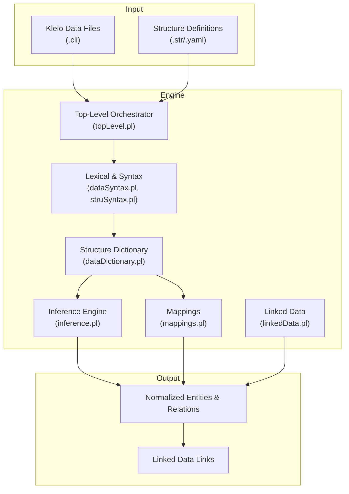
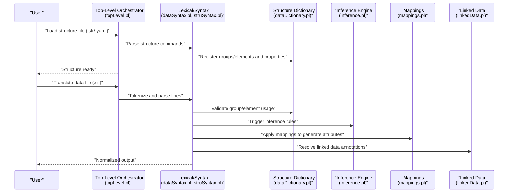
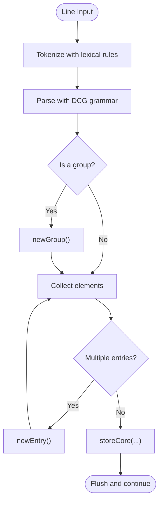
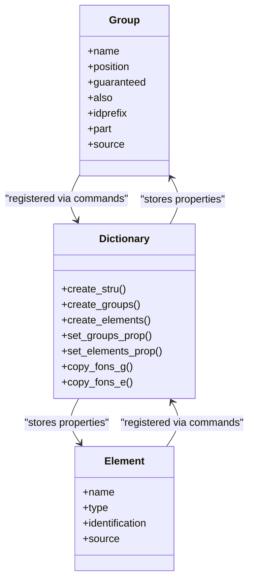
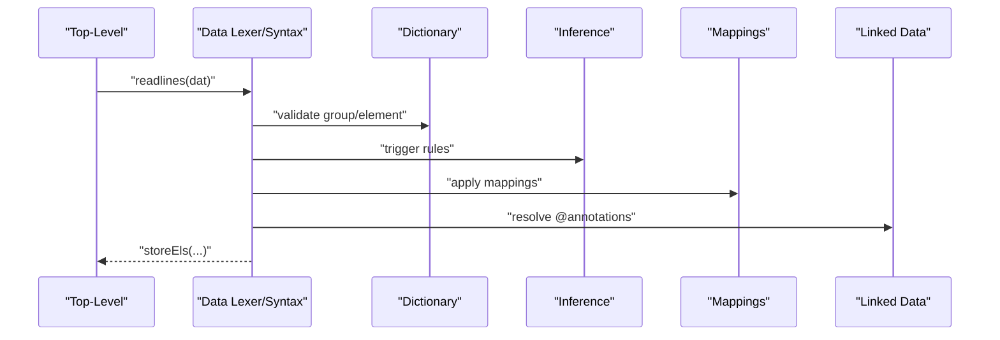
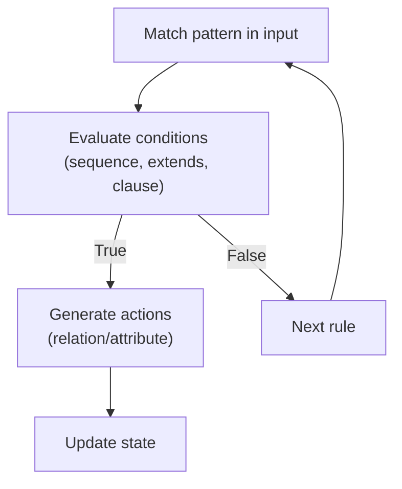
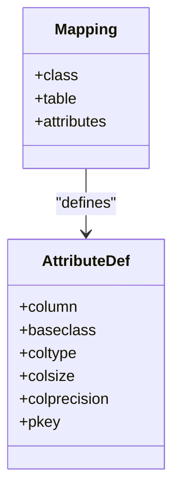
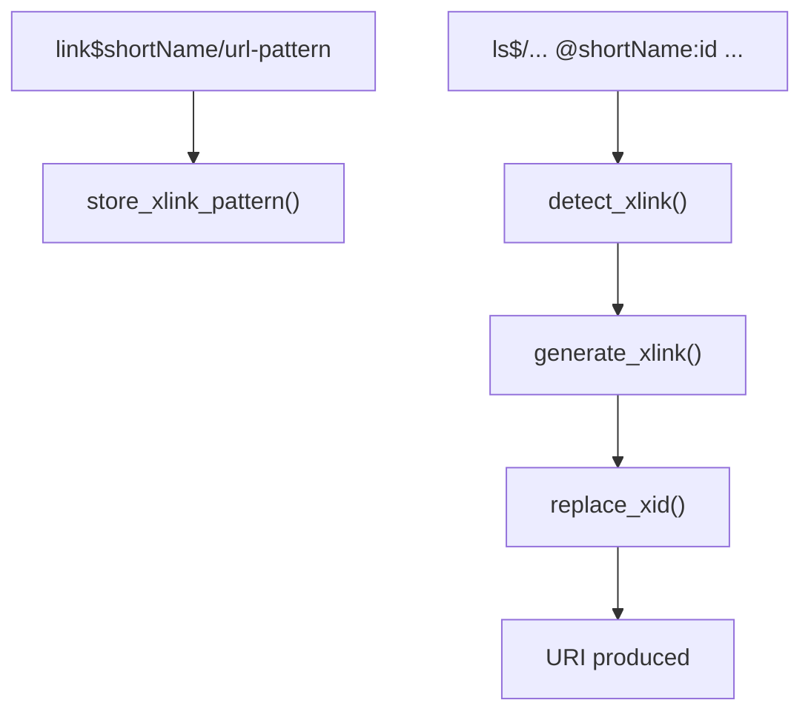
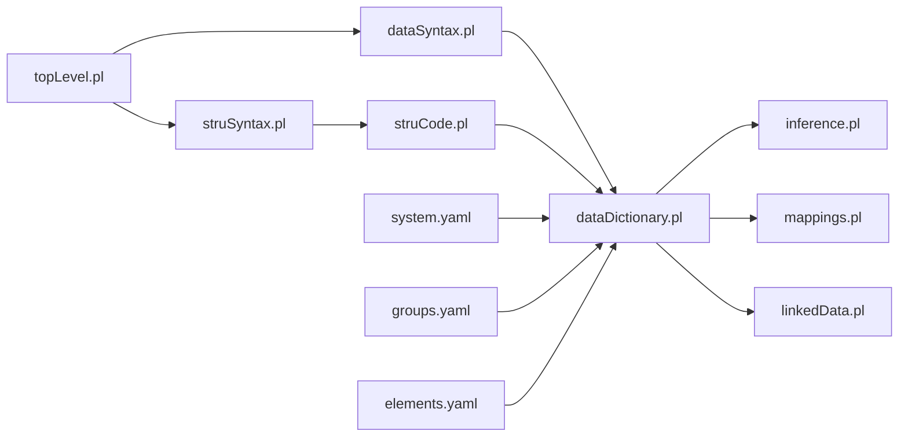

# Core Concepts

<cite>
**Referenced Files in This Document**
- [README.md](file://README.md)
- [topLevel.pl](file://src/topLevel.pl)
- [dataSyntax.pl](file://src/dataSyntax.pl)
- [struSyntax.pl](file://src/struSyntax.pl)
- [struCode.pl](file://src/struCode.pl)
- [dataDictionary.pl](file://src/dataDictionary.pl)
- [inference.pl](file://src/inference.pl)
- [mappings.pl](file://src/mappings.pl)
- [linkedData.pl](file://src/linkedData.pl)
- [elements.yaml](file://src/stru/elements.yaml)
- [groups.yaml](file://src/stru/groups.yaml)
- [system.yaml](file://src/stru/system.yaml)
- [cas1714-1722.cli](file://tests/kleio-home/sources/reference_sources/paroquiais/casamentos/cas1714-1722.cli)
- [obit1714.cli](file://tests/kleio-home/sources/reference_sources/paroquiais/obitos/obit1714.cli)
</cite>

## Table of Contents
1. [Introduction](#introduction)
2. [Project Structure](#project-structure)
3. [Core Components](#core-components)
4. [Architecture Overview](#architecture-overview)
5. [Detailed Component Analysis](#detailed-component-analysis)
6. [Dependency Analysis](#dependency-analysis)
7. [Performance Considerations](#performance-considerations)
8. [Troubleshooting Guide](#troubleshooting-guide)
9. [Conclusion](#conclusion)

## Introduction
This document explains the core concepts of the Timelink Kleio system with a focus on how historical documents are represented and transformed. It covers Kleio notation syntax and semantics, the structure definition system (.str and .yaml), the translation workflow from raw input to structured output, the Prolog-based processing engine and inference rules, and the mapping and linked data integration mechanisms. The goal is to provide both newcomers and experienced users with a clear understanding of how the system works end-to-end.

## Project Structure
At a high level, the system comprises:
- A Prolog-based translation engine that parses Kleio notation, validates structure definitions, and executes inference and mapping rules.
- A structure definition subsystem that defines groups, elements, and their properties via .str/.yaml files.
- A processing pipeline that transforms Kleio data into normalized relational entities and relations.
- Utilities for linked data cross-reference and vocabulary verification.

**Diagram sources**
- [topLevel.pl](file://src/topLevel.pl#L102-L164)
- [dataSyntax.pl](file://src/dataSyntax.pl#L38-L62)
- [struSyntax.pl](file://src/struSyntax.pl#L48-L58)
- [dataDictionary.pl](file://src/dataDictionary.pl#L119-L125)
- [inference.pl](file://src/inference.pl#L1-L35)
- [mappings.pl](file://src/mappings.pl#L24-L33)
- [linkedData.pl](file://src/linkedData.pl#L51-L108)

**Section sources**
- [README.md](file://README.md#L1-L50)
- [topLevel.pl](file://src/topLevel.pl#L102-L164)

## Core Components
- Kleio notation syntax and semantics: The system supports a compact, line-based notation for historical documents. It includes groups, elements, attributes, comments, and optional linked data annotations. Parsing handles quoting, triple quotes, multiple-entry separators, and special data flags.
- Structure definition system: Groups and elements are defined declaratively in .str or .yaml. These definitions specify containment, ordering, identification, and other behavioral properties. The system supports inheritance-like specialization via “source” references and “fons” copying.
- Translation workflow: The engine reads structure files first, then data files. Lexical analysis produces tokens; DCG grammars parse syntax into internal calls; the dictionary validates structure; inference rules enrich the dataset; mappings convert to relational attributes; linked data resolves external identifiers.
- Prolog-based processing engine: Rules are expressed in Prolog with operator syntax for readability. Inference rules capture family relations, marital unions, and other social ties. Mappings define relational schemas. Linked data utilities extract and resolve external URIs.
- Linked data integration: External identifiers can be annotated inline; the system declares link patterns and generates URIs for cross-reference.

**Section sources**
- [dataSyntax.pl](file://src/dataSyntax.pl#L38-L126)
- [struSyntax.pl](file://src/struSyntax.pl#L48-L121)
- [struCode.pl](file://src/struCode.pl#L105-L119)
- [dataDictionary.pl](file://src/dataDictionary.pl#L119-L125)
- [inference.pl](file://src/inference.pl#L1-L35)
- [mappings.pl](file://src/mappings.pl#L24-L33)
- [linkedData.pl](file://src/linkedData.pl#L51-L108)

## Architecture Overview
The translation pipeline is orchestrated by the top-level predicates that initialize processing, read files line-by-line, tokenize, parse, and execute actions against an internal dictionary and runtime state.

**Diagram sources**
- [topLevel.pl](file://src/topLevel.pl#L102-L164)
- [dataSyntax.pl](file://src/dataSyntax.pl#L38-L62)
- [struSyntax.pl](file://src/struSyntax.pl#L48-L58)
- [dataDictionary.pl](file://src/dataDictionary.pl#L119-L125)
- [inference.pl](file://src/inference.pl#L1-L35)
- [mappings.pl](file://src/mappings.pl#L24-L33)
- [linkedData.pl](file://src/linkedData.pl#L51-L108)

## Detailed Component Analysis

### Kleio Notation Syntax and Semantics
- Groups: Identified by a leading label followed by optional attributes and nested subgroups/elements.
- Elements: Named fields with values; support for comments (“#”) and original wording (“%”).
- Attributes and comments: Use special data flags to delimit content and preserve formatting.
- Quoting and triple quotes: Preserve literal content including newlines and special characters.
- Multiple entries: Delimited by a configurable data flag; default supports semicolon.
- Linked data annotations: Inline annotations of the form @source:id are extracted and resolved to URIs.

**Diagram sources**
- [dataSyntax.pl](file://src/dataSyntax.pl#L65-L126)

**Section sources**
- [dataSyntax.pl](file://src/dataSyntax.pl#L38-L126)

### Structure Definition System (.str and .yaml)
- Groups: Define containment, ordering, identification, and inheritance. Properties include position, guaranteed elements, also-allowed elements, and part relationships.
- Elements: Define canonical names, types, and identification behavior. Elements can specialize others via “source”.
- Inheritance and specialization: “fons” copying propagates properties from a source group/element to derived ones.
- Defaults: Automatic defaults for group and element properties are applied during processing.
- YAML base: The system includes a base YAML that includes elements and groups, enabling modular reuse.

**Diagram sources**
- [struSyntax.pl](file://src/struSyntax.pl#L121-L146)
- [struCode.pl](file://src/struCode.pl#L105-L119)
- [dataDictionary.pl](file://src/dataDictionary.pl#L316-L383)
- [groups.yaml](file://src/stru/groups.yaml#L32-L259)
- [elements.yaml](file://src/stru/elements.yaml#L39-L221)

**Section sources**
- [struSyntax.pl](file://src/struSyntax.pl#L121-L146)
- [struCode.pl](file://src/struCode.pl#L105-L119)
- [dataDictionary.pl](file://src/dataDictionary.pl#L316-L383)
- [groups.yaml](file://src/stru/groups.yaml#L32-L259)
- [elements.yaml](file://src/stru/elements.yaml#L39-L221)
- [system.yaml](file://src/stru/system.yaml#L1-L4)

### Translation Workflow
- Initialization: Top-level predicates initialize counters, open files, and set metadata.
- Structure processing: .str/.yaml files are parsed; commands are validated and properties stored in the dictionary.
- Data processing: .cli files are tokenized and parsed; group/element usage is validated against the dictionary; inferred relations and attributes are generated; mappings convert to relational attributes; linked data URIs are produced.
- Output: Normalized entities and relations are emitted; linked data URIs augment attributes.

**Diagram sources**
- [topLevel.pl](file://src/topLevel.pl#L139-L160)
- [dataSyntax.pl](file://src/dataSyntax.pl#L54-L62)
- [dataDictionary.pl](file://src/dataDictionary.pl#L119-L125)
- [inference.pl](file://src/inference.pl#L1-L35)
- [mappings.pl](file://src/mappings.pl#L24-L33)
- [linkedData.pl](file://src/linkedData.pl#L96-L108)

**Section sources**
- [topLevel.pl](file://src/topLevel.pl#L139-L160)
- [dataSyntax.pl](file://src/dataSyntax.pl#L54-L62)

### Prolog-Based Processing Engine and Inference Rules
- Rule syntax: Uses operators to express conditions and actions in a readable form.
- Typical inference patterns: Family relations (parents, spouses, siblings), marital unions, and extended kinship across generations.
- Scope and sequencing: Rules can sequence across multiple acts and handle multiple marriages.

**Diagram sources**
- [inference.pl](file://src/inference.pl#L1-L35)

**Section sources**
- [inference.pl](file://src/inference.pl#L1-L35)

### Mappings and Relational Transformation
- Mapping declarations: Define how Kleio classes map to relational tables and columns, including data types and primary keys.
- Typical mappings: Person, object, relation, attribute, historical act, and specialized classes.
- Transformation: During translation, inferred and parsed entities are converted into relational attributes according to declared mappings.

**Diagram sources**
- [mappings.pl](file://src/mappings.pl#L24-L33)
- [mappings.pl](file://src/mappings.pl#L136-L145)

**Section sources**
- [mappings.pl](file://src/mappings.pl#L24-L33)
- [mappings.pl](file://src/mappings.pl#L136-L145)

### Linked Data Integration
- Declaration: A link$ group declares an external source with a URL pattern placeholder.
- Annotation: Inline annotations of the form @shortName:id are extracted.
- Resolution: Patterns are matched and substituted to produce URIs; unresolved annotations trigger warnings.

**Diagram sources**
- [linkedData.pl](file://src/linkedData.pl#L51-L108)

**Section sources**
- [linkedData.pl](file://src/linkedData.pl#L51-L108)

### Concrete Examples from the Codebase
- Historical marriage act: Demonstrates group nesting (cas), person roles (noivo, noiva, pnoivo, mnoiva), attributes (ls$morada, ls$freguesia), and relations (rel$parentesco).
- Historical burial act: Demonstrates person grouping (n), attributes (ls$ec, ls$morada), and relations (rel$parentesco).

These examples illustrate how Kleio notation encodes historical facts and how the engine normalizes them into structured entities and relations.

**Section sources**
- [cas1714-1722.cli](file://tests/kleio-home/sources/reference_sources/paroquiais/casamentos/cas1714-1722.cli#L1-L100)
- [obit1714.cli](file://tests/kleio-home/sources/reference_sources/paroquiais/obitos/obit1714.cli#L1-L100)

## Dependency Analysis
The system exhibits layered dependencies:
- Top-level orchestrator depends on lexical/syntax modules and the dictionary.
- Structure processing depends on the syntax grammar and code execution.
- Data processing depends on the dictionary for validation and on inference/mappings/linked data for enrichment.
- YAML-based structure definitions feed the dictionary with reusable elements and groups.

**Diagram sources**
- [topLevel.pl](file://src/topLevel.pl#L34-L57)
- [dataSyntax.pl](file://src/dataSyntax.pl#L24-L28)
- [struSyntax.pl](file://src/struSyntax.pl#L37-L42)
- [struCode.pl](file://src/struCode.pl#L49-L55)
- [dataDictionary.pl](file://src/dataDictionary.pl#L87-L100)
- [system.yaml](file://src/stru/system.yaml#L1-L4)
- [groups.yaml](file://src/stru/groups.yaml#L1-L2)
- [elements.yaml](file://src/stru/elements.yaml#L1-L2)

**Section sources**
- [topLevel.pl](file://src/topLevel.pl#L34-L57)
- [dataSyntax.pl](file://src/dataSyntax.pl#L24-L28)
- [struSyntax.pl](file://src/struSyntax.pl#L37-L42)
- [struCode.pl](file://src/struCode.pl#L49-L55)
- [dataDictionary.pl](file://src/dataDictionary.pl#L87-L100)
- [system.yaml](file://src/stru/system.yaml#L1-L4)
- [groups.yaml](file://src/stru/groups.yaml#L1-L2)
- [elements.yaml](file://src/stru/elements.yaml#L1-L2)

## Performance Considerations
- Tokenization and parsing: The lexer and DCG-based parsers are efficient for line-by-line processing typical of historical documents.
- Dictionary caching: Containment and inheritance queries leverage caches to avoid repeated computation.
- Multi-line commands: Commands spanning multiple lines are cached and executed in batches to reduce overhead.
- Inference and mapping: Rule evaluation and mapping conversions are incremental and rely on the internal data structures; keep rule sets minimal and targeted.

## Troubleshooting Guide
- Structure validation failures: Missing required parameters in structure commands trigger errors; review requiredParams and check completeness checks.
- Lexical/tokenization issues: Unexpected characters or quoting problems can cause compilation failures; verify triple quotes and escape sequences.
- Inference mismatches: If inferred relations are missing, verify rule coverage and input structure alignment.
- Linked data resolution: Missing link$ declarations or malformed annotations will produce warnings; ensure patterns are defined and annotations follow the expected format.

**Section sources**
- [struCode.pl](file://src/struCode.pl#L323-L337)
- [dataSyntax.pl](file://src/dataSyntax.pl#L54-L62)
- [linkedData.pl](file://src/linkedData.pl#L96-L108)

## Conclusion
The Timelink Kleio system provides a robust framework for representing and transforming historical documents into normalized relational data. Its declarative structure definitions, Prolog-based inference, and mapping/metadata utilities enable scalable processing of complex historical sources while supporting modern linked data practices. Understanding the syntax, structure definitions, and processing pipeline is essential to effectively use and extend the system.