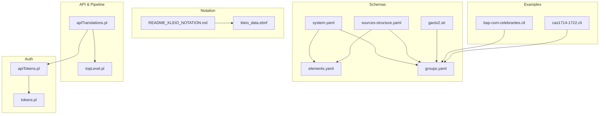
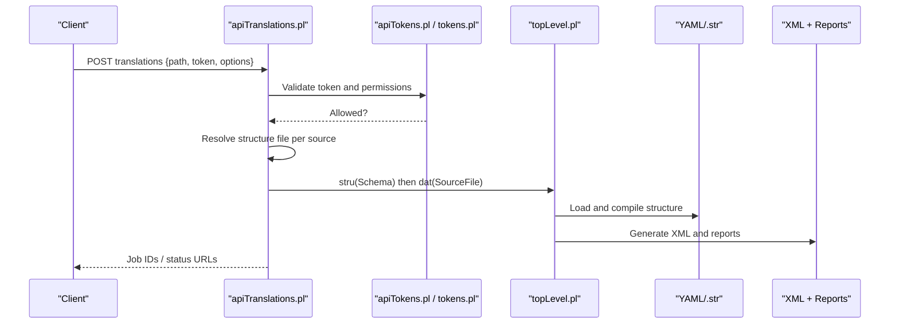
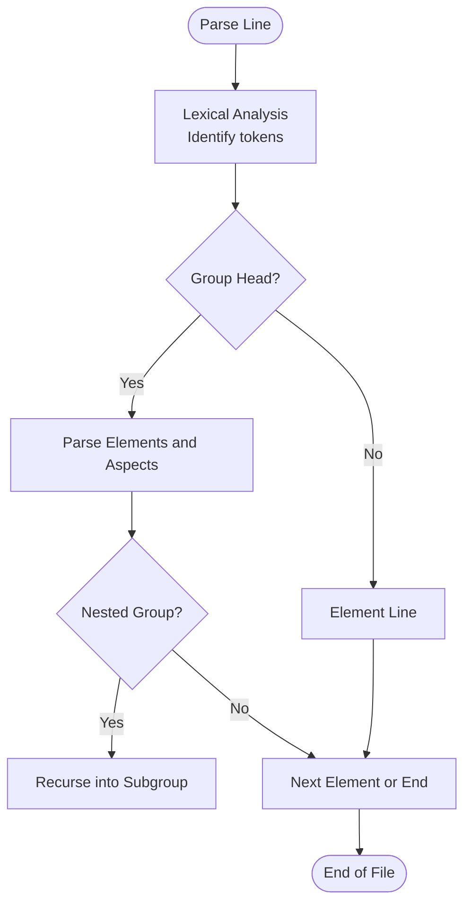
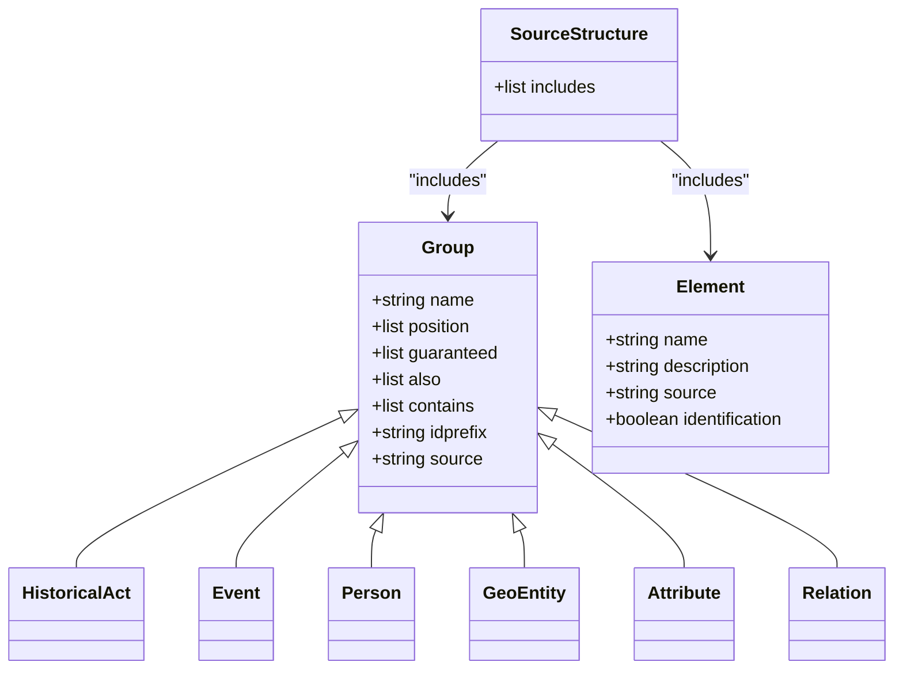
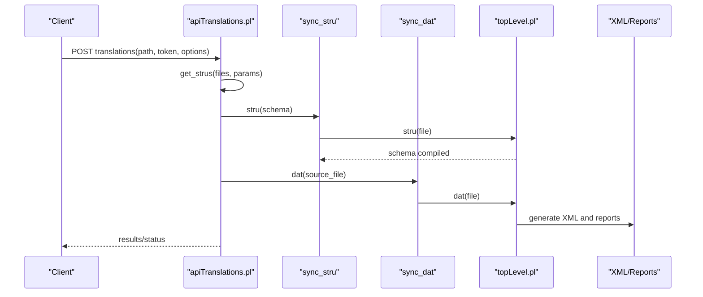
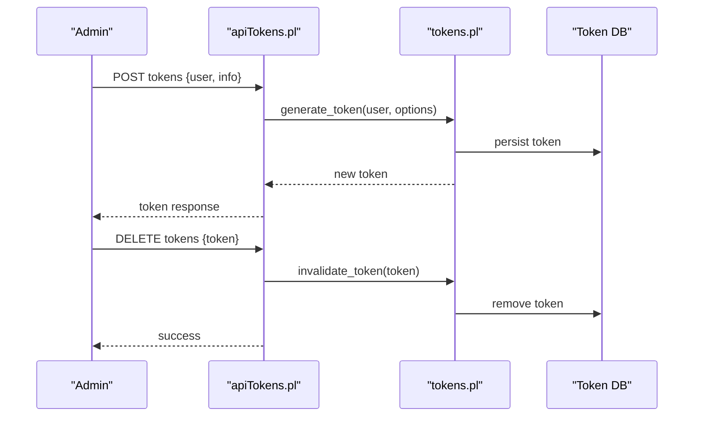
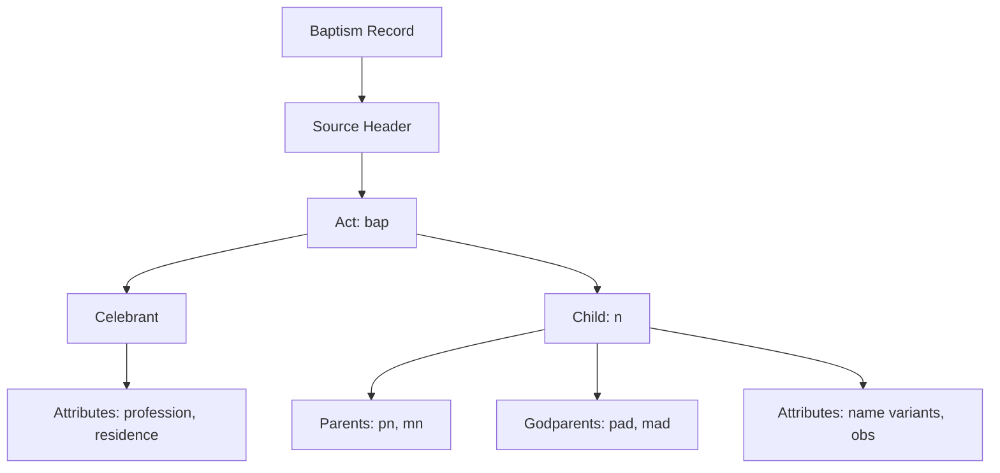
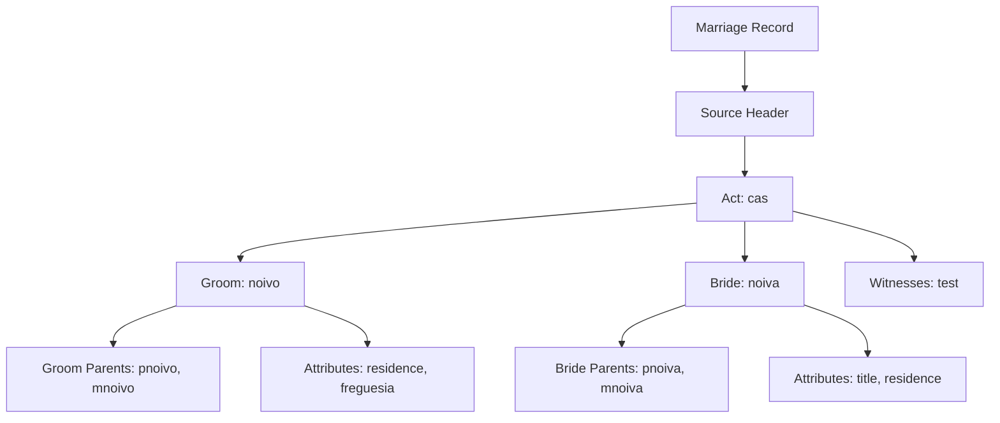
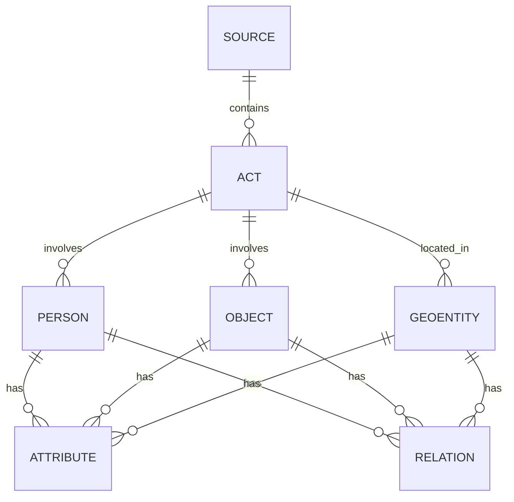
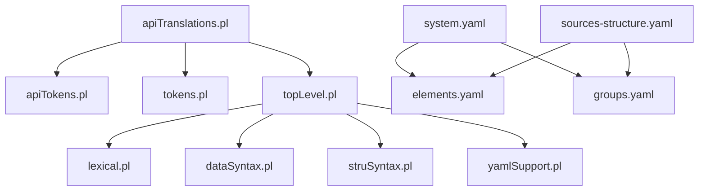

# Core Concepts

<cite>
**Referenced Files in This Document**
- [README_KLEIO_NOTATION.md](file://README_KLEIO_NOTATION.md)
- [kleio_data.ebnf](file://syntax/kleio_data.ebnf)
- [elements.yaml](file://src/stru/elements.yaml)
- [groups.yaml](file://src/stru/groups.yaml)
- [system.yaml](file://src/stru/system.yaml)
- [sources-structure.yaml](file://src/stru/sources-structure.yaml)
- [gacto2.str](file://src/stru/gacto2.str)
- [apiTranslations.pl](file://src/apiTranslations.pl)
- [topLevel.pl](file://src/topLevel.pl)
- [apiTokens.pl](file://src/apiTokens.pl)
- [tokens.pl](file://src/tokens.pl)
- [bap-com-celebrantes.cli](file://tests/kleio-home/sources/more_sources/paroquiais/baptismos/bap-com-celebrantes.cli)
- [cas1714-1722.cli](file://tests/kleio-home/sources/more_sources/paroquiais/casamentos/cas1714-1722.cli)
</cite>

## Table of Contents
1. [Introduction](#introduction)
2. [Project Structure](#project-structure)
3. [Core Components](#core-components)
4. [Architecture Overview](#architecture-overview)
5. [Detailed Component Analysis](#detailed-component-analysis)
6. [Dependency Analysis](#dependency-analysis)
7. [Performance Considerations](#performance-considerations)
8. [Troubleshooting Guide](#troubleshooting-guide)
9. [Conclusion](#conclusion)
10. [Appendices](#appendices)

## Introduction
This document explains the core concepts of the Kleio translation system: notation fundamentals, schema definitions (legacy .str and modern YAML), the translation pipeline from source to XML, authentication and permissions via tokens, and how Kleio maps to Timelink’s person-oriented database model. It also provides practical examples drawn from historical documents such as baptism records, marriages, and civil registrations.

## Project Structure
The repository organizes Kleio-related content across several areas:
- Notation grammar and documentation define syntax rules and special characters.
- Schema definitions exist in both legacy .str format and modern YAML files.
- The translation API orchestrates structure loading, file discovery, job scheduling, and result retrieval.
- Authentication is token-based with permission control for API endpoints.
- Example Kleio files demonstrate real-world transcription patterns.

**Diagram sources**
- [kleio_data.ebnf:1-62](file://syntax/kleio_data.ebnf#L1-L62)
- [README_KLEIO_NOTATION.md:1-125](file://README_KLEIO_NOTATION.md#L1-L125)
- [system.yaml:1-4](file://src/stru/system.yaml#L1-L4)
- [elements.yaml:1-305](file://src/stru/elements.yaml#L1-L305)
- [groups.yaml:1-686](file://src/stru/groups.yaml#L1-L686)
- [sources-structure.yaml:1-10](file://src/stru/sources-structure.yaml#L1-L10)
- [gacto2.str:1-800](file://src/stru/gacto2.str#L1-L800)
- [apiTranslations.pl:1-780](file://src/apiTranslations.pl#L1-L780)
- [topLevel.pl:1-289](file://src/topLevel.pl#L1-L289)
- [apiTokens.pl:1-125](file://src/apiTokens.pl#L1-L125)
- [tokens.pl:1-426](file://src/tokens.pl#L1-L426)
- [bap-com-celebrantes.cli:1-79](file://tests/kleio-home/sources/more_sources/paroquiais/baptismos/bap-com-celebrantes.cli#L1-L79)
- [cas1714-1722.cli:1-800](file://tests/kleio-home/sources/more_sources/paroquiais/casamentos/cas1714-1722.cli#L1-L800)

**Section sources**
- [README_KLEIO_NOTATION.md:1-125](file://README_KLEIO_NOTATION.md#L1-L125)
- [kleio_data.ebnf:1-62](file://syntax/kleio_data.ebnf#L1-L62)
- [system.yaml:1-4](file://src/stru/system.yaml#L1-L4)
- [elements.yaml:1-305](file://src/stru/elements.yaml#L1-L305)
- [groups.yaml:1-686](file://src/stru/groups.yaml#L1-L686)
- [sources-structure.yaml:1-10](file://src/stru/sources-structure.yaml#L1-L10)
- [gacto2.str:1-800](file://src/stru/gacto2.str#L1-L800)
- [apiTranslations.pl:1-780](file://src/apiTranslations.pl#L1-L780)
- [topLevel.pl:1-289](file://src/topLevel.pl#L1-L289)
- [apiTokens.pl:1-125](file://src/apiTokens.pl#L1-L125)
- [tokens.pl:1-426](file://src/tokens.pl#L1-L426)
- [bap-com-celebrantes.cli:1-79](file://tests/kleio-home/sources/more_sources/paroquiais/baptismos/bap-com-celebrantes.cli#L1-L79)
- [cas1714-1722.cli:1-800](file://tests/kleio-home/sources/more_sources/paroquiais/casamentos/cas1714-1722.cli#L1-L800)

## Core Components
- Kleio notation defines groups (entities), elements (attributes), and aspects (core/original/comment). Special characters delimit names, values, separators, and multi-line strings.
- Schemas define allowed groups, hierarchy, positional elements, and required fields. Two formats are supported:
  - Legacy .str (e.g., gacto2.str)
  - Modern YAML (elements.yaml, groups.yaml, sources-structure.yaml)
- Translation pipeline:
  - API receives a request with token and path(s).
  - Resolves structure file per file or default.
  - Loads structure (YAML or .str) into memory.
  - Parses data files, validates against schema, and produces XML output plus reports.
- Authentication:
  - Tokens represent users with scoped permissions (e.g., translations, sources, files).
  - Admin bootstrap token supports initial setup.

**Section sources**
- [README_KLEIO_NOTATION.md:1-125](file://README_KLEIO_NOTATION.md#L1-L125)
- [elements.yaml:1-305](file://src/stru/elements.yaml#L1-L305)
- [groups.yaml:1-686](file://src/stru/groups.yaml#L1-L686)
- [sources-structure.yaml:1-10](file://src/stru/sources-structure.yaml#L1-L10)
- [gacto2.str:1-800](file://src/stru/gacto2.str#L1-L800)
- [apiTranslations.pl:1-780](file://src/apiTranslations.pl#L1-L780)
- [topLevel.pl:1-289](file://src/topLevel.pl#L1-L289)
- [apiTokens.pl:1-125](file://src/apiTokens.pl#L1-L125)
- [tokens.pl:1-426](file://src/tokens.pl#L1-L426)

## Architecture Overview
The translation architecture connects REST API calls to the translator engine, which uses schemas to validate and convert Kleio notation into structured XML.

**Diagram sources**
- [apiTranslations.pl:1-780](file://src/apiTranslations.pl#L1-L780)
- [apiTokens.pl:1-125](file://src/apiTokens.pl#L1-L125)
- [tokens.pl:1-426](file://src/tokens.pl#L1-L426)
- [topLevel.pl:1-289](file://src/topLevel.pl#L1-L289)
- [sources-structure.yaml:1-10](file://src/stru/sources-structure.yaml#L1-L10)
- [gacto2.str:1-800](file://src/stru/gacto2.str#L1-L800)

## Detailed Component Analysis

### Kleio Notation Fundamentals
- Groups represent entities; elements represent attributes; aspects include core, original, and comment.
- Special characters: group marker, element assignment, separator, original/comment markers, multiple value separators, string delimiters, and multiline delimiters.
- Whitespace is collapsed except inside quoted strings.
- Grammar formalized by EBNF covering document, group declarations, elements, values, and aspects.

**Diagram sources**
- [kleio_data.ebnf:1-62](file://syntax/kleio_data.ebnf#L1-L62)
- [README_KLEIO_NOTATION.md:1-125](file://README_KLEIO_NOTATION.md#L1-L125)

**Section sources**
- [README_KLEIO_NOTATION.md:1-125](file://README_KLEIO_NOTATION.md#L1-L125)
- [kleio_data.ebnf:1-62](file://syntax/kleio_data.ebnf#L1-L62)

### Schema Definitions: Legacy .str vs Modern YAML
- Legacy .str (gacto2.str):
  - Defines base types, elements, and parts (groups).
  - Uses commands like database, part, element, and notes for documentation.
  - Includes Portuguese-specific extensions and aliases.
- Modern YAML:
  - elements.yaml: Base elements and typed descriptors (e.g., number, string64, text, date).
  - groups.yaml: Core groups (kleio, historical-source, authority-register, identifications, link, property, event, historical-act, cevent, entity, geoentity, place, person, object, attribute, relation, etc.) with position, guaranteed, also, contains, idprefix, and inheritance via source.
  - sources-structure.yaml: Aggregates includes for elements, groups, and Portuguese sources.
  - system.yaml: Base structure including groups and elements.

**Diagram sources**
- [groups.yaml:1-686](file://src/stru/groups.yaml#L1-L686)
- [elements.yaml:1-305](file://src/stru/elements.yaml#L1-L305)
- [sources-structure.yaml:1-10](file://src/stru/sources-structure.yaml#L1-L10)
- [gacto2.str:1-800](file://src/stru/gacto2.str#L1-L800)

**Section sources**
- [gacto2.str:1-800](file://src/stru/gacto2.str#L1-L800)
- [elements.yaml:1-305](file://src/stru/elements.yaml#L1-L305)
- [groups.yaml:1-686](file://src/stru/groups.yaml#L1-L686)
- [sources-structure.yaml:1-10](file://src/stru/sources-structure.yaml#L1-L10)
- [system.yaml:1-4](file://src/stru/system.yaml#L1-L4)

### Translation Pipeline
- API entry points:
  - translations(post,...): start translation for a file or directory.
  - translations(get,...): retrieve translation status.
  - translations(delete,...): clean translation artifacts.
- Structure resolution:
  - Priority: inline kleio$... directive, per-file -structure.yaml, matching .yaml/.str in structures/, or defaults.
- Processing:
  - sync_stru loads and compiles schema (YAML or .str).
  - sync_dat parses data file using compiled schema and generates outputs.
- Outputs:
  - XML export and report files (.rpt, .err) with metadata and links.

**Diagram sources**
- [apiTranslations.pl:1-780](file://src/apiTranslations.pl#L1-L780)
- [topLevel.pl:1-289](file://src/topLevel.pl#L1-L289)

**Section sources**
- [apiTranslations.pl:1-780](file://src/apiTranslations.pl#L1-L780)
- [topLevel.pl:1-289](file://src/topLevel.pl#L1-L289)

### Authentication Model: Tokens and Permissions
- Token lifecycle:
  - Generate token for user with options (data_dir, stru_dir, api list).
  - Decode token to retrieve user and options.
  - Invalidate token or user.
- Permissions:
  - API endpoints controlled by token’s api list (e.g., translations, sources, files).
  - Admin bootstrap token allows initial operations.
- Security considerations:
  - Tokens persisted in a database file.
  - Expiration enforced via life_span option.
  - Environment variable KLEIO_ADMIN_TOKEN supports admin access.

**Diagram sources**
- [apiTokens.pl:1-125](file://src/apiTokens.pl#L1-L125)
- [tokens.pl:1-426](file://src/tokens.pl#L1-L426)

**Section sources**
- [apiTokens.pl:1-125](file://src/apiTokens.pl#L1-L125)
- [tokens.pl:1-426](file://src/tokens.pl#L1-L426)

### Practical Examples from Historical Documents
- Baptism record example:
  - Demonstrates hierarchical groups (fonte, bap, celebrante, n, pn, mn, pad, mad) and attributes (ls$residence, ls$freguesia, ls$profissao).
  - Shows use of ids and comments for clarity.
- Marriage record example:
  - Complex nested relationships (noivo, noiva, parents, witnesses) and attributes (ls$morada, ls$freguesia, ls$titulo).
  - Illustrates repeated roles and optional observations.

**Diagram sources**
- [bap-com-celebrantes.cli:1-79](file://tests/kleio-home/sources/more_sources/paroquiais/baptismos/bap-com-celebrantes.cli#L1-L79)

**Diagram sources**
- [cas1714-1722.cli:1-800](file://tests/kleio-home/sources/more_sources/paroquiais/casamentos/cas1714-1722.cli#L1-L800)

**Section sources**
- [bap-com-celebrantes.cli:1-79](file://tests/kleio-home/sources/more_sources/paroquiais/baptismos/bap-com-celebrantes.cli#L1-L79)
- [cas1714-1722.cli:1-800](file://tests/kleio-home/sources/more_sources/paroquiais/casamentos/cas1714-1722.cli#L1-L800)

### Relationship Between Kleio Notation and Timelink Database Models
- Kleio groups map to Timelink entities:
  - kleio: top-level container (not stored directly).
  - historical-source: represents archival sources.
  - authority-register and identifications: manage real-entity records and occurrences.
  - person, object, geoentity: core entities with attributes and relations.
  - attribute/relation: time-varying properties and connections between entities.
- Elements provide typed descriptors and mapping hints (e.g., id, same_as, xsame_as, ref, loc).
- Positional and guaranteed elements enforce schema constraints during parsing.

[No sources needed since this diagram shows conceptual workflow, not actual code structure]

**Section sources**
- [groups.yaml:1-686](file://src/stru/groups.yaml#L1-L686)
- [elements.yaml:1-305](file://src/stru/elements.yaml#L1-L305)

## Dependency Analysis
Key dependencies:
- apiTranslations.pl depends on tokens, kleioFiles, threadSupport, persistence, topLevel, errors, counters, logging, utilities, restServer.
- topLevel.pl depends on lexical, dataCode, dataSyntax, dataDictionary, struSyntax, struCode, reports, yamlSupport, linkedData.
- Schema modules (elements.yaml, groups.yaml, sources-structure.yaml) are included by system.yaml and used by the translator.

**Diagram sources**
- [apiTranslations.pl:1-780](file://src/apiTranslations.pl#L1-L780)
- [apiTokens.pl:1-125](file://src/apiTokens.pl#L1-L125)
- [tokens.pl:1-426](file://src/tokens.pl#L1-L426)
- [topLevel.pl:1-289](file://src/topLevel.pl#L1-L289)
- [system.yaml:1-4](file://src/stru/system.yaml#L1-L4)
- [elements.yaml:1-305](file://src/stru/elements.yaml#L1-L305)
- [groups.yaml:1-686](file://src/stru/groups.yaml#L1-L686)
- [sources-structure.yaml:1-10](file://src/stru/sources-structure.yaml#L1-L10)

**Section sources**
- [apiTranslations.pl:1-780](file://src/apiTranslations.pl#L1-L780)
- [topLevel.pl:1-289](file://src/topLevel.pl#L1-L289)
- [system.yaml:1-4](file://src/stru/system.yaml#L1-L4)
- [elements.yaml:1-305](file://src/stru/elements.yaml#L1-L305)
- [groups.yaml:1-686](file://src/stru/groups.yaml#L1-L686)
- [sources-structure.yaml:1-10](file://src/stru/sources-structure.yaml#L1-L10)

## Performance Considerations
- Parallel processing:
  - spawn parameter distributes jobs across workers for large batches.
  - Single-worker mode processes one schema once at startup for efficiency.
- Caching:
  - Status cache reduces overhead for frequent queries on large sets.
- Structure compilation:
  - Compiling schema once and reusing it avoids repeated parsing costs.

[No sources needed since this section provides general guidance]

## Troubleshooting Guide
Common issues and diagnostics:
- Missing or invalid structure file:
  - Ensure kleio$... directive or matching -structure.yaml exists.
  - Verify default structure file availability.
- Permission errors:
  - Confirm token has translations permission.
  - Check token expiration and admin bootstrap configuration.
- Translation failures:
  - Inspect .err and .rpt files generated alongside source files.
  - Use translations_get to retrieve status and URLs for reports.

**Section sources**
- [apiTranslations.pl:1-780](file://src/apiTranslations.pl#L1-L780)
- [apiTokens.pl:1-125](file://src/apiTokens.pl#L1-L125)
- [tokens.pl:1-426](file://src/tokens.pl#L1-L426)

## Conclusion
Kleio provides a flexible notation for transcribing historical sources, backed by robust schema definitions and a scalable translation pipeline. Its token-based authentication ensures secure access, while its mapping to Timelink’s person-oriented model enables rich relational analysis. The combination of legacy .str and modern YAML schemas offers continuity and evolution for diverse projects.

## Appendices
- Notation reference:
  - Special characters and whitespace handling.
  - Multi-line strings and multiple values.
- Schema quickstart:
  - Define elements and groups in YAML.
  - Include Portuguese sources via sources-structure.yaml.
- API usage:
  - POST translations to start jobs.
  - GET translations to check status and fetch outputs.

[No sources needed since this section summarizes without analyzing specific files]