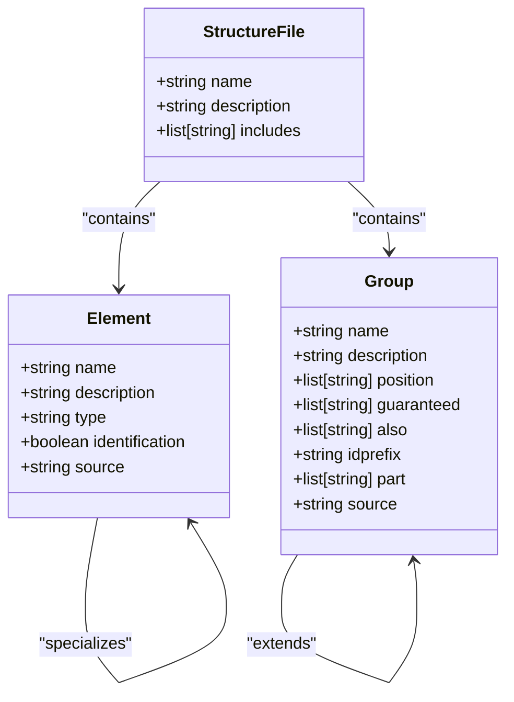
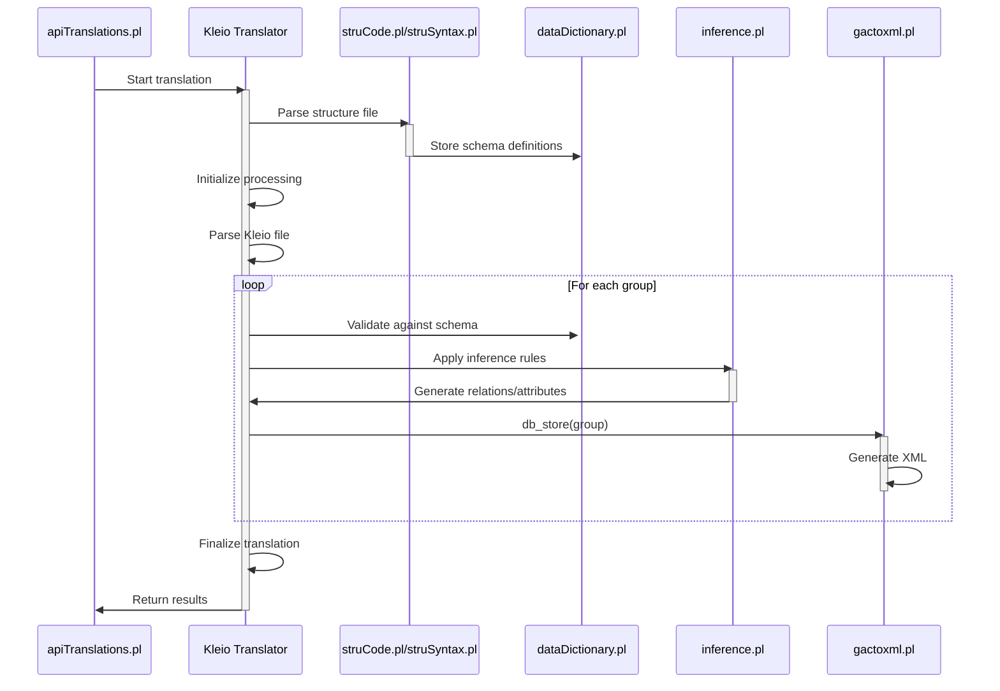
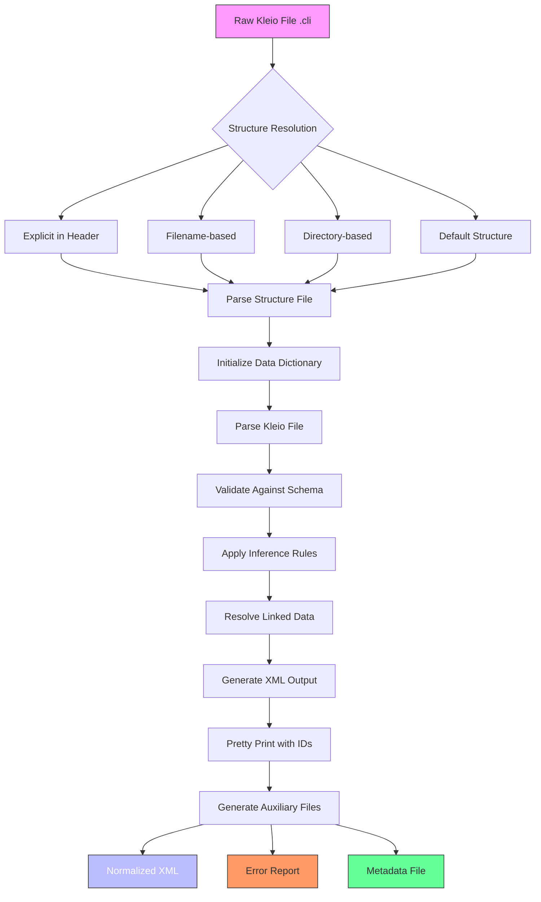

# Core Concepts

<cite>
**Referenced Files in This Document**   
- [elements.yaml](file://src/stru/elements.yaml)
- [groups.yaml](file://src/stru/groups.yaml)
- [system.yaml](file://src/stru/system.yaml)
- [sources-structure.yaml](file://src/stru/sources-structure.yaml)
- [linkedData.pl](file://src/linkedData.pl)
- [apiTranslations.pl](file://src/apiTranslations.pl)
- [inference.pl](file://src/inference.pl)
- [gactoxml.pl](file://src/gactoxml.pl)
- [struCode.pl](file://src/struCode.pl)
- [struSyntax.pl](file://src/struSyntax.pl)
- [dataDictionary.pl](file://src/dataDictionary.pl)
- [clioPP.pl](file://src/clioPP.pl)
- [bapt1714.cli](file://tests/kleio-home/sources/reference_sources/paroquiais/baptismos/bapt1714.cli)
- [cas1714-1722.cli](file://tests/kleio-home/sources/reference_sources/paroquiais/casamentos/cas1714-1722.cli)
</cite>

## Table of Contents
1. [Kleio Notation Syntax](#kleio-notation-syntax)
2. [Structure Files (STR and YAML)](#structure-files-str-and-yaml)
3. [Translation Process](#translation-process)
4. [Linked Data Integration](#linked-data-integration)
5. [Agents in the System](#agents-in-the-system)
6. [Data Transformation Pipeline](#data-transformation-pipeline)

## Kleio Notation Syntax

Kleio notation is a specialized syntax designed for representing historical document transcriptions in a structured format. The notation uses a hierarchical, group-based structure where each group represents a distinct entity or concept from the historical source. The basic syntax follows the pattern `group$name/value`, where:

- **Group**: Represents the type of entity (e.g., person, event, historical-act)
- **Name**: A unique identifier for the specific instance of the group
- **Value**: The data associated with the group, which can be simple text or structured elements

The notation supports a rich set of elements that define the properties and relationships of entities. These elements are defined in the system's schema and include fundamental types such as `id`, `name`, `date`, `type`, `value`, `description`, and `obs` (observation). Specialized elements like `same_as` and `xsame_as` are used to link occurrences of the same entity within the same file or across different files, respectively.

The syntax also supports hierarchical nesting, where groups can contain other groups as sub-elements. For example, a `historical-act` group can contain `person` groups representing individuals involved in the act. This hierarchical structure allows for the representation of complex relationships and contexts found in historical documents.

Comments and annotations can be added using the `#` symbol, allowing transcribers to include additional context or metadata. The notation also supports positional parameters, where certain elements can be specified in a fixed order without explicitly naming them, improving readability for frequently used patterns.

**Section sources**
- [bapt1714.cli](file://tests/kleio-home/sources/reference_sources/paroquiais/baptismos/bapt1714.cli#L1-L200)
- [cas1714-1722.cli](file://tests/kleio-home/sources/reference_sources/paroquiais/casamentos/cas1714-1722.cli#L1-L200)

## Structure Files (STR and YAML)

Structure files (STR and YAML) serve as schema definitions that guide the translation and normalization of Kleio notation into structured data. These files define the data model for historical transcriptions, specifying the valid groups, elements, and their relationships.

The system uses YAML-based structure files (e.g., `elements.yaml`, `groups.yaml`) that are more human-readable and easier to maintain than the legacy STR format. The `elements.yaml` file defines the basic data types and elements used throughout the system, such as `number`, `string64`, `string256`, `text`, and specialized elements like `date`, `id`, `same_as`, and `xsame_as`. Each element includes a description and metadata about its usage and type.

The `groups.yaml` file defines the core groups used in the Kleio schema, establishing the hierarchical structure of the data model. Each group definition includes:
- **name**: The identifier for the group
- **description**: A detailed explanation of the group's purpose
- **position**: Elements that can be specified positionally (without explicit naming)
- **guaranteed**: Elements that must be present in instances of the group
- **also**: Optional elements that may be present
- **idprefix**: A prefix used for generating unique identifiers
- **part**: Sub-groups that can be contained within this group
- **source**: The parent group from which this group inherits properties (enabling inheritance)

The `system.yaml` file serves as the base structure, including both `elements.yaml` and `groups.yaml` to create a complete schema. This modular approach allows for the creation of specialized structure files for different types of historical sources by extending the base definitions.

Structure files are resolved through a hierarchical search process that looks for files in specific locations relative to the source data. The system first checks for a structure specification in the Kleio file header, then searches for files named with the source filename plus `-structure.yaml`, and finally falls back to default structure files in designated directories.



**Diagram sources**
- [elements.yaml](file://src/stru/elements.yaml#L1-L217)
- [groups.yaml](file://src/stru/groups.yaml#L1-L259)
- [system.yaml](file://src/stru/system.yaml#L1-L4)

**Section sources**
- [elements.yaml](file://src/stru/elements.yaml#L1-L217)
- [groups.yaml](file://src/stru/groups.yaml#L1-L259)
- [system.yaml](file://src/stru/system.yaml#L1-L4)

## Translation Process

The translation process transforms raw Kleio (.cli) files into normalized XML output through a series of contextual inference and rule-based processing steps. This process is orchestrated by the Kleio translator, which uses the structure files as a schema to validate and interpret the source data.

The translation begins with the initialization phase, where the system reads the structure file and prepares the processing environment. The `apiTranslations.pl` module handles the API operations for starting translations, managing queues, and tracking processing status. When a translation request is received, the system determines the appropriate structure file by examining the source file's header, filename, and directory structure.

The core translation engine processes the Kleio file line by line, parsing the hierarchical group structure and validating compliance with the schema defined in the structure file. The `struSyntax.pl` module contains the grammar rules for parsing the Kleio syntax, while `struCode.pl` handles the execution of commands and parameter processing. The `dataDictionary.pl` module maintains an in-memory representation of the data dictionary, storing information about groups, elements, and their properties.

During processing, the system performs contextual inference to enrich the data. The `inference.pl` module contains a set of inference rules that automatically generate relationships and attributes based on patterns in the data. For example, if a person group extends the `male` group and contains a `mulher` (wife) element, the system infers a marital relationship and generates the appropriate relation with the `ec` (civil status) attribute set to "c" (married).

The `gactoxml.pl` module serves as the export module, generating XML output from the processed data. It implements the `db_init`, `db_store`, and `db_close` predicates that are called by the translator at the beginning, during, and end of processing. The `db_store` predicate is called for each group in the source file, allowing the export module to generate appropriate XML elements.

A key aspect of the translation process is the generation of unique identifiers and the handling of entity linking. The system automatically generates IDs for entities that don't have explicit identifiers, using the group hierarchy and a counter system. The `clioPP.pl` module generates a "pretty printed" version of the source file with explicit IDs, which is used to ensure consistency across multiple translations.

The process concludes with the generation of auxiliary files, including error reports, pretty-printed source files, and metadata files that document the translation process and results.



**Diagram sources**
- [apiTranslations.pl](file://src/apiTranslations.pl#L1-L779)
- [struCode.pl](file://src/struCode.pl#L1-L391)
- [struSyntax.pl](file://src/struSyntax.pl#L1-L417)
- [dataDictionary.pl](file://src/dataDictionary.pl#L1-L1057)
- [inference.pl](file://src/inference.pl#L1-L2936)
- [gactoxml.pl](file://src/gactoxml.pl#L1-L2781)

**Section sources**
- [apiTranslations.pl](file://src/apiTranslations.pl#L1-L779)
- [struCode.pl](file://src/struCode.pl#L1-L391)
- [struSyntax.pl](file://src/struSyntax.pl#L1-L417)
- [dataDictionary.pl](file://src/dataDictionary.pl#L1-L1057)
- [inference.pl](file://src/inference.pl#L1-L2936)
- [gactoxml.pl](file://src/gactoxml.pl#L1-L2781)
- [clioPP.pl](file://src/clioPP.pl#L1-L227)

## Linked Data Integration

Linked data integration in the timelink-kleio system enables the resolution of external references to authoritative sources such as Wikidata during the translation process. This feature allows historical entities to be connected to global knowledge bases, enhancing the semantic richness and interoperability of the transcribed data.

The integration is implemented in the `linkedData.pl` module, which provides predicates for handling linked data annotations. The process involves two main steps: declaring external data sources and annotating element values with external identifiers.

External sources are declared using the `link` group in the Kleio file, with the format `link$shortname/"url-pattern"`. For example, `link$wikidata/"https://www.wikidata.org/wiki/$1"` declares Wikidata as an external source with the short name "wikidata" and a URL pattern containing a placeholder `$1` for the specific identifier. This declaration is processed by the `store_xlink_pattern/2` predicate, which stores the URL pattern associated with the short name.

Element values are annotated with external identifiers using the syntax `#@shortname:id`. For example, `lugar$Cantão #@wikidata:Q16572` annotates the place "Cantão" with the Wikidata identifier Q16572. The `detect_xlink/3` predicate identifies these annotations in the text, extracting the short name and identifier.

During translation, the `generate_xlink/4` predicate resolves these annotations by replacing the placeholder in the URL pattern with the external identifier, creating a full URI. This process is integrated into the `gactoxml.pl` export module, which processes linked data annotations when exporting attributes. If a linked data annotation is detected, the system generates the corresponding URI and includes it in the output, while also validating that the external source has been properly declared.

The system maintains a dynamic registry of linked data patterns and resolved links using Prolog's dynamic predicates `xlink_pattern/2` and `xlink_data/2`. This allows for efficient resolution of multiple references to the same external source and provides a mechanism for debugging and verification of linked data integration.

```mermaid
flowchart TD
A[Declare External Source] --> B[link$wikidata/"https://www.wikidata.org/wiki/$1"]
C[Annotate Element Value] --> D[lugar$Cantão #@wikidata:Q16572]
B --> E[Store Pattern in xlink_pattern/2]
D --> F[Detect Annotation with detect_xlink/3]
F --> G[Extract Shortname and ID]
G --> H[Retrieve Pattern from xlink_pattern/2]
H --> I[Generate URI with replace_xid/3]
I --> J[Store Result in xlink_data/2]
J --> K[Include in XML Output]
```

**Diagram sources**
- [linkedData.pl](file://src/linkedData.pl#L1-L116)
- [gactoxml.pl](file://src/gactoxml.pl#L1-L2781)

**Section sources**
- [linkedData.pl](file://src/linkedData.pl#L1-L116)
- [gactoxml.pl](file://src/gactoxml.pl#L1-L2781)

## Agents in the System

Agents in the timelink-kleio system are independent processing units that perform specific tasks within the translation and data management workflow. These agents operate as modular components that can be orchestrated to handle different aspects of the system's functionality.

The primary agents include:
- **Translation Agent**: Responsible for processing Kleio files and generating normalized output. This agent is implemented in the `apiTranslations.pl` module and handles the lifecycle of translation jobs, including queuing, processing, and result reporting.
- **Structure Processing Agent**: Manages the parsing and validation of structure files. Implemented in `struCode.pl` and `struSyntax.pl`, this agent processes the schema definitions and maintains the data dictionary.
- **Inference Agent**: Applies rule-based reasoning to generate implicit relationships and attributes. The `inference.pl` module contains a set of inference rules that are applied during translation to enrich the data with contextual information.
- **Export Agent**: Generates output in various formats from the processed data. The `gactoxml.pl` module serves as the primary export agent, converting the internal representation to XML format.
- **Linked Data Agent**: Handles the resolution of external references. Implemented in `linkedData.pl`, this agent manages the declaration of external sources and the annotation of element values with external identifiers.

These agents communicate through a shared data model and a set of well-defined interfaces. The system uses Prolog's dynamic predicates and property system to share state between agents, allowing for coordinated processing without tight coupling. For example, the translation agent sets properties that are accessed by the export agent, while the inference agent asserts facts that can be queried by other components.

The agent architecture enables parallel processing and scalability. Multiple translation agents can operate simultaneously on different files, while sharing access to the same structure definitions and inference rules. This design supports the system's ability to handle large collections of historical documents efficiently.

**Section sources**
- [AGENTS.md](file://AGENTS.md)
- [apiTranslations.pl](file://src/apiTranslations.pl#L1-L779)
- [struCode.pl](file://src/struCode.pl#L1-L391)
- [inference.pl](file://src/inference.pl#L1-L2936)
- [gactoxml.pl](file://src/gactoxml.pl#L1-L2781)
- [linkedData.pl](file://src/linkedData.pl#L1-L116)

## Data Transformation Pipeline

The data transformation pipeline in the timelink-kleio system illustrates the complete journey from raw Kleio notation to normalized XML output, integrating structure definitions, contextual inference, and linked data resolution.



**Diagram sources**
- [bapt1714.cli](file://tests/kleio-home/sources/reference_sources/paroquiais/baptismos/bapt1714.cli#L1-L200)
- [sources-structure.yaml](file://src/stru/sources-structure.yaml#L1-L800)
- [dataDictionary.pl](file://src/dataDictionary.pl#L1-L1057)
- [gactoxml.pl](file://src/gactoxml.pl#L1-L2781)

**Section sources**
- [bapt1714.cli](file://tests/kleio-home/sources/reference_sources/paroquiais/baptismos/bapt1714.cli#L1-L200)
- [sources-structure.yaml](file://src/stru/sources-structure.yaml#L1-L800)
- [dataDictionary.pl](file://src/dataDictionary.pl#L1-L1057)
- [gactoxml.pl](file://src/gactoxml.pl#L1-L2781)