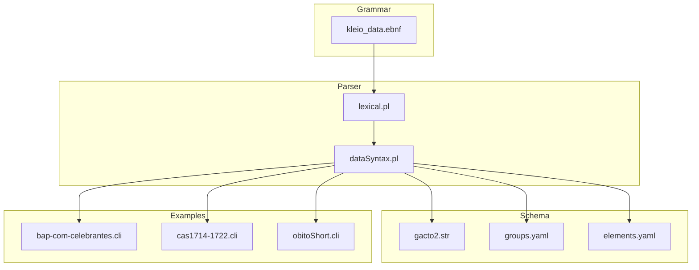
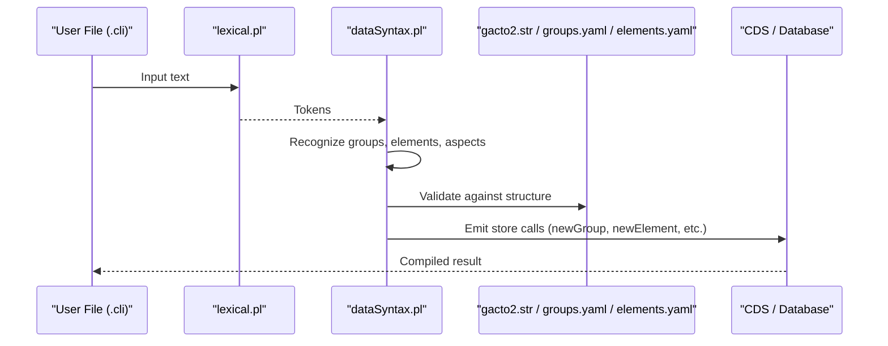
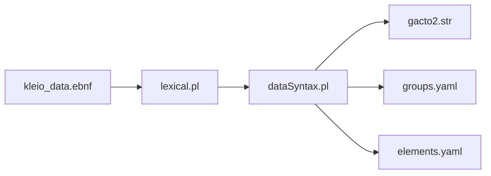

# Kleio Notation Fundamentals

<cite>
**Referenced Files in This Document**
- [README_KLEIO_NOTATION.md](file://README_KLEIO_NOTATION.md)
- [kleio_data.ebnf](file://syntax/kleio_data.ebnf)
- [lexical.pl](file://src/lexical.pl)
- [dataSyntax.pl](file://src/dataSyntax.pl)
- [gacto2.str](file://src/stru/gacto2.str)
- [groups.yaml](file://src/stru/groups.yaml)
- [elements.yaml](file://src/stru/elements.yaml)
- [bap-com-celebrantes.cli](file://tests/kleio-home/sources/more_sources/paroquiais/baptismos/bap-com-celebrantes.cli)
- [cas1714-1722.cli](file://tests/kleio-home/sources/more_sources/paroquiais/casamentos/cas1714-1722.cli)
- [obitoShort.cli](file://tests/kleio-home/sources/more_sources/paroquiais/obitos/obitoShort.cli)
</cite>

## Table of Contents
1. [Introduction](#introduction)
2. [Project Structure](#project-structure)
3. [Core Components](#core-components)
4. [Architecture Overview](#architecture-overview)
5. [Detailed Component Analysis](#detailed-component-analysis)
6. [Dependency Analysis](#dependency-analysis)
7. [Performance Considerations](#performance-considerations)
8. [Troubleshooting Guide](#troubleshooting-guide)
9. [Conclusion](#conclusion)
10. [Appendices](#appendices)

## Introduction
Kleio notation is a plain-text syntax for transcribing historical sources into structured data. It uses special characters to annotate text, enabling the representation of entities (groups), attributes (elements), and multiple aspects (core, original, comment). The notation supports:
- Groups as top-level records (e.g., baptism, marriage, death)
- Elements as key-value pairs within groups
- Aspects to capture normalized values, original wording, and comments
- Multiple values per element
- Quoted and multi-line strings
- Configurable separators via properties

This document explains the syntax rules, special characters, whitespace handling, string delimiters, multi-line strings, multiple values, and how Kleio maps to database concepts. It also provides EBNF grammar references and practical examples from real historical documents.

## Project Structure
The Kleio system includes:
- A formal grammar specification for parsing
- Lexical analyzer and syntax parser modules
- Schema definitions (both legacy .str and modern YAML)
- Example source files demonstrating usage patterns

**Diagram sources**
- [kleio_data.ebnf](file://syntax/kleio_data.ebnf)
- [lexical.pl](file://src/lexical.pl)
- [dataSyntax.pl](file://src/dataSyntax.pl)
- [gacto2.str](file://src/stru/gacto2.str)
- [groups.yaml](file://src/stru/groups.yaml)
- [elements.yaml](file://src/stru/elements.yaml)
- [bap-com-celebrantes.cli](file://tests/kleio-home/sources/more_sources/paroquiais/baptismos/bap-com-celebrantes.cli)
- [cas1714-1722.cli](file://tests/kleio-home/sources/more_sources/paroquiais/casamentos/cas1714-1722.cli)
- [obitoShort.cli](file://tests/kleio-home/sources/more_sources/paroquiais/obitos/obitoShort.cli)

**Section sources**
- [README_KLEIO_NOTATION.md](file://README_KLEIO_NOTATION.md)
- [kleio_data.ebnf](file://syntax/kleio_data.ebnf)
- [lexical.pl](file://src/lexical.pl)
- [dataSyntax.pl](file://src/dataSyntax.pl)
- [gacto2.str](file://src/stru/gacto2.str)
- [groups.yaml](file://src/stru/groups.yaml)
- [elements.yaml](file://src/stru/elements.yaml)

## Core Components
- Groups: Represent entities or records (e.g., person, event, act). They are declared with a group name followed by a marker.
- Elements: Attributes of groups, expressed as name=value pairs.
- Aspects:
  - core: the main value stored in the database
  - original: the original wording (optional)
  - comment: an annotation about the element (optional)
- Multiple values: An element can have several values separated by a configured separator.
- Strings:
  - Double quotes allow special characters inside values
  - Triple quotes support multi-line strings preserving line breaks and indentation
- Whitespace: Outside quoted strings, whitespace sequences collapse to a single space.

Practical notes:
- Group names and element names must start with a letter and may include digits, hyphens, and underscores.
- Positional elements can be used when defined in schema files.

**Section sources**
- [README_KLEIO_NOTATION.md](file://README_KLEIO_NOTATION.md)
- [groups.yaml](file://src/stru/groups.yaml)
- [elements.yaml](file://src/stru/elements.yaml)

## Architecture Overview
Kleio notation flows through lexical analysis and syntax compilation before interacting with schema definitions.

**Diagram sources**
- [lexical.pl](file://src/lexical.pl)
- [dataSyntax.pl](file://src/dataSyntax.pl)
- [gacto2.str](file://src/stru/gacto2.str)
- [groups.yaml](file://src/stru/groups.yaml)
- [elements.yaml](file://src/stru/elements.yaml)

## Detailed Component Analysis

### Special Characters and Syntax Rules
- $ marks a group name
- = assigns a value to an element
- / separates elements on the same line
- % introduces the original aspect
- # introduces the comment aspect
- | separates multiple values (default)
- ; alternative separator for multiple values (configurable)
- " starts/ends a quoted string
- """ starts/ends a multi-line string

These tokens are recognized by the lexer and mapped to named tokens in the grammar.

**Section sources**
- [README_KLEIO_NOTATION.md](file://README_KLEIO_NOTATION.md)
- [kleio_data.ebnf](file://syntax/kleio_data.ebnf)
- [lexical.pl](file://src/lexical.pl)

### White Space Handling
- Outside quoted strings, all whitespace collapses to a single space.
- Inside double-quoted or triple-quoted strings, whitespace is preserved.

**Section sources**
- [README_KLEIO_NOTATION.md](file://README_KLEIO_NOTATION.md)
- [dataSyntax.pl](file://src/dataSyntax.pl)

### String Delimiters and Multi-line Strings
- Double quotes allow embedding special characters and preserve internal spaces.
- Triple quotes enable multi-line content; returns and indentation are preserved.

**Section sources**
- [README_KLEIO_NOTATION.md](file://README_KLEIO_NOTATION.md)
- [dataSyntax.pl](file://src/dataSyntax.pl)

### Multiple Values
- Default separator is pipe; configurable via property to semicolon or another character.
- Multiple values can be specified inline after an element assignment.

**Section sources**
- [README_KLEIO_NOTATION.md](file://README_KLEIO_NOTATION.md)
- [groups.yaml](file://src/stru/groups.yaml)
- [lexical.pl](file://src/lexical.pl)

### Aspects: Core, Original, Comment
- Core is always present and becomes the stored value.
- Original captures the exact wording from the source.
- Comment adds explanatory notes.

**Section sources**
- [README_KLEIO_NOTATION.md](file://README_KLEIO_NOTATION.md)
- [dataSyntax.pl](file://src/dataSyntax.pl)

### Practical Examples from Historical Documents
- Baptism records demonstrate nested persons, parents, godparents, and observations using multi-line strings.
- Marriage records show roles like groom, bride, witnesses, and repeated structures.
- Death records illustrate relationships and original/comment aspects.

Use these example files to see concrete usage patterns:
- [bap-com-celebrantes.cli](file://tests/kleio-home/sources/more_sources/paroquiais/baptismos/bap-com-celebrantes.cli)
- [cas1714-1722.cli](file://tests/kleio-home/sources/more_sources/paroquiais/casamentos/cas1714-1722.cli)
- [obitoShort.cli](file://tests/kleio-home/sources/more_sources/paroquiais/obitos/obitoShort.cli)

**Section sources**
- [bap-com-celebrantes.cli](file://tests/kleio-home/sources/more_sources/paroquiais/baptismos/bap-com-celebrantes.cli)
- [cas1714-1722.cli](file://tests/kleio-home/sources/more_sources/paroquiais/casamentos/cas1714-1722.cli)
- [obitoShort.cli](file://tests/kleio-home/sources/more_sources/paroquiais/obitos/obitoShort.cli)

### EBNF Grammar Reference
The grammar defines:
- Document structure and group declarations
- Element assignments and content
- Value types: simple, quoted, multi-line
- Identifiers and special tokens
- Whitespace and line endings

Key non-terminals include document, group_declaration, element, element_value, identifier, and named tokens for special characters.

**Section sources**
- [kleio_data.ebnf](file://syntax/kleio_data.ebnf)

### Mapping to Database Concepts
- Groups map to entity tables or records.
- Elements map to fields/columns.
- Aspects:
  - core -> value field
  - original -> optional original text
  - comment -> optional note
- Multiple values -> list semantics or repeated rows depending on schema.
- Schema files define allowed groups, hierarchy, and permitted elements.

**Section sources**
- [README_KLEIO_NOTATION.md](file://README_KLEIO_NOTATION.md)
- [gacto2.str](file://src/stru/gacto2.str)
- [groups.yaml](file://src/stru/groups.yaml)
- [elements.yaml](file://src/stru/elements.yaml)

## Dependency Analysis
The parser depends on the lexer for tokenization and on schema definitions for validation. The grammar formalizes the expected token sequences.

**Diagram sources**
- [kleio_data.ebnf](file://syntax/kleio_data.ebnf)
- [lexical.pl](file://src/lexical.pl)
- [dataSyntax.pl](file://src/dataSyntax.pl)
- [gacto2.str](file://src/stru/gacto2.str)
- [groups.yaml](file://src/stru/groups.yaml)
- [elements.yaml](file://src/stru/elements.yaml)

**Section sources**
- [kleio_data.ebnf](file://syntax/kleio_data.ebnf)
- [lexical.pl](file://src/lexical.pl)
- [dataSyntax.pl](file://src/dataSyntax.pl)
- [gacto2.str](file://src/stru/gacto2.str)
- [groups.yaml](file://src/stru/groups.yaml)
- [elements.yaml](file://src/stru/elements.yaml)

## Performance Considerations
- Tokenization and parsing operate line-by-line, which keeps memory usage low.
- Collapsing whitespace outside strings reduces token count and speeds up processing.
- Using schema validation early avoids costly reprocessing later.

[No sources needed since this section provides general guidance]

## Troubleshooting Guide
Common issues and resolutions:
- Unclosed quotes: Ensure every " has a matching pair; triple quotes must be balanced.
- Invalid identifiers: Names must start with a letter and contain only letters, digits, hyphens, and underscores.
- Unexpected separators: If multiple values do not split as expected, verify the configured multiple-entry-flag property.
- Aspect ordering: Aspects follow the core value; ensure correct placement of % and #.
- Whitespace surprises: Remember that whitespace outside strings collapses to a single space.

Validation rules enforced by the parser:
- Group markers must follow group names.
- Element assignments require an equals sign.
- Aspects must follow their respective markers.
- Quoted and multi-line strings must be properly terminated.

**Section sources**
- [dataSyntax.pl](file://src/dataSyntax.pl)
- [lexical.pl](file://src/lexical.pl)
- [README_KLEIO_NOTATION.md](file://README_KLEIO_NOTATION.md)

## Conclusion
Kleio notation offers a concise, expressive way to transcribe historical sources into structured data. Its clear separation of groups, elements, and aspects, combined with flexible quoting and multi-value support, makes it well-suited for complex archival materials. The formal grammar and robust parser ensure reliable processing, while schema definitions enforce consistency and mapping to database models.

[No sources needed since this section summarizes without analyzing specific files]

## Appendices

### Appendix A: EBNF Grammar Summary
- Document: sequence of lines and group declarations
- Group: name marker, positional elements, and explicit elements
- Element: name, assignment, and content (values, aspects)
- Values: simple, quoted, multi-line
- Identifiers: letters, digits, hyphens, underscores
- Tokens: $, =, /, %, #, |, ;, ", """
- Whitespace: collapsed except inside strings

**Section sources**
- [kleio_data.ebnf](file://syntax/kleio_data.ebnf)

### Appendix B: Real-World Usage Patterns
- Baptisms: nested persons, parents, godparents, and long observations
- Marriages: roles, witnesses, and repeated structures
- Deaths: relationships and original/comment aspects

Explore these files for detailed examples:
- [bap-com-celebrantes.cli](file://tests/kleio-home/sources/more_sources/paroquiais/baptismos/bap-com-celebrantes.cli)
- [cas1714-1722.cli](file://tests/kleio-home/sources/more_sources/paroquiais/casamentos/cas1714-1722.cli)
- [obitoShort.cli](file://tests/kleio-home/sources/more_sources/paroquiais/obitos/obitoShort.cli)

**Section sources**
- [bap-com-celebrantes.cli](file://tests/kleio-home/sources/more_sources/paroquiais/baptismos/bap-com-celebrantes.cli)
- [cas1714-1722.cli](file://tests/kleio-home/sources/more_sources/paroquiais/casamentos/cas1714-1722.cli)
- [obitoShort.cli](file://tests/kleio-home/sources/more_sources/paroquiais/obitos/obitoShort.cli)