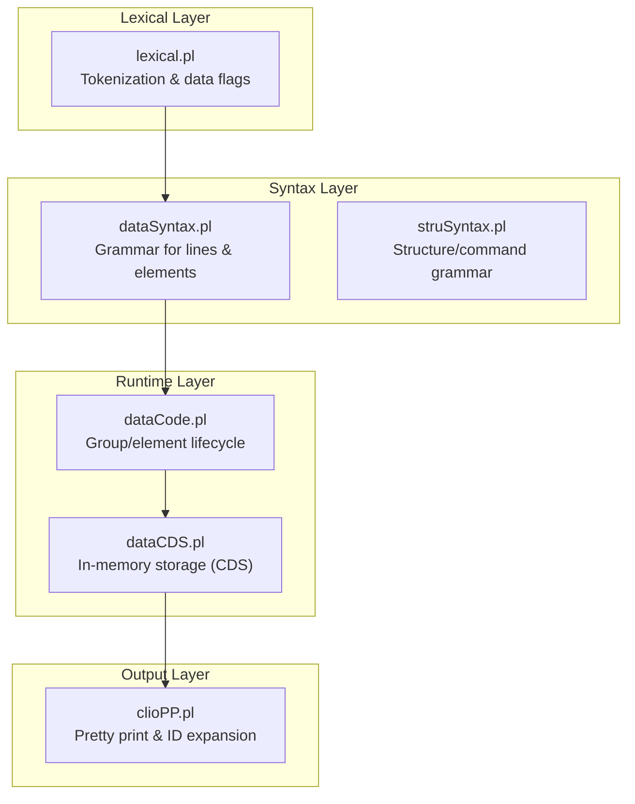
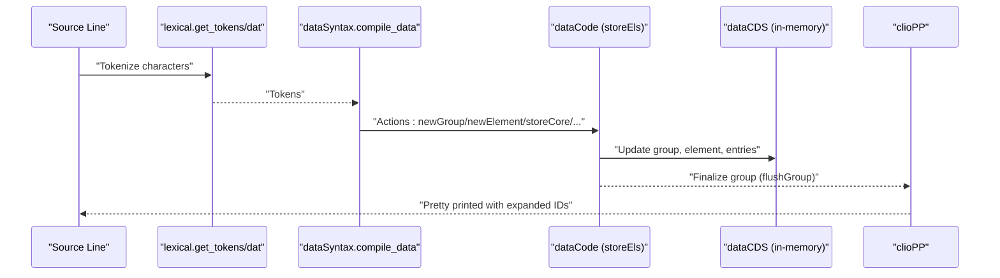
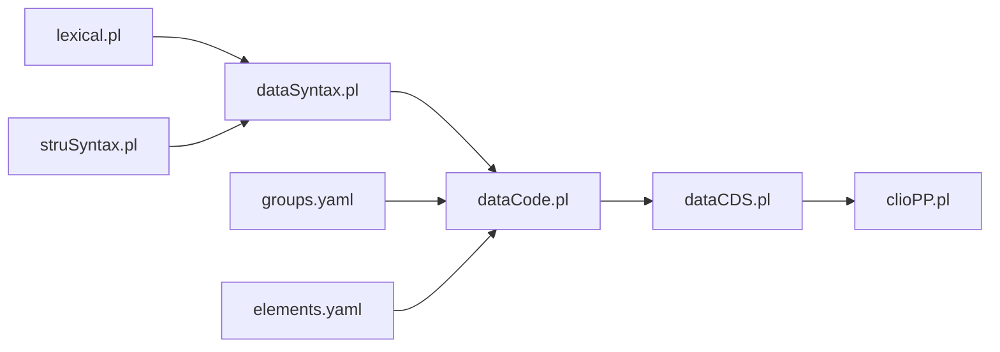

# Kleio Notation Syntax

<cite>
**Referenced Files in This Document**
- [lexical.pl](file://src/lexical.pl)
- [dataSyntax.pl](file://src/dataSyntax.pl)
- [dataCode.pl](file://src/dataCode.pl)
- [dataCDS.pl](file://src/dataCDS.pl)
- [clioPP.pl](file://src/clioPP.pl)
- [struSyntax.pl](file://src/struSyntax.pl)
- [elements.yaml](file://src/stru/elements.yaml)
- [groups.yaml](file://src/stru/groups.yaml)
- [cas1714-1722.cli](file://tests/kleio-home/sources/reference_sources/paroquiais/casamentos/cas1714-1722.cli)
- [ob1688.cli](file://tests/kleio-home/sources/reference_sources/paroquiais/obitos/ob1688.cli)
</cite>

## Table of Contents
1. [Introduction](#introduction)
2. [Project Structure](#project-structure)
3. [Core Components](#core-components)
4. [Architecture Overview](#architecture-overview)
5. [Detailed Component Analysis](#detailed-component-analysis)
6. [Dependency Analysis](#dependency-analysis)
7. [Performance Considerations](#performance-considerations)
8. [Troubleshooting Guide](#troubleshooting-guide)
9. [Conclusion](#conclusion)
10. [Appendices](#appendices)

## Introduction
This document explains the Kleio notation syntax used to encode historical documents and structured data. It covers the fundamental grammar, hierarchical grouping with $ and / separators, core constructs (actors, acts, attributes, relations), data types, pretty printing, ID expansion, validation rules, and the relationship between raw notation and internal representations. Practical examples are drawn from the repository’s reference corpus to illustrate person records, marriage acts, and baptism records.

## Project Structure
Kleio syntax is implemented through a layered pipeline:
- Lexical analysis recognizes tokens and special data flags
- Syntax analysis parses lines into structured calls
- Data code manages in-memory storage and group lifecycle
- Pretty printer expands implicit identifiers and re-emits notation

**Diagram sources**
- [lexical.pl](file://src/lexical.pl#L27-L58)
- [dataSyntax.pl](file://src/dataSyntax.pl#L38-L62)
- [dataCode.pl](file://src/dataCode.pl#L75-L121)
- [dataCDS.pl](file://src/dataCDS.pl#L153-L214)
- [clioPP.pl](file://src/clioPP.pl#L90-L130)

**Section sources**
- [lexical.pl](file://src/lexical.pl#L27-L58)
- [dataSyntax.pl](file://src/dataSyntax.pl#L38-L62)
- [dataCode.pl](file://src/dataCode.pl#L75-L121)
- [dataCDS.pl](file://src/dataCDS.pl#L153-L214)
- [clioPP.pl](file://src/clioPP.pl#L90-L130)

## Core Components
- Lexical analyzer: builds typed character streams and tokenizes both data lines and command files; defines data flags (special punctuation) and supports quoted strings and triple quotes.
- Syntax analyzer: parses a line into a sequence of actions (new group, new element, end element, new aspect, new entry, store core).
- Data code/runtime: maintains a Current Data Store (CDS), tracks group hierarchy, validates elements against group definitions, and constructs IDs.
- Pretty printer: emits a normalized, pretty-printed version of the input with explicit IDs and proper indentation.

**Section sources**
- [lexical.pl](file://src/lexical.pl#L27-L58)
- [dataSyntax.pl](file://src/dataSyntax.pl#L38-L126)
- [dataCode.pl](file://src/dataCode.pl#L115-L202)
- [dataCDS.pl](file://src/dataCDS.pl#L153-L214)
- [clioPP.pl](file://src/clioPP.pl#L90-L130)

## Architecture Overview
The Kleio notation is processed line-by-line. Each line is tokenized, then parsed into semantic actions that manipulate the in-memory CDS. Groups are linked into a path reflecting containment, and IDs are generated or expanded during pretty printing.

**Diagram sources**
- [lexical.pl](file://src/lexical.pl#L45-L58)
- [dataSyntax.pl](file://src/dataSyntax.pl#L57-L62)
- [dataCode.pl](file://src/dataCode.pl#L140-L152)
- [dataCDS.pl](file://src/dataCDS.pl#L153-L214)
- [clioPP.pl](file://src/clioPP.pl#L90-L130)

## Detailed Component Analysis

### Lexical Analysis and Token Recognition
- Token categories include names, numbers, fill/spaces, double-quoted strings, triple-quoted blocks, and data flags.
- Data flags are punctuation characters mapped to named constants (e.g., dollar, slash, equal, percent, semicolon, backslash). These are configurable via properties and runtime flags.
- Double quotes allow multi-line strings; triple quotes mark literal blocks.
- Numbers support dot-separated decimals.

Key behaviors:
- Names accept letters, digits, dots, hyphens, underscores; must start with a letter.
- Fill sequences collapse to a single space; returns are skipped within quotes.
- Data flags are recognized even when not immediately adjacent to names.

**Section sources**
- [lexical.pl](file://src/lexical.pl#L104-L123)
- [lexical.pl](file://src/lexical.pl#L177-L188)
- [lexical.pl](file://src/lexical.pl#L196-L207)
- [lexical.pl](file://src/lexical.pl#L215-L231)
- [lexical.pl](file://src/lexical.pl#L308-L331)

### Syntax Grammar for Data Lines
- A line is either a group header followed by elements, or standalone elements.
- Group header: optional leading fill, a names token, and a data flag 1 (dollar). The names token becomes the group name; a new group is initiated.
- Elements include:
  - Explicit element assignment: names '=' storeCore(...)
  - Implicit element via positional lists (locus) when no explicit name is given
  - End of element: slash data flag 2
  - Aspects:
    - Percent (%) for original wording
    - Cardinal (#) for comments
  - Multiple entries separated by semicolon (data flag 8), configurable via a property
  - Backslash escapes special characters
  - Numbers and quoted strings are captured as core content
  - Triple-quoted blocks and double-quoted blocks are supported

Validation and buffering:
- Actions accumulate and are executed at line end via storeEls.
- Within quotes, returns and fill are handled specially; triple quotes preserve content literally.

**Section sources**
- [dataSyntax.pl](file://src/dataSyntax.pl#L65-L72)
- [dataSyntax.pl](file://src/dataSyntax.pl#L85-L111)
- [dataSyntax.pl](file://src/dataSyntax.pl#L117-L125)
- [dataSyntax.pl](file://src/dataSyntax.pl#L143-L152)

### Hierarchical Representation with $ and /
- The $ introduces a new group and sets the group name.
- The / separates positional arguments (locus) within a group.
- Elements are expressed as name=value pairs; multiple entries are separated by semicolon.
- Aspects are appended after the equals sign:
  - %original wording
  - #comment
- Indentation encodes containment: deeper nesting implies parent-child relationships in the group path.

Practical examples:
- Marriage act with positional date and page, then child elements:
  - cas$c1714-1/8/2/1714/fl.142v./igreja de sao silvestre/...
- Person record with attributes:
  - n$antonia francisca/f/id=obitos 1688-his1-per1
  - ls$residencia/mogadouro

**Section sources**
- [dataSyntax.pl](file://src/dataSyntax.pl#L117-L121)
- [cas1714-1722.cli](file://tests/kleio-home/sources/reference_sources/paroquiais/casamentos/cas1714-1722.cli#L4-L12)
- [ob1688.cli](file://tests/kleio-home/sources/reference_sources/paroquiais/obitos/ob1688.cli#L6-L14)

### Core Constructs: Actors, Acts, Attributes, Relations
- Actors: person, male, female, object, abstraction, topic.
- Acts: historical-act, event, cevent.
- Attributes: attribute (alias attr, atr, ls).
- Relations: relation (alias rel).

These are defined in the group schema with guaranteed, also, and position lists. For example:
- person guarantees name and sex; supports arbitrary nested attributes and relations.
- historical-act guarantees id, type, date; supports arbitrary persons, objects, places, and attributes/relations.
- attribute requires type and value; relation requires type, value, destname, destination.

**Section sources**
- [groups.yaml](file://src/stru/groups.yaml#L161-L167)
- [groups.yaml](file://src/stru/groups.yaml#L133-L139)
- [groups.yaml](file://src/stru/groups.yaml#L213-L218)
- [groups.yaml](file://src/stru/groups.yaml#L232-L237)

### Data Types and Element Definitions
- Basic types: number, string64, string256, text.
- Dates: day, month, year, date (YYYYMMDD or YYYY-MM-DD; ranges and relative dates supported).
- Identification: id (string64), same_as, xsame_as, entity, origin, destination.
- Standard elements: type, value, class, loc, name, description, destname, sex, obs, summary.
- References: ref (string256), page, pages.
- Processing metadata: replaces/replace, inside, groupname, level, line, kleiofile.

These types and semantics guide downstream mapping and validation.

**Section sources**
- [elements.yaml](file://src/stru/elements.yaml#L39-L78)
- [elements.yaml](file://src/stru/elements.yaml#L81-L120)
- [elements.yaml](file://src/stru/elements.yaml#L141-L153)
- [elements.yaml](file://src/stru/elements.yaml#L169-L184)
- [elements.yaml](file://src/stru/elements.yaml#L187-L221)

### Pretty Printing and ID Expansion
- clioPP emits a normalized representation with:
  - Proper indentation reflecting the group path depth
  - Explicit ids inserted when absent or when an id element is encountered
  - Multiple entries separated by the configured multiple-entry-flag (semicolon by default)
  - Original wording (%) and comments (#) preserved
- The pretty printer reads the current group and its elements from the CDS and writes a canonical line.

Benefits:
- Enables safe reimport by ensuring deterministic IDs
- Normalizes notation for human review and diffs

**Section sources**
- [clioPP.pl](file://src/clioPP.pl#L90-L130)
- [clioPP.pl](file://src/clioPP.pl#L206-L226)

### Syntax Validation and Error Handling
- Unknown elements within a group trigger warnings or errors depending on group rules.
- Undefined elements (no explicit name and no positional match) produce errors with contextual line information.
- Missing guaranteed elements cause errors indicating required elements.
- Group containment errors occur when a new group cannot be linked to the current path; recursion detection prevents cycles.
- Data flag configuration errors (e.g., wrong multiple-entry-flag) are reported with line context.

**Section sources**
- [dataCode.pl](file://src/dataCode.pl#L312-L321)
- [dataCode.pl](file://src/dataCode.pl#L361-L372)
- [dataCode.pl](file://src/dataCode.pl#L154-L168)
- [dataCode.pl](file://src/dataCode.pl#L225-L230)

### Relationship Between Raw Notation and Internal Representations
- Raw notation is tokenized and parsed into actions that populate the CDS.
- The CDS holds:
  - Current path (ancestors)
  - Current group, group id
  - Element list with core/original/comment entries
  - Aspect pointer and buffers for accumulating tokens
- Pretty printing reconstructs notation from the CDS, expanding implicit ids and normalizing structure.

**Section sources**
- [dataCDS.pl](file://src/dataCDS.pl#L29-L57)
- [dataCDS.pl](file://src/dataCDS.pl#L445-L499)
- [clioPP.pl](file://src/clioPP.pl#L90-L130)

### Practical Examples from the Codebase
- Marriage acts (cas): demonstrate positional arguments (date, folio), child persons (noivo/noiva), parents (pnoivo/mnoivo), and witnesses (test), with optional observations.
- Death records (o): show person records with attributes (ls$residencia, ls$ec, ls$idade), family relations (pai, mae), and additional elements (sacr, locs, oficios, testamento).
- Attribute and relation elements: used extensively to annotate persons and objects with contextual information.

**Section sources**
- [cas1714-1722.cli](file://tests/kleio-home/sources/reference_sources/paroquiais/casamentos/cas1714-1722.cli#L4-L56)
- [ob1688.cli](file://tests/kleio-home/sources/reference_sources/paroquiais/obitos/ob1688.cli#L6-L200)

## Dependency Analysis

**Diagram sources**
- [lexical.pl](file://src/lexical.pl#L27-L58)
- [dataSyntax.pl](file://src/dataSyntax.pl#L38-L62)
- [dataCode.pl](file://src/dataCode.pl#L75-L121)
- [dataCDS.pl](file://src/dataCDS.pl#L153-L214)
- [clioPP.pl](file://src/clioPP.pl#L90-L130)
- [struSyntax.pl](file://src/struSyntax.pl#L48-L58)
- [groups.yaml](file://src/stru/groups.yaml#L32-L56)
- [elements.yaml](file://src/stru/elements.yaml#L39-L78)

**Section sources**
- [lexical.pl](file://src/lexical.pl#L27-L58)
- [dataSyntax.pl](file://src/dataSyntax.pl#L38-L62)
- [dataCode.pl](file://src/dataCode.pl#L75-L121)
- [dataCDS.pl](file://src/dataCDS.pl#L153-L214)
- [clioPP.pl](file://src/clioPP.pl#L90-L130)
- [struSyntax.pl](file://src/struSyntax.pl#L48-L58)
- [groups.yaml](file://src/stru/groups.yaml#L32-L56)
- [elements.yaml](file://src/stru/elements.yaml#L39-L78)

## Performance Considerations
- Tokenization and parsing operate line-by-line with accumulated actions executed at end-of-line, minimizing intermediate copies.
- Triple-quoted and double-quoted handling avoids repeated scanning by delegating to dedicated grammars.
- Pretty printing reconstructs notation from the CDS, avoiding full re-parsing of the original file.

## Troubleshooting Guide
Common issues and resolutions:
- Unknown element in group: verify the element is permitted by the group’s definition (locus, also, guaranteed lists).
- Missing guaranteed element: ensure required elements are present in the group.
- Undefined element without positional match: provide an explicit element name or adjust group position rules.
- Multiple-entry separator misconfiguration: set the multiple-entry-flag property to the desired character; otherwise semicolon is used.
- Group containment errors: ensure parent groups are properly declared and not recursively referencing themselves.
- Pretty printing does not show ids: ensure an id element exists or is auto-generated; the pretty printer inserts ids when needed.

**Section sources**
- [dataCode.pl](file://src/dataCode.pl#L312-L321)
- [dataCode.pl](file://src/dataCode.pl#L154-L168)
- [dataCode.pl](file://src/dataCode.pl#L225-L230)
- [lexical.pl](file://src/lexical.pl#L65-L71)
- [clioPP.pl](file://src/clioPP.pl#L192-L195)

## Conclusion
Kleio notation provides a compact, hierarchical syntax for encoding historical documents. Its design centers on groups ($), positional arguments (/), and element/value pairs with optional aspects and multiple entries. The lexer and parser enforce strict tokenization and grammar rules, while the runtime CDS and pretty printer ensure robust validation, ID generation/expansion, and reproducible output suitable for import and archival.

## Appendices

### Appendix A: Data Flag Reference
- Dollar ($): group introducer
- Slash (/): positional argument separator
- Equal (=): element assignment
- Percent (%): original wording aspect
- Cardinal (#): comment aspect
- Semicolon (;): multiple-entry separator (configurable)
- Backslash (\): escape special characters
- Colon (:), Greater (>), Less (<): additional flags as needed

**Section sources**
- [lexical.pl](file://src/lexical.pl#L308-L331)
- [dataSyntax.pl](file://src/dataSyntax.pl#L117-L125)

### Appendix B: Example Patterns
- Person record: name, sex, attributes, relations
- Marriage act: date, place, parties, parents, witnesses, observations
- Death record: date, place, deceased, family members, attributes, rituals

**Section sources**
- [cas1714-1722.cli](file://tests/kleio-home/sources/reference_sources/paroquiais/casamentos/cas1714-1722.cli#L4-L56)
- [ob1688.cli](file://tests/kleio-home/sources/reference_sources/paroquiais/obitos/ob1688.cli#L6-L200)