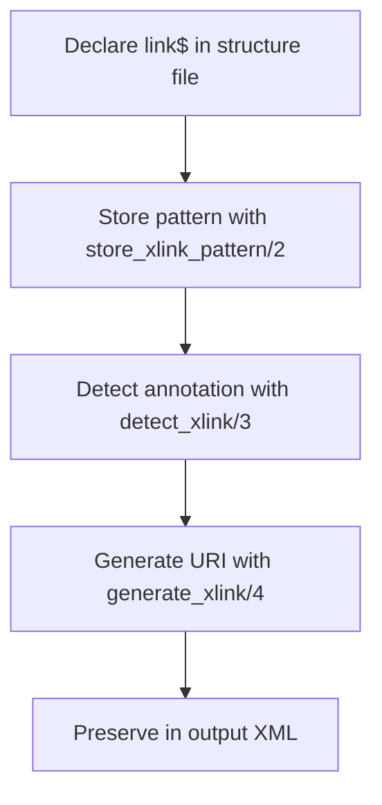

# Linked Data Integration

<cite>
**Referenced Files in This Document**   
- [linkedData.pl](file://src/linkedData.pl)
- [gacto2.str](file://src/stru/gacto2.str)
- [gactoxml.pl](file://src/gactoxml.pl)
- [linked_data.md](file://docs/doc/linked_data.md)
- [dehergne-a.cli](file://tests/kleio-home/sources/reference_translations/linked_data/dehergne-a.cli)
</cite>

## Table of Contents
1. [Introduction](#introduction)
2. [Declaring External Sources with link$ Directive](#declaring-external-sources-with-link-directive)
3. [Annotating Element Values with Linked Data](#annotating-element-values-with-linked-data)
4. [Implementation in linkedData.pl](#implementation-in-linkeddatapl)
5. [URI Generation and Pattern Matching](#uri-generation-and-pattern-matching)
6. [Preservation in Output XML](#preservation-in-output-xml)
7. [Troubleshooting Common Issues](#troubleshooting-common-issues)
8. [Best Practices](#best-practices)

## Introduction
The Linked Data Integration feature in Timelink-Kleio enables the connection of data elements to external knowledge sources such as Wikidata. This integration is achieved through a two-step process: first, declaring external data sources using the `link$` directive in structure files, and second, annotating element values in Kleio files with identifiers from these sources. This documentation details the implementation, usage, and best practices for managing linked data within the system.

**Section sources**
- [linked_data.md](file://docs/doc/linked_data.md#L1-L55)

## Declaring External Sources with link$ Directive
External data sources are declared using the `link$` directive within the `kleio$` group in structure files. The directive follows the format `link$short-name/"url-pattern"`, where `short-name` is a concise identifier for the external source and `url-pattern` is a URL template containing a placeholder `$1` for the specific identifier of the data item to be linked. For example, in the `gacto2.str` file, the declaration `link$wikidata/"https://www.wikidata.org/wiki/$1"` establishes a link to Wikidata, enabling the generation of URIs for entities referenced in the data.

**Section sources**
- [gacto2.str](file://src/stru/gacto2.str#L173-L175)
- [linked_data.md](file://docs/doc/linked_data.md#L17-L27)

## Annotating Element Values with Linked Data
Element values are annotated with external identifiers using the `@short-name:id` syntax within comments. This annotation allows the system to associate the value with a specific entity in the external source. For instance, in the `dehergne-a.cli` file, the annotation `@wikidata:Q16572` links the geographical name "Cantão" to its corresponding Wikidata entry. The comment can contain additional information before or after the linked data annotation, providing context while preserving the reference.

**Section sources**
- [dehergne-a.cli](file://tests/kleio-home/sources/reference_translations/linked_data/dehergne-a.cli#L178)
- [linked_data.md](file://docs/doc/linked_data.md#L34-L38)

## Implementation in linkedData.pl
The `linkedData.pl` module implements the core functionality for handling linked data. Key predicates include `store_xlink_pattern/2`, which stores the URL pattern associated with a short name; `detect_xlink/3`, which identifies linked data annotations in text; and `generate_xlink/4`, which constructs the full URI by replacing the placeholder in the URL pattern with the provided identifier. These predicates work together to process linked data annotations and generate the appropriate URIs during translation.

**Diagram sources**
- [linkedData.pl](file://src/linkedData.pl#L57-L59)
- [linkedData.pl](file://src/linkedData.pl#L73-L78)
- [linkedData.pl](file://src/linkedData.pl#L96-L108)

**Section sources**
- [linkedData.pl](file://src/linkedData.pl#L57-L108)

## URI Generation and Pattern Matching
The URI generation process involves matching the linked data annotation against the stored patterns and substituting the identifier into the URL template. The `replace_xid/3` predicate handles the replacement of the `$1` placeholder with the actual identifier. If the corresponding `link$` definition is missing, the system issues a warning, allowing the translation to proceed without error. This mechanism ensures that linked data references are resolved correctly while maintaining robustness in the face of incomplete configurations.

**Section sources**
- [linkedData.pl](file://src/linkedData.pl#L85-L90)
- [linkedData.pl](file://src/linkedData.pl#L104-L108)

## Preservation in Output XML
Linked data annotations are preserved in the output XML by generating additional attributes that include the resolved URIs. The `gactoxml.pl` module processes these annotations during the export phase, creating attributes that maintain the connection to the external knowledge sources. This ensures that the integrated data remains accessible and usable in downstream applications, facilitating integration with knowledge graphs and other semantic web technologies.

**Section sources**
- [gactoxml.pl](file://src/gactoxml.pl#L774-L778)
- [gactoxml.pl](file://src/gactoxml.pl#L1120-L1128)

## Troubleshooting Common Issues
Common issues in linked data integration include missing `link$` definitions and malformed annotations. When a `link$` definition is missing, the system generates a warning indicating that the data could not be linked, prompting the user to verify the configuration. Malformed annotations, such as incorrect syntax or invalid identifiers, may result in failed URI generation. Ensuring that all external sources are properly declared and that annotations follow the correct format can prevent these issues.

**Section sources**
- [linkedData.pl](file://src/linkedData.pl#L104-L108)
- [linked_data.md](file://docs/doc/linked_data.md#L50-L52)

## Best Practices
To effectively manage linked data integration, it is recommended to declare all external sources at the beginning of the structure file, use consistent and meaningful short names, and validate annotations against the declared sources. Additionally, maintaining referential integrity by regularly verifying the existence and correctness of external identifiers helps ensure the reliability of the integrated data. These practices support the creation of robust and maintainable linked data configurations.

**Section sources**
- [gacto2.str](file://src/stru/gacto2.str#L173-L175)
- [linked_data.md](file://docs/doc/linked_data.md#L17-L27)