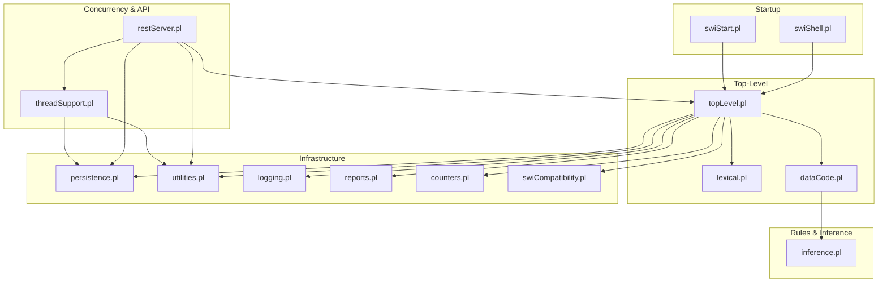
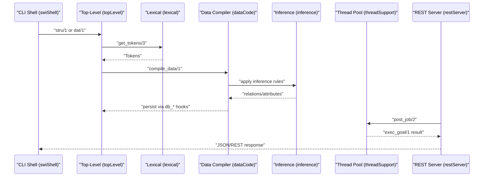
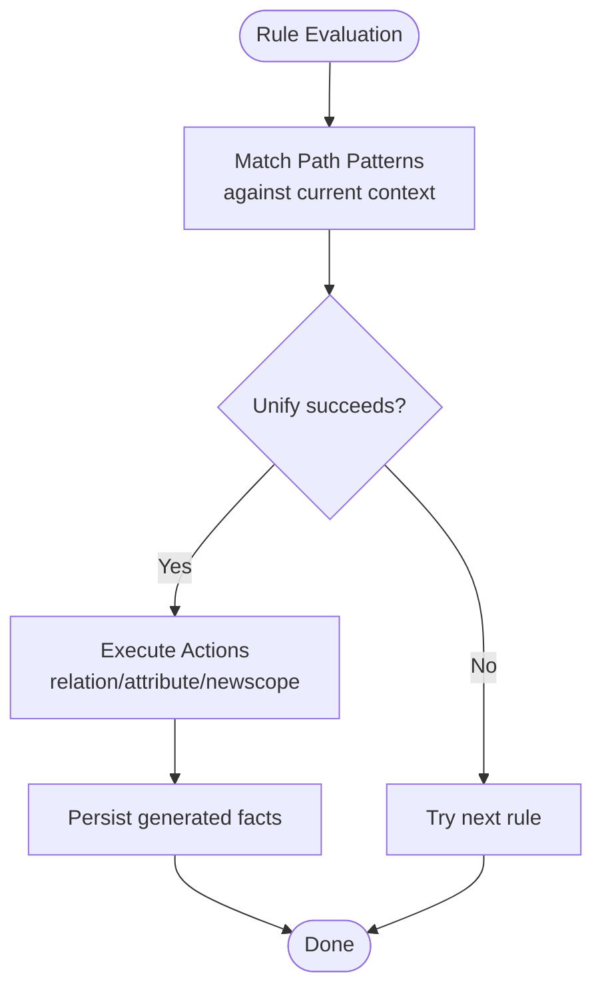
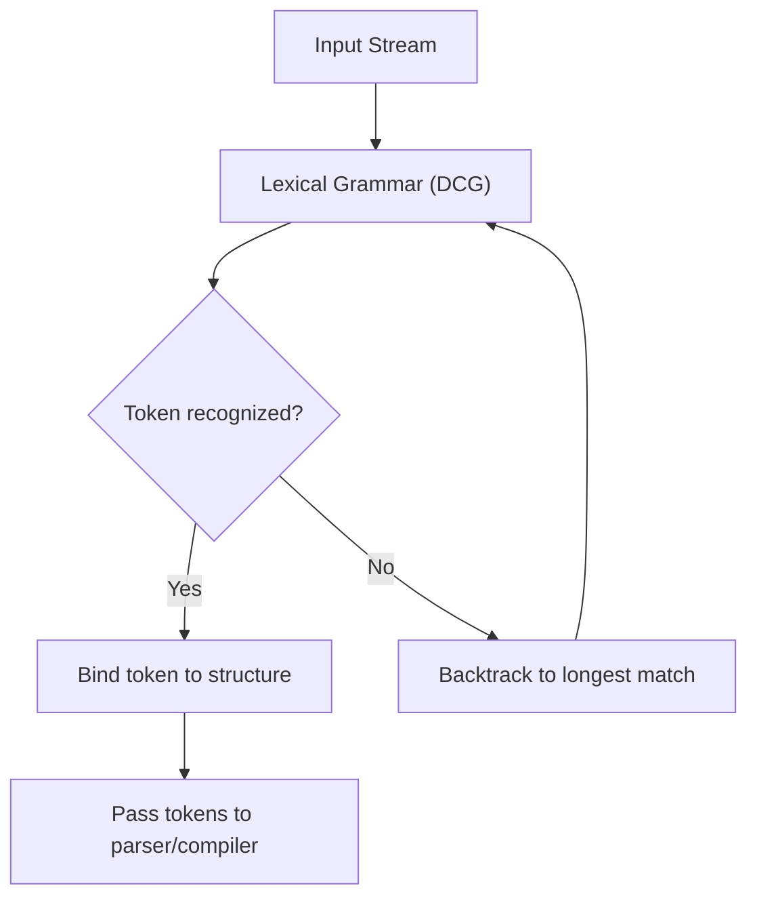
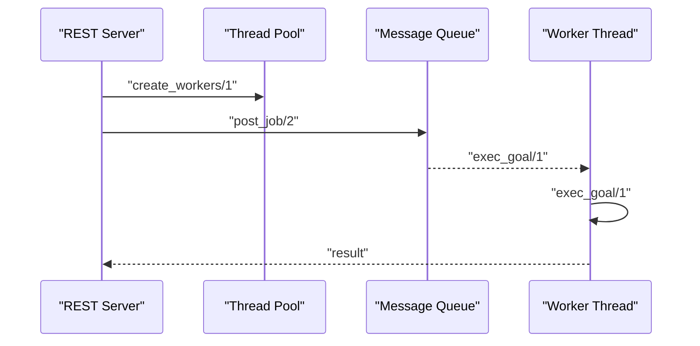
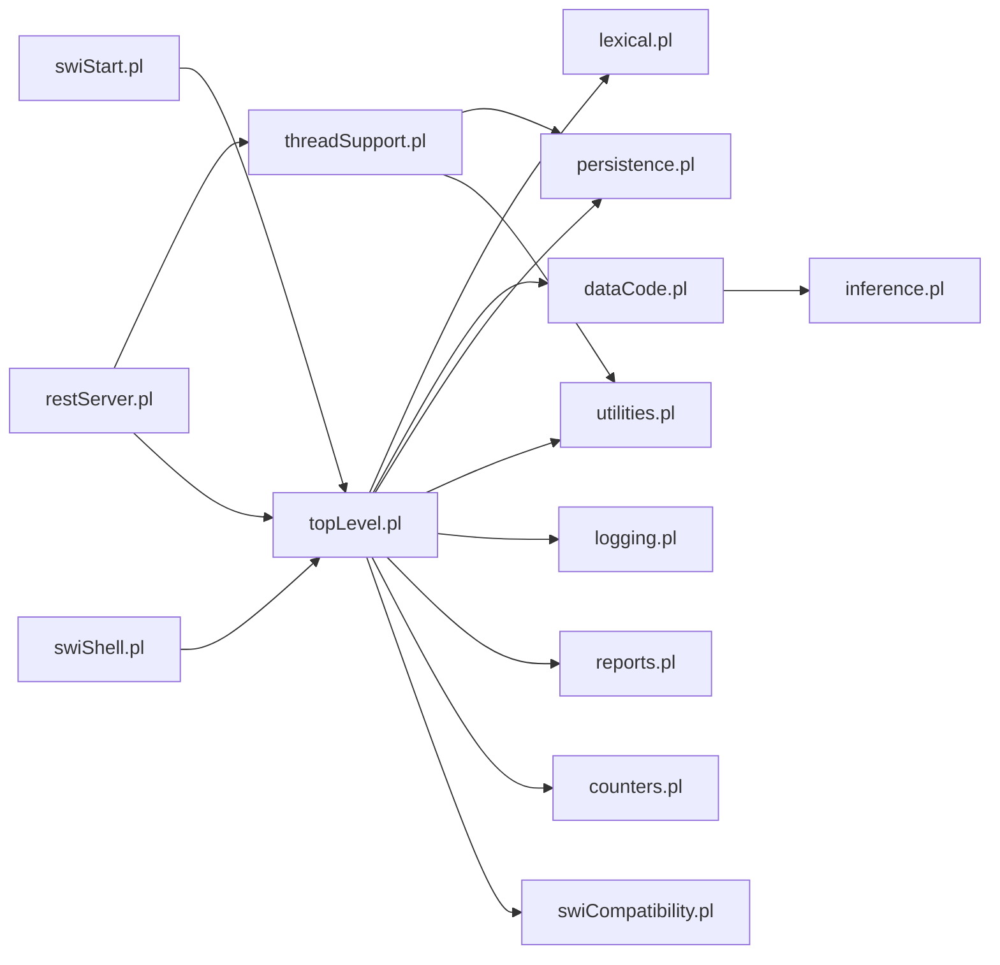

# Prolog Processing Engine

<cite>
**Referenced Files in This Document**
- [swiStart.pl](file://src/swiStart.pl)
- [swiShell.pl](file://src/swiShell.pl)
- [swiCompatibility.pl](file://src/swiCompatibility.pl)
- [threadSupport.pl](file://src/threadSupport.pl)
- [restServer.pl](file://src/restServer.pl)
- [topLevel.pl](file://src/topLevel.pl)
- [inference.pl](file://src/inference.pl)
- [utilities.pl](file://src/utilities.pl)
- [persistence.pl](file://src/persistence.pl)
- [logging.pl](file://src/logging.pl)
- [reports.pl](file://src/reports.pl)
- [counters.pl](file://src/counters.pl)
- [dataCode.pl](file://src/dataCode.pl)
- [lexical.pl](file://src/lexical.pl)
</cite>

## Table of Contents
1. [Introduction](#introduction)
2. [Project Structure](#project-structure)
3. [Core Components](#core-components)
4. [Architecture Overview](#architecture-overview)
5. [Detailed Component Analysis](#detailed-component-analysis)
6. [Dependency Analysis](#dependency-analysis)
7. [Performance Considerations](#performance-considerations)
8. [Troubleshooting Guide](#troubleshooting-guide)
9. [Conclusion](#conclusion)

## Introduction
This document explains the Prolog processing engine that powers the Kleio translation system. It focuses on how SWI-Prolog’s runtime, modules, and concurrency model are orchestrated to parse, validate, and translate Kleio data files into structured knowledge. It covers the rule-based inference system, unification and backtracking mechanisms, thread safety and concurrent processing, modular design across Prolog modules, predicate systems, data structures, memory management, compatibility layers, and integration with external utilities.

## Project Structure
The Prolog engine is organized around a layered architecture:
- Startup and shell entry points
- Top-level orchestration for structure and data processing
- Lexical analysis and tokenization
- Data compilation and storage
- Rule-based inference engine
- Concurrency and REST server
- Persistence, logging, reporting, and counters

**Diagram sources**
- [swiStart.pl](file://src/swiStart.pl#L1-L4)
- [swiShell.pl](file://src/swiShell.pl#L1-L194)
- [topLevel.pl](file://src/topLevel.pl#L1-L286)
- [lexical.pl](file://src/lexical.pl#L1-L200)
- [dataCode.pl](file://src/dataCode.pl#L1-L200)
- [inference.pl](file://src/inference.pl#L1-L800)
- [threadSupport.pl](file://src/threadSupport.pl#L1-L153)
- [restServer.pl](file://src/restServer.pl#L1-L800)
- [persistence.pl](file://src/persistence.pl#L1-L392)
- [utilities.pl](file://src/utilities.pl#L1-L371)
- [logging.pl](file://src/logging.pl#L1-L161)
- [reports.pl](file://src/reports.pl#L1-L136)
- [counters.pl](file://src/counters.pl#L1-L94)
- [swiCompatibility.pl](file://src/swiCompatibility.pl#L1-L409)

**Section sources**
- [swiStart.pl](file://src/swiStart.pl#L1-L4)
- [swiShell.pl](file://src/swiShell.pl#L1-L194)
- [topLevel.pl](file://src/topLevel.pl#L1-L286)

## Core Components
- SWI-Prolog startup and shell: The engine boots via a minimal startup file and exposes a shell for translating structure and data files.
- Top-level orchestrator: Manages initialization, file reading, tokenization, and dispatch to parsers and compilers.
- Lexical analyzer: Converts input streams into tokens for both command and data files.
- Data compiler: Builds in-memory structures and persists results through database hooks.
- Inference engine: Implements rule-based automatic relations and attributes using Prolog unification and backtracking.
- Concurrency and REST: Provides a thread pool and message queues for parallel translation jobs and a JSON-RPC/REST API surface.
- Infrastructure: Persistence, utilities, logging, reporting, counters, and compatibility layers.

**Section sources**
- [topLevel.pl](file://src/topLevel.pl#L34-L286)
- [lexical.pl](file://src/lexical.pl#L27-L200)
- [dataCode.pl](file://src/dataCode.pl#L1-L200)
- [inference.pl](file://src/inference.pl#L1-L800)
- [threadSupport.pl](file://src/threadSupport.pl#L1-L153)
- [restServer.pl](file://src/restServer.pl#L1-L800)
- [persistence.pl](file://src/persistence.pl#L1-L392)
- [utilities.pl](file://src/utilities.pl#L1-L371)
- [logging.pl](file://src/logging.pl#L1-L161)
- [reports.pl](file://src/reports.pl#L1-L136)
- [counters.pl](file://src/counters.pl#L1-L94)
- [swiCompatibility.pl](file://src/swiCompatibility.pl#L1-L409)

## Architecture Overview
The engine follows a pipeline:
- Input files are read line-by-line by the top-level.
- Tokens are produced by the lexical analyzer.
- For structure files, the top-level compiles definitions; for data files, the compiler constructs in-memory records and invokes inference rules.
- Inference rules unify against the current context and generate relations/attributes.
- Parallelism is achieved via a thread pool and message queues; the REST server dispatches jobs and returns results.

**Diagram sources**
- [swiShell.pl](file://src/swiShell.pl#L71-L151)
- [topLevel.pl](file://src/topLevel.pl#L102-L160)
- [lexical.pl](file://src/lexical.pl#L27-L74)
- [dataCode.pl](file://src/dataCode.pl#L75-L96)
- [inference.pl](file://src/inference.pl#L1-L800)
- [threadSupport.pl](file://src/threadSupport.pl#L104-L124)
- [restServer.pl](file://src/restServer.pl#L491-L515)

## Detailed Component Analysis

### Rule-Based Inference Engine
The inference module defines a DSL-like syntax for automatic relation and attribute generation. It uses operator declarations and pattern matching to define conditions and actions.

Key characteristics:
- Operators define a readable rule syntax with precedence for sequencing, conjunction, and disjunction.
- Conditions are expressed as path patterns that unify against the current context (groups, actors, scopes).
- Actions generate relations or attributes with typed identifiers.

**Diagram sources**
- [inference.pl](file://src/inference.pl#L1-L800)

Examples of usage patterns:
- Parent-child relations inferred from hierarchical patterns.
- Marriage and spouse relations inferred from couples.
- Automatic generation of attributes for marital status and death indicators.

**Section sources**
- [inference.pl](file://src/inference.pl#L1-L800)

### Unification and Backtracking Search
Unification is central to both lexical analysis and inference:
- Lexical grammar uses definite clause grammar (DCG) to recognize tokens and structure.
- Inference rules rely on pattern unification to bind variables and trigger actions.
- Backtracking occurs implicitly in rule evaluation and DCG parsing.

**Diagram sources**
- [lexical.pl](file://src/lexical.pl#L96-L122)

**Section sources**
- [lexical.pl](file://src/lexical.pl#L27-L200)

### Concurrent Processing and Thread Safety
The system supports parallel translation via a thread pool and message queues. Thread safety is ensured through:
- Thread-local storage for counters and values.
- Shared storage guarded by mutexes for cross-thread state.
- Message queues for job distribution and result handling.

**Diagram sources**
- [threadSupport.pl](file://src/threadSupport.pl#L41-L68)
- [restServer.pl](file://src/restServer.pl#L330-L342)

Thread safety mechanisms:
- Thread-local counters and values via persistent variables.
- Shared state protected by mutexes for remembered values and properties.
- Atomic operations for shared counts and queues.

**Section sources**
- [threadSupport.pl](file://src/threadSupport.pl#L1-L153)
- [persistence.pl](file://src/persistence.pl#L42-L66)
- [persistence.pl](file://src/persistence.pl#L80-L101)
- [persistence.pl](file://src/persistence.pl#L131-L143)

### Modular Design and Predicate System
The system is split into focused modules:
- Top-level orchestration and file I/O
- Lexical analysis and tokenization
- Data compilation and persistence hooks
- Inference rules
- Concurrency and REST server
- Infrastructure (persistence, utilities, logging, reporting, counters, compatibility)

Each module exports a focused predicate interface, enabling loose coupling and testability.

**Section sources**
- [topLevel.pl](file://src/topLevel.pl#L34-L57)
- [lexical.pl](file://src/lexical.pl#L1-L26)
- [dataCode.pl](file://src/dataCode.pl#L1-L48)
- [inference.pl](file://src/inference.pl#L1-L7)
- [restServer.pl](file://src/restServer.pl#L1-L22)
- [threadSupport.pl](file://src/threadSupport.pl#L2-L10)
- [persistence.pl](file://src/persistence.pl#L1-L16)
- [utilities.pl](file://src/utilities.pl#L1-L24)
- [logging.pl](file://src/logging.pl#L1-L17)
- [reports.pl](file://src/reports.pl#L1-L9)
- [counters.pl](file://src/counters.pl#L1-L11)
- [swiCompatibility.pl](file://src/swiCompatibility.pl#L2-L27)

### Data Structures and Memory Management
- In-memory data structures are managed through a current data structure (CDS) abstraction, initialized per file and flushed per group.
- Relations and attributes are persisted via database hooks invoked during group closure.
- Counters and shared values are maintained in persistent variables with thread-local and shared variants.

Memory management:
- Dynamic predicates and persistent variables are used for counters and shared state.
- Streams and file handles are opened/closed via compatibility predicates to ensure portability.

**Section sources**
- [dataCode.pl](file://src/dataCode.pl#L53-L70)
- [dataCode.pl](file://src/dataCode.pl#L140-L153)
- [counters.pl](file://src/counters.pl#L23-L46)
- [persistence.pl](file://src/persistence.pl#L33-L66)
- [swiCompatibility.pl](file://src/swiCompatibility.pl#L205-L236)

### Compatibility Layers and Platform Considerations
A dedicated compatibility module bridges differences across platforms and SWI-Prolog versions:
- File handling predicates for reading/writing and path separators
- Time and date utilities
- String and list manipulation helpers
- Thread-safe remembered values and properties

These predicates ensure consistent behavior across environments.

**Section sources**
- [swiCompatibility.pl](file://src/swiCompatibility.pl#L1-L409)

### Integration Between Prolog Rules and External Utilities
- REST server integrates with the translation pipeline by posting jobs to the thread pool and invoking top-level predicates.
- Logging and reporting modules provide structured output and diagnostics.
- Utility predicates support string operations, symbol generation, and list manipulations used throughout the pipeline.

**Section sources**
- [restServer.pl](file://src/restServer.pl#L491-L515)
- [logging.pl](file://src/logging.pl#L98-L119)
- [reports.pl](file://src/reports.pl#L84-L106)
- [utilities.pl](file://src/utilities.pl#L155-L172)

## Dependency Analysis
The following diagram highlights key module dependencies:

**Diagram sources**
- [swiStart.pl](file://src/swiStart.pl#L1-L4)
- [swiShell.pl](file://src/swiShell.pl#L1-L194)
- [topLevel.pl](file://src/topLevel.pl#L1-L286)
- [lexical.pl](file://src/lexical.pl#L1-L200)
- [dataCode.pl](file://src/dataCode.pl#L1-L200)
- [inference.pl](file://src/inference.pl#L1-L800)
- [threadSupport.pl](file://src/threadSupport.pl#L1-L153)
- [restServer.pl](file://src/restServer.pl#L1-L800)
- [persistence.pl](file://src/persistence.pl#L1-L392)
- [utilities.pl](file://src/utilities.pl#L1-L371)
- [logging.pl](file://src/logging.pl#L1-L161)
- [reports.pl](file://src/reports.pl#L1-L136)
- [counters.pl](file://src/counters.pl#L1-L94)
- [swiCompatibility.pl](file://src/swiCompatibility.pl#L1-L409)

**Section sources**
- [swiStart.pl](file://src/swiStart.pl#L1-L4)
- [swiShell.pl](file://src/swiShell.pl#L1-L194)
- [topLevel.pl](file://src/topLevel.pl#L1-L286)
- [restServer.pl](file://src/restServer.pl#L1-L800)

## Performance Considerations
- Use the thread pool to parallelize independent translation tasks; tune worker count based on CPU cores and I/O patterns.
- Prefer message queues for load distribution; monitor queue depth and processing latency.
- Enable profiling selectively around hotspots (e.g., data compilation) using timing predicates exposed in compatibility helpers.
- Minimize global mutable state; leverage thread-local counters and values to reduce contention.
- Keep rule sets concise and ordered to reduce backtracking; anchor patterns early to prune search space.

[No sources needed since this section provides general guidance]

## Troubleshooting Guide
- Debugging: Use logging predicates to capture timestamps, levels, and backtraces. The logging module supports configurable destinations and levels.
- Reporting: Use the reporting module to write structured logs to files and optionally to console.
- Error handling: The top-level and REST server wrap execution in catch/throw blocks to return standardized error responses.
- Concurrency: Inspect thread pools and queues via provided predicates to diagnose bottlenecks or deadlocks.

**Section sources**
- [logging.pl](file://src/logging.pl#L98-L119)
- [reports.pl](file://src/reports.pl#L84-L106)
- [restServer.pl](file://src/restServer.pl#L491-L515)
- [threadSupport.pl](file://src/threadSupport.pl#L126-L135)

## Conclusion
The Kleio Prolog processing engine leverages SWI-Prolog’s powerful unification and backtracking to implement a robust, modular translation pipeline. Through careful separation of concerns—lexing, compiling, inferring, persisting, and serving—the system achieves scalability via concurrency and maintainability via modularity. Compatibility layers ensure portability, while logging, reporting, and counters provide operational visibility.