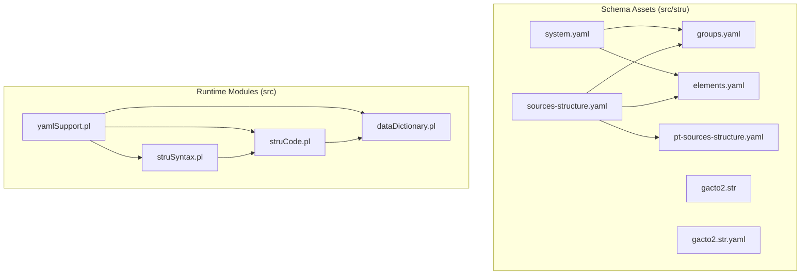
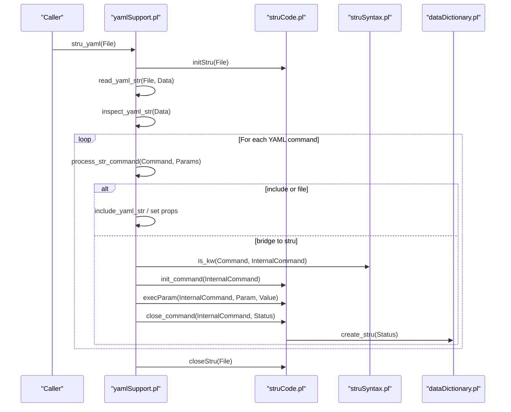
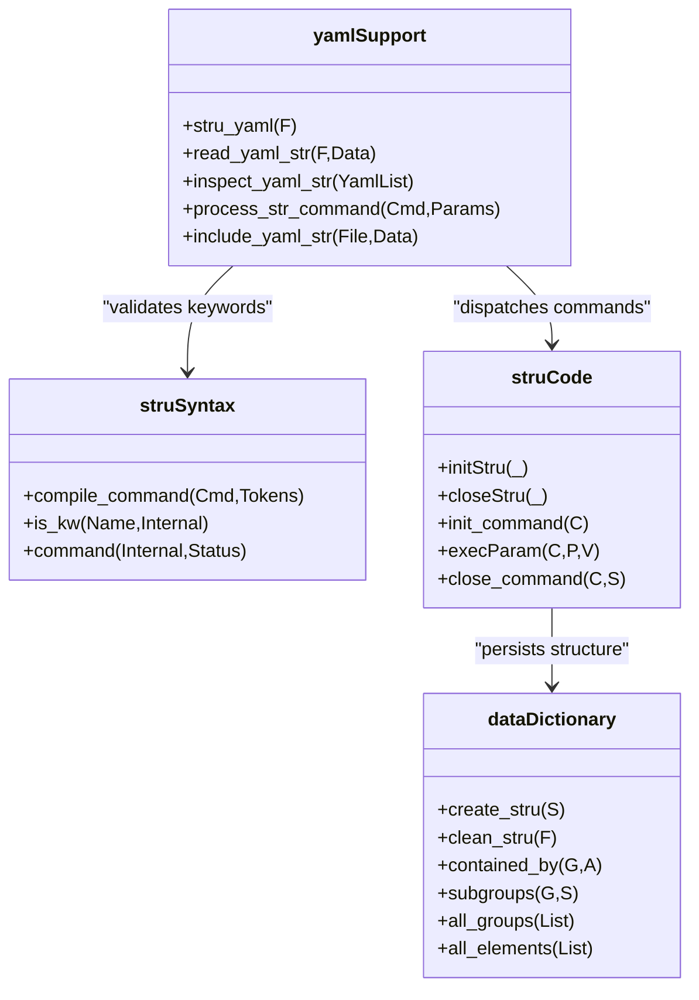
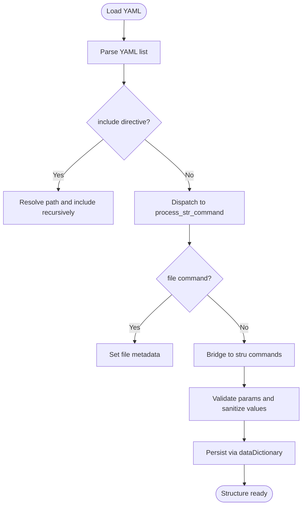
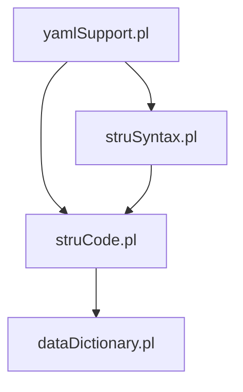

# Schema Management and Structure Definitions

<cite>
**Referenced Files in This Document**
- [README.md](file://src/stru/README.md)
- [gacto2.str](file://src/stru/gacto2.str)
- [gacto2.str.yaml](file://src/stru/gacto2.str.yaml)
- [groups.yaml](file://src/stru/groups.yaml)
- [elements.yaml](file://src/stru/elements.yaml)
- [sources-structure.yaml](file://src/stru/sources-structure.yaml)
- [system.yaml](file://src/stru/system.yaml)
- [yamlSupport.pl](file://src/yamlSupport.pl)
- [struCode.pl](file://src/struCode.pl)
- [struSyntax.pl](file://src/struSyntax.pl)
- [dataDictionary.pl](file://src/dataDictionary.pl)
</cite>

## Table of Contents
1. Introduction
2. Project Structure
3. Core Components
4. Architecture Overview
5. Detailed Component Analysis
6. Dependency Analysis
7. Performance Considerations
8. Troubleshooting Guide
9. Conclusion
10. Appendices

## Introduction
This document explains how Kleio manages schemas for historical data, covering both the legacy .str format and the modern YAML-based schema system. It details file organization, group hierarchies, element definitions, positional and named elements, validation rules, inheritance patterns, and best practices for organizing large schema collections. It also clarifies how schema definitions influence runtime behavior, provides examples of complex structures, outlines migration strategies from .str to YAML, and addresses versioning, testing, and troubleshooting.

## Project Structure
The schema assets are primarily located under src/stru. The default entry point is sources-structure.yaml, which composes core groups and elements and includes domain-specific extensions. A legacy gacto2.str remains as a reference implementation and baseline for compatibility.

**Diagram sources**
- [sources-structure.yaml:1-10](file://src/stru/sources-structure.yaml#L1-L10)
- [system.yaml:1-4](file://src/stru/system.yaml#L1-L4)
- [groups.yaml:1-686](file://src/stru/groups.yaml#L1-L686)
- [elements.yaml:1-305](file://src/stru/elements.yaml#L1-L305)
- [gacto2.str:1-800](file://src/stru/gacto2.str#L1-L800)
- [gacto2.str.yaml:1-800](file://src/stru/gacto2.str.yaml#L1-L800)
- [yamlSupport.pl:1-200](file://src/yamlSupport.pl#L1-L200)
- [struCode.pl:1-200](file://src/struCode.pl#L1-L200)
- [struSyntax.pl:1-200](file://src/struSyntax.pl#L1-L200)
- [dataDictionary.pl:1-200](file://src/dataDictionary.pl#L1-L200)

**Section sources**
- [README.md:1-7](file://src/stru/README.md#L1-L7)
- [sources-structure.yaml:1-10](file://src/stru/sources-structure.yaml#L1-L10)
- [system.yaml:1-4](file://src/stru/system.yaml#L1-L4)

## Core Components
- Legacy .str format:
  - Uses commands like database, part, element, note, etc., to define top-level containers, groups, and base elements.
  - Example references:
    - Top-level database command and kleio container
    - Base elements such as number, string64, string256, text
    - Date-related elements day, month, year, date
    - Identification and cross-reference elements id, same_as, xsame_as
    - Groups like kleio, historical-source, authority-register, identifications, link, property
    - Event and act groups event, historical-act, cevent
    - Person/object abstractions person, female, male, object, abstraction, topic
    - Attribute/relation constructs attribute, relation
    - End marker end and group-element pseudo-group
- Modern YAML format:
  - Composed via include directives referencing elements.yaml and groups.yaml.
  - groups.yaml defines core groups with fields such as name, description, position, guaranteed, also, contains/source/idprefix.
  - elements.yaml defines base elements and their semantics (e.g., id, same_as, xsame_as, type, value, loc, ref, pages, obs, summary, control elements).
  - sources-structure.yaml is the default structure that includes elements.yaml, groups.yaml, and pt-sources-structure.yaml.
  - system.yaml provides a minimal base including groups.yaml and elements.yaml.

Key behaviors driven by schema:
- Positional vs named elements: position lists allow shorthand positional notation; guaranteed enforces presence; also allows optional elements.
- Inheritance via source: groups extend other groups, inheriting parameters unless overridden.
- Containment via contains/part: restricts valid nested groups.
- ID prefixes via idprefix: standardizes generated IDs per group.
- Control elements (e.g., prefix, structure, translations, translator) affect parsing and processing.

**Section sources**
- [gacto2.str:29-100](file://src/stru/gacto2.str#L29-L100)
- [gacto2.str:111-166](file://src/stru/gacto2.str#L111-L166)
- [gacto2.str:170-202](file://src/stru/gacto2.str#L170-L202)
- [gacto2.str:204-257](file://src/stru/gacto2.str#L204-L257)
- [gacto2.str:265-305](file://src/stru/gacto2.str#L265-L305)
- [gacto2.str:311-366](file://src/stru/gacto2.str#L311-L366)
- [gacto2.str:370-415](file://src/stru/gacto2.str#L370-L415)
- [gacto2.str:426-514](file://src/stru/gacto2.str#L426-L514)
- [gacto2.str:518-578](file://src/stru/gacto2.str#L518-L578)
- [gacto2.str:587-610](file://src/stru/gacto2.str#L587-L610)
- [gacto2.str:617-642](file://src/stru/gacto2.str#L617-L642)
- [gacto2.str:652-668](file://src/stru/gacto2.str#L652-L668)
- [gacto2.str:677-694](file://src/stru/gacto2.str#L677-L694)
- [gacto2.str:700-728](file://src/stru/gacto2.str#L700-L728)
- [gacto2.str:733-747](file://src/stru/gacto2.str#L733-L747)
- [gacto2.str:751-767](file://src/stru/gacto2.str#L751-L767)
- [gacto2.str:777-794](file://src/stru/gacto2.str#L777-L794)
- [gacto2.str:798-800](file://src/stru/gacto2.str#L798-L800)
- [groups.yaml:69-133](file://src/stru/groups.yaml#L69-L133)
- [groups.yaml:141-176](file://src/stru/groups.yaml#L141-L176)
- [groups.yaml:178-216](file://src/stru/groups.yaml#L178-L216)
- [groups.yaml:219-292](file://src/stru/groups.yaml#L219-L292)
- [groups.yaml:294-350](file://src/stru/groups.yaml#L294-L350)
- [groups.yaml:354-397](file://src/stru/groups.yaml#L354-L397)
- [groups.yaml:454-480](file://src/stru/groups.yaml#L454-L480)
- [groups.yaml:481-522](file://src/stru/groups.yaml#L481-L522)
- [groups.yaml:524-569](file://src/stru/groups.yaml#L524-L569)
- [groups.yaml:571-638](file://src/stru/groups.yaml#L571-L638)
- [groups.yaml:639-686](file://src/stru/groups.yaml#L639-L686)
- [elements.yaml:39-84](file://src/stru/elements.yaml#L39-L84)
- [elements.yaml:86-115](file://src/stru/elements.yaml#L86-L115)
- [elements.yaml:129-178](file://src/stru/elements.yaml#L129-L178)
- [elements.yaml:182-219](file://src/stru/elements.yaml#L182-L219)
- [elements.yaml:221-296](file://src/stru/elements.yaml#L221-L296)
- [elements.yaml:298-305](file://src/stru/elements.yaml#L298-L305)
- [sources-structure.yaml:1-10](file://src/stru/sources-structure.yaml#L1-L10)
- [system.yaml:1-4](file://src/stru/system.yaml#L1-L4)

## Architecture Overview
The YAML schema loader bridges YAML definitions into the existing stru parser pipeline. It reads YAML, normalizes values, dispatches commands, and persists the resulting internal representation used at runtime.

**Diagram sources**
- [yamlSupport.pl:28-46](file://src/yamlSupport.pl#L28-L46)
- [yamlSupport.pl:49-72](file://src/yamlSupport.pl#L49-L72)
- [yamlSupport.pl:75-91](file://src/yamlSupport.pl#L75-L91)
- [yamlSupport.pl:95-100](file://src/yamlSupport.pl#L95-L100)
- [yamlSupport.pl:102-116](file://src/yamlSupport.pl#L102-L116)
- [yamlSupport.pl:119-129](file://src/yamlSupport.pl#L119-L129)
- [yamlSupport.pl:132-140](file://src/yamlSupport.pl#L132-L140)
- [yamlSupport.pl:159-168](file://src/yamlSupport.pl#L159-L168)
- [yamlSupport.pl:174-177](file://src/yamlSupport.pl#L174-L177)
- [struCode.pl:64-68](file://src/struCode.pl#L64-L68)
- [struCode.pl:80-82](file://src/struCode.pl#L80-L82)
- [struCode.pl:91-94](file://src/struCode.pl#L91-L94)
- [struCode.pl:105-109](file://src/struCode.pl#L105-L109)
- [struSyntax.pl:48-58](file://src/struSyntax.pl#L48-L58)
- [struSyntax.pl:74-101](file://src/struSyntax.pl#L74-L101)
- [dataDictionary.pl:118-126](file://src/dataDictionary.pl#L118-L126)

## Detailed Component Analysis

### Legacy .str Format
- Purpose: Defines the canonical structure using commands like database, part, element, note.
- Key concepts:
  - database: sets top-level container and identification mode.
  - part: defines groups with position, guaranteed, also, arbitrary, repeat, and source inheritance.
  - element: declares base types and aliases, often with source=... to specialize.
  - note/doc: documentation embedded in the file.
- Examples:
  - Top-level kleio container and parts
  - Historical source and act/event groups
  - Authority registers and identifications
  - Person/object abstractions and relations
  - End markers and group-element pseudo-groups

Best practices:
- Use source=... to inherit and override only what changes.
- Keep position lists minimal and explicit for readability.
- Use guaranteed to enforce required fields.
- Prefer descriptive names and consistent idprefix usage.

**Section sources**
- [gacto2.str:29-100](file://src/stru/gacto2.str#L29-L100)
- [gacto2.str:111-166](file://src/stru/gacto2.str#L111-L166)
- [gacto2.str:170-202](file://src/stru/gacto2.str#L170-L202)
- [gacto2.str:204-257](file://src/stru/gacto2.str#L204-L257)
- [gacto2.str:265-305](file://src/stru/gacto2.str#L265-L305)
- [gacto2.str:311-366](file://src/stru/gacto2.str#L311-L366)
- [gacto2.str:370-415](file://src/stru/gacto2.str#L370-L415)
- [gacto2.str:426-514](file://src/stru/gacto2.str#L426-L514)
- [gacto2.str:518-578](file://src/stru/gacto2.str#L518-L578)
- [gacto2.str:587-610](file://src/stru/gacto2.str#L587-L610)
- [gacto2.str:617-642](file://src/stru/gacto2.str#L617-L642)
- [gacto2.str:652-668](file://src/stru/gacto2.str#L652-L668)
- [gacto2.str:677-694](file://src/stru/gacto2.str#L677-L694)
- [gacto2.str:700-728](file://src/stru/gacto2.str#L700-L728)
- [gacto2.str:733-747](file://src/stru/gacto2.str#L733-L747)
- [gacto2.str:751-767](file://src/stru/gacto2.str#L751-L767)
- [gacto2.str:777-794](file://src/stru/gacto2.str#L777-L794)
- [gacto2.str:798-800](file://src/stru/gacto2.str#L798-L800)

### Modern YAML Schemas
- Composition model:
  - sources-structure.yaml includes elements.yaml, groups.yaml, and domain-specific files.
  - system.yaml provides a minimal base.
- Group definition keys:
  - name, description, position, guaranteed, also, contains/source/idprefix.
- Element definition keys:
  - name, description, source, identification/type hints.
- Behavior mapping:
  - position enables positional shorthand in data files.
  - guaranteed enforces presence during validation.
  - also permits optional elements.
  - contains/part constrains nesting.
  - source implements inheritance.
  - idprefix standardizes generated IDs.

Complex structures:
- Hierarchical geo entities (geo1..geo4) nested within geodesc.
- Relation-type and attribute-list groups for specialized behaviors.
- End marker end for scoping and inference triggers.

**Section sources**
- [sources-structure.yaml:1-10](file://src/stru/sources-structure.yaml#L1-L10)
- [system.yaml:1-4](file://src/stru/system.yaml#L1-L4)
- [groups.yaml:1-686](file://src/stru/groups.yaml#L1-L686)
- [elements.yaml:1-305](file://src/stru/elements.yaml#L1-L305)

### Runtime Processing Pipeline
- yamlSupport.pl:
  - Reads YAML, tracks included files, inspects commands, sanitizes values, and bridges to stru pipeline.
  - Handles include and file metadata commands.
- struSyntax.pl:
  - Grammar for legacy commands; used to validate and translate YAML commands to internal forms.
- struCode.pl:
  - Initializes/closes commands, executes parameter handling, and finalizes structure creation.
- dataDictionary.pl:
  - Persists group/element definitions, supports containment queries, defaults, and introspection.

**Diagram sources**
- [yamlSupport.pl:1-200](file://src/yamlSupport.pl#L1-L200)
- [struSyntax.pl:1-200](file://src/struSyntax.pl#L1-L200)
- [struCode.pl:1-200](file://src/struCode.pl#L1-L200)
- [dataDictionary.pl:1-200](file://src/dataDictionary.pl#L1-L200)

**Section sources**
- [yamlSupport.pl:28-46](file://src/yamlSupport.pl#L28-L46)
- [yamlSupport.pl:49-72](file://src/yamlSupport.pl#L49-L72)
- [yamlSupport.pl:95-100](file://src/yamlSupport.pl#L95-L100)
- [yamlSupport.pl:119-129](file://src/yamlSupport.pl#L119-L129)
- [yamlSupport.pl:132-140](file://src/yamlSupport.pl#L132-L140)
- [yamlSupport.pl:159-168](file://src/yamlSupport.pl#L159-L168)
- [struSyntax.pl:48-58](file://src/struSyntax.pl#L48-L58)
- [struSyntax.pl:74-101](file://src/struSyntax.pl#L74-L101)
- [struCode.pl:64-68](file://src/struCode.pl#L64-L68)
- [struCode.pl:80-82](file://src/struCode.pl#L80-L82)
- [struCode.pl:91-94](file://src/struCode.pl#L91-L94)
- [struCode.pl:105-109](file://src/struCode.pl#L105-L109)
- [dataDictionary.pl:118-126](file://src/dataDictionary.pl#L118-L126)

### Validation Rules and Inheritance Patterns
- Validation:
  - guaranteed fields must be present.
  - position controls allowed positional order.
  - also allows additional optional fields.
  - contains/part restricts nested groups.
- Inheritance:
  - source=GroupName copies inherited properties unless overridden.
  - Specialization adds new position/guaranteed/also/contains while retaining base semantics.
- Containment inference:
  - contained_by and subgroups support ancestor queries and hierarchy traversal.

**Diagram sources**
- [yamlSupport.pl:49-72](file://src/yamlSupport.pl#L49-L72)
- [yamlSupport.pl:102-116](file://src/yamlSupport.pl#L102-L116)
- [yamlSupport.pl:119-129](file://src/yamlSupport.pl#L119-L129)
- [yamlSupport.pl:132-140](file://src/yamlSupport.pl#L132-L140)
- [yamlSupport.pl:159-168](file://src/yamlSupport.pl#L159-L168)
- [dataDictionary.pl:118-126](file://src/dataDictionary.pl#L118-L126)

**Section sources**
- [groups.yaml:69-133](file://src/stru/groups.yaml#L69-L133)
- [groups.yaml:141-176](file://src/stru/groups.yaml#L141-L176)
- [groups.yaml:219-292](file://src/stru/groups.yaml#L219-L292)
- [groups.yaml:294-350](file://src/stru/groups.yaml#L294-L350)
- [groups.yaml:354-397](file://src/stru/groups.yaml#L354-L397)
- [groups.yaml:454-480](file://src/stru/groups.yaml#L454-L480)
- [groups.yaml:481-522](file://src/stru/groups.yaml#L481-L522)
- [groups.yaml:524-569](file://src/stru/groups.yaml#L524-L569)
- [groups.yaml:571-638](file://src/stru/groups.yaml#L571-L638)
- [groups.yaml:639-686](file://src/stru/groups.yaml#L639-L686)
- [elements.yaml:39-84](file://src/stru/elements.yaml#L39-L84)
- [elements.yaml:86-115](file://src/stru/elements.yaml#L86-L115)
- [elements.yaml:129-178](file://src/stru/elements.yaml#L129-L178)
- [elements.yaml:182-219](file://src/stru/elements.yaml#L182-L219)
- [elements.yaml:221-296](file://src/stru/elements.yaml#L221-L296)
- [elements.yaml:298-305](file://src/stru/elements.yaml#L298-L305)
- [dataDictionary.pl:118-126](file://src/dataDictionary.pl#L118-L126)

### Relationship Between Schema Definitions and Runtime Behavior
- Positional elements enable compact data notation without explicit element names.
- Guaranteed fields drive validation errors when missing.
- Contains/part constrain valid nesting, preventing malformed structures.
- idprefix influences generated identifiers, aiding uniqueness and traceability.
- Control elements (prefix, structure, translations, translator) alter parsing/export behavior.
- End marker triggers inference and export boundaries.

**Section sources**
- [groups.yaml:481-522](file://src/stru/groups.yaml#L481-L522)
- [elements.yaml:221-296](file://src/stru/elements.yaml#L221-L296)

### Migration Strategy from .str to YAML
- Step-by-step:
  1. Identify core groups and elements in gacto2.str.
  2. Map them to YAML groups.yaml and elements.yaml entries using source inheritance where possible.
  3. Create sources-structure.yaml to include elements.yaml, groups.yaml, and domain-specific files.
  4. Validate with yamlSupport.pl and ensure no warnings/errors.
  5. Compare outputs between gacto2.str and gacto2.str.yaml to confirm equivalence.
- Tips:
  - Preserve position and guaranteed semantics.
  - Maintain idprefix consistency.
  - Use includes to modularize large schemas.

**Section sources**
- [gacto2.str:29-100](file://src/stru/gacto2.str#L29-L100)
- [gacto2.str.yaml:1-800](file://src/stru/gacto2.str.yaml#L1-L800)
- [sources-structure.yaml:1-10](file://src/stru/sources-structure.yaml#L1-L10)

### Versioning and Testing Approaches
- Versioning:
  - Embed metadata in file headers (version/build/date) for traceability.
  - Keep parallel versions under structured directories (e.g., deprecated, in_process).
- Testing:
  - Use small focused YAML schemas for unit tests.
  - Leverage yamlSupport tests and compare outputs across formats.
  - Track error/warning counts after loading schemas.

**Section sources**
- [gacto2.str:1-7](file://src/stru/gacto2.str#L1-L7)
- [yamlSupport.pl:199-200](file://src/yamlSupport.pl#L199-L200)

### Troubleshooting Schema-Related Issues
- Common issues:
  - Unknown commands in YAML: check spelling and supported commands.
  - Duplicate includes: previously processed files are ignored with warnings.
  - Missing guaranteed fields: validation fails; add required elements.
  - Invalid nesting: ensure contains/part constraints are respected.
- Diagnostics:
  - Inspect error/warning counts after loading.
  - Review stack traces and file context provided by error reporting.

**Section sources**
- [yamlSupport.pl:54-72](file://src/yamlSupport.pl#L54-L72)
- [yamlSupport.pl:153-157](file://src/yamlSupport.pl#L153-L157)
- [yamlSupport.pl:43-46](file://src/yamlSupport.pl#L43-L46)

## Dependency Analysis
The YAML loader depends on the stru grammar and code modules to interpret and persist schema definitions. The data dictionary centralizes group/element state and provides containment queries.

**Diagram sources**
- [yamlSupport.pl:1-200](file://src/yamlSupport.pl#L1-L200)
- [struSyntax.pl:1-200](file://src/struSyntax.pl#L1-L200)
- [struCode.pl:1-200](file://src/struCode.pl#L1-L200)
- [dataDictionary.pl:1-200](file://src/dataDictionary.pl#L1-L200)

**Section sources**
- [yamlSupport.pl:132-140](file://src/yamlSupport.pl#L132-L140)
- [struSyntax.pl:48-58](file://src/struSyntax.pl#L48-L58)
- [struCode.pl:91-94](file://src/struCode.pl#L91-L94)
- [dataDictionary.pl:118-126](file://src/dataDictionary.pl#L118-L126)

## Performance Considerations
- Minimize deep include chains; prefer flat composition via sources-structure.yaml.
- Avoid redundant definitions; leverage source inheritance.
- Use position lists judiciously to reduce ambiguity and parsing overhead.
- Cache containment queries if repeatedly traversing large hierarchies.

[No sources needed since this section provides general guidance]

## Troubleshooting Guide
- If YAML commands fail:
  - Verify command names and parameter spelling.
  - Ensure include paths resolve correctly.
- If validation errors occur:
  - Check guaranteed fields and position ordering.
  - Confirm contains/part constraints for nested groups.
- If behavior differs from .str:
  - Compare equivalent definitions in gacto2.str and gacto2.str.yaml.
  - Re-run with verbose logging to inspect processing steps.

**Section sources**
- [yamlSupport.pl:153-157](file://src/yamlSupport.pl#L153-L157)
- [yamlSupport.pl:54-72](file://src/yamlSupport.pl#L54-L72)
- [gacto2.str:29-100](file://src/stru/gacto2.str#L29-L100)
- [gacto2.str.yaml:1-800](file://src/stru/gacto2.str.yaml#L1-L800)

## Conclusion
Kleio’s schema management supports both legacy .str and modern YAML formats. YAML offers improved modularity, clarity, and maintainability through includes, inheritance, and explicit validation rules. By following best practices—clear positioning, enforced guarantees, constrained nesting, and standardized ID prefixes—you can build robust, scalable schemas that drive predictable runtime behavior. Migration from .str to YAML should preserve semantics while leveraging YAML’s compositional strengths.

[No sources needed since this section summarizes without analyzing specific files]

## Appendices

### Appendix A: Key YAML Keys Reference
- Group keys:
  - name: identifier
  - description: human-readable explanation
  - position: ordered list allowing positional shorthand
  - guaranteed: required elements
  - also: optional elements
  - contains/part: allowed nested groups
  - source: inherited group
  - idprefix: default ID prefix
- Element keys:
  - name: identifier
  - description: human-readable explanation
  - source: base element specialization
  - identification/type hints: processing hints

**Section sources**
- [groups.yaml:1-686](file://src/stru/groups.yaml#L1-L686)
- [elements.yaml:1-305](file://src/stru/elements.yaml#L1-L305)

### Appendix B: Complex Structures Examples
- Hierarchical geography:
  - geodesc containing geo1..geo4 levels with attributes and relations.
- Relation and attribute lists:
  - relation-type and attribute-list groups for specialized behaviors.
- End markers:
  - end group to delimit scopes and trigger inference.

**Section sources**
- [groups.yaml:639-686](file://src/stru/groups.yaml#L639-L686)
- [groups.yaml:571-638](file://src/stru/groups.yaml#L571-L638)
- [groups.yaml:481-522](file://src/stru/groups.yaml#L481-L522)